## **CANN** 社区版 **8.2.RC1**

## **Ascend C** 算子开发指南

文档版本 01

发布日期 2025-08-04


### 版权所有 **©** 华为技术有限公司 **2025**。 保留一切权利。

非经本公司书面许可,任何单位和个人不得擅自摘抄、复制本文档内容的部分或全部,并不得以任何形式传 播。

### 商标声明

和其他华为商标均为华为技术有限公司的商标。 本文档提及的其他所有商标或注册商标,由各自的所有人拥有。

### 注意

您购买的产品、服务或特性等应受华为公司商业合同和条款的约束,本文档中描述的全部或部分产品、服务或 特性可能不在您的购买或使用范围之内。除非合同另有约定,华为公司对本文档内容不做任何明示或暗示的声 明或保证。

由于产品版本升级或其他原因,本文档内容会不定期进行更新。除非另有约定,本文档仅作为使用指导,本文 档中的所有陈述、信息和建议不构成任何明示或暗示的担保。

## 安全声明

### 产品生命周期政策

华为公司对产品生命周期的规定以"产品生命周期终止政策"为准,该政策的详细内容请参见如下网址: <https://support.huawei.com/ecolumnsweb/zh/warranty-policy>

### 漏洞处理流程

华为公司对产品漏洞管理的规定以"漏洞处理流程"为准,该流程的详细内容请参见如下网址:

<https://www.huawei.com/cn/psirt/vul-response-process>

如企业客户须获取漏洞信息,请参见如下网址:

<https://securitybulletin.huawei.com/enterprise/cn/security-advisory>

### 华为初始证书权责说明

华为公司对随设备出厂的初始数字证书,发布了"华为设备初始数字证书权责说明",该说明的详细内容请参 见如下网址:

<https://support.huawei.com/enterprise/zh/bulletins-service/ENEWS2000015766>

## 华为企业业务最终用户许可协议**(EULA)**

本最终用户许可协议是最终用户(个人、公司或其他任何实体)与华为公司就华为软件的使用所缔结的协议。 最终用户对华为软件的使用受本协议约束,该协议的详细内容请参见如下网址: <https://e.huawei.com/cn/about/eula>

### 产品资料生命周期策略

华为公司针对随产品版本发布的售后客户资料(产品资料),发布了"产品资料生命周期策略",该策略的详 细内容请参见如下网址:

<https://support.huawei.com/enterprise/zh/bulletins-website/ENEWS2000017760>

## 目录

| 1 Ascend C 简介           | 1  |
|-------------------------|----|
| 2 环境准备                  | 4  |
| 3 快速入门                  | 6  |
| 3.1 HelloWorld          | 6  |
| 3.2 基于 Kernel 直调工程的算子开发 |    |
| 3.3 基于自定义算子工程的算子开发      | 17 |
| 4 抽象硬件架构                | 26 |
| 5 编程模型                  | 28 |
| 5.1 SPMD 模型             | 28 |
| 5.2 核函数                 | 30 |
| 5.3 编程范式                | 33 |
| 5.4 编程接口概述              | 39 |
| 6 算子实现                  | 43 |
| 6.1 概述                  | 43 |
| 6.2 矢量编程                | 44 |
| 6.2.1 概述                | 44 |
| 6.2.2 基础矢量算子            | 44 |
| 6.2.3 TBuf 的使用          | 50 |
| 6.2.4 多核&Tiling 切分      | 53 |
| 6.2.4.1 概述              | 53 |
| 6.2.4.2 多核 Tiling       | 54 |
| 6.2.4.3 尾块 Tiling       | 60 |
| 6.2.4.4 尾核 Tiling       | 63 |
| 6.2.4.5 尾核&尾块           | 66 |
| 6.2.5 DoubleBuffer 场景   | 68 |
| 6.2.6 Broadcast 场景      | 71 |
| 6.2.7 非对齐场景             | 75 |
| 6.3 矩阵编程(高阶 API)        | 85 |
| 6.3.1 基础知识              | 85 |
| 6.3.2 算子实现              |    |
| 6.3.3 特性场景              | 94 |

| 6.3.3.1 Matmul 特性介绍        | 94  |
|----------------------------|-----|
| 6.3.3.2 多核对齐切分             |     |
| 6.3.3.3 多核非对齐切分            | 98  |
| 6.3.3.4 异步场景处理             | 100 |
| 6.3.3.5 矩阵乘输出的量化/反量化       | 102 |
| 6.3.3.6 矩阵乘输出的 Channel 拆分  | 105 |
| 6.3.3.7 矩阵向量乘              | 106 |
| 6.3.3.8 4:2 稀疏矩阵乘          | 108 |
| 6.3.3.9 TSCM 输入的矩阵乘        | 111 |
| 6.3.3.10 矩阵乘输出的 N 方向对齐     | 112 |
| 6.3.3.11 单次矩阵乘局部输出         | 115 |
| 6.3.3.12 AIC 和 AIV 独立运行机制  | 117 |
| 6.3.3.13 Batch Matmul 基础功能 | 117 |
| 6.4 矩阵编程(基础 API)           | 120 |
| 6.4.1 耦合架构                 | 120 |
| 6.4.2 分离架构                 |     |
| 6.5 融合算子编程                 | 136 |
| 6.5.1 基础知识                 |     |
| 6.5.2 算子实现                 |     |
| 6.6 Kernel 直调算子开发          |     |
| 6.6.1 概述                   | 146 |
| 6.6.2 Kernel 直调            |     |
| 6.6.3 Pybind 调用            |     |
| 6.7 工程化算子开发                |     |
| 6.7.1 概述                   |     |
| 6.7.2 创建算子工程               |     |
| 6.7.3 算子原型定义               |     |
| 6.7.4 Kernel 侧算子实现         |     |
| 6.7.5 Host 侧 tiling 实现     |     |
| 6.7.6 算子包编译                |     |
| 6.7.6.1 算子工程编译             |     |
| 6.7.6.2 算子包部署              |     |
| 6.7.7 算子动态库编译              |     |
| 6.7.8 单算子 API 调用           | 198 |
| 7 算子调试调优                   | 204 |
| 7.1 孪生调试简介                 | 204 |
| 7.2 CPU 域调试                | 204 |
| 7.3 NPU 域调试调优              | 206 |
| 8 算子入图(GE 图)开发             | 208 |
| 8.1 概述                     |     |
|                            |     |
| 8.3 Tiling 下沉              |     |

| 8.4 图编译和图执行                          | 220 |
|--------------------------------------|-----|
| 9 AI 框架算子适配                          | 226 |
| 9.1 概述                               | 226 |
| 9.2 PyTorch 框架                       | 227 |
| 9.3 ONNX 框架                          |     |
| 9.3.1 适配插件开发                         | 227 |
| 9.3.2 调用样例                           | 229 |
| 9.4 TensorFlow 框架                    | 231 |
| 10 概念原理和术语                           | 244 |
| 10.1 术语表                             |     |
| 10.2 神经网络和算子                         |     |
| 10.2.1 算子基本概念                        |     |
| 10.2.2 数据排布格式                        |     |
| 10.3 硬件架构与数据处理原理                     |     |
| 10.3.1 基本架构                          | 267 |
| 10.3.2 计算单元                          |     |
| 10.3.3 存储单元                          | 272 |
| 10.3.4 控制单元                          | 274 |
| 10.4 编程模型设计原理                        | 276 |
| 10.5 性能优化技术原理                        | 281 |
| 10.5.1 DoubleBuffer                  | 281 |
| 11 常用操作                              | 283 |
| 11.1 如何开发动态输入算子                      | 283 |
| 11.2 如何在矢量编程时使能 Vector Core          | 285 |
| 11.3 如何开发通算融合算子                      | 286 |
| 11.4 如何使用 Tensor 高维切分计算 API          | 288 |
| 11.5 如何使用归约指令                        | 294 |
| 11.6 如何使用掩码操作 API                    | 296 |
| 11.7 如何使用 workspace                  | 299 |
| 11.8 如何进行 Tiling 调测                  | 300 |
| 11.9 如何使用 SPM Buffer                 | 302 |
| 11.10 如何使用更底层编程方式提升算子性能              |     |
| 11.11 如何使用 Tensor 原地操作提升算子性能         | 312 |
| 12 附录                                | 316 |
| 12.1 简易自定义算子工程                       |     |
| 12.2 show_kernel_debug_data 工具       | 321 |
| 12.3 msobjdump 工具                    | 323 |
| 13 FAQ                               | 335 |
| 13.1 核函数运行验证时算子存在精度问题                |     |
| 13.2 运行验证时 AllocTensor/FreeTensor 失败 |     |

| 13.3 kernel 侧获取 Tiling 信息不正确                           | 338 |
|--------------------------------------------------------|-----|
| 13.4 Kernel 编译时报错 "error: out of jump/jumpc imm range" | 339 |
| 13.5 使用跨版本的自定义算子包时,含有 Matmul 高阶 API 的算子存在编译或执行报错       | 339 |
| 13.6 含有 Matmul 高阶 API 的算子精度问题                          | 340 |
| 13.7 算子工程编译时出现文件名过长报错                                  | 350 |
| 13.8 调用算子时出现无法打开 config.ini 的报错                        | 351 |
| 13.9 算子包部署时出现权限不足报错                                    | 352 |
| 14 API 参考                                              | 353 |
| 14.1 Ascend C API                                      | 353 |
| 14.1.1 Ascend C API 列表                                 | 353 |
| 14.1.2 通用约束                                            | 374 |
| 14.1.3 数据类型定义                                          | 376 |
| 14.1.3.1 LocalTensor                                   | 376 |
| 14.1.3.1.1 简介                                          | 376 |
| 14.1.3.1.2 构造函数                                        | 378 |
| 14.1.3.1.3 SetValue                                    | 381 |
| 14.1.3.1.4 GetValue                                    | 382 |
| 14.1.3.1.5 operator[]                                  | 383 |
| 14.1.3.1.6 operator()                                  | 385 |
| 14.1.3.1.7 SetSize                                     | 386 |
| 14.1.3.1.8 GetSize                                     | 387 |
| 14.1.3.1.9 SetUserTag                                  | 388 |
| 14.1.3.1.10 GetUserTag                                 | 389 |
| 14.1.3.1.11 ReinterpretCast                            | 390 |
| 14.1.3.1.12 GetPhyAddr                                 | 391 |
| 14.1.3.1.13 GetPosition                                | 392 |
| 14.1.3.1.14 GetLength                                  | 392 |
| 14.1.3.1.15 SetShapeInfo                               | 393 |
| 14.1.3.1.16 GetShapeInfo                               | 394 |
| 14.1.3.1.17 SetAddrWithOffset                          | 395 |
| 14.1.3.1.18 SetBufferLen                               | 396 |
| 14.1.3.1.19 ToFile                                     | 397 |
| 14.1.3.1.20 Print                                      | 398 |
| 14.1.3.2 GlobalTensor                                  | 399 |
| 14.1.3.2.1 简介                                          | 399 |
| 14.1.3.2.2 构造函数                                        | 400 |
| 14.1.3.2.3 SetGlobalBuffer                             | 401 |
| 14.1.3.2.4 GetPhyAddr                                  | 402 |
| 14.1.3.2.5 GetValue                                    | 403 |
| 14.1.3.2.6 operator()                                  | 404 |
| 14.1.3.2.7 SetValue                                    | 405 |
| 14.1.3.2.8 GetSize                                     | 406 |

| 14.1.3.2.9 operator[]                | 406 |
|--------------------------------------|-----|
| 14.1.3.2.10 SetShapeInfo             | 407 |
| 14.1.3.2.11 GetShapeInfo             | 408 |
| 14.1.3.2.12 SetL2CacheHint           | 409 |
| 14.1.3.3 ShapeInfo                   | 410 |
| 14.1.3.4 ListTensorDesc              | 411 |
| 14.1.3.5 TensorDesc                  | 414 |
| 14.1.3.5.1 简介                        | 414 |
| 14.1.3.5.2 构造和析构函数                   | 415 |
| 14.1.3.5.3 SetShapeAddr              | 416 |
| 14.1.3.5.4 GetDim                    | 417 |
| 14.1.3.5.5 GetIndex                  | 418 |
| 14.1.3.5.6 GetShape                  | 419 |
| 14.1.3.5.7 GetDataPtr                | 420 |
| 14.1.3.5.8 GetDataObj                | 421 |
| 14.1.3.6 TensorTrait                 | 422 |
| 14.1.3.7 Layout                      | 428 |
| 14.1.3.7.1 简介                        | 428 |
| 14.1.3.7.2 构造函数                      | 430 |
| 14.1.3.7.3 layout                    | 431 |
| 14.1.3.7.4 GetShape                  | 432 |
| 14.1.3.7.5 GetStride                 | 433 |
| 14.1.3.7.6 MakeShape                 | 434 |
| 14.1.3.7.7 MakeStride                | 435 |
| 14.1.3.7.8 MakeLayout                | 436 |
| 14.1.3.7.9 is_layout                 | 437 |
| 14.1.3.8 LocalMemAllocator           | 438 |
| 14.1.3.8.1 简介                        | 438 |
| 14.1.3.8.2 构造函数                      | 439 |
| 14.1.3.8.3 GetCurAddr                | 440 |
| 14.1.3.8.4 Alloc                     | 441 |
| 14.1.3.9 UnaryRepeatParams           | 443 |
| 14.1.3.10 BinaryRepeatParams         | 444 |
| 14.1.4 基础 API                        | 444 |
| 14.1.4.1 标量计算                        | 444 |
| 14.1.4.1.1 ScalarGetCountOfValue     | 444 |
| 14.1.4.1.2 ScalarCountLeadingZero    | 446 |
| 14.1.4.1.3 ScalarCast                | 447 |
| 14.1.4.1.4 CountBitsCntSameAsSignBit | 448 |
| 14.1.4.1.5 ScalarGetSFFValue         | 450 |
| 14.1.4.1.6 ToBfloat16                | 451 |
| 14.1.4.1.7 ToFloat                   | 452 |

| 14.1.4.2 矢量计算                              | 453 |
|--------------------------------------------|-----|
| 14.1.4.2.1 单目指令                            |     |
| 14.1.4.2.1.1 Exp                           | 453 |
| 14.1.4.2.1.2 Ln                            | 456 |
| 14.1.4.2.1.3 Abs                           | 459 |
| 14.1.4.2.1.4 Reciprocal                    | 463 |
| 14.1.4.2.1.5 Sqrt                          | 466 |
| 14.1.4.2.1.6 Rsqrt                         | 469 |
| 14.1.4.2.1.7 Not                           | 473 |
| 14.1.4.2.1.8 Relu                          | 476 |
| 14.1.4.2.1.9 VectorPadding(ISASI)          | 479 |
| 14.1.4.2.1.10 更多样例                         | 483 |
| 14.1.4.2.2 双目指令                            | 484 |
| 14.1.4.2.2.1 Add                           | 484 |
| 14.1.4.2.2.2 Sub                           | 487 |
| 14.1.4.2.2.3 Mul                           | 491 |
| 14.1.4.2.2.4 Div                           | 494 |
| 14.1.4.2.2.5 Max                           | 498 |
| 14.1.4.2.2.6 Min                           | 502 |
| 14.1.4.2.2.7 And                           | 505 |
| 14.1.4.2.2.8 Or                            | 509 |
| 14.1.4.2.2.9 AddRelu                       | 513 |
| 14.1.4.2.2.10 AddReluCast                  | 516 |
| 14.1.4.2.2.11 AddDeqRelu                   | 519 |
| 14.1.4.2.2.12 SubRelu                      | 523 |
| 14.1.4.2.2.13 SubReluCast                  | 526 |
| 14.1.4.2.2.14 MulAddDst                    | 530 |
| 14.1.4.2.2.15 MulCast                      | 537 |
| 14.1.4.2.2.16 FusedMulAdd                  | 541 |
| 14.1.4.2.2.17 FusedMulAddRelu              | 546 |
| 14.1.4.2.2.18 BilinearInterpolation(ISASI) | 551 |
| 14.1.4.2.2.19 更多样例                         | 555 |
| 14.1.4.2.3 标量双目指令                          | 557 |
| 14.1.4.2.3.1 Adds                          | 557 |
| 14.1.4.2.3.2 Muls                          | 561 |
| 14.1.4.2.3.3 Maxs                          | 566 |
| 14.1.4.2.3.4 Mins                          | 570 |
| 14.1.4.2.3.5 ShiftLeft                     | 574 |
| 14.1.4.2.3.6 ShiftRight                    | 579 |
| 14.1.4.2.3.7 LeakyRelu                     | 584 |
| 14.1.4.2.3.8 更多样例                          | 589 |
| 14.1.4.2.4 标量三目指令                          | 592 |

| 14.1.4.2.4.1 Axpy                         | 592 |
|-------------------------------------------|-----|
| 14.1.4.2.4.2 更多样例                         | 597 |
| 14.1.4.2.5 比较指令                           | 599 |
| 14.1.4.2.5.1 Compare                      | 599 |
| 14.1.4.2.5.2 Compare(结果存入寄存器)             | 604 |
| 14.1.4.2.5.3 CompareScalar                | 609 |
| 14.1.4.2.5.4 GetCmpMask(ISASI)            | 615 |
| 14.1.4.2.5.5 SetCmpMask(ISASI)            | 617 |
| 14.1.4.2.6 选择指令                           | 619 |
| 14.1.4.2.6.1 Select                       | 619 |
| 14.1.4.2.6.2 GatherMask                   | 631 |
| 14.1.4.2.7 精度转换指令                         | 639 |
| 14.1.4.2.7.1 Cast                         | 639 |
| 14.1.4.2.7.2 CastDeq                      | 661 |
| 14.1.4.2.8 归约指令                           | 667 |
| 14.1.4.2.8.1 ReduceMax                    | 667 |
| 14.1.4.2.8.2 ReduceMin                    | 677 |
| 14.1.4.2.8.3 ReduceSum                    | 684 |
| 14.1.4.2.8.4 WholeReduceMax               | 690 |
| 14.1.4.2.8.5 WholeReduceMin               | 697 |
| 14.1.4.2.8.6 WholeReduceSum               | 703 |
| 14.1.4.2.8.7 BlockReduceMax               | 708 |
| 14.1.4.2.8.8 BlockReduceMin               | 713 |
| 14.1.4.2.8.9 BlockReduceSum               | 716 |
| 14.1.4.2.8.10 PairReduceSum               | 720 |
| 14.1.4.2.8.11 RepeatReduceSum             | 724 |
| 14.1.4.2.8.12 GetAccVal(ISASI)            | 729 |
| 14.1.4.2.8.13 GetReduceMaxMinCount(ISASI) | 730 |
| 14.1.4.2.9 数据转换                           | 732 |
| 14.1.4.2.9.1 Transpose                    | 732 |
| 14.1.4.2.9.2 TransDataTo5HD               | 740 |
| 14.1.4.2.10 数据填充                          | 760 |
| 14.1.4.2.10.1 Duplicate                   | 760 |
| 14.1.4.2.10.2 Brcb                        | 765 |
| 14.1.4.2.10.3 CreateVecIndex              | 768 |
| 14.1.4.2.11 排序组合(ISASI)                   | 771 |
| 14.1.4.2.11.1 ProposalConcat              | 772 |
| 14.1.4.2.11.2 ProposalExtract             | 776 |
| 14.1.4.2.11.3 RpSort16                    | 779 |
| 14.1.4.2.11.4 MrgSort4                    | 782 |
| 14.1.4.2.11.5 Sort32                      | 787 |
| 14.1.4.2.11.6 MrgSort                     | 791 |

| 14.1.4.2.11.7 GetMrgSortResult           | 797 |
|------------------------------------------|-----|
| 14.1.4.2.12 数据分散/数据收集                    | 799 |
| 14.1.4.2.12.1 Gather                     | 799 |
| 14.1.4.2.12.2 Gatherb(ISASI)             | 804 |
| 14.1.4.2.12.3 Scatter(ISASI)             | 808 |
| 14.1.4.2.13 掩码操作                         | 812 |
| 14.1.4.2.13.1 SetMaskCount               | 812 |
| 14.1.4.2.13.2 SetMaskNorm                | 813 |
| 14.1.4.2.13.3 SetVectorMask              | 814 |
| 14.1.4.2.13.4 ResetMask                  | 816 |
| 14.1.4.2.14 量化设置                         | 817 |
| 14.1.4.2.14.1 SetDeqScale                | 817 |
| 14.1.4.3 数据搬运                            | 820 |
| 14.1.4.3.1 DataCopy                      | 820 |
| 14.1.4.3.1.1 普通数据搬运                      | 820 |
| 14.1.4.3.1.2 增强数据搬运                      | 832 |
| 14.1.4.3.1.3 切片数据搬运                      | 843 |
| 14.1.4.3.1.4 随路格式转换                      | 850 |
| 14.1.4.3.2 Copy                          | 872 |
| 14.1.4.3.3 DataCopyPad(ISASI)            | 876 |
| 14.1.4.3.4 SetPadValue(ISASI)            | 886 |
| 14.1.4.3.5 SetFixPipeConfig(ISASI)       | 889 |
| 14.1.4.3.6 SetFixpipeNz2ndFlag(ISASI)    | 891 |
| 14.1.4.3.7 SetFixpipePreQuantFlag(ISASI) | 892 |
| 14.1.4.3.8 SetFixPipeClipRelu(ISASI)     | 893 |
| 14.1.4.3.9 SetFixPipeAddr(ISASI)         | 894 |
| 14.1.4.4 内存管理与同步控制                       | 895 |
| 14.1.4.4.1 TPipe                         | 895 |
| 14.1.4.4.1.1 TPipe 构造函数                  | 896 |
| 14.1.4.4.1.2 Init                        | 897 |
| 14.1.4.4.1.3 Destroy                     | 898 |
| 14.1.4.4.1.4 InitBuffer                  | 899 |
| 14.1.4.4.1.5 Reset                       | 901 |
| 14.1.4.4.1.6 AllocEventID                | 902 |
| 14.1.4.4.1.7 ReleaseEventID              | 904 |
| 14.1.4.4.1.8 FetchEventID                | 905 |
| 14.1.4.4.1.9 GetBaseAddr                 | 906 |
| 14.1.4.4.1.10 InitBufPool                | 907 |
| 14.1.4.4.2 GetTPipePtr                   | 910 |
| 14.1.4.4.3 TBufPool                      | 911 |
| 14.1.4.4.3.1 简介                          | 911 |
| 14.1.4.4.3.2 构造函数                        | 912 |

| 14.1.4.4.3.3 InitBufPool           | 913 |
|------------------------------------|-----|
| 14.1.4.4.3.4 InitBuffer            | 916 |
| 14.1.4.4.3.5 Reset                 | 918 |
| 14.1.4.4.4 自定义 TBufPool            | 918 |
| 14.1.4.4.4.1 EXTERN_IMPL_BUFPOOL 宏 | 918 |
| 14.1.4.4.4.2 Reset                 | 922 |
| 14.1.4.4.4.3 Init                  | 923 |
| 14.1.4.4.4 GetBufHandle            | 923 |
| 14.1.4.4.4.5 SetCurAddr            | 924 |
| 14.1.4.4.4.6 GetCurAddr            | 925 |
| 14.1.4.4.4.7 SetCurBufSize         | 926 |
| 14.1.4.4.4.8 GetCurBufSize         | 927 |
| 14.1.4.4.5 TQue                    | 928 |
| 14.1.4.4.5.1 简介                    | 928 |
| 14.1.4.4.5.2 AllocTensor           | 932 |
| 14.1.4.4.5.3 FreeTensor            | 934 |
| 14.1.4.4.5.4 EnQue                 | 936 |
| 14.1.4.4.5.5 DeQue                 | 937 |
| 14.1.4.4.5.6 VacantInQue           | 939 |
| 14.1.4.4.5.7 HasTensorInQue        | 940 |
| 14.1.4.4.5.8 GetTensorCountInQue   | 941 |
| 14.1.4.4.5.9 HasIdleBuffer         | 942 |
| 14.1.4.4.6 TQueBind                | 943 |
| 14.1.4.4.6.1 简介                    | 943 |
| 14.1.4.4.6.2 构造函数                  | 946 |
| 14.1.4.4.6.3 AllocTensor           | 947 |
| 14.1.4.4.6.4 FreeTensor            | 948 |
| 14.1.4.4.6.5 EnQue                 | 949 |
| 14.1.4.4.6.6 DeQue                 | 951 |
| 14.1.4.4.6.7 VacantInQue           | 952 |
| 14.1.4.4.6.8 HasTensorInQue        | 953 |
| 14.1.4.4.6.9 GetTensorCountInQue   | 954 |
| 14.1.4.4.6.10 HasIdleBuffer        | 955 |
| 14.1.4.4.6.11 FreeAllEvent         | 956 |
| 14.1.4.4.6.12 InitBufHandle        | 957 |
| 14.1.4.4.6.13 InitStartBufHandle   | 959 |
| 14.1.4.4.7 TBuf                    | 961 |
| 14.1.4.4.7.1 TBuf 简介               | 961 |
| 14.1.4.4.7.2 构造函数                  | 961 |
| 14.1.4.4.7.3 Get                   | 962 |
| 14.1.4.4.7.4 GetWithOffset         | 964 |
| 14.1.4.4.8 SPM Buffer              | 965 |

| 14.1.4.4.8.1 InitSpmBuffer                  | 965  |
|---------------------------------------------|------|
| 14.1.4.4.8.2 WriteSpmBuffer                 | 966  |
| 14.1.4.4.8.3 ReadSpmBuffer                  | 968  |
| 14.1.4.4.9 workspace                        | 970  |
| 14.1.4.4.9.1 GetSysWorkSpacePtr             | 971  |
| 14.1.4.4.9.2 SetSysWorkSpace                | 972  |
| 14.1.4.4.9.3 GetUserWorkspace               | 973  |
| 14.1.4.4.10 核内同步                            | 974  |
| 14.1.4.4.10.1 TQueSync                      | 974  |
| 1. 同步控制简介                                   | 974  |
| 2. 模板参数                                     | 978  |
| 3. SetFlag/WaitFlag                         | 979  |
| 14.1.4.4.10.2 SetFlag/WaitFlag(ISASI)       | 980  |
| 14.1.4.4.10.3 PipeBarrier(ISASI)            | 983  |
| 14.1.4.4.10.4 DataSyncBarrier(ISASI)        | 984  |
| 14.1.4.4.11 核间同步                            | 985  |
| 14.1.4.4.11.1 IBSet                         | 985  |
| 14.1.4.4.11.2 IBWait                        | 988  |
| 14.1.4.4.11.3 SyncAll                       | 990  |
| 14.1.4.4.11.4 CrossCoreSetFlag(ISASI)       | 994  |
| 14.1.4.4.11.5 CrossCoreWaitFlag(ISASI)      | 996  |
| 14.1.4.4.11.6 InitDetermineComputeWorkspace | 998  |
| 14.1.4.4.11.7 NotifyNextBlock               | 1000 |
| 14.1.4.4.11.8 WaitPreBlock                  | 1001 |
| 14.1.4.4.12 任务间同步                           | 1002 |
| 14.1.4.4.12.1 SetNextTaskStart              | 1002 |
| 14.1.4.4.12.2 WaitPreTaskEnd                | 1006 |
| 14.1.4.4.13 TPosition                       | 1008 |
| 14.1.4.5 缓存处理                               | 1009 |
| 14.1.4.5.1 DataCachePreload                 | 1010 |
| 14.1.4.5.2 DataCacheCleanAndInvalid         | 1011 |
| 14.1.4.5.3 ICachePreLoad(ISASI)             | 1014 |
| 14.1.4.5.4 GetICachePreloadStatus(ISASI)    |      |
| 14.1.4.6 系统变量访问                             | 1016 |
| 14.1.4.6.1 GetBlockNum                      | 1016 |
| 14.1.4.6.2 GetBlockIdx                      | 1017 |
| 14.1.4.6.3 GetDataBlockSizeInBytes          | 1018 |
| 14.1.4.6.4 GetArchVersion                   | 1019 |
| 14.1.4.6.5 GetTaskRation                    | 1020 |
| 14.1.4.6.6 InitSocState                     | 1021 |
| 14.1.4.6.7 GetProgramCounter(ISASI)         | 1022 |
| 14.1.4.6.8 GetSubBlockNum(ISASI)            | 1023 |

| 14.1.4.6.9 GetSubBlockIdx(ISASI)       | 1024 |
|----------------------------------------|------|
| 14.1.4.6.10 GetSystemCycle(ISASI)      | 1025 |
| 14.1.4.7 原子操作                          | 1026 |
| 14.1.4.7.1 SetAtomicAdd                | 1026 |
| 14.1.4.7.2 SetAtomicType               | 1028 |
| 14.1.4.7.3 SetAtomicNone               | 1031 |
| 14.1.4.7.4 SetAtomicMax(ISASI)         | 1032 |
| 14.1.4.7.5 SetAtomicMin(ISASI)         | 1034 |
| 14.1.4.7.6 SetStoreAtomicConfig(ISASI) | 1036 |
| 14.1.4.7.7 GetStoreAtomicConfig(ISASI) | 1038 |
| 14.1.4.8 矩阵计算(ISASI)                   | 1039 |
| 14.1.4.8.1 InitConstValue              | 1039 |
| 14.1.4.8.2 LoadData                    | 1044 |
| 14.1.4.8.3 LoadDataWithTranspose       | 1057 |
| 14.1.4.8.4 SetAippFunctions            | 1072 |
| 14.1.4.8.5 LoadImageToLocal            | 1084 |
| 14.1.4.8.6 LoadUnzipIndex              | 1087 |
| 14.1.4.8.7 LoadDataUnzip               | 1089 |
| 14.1.4.8.8 LoadDataWithSparse          | 1091 |
| 14.1.4.8.9 SetFmatrix                  | 1093 |
| 14.1.4.8.10 SetLoadDataBoundary        | 1096 |
| 14.1.4.8.11 SetLoadDataRepeat          | 1097 |
| 14.1.4.8.12 SetLoadDataPaddingValue    | 1099 |
| 14.1.4.8.13 Mmad                       | 1100 |
| 14.1.4.8.14 MmadWithSparse             | 1106 |
| 14.1.4.8.15 Fixpipe                    | 1111 |
| 14.1.4.8.16 SetHF32Mode                | 1127 |
| 14.1.4.8.17 SetHF32TransMode           | 1129 |
| 14.1.4.8.18 SetMMLayoutTransform       | 1130 |
| 14.1.4.8.19 CheckLocalMemoryIA         | 1131 |
| 14.1.4.8.20 Conv2D                     | 1134 |
| 14.1.4.8.21 Gemm                       | 1141 |
| 14.1.4.9 资源管理(ISASI)                   | 1147 |
| 14.1.4.9.1 CubeResGroupHandle          | 1147 |
| 14.1.4.9.1.1 使用说明                      | 1147 |
|                                        | 1153 |
| 14.1.4.9.1.3 CreateCubeResGroup        | 1155 |
| 14.1.4.9.1.4 AssignQueue               |      |
| 14.1.4.9.1.5 AllocMessage              |      |
| 14.1.4.9.1.6 PostMessage               |      |
| 14.1.4.9.1.7 PostFakeMsg               |      |
| 14.1.4.9.1.8 SetQuit                   |      |

| 14.1.4.9.1.9 Wait                         | 1164 |
|-------------------------------------------|------|
| 14.1.4.9.1.10 FreeMessage                 | 1165 |
| 14.1.4.9.1.11 SetSkipMsg                  | 1167 |
| 14.1.4.9.2 GroupBarrier                   | 1168 |
| 14.1.4.9.2.1 使用说明                         | 1168 |
| 14.1.4.9.2.2 GroupBarrier 构造函数            | 1169 |
| 14.1.4.9.2.3 Arrive                       | 1170 |
| 14.1.4.9.2.4 Wait                         | 1171 |
| 14.1.4.9.2.5 GetWorkspaceLen              | 1173 |
| 14.1.4.9.3 KfcWorkspace                   | 1173 |
| 14.1.4.9.3.1 构造函数与析构函数                    | 1174 |
| 14.1.4.9.3.2 UpdateKfcWorkspace           | 1175 |
| 14.1.4.9.3.3 GetKfcWorkspace              | 1176 |
| 14.1.4.10 Kernel Tiling                   | 1176 |
| 14.1.4.10.1 GET_TILING_DATA               | 1177 |
| 14.1.4.10.2 GET_TILING_DATA_WITH_STRUCT   | 1178 |
| 14.1.4.10.3 GET_TILING_DATA_MEMBER        | 1179 |
| 14.1.4.10.4 TILING_KEY_IS                 | 1180 |
| 14.1.4.10.5 REGISTER_TILING_DEFAULT       | 1182 |
| 14.1.4.10.6 REGISTER_TILING_FOR_TILINGKEY | 1183 |
| 14.1.4.10.7 设置 kernel 类型                  | 1185 |
| 14.1.5 高阶 API                             | 1190 |
| 14.1.5.1 数学库                              | 1190 |
| 14.1.5.1.1 Tanh                           | 1190 |
| 14.1.5.1.1.1 Tanh                         | 1190 |
| 14.1.5.1.1.2 GetTanhMaxMinTmpSize         | 1192 |
| 14.1.5.1.1.3 GetTanhTmpBufferFactorSize   | 1194 |
| 14.1.5.1.2 Asin                           | 1195 |
| 14.1.5.1.2.1 Asin                         | 1195 |
| 14.1.5.1.2.2 GetAsinMaxMinTmpSize         | 1197 |
| 14.1.5.1.2.3 GetAsinTmpBufferFactorSize   | 1199 |
| 14.1.5.1.3 Sin                            | 1200 |
| 14.1.5.1.3.1 Sin                          | 1200 |
| 14.1.5.1.3.2 GetSinMaxMinTmpSize          | 1202 |
| 14.1.5.1.3.3 GetSinTmpBufferFactorSize    | 1204 |
| 14.1.5.1.4 Acos                           | 1205 |
| 14.1.5.1.4.1 Acos                         | 1205 |
| 14.1.5.1.4.2 GetAcosMaxMinTmpSize         | 1208 |
| 14.1.5.1.4.3 GetAcosTmpBufferFactorSize   | 1209 |
| 14.1.5.1.5 Cos                            | 1210 |
| 14.1.5.1.5.1 Cos                          | 1210 |
| 14.1.5.1.5.2 GetCosMaxMinTmpSize          | 1213 |

| 14.1.5.1.5.3 GetCosTmpBufferFactorSize    | 1214 |
|-------------------------------------------|------|
| 14.1.5.1.6 Log                            | 1215 |
| 14.1.5.1.6.1 Log                          | 1216 |
| 14.1.5.1.6.2 GetLogMaxMinTmpSize          | 1220 |
| 14.1.5.1.6.3 GetLogTmpBufferFactorSize    | 1222 |
| 14.1.5.1.7 Atan                           | 1223 |
| 14.1.5.1.7.1 Atan                         | 1223 |
| 14.1.5.1.7.2 GetAtanMaxMinTmpSize         | 1225 |
| 14.1.5.1.7.3 GetAtanTmpBufferFactorSize   | 1227 |
| 14.1.5.1.8 Power                          | 1228 |
| 14.1.5.1.8.1 Power                        | 1228 |
| 14.1.5.1.8.2 GetPowerMaxMinTmpSize        | 1233 |
| 14.1.5.1.8.3 GetPowerTmpBufferFactorSize  | 1234 |
| 14.1.5.1.9 Sinh                           | 1235 |
| 14.1.5.1.9.1 Sinh                         | 1236 |
| 14.1.5.1.9.2 GetSinhMaxMinTmpSize         | 1238 |
| 14.1.5.1.9.3 GetSinhTmpBufferFactorSize   | 1239 |
| 14.1.5.1.10 Cosh                          | 1241 |
| 14.1.5.1.10.1 Cosh                        | 1241 |
| 14.1.5.1.10.2 GetCoshMaxMinTmpSize        | 1243 |
| 14.1.5.1.10.3 GetCoshTmpBufferFactorSize  | 1244 |
| 14.1.5.1.11 Tan                           | 1246 |
| 14.1.5.1.11.1 Tan                         | 1246 |
| 14.1.5.1.11.2 GetTanMaxMinTmpSize         | 1248 |
| 14.1.5.1.11.3 GetTanTmpBufferFactorSize   | 1250 |
| 14.1.5.1.12 Trunc                         | 1251 |
| 14.1.5.1.12.1 Trunc                       | 1251 |
| 14.1.5.1.12.2 GetTruncMaxMinTmpSize       | 1254 |
| 14.1.5.1.12.3 GetTruncTmpBufferFactorSize | 1255 |
| 14.1.5.1.13 Frac                          | 1257 |
| 14.1.5.1.13.1 Frac                        | 1257 |
| 14.1.5.1.13.2 GetFracMaxMinTmpSize        | 1260 |
| 14.1.5.1.13.3 GetFracTmpBufferFactorSize  |      |
| 14.1.5.1.14 Erf                           | 1263 |
| 14.1.5.1.14.1 Erf                         | 1263 |
| 14.1.5.1.14.2 GetErfMaxMinTmpSize         |      |
| 14.1.5.1.14.3 GetErfTmpBufferFactorSize   |      |
| 14.1.5.1.15 Erfc                          |      |
| 14.1.5.1.15.1 Erfc                        |      |
| 14.1.5.1.15.2 GetErfcMaxMinTmpSize        |      |
| 14.1.5.1.15.3 GetErfcTmpBufferFactorSize  |      |
| 14.1.5.1.16 Sign                          |      |

| 14.1.5.1.16.1 Sign                        | 1274 |
|-------------------------------------------|------|
| 14.1.5.1.16.2 GetSignMaxMinTmpSize        | 1277 |
| 14.1.5.1.16.3 GetSignTmpBufferFactorSize  | 1278 |
| 14.1.5.1.17 Atanh                         | 1279 |
| 14.1.5.1.17.1 Atanh                       | 1279 |
| 14.1.5.1.17.2 GetAtanhMaxMinTmpSize       | 1281 |
| 14.1.5.1.17.3 GetAtanhTmpBufferFactorSize | 1283 |
| 14.1.5.1.18 Asinh                         | 1284 |
| 14.1.5.1.18.1 Asinh                       | 1284 |
| 14.1.5.1.18.2 GetAsinhMaxMinTmpSize       | 1286 |
| 14.1.5.1.18.3 GetAsinhTmpBufferFactorSize | 1288 |
| 14.1.5.1.19 Acosh                         | 1289 |
| 14.1.5.1.19.1 Acosh                       | 1289 |
| 14.1.5.1.19.2 GetAcoshMaxMinTmpSize       | 1291 |
| 14.1.5.1.19.3 GetAcoshTmpBufferFactorSize | 1293 |
| 14.1.5.1.20 Floor                         | 1294 |
| 14.1.5.1.20.1 Floor                       | 1294 |
| 14.1.5.1.20.2 GetFloorMaxMinTmpSize       | 1296 |
| 14.1.5.1.20.3 GetFloorTmpBufferFactorSize | 1297 |
| 14.1.5.1.21 Ceil                          | 1299 |
| 14.1.5.1.21.1 Ceil                        | 1299 |
| 14.1.5.1.21.2 GetCeilMaxMinTmpSize        | 1301 |
| 14.1.5.1.21.3 GetCeilTmpBufferFactorSize  | 1302 |
| 14.1.5.1.22 Clamp                         | 1303 |
| 14.1.5.1.22.1 ClampMax                    | 1304 |
| 14.1.5.1.22.2 ClampMin                    | 1306 |
| 14.1.5.1.22.3 GetClampMaxMinTmpSize       | 1308 |
| 14.1.5.1.22.4 GetClampTmpBufferFactorSize | 1310 |
| 14.1.5.1.23 Round                         | 1311 |
| 14.1.5.1.23.1 Round                       | 1311 |
| 14.1.5.1.23.2 GetRoundMaxMinTmpSize       | 1313 |
| 14.1.5.1.23.3 GetRoundTmpBufferFactorSize | 1315 |
| 14.1.5.1.24 Axpy                          | 1316 |
| 14.1.5.1.24.1 Axpy                        | 1316 |
| 14.1.5.1.24.2 GetAxpyMaxMinTmpSize        | 1318 |
| 14.1.5.1.24.3 GetAxpyTmpBufferFactorSize  | 1319 |
| 14.1.5.1.25 Exp                           | 1321 |
| 14.1.5.1.25.1 Exp                         | 1321 |
| 14.1.5.1.25.2 GetExpMaxMinTmpSize         | 1323 |
| 14.1.5.1.25.3 GetExpTmpBufferFactorSize   | 1325 |
| 14.1.5.1.26 Lgamma                        | 1326 |
| 14.1.5.1.26.1 Lgamma                      | 1326 |

| 14.1.5.1.26.2 GetLgammaMaxMinTmpSize        | 1328 |
|---------------------------------------------|------|
| 14.1.5.1.26.3 GetLgammaTmpBufferFactorSize  | 1329 |
| 14.1.5.1.27 Digamma                         | 1331 |
| 14.1.5.1.27.1 Digamma                       | 1331 |
| 14.1.5.1.27.2 GetDigammaMaxMinTmpSize       | 1333 |
| 14.1.5.1.27.3 GetDigammaTmpBufferFactorSize | 1334 |
| 14.1.5.1.28 Xor                             | 1336 |
| 14.1.5.1.28.1 Xor                           | 1336 |
| 14.1.5.1.28.2 GetXorMaxMinTmpSize           | 1342 |
| 14.1.5.1.28.3 GetXorTmpBufferFactorSize     | 1343 |
| 14.1.5.1.29 CumSum                          | 1344 |
| 14.1.5.1.29.1 CumSum                        | 1344 |
| 14.1.5.1.29.2 GetCumSumMaxMinTmpSize        | 1349 |
| 14.1.5.1.30 Fmod                            | 1350 |
| 14.1.5.1.30.1 Fmod                          | 1350 |
| 14.1.5.1.30.2 GetFmodMaxMinTmpSize          | 1353 |
| 14.1.5.1.30.3 GetFmodTmpBufferFactorSize    | 1354 |
| 14.1.5.1.31 更多样例                            | 1355 |
| 14.1.5.2 Matmul                             | 1362 |
| 14.1.5.2.1 Matmul                           | 1362 |
| 14.1.5.2.1.1 使用说明                           | 1362 |
| 14.1.5.2.1.2 Matmul 模板参数                    | 1374 |
| 14.1.5.2.1.3 MatmulConfig                   | 1377 |
| 14.1.5.2.1.4 MatmulCallBackFunc             | 1394 |
| 14.1.5.2.1.5 MatmulPolicy                   | 1397 |
| 14.1.5.2.1.6 Matmul 特性场景                    | 1402 |
| 14.1.5.2.1.7 GetNormalConfig                | 1404 |
| 14.1.5.2.1.8 GetMDLConfig                   | 1409 |
| 14.1.5.2.1.9 GetSpecialMDLConfig            | 1413 |
| 14.1.5.2.1.10 GetIBShareNormConfig          | 1416 |
| 14.1.5.2.1.11 GetBasicConfig                | 1418 |
| 14.1.5.2.1.12 GetSpecialBasicConfig         | 1420 |
| 14.1.5.2.1.13 GetMMConfig                   |      |
| 14.1.5.2.1.14 REGIST_MATMUL_OBJ             | 1431 |
| 14.1.5.2.1.15 Init                          | 1433 |
| 14.1.5.2.1.16 SetTensorA                    | 1434 |
| 14.1.5.2.1.17 SetTensorB                    | 1437 |
| 14.1.5.2.1.18 SetBias                       | 1439 |
| 14.1.5.2.1.19 DisableBias                   |      |
| 14.1.5.2.1.20 GetBatchTensorC               |      |
| 14.1.5.2.1.21 Iterate                       |      |
| 14.1.5.2.1.22 GetTensorC                    |      |

| 14.1.5.2.1.23 IterateAll         | 1451 |
|----------------------------------|------|
| 14.1.5.2.1.24 WaitIterateAll     |      |
| 14.1.5.2.1.25 IterateBatch       | 1455 |
| 14.1.5.2.1.26 WaitIterateBatch   |      |
| 14.1.5.2.1.27 IterateNBatch      |      |
| 14.1.5.2.1.28 End                | 1465 |
| 14.1.5.2.1.29 SetHF32            |      |
| 14.1.5.2.1.30 SetTail            | 1468 |
| 14.1.5.2.1.31 SetBatchNum        | 1469 |
| 14.1.5.2.1.32 SetQuantScalar     | 1470 |
| 14.1.5.2.1.33 SetQuantVector     | 1471 |
| 14.1.5.2.1.34 SetOrgShape        | 1473 |
| 14.1.5.2.1.35 SetSingleShape     | 1474 |
| 14.1.5.2.1.36 SetLocalWorkspace  | 1475 |
| 14.1.5.2.1.37 SetWorkspace       | 1476 |
| 14.1.5.2.1.38 SetAntiQuantScalar | 1478 |
| 14.1.5.2.1.39 SetAntiQuantVector | 1479 |
| 14.1.5.2.1.40 WaitGetTensorC     | 1480 |
| 14.1.5.2.1.41 GetOffsetC         | 1481 |
| 14.1.5.2.1.42 AsyncGetTensorC    | 1481 |
| 14.1.5.2.1.43 SetUserDefInfo     | 1482 |
| 14.1.5.2.1.44 SetSelfDefineData  | 1483 |
| 14.1.5.2.1.45 GetMatmulApiTiling | 1485 |
| 14.1.5.2.1.46 ClearBias          | 1487 |
| 14.1.5.2.1.47 GetBatchC          | 1488 |
| 14.1.5.2.1.48 SetSparseIndex     | 1490 |
| 14.1.5.2.2 Matmul Tiling         | 1491 |
| 14.1.5.2.2.1 Matmul Tiling 类     | 1491 |
| 1. 使用说明                          | 1491 |
| 2. 构造函数                          | 1494 |
| 3. TCubeTiling 结构体               | 1496 |
| 4. SetAType                      | 1501 |
| 5. SetBType                      | 1502 |
| 6. SetCType                      | 1503 |
| 7. SetBiasType                   | 1504 |
| 8. SetSingleShape                | 1505 |
| 9. SetShape                      | 1506 |
| 10. SetOrgShape                  | 1508 |
| 11. SetFixSplit                  |      |
| 12. EnableMultiCoreSplitK        | 1510 |
| 13. EnableBias                   | 1511 |
| 14. SetBufferSpace               | 1512 |

| 15. SetTraverse                            | 1513 |
|--------------------------------------------|------|
| 16. SetMadType                             | 1514 |
| 17. SetSplitRange                          | 1514 |
| 18. SetDoubleBuffer                        | 1515 |
| 19. GetBaseM                               | 1516 |
| 20. GetBaseN                               | 1517 |
| 21. GetBaseK                               | 1518 |
| 22. GetTiling                              | 1518 |
| 23. SetDim                                 | 1519 |
| 24. SetSingleRange                         | 1521 |
| 25. GetSingleShape                         | 1522 |
| 26. GetCoreNum                             | 1523 |
| 27. SetAlignSplit                          | 1524 |
| 28. SetDequantType                         | 1525 |
| 29. SetALayout                             | 1526 |
| 30. SetBLayout                             | 1528 |
| 31. SetCLayout                             | 1529 |
| 32. SetBatchNum                            | 1531 |
| 33. SetBatchInfoForNormal                  | 1532 |
| 34. SetMatmulConfigParams                  | 1533 |
| 35. SetBias                                | 1536 |
| 36. SetSplitK                              | 1537 |
| 37. SetSparse                              | 1538 |
| 14.1.5.2.2.2 获取 Matmul 计算所需空间              | 1538 |
| 1. MultiCoreMatmulGetTmpBufSize            | 1539 |
| 2. MultiCoreMatmulGetTmpBufSizeV2          | 1539 |
| 3. BatchMatmulGetTmpBufSize                | 1540 |
| 4. BatchMatmulGetTmpBufSizeV2              | 1541 |
| 5. MatmulGetTmpBufSize                     | 1542 |
| 6. MatmulGetTmpBufSizeV2                   | 1543 |
| 14.1.5.3 激活函数                              | 1544 |
| 14.1.5.3.1 SoftMax                         | 1544 |
| 14.1.5.3.1.1 SoftMax                       | 1544 |
| 14.1.5.3.1.2 SimpleSoftMax                 | 1554 |
| 14.1.5.3.1.3 SoftmaxFlash                  |      |
| 14.1.5.3.1.4 SoftmaxGrad                   | 1566 |
| 14.1.5.3.1.5 SoftmaxFlashV2                |      |
| 14.1.5.3.1.6 SoftmaxFlashV3                | 1581 |
| 14.1.5.3.1.7 SoftmaxGradFront              |      |
| 14.1.5.3.1.8 AdjustSoftMaxRes              |      |
| 14.1.5.3.1.9 SoftMax Tiling 使用说明           |      |
| 14.1.5.3.1.10 SoftMax/SimpleSoftMax Tiling |      |

| 14.1.5.3.1.11 SoftmaxFlash Tiling 接口      | 1601 |
|-------------------------------------------|------|
| 14.1.5.3.1.12 SoftmaxGrad Tiling 接口       | 1602 |
| 14.1.5.3.1.13 SoftmaxFlashV2 Tiling 接口    | 1604 |
| 14.1.5.3.1.14                             | 1606 |
| 14.1.5.3.1.15 IsBasicBlockInSoftMax       | 1609 |
| 14.1.5.3.2 LogSoftMax                     | 1609 |
| 14.1.5.3.2.1 LogSoftMax                   | 1609 |
| 14.1.5.3.2.2 LogSoftMax Tiling            | 1614 |
| 14.1.5.3.3 Gelu                           | 1615 |
| 14.1.5.3.3.1 Gelu                         | 1615 |
| 14.1.5.3.3.2 FasterGelu                   | 1618 |
| 14.1.5.3.3.3 FasterGeluV2                 | 1622 |
| 14.1.5.3.3.4 GetGeluMaxMinTmpSize         | 1625 |
| 14.1.5.3.4 SwiGLU                         | 1626 |
| 14.1.5.3.4.1 SwiGLU                       | 1627 |
| 14.1.5.3.4.2 GetSwiGLUMaxMinTmpSize       | 1630 |
| 14.1.5.3.4.3 GetSwiGLUTmpBufferFactorSize | 1632 |
| 14.1.5.3.5 Silu                           | 1633 |
| 14.1.5.3.5.1 Silu                         | 1633 |
| 14.1.5.3.5.2 GetSiluTmpSize               | 1635 |
| 14.1.5.3.6 Swish                          | 1636 |
| 14.1.5.3.6.1 Swish                        | 1637 |
| 14.1.5.3.6.2 GetSwishTmpSize              | 1639 |
| 14.1.5.3.7 GeGLU                          | 1640 |
| 14.1.5.3.7.1 GeGLU                        | 1641 |
| 14.1.5.3.7.2 GetGeGLUMaxMinTmpSize        | 1645 |
| 14.1.5.3.7.3 GetGeGLUTmpBufferFactorSize  | 1646 |
| 14.1.5.3.8 ReGlu                          | 1647 |
| 14.1.5.3.8.1 ReGlu                        | 1647 |
| 14.1.5.3.8.2 GetReGluMaxMinTmpSize        | 1651 |
| 14.1.5.3.9 Sigmoid                        | 1652 |
| 14.1.5.3.9.1 Sigmoid                      | 1652 |
| 14.1.5.3.9.2 GetSigmoidMaxMinTmpSize      | 1655 |
| 14.1.5.4 数据归一化                            | 1656 |
| 14.1.5.4.1 LayerNorm                      | 1656 |
| 14.1.5.4.1.1 LayerNorm                    | 1656 |
| 14.1.5.4.1.2 LayerNormGrad                | 1669 |
| 14.1.5.4.1.3 LayerNormGradBeta            | 1675 |
| 14.1.5.4.2 LayerNorm Tiling               | 1680 |
| 14.1.5.4.2.1 LayerNorm Tiling             | 1680 |
| 14.1.5.4.2.2 LayerNormGrad Tiling         | 1685 |
| 14.1.5.4.2.3 LayerNormGradBeta Tiling     | 1689 |

| 14.1.5.4.3 RmsNorm                         | 1692 |
|--------------------------------------------|------|
| 14.1.5.4.4 RmsNorm Tiling                  |      |
| 14.1.5.4.5 BatchNorm                       |      |
| 14.1.5.4.6 BatchNorm Tiling                | 1704 |
| 14.1.5.4.7 DeepNorm                        | 1708 |
| 14.1.5.4.8 DeepNorm Tiling                 | 1713 |
| 14.1.5.4.9 Normalize                       | 1716 |
| 14.1.5.4.10 Normalize Tiling               | 1722 |
| 14.1.5.4.11 WelfordUpdate                  | 1725 |
| 14.1.5.4.12 WelfordUpdate Tiling           | 1732 |
| 14.1.5.4.13 WelfordFinalize                | 1734 |
| 14.1.5.4.14 WelfordFinalize Tiling         | 1739 |
| 14.1.5.4.15 GroupNorm                      | 1741 |
| 14.1.5.4.16 GroupNorm Tiling               | 1746 |
| 14.1.5.5 量化反量化                             | 1749 |
| 14.1.5.5.1 AscendQuant                     | 1749 |
| 14.1.5.5.2 GetAscendQuantMaxMinTmpSize     | 1757 |
| 14.1.5.5.3 AscendDequant                   | 1759 |
| 14.1.5.5.4 GetAscendDequantMaxMinTmpSize   | 1767 |
| 14.1.5.5.5 AscendAntiQuant                 | 1768 |
| 14.1.5.5.6 GetAscendAntiQuantMaxMinTmpSize | 1775 |
| 14.1.5.6 归约操作                              | 1777 |
| 14.1.5.6.1 Sum                             | 1777 |
| 14.1.5.6.1.1 Sum                           | 1777 |
| 14.1.5.6.1.2 GetSumMaxMinTmpSize           | 1780 |
| 14.1.5.6.2 Mean                            | 1781 |
| 14.1.5.6.2.1 Mean                          | 1781 |
| 14.1.5.6.2.2 GetMeanMaxMinTmpSize          | 1787 |
| 14.1.5.6.2.3 GetMeanTmpBufferFactorSize    | 1788 |
| 14.1.5.6.3 ReduceXorSum                    | 1789 |
| 14.1.5.6.3.1 ReduceXorSum                  | 1789 |
| 14.1.5.6.3.2 GetReduceXorSumMaxMinTmpSize  | 1792 |
| 14.1.5.6.4 ReduceSum                       | 1793 |
| 14.1.5.6.4.1 ReduceSum                     | 1794 |
| 14.1.5.6.4.2 GetReduceSumMaxMinTmpSize     | 1797 |
| 14.1.5.6.5 ReduceMean                      | 1799 |
| 14.1.5.6.5.1 ReduceMean                    | 1799 |
| 14.1.5.6.5.2 GetReduceMeanMaxMinTmpSize    | 1802 |
| 14.1.5.6.6 ReduceMax                       | 1804 |
| 14.1.5.6.6.1 ReduceMax                     | 1804 |
| 14.1.5.6.6.2 GetReduceMaxMaxMinTmpSize     | 1807 |
| 14.1.5.6.7 ReduceMin                       | 1809 |

| 14.1.5.6.7.1 ReduceMin                          | 1809 |
|-------------------------------------------------|------|
| 14.1.5.6.7.2 GetReduceMinMaxMinTmpSize          | 1812 |
| 14.1.5.6.8 ReduceAny                            | 1814 |
| 14.1.5.6.8.1 ReduceAny                          | 1814 |
| 14.1.5.6.8.2 GetReduceAnyMaxMinTmpSize          | 1817 |
| 14.1.5.6.9 ReduceAll                            | 1819 |
| 14.1.5.6.9.1 ReduceAll                          | 1819 |
| 14.1.5.6.9.2 GetReduceAllMaxMinTmpSize          | 1822 |
| 14.1.5.6.10 ReduceProd                          | 1824 |
| 14.1.5.6.10.1 ReduceProd                        | 1824 |
| 14.1.5.6.10.2 GetReduceProdMaxMinTmpSize        | 1827 |
| 14.1.5.7 排序                                     | 1829 |
| 14.1.5.7.1 TopK                                 | 1829 |
| 14.1.5.7.2 TopK Tiling                          | 1843 |
| 14.1.5.7.3 Sort                                 | 1847 |
| 14.1.5.7.3.1 Concat                             | 1847 |
| 14.1.5.7.3.2 GetConcatTmpSize                   | 1849 |
| 14.1.5.7.3.3 Extract                            | 1849 |
| 14.1.5.7.3.4 Sort                               | 1851 |
| 14.1.5.7.3.5 GetSortTmpSize                     | 1856 |
| 14.1.5.7.3.6 GetSortOffset                      | 1856 |
| 14.1.5.7.3.7 GetSortLen                         | 1857 |
| 14.1.5.7.3.8 MrgSort                            | 1858 |
| 14.1.5.8 数据填充                                   | 1866 |
| 14.1.5.8.1 Pad                                  | 1866 |
| 14.1.5.8.2 Pad Tiling                           | 1871 |
| 14.1.5.8.3 UnPad                                | 1873 |
| 14.1.5.8.4 UnPad Tiling                         | 1876 |
| 14.1.5.8.5 Broadcast                            | 1879 |
| 14.1.5.8.6 GetBroadCastMaxMinTmpSize            | 1883 |
| 14.1.5.9 索引操作                                   | 1885 |
| 14.1.5.9.1 ArithProgression                     | 1885 |
| 14.1.5.9.2 GetArithProgressionMaxMinTmpSize     | 1887 |
| 14.1.5.10 比较选择                                  | 1888 |
| 14.1.5.10.1 SelectWithBytesMask                 | 1888 |
| 14.1.5.10.2 GetSelectWithBytesMaskMaxMinTmpSize | 1893 |
| 14.1.5.11 数据过滤                                  | 1895 |
| 14.1.5.11.1 DropOut                             | 1895 |
| 14.1.5.11.2 GetDropOutMaxMinTmpSize             |      |
| 14.1.5.12 变形                                    | 1901 |
| 14.1.5.12.1 ConfusionTranspose                  |      |
| 14.1.5.12.2 ConfusionTranspose Tiling           | 1915 |

| 14.1.5.12.3 TransData                  |      |
|----------------------------------------|------|
| 14.1.5.12.4 GetTransDataMaxMinTmpSize  | 1927 |
| 14.1.5.13 Hccl                         |      |
| 14.1.5.13.1 Hccl                       | 1929 |
| 14.1.5.13.1.1 使用说明                     | 1929 |
| 14.1.5.13.1.2 Hccl 模板参数                | 1935 |
| 14.1.5.13.1.3 Init                     | 1942 |
| 14.1.5.13.1.4 SetCcTiling              | 1944 |
| 14.1.5.13.1.5 AllReduce                | 1947 |
| 14.1.5.13.1.6 AllGather                | 1952 |
| 14.1.5.13.1.7 ReduceScatter            | 1957 |
| 14.1.5.13.1.8 AlltoAll                 | 1963 |
| 14.1.5.13.1.9 AlltoAllV                | 1968 |
| 14.1.5.13.1.10 BatchWrite              | 1972 |
| 14.1.5.13.1.11 Commit                  | 1976 |
| 14.1.5.13.1.12 Wait                    | 1977 |
| 14.1.5.13.1.13 Iterate                 | 1979 |
| 14.1.5.13.1.14 Query                   | 1983 |
| 14.1.5.13.1.15 InterHcclGroupSync      | 1984 |
| 14.1.5.13.1.16 Finalize                | 1986 |
| 14.1.5.13.1.17 GetWindowsInAddr        | 1987 |
| 14.1.5.13.1.18 GetWindowsOutAddr       | 1988 |
| 14.1.5.13.1.19 GetRankId               | 1989 |
| 14.1.5.13.1.20 GetRankDim              | 1990 |
| 14.1.5.13.2 Hccl Tiling                | 1991 |
| 14.1.5.13.2.1 使用说明                     | 1991 |
| 14.1.5.13.2.2 TilingData 结构体           | 1992 |
| 14.1.5.13.2.3 构造函数                     | 1993 |
| 14.1.5.13.2.4 GetTiling                | 1995 |
| 14.1.5.13.2.5 SetOpType                | 1995 |
| 14.1.5.13.2.6 SetGroupName             | 1997 |
| 14.1.5.13.2.7 SetAlgConfig             | 1997 |
| 14.1.5.13.2.8 SetReduceType            | 1998 |
| 14.1.5.13.2.9 SetStepSize              | 1999 |
| 14.1.5.13.2.10 SetSkipLocalRankCopy    | 2000 |
| 14.1.5.13.2.11 SetSkipBufferWindowCopy | 2001 |
| 14.1.5.13.2.12 SetDebugMode            | 2002 |
| 14.1.5.13.2.13 v1 版本 TilingData(废弃)    | 2003 |
| 14.1.5.13.2.14 v2 版本 TilingData(废弃)    | 2007 |
| 14.1.5.13.3 Hccl Context               | 2011 |
| 14.1.5.13.3.1 简介                       |      |
| 14.1.5.13.3.2 SetHcclContext           | 2011 |

| 14.1.5.13.3.3 GetHcclContext      | 2012 |
|-----------------------------------|------|
| 14.1.5.14 工具类                     | 2013 |
| 14.1.5.14.1 InitGlobalMemory      | 2013 |
| 14.1.5.15 卷积正向                    | 2016 |
| 14.1.5.15.1 Conv3D                | 2016 |
| 14.1.5.15.1.1 Conv3D              | 2016 |
| 1. 使用说明                           | 2016 |
| 2. Conv3D 模板参数                    | 2021 |
| 3. Init                           | 2023 |
| 4. SetInput                       | 2024 |
| 5. SetWeight                      | 2025 |
| 6. SetBias                        | 2026 |
| 7. SetSingleOutputShape           | 2027 |
| 8. SetInputStartPosition          | 2029 |
| 9. IterateAll                     | 2030 |
| 10. End                           | 2031 |
| 14.1.5.15.1.2 Conv3D Tiling       | 2032 |
| 1. 使用说明                           | 2032 |
| 2. 构造函数                           | 2032 |
| 3. TConv3DApiTiling 结构体           | 2033 |
| 4. GetTiling                      | 2037 |
| 5. SetOrgWeightShape              | 2037 |
| 6. SetOrgInputShape               | 2038 |
| 7. SetSingleWeightShape           | 2039 |
| 8. SetSingleOutputShape           | 2039 |
| 9. SetInputType                   | 2040 |
| 10. SetWeightType                 | 2041 |
| 11. SetBiasType                   | 2042 |
| 12. SetOutputType                 | 2042 |
| 13. SetPadding                    | 2043 |
| 14. SetDilation                   | 2044 |
| 15. SetStride                     | 2045 |
| 16. SetGroups                     | 2045 |
| 14.1.5.16 卷积反向                    | 2046 |
| 14.1.5.16.1 Conv3DBackpropInput   | 2046 |
| 14.1.5.16.1.1 Conv3DBackpropInput |      |
| 1. 使用说明                           | 2046 |
| 2. Init                           | 2049 |
| 3. SetGradOutput                  |      |
| 4. SetWeight                      |      |
| 5. SetSingleShape                 |      |
| 6. SetStartPosition               |      |

| 7. Iterate                                | 2055 |
|-------------------------------------------|------|
| 8. GetTensorC                             | 2056 |
| 9. End                                    | 2058 |
| 14.1.5.16.1.2 Conv3DBackpropInput Tiling  | 2059 |
| 1. 使用说明                                   | 2059 |
| 2. 构造函数                                   | 2059 |
| 3. TConv3DBackpropInputTiling 结构体         | 2061 |
| 4. GetTiling                              | 2064 |
| 5. SetWeightShape                         | 2065 |
| 6. SetInputShape                          | 2066 |
| 7. SetGradOutputShape                     | 2066 |
| 8. SetWeightType                          | 2067 |
| 9. SetInputType                           | 2068 |
| 10. SetGradOutputType                     | 2069 |
| 11. SetPadding                            | 2070 |
| 12. SetStride                             | 2070 |
| 13. SetDilation                           | 2071 |
| 14. SetOutputPadding                      | 2072 |
| 14.1.5.16.2 Conv3DBackpropFilter          | 2073 |
| 14.1.5.16.2.1 Conv3DBackpropFilter        | 2073 |
| 1. 使用说明                                   | 2073 |
| 2. Init                                   | 2076 |
| 3. SetInput                               | 2077 |
| 4. SetGradOutput                          | 2078 |
| 5. SetSingleShape                         | 2080 |
| 6. SetStartPosition                       | 2081 |
| 7. Iterate                                | 2082 |
| 8. GetTensorC                             | 2083 |
| 9. End                                    | 2085 |
| 14.1.5.16.2.2 Conv3DBackpropFilter Tiling | 2085 |
| 1. 使用说明                                   | 2086 |
| 2. 构造函数                                   | 2086 |
| 3. TConv3DBpFilterTiling 结构体              | 2088 |
| 4. GetTiling                              | 2090 |
| 5. SetWeightShape                         | 2091 |
| 6. SetInputShape                          | 2092 |
| 7. SetGradOutputShape                     | 2093 |
| 8. SetWeightType                          |      |
| 9. SetInputType                           |      |
| 10. SetGradOutputType                     |      |
| 11. SetPadding                            |      |
| 12. SetStride                             |      |

| 13. SetDilation                     | 2097 |
|-------------------------------------|------|
| 14.1.5.17 模板库函数                     | 2098 |
| 14.1.5.17.1 max                     | 2098 |
| 14.1.5.17.2 min                     | 2100 |
| 14.1.5.17.3 index_sequence          | 2101 |
| 14.1.5.17.4 容器函数                    | 2102 |
| 14.1.5.17.4.1 tuple                 | 2102 |
| 14.1.5.17.4.2 get                   | 2107 |
| 14.1.5.17.4.3 make_tuple            | 2109 |
| 14.1.5.17.5 type_traits             | 2110 |
| 14.1.5.17.5.1 is_convertible        | 2111 |
| 14.1.5.17.5.2 is_base_of            | 2112 |
| 14.1.5.17.5.3 is_same               | 2114 |
| 14.1.5.17.5.4 enable_if             | 2116 |
| 14.1.5.17.5.5 conditional           | 2118 |
| 14.1.6 Host API                     | 2120 |
| 14.1.6.1 原型注册与管理                    | 2120 |
| 14.1.6.1.1 原型注册接口(OP_ADD)           | 2120 |
| 14.1.6.1.2 OpDef                    | 2120 |
| 14.1.6.1.2.1 Input                  | 2120 |
| 14.1.6.1.2.2 Output                 | 2121 |
| 14.1.6.1.2.3 Attr                   | 2121 |
| 14.1.6.1.2.4 SetInferShape          | 2122 |
| 14.1.6.1.2.5 SetInferShapeRange     | 2123 |
| 14.1.6.1.2.6 SetInferDataType       | 2123 |
| 14.1.6.1.2.7 AlCore                 | 2124 |
| 14.1.6.1.2.8 MC2                    | 2124 |
| 14.1.6.1.2.9 EnableFallBack         | 2125 |
| 14.1.6.1.2.10 Comment               | 2126 |
| 14.1.6.1.2.11 FormatMatchMode       | 2127 |
| 14.1.6.1.3 OpParamDef               | 2128 |
| 14.1.6.1.3.1 ParamType              | 2128 |
| 14.1.6.1.3.2 DataType               | 2129 |
| 14.1.6.1.3.3 DataTypeForBinQuery    | 2129 |
| 14.1.6.1.3.4 DataTypeList           | 2132 |
| 14.1.6.1.3.5 Format                 | 2134 |
| 14.1.6.1.3.6 FormatForBinQuery      | 2134 |
| 14.1.6.1.3.7 FormatList             | 2137 |
| 14.1.6.1.3.8 UnknownShapeFormat(废弃) | 2139 |
| 14.1.6.1.3.9 ValueDepend            | 2139 |
| 14.1.6.1.3.10 IgnoreContiguous      | 2140 |
| 14.1.6.1.3.11 AutoContiguous        | 2141 |

| 14.1.6.1.3.12 Scalar                     | 2141 |
|------------------------------------------|------|
| 14.1.6.1.3.13 ScalarList                 | 2142 |
| 14.1.6.1.3.14 To                         | 2142 |
| 14.1.6.1.3.15 Version                    | 2143 |
| 14.1.6.1.3.16 InitValue                  | 2145 |
| 14.1.6.1.3.17 OutputShapeDependOnCompute | 2147 |
| 14.1.6.1.3.18 Follow                     | 2148 |
| 14.1.6.1.3.19 Comment                    | 2150 |
| 14.1.6.1.4 OpAttrDef                     | 2151 |
| 14.1.6.1.4.1 OpAttrDef                   | 2151 |
| 14.1.6.1.4.2 Comment                     | 2153 |
| 14.1.6.1.5 OpAlCoreDef                   | 2153 |
| 14.1.6.1.5.1 SetTiling                   | 2153 |
| 14.1.6.1.5.2 SetCheckSupport             | 2154 |
| 14.1.6.1.5.3 SetOpSelectFormat           | 2155 |
| 14.1.6.1.5.4 AddConfig                   | 2157 |
| 14.1.6.1.6 OpAlCoreConfig                | 2158 |
| 14.1.6.1.6.1 Input                       | 2158 |
| 14.1.6.1.6.2 Output                      | 2159 |
| 14.1.6.1.6.3 DynamicCompileStaticFlag    | 2160 |
| 14.1.6.1.6.4 DynamicFormatFlag           | 2160 |
| 14.1.6.1.6.5 DynamicRankSupportFlag      | 2161 |
| 14.1.6.1.6.6 DynamicShapeSupportFlag     | 2161 |
| 14.1.6.1.6.7 NeedCheckSupportFlag        | 2162 |
| 14.1.6.1.6.8 PrecisionReduceFlag         | 2163 |
| 14.1.6.1.6.9 ExtendCfgInfo               | 2163 |
| 14.1.6.1.7 OpMC2Def                      | 2165 |
| 14.1.6.1.7.1 简介                          | 2165 |
| 14.1.6.1.7.2 构造函数                        |      |
| 14.1.6.1.7.3 HcclGroup                   | 2165 |
| 14.1.6.1.7.4 operator=                   | 2166 |
| 14.1.6.2 Tiling 数据结构注册                   | 2166 |
| 14.1.6.2.1 TilingData 结构定义               | 2166 |
| 14.1.6.2.2 TilingData 结构注册               | 2169 |
| 14.1.6.2.3 ContextBuilder                | 2170 |
| 14.1.6.2.3.1 简介                          | 2170 |
| 14.1.6.2.3.2 构造函数                        | 2171 |
| 14.1.6.2.3.3 KernelRunContextHolder 结构定义 | 2171 |
| 14.1.6.2.3.4 Inputs                      |      |
| 14.1.6.2.3.5 Outputs                     |      |
| 14.1.6.2.3.6 BuildKernelRunContext       |      |
| 14.1.6.2.3.7 NodeloNum                   | 2174 |

| 14.1.6.2.3.8 SetOpNameType                    | 2174 |
|-----------------------------------------------|------|
| 14.1.6.2.3.9 IrInstanceNum                    | 2175 |
| 14.1.6.2.3.10 AddInputTd                      | 2175 |
| 14.1.6.2.3.11 AddOutputTd                     | 2177 |
| 14.1.6.2.3.12 AddAttr                         | 2178 |
| 14.1.6.2.3.13 CompileInfo                     | 2179 |
| 14.1.6.2.3.14 PlatformInfo                    | 2179 |
| 14.1.6.2.3.15 AddPlatformInfo                 | 2180 |
| 14.1.6.2.3.16 TilingData                      | 2181 |
| 14.1.6.2.3.17 Workspace                       | 2182 |
| 14.1.6.2.3.18 BuildTilingContext              | 2183 |
| 14.1.6.2.4 OpTilingRegistry                   | 2183 |
| 14.1.6.2.4.1 简介                               | 2183 |
| 14.1.6.2.4.2 构造和析构函数                          | 2184 |
| 14.1.6.2.4.3 GetTilingFunc                    | 2184 |
| 14.1.6.2.4.4 LoadTilingLibrary                | 2185 |
| 14.1.6.2.5 模板参数定义                             | 2186 |
| 14.1.6.2.6 GET_TPL_TILING_KEY                 | 2190 |
| 14.1.6.2.7 ASCENDC_TPL_SEL_PARAM              | 2191 |
| 14.1.6.2.8 DEVICE_IMPL_OP_OPTILING            | 2192 |
| 14.1.6.3 平台信息获取                               | 2193 |
| 14.1.6.3.1 PlatformAscendC                    | 2193 |
| 14.1.6.3.1.1 简介                               | 2194 |
| 14.1.6.3.1.2 构造及析构函数                          | 2194 |
| 14.1.6.3.1.3 GetCoreNum                       | 2195 |
| 14.1.6.3.1.4 GetSocVersion                    | 2195 |
| 14.1.6.3.1.5 GetCoreNumAic                    | 2196 |
| 14.1.6.3.1.6 GetCoreNumAiv                    | 2197 |
| 14.1.6.3.1.7 GetCoreNumVector                 | 2198 |
| 14.1.6.3.1.8 CalcTschBlockDim                 | 2198 |
| 14.1.6.3.1.9 GetCoreMemSize                   | 2199 |
| 14.1.6.3.1.10 GetCoreMemBw                    | 2200 |
| 14.1.6.3.1.11 GetLibApiWorkSpaceSize          | 2201 |
| 14.1.6.3.1.12 GetResGroupBarrierWorkSpaceSize | 2202 |
| 14.1.6.3.1.13 GetResCubeGroupWorkSpaceSize    | 2202 |
| 14.1.6.3.1.14 ReserveLocalMemory              | 2203 |
| 14.1.6.3.2 PlatformAscendCManager             | 2204 |
| 14.1.6.4 单算子 API 执行相关接口                       | 2205 |
| 14.1.6.4.1 单算子 API 执行相关接口列表                   |      |
| 14.1.6.4.2 框架能力接口                             |      |
| 14.1.6.4.2.1 常用宏和类                            |      |
| 1. ADD_TO_LAUNCHER_LIST_AICORE                |      |

| 2. ADD_TO_LAUNCHER_LIST_AICPU | 2214 |
|-------------------------------|------|
| 3. CREATE_EXECUTOR            | 2215 |
| 4. DFX_IN                     | 2215 |
| 5. DFX_OUT                    | 2216 |
| 6. INFER_SHAPE                | 2216 |
| 7. L0_DFX                     | 2217 |
| 8. L2_DFX_PHASE_1             | 2218 |
| 9. L2_DFX_PHASE_2             | 2219 |
| 10. OP_ATTR                   | 2219 |
| 11. OP_ATTR_NAMES             | 2220 |
| 12. OP_EMPTY_ARG              | 2220 |
| 13. OP_INPUT                  | 2221 |
| 14. OP_MODE                   | 2221 |
| 15. OP_OUTPUT                 | 2222 |
| 16. OP_OUTSHAPE               | 2222 |
| 17. OP_OPTION                 | 2223 |
| 18. OP_TYPE_REGISTER          | 2223 |
| 19. OP_WORKSPACE              | 2224 |
| 20. OpImplMode                | 2224 |
| 21. OpExecMode                | 2224 |
| 14.1.6.4.2.2 bfloat16         | 2225 |
| 14.1.6.4.2.3 common_types     | 2226 |
| 1. GetStorageShape            | 2227 |
| 2. SetStorageShape            | 2227 |
| 3. GetOriginalShape           | 2228 |
| 4. SetOriginalShape           | 2229 |
| 5. GetViewShape               | 2229 |
| 6. SetViewShape               | 2230 |
| 7. GetStorageFormat           | 2231 |
| 8. SetStorageFormat           | 2231 |
| 9. GetOriginalFormat          | 2232 |
| 10. SetOriginalFormat         |      |
| 11. GetViewFormat             | 2233 |
| 12. SetViewFormat             | 2234 |
| 13. GetViewStrides            | 2234 |
| 14. SetViewStrides            |      |
| 15. Numel                     | 2236 |
| 16. GetDataType               | 2236 |
| 17. IsEmpty                   |      |
| 18. SetData                   |      |
| 19. SetDataType               |      |
| 20. SetBoolData               |      |

| 21. SetIntData                   | 2240 |
|----------------------------------|------|
| 22. SetFloatData                 | 2240 |
| 23. SetFp16Data                  | 2241 |
| 24. SetBf16Data                  | 2242 |
| 25. CheckOverflows               | 2243 |
| 26. 预留接口                         | 2243 |
| 14.1.6.4.2.4 data_type_utils     | 2248 |
| 1. IsBasicType                   | 2248 |
| 2. IsNumberType                  | 2249 |
| 3. IsRealNumberType              | 2250 |
| 4. TypeSize                      | 2250 |
| 5. ToOpDataType                  | 2251 |
| 6. ToAclDataType                 | 2252 |
| 7. 预留接口                          | 2252 |
| 14.1.6.4.2.5 format_utils        | 2253 |
| 1. IsPrivateFormat               | 2253 |
| 2. GetPrimaryFormat              | 2253 |
| 3. ToOpFormat                    | 2254 |
| 4. ToAclFormat                   | 2255 |
| 5. 预留接口                          | 2255 |
| 14.1.6.4.2.6 fp16_t              | 2256 |
| 14.1.6.4.2.7 framework_op        | 2258 |
| 1. CopyToNpu                     | 2258 |
| 2. CopyToNpuSync                 | 2259 |
| 3. CopyNpuToNpu                  | 2259 |
| 14.1.6.4.2.8 object              | 2260 |
| 14.1.6.4.2.9 op_arg_def          | 2260 |
| 14.1.6.4.2.10 op_cache           | 2265 |
| 14.1.6.4.2.11 op_cache_container | 2269 |
| 14.1.6.4.2.12 op_config          | 2270 |
| 14.1.6.4.2.13 op_def             |      |
| 14.1.6.4.2.14 op_dfx             |      |
| 14.1.6.4.2.15 op_executor        |      |
| 1. AllocTensor                   |      |
| 2. AllocHostTensor               |      |
| 3. AllocintArray                 |      |
| 4. AllocFloatArray               |      |
| 5. AllocBoolArray                |      |
| 6. AllocTensorList               |      |
| 7. AllocScalarList               |      |
| 8. AllocScalar                   |      |
| 9. ConvertToTensor               |      |

| 10. CommonOpExecutorRun         | 2283 |
|---------------------------------|------|
| 11. ReleaseTo                   |      |
| 12. getworkspacesize            |      |
| 13. AbandonCache                |      |
| 14. 预留接口                        | 2285 |
| 14.1.6.4.2.16 op_log            | 2289 |
| 14.1.6.4.2.17 platform          | 2289 |
| 1. GetCurrentPlatformInfo       | 2289 |
| 2. GetSocVersion                | 2290 |
| 3. GetSocLongVersion            | 2290 |
| 4. GetBlockSize                 | 2291 |
| 5. 预留接口                         | 2291 |
| 14.1.6.4.2.18 pool_allocator    | 2292 |
| 14.1.6.4.2.19 shape_utils       | 2293 |
| 1. ToShape                      | 2293 |
| 2. ToShapeVector                | 2294 |
| 3. ToContiguousStrides          | 2294 |
| 4. CheckBroadcastShape          | 2295 |
| 5. BroadcastInferShape          | 2296 |
| 6. 预留接口                         | 2297 |
| 14.1.6.4.2.20 small_vector      | 2297 |
| 14.1.6.4.2.21 tensor_view_utils | 2300 |
| 1. IsContiguous                 | 2301 |
| 2. 预留接口                         | 2301 |
| 14.1.6.4.2.22 op_common 相关接口    | 2302 |
| 1. data_type_utils              | 2302 |
| 1. IsComplexType                | 2302 |
| 2. IsFloatingType               | 2302 |
| 3. IsIntegralType               | 2303 |
| 4. IsIntegralType (含 bool )     | 2304 |
| 5. CanCast                      | 2304 |
| 6. PromoteType                  | 2305 |
| 14.1.6.4.2.23 aicpu 相关接口        | 2306 |
| 1. AicpuTask 类                  | 2306 |
| 2. AicpuTaskSpace 类             | 2307 |
| 3. aicpu_args_handler           | 2309 |
| 4. aicpu_ext_info_handle        | 2311 |
| 5. aicpu_uitls                  | 2313 |
| 6. aicpu_task                   | 2313 |
| 14.1.6.4.3 基础核函数接口              | 2317 |
| 14.1.6.4.3.1 Cast               | 2317 |
| 14.1.6.4.3.2 Contiguous         | 2318 |

| 14.1.6.4.3.3 ViewCopy          | 2310 |
|--------------------------------|------|
| 14.1.6.4.3.4 Pad               |      |
| 14.1.6.4.3.5 Reshape           |      |
| 14.1.6.4.3.6 Slice             |      |
| 14.1.6.4.3.7 Transpose         |      |
| 14.1.6.4.3.8 TransData         |      |
| 14.1.6.4.3.9 TransDataSpecial  |      |
| 14.1.6.4.3.10 ReFormat         |      |
| 14.1.6.4.3.11 IsNullptr        |      |
|                                |      |
| 14.1.7 算子调测 API                |      |
| 14.1.7.1 DumpTensor            |      |
| 14.1.7.2 printf                |      |
| 14.1.7.3 assert                |      |
| 14.1.7.4 DumpAccChkPoint       | 2341 |
| 14.1.7.5 Trap                  | 2344 |
| 14.1.7.6 PrintTimeStamp        | 2345 |
| 14.1.7.7 GmAlloc               | 2347 |
| 14.1.7.8 ICPU_RUN_KF           | 2348 |
| 14.1.7.9 ICPU_SET_TILING_KEY   | 2349 |
| 14.1.7.10 GmFree               | 2350 |
| 14.1.7.11 SetKernelMode        | 2351 |
| 14.1.7.12 TRACE_START          | 2352 |
| 14.1.7.13 TRACE_STOP           | 2353 |
| 14.1.7.14 MetricsProfStart     | 2355 |
| 14.1.7.15 MetricsProfStop      | 2356 |
| 14.1.8 预留接口                    | 2356 |
| 14.2 基础数据结构和接口                 | 2358 |
| 14.2.1 基础数据结构和接口列表             | 2358 |
| 14.2.2 gert 命名空间               | 2367 |
| 14.2.2.1 AnchorInstanceInfo    | 2367 |
| 14.2.2.1.1 简介                  | 2367 |
| 14.2.2.1.2 构造函数                | 2368 |
| 14.2.2.1.3 GetInstanceNum      | 2368 |
| 14.2.2.1.4 GetInstanceStart    | 2369 |
| 14.2.2.1.5 SetInstanceStart    | 2369 |
| 14.2.2.1.6 SetInstantiationNum | 2370 |
| 14.2.2.2 CompileTimeTensorDesc | 2371 |
| 14.2.2.2.1 简介                  |      |
| 14.2.2.2.2 构造函数                | 2371 |
| 14.2.2.2.3 GetDataType         |      |
| 14.2.2.2.4 GetFormat           | 2372 |

| 14.2.2.2.5 GetOriginFormat            | 2373 |
|---------------------------------------|------|
| 14.2.2.2.6 GetStorageFormat           |      |
| 14.2.2.2.7 GetExpandDimsType          |      |
| 14.2.2.2.8 SetDataType                |      |
| 14.2.2.2.9 SetStorageFormat           | 2375 |
| 14.2.2.2.10 SetOriginFormat           | 2376 |
| 14.2.2.2.11 SetExpandDimsType         | 2377 |
| 14.2.2.3 ComputeNodeInfo              | 2378 |
|                                       | 2378 |
| 14.2.2.3.2 构造函数                       | 2378 |
| 14.2.2.3.3 GetNodeType                | 2379 |
| 14.2.2.3.4 GetNodeName                | 2379 |
| 14.2.2.3.5 GetlrInputsNum             | 2380 |
| 14.2.2.3.6 GetlrOutputsNum            | 2380 |
| 14.2.2.3.7 GetInputsNum               | 2381 |
| 14.2.2.3.8 GetOutputsNum              | 2381 |
| 14.2.2.3.9 GetInputInstanceInfo       | 2382 |
| 14.2.2.3.10 GetOutputInstanceInfo     | 2382 |
| 14.2.2.3.11 GetInputTdInfo            | 2383 |
| 14.2.2.3.12 GetOutputTdInfo           | 2383 |
| 14.2.2.3.13 GetAttrs                  | 2384 |
| 14.2.2.3.14 SetNodeType               | 2385 |
| 14.2.2.3.15 SetNodeName               | 2385 |
| 14.2.2.3.16 MutableInputInstanceInfo  | 2386 |
| 14.2.2.3.17 MutableOutputInstanceInfo | 2386 |
| 14.2.2.3.18 MutableInputTdInfo        | 2387 |
| 14.2.2.3.19 MutableOutputTdInfo       | 2387 |
| 14.2.2.3.20 MutableAttrs              | 2388 |
| 14.2.2.3.21 Init                      | 2389 |
| 14.2.2.3.22 CalcSize                  | 2390 |
| 14.2.2.4 ContinuousVectorVector       | 2391 |
| 14.2.2.4.1 简介                         | 2391 |
| 14.2.2.4.2 Init                       | 2391 |
| 14.2.2.4.3 Add                        | 2392 |
| 14.2.2.4.4 Get                        | 2392 |
| 14.2.2.4.5 GetSize                    | 2393 |
| 14.2.2.4.6 GetOverHeadLength          | 2394 |
| 14.2.2.5 ContinuousVector             | 2394 |
| 14.2.2.5.1 简介                         | 2394 |
| 14.2.2.5.2 Create                     | 2395 |
| 14.2.2.5.3 Init                       | 2395 |
| 14.2.2.5.4 GetSize                    | 2396 |

| 14.2.2.5.5 SetSize                   | 2397 |
|--------------------------------------|------|
| 14.2.2.5.6 GetCapacity               |      |
| 14.2.2.5.7 GetData                   |      |
| 14.2.2.5.8 MutableData               |      |
| 14.2.2.6 CtInferShapeContext         |      |
| 14.2.2.6.1 简介                        |      |
| 14.2.2.6.2 GetInferenceContext       |      |
| 14.2.2.7 CtInferShapeRangeContext    | 2400 |
| ·                                    | 2400 |
| 14.2.2.7.2 GetInferenceContext       | 2401 |
| 14.2.2.8 ExpandDimsType              | 2401 |
| ·<br>14.2.2.8.1 简介                   | 2401 |
| 14.2.2.8.2 构造函数                      | 2402 |
| 14.2.2.8.3 operator==                | 2403 |
| 14.2.2.8.4 GetFullSize               | 2404 |
| 14.2.2.8.5 SetExpandIndex            | 2404 |
| 14.2.2.8.6 IsExpandIndex             | 2405 |
| 14.2.2.8.7 Expand(输出新 shape)         | 2405 |
| 14.2.2.8.8 Expand(更改原 shape)         | 2406 |
| 14.2.2.9 ExtendedKernelContext       | 2407 |
| 14.2.2.9.1 简介                        | 2407 |
| 14.2.2.9.2 GetInputDesc              | 2407 |
| 14.2.2.9.3 GetOutputDesc             | 2408 |
| 14.2.2.9.4 GetOptionalInputDesc      | 2409 |
| 14.2.2.9.5 GetDynamicInputDesc       | 2409 |
| 14.2.2.9.6 GetRequiredInputDesc      | 2410 |
| 14.2.2.9.7 GetlrInputInstanceInfo    | 2411 |
| 14.2.2.9.8 GetlrOutputInstanceInfo   | 2411 |
| 14.2.2.9.9 GetComputeNodeInputNum    | 2412 |
| 14.2.2.9.10 GetComputeNodeOutputNum  | 2412 |
| 14.2.2.9.11 GetAttrs                 | 2413 |
| 14.2.2.9.12 GetNodeType              |      |
| 14.2.2.9.13 GetNodeName              | 2414 |
| 14.2.2.9.14 GetComputeNodeInfo       | 2415 |
| 14.2.2.9.15 GetKernelName            | 2415 |
| 14.2.2.9.16 GetKernelType            | 2416 |
| 14.2.2.9.17 GetExtendInfo            | 2416 |
| 14.2.2.10 InferDataTypeContext       |      |
| 14.2.2.10.1 简介                       | 2417 |
| 14.2.2.10.2 GetInputDataType         | 2417 |
| 14.2.2.10.3 GetOptionalInputDataType |      |
| 14.2.2.10.4 GetDynamicInputDataType  | 2419 |

| 14.2.2.10.5 GetRequiredInputDataType    | 2419 |
|-----------------------------------------|------|
| 14.2.2.10.6 GetOutputDataType           | 2420 |
| 14.2.2.10.7 SetOutputDataType           | 2420 |
| 14.2.2.11 InferFormatContext            | 2421 |
| 14.2.2.11.1 简介                          | 2421 |
| 14.2.2.11.2 GetInputFormat              | 2422 |
| 14.2.2.11.3 GetRequiredInputFormat      | 2422 |
| 14.2.2.11.4 GetOptionalInputFormat      | 2423 |
| 14.2.2.11.5 GetDynamicInputFormat       | 2424 |
| 14.2.2.11.6 GetInputShape               | 2424 |
| 14.2.2.11.7 GetRequiredInputShape       | 2425 |
| 14.2.2.11.8 GetOptionalInputShape       | 2426 |
| 14.2.2.11.9 GetDynamicInputShape        | 2426 |
| 14.2.2.11.10 GetInputTensor             | 2427 |
| 14.2.2.11.11 GetRequiredInputTensor     | 2427 |
| 14.2.2.11.12 GetOptionalInputTensor     | 2428 |
| 14.2.2.11.13 GetDynamicInputTensor      | 2429 |
| 14.2.2.11.14 GetOutputFormat            | 2429 |
| 14.2.2.11.15 GetRequiredOutputFormat    | 2430 |
| 14.2.2.11.16 GetDynamicOutputFormat     | 2431 |
| 14.2.2.12 InferShapeContext             | 2431 |
| 14.2.2.12.1 简介                          | 2431 |
| 14.2.2.12.2 GetInputShape               | 2432 |
| 14.2.2.12.3 GetInputTensor              | 2433 |
| 14.2.2.12.4 GetOptionalInputShape       | 2433 |
| 14.2.2.12.5 GetOptionalInputTensor      | 2434 |
| 14.2.2.12.6 GetDynamicInputShape        | 2435 |
| 14.2.2.12.7 GetDynamicInputTensor       | 2435 |
| 14.2.2.12.8 GetRequiredInputShape       | 2436 |
| 14.2.2.12.9 GetRequiredInputTensor      | 2437 |
| 14.2.2.12.10 GetOutputShape             | 2437 |
| 14.2.2.13 InferShapeRangeContext        | 2438 |
| 14.2.2.13.1 简介                          | 2438 |
| 14.2.2.13.2 GetInputShapeRange          | 2439 |
| 14.2.2.13.3 GetInputTensorRange         | 2439 |
| 14.2.2.13.4 GetOptionalInputTensorRange | 2440 |
| 14.2.2.13.5 GetDynamicInputTensorRange  | 2441 |
| 14.2.2.13.6 GetOptionalInputShapeRange  | 2442 |
| 14.2.2.13.7 GetDynamicInputShapeRange   | 2442 |
| 14.2.2.13.8 GetRequiredInputShapeRange  | 2443 |
| 14.2.2.13.9 GetRequiredInputTensorRange | 2444 |
| 14.2.2.13.10 GetOutputShapeRange        | 2445 |

| 14.2.2.14 OpImplRegisterV2                      | 2445 |
|-------------------------------------------------|------|
| 14.2.2.14.1 简介                                  | 2445 |
| 14.2.2.14.2 构造和析构函数                             | 2446 |
| 14.2.2.14.3 InferShape                          | 2447 |
| 14.2.2.14.4 InferShapeRange                     | 2448 |
| 14.2.2.14.5 InferDataType                       | 2448 |
| 14.2.2.14.6 InferFormat                         | 2449 |
| 14.2.2.14.7 Tiling                              | 2450 |
| 14.2.2.14.8 PrivateAttr                         | 2450 |
| 14.2.2.14.9 TilingParse                         | 2451 |
| 14.2.2.14.10 InputsDataDependency               | 2452 |
| 14.2.2.14.11 InferOutDataTypeSameWithFirstInput | 2453 |
| 14.2.2.14.12 GenSimplifiedKey                   | 2453 |
| 14.2.2.14.13 OpExecuteFunc                      | 2454 |
| 14.2.2.14.14 TilingInputsDataDependency         | 2454 |
| 14.2.2.14.15 HostInputs                         | 2455 |
| 14.2.2.14.16 OutputShapeDependOnCompute         | 2456 |
| 14.2.2.15 Range                                 | 2456 |
| 14.2.2.15.1 简介                                  | 2456 |
| 14.2.2.15.2 Range 构造函数                          | 2457 |
| 14.2.2.15.3 operator==                          | 2457 |
| 14.2.2.15.4 SetMin                              | 2458 |
| 14.2.2.15.5 SetMax                              | 2459 |
| 14.2.2.15.6 GetMin                              | 2459 |
| 14.2.2.15.7 GetMax                              | 2460 |
| 14.2.2.16 RuntimeAttrs                          | 2460 |
| 14.2.2.16.1 简介                                  | 2460 |
| 14.2.2.16.2 构造函数                                | 2461 |
| 14.2.2.16.3 GetAttrPointer                      | 2461 |
| 14.2.2.16.4 GetInt                              | 2462 |
| 14.2.2.16.5 GetListInt                          | 2463 |
| 14.2.2.16.6 GetListListInt                      | 2463 |
| 14.2.2.16.7 GetStr                              | 2464 |
| 14.2.2.16.8 GetTensor                           | 2464 |
| 14.2.2.16.9 GetFloat                            | 2465 |
| 14.2.2.16.10 GetBool                            | 2466 |
| 14.2.2.16.11 GetListFloat                       | 2466 |
| 14.2.2.16.12 GetListListFloat                   | 2467 |
| 14.2.2.16.13 GetAttrNum                         | 2467 |
| 14.2.2.17 Shape                                 | 2468 |
| 14.2.2.17.1 简介                                  | 2468 |
| 14.2.2.17.2 Shape 构造函数                          | 2468 |

| 14.2.2.17.3 operator==            | 2469 |
|-----------------------------------|------|
| 14.2.2.17.4 operator!=            | 2470 |
| 14.2.2.17.5 operator[]            | 2470 |
| 14.2.2.17.6 IsScalar              | 2471 |
| 14.2.2.17.7 SetScalar             | 2472 |
| 14.2.2.17.8 GetDimNum             | 2472 |
| 14.2.2.17.9 SetDimNum             | 2473 |
| 14.2.2.17.10 GetDim               | 2473 |
| 14.2.2.17.11 SetDim               | 2474 |
| 14.2.2.17.12 AppendDim            | 2474 |
| 14.2.2.18 StorageFormat           | 2475 |
| 14.2.2.18.1 简介                    | 2475 |
| 14.2.2.18.2 构造函数                  | 2475 |
| 14.2.2.18.3 GetOriginFormat       | 2476 |
| 14.2.2.18.4 SetOriginFormat       | 2477 |
| 14.2.2.18.5 GetStorageFormat      | 2477 |
| 14.2.2.18.6 SetStorageFormat      | 2478 |
| 14.2.2.18.7 GetExpandDimsType     | 2478 |
| 14.2.2.18.8 SetExpandDimsType     | 2479 |
| 14.2.2.18.9 MutableExpandDimsType | 2479 |
| 14.2.2.18.10 operator==           | 2480 |
| 14.2.2.18.11 operator!=           | 2481 |
| 14.2.2.19 StorageShape            | 2481 |
| 14.2.2.19.1 简介                    | 2481 |
| 14.2.2.19.2 构造函数                  | 2482 |
| 14.2.2.19.3 GetOriginShape        | 2482 |
| 14.2.2.19.4 GetStorageShape       | 2483 |
| 14.2.2.19.5 MutableOriginShape    | 2483 |
| 14.2.2.19.6 MutableStorageShape   | 2484 |
| 14.2.2.19.7 operator==            | 2484 |
| 14.2.2.19.8 operator!=            | 2485 |
| 14.2.2.20 TensorData              | 2485 |
| 14.2.2.20.1 简介                    | 2485 |
| 14.2.2.20.2 构造及析构函数               | 2486 |
| 14.2.2.20.3 operator=             | 2487 |
| 14.2.2.20.4 GetAddr               | 2488 |
| 14.2.2.20.5 GetSize               | 2488 |
| 14.2.2.20.6 SetSize               | 2489 |
| 14.2.2.20.7 GetPlacement          | 2489 |
| 14.2.2.20.8 SetPlacement          |      |
| 14.2.2.20.9 Free                  | 2490 |
| 14.2.2.20.10 SetAddr              | 2491 |

| 14.2.2.20.11 IsSharedWith          | 2492 |
|------------------------------------|------|
| 14.2.2.20.12 ShareFrom             | 2492 |
| 14.2.2.21 TensorPlacementUtils     | 2493 |
| 14.2.2.22 Tensor                   | 2494 |
| 14.2.2.22.1 简介                     | 2494 |
| 14.2.2.22.2 构造函数                   | 2495 |
| 14.2.2.22.3 GetShapeSize           | 2496 |
| 14.2.2.22.4 GetData                | 2496 |
| 14.2.2.22.5 SetData                | 2497 |
| 14.2.2.22.6 GetAddr                | 2498 |
| 14.2.2.22.7 GetSize                | 2498 |
| 14.2.2.22.8 SetSize                | 2499 |
| 14.2.2.22.9 GetDataType            | 2499 |
| 14.2.2.22.10 SetDataType           | 2500 |
| 14.2.2.22.11 CreateFollowing       | 2501 |
| 14.2.2.22.12 GetStorageShape       | 2502 |
| 14.2.2.22.13 MutableStorageShape   | 2502 |
| 14.2.2.22.14 GetOriginShape        | 2503 |
| 14.2.2.22.15 MutableOriginShape    | 2503 |
| 14.2.2.22.16 GetShape              | 2504 |
| 14.2.2.22.17 GetStorageFormat      | 2504 |
| 14.2.2.22.18 SetStorageFormat      | 2505 |
| 14.2.2.22.19 GetOriginFormat       | 2506 |
| 14.2.2.22.20 SetOriginFormat       | 2506 |
| 14.2.2.22.21 GetFormat             | 2507 |
| 14.2.2.22.22 MutableFormat         | 2508 |
| 14.2.2.22.23 GetExpandDimsType     | 2508 |
| 14.2.2.22.24 SetExpandDimsType     | 2509 |
| 14.2.2.22.25 GetPlacement          | 2510 |
| 14.2.2.22.26 SetPlacement          | 2510 |
| 14.2.2.22.27 GetTensorData         | 2511 |
| 14.2.2.22.28 MutableTensorData     | 2511 |
| 14.2.2.23 TilingContext            | 2512 |
| 14.2.2.23.1 简介                     | 2512 |
| 14.2.2.23.2 GetInputShape          | 2513 |
| 14.2.2.23.3 GetInputTensor         | 2514 |
| 14.2.2.23.4 GetOptionalInputTensor | 2514 |
| 14.2.2.23.5 GetDynamicInputTensor  | 2515 |
| 14.2.2.23.6 GetRequiredInputTensor | 2516 |
| 14.2.2.23.7 GetOptionalInputShape  | 2517 |
| 14.2.2.23.8 GetDynamicInputShape   | 2517 |
| 14.2.2.23.9 GetRequiredInputShape  | 2518 |

| 14.2.2.23.10 GetOutputShape         | 2519<br>2520<br>2521<br>2522 |
|-------------------------------------|------------------------------|
| 14.2.2.23.12 GetTilingKey           | 2520<br>2521<br>2522         |
| 14.2.2.23.13 SetBlockDim            | 2521<br>2522                 |
| 14.2.2.23.14 GetBlockDim            | 2522                         |
|                                     |                              |
| 14.2.2.23.15 SetAicpuBlockDim       |                              |
|                                     | 2522                         |
| 14.2.2.23.16 GetAicpuBlockDim       | 2523                         |
| 14.2.2.23.17 SetTilingCond          | 2524                         |
| 14.2.2.23.18 GetTilingCond          | 2524                         |
| 14.2.2.23.19 SetNeedAtomic          | 2525                         |
| 14.2.2.23.20 NeedAtomic             | 2526                         |
| 14.2.2.23.21 GetTilingData          | 2526                         |
| 14.2.2.23.22 GetRawTilingData       | 2527                         |
| 14.2.2.23.23 GetWorkspaceSizes      | 2528                         |
| 14.2.2.23.24 GetWorkspaceNum        | 2528                         |
| 14.2.2.23.25 GetPlatformInfo        | 2529                         |
| 14.2.2.23.26 GetCompileInfo         | 2529                         |
| 14.2.2.23.27 SetScheduleMode        | 2530                         |
| 14.2.2.23.28 GetScheduleMode        | 2531                         |
| 14.2.2.23.29 SetLocalMemorySize     | 2532                         |
| 14.2.2.23.30 GetLocalMemorySize     | 2532                         |
| 14.2.2.23.31 GetDeterministic       | 2533                         |
| 14.2.2.24 TilingData                | 2533                         |
| 14.2.2.24.1 简介                      | 2533                         |
| 14.2.2.24.2 构造函数                    | 2534                         |
| 14.2.2.24.3 GetCapacity             | 2534                         |
| 14.2.2.24.4 GetDataSize             | 2535                         |
| 14.2.2.24.5 SetDataSize             | 2536                         |
| 14.2.2.24.6 GetData                 | 2536                         |
| 14.2.2.24.7 Append                  | 2537                         |
| 14.2.2.24.8 CreateCap               | 2538                         |
| 14.2.2.24.9 CalcTotalSize           | 2538                         |
| 14.2.2.24.10 Init                   | 2539                         |
| 14.2.2.24.11 AppendConvertedAttrVal | 2540                         |
| 14.2.2.24.12 operator<<             | 2542                         |
| 14.2.2.25 TypedContinuousVector     | 2543                         |
| 14.2.2.25.1 简介                      | 2543                         |
| 14.2.2.25.2 MutableData             | 2543                         |
| 14.2.2.25.3 GetData                 | 2544                         |
| 14.2.2.26 TensorPlacement           | 2544                         |
| 14.2.2.27 内部关联接口                    | 2544                         |
| 14.2.3 ge 命名空间                      | 2548                         |

| 14.2.3.1 Allocator                              | 2549 |
|-------------------------------------------------|------|
| 14.2.3.1.1 Allocator 构造函数和析构函数                  | 2549 |
| 14.2.3.1.2 Malloc                               | 2549 |
| 14.2.3.1.3 Free                                 | 2550 |
| 14.2.3.1.4 MallocAdvise                         | 2550 |
| 14.2.3.2 AscendString                           | 2551 |
| 14.2.3.2.1 AscendString 构造函数和析构函数               | 2551 |
| 14.2.3.2.2 GetString                            | 2552 |
| 14.2.3.2.3 关系符重载                                | 2552 |
| 14.2.3.2.4 Find                                 | 2552 |
| 14.2.3.2.5 Hash                                 | 2553 |
| 14.2.3.2.6 GetLength                            | 2553 |
| 14.2.3.3 AttrValue                              | 2553 |
| 14.2.3.3.1 AttrValue 构造函数和析构函数                  | 2554 |
| 14.2.3.3.2 CreateFrom                           | 2554 |
| 14.2.3.3.3 GetValue                             | 2555 |
| 14.2.3.4 AutoMappingSubgraphlOIndexFuncRegister | 2556 |
| 14.2.3.5 CustomPassContext                      | 2556 |
| 14.2.3.5.1 CustomPassContext 构造函数和析构函数          | 2556 |
| 14.2.3.5.2 SetErrorMessage                      | 2557 |
| 14.2.3.6 FrameworkRegistry                      | 2558 |
| 14.2.3.6.1 FrameworkRegistry 类构造函数和析构函数         | 2558 |
| 14.2.3.6.2 GetAutoMappingSubgraphlOIndexFunc    | 2558 |
| 14.2.3.6.3 AddAutoMappingSubgraphlOIndexFunc    | 2559 |
| 14.2.3.7 Graph                                  | 2560 |
| 14.2.3.7.1 Graph 构造函数和析构函数                      | 2560 |
| 14.2.3.7.2 AddControlEdge                       | 2561 |
| 14.2.3.7.3 AddDataEdge                          | 2562 |
| 14.2.3.7.4 AddNodeByOp                          | 2563 |
| 14.2.3.7.5 AddOp                                | 2564 |
| 14.2.3.7.6 CopyFrom                             | 2565 |
| 14.2.3.7.7 ConstructFromInputs                  | 2566 |
| 14.2.3.7.8 FindOpByName                         | 2567 |
| 14.2.3.7.9 FindOpByType                         | 2568 |
| 14.2.3.7.10 GetAllNodes                         | 2569 |
| 14.2.3.7.11 GetAllOpName                        | 2570 |
| 14.2.3.7.12 GetDirectNode                       | 2571 |
| 14.2.3.7.13 GetName                             | 2572 |
| 14.2.3.7.14 IsValid                             |      |
| 14.2.3.7.15 LoadFromFile                        |      |
| 14.2.3.7.16 LoadFromMem                         |      |
| 14.2.3.7.17 LoadFromSerializedModelArray        |      |

| 14.2.3.7.18 RemoveEdge                    | 2577 |
|-------------------------------------------|------|
| 14.2.3.7.19 RemoveNode                    |      |
| 14.2.3.7.20 SaveToFile                    | 2579 |
| 14.2.3.7.21 SaveToMem                     | 2580 |
| 14.2.3.7.22 SetInputs                     | 2581 |
| 14.2.3.7.23 SetNeedIteration              | 2582 |
| 14.2.3.7.24 SetOutputs                    | 2583 |
| 14.2.3.7.25 SetTargets                    | 2584 |
| 14.2.3.8 GraphBuffer                      | 2585 |
| 14.2.3.8.1 GraphBuffer 的构造函数和析构函数         | 2585 |
| 14.2.3.8.2 GetData                        | 2586 |
| 14.2.3.8.3 GetSize                        | 2587 |
| 14.2.3.9 GNode                            | 2588 |
| 14.2.3.9.1 GNode 构造函数和析构函数                | 2588 |
| 14.2.3.9.2 GetAttr                        | 2589 |
| 14.2.3.9.3 GetALLSubgraphs                | 2591 |
| 14.2.3.9.4 GetDynamicInputIndexesByName   | 2592 |
| 14.2.3.9.5 GetDynamicOutputIndexesByName  | 2593 |
| 14.2.3.9.6 GetInControlNodes              | 2594 |
| 14.2.3.9.7 GetInDataNodesAndPortIndexs    | 2595 |
| 14.2.3.9.8 GetInputConstData              | 2596 |
| 14.2.3.9.9 GetInputDesc                   | 2597 |
| 14.2.3.9.10 GetInputIndexByName           | 2598 |
| 14.2.3.9.11 GetInputsSize                 | 2599 |
| 14.2.3.9.12 GetName                       | 2599 |
| 14.2.3.9.13 GetOutControlNodes            | 2600 |
| 14.2.3.9.14 GetOutDataNodesAndPortIndexs  | 2601 |
| 14.2.3.9.15 GetOutputIndexByName          | 2602 |
| 14.2.3.9.16 GetOutputDesc                 | 2603 |
| 14.2.3.9.17 GetOutputsSize                | 2604 |
| 14.2.3.9.18 GetSubgraph                   | 2605 |
| 14.2.3.9.19 GetType                       | 2606 |
| 14.2.3.9.20 HasAttr                       | 2607 |
| 14.2.3.9.21 SetAttr                       | 2608 |
| 14.2.3.9.22 UpdateInputDesc               | 2610 |
| 14.2.3.9.23 UpdateOutputDesc              | 2611 |
| 14.2.3.10 InferenceContext                | 2612 |
| 14.2.3.10.1 InferenceContext 构造函数和析构函数    | 2612 |
| 14.2.3.10.2 SetInputHandleShapesAndTypes  | 2613 |
| 14.2.3.10.3 SetOutputHandleShapesAndTypes | 2614 |
| 14.2.3.10.4 GetInputHandleShapesAndTypes  | 2614 |
| 14.2.3.10.5 GetOutputHandleShapesAndTypes | 2615 |

| 14.2.3.10.6 SetMarks                              | 2615 |
|---------------------------------------------------|------|
| 14.2.3.10.7 GetMarks                              | 2616 |
| 14.2.3.10.8 Create                                | 2617 |
| 14.2.3.10.9 GetResourceContext                    | 2617 |
| 14.2.3.10.10 SetResourceContext                   | 2618 |
| 14.2.3.10.11 RegisterReliedOnResourceKey          | 2618 |
| 14.2.3.10.12 AddChangedResourceKey                |      |
| 14.2.3.10.13 GetReliedOnResourceKeys              | 2620 |
| 14.2.3.10.14 GetChangedResourceKeys               | 2620 |
| 14.2.3.10.15 ClearChangedResourceKeys             | 2620 |
| 14.2.3.11 InferFormatFuncRegister                 | 2621 |
| 14.2.3.11.1 InferFormatFuncRegister 构造函数和析构函数     | 2621 |
| 14.2.3.12 InferShapeFuncRegister                  | 2622 |
| 14.2.3.12.1 InferShapeFuncRegister 构造函数和析构函数      | 2622 |
| 14.2.3.13 InferValueRangeFuncRegister             | 2622 |
| 14.2.3.13.1 InferValueRangeFuncRegister 构造函数和析构函数 | 2622 |
| 14.2.3.14 IntegerChecker                          | 2623 |
| 14.2.3.14.1 简介                                    | 2623 |
| 14.2.3.14.2 Compat                                | 2623 |
| 14.2.3.15 ListTensorType                          | 2624 |
| 14.2.3.16 MemBlock                                | 2625 |
| 14.2.3.16.1 MemBlock 构造函数和析构函数                    | 2625 |
| 14.2.3.16.2 GetAddr                               | 2626 |
| 14.2.3.16.3 GetSize                               | 2626 |
| 14.2.3.16.4 SetSize                               | 2627 |
| 14.2.3.16.5 Free                                  | 2627 |
| 14.2.3.16.6 AddCount                              | 2628 |
| 14.2.3.16.7 SubCount                              | 2628 |
| 14.2.3.16.8 GetCount                              | 2629 |
| 14.2.3.17 OperatorCreatorRegister                 | 2629 |
| 14.2.3.17.1 OperatorCreatorRegister 构造函数和析构函数     | 2629 |
| 14.2.3.18 OperatorFactory                         | 2630 |
| 14.2.3.18.1 CreateOperator                        | 2630 |
| 14.2.3.18.2 GetOpsTypeList                        | 2631 |
| 14.2.3.18.3 IsExistOp                             | 2631 |
| 14.2.3.19 Operator                                | 2632 |
| 14.2.3.19.1 Operator 构造函数和析构函数                    | 2632 |
| 14.2.3.19.2 AddControlInput                       | 2633 |
| 14.2.3.19.3 BreakConnect                          | 2633 |
| 14.2.3.19.4 IsEmpty                               | 2634 |
| 14.2.3.19.5 InferShapeAndType                     | 2634 |
| 14.2.3.19.6 GetAttr                               | 2635 |

| 14.2.3.19.7 GetAllAttrNamesAndTypes      | 2637 |
|------------------------------------------|------|
| 14.2.3.19.8 GetAllIrAttrNamesAndTypes    | 2638 |
| 14.2.3.19.9 GetDynamicInputNum           | 2638 |
| 14.2.3.19.10 GetDynamicInputDesc         | 2639 |
| 14.2.3.19.11 GetDynamicOutputNum         | 2640 |
| 14.2.3.19.12 GetDynamicOutputDesc        | 2640 |
| 14.2.3.19.13 GetDynamicSubgraph          | 2641 |
| 14.2.3.19.14 GetDynamicSubgraphBuilder   | 2642 |
| 14.2.3.19.15 GetInferenceContext         | 2642 |
| 14.2.3.19.16 GetInputConstData           | 2643 |
| 14.2.3.19.17 GetInputsSize               | 2644 |
| 14.2.3.19.18 GetInputDesc                | 2644 |
| 14.2.3.19.19 GetName                     | 2645 |
| 14.2.3.19.20 GetSubgraph                 | 2646 |
| 14.2.3.19.21 GetSubgraphBuilder          | 2647 |
| 14.2.3.19.22 GetSubgraphNamesCount       | 2647 |
| 14.2.3.19.23 GetSubgraphNames            | 2648 |
| 14.2.3.19.24 GetOpType                   | 2648 |
| 14.2.3.19.25 GetOutputDesc               | 2649 |
| 14.2.3.19.26 GetOutputsSize              | 2650 |
| 14.2.3.19.27 SetAttr                     | 2651 |
| 14.2.3.19.28 SetInput                    | 2654 |
| 14.2.3.19.29 SetInferenceContext         | 2655 |
| 14.2.3.19.30 SetInputAttr                | 2655 |
| 14.2.3.19.31 SetOutputAttr               | 2657 |
| 14.2.3.19.32 GetInputAttr                | 2659 |
| 14.2.3.19.33 GetOutputAttr               | 2661 |
| 14.2.3.19.34 TryGetInputDesc             | 2663 |
| 14.2.3.19.35 UpdateInputDesc             | 2663 |
| 14.2.3.19.36 UpdateOutputDesc            | 2664 |
| 14.2.3.19.37 UpdateDynamicInputDesc      | 2665 |
| 14.2.3.19.38 UpdateDynamicOutputDesc     | 2666 |
| 14.2.3.19.39 VerifyAllAttr               | 2667 |
| 14.2.3.19.40 DynamicInputRegister        | 2667 |
| 14.2.3.19.41 DynamicInputRegisterByIndex | 2668 |
| 14.2.3.19.42 DynamicOutputRegister       | 2669 |
| 14.2.3.19.43 SubgraphCountRegister       | 2669 |
| 14.2.3.19.44 SetSubgraphBuilder          | 2670 |
| 14.2.3.20 OpLibRegister                  | 2671 |
| 14.2.3.20.1 简介                           | 2671 |
| 14.2.3.20.2 构造和析构函数                      | 2671 |
| 14.2.3.20.3 RegOpLibInit                 | 2671 |

| 14.2.3.21 OpReceiver                         | 2672 |
|----------------------------------------------|------|
| 14.2.3.21.1 OpReceiver 构造函数和析构函数             | 2672 |
| 14.2.3.22 OpRegistrationData                 | 2673 |
| 14.2.3.22.1 总体说明                             | 2673 |
| 14.2.3.22.2 OpRegistrationData 构造函数和析构函数     | 2673 |
| 14.2.3.22.3 REGISTER_CUSTOM_OP 宏             | 2674 |
| 14.2.3.22.4 FrameworkType                    | 2674 |
| 14.2.3.22.5 OriginOpType                     | 2675 |
| 14.2.3.22.6 ParseParamsFn                    | 2675 |
| 14.2.3.22.7 ParseParamsByOperatorFn          | 2676 |
| 14.2.3.22.8 FusionParseParamsFn              | 2677 |
| 14.2.3.22.9 FusionParseParamsFn ( Overload ) | 2678 |
| 14.2.3.22.10 ParseSubgraphPostFn             | 2679 |
| 14.2.3.22.11 ParseOpToGraphFn                | 2680 |
| 14.2.3.22.12 ImplyType                       | 2681 |
| 14.2.3.22.13 DelInputWithCond                | 2682 |
| 14.2.3.22.14 DelInputWithOriginalType        | 2682 |
| 14.2.3.22.15 GetImplyType                    | 2683 |
| 14.2.3.22.16 GetOmOptype                     | 2683 |
| 14.2.3.22.17 GetOriginOpTypeSet              | 2684 |
| 14.2.3.22.18 GetFrameworkType                | 2684 |
| 14.2.3.22.19 GetParseParamFn                 | 2685 |
| 14.2.3.22.20 GetParseParamByOperatorFn       | 2685 |
| 14.2.3.22.21 GetFusionParseParamFn           | 2685 |
| 14.2.3.22.22 GetFusionParseParamByOpFn       | 2686 |
| 14.2.3.22.23 GetParseSubgraphPostFn          | 2686 |
| 14.2.3.22.24 GetParseOpToGraphFn             | 2687 |
| 14.2.3.22.25 AutoMappingFn                   | 2687 |
| 14.2.3.22.26 AutoMappingByOpFn               | 2688 |
| 14.2.3.22.27 AutoMappingFnDynamic            | 2689 |
| 14.2.3.22.28 AutoMappingByOpFnDynamic        | 2690 |
| 14.2.3.22.29 AutoMappingSubgraphIndex        | 2692 |
| 14.2.3.22.30 InputReorderVector              | 2692 |
| 14.2.3.23 PassReceiver                       | 2693 |
| 14.2.3.23.1 PassReceiver 构造函数和析构函数           | 2693 |
| 14.2.3.24 PassRegistrationData               | 2694 |
| 14.2.3.24.1 PassRegistrationData 构造函数和析构函数   |      |
| 14.2.3.24.2 CustomAllocateStreamPassFn       |      |
| 14.2.3.24.3 CustomPassFn                     |      |
| 14.2.3.24.4 GetCustomAllocateStreamPass      |      |
| 14.2.3.24.5 GetCustomPassFn                  |      |
| 14.2.3.24.6 GetStage                         |      |

| 14.2.3.24.7 Stage                       | 2700 |
|-----------------------------------------|------|
| 14.2.3.25 Promote                       | 2701 |
| 14.2.3.26 REGISTER_CUSTOM_PASS          | 2701 |
| 14.2.3.27 ShapeAndType                  | 2702 |
| 14.2.3.27.1 ShapeAndType 构造函数和析构函数      | 2702 |
| 14.2.3.27.2 SetShape                    | 2702 |
| 14.2.3.27.3 GetShape                    | 2703 |
| 14.2.3.27.4 SetType                     | 2703 |
| 14.2.3.27.5 GetDataType                 | 2704 |
| 14.2.3.28 StreamPassContext             | 2704 |
| 14.2.3.28.1 StreamPassContext 构造函数和析构函数 | 2705 |
| 14.2.3.28.2 AllocateNextStreamId        | 2705 |
| 14.2.3.28.3 GetCurrMaxStreamId          | 2706 |
| 14.2.3.28.4 GetStreamId                 | 2707 |
| 14.2.3.28.5 SetStreamId                 | 2708 |
| 14.2.3.29 Shape                         | 2709 |
| 14.2.3.29.1 Shape 构造函数和析构函数             | 2709 |
| 14.2.3.29.2 GetDim                      | 2710 |
| 14.2.3.29.3 GetDims                     | 2710 |
| 14.2.3.29.4 GetDimNum                   | 2711 |
| 14.2.3.29.5 GetShapeSize                | 2711 |
| 14.2.3.29.6 SetDim                      | 2712 |
| 14.2.3.30 TensorDescInfo                | 2712 |
| 14.2.3.31 TensorDesc                    | 2713 |
| 14.2.3.31.1 TensorDesc 构造函数和析构函数        | 2713 |
| 14.2.3.31.2 GetConstData                | 2714 |
| 14.2.3.31.3 GetDataType                 | 2714 |
| 14.2.3.31.4 GetExpandDimsRule           | 2715 |
| 14.2.3.31.5 GetFormat                   | 2715 |
| 14.2.3.31.6 GetName                     | 2716 |
| 14.2.3.31.7 GetOriginFormat             | 2717 |
| 14.2.3.31.8 GetOriginShape              | 2717 |
| 14.2.3.31.9 GetPlacement                | 2718 |
| 14.2.3.31.10 GetRealDimCnt              | 2718 |
| 14.2.3.31.11 GetShape                   | 2719 |
| 14.2.3.31.12 GetShapeRange              | 2719 |
| 14.2.3.31.13 GetSize                    | 2720 |
| 14.2.3.31.14 SetConstData               | 2720 |
| 14.2.3.31.15 SetDataType                | 2721 |
| 14.2.3.31.16 SetExpandDimsRule          |      |
| 14.2.3.31.17 SetFormat                  | 2723 |
| 14.2.3.31.18 SetName                    | 2723 |

| 14.2.3.31.19 SetOriginFormat       | 2724 |
|------------------------------------|------|
| 14.2.3.31.20 SetOriginShape        | 2724 |
| 14.2.3.31.21 SetPlacement          |      |
| 14.2.3.31.22 SetRealDimCnt         | 2726 |
| 14.2.3.31.23 SetSize               | 2726 |
| 14.2.3.31.24 SetShape              | 2727 |
| 14.2.3.31.25 SetShapeRange         | 2728 |
| 14.2.3.31.26 SetUnknownDimNumShape | 2728 |
| 14.2.3.31.27 SetReuseInputIndex    | 2729 |
| 14.2.3.31.28 Update                | 2729 |
| 14.2.3.32 TensorType               | 2730 |
| 14.2.3.33 Tensor                   | 2731 |
| 14.2.3.33.1 Tensor 构造函数和析构函数       | 2731 |
| 14.2.3.33.2 Clone                  | 2732 |
| 14.2.3.33.3 IsValid                | 2732 |
| 14.2.3.33.4 GetData                | 2733 |
| 14.2.3.33.5 GetDataType            | 2734 |
| 14.2.3.33.6 GetExpandDimsRule      | 2734 |
| 14.2.3.33.7 GetFormat              | 2735 |
| 14.2.3.33.8 GetOriginFormat        | 2735 |
| 14.2.3.33.9 GetOriginShapeDim      | 2736 |
| 14.2.3.33.10 GetOriginShapeDimNum  | 2736 |
| 14.2.3.33.11 GetPlacement          | 2737 |
| 14.2.3.33.12 GetSize               | 2737 |
| 14.2.3.33.13 GetShapeDimNum        | 2738 |
| 14.2.3.33.14 GetShapeDim           | 2738 |
| 14.2.3.33.15 GetTensorDesc         | 2739 |
| 14.2.3.33.16 SetData               | 2739 |
| 14.2.3.33.17 SetDataType           | 2740 |
| 14.2.3.33.18 SetExpandDimsRule     | 2741 |
| 14.2.3.33.19 SetFormat             | 2742 |
| 14.2.3.33.20 SetOriginFormat       | 2742 |
| 14.2.3.33.21 SetOriginShapeDim     | 2743 |
| 14.2.3.33.22 SetOriginShapeDimNum  | 2743 |
| 14.2.3.33.23 SetPlacement          | 2744 |
| 14.2.3.33.24 SetShapeDimNum        | 2745 |
| 14.2.3.33.25 SetShapeDim           | 2745 |
| 14.2.3.33.26 SetTensorDesc         | 2746 |
| 14.2.3.33.27 ResetData             | 2746 |
| 14.2.3.34 TypeUtils                | 2747 |
| 14.2.3.34.1 DataTypeToAscendString | 2747 |
| 14.2.3.34.2 AscendStringToDataType | 2748 |
|                                    |      |

| 14.2.3.34.3 FormatToAscendString         | 2748 |
|------------------------------------------|------|
| 14.2.3.34.4 AscendStringToFormat         | 2749 |
| 14.2.3.34.5 DataTypeToSerialString       | 2750 |
| 14.2.3.34.6 SerialStringToDataType       | 2750 |
| 14.2.3.34.7 FormatToSerialString         | 2751 |
| 14.2.3.34.8 SerialStringToFormat         | 2752 |
| 14.2.3.34.9 DataFormatToFormat           | 2752 |
| 14.2.3.34.10 GetDataTypeLength           | 2753 |
| 14.2.3.35 VerifyFuncRegister             | 2754 |
| 14.2.3.35.1 VerifyFuncRegister 构造函数和析构函数 | 2754 |
| 14.2.3.36 AddOverflow                    | 2755 |
| 14.2.3.37 ConvertToAscendString          | 2756 |
| 14.2.3.38 ConvertToListAscendString      | 2757 |
| 14.2.3.39 GetC0Format                    | 2758 |
| 14.2.3.40 GetC0Value                     | 2759 |
| 14.2.3.41 GetFormatFromC0                | 2759 |
| 14.2.3.42 GetFormatFromSub               | 2760 |
| 14.2.3.43 GetFormatFromSubAndC0          | 2761 |
| 14.2.3.44 GetFormatName                  | 2762 |
| 14.2.3.45 GetPrimaryFormat               | 2763 |
| 14.2.3.46 GetSizeByDataType              | 2763 |
| 14.2.3.47 GetSizeInBytes                 | 2764 |
| 14.2.3.48 GetSubFormat                   | 2764 |
| 14.2.3.49 HasC0Format                    | 2765 |
| 14.2.3.50 HasSubFormat                   | 2766 |
| 14.2.3.51 MulOverflow                    | 2766 |
| 14.2.3.52 ge::graphStatus                | 2767 |
| 14.2.3.53 DataType                       | 2768 |
| 14.2.3.54 Format                         | 2769 |
| 14.2.3.55 BROADCAST_INFER                | 2770 |
| 14.2.3.56 COMMON_INFER_FUNC_REG          | 2771 |
| 14.2.3.57 DECLARE_ERRORNO                | 2772 |
| 14.2.3.58 ELMTWISE_INFER_SHAPEANDTYPE    | 2772 |
| 14.2.3.59 IMPLEMT_COMMON_INFERFUNC       | 2773 |
| 14.2.3.60 IMPLEMT_INFERFORMAT_FUNC       | 2773 |
| 14.2.3.61 IMPLEMT_INFERFUNC              | 2774 |
| 14.2.3.62 IMPLEMT_VERIFIER               | 2775 |
| 14.2.3.63 INFER_FORMAT_FUNC_REG          | 2775 |
| 14.2.3.64 INFER_FUNC_REG                 | 2776 |
| 14.2.3.65 原型定义接口(REG_OP)                 | 2777 |
| 14.2.3.66 原型定义衍生接口                       | 2782 |
| 14.2.3.67 VERIFY_FUNC_REG                | 2785 |

| CANN 社区版        |
|-----------------|
| Ascend C 算子开发指南 |

| 14.2.4 C 接口                    | 2786 |
|--------------------------------|------|
| 14 2 4 1 aclGetCustomOnLibPath | 2786 |

# **1 Ascend C** 简介

<span id="page-49-0"></span>Ascend C是CANN针对算子开发场景推出的编程语言,原生支持C和C++标准规范,兼 具开发效率和运行性能。基于Ascend C编写的算子程序,通过编译器编译和运行时调 度,运行在昇腾AI处理器上。使用Ascend C,开发者可以基于昇腾AI硬件,高效的实 现自定义的创新算法。您可以通过**[Ascend C](https://www.hiascend.com/zh/ascend-c)**主页了解更详细的内容。

## 快速入门

## 成长地图

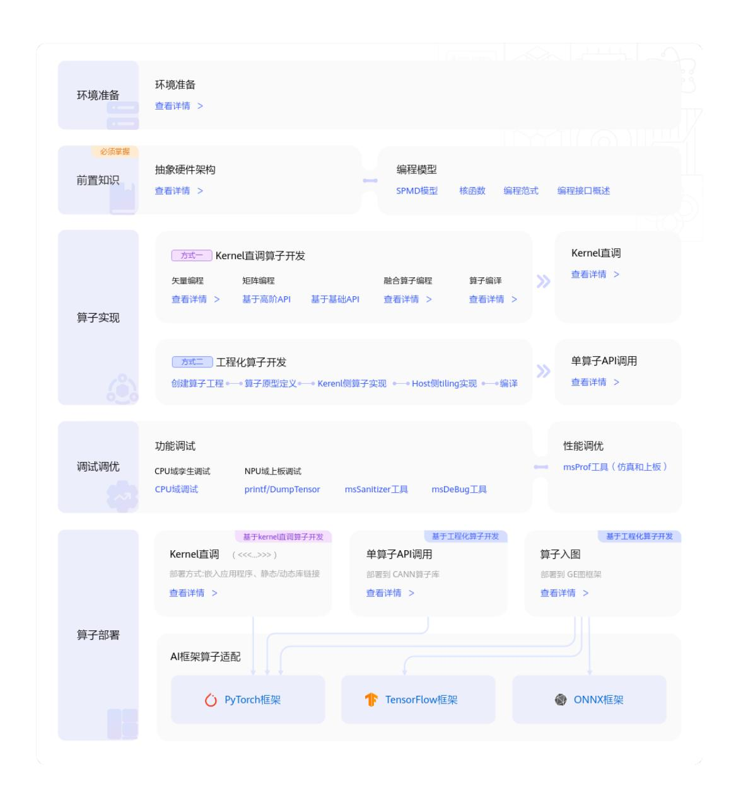

## 概念原理


## **API** 参考

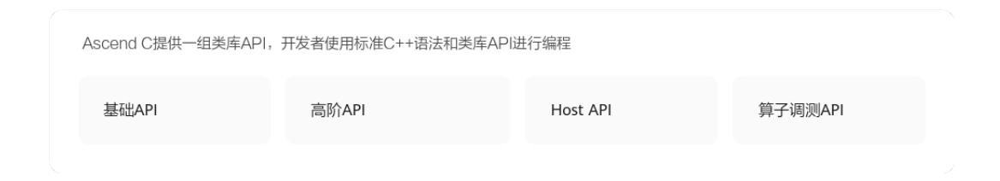

## 最佳实践


## 支持的产品型号

Ascend C支持在如下产品型号使用:

- Atlas A3 训练系列产品/Atlas A3 推理系列产品
- Atlas A2 训练系列产品/Atlas 800I A2 推理产品/A200I A2 Box 异构组件
- Atlas 200I/500 A2 推理产品
- Atlas 推理系列产品
- Atlas 训练系列产品

# **2** 环境准备

<span id="page-52-0"></span>进行Ascend C算子开发之前,需要安装驱动固件和**CANN**软件包,完成环境准备。

驱动固件(仅昇腾设备需要)的安装步骤可参见《**CANN** [软件安装指南](https://www.hiascend.com/document/detail/zh/CANNCommunityEdition/82RC1/softwareinst/instg/instg_quick.html)》的"安装 NPU驱动固件"章节,本节不再给出安装示例。

本节以训练&推理&开发调试业务场景、操作系统架构X86\_64、root用户操作为例,介 绍**CANN**软件包安装的步骤,其他场景的安装步骤类似,详细的可参见《**[CANN](https://www.hiascend.com/document/detail/zh/CANNCommunityEdition/82RC1/softwareinst/instg/instg_quick.html)** 软件 [安装指南》](https://www.hiascend.com/document/detail/zh/CANNCommunityEdition/82RC1/softwareinst/instg/instg_quick.html)。

### 步骤**1** 安装依赖的软件。

- Debian系列(Ubuntu、Debian、UOS20、UOS20 SP1): apt-get install -y gcc make net-tools cmake python3 python3-dev python3-pip
- openEuler系列(openEuler、CentOS、Kylin、BCLinux、BC-Linux-for-Euler、 UOS201050e、UOS20 1020e、UOSV20、AntOS、CTyunOS、CULinux、 Tlinux):

yum install -y gcc make net-tools cmake python3 python3-devel python3-pip

### 步骤**2** 检查依赖版本。

- Python:要求Python3.7.x至3.11.4版本。
- pip3:需与已安装的Python版本配套。
- cmake:要求3.16及以上版本。
- gcc:要求7.3.0及以上版本。

### 运行以下命令检查版本:

python3 --version pip3 --version cmake --version gcc --version

### 如果版本不符合要求:

- 对于Python、pip3、gcc,请参考《**CANN** [软件安装指南](https://www.hiascend.com/document/detail/zh/CANNCommunityEdition/82RC1/softwareinst/instg/instg_quick.html)》中"附录B:常用操 作"章节安装满足要求的版本。
- 对于cmake,请参考**[cmake](#page-53-0)**安装进行升级。

### 步骤**3** 执行如下命令安装所需的Python第三方库。

pip3 install attrs cython numpy==1.24.0 decorator sympy cffi pyyaml pathlib2 psutil protobuf==3.20 scipy requests absl-py

当前命令会安装最新或指定版本的依赖,如果安装过程中报错,或需要了解更详细的 版本要求,请参考《**CANN** [软件安装指南》](https://www.hiascend.com/document/detail/zh/CANNCommunityEdition/82RC1/softwareinst/instg/instg_quick.html)的"依赖列表"。

### <span id="page-53-0"></span>步骤**4** 安装CANN开发套件包。

1. 将CANN开发套件包上传至安装环境的任意目录,执行如下命令增加对软件包的 可执行权限。XXX代表具体版本号。

chmod +x Ascend-cann-toolkit\_XXX\_linux-x86\_64.run

2. 执行如下命令校验软件包的一致性和完整性。 ./Ascend-cann-toolkit\_XXX\_linux-x86\_64.run --check

3. 执行如下命令安装CANN开发套件包。

./Ascend-cann-toolkit\_XXX\_linux-x86\_64.run --install

用户需签[署华为企业业务最终用户许可协议\(](https://e.huawei.com/cn/about/eula)**EULA**)后进入安装流程,根据回显 页面输入**y**或**Y**接受协议,安装完成后,若显示如下信息,则说明软件安装成功。

[INFO] Ascend-cann-toolkit install success

4. 配置CANN环境变量。 source /usr/local/Ascend/ascend-toolkit/set\_env.sh

### **----**结束

### 说明

- 对于Ascend C算子的开发,并非必须安装驱动固件。在非昇腾设备上,可以利用CPU仿真环 境先行进行算子开发和测试,并在准备就绪后,利用昇腾设备进行加速计算。非昇腾设备的 安装请参考《**CANN** [软件安装指南》](https://www.hiascend.com/document/detail/zh/CANNCommunityEdition/82RC1/softwareinst/instg/instg_quick.html)中"附录B:常用操作 > 在非昇腾设备上安装CANN" 章节。
- 使用Ascend C算子工程(**kernel**[直调工程](#page-194-0)[和自定义算子工程](#page-213-0))要求安装cmake(版本为3.16 及以上),如下示例以安装3.16.0版本的cmake(linux系统、x86\_64架构)为例。 mkdir -p cmake-3.16 && wget -qO- "https://cmake.org/files/v3.16/cmake-3.16.0-linuxx86\_64.tar.gz" | tar --strip-components=1 -xz -C cmake-3.16 export PATH=`pwd`/cmake-3.16/bin:\$PATH

# **3** 快速入门

### <span id="page-54-0"></span>HelloWorld

基于Kernel[直调工程的算子开发](#page-55-0) [基于自定义算子工程的算子开发](#page-65-0)

## **3.1 HelloWorld**

下面是一个简单的Ascend C的"Hello World"样例,展示了一个Ascend C核函数(设备 侧实现的入口函数)的基本写法,及其如何被调用的流程。

● 包含核函数的实现文件hello\_world.cpp代码如下:核函数hello\_world的核心逻辑 为打印"Hello World!!!"字符串。hello\_world\_do封装了核函数的调用程序,通过 <<<>>>内核调用符对核函数进行调用。

```
#include "kernel_operator.h"
extern "C" __global__ __aicore__ void hello_world()
 AscendC::printf("Hello World!!!\n");
}
void hello_world_do(uint32_t blockDim, void* stream)
 hello_world<<<blockDim, nullptr, stream>>>();
}
```

● 调用核函数的应用程序main.cpp代码如下(您可以通过代码注释了解其主要的流 程):

```
#include "acl/acl.h"
extern void hello_world_do(uint32_t coreDim, void* stream);
int32_t main(int argc, char const *argv[])
 // AscendCL初始化
 aclInit(nullptr);
 // 运行管理资源申请
 int32_t deviceId = 0;
 aclrtSetDevice(deviceId);
 aclrtStream stream = nullptr;
 aclrtCreateStream(&stream);
 // 设置参与运算的核数为8(核数可根据实际需求设置)
 constexpr uint32_t blockDim = 8;
 // 用内核调用符<<<>>>调用核函数,hello_world_do中封装了<<<>>>调用
 hello_world_do(blockDim, stream);
 aclrtSynchronizeStream(stream);

 // 资源释放和AscendCL去初始化
 aclrtDestroyStream(stream);
 aclrtResetDevice(deviceId);
 aclFinalize();
 return 0;
}
```

通过如下的代码工程对上述文件进行组织,您可以通过**[LINK](https://gitee.com/ascend/samples/tree/v0.2-8.0.0.beta1/operator/ascendc/0_introduction/0_helloworld)**获取样例工程,并参考 README完成CMakeLists中的AI处理器的型号、软件包安装路径配置。

```
|-- CMakeLists.txt // CMake编译配置文件
|-- hello_world.cpp // Kernel实现
|-- main.cpp // 调用核函数的主程序
|-- run.sh // 一键式编译运行脚本
```

通过执行如下脚本实现样例程序的编译和运行:

bash run.sh -v <soc\_version>

### 说明

AI处理器的型号<soc\_version>请通过如下方式获取:

- 非Atlas A3 训练系列产品/Atlas A3 推理系列产品:在安装昇腾AI处理器的服务器执行**npusmi info**命令进行查询,获取**Name**信息。实际配置值为AscendName,例如**Name**取值为 xxxyy,实际配置值为Ascendxxxyy。
- Atlas A3 训练系列产品/Atlas A3 推理系列产品:在安装昇腾AI处理器的服务器执行**npusmi info -t board -i** id **-c** chip\_id命令进行查询,获取**Chip Name**和**NPU Name**信息,实 际配置值为Chip Name\_NPU Name。例如**Chip Name**取值为Ascendxxx,**NPU Name**取值 为1234,实际配置值为Ascendxxx\_1234。

### 其中:

- id:设备id,通过**npu-smi info -l**命令查出的NPU ID即为设备id。
- chip\_id:芯片id,通过**npu-smi info -m**命令查出的Chip ID即为芯片id。

## **3.2** 基于 **Kernel** 直调工程的算子开发

本入门教程,将会引导你完成以下任务,体验基于Kernel直调工程的Ascend C算子开 发基本流程。

- 1. 算子分析,明确数学表达式和计算逻辑等内容;
- 2. Add算子核函数开发;
- 3. 算子核函数CPU模式运行验证;
- 4. 算子核函数NPU模式运行验证。

在正式的开发之前,还需要先完成环境准备工作,开发Ascend C算子的基本流程如下 图所示:

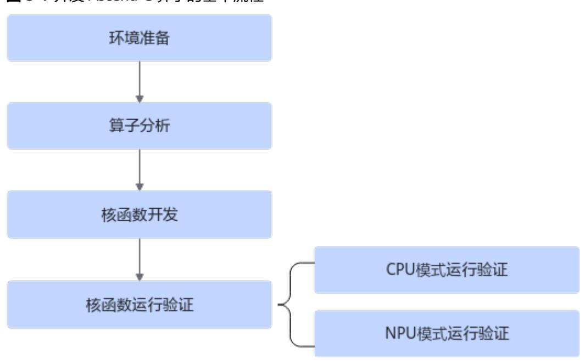

图 **3-1** 开发 Ascend C 算子的基本流程

### 说明

- 请点击[矢量算子样例获](https://gitee.com/ascend/samples/tree/master/operator/ascendc/0_introduction/3_add_kernellaunch/AddKernelInvocationNeo)取样例代码。
- 使用本教程只需要您具有一定的C/C++基础,在此基础上,如果您已经对Ascend C编程模型 有一定的了解,您可以在实际操作的过程中加深对理论的理解;如果您还没有开始了解 Ascend C编程模型,也无需担心,您可以先尝试跑通教程中的样例,参考教程最后的[指引进](#page-65-0) 行进一步的学习。

## 环境准备

● CANN软件安装

开发算子前,需要先准备好开发环境和运行环境,开发环境和运行环境的介绍和 具体的安装步骤可参见《**CANN** [软件安装指南](https://www.hiascend.com/document/detail/zh/CANNCommunityEdition/82RC1/softwareinst/instg/instg_quick.html)》。

● 环境变量配置

安装CANN软件后,使用CANN运行用户进行编译、运行时,需要以CANN运行用 户登录环境,执行**source \${install\_path}/set\_env.sh**命令设置环境变量。其中\$ {install\_path}为CANN软件的安装目录,例如:/usr/local/Ascend/ascendtoolkit。

## 算子分析

主要分析算子的数学表达式、输入输出的数量、Shape范围以及计算逻辑的实现,明确 需要调用的Ascend C接口。下文以Add算子为例,介绍具体的分析过程。

步骤**1** 明确算子的数学表达式及计算逻辑。

Add算子的数学表达式为:

$$\vec{z} = \vec{x} + \vec{y}$$

计算逻辑是:从外部存储Global Memory搬运数据至内部存储Local Memory,然后使 用Ascend C计算接口完成两个输入参数相加,得到最终结果,再搬运到Global Memory上。

### 步骤**2** 明确输入和输出。

- Add算子有两个输入:x与y,输出为z。
- 本样例中算子输入支持的数据类型为half(float16),算子输出的数据类型与输 入数据类型相同。
- 算子输入支持的shape为(8,2048),输出shape与输入shape相同。
- 算子输入支持的**[format](#page-301-0)**为:ND。

### 步骤**3** 确定核函数名称和参数。

- 本样例中核函数命名为add\_custom。
- 根据对算子输入输出的分析,确定核函数有3个参数x,y,z;x,y为输入参数,z 为输出参数。

### 步骤**4** 确定算子实现所需接口。

- 实现涉及外部存储和内部存储间的数据搬运,查看Ascend C API参考中的数据搬 移接口,需要使用**[14.1.4.3.1 DataCopy](#page-868-0)**来实现数据搬移。
- 本样例只涉及矢量计算的加法操作,查看Ascend C API参考中的矢量计算接口 **[14.1.4.2](#page-501-0)** 矢量计算,初步分析可使用双目指令Add接口 **[Add](#page-532-0)**实现x+y。
- 计算中使用到的Tensor数据结构,使用 **[AllocTensor](#page-980-0)**、 **[FreeTensor](#page-982-0)**进行申请和释 放。
- 并行流水任务之间使用Queue队列完成同步,会使用到 **[EnQue](#page-984-0)**、 **[DeQue](#page-985-0)**等接 口。

### **----**结束

通过以上分析,得到Ascend C Add算子的设计规格如下:

表 **3-1** Ascend C Add 算子设计规格

| 算子类型<br>(OpType) | AddCustom       |                               |           |        |  |  |  |  |  |  |
|------------------|-----------------|-------------------------------|-----------|--------|--|--|--|--|--|--|
| 算子输入             | name            | shape                         | data type | format |  |  |  |  |  |  |
|                  | x               | (8, 2048)                     | half      | ND     |  |  |  |  |  |  |
|                  | y               | (8, 2048)                     | half      | ND     |  |  |  |  |  |  |
| 算子输出             | z               | (8, 2048)                     | half      | ND     |  |  |  |  |  |  |
| 核函数名称            | add_custom      |                               |           |        |  |  |  |  |  |  |
| 使用的主要接           | DataCopy:数据搬移接口 |                               |           |        |  |  |  |  |  |  |
| 口                | Add:矢量双目指令接口    |                               |           |        |  |  |  |  |  |  |
|                  |                 | AllocTensor、FreeTensor:内存管理接口 |           |        |  |  |  |  |  |  |
|                  |                 | EnQue、DeQue接口:Queue队列管理接口     |           |        |  |  |  |  |  |  |

算子实现文件 名称

add\_custom.cpp

## 核函数开发

完成环境准备和初步的算子分析后,即可开始Ascend C核函数的开发。开发之前请先 [从矢量算子样例](https://gitee.com/ascend/samples/tree/master/operator/ascendc/0_introduction/3_add_kernellaunch/AddKernelInvocationNeo)获取样例代码,以下样例代码在add\_custom.cpp中实现。

本样例中使用多核并行计算,即把数据进行分片,分配到多个核上进行处理。Ascend C核函数是在一个核上的处理函数,所以只处理部分数据。分配方案是:假设共启用8 个核,数据整体长度TOTAL\_LENGTH为8 \* 2048个元素,平均分配到8个核上运行,每 个核上处理的数据大小BLOCK\_LENGTH为2048个元素。下文的核函数,只关注长度为 BLOCK\_LENGTH的数据应该如何处理。

步骤**1** 首先,您需要根据[核函数定义和调用中](#page-78-0)介绍的规则进行核函数的定义,并在核函数中 调用算子类的Init和Process函数,算子类实现在后续步骤中介绍。

```
extern "C" __global__ __aicore__ void add_custom(GM_ADDR x, GM_ADDR y, GM_ADDR z)
{
 KernelAdd op;
 op.Init(x, y, z);
 op.Process();
}
```

- 使用\_\_global\_\_函数类型限定符来标识它是一个核函数,可以被<<<>>>调用;使 用\_\_aicore\_\_函数类型限定符来标识该核函数在设备端AI Core上执行。指针入参 变量需要增加变量类型限定符\_\_gm\_\_,表明该指针变量指向Global Memory上某 处内存地址。为了统一表达,使用GM\_ADDR宏来修饰入参,GM\_ADDR宏定义如 下:
  - #define GM\_ADDR \_\_gm\_\_ uint8\_t\*
- 算子类的Init函数,完成内存初始化相关工作,Process函数完成算子实现的核心 逻辑。

### 步骤**2** 然后根据矢量编程范式实现算子类,本样例中定义KernelAdd算子类,其具体成员如 下:

```
class KernelAdd {
public:
 __aicore__ inline KernelAdd(){}
 // 初始化函数,完成内存初始化相关操作
 __aicore__ inline void Init(GM_ADDR x, GM_ADDR y, GM_ADDR z){}
 // 核心处理函数,实现算子逻辑,调用私有成员函数CopyIn、Compute、CopyOut完成矢量算子的三级流水操
作
 __aicore__ inline void Process(){}
private:
 // 搬入函数,从Global Memory搬运数据至Local Memory,被核心Process函数调用
 __aicore__ inline void CopyIn(int32_t progress){}
 // 计算函数,完成两个输入参数相加,得到最终结果,被核心Process函数调用
 __aicore__ inline void Compute(int32_t progress){}
 // 搬出函数,将最终结果从Local Memory搬运到Global Memory上,被核心Process函数调用
 __aicore__ inline void CopyOut(int32_t progress){}
private:
 AscendC::TPipe pipe; //TPipe内存管理对象
 AscendC::TQue<AscendC::TPosition::VECIN, BUFFER_NUM> inQueueX, inQueueY; //输入数据Queue队列管
理对象,TPosition为VECIN
 AscendC::TQue<AscendC::TPosition::VECOUT, BUFFER_NUM> outQueueZ; //输出数据Queue队列管理对
象,TPosition为VECOUT
 AscendC::GlobalTensor<half> xGm; //管理输入输出Global Memory内存地址的对象,其中xGm, yGm为输
入,zGm为输出
 AscendC::GlobalTensor<half> yGm;
```

 AscendC::GlobalTensor<half> zGm; };

内部函数的调用关系示意图如下:

### 图 **3-2** 核函数调用关系图

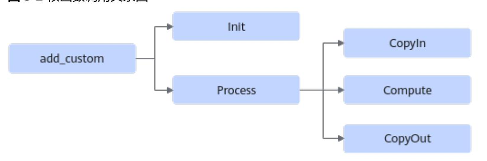

由此可见除了Init函数完成初始化外,Process中完成了对流水任务"搬入、计算、搬 出"的调用,开发者可以重点关注三个流水任务的实现。

步骤**3** 初始化函数**Init**主要完成以下内容:设置输入输出Global Tensor的Global Memory内 存地址,通过TPipe内存管理对象为输入输出Queue分配内存。

### 上文我们介绍到,本样例将数据切分成**8**块,平均分配到**8**个核上运行,每个核上处理 的数据大小**BLOCK\_LENGTH**为**2048**个元素。那么我们是如何实现这种切分的呢?

每个核上处理的数据地址需要在起始地址上增加GetBlockIdx() \* BLOCK\_LENGTH(每 个block处理的数据长度)的偏移来获取。这样也就实现了多核并行计算的数据切分。

以输入x为例,x + BLOCK\_LENGTH \* GetBlockIdx()即为单核处理程序中x在Global Memory上的内存偏移地址,获取偏移地址后,使用GlobalTensor类的 **[SetGlobalBuffer](#page-447-0)**接口设定该核上Global Memory的起始地址以及长度。具体示意图如 下。

### 图 **3-3** 多核并行处理示意图

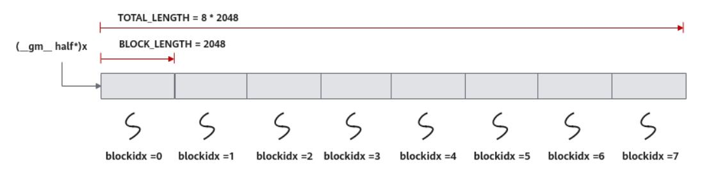

### 上面已经实现了多核数据的切分,那么单核上的处理数据如何进行切分?

对于单核上的处理数据,可以进行数据切块(Tiling),在本示例中,仅作为参考,将 数据切分成8块(并不意味着8块就是性能最优)。切分后的每个数据块再次切分成2 块,即可开启**[double buffer](#page-329-0)**,实现流水线之间的并行。

这样单核上的数据(2048个数)被切分成16块,每块TILE\_LENGTH(128)个数据。 TPipe为inQueueX分配了两块大小为TILE\_LENGTH \* sizeof(half)个字节的内存块,每 个内存块能容纳TILE\_LENGTH(128)个half类型数据。数据切分示意图如下。

### 图 **3-4** 单核数据切分示意图

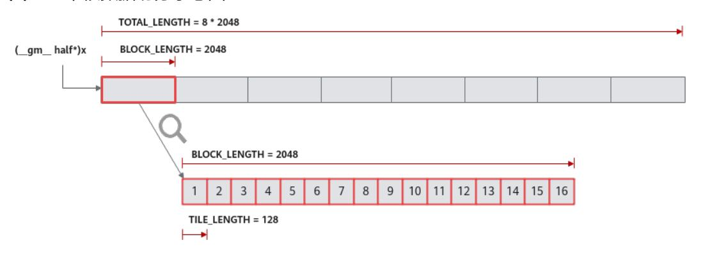

### 具体的初始化函数代码如下:

```
#include "kernel_operator.h"
constexpr int32_t TOTAL_LENGTH = 8 * 2048; // total length of data
constexpr int32_t USE_CORE_NUM = 8; // num of core used
constexpr int32_t BLOCK_LENGTH = TOTAL_LENGTH / USE_CORE_NUM; // length computed of each 
core
constexpr int32_t TILE_NUM = 8; // split data into 8 tiles for each core
constexpr int32_t BUFFER_NUM = 2; // tensor num for each queue
constexpr int32_t TILE_LENGTH = BLOCK_LENGTH / TILE_NUM / BUFFER_NUM; // separate to 2 parts, due 
to double buffer
__aicore__ inline void Init(GM_ADDR x, GM_ADDR y, GM_ADDR z)
{
 // get start index for current core, core parallel
 xGm.SetGlobalBuffer((__gm__ half*)x + BLOCK_LENGTH * AscendC::GetBlockIdx(), BLOCK_LENGTH);
 yGm.SetGlobalBuffer((__gm__ half*)y + BLOCK_LENGTH * AscendC::GetBlockIdx(), BLOCK_LENGTH);
 zGm.SetGlobalBuffer((__gm__ half*)z + BLOCK_LENGTH * AscendC::GetBlockIdx(), BLOCK_LENGTH);
 // pipe alloc memory to queue, the unit is Bytes
 pipe.InitBuffer(inQueueX, BUFFER_NUM, TILE_LENGTH * sizeof(half));
 pipe.InitBuffer(inQueueY, BUFFER_NUM, TILE_LENGTH * sizeof(half));
 pipe.InitBuffer(outQueueZ, BUFFER_NUM, TILE_LENGTH * sizeof(half));
}
```

### 步骤**4** 基于矢量编程范式,将核函数的实现分为3个基本任务:CopyIn,Compute, CopyOut。**Process**函数中通过如下方式调用这三个函数。

```
__aicore__ inline void Process()
{
 // loop count need to be doubled, due to double buffer
 constexpr int32_t loopCount = TILE_NUM * BUFFER_NUM;
 // tiling strategy, pipeline parallel
 for (int32_t i = 0; i < loopCount; i++) {
 CopyIn(i);
 Compute(i);
 CopyOut(i);
 }
}
```

- 1. CopyIn函数实现。
  - a. 使用**[14.1.4.3.1 DataCopy](#page-868-0)**接口将GlobalTensor数据拷贝到LocalTensor。
  - b. 使用 **[EnQue](#page-984-0)**将LocalTensor放入VecIn的Queue中。

```
__aicore__ inline void CopyIn( int32_t progress)
 // alloc tensor from queue memory
 AscendC::LocalTensor<half> xLocal = inQueueX.AllocTensor<half>();
 AscendC::LocalTensor<half> yLocal = inQueueY.AllocTensor<half>();
 // copy progress_th tile from global tensor to local tensor
 AscendC::DataCopy(xLocal, xGm[progress * TILE_LENGTH], TILE_LENGTH);
```

```
 AscendC::DataCopy(yLocal, yGm[progress * TILE_LENGTH], TILE_LENGTH);
 // enque input tensors to VECIN queue
 inQueueX.EnQue(xLocal);
 inQueueY.EnQue(yLocal);
}
```

- 2. Compute函数实现。
  - a. 使用 **[DeQue](#page-985-0)**从VecIn中取出LocalTensor。
  - b. 使用Ascend C接口 **[Add](#page-532-0)**完成矢量计算。
  - c. 使用 **[EnQue](#page-984-0)**将计算结果LocalTensor放入到VecOut的Queue中。
  - d. 使用 **[FreeTensor](#page-982-0)**将释放不再使用的LocalTensor。

```
__aicore__ inline void Compute(int32_t progress)
 // deque input tensors from VECIN queue
 AscendC::LocalTensor<half> xLocal = inQueueX.DeQue<half>();
 AscendC::LocalTensor<half> yLocal = inQueueY.DeQue<half>();
 AscendC::LocalTensor<half> zLocal = outQueueZ.AllocTensor<half>();
 // call Add instr for computation
 AscendC::Add(zLocal, xLocal, yLocal, TILE_LENGTH);
 // enque the output tensor to VECOUT queue
 outQueueZ.EnQue<half>(zLocal);
 // free input tensors for reuse
 inQueueX.FreeTensor(xLocal);
 inQueueY.FreeTensor(yLocal);
}
```

- 3. CopyOut函数实现。
  - a. 使用 **[DeQue](#page-985-0)**接口从VecOut的Queue中取出LocalTensor。
  - b. 使用**[14.1.4.3.1 DataCopy](#page-868-0)**接口将LocalTensor拷贝到GlobalTensor上。
  - c. 使用 **[FreeTensor](#page-982-0)**将不再使用的LocalTensor进行回收。

```
 __aicore__ inline void CopyOut(int32_t progress)
 // deque output tensor from VECOUT queue
 AscendC::LocalTensor<half> zLocal = outQueueZ.DeQue<half>();
 // copy progress_th tile from local tensor to global tensor
 AscendC::DataCopy(zGm[progress * TILE_LENGTH], zLocal, TILE_LENGTH);
 // free output tensor for reuse
 outQueueZ.FreeTensor(zLocal);
}
```

### **----**结束

## 核函数运行验证

异构计算架构中,NPU(kernel侧)与CPU(host侧)是协同工作的,完成了kernel侧 核函数开发后,即可编写host侧的核函数调用程序,实现从host侧的APP程序调用算 子,执行计算过程。

除了上文核函数实现文件add\_custom.cpp外,核函数的调用与验证还需要准备以下文 件:

- 调用算子的应用程序:main.cpp。
- 输入数据和真值数据生成脚本文件:gen\_data.py。
- 验证输出数据和真值数据是否一致的验证脚本:verify\_result.py。
- 适用于CPU或NPU模式运行的算子编译工程文件:CMakeLists.txt。
- 编译运行算子的脚本:run.sh。

本文仅介绍main.cpp文件编写,其他内容您可以[在矢量算子样例](https://gitee.com/ascend/samples/tree/master/operator/ascendc/0_introduction/3_add_kernellaunch/AddKernelInvocationNeo)中直接获取。

### 步骤**1** host侧应用程序框架的编写。

内置宏ASCENDC\_CPU\_DEBUG是区分运行CPU模式或NPU模式逻辑的标志,在同一个 main函数中通过对ASCENDC\_CPU\_DEBUG宏定义的判断来区分CPU模式和NPU模式 的运行程序。

```
#include "data_utils.h"
#ifndef ASCENDC_CPU_DEBUG
#include "acl/acl.h"
extern void add_custom_do(uint32_t coreDim, void* l2ctrl, void* stream, uint8_t* x, uint8_t* y, uint8_t* z);
#else
#include "tikicpulib.h"
extern "C" __global__ __aicore__ void add_custom(GM_ADDR x, GM_ADDR y, GM_ADDR z);
#endif
int32_t main(int32_t argc, char* argv[])
{
 size_t inputByteSize = 8 * 2048 * sizeof(uint16_t); // uint16_t represent half
 size_t outputByteSize = 8 * 2048 * sizeof(uint16_t); // uint16_t represent half
 uint32_t blockDim = 8;
#ifdef ASCENDC_CPU_DEBUG
 // 用于CPU模式调试的调用程序
#else
 // NPU模式运行算子的调用程序
#endif
 return 0;
}
```

### 步骤**2** 编写用于CPU调试的调用程序。

完成算子核函数CPU模式运行验证的步骤如下:

### 图 **3-5** CPU 模式运行验证步骤

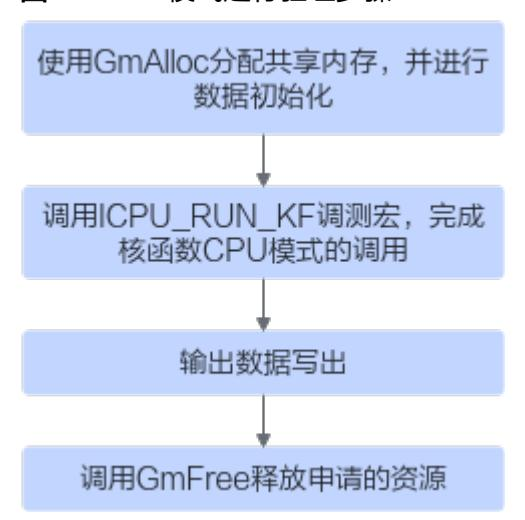

### GmAlloc、ICPU\_RUN\_KF、GmFree等接口说明请参[考调测接口](#page-2395-0)。

```
 // 使用GmAlloc分配共享内存,并进行数据初始化
 uint8_t* x = (uint8_t*)AscendC::GmAlloc(inputByteSize);
 uint8_t* y = (uint8_t*)AscendC::GmAlloc(inputByteSize);
 uint8_t* z = (uint8_t*)AscendC::GmAlloc(outputByteSize);
 ReadFile("./input/input_x.bin", inputByteSize, x, inputByteSize);
 ReadFile("./input/input_y.bin", inputByteSize, y, inputByteSize);
 // 调用ICPU_RUN_KF调测宏,完成核函数CPU模式调用
 AscendC::SetKernelMode(KernelMode::AIV_MODE);
 ICPU_RUN_KF(add_custom, blockDim, x, y, z); // use this macro for cpu debug
```

```
 // 输出数据写出
 WriteFile("./output/output_z.bin", z, outputByteSize);
 // 调用GmFree释放申请的资源
 AscendC::GmFree((void *)x);
 AscendC::GmFree((void *)y);
 AscendC::GmFree((void *)z);
```

### 步骤**3** 编写NPU模式运行算子的调用程序。

完成算子核函数NPU模式运行验证的步骤如下:

### 图 **3-6** NPU 模式运行验证步骤

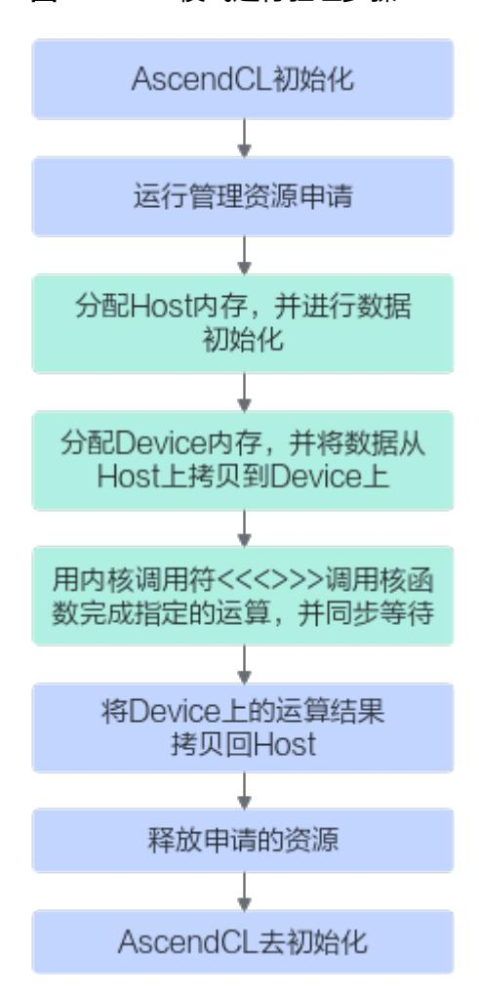

AscendCL API使用方法请参考《**AscendCL**[应用开发指南](https://www.hiascend.com/document/detail/zh/CANNCommunityEdition/82RC1/appdevg/acldevg/aclcppdevg_000000.html) **(C&C++)**》中的"acl API参 考"章节。

```
 // AscendCL初始化
 CHECK_ACL(aclInit(nullptr));
 // 运行管理资源申请
 int32_t deviceId = 0;
 CHECK_ACL(aclrtSetDevice(deviceId));
 aclrtStream stream = nullptr;
 CHECK_ACL(aclrtCreateStream(&stream));
 // 分配Host内存
 uint8_t *xHost, *yHost, *zHost;
 uint8_t *xDevice, *yDevice, *zDevice;
 CHECK_ACL(aclrtMallocHost((void**)(&xHost), inputByteSize));
 CHECK_ACL(aclrtMallocHost((void**)(&yHost), inputByteSize));
 CHECK_ACL(aclrtMallocHost((void**)(&zHost), outputByteSize));
```

```
 // 分配Device内存
 CHECK_ACL(aclrtMalloc((void**)&xDevice, inputByteSize, ACL_MEM_MALLOC_HUGE_FIRST));
 CHECK_ACL(aclrtMalloc((void**)&yDevice, inputByteSize, ACL_MEM_MALLOC_HUGE_FIRST));
 CHECK_ACL(aclrtMalloc((void**)&zDevice, outputByteSize, ACL_MEM_MALLOC_HUGE_FIRST));
 // Host内存初始化
 ReadFile("./input/input_x.bin", inputByteSize, xHost, inputByteSize);
 ReadFile("./input/input_y.bin", inputByteSize, yHost, inputByteSize);
 CHECK_ACL(aclrtMemcpy(xDevice, inputByteSize, xHost, inputByteSize, 
ACL_MEMCPY_HOST_TO_DEVICE));
 CHECK_ACL(aclrtMemcpy(yDevice, inputByteSize, yHost, inputByteSize, 
ACL_MEMCPY_HOST_TO_DEVICE));
 // 用内核调用符<<<>>>调用核函数完成指定的运算,add_custom_do中封装了<<<>>>调用
 add_custom_do(blockDim, nullptr, stream, xDevice, yDevice, zDevice);
 CHECK_ACL(aclrtSynchronizeStream(stream));
 // 将Device上的运算结果拷贝回Host
 CHECK_ACL(aclrtMemcpy(zHost, outputByteSize, zDevice, outputByteSize, 
ACL_MEMCPY_DEVICE_TO_HOST));
 WriteFile("./output/output_z.bin", zHost, outputByteSize);
 // 释放申请的资源
 CHECK_ACL(aclrtFree(xDevice));
 CHECK_ACL(aclrtFree(yDevice));
 CHECK_ACL(aclrtFree(zDevice));
 CHECK_ACL(aclrtFreeHost(xHost));
 CHECK_ACL(aclrtFreeHost(yHost));
 CHECK_ACL(aclrtFreeHost(zHost));
 // AscendCL去初始化
 CHECK_ACL(aclrtDestroyStream(stream));
 CHECK_ACL(aclrtResetDevice(deviceId));
 CHECK_ACL(aclFinalize());
```

步骤**4** 执行一键式编译运行脚本,编译和运行应用程序。

脚本执行方式如下,**<soc\_version>**表示算子运行的AI处理器型号,<run\_mode>表示 算子以cpu模式或npu模式运行。

bash run.sh -r <run\_mode> -v <soc\_version>

- 1. 执行脚本前需要配置环境变量ASCEND\_INSTALL\_PATH,配置为CANN软件的安 装路径,示例如下,请根据实际安装路径进行修改: export ASCEND\_INSTALL\_PATH=\$HOME/Ascend/ascend-toolkit/latest
- 2. 完成CPU模式和NPU模式运行验证。
  - CPU模式下执行如下命令,命令中的**<soc\_version>**请替换为实际的AI处理器 型号。

bash run.sh -r cpu -v **<soc\_version>**

– NPU模式下执行如下命令,命令中的**<soc\_version>**请替换为实际的AI处理器 型号。

bash run.sh -r npu -v **<soc\_version>**

当前使用numpy接口计算了输出数据和真值数据的绝对误差和相对误差,误差在 容忍偏差范围内,视为精度符合要求,运行结果会输出"test pass"字样。

### <span id="page-65-0"></span>说明

AI处理器的型号<soc\_version>请通过如下方式获取:

- 非Atlas A3 训练系列产品/Atlas A3 推理系列产品:在安装昇腾AI处理器的服务器执行 **npu-smi info**命令进行查询,获取**Name**信息。实际配置值为AscendName,例如 **Name**取值为xxxyy,实际配置值为Ascendxxxyy。
- Atlas A3 训练系列产品/Atlas A3 推理系列产品:在安装昇腾AI处理器的服务器执行 **npu-smi info -t board -i** id **-c** chip\_id命令进行查询,获取**Chip Name**和**NPU Name** 信息,实际配置值为Chip Name\_NPU Name。例如**Chip Name**取值为Ascendxxx, **NPU Name**取值为1234,实际配置值为Ascendxxx\_1234。

其中:

- id:设备id,通过**npu-smi info -l**命令查出的NPU ID即为设备id。
- chip\_id:芯片id,通过**npu-smi info -m**命令查出的Chip ID即为芯片id。

该样例支持以下型号:

- **Atlas** 推理系列产品
- **Atlas** 训练系列产品
- **Atlas A2** 训练系列产品**/Atlas 800I A2** 推理产品**/A200I A2 Box** 异构组件

### **----**结束

## 接下来的引导

如果您对教程中的多核并行、流水编程等概念不了解,导致阅读过程有些吃力,可以 参考**5** [编程模型](#page-76-0)学习基本概念,再来回顾本教程;如果您已经了解相关概念,并跑通 了该样例,您可以参考**6.2** [矢量编程了](#page-92-0)解Ascend C矢量编程中的更多细节。

## **3.3** 基于自定义算子工程的算子开发

本节以一个简单算子为例,带您体验从算子工程创建、代码编写、编译部署到运行验 证的开发全流程,让您对算子开发工程有个宏观的认识,此处我们以输入是动态shape 的Add算子实现为例,为了与内置Add算子区分,定义算子类型为AddCustom。

## 工程创建

CANN软件包中提供了工程创建工具msOpGen,开发者可以输入算子原型定义文件生 成Ascend C算子开发工程。

步骤**1** 编写AddCustom算子的原型定义json文件。。

假设AddCustom算子的原型定义文件命名为add\_custom.json,存储路径为: \$HOME/ sample,文件内容如下:

```
 {
 "op": "AddCustom",
 "language": "cpp",
 "input_desc": [
 {
 "name": "x",
 "param_type": "required",
 "format": [
 "ND"
 ],
 "type": [
```

```
 "float16"
 ]
 },
 {
 "name": "y",
 "param_type": "required",
 "format": [
 "ND"
 ],
 "type": [
 "float16"
 ]
 }
 ],
 "output_desc": [
 {
 "name": "z",
 "param_type": "required",
 "format": [
 "ND"
 ],
 "type": [
 "float16"
 ]
 }
 ]
 }
```

步骤**2** 使用msOpGen工具生成AddCustom算子的开发工程。

**\${INSTALL\_DIR}/python/site-packages/bin/msopgen gen -i \$HOME/sample/add\_custom.json -c ai\_core- <soc\_version> -lan cpp -out \$HOME/sample/AddCustom**

- **\${INSTALL\_DIR}**为CANN软件安装后文件存储路径,请根据实际环境进行替换。
- -i:算子原型定义文件add\_custom.json所在路径。
- -c:ai\_core-<soc\_version>代表算子在AI Core上执行,<soc\_version>为昇腾AI处 理器的型号。

### 说明

AI处理器的型号<soc\_version>请通过如下方式获取:

- 非Atlas A3 训练系列产品/Atlas A3 推理系列产品:在安装昇腾AI处理器的服务器执行 **npu-smi info**命令进行查询,获取**Name**信息。实际配置值为AscendName,例如 **Name**取值为xxxyy,实际配置值为Ascendxxxyy。
- Atlas A3 训练系列产品/Atlas A3 推理系列产品:在安装昇腾AI处理器的服务器执行 **npu-smi info -t board -i** id **-c** chip\_id命令进行查询,获取**Chip Name**和**NPU Name** 信息,实际配置值为Chip Name\_NPU Name。例如**Chip Name**取值为Ascendxxx, **NPU Name**取值为1234,实际配置值为Ascendxxx\_1234。

其中:

- id:设备id,通过**npu-smi info -l**命令查出的NPU ID即为设备id。
- chip\_id:芯片id,通过**npu-smi info -m**命令查出的Chip ID即为芯片id。

基于同系列的AI处理器型号创建的算子工程,其基础功能(基于该工程进行算子开发、编 译和部署)通用。

● -lan: 参数cpp代表算子基于Ascend C编程框架,使用C++编程语言开发。

步骤**3** 命令执行完后,会在\$HOME/sample目录下生成算子工程目录AddCustom,工程中包 含算子实现的模板文件,编译脚本等,如下所示:

```
AddCustom
├── build.sh // 编译入口脚本
├── cmake // 算子工程编译所需脚本及公共编译文件存放目录
```

```
├── CMakeLists.txt // 算子工程构建过程配置文件
├── CMakePresets.json // 编译配置项
├── framework // AI框架适配时,算子插件实现文件目录
├── op_host // host侧实现文件
│ ├── add_custom_tiling.h // 算子tiling定义文件
│ ├── add_custom.cpp // 算子原型注册、shape推导、信息库、tiling实现等内容文件
│ ├── CMakeLists.txt
├── op_kernel // kernel侧实现文件
│ ├── CMakeLists.txt 
│ ├── add_custom.cpp // 算子核函数实现文件
├── scripts // 自定义算子工程打包相关脚本所在目录
```

### 说明

上述目录结构中的粗体文件为后续算子开发过程中需要修改的文件,其他文件无需修改。

### **----**结束

## 算子核函数实现

在工程存储目录的"AddCustom/op\_kernel/add\_custom.cpp"文件中实现算子的核函 数,完整的样例代码您可以在**[add\\_custom.cpp](https://gitee.com/ascend/samples/blob/master/operator/ascendc/0_introduction/1_add_frameworklaunch/AddCustom/op_kernel/add_custom.cpp)**中查看,下面介绍关键实现代码。

算子核函数实现代码的内部调用关系示意图如下:

### 图 **3-7** 核函数调用关系图

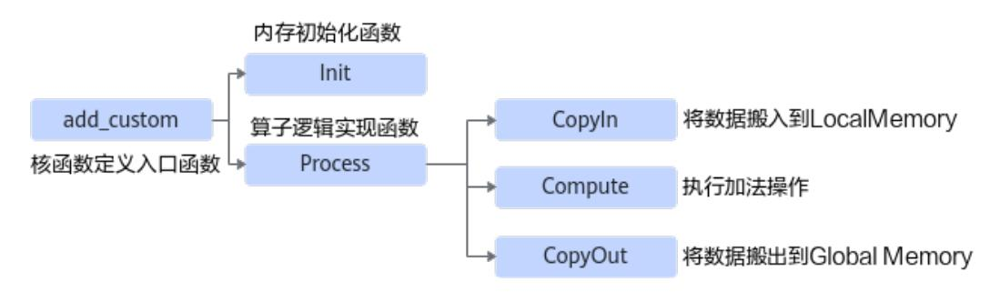

由此可见除了Init函数完成初始化外,Process中完成了对流水任务:"搬入、计算、 搬出"的调用,开发者可以重点关注三个流水任务的实现。

### 步骤**1** 首先,进行核函数的定义,并在核函数中调用算子类的Init和Process函数。

```
extern "C" __global__ __aicore__ void add_custom(GM_ADDR x, GM_ADDR y, GM_ADDR z, GM_ADDR 
workspace, GM_ADDR tiling)
 // 获取Host侧传入的Tiling参数
 GET_TILING_DATA(tiling_data, tiling);
 // 初始化算子类
 KernelAdd op;
 // 算子类的初始化函数,完成内存初始化相关工作
 op.Init(x, y, z, tiling_data.totalLength, tiling_data.tileNum);
 // 完成算子实现的核心逻辑
 op.Process();
}
```

### 步骤**2** 定义KernelAdd算子类,其具体成员及成员函数实现如下。

```
#include "kernel_operator.h"
constexpr int32_t BUFFER_NUM = 2;
class KernelAdd {
public:
 __aicore__ inline KernelAdd() {}
 // 初始化函数,完成内存初始化相关操作
 __aicore__ inline void Init(GM_ADDR x, GM_ADDR y, GM_ADDR z, uint32_t totalLength, uint32_t
```

```
tileNum)
 {
 // 使用获取到的TilingData计算得到blockLength(每个核上总计算数据大小)、tileNum(每个核上分块个
数)、tileLength(每个分块大小)等变量
 this->blockLength = totalLength / AscendC::GetBlockNum();
 this->tileNum = tileNum;
 this->tileLength = this->blockLength / tileNum / BUFFER_NUM;
 // 获取当前核的起始索引
 xGm.SetGlobalBuffer((__gm__ DTYPE_X*)x + this->blockLength * AscendC::GetBlockIdx(), this-
>blockLength);
 yGm.SetGlobalBuffer((__gm__ DTYPE_Y*)y + this->blockLength * AscendC::GetBlockIdx(), this-
>blockLength);
 zGm.SetGlobalBuffer((__gm__ DTYPE_Z*)z + this->blockLength * AscendC::GetBlockIdx(), this-
>blockLength);
 // 通过Pipe内存管理对象为输入输出Queue分配内存
 pipe.InitBuffer(inQueueX, BUFFER_NUM, this->tileLength * sizeof(DTYPE_X));
 pipe.InitBuffer(inQueueY, BUFFER_NUM, this->tileLength * sizeof(DTYPE_Y));
 pipe.InitBuffer(outQueueZ, BUFFER_NUM, this->tileLength * sizeof(DTYPE_Z));
 }
 // 核心处理函数,实现算子逻辑,调用私有成员函数CopyIn、Compute、CopyOut完成矢量算子的三级流水操
作
 __aicore__ inline void Process()
 {
 int32_t loopCount = this->tileNum * BUFFER_NUM;
 for (int32_t i = 0; i < loopCount; i++) {
 CopyIn(i);
 Compute(i);
 CopyOut(i);
 }
 }
private:
 // 搬入函数,完成CopyIn阶段的处理,被核心Process函数调用
 __aicore__ inline void CopyIn(int32_t progress)
 {
 // 从Queue中分配输入Tensor
 AscendC::LocalTensor<DTYPE_X> xLocal = inQueueX.AllocTensor<DTYPE_X>();
 AscendC::LocalTensor<DTYPE_Y> yLocal = inQueueY.AllocTensor<DTYPE_Y>();
 // 将GlobalTensor数据拷贝到LocalTensor
 AscendC::DataCopy(xLocal, xGm[progress * this->tileLength], this->tileLength);
 AscendC::DataCopy(yLocal, yGm[progress * this->tileLength], this->tileLength);
 // 将LocalTesor放入VECIN(代表矢量编程中搬入数据的逻辑存放位置)的Queue中
 inQueueX.EnQue(xLocal);
 inQueueY.EnQue(yLocal);
 }
 // 计算函数,完成Compute阶段的处理,被核心Process函数调用
 __aicore__ inline void Compute(int32_t progress)
 {
 // 将Tensor从队列中取出,用于后续计算
 AscendC::LocalTensor<DTYPE_X> xLocal = inQueueX.DeQue<DTYPE_X>();
 AscendC::LocalTensor<DTYPE_Y> yLocal = inQueueY.DeQue<DTYPE_Y>();
 // 从Queue中分配输出Tensor
 AscendC::LocalTensor<DTYPE_Z> zLocal = outQueueZ.AllocTensor<DTYPE_Z>();
 // 调用Add接口进行计算
 AscendC::Add(zLocal, xLocal, yLocal, this->tileLength);
 // 将计算结果LocalTensor放入到VecOut的Queue中
 outQueueZ.EnQue<DTYPE_Z>(zLocal);
 // 释放输入Tensor
 inQueueX.FreeTensor(xLocal);
 inQueueY.FreeTensor(yLocal);
 }
 // 搬出函数,完成CopyOut阶段的处理,被核心Process函数调用
 __aicore__ inline void CopyOut(int32_t progress)
 {
 // 从VecOut的Queue中取出输出Tensor
 AscendC::LocalTensor<DTYPE_Z> zLocal = outQueueZ.DeQue<DTYPE_Z>();
 // 将输出Tensor拷贝到GlobalTensor中
```

```
 AscendC::DataCopy(zGm[progress * this->tileLength], zLocal, this->tileLength);
 // 将不再使用的LocalTensor释放
 outQueueZ.FreeTensor(zLocal);
 }
private:
 //Pipe内存管理对象
 AscendC::TPipe pipe;
 //输入数据Queue队列管理对象,TPosition为VECIN
 AscendC::TQue<AscendC::TPosition::VECIN, BUFFER_NUM> inQueueX, inQueueY; 
 //输出数据Queue队列管理对象,TPosition为VECOUT
 AscendC::TQue<AscendC::TPosition::VECOUT, BUFFER_NUM> outQueueZ;
 //管理输入输出Global Memory内存地址的对象,其中xGm, yGm为输入,zGm为输出
 AscendC::GlobalTensor<DTYPE_X> xGm;
 AscendC::GlobalTensor<DTYPE_Y> yGm;
 AscendC::GlobalTensor<DTYPE_Z> zGm;
 // 每个核上总计算数据大小
 uint32_t blockLength;
 // 每个核上总计算数据分块个数
 uint32_t tileNum;
 // 每个分块大小
 uint32_t tileLength;
};
```

### **----**结束

## **Host** 侧算子实现

核函数开发完成后,下一步就是进行Host侧的实现,对应"AddCustom/op\_host"目 录下的add\_custom\_tiling.h文件与add\_custom.cpp文件。下面简要介绍下两个文件的 关键实现,完整的样例代码可参见**[add\\_custom\\_tiling.h](https://gitee.com/ascend/samples/blob/master/operator/ascendc/0_introduction/1_add_frameworklaunch/AddCustom/op_host/add_custom_tiling.h)**与**[add\\_custom.cpp](https://gitee.com/ascend/samples/blob/master/operator/ascendc/0_introduction/1_add_frameworklaunch/AddCustom/op_host/add_custom.cpp)**。

步骤**1** 修改"add\_custom\_tiling.h"文件,在此文件中增加Tiling参数定义的代码。

```
#ifndef ADD_CUSTOM_TILING_H
#define ADD_CUSTOM_TILING_H
#include "register/tilingdata_base.h"
namespace optiling {
BEGIN_TILING_DATA_DEF(TilingData)
 // AddCustom算子使用了2个tiling参数:totalLength与tileNum
 TILING_DATA_FIELD_DEF(uint32_t, totalLength); // 总计算数据量
 TILING_DATA_FIELD_DEF(uint32_t, tileNum); // 每个核上总计算数据分块个数
END_TILING_DATA_DEF;
// 注册tiling数据到对应的算子
REGISTER_TILING_DATA_CLASS(AddCustom, TilingData)
}
#endif // ADD_CUSTOM_TILING_H
```

步骤**2** 修改"add\_custom.cpp"文件,进行Tiling的实现,根据算子的shape等信息来确定数 据切分算法相关参数。

修改"TilingFunc"函数,实现Tiling上下文的获取,通过上下文获取输入输出shape 信息,并根据shape信息设置TilingData、序列化保存TilingData。

```
namespace optiling {
const uint32_t BLOCK_DIM = 8;
const uint32_t TILE_NUM = 8;
static ge::graphStatus TilingFunc(gert::TilingContext* context)
{
 TilingData tiling;
 uint32_t totalLength = context->GetInputShape(0)->GetOriginShape().GetShapeSize();
 context->SetBlockDim(BLOCK_DIM);
 tiling.set_totalLength(totalLength);
 tiling.set_tileNum(TILE_NUM);
 tiling.SaveToBuffer(context->GetRawTilingData()->GetData(), context->GetRawTilingData()-
```

```
>GetCapacity());
 context->GetRawTilingData()->SetDataSize(tiling.GetDataSize());
 size_t *currentWorkspace = context->GetWorkspaceSizes(1);
 currentWorkspace[0] = 0;
 return ge::GRAPH_SUCCESS;
}
} // namespace optiling
```

步骤**3** 在"add\_custom.cpp"文件中实现AddCustom算子的shape推导。

Add算子的输出shape等于输入shape,所以直接将输入shape赋给输出shape,当前 msOpGen工具生成的代码"InferShape"函数无需修改。

步骤**4** 修改"add\_custom.cpp"文件中的算子原型注册,此函数为入口函数。

```
namespace ops {
class AddCustom : public OpDef {
public:
 explicit AddCustom(const char* name) : OpDef(name)
 { 
 // Add算子的第一个输入
 this->Input("x")
 .ParamType(REQUIRED) // 代表输入必选
 .DataType({ ge::DT_FLOAT16, ge::DT_FLOAT, ge::DT_INT32 }) // 输入支持的数据类型
 .Format({ ge::FORMAT_ND, ge::FORMAT_ND, ge::FORMAT_ND }); // 输入支持的数据格式
 // Add算子的第二个输入
 this->Input("y")
 .ParamType(REQUIRED)
 .DataType({ ge::DT_FLOAT16, ge::DT_FLOAT, ge::DT_INT32 })
 .Format({ ge::FORMAT_ND, ge::FORMAT_ND, ge::FORMAT_ND });
 // Add算子的输出
 this->Output("z")
 .ParamType(REQUIRED)
 .DataType({ ge::DT_FLOAT16, ge::DT_FLOAT, ge::DT_INT32 })
 .Format({ ge::FORMAT_ND, ge::FORMAT_ND, ge::FORMAT_ND });
 // 关联InferShape函数
 this->SetInferShape(ge::InferShape);
 // 关联Tiling函数
 this->AICore()
 .SetTiling(optiling::TilingFunc);
 // 注册算子支持的AI处理器型号,请替换为实际支持的AI处理器型号
 this->AICore().AddConfig("ascendxxx");
 }
};
// 结束算子注册
OP_ADD(AddCustom);
} // namespace ops
```

### **----**结束

## 算子工程编译部署

编译AddCustom工程,生成自定义算子安装包,并将其安装到算子库中。

步骤**1** 编译自定义算子工程,构建生成自定义算子包。在算子工程AddCustom目录下执行如 下命令:

**./build.sh**

编译成功后,会在当前目录下创建build\_out目录,并在build\_out目录下生成自定义算 子安装包**custom\_opp\_<target os>\_<target architecture>.run**,例如 "custom\_opp\_ubuntu\_x86\_64.run"。

步骤**2** 自定义算子安装包部署。

在自定义算子包所在路径下,执行如下命令,安装自定义算子包。

./custom\_opp\_<target os>\_<target architecture>.run

命令执行成功后,自定义算子包中的相关文件将部署至当前环境的OPP算子库的 vendors/customize目录中,如果用户部署多个自定义算子包,可通过如下命令指定路 径安装:

./custom\_opp\_<target os>\_<target architecture>.run --install-path=<path>

说明:如果部署算子包时通过配置--install-path参数指定了算子包的安装目录,则在 使用自定义算子前,需要执行source <path>/vendors/<vendor\_name>/bin/ set\_env.bash命令,set\_env.bash脚本中将自定义算子包的安装路径追加到环境变量 ASCEND\_CUSTOM\_OPP\_PATH中,使自定义算子在当前环境中生效。

查看部署后的目录结构,如下所示:

```
├── opp // 算子库目录
│ ├── built-in // 内置算子所在目录
│ ├── vendors // 自定义算子所在目录
│ ├── config.ini
│ └── vendor_name1 // 自定义算子所在目录,若不指定路径安装,默认为"customize"
│ ├── framework //自定义算子插件库
│ ├── op_impl
│ │ └── ai_core
│ │ └── tbe
│ │ ├── config
│ │ │ └── ${soc_version} //昇腾AI处理器类型
│ │ │ └── aic-${soc_version}-ops-info.json //自定义算子信息库文件
│ │ ├── vendor_name1_impl //自定义算子实现代码文件
│ │ │ └── dynamic
│ │ │ ├── xx.cpp
│ │ │ └── xx.py
│ │ ├── kernel //自定义算子二进制文件
│ │ │ └── ${soc_version} //昇腾AI处理器类型
│ │ │ └── config
│ │ └── op_tiling
│ │ ├── lib
│ │ └── liboptiling.so 
│ └── op_proto //自定义算子原型库所在目录
│ ├── inc
│ │ └── op_proto.h
│ └── lib
│ ├── vendor_name2 // 存储厂商vendor_name2部署的自定义算子
```

### **----**结束

## 算子 **ST** 测试

CANN开发套件包中提供了ST测试工具"msOpST",用于生成算子的ST测试用例并在 硬件环境中执行。

本节仅以AddCustom算子为例,介绍ST测试工具的关键执行流程。

步骤**1** 创建算子ST测试用例定义文件"AddCustom\_case.json",例如存储到跟算子工程目 录"AddCustom"同级别的"AddCustom\_st"路径下。

"AddCustom\_case.json"文件的样例如下,开发者可基于此文件定制修改。

```
 {
 "case_name": "Test_AddCustom_001", 
 "op": "AddCustom", 
 "input_desc": [ 
 {
 "format": [
 "ND"
 ],
 "type": [
 "float16"
 ],
```

```
 "shape": [8,2048],
 "data_distribute": [ 
 "uniform"
 ],
 "value_range": [ 
 [
 0.1,
 1.0
 ]
 ],
 "name": "x"
 },
 {
 "format": [
 "ND"
 ],
 "type": [
 "float16"
 ],
 "shape": [8,2048],
 "data_distribute": [
 "uniform"
 ],
 "value_range": [
 [
 0.1,
 1.0
 ]
 ],
 "name": "y"
 }
 ],
 "output_desc": [
 {
 "format": [
 "ND"
 ],
 "type": [
 "float16"
 ],
 "shape": [8,2048],
 "name": "z"
 }
 ]
 }
```

### 步骤**2** 配置ST测试用例执行时依赖的环境变量。

如下为设置环境变量的示例。\${INSTALL\_DIR}表示CANN软件安装目录,例如, \$HOME/Ascend/ascend-toolkit/latest。{arch-os}为运行环境的架构和操作系统, arch表示操作系统架构,os表示操作系统,例如x86\_64-linux或aarch64-linux。 export DDK\_PATH=\${INSTALL\_DIR} export NPU\_HOST\_LIB=\${INSTALL\_DIR}/{arch-os}/devlib

提示:请根据CANN软件包实际安装路径对以上环境变量进行修改。

### 步骤**3** 进入msOpST工具所在目录,执行如下命令生成并执行测试用例。

- 1. 进入msOpST工具所在目录。 cd \$HOME/Ascend/ascend-toolkit/latest/python/site-packages/bin
- 2. 生成测试用例文件并执行。 ./msopst run -i \$HOME/AddCustom\_st/AddCustom\_case.json -soc <soc\_version> -out \$HOME/ AddCustom\_st
  - -i:算子测试用例定义文件(\*.json)的路径,可配置为绝对路径或者相对路 径。

– -soc:昇腾AI处理器的型号,请根据实际环境进行替换。

– -out:生成文件所在路径。

此命令执行完成后,会输出类似如下打屏结果:

------------------------------------------------------------------------

- test case count: 1 - success count: 1

- failed count: 0 ------------------------------------------------------------------------

2023-08-28 20:20:40 (25058) - [INFO] Process finished! 2023-08-28 20:20:40 (25058) - [INFO] The st report saved in: xxxx/AddCustom\_st/20230828202015/ st\_report.json.

您也可以查看上述屏显信息提示的"st\_report.json"文件,查看详细运行结果。

### **----**结束

# **4** 抽象硬件架构

<span id="page-74-0"></span>AI Core是昇腾AI处理器的计算核心,昇腾AI处理器内部有多个AI Core。本章节将介绍 AI Core的并行计算架构抽象,该抽象架构屏蔽了不同硬件之间的差异。使用Ascend C 进行编程时,基于抽象硬件架构,可以简化硬件细节,显著降低开发门槛。如需了解 更详细的硬件架构信息或者原理,请参考**10.3** [硬件架构与数据处理原理](#page-315-0)。

### 图 **4-1** 抽象硬件架构

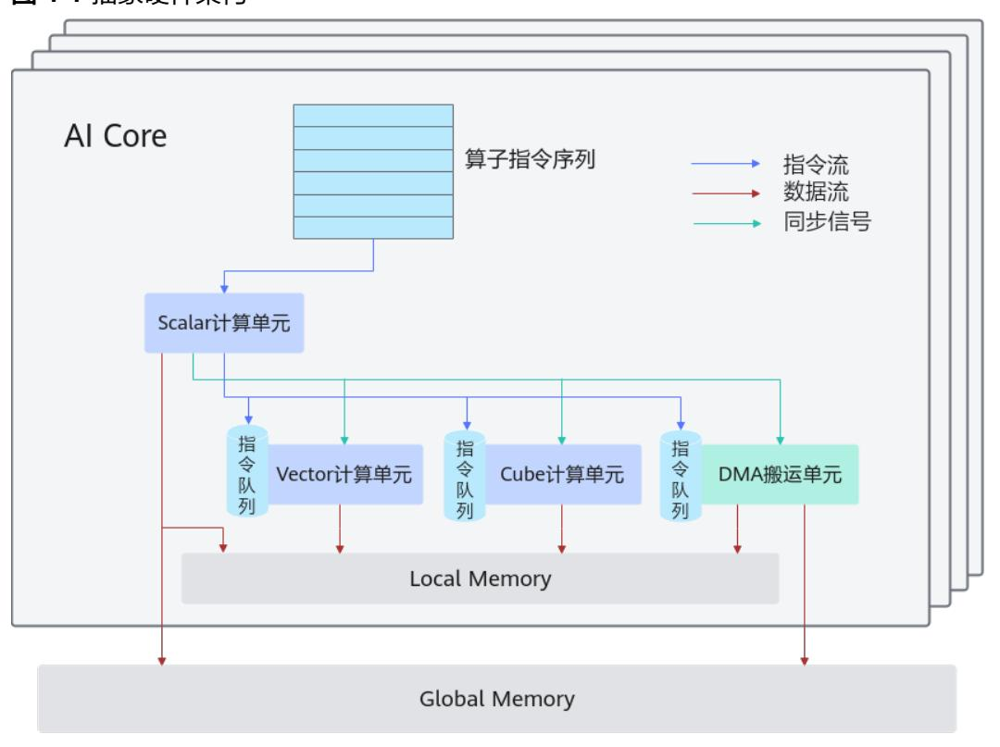

AI Core中包含计算单元、存储单元、搬运单元等核心组件。

- 计算单元包括了三种基础计算资源:Cube计算单元、Vector计算单元和Scalar计 算单元。
- 存储单元包括内部存储和外部存储:
  - AI Core的内部存储,统称为Local Memory,对应的数据类型为 LocalTensor。

- AI Core能够访问的外部存储称之为Global Memory,对应的数据类型为 GlobalTensor。
- DMA(Direct Memory Access)搬运单元:负责数据搬运,包括Global Memory 和Local Memory之间的数据搬运,以及不同层级Local Memory之间的数据搬 运。

AI Core内部核心组件及组件功能详细说明如下表。

表 **4-1** AI Core 内部核心组件

| 组件分类 | 组件名称                         | 组件功能                                                                       |
|------|------------------------------|----------------------------------------------------------------------------|
| 计算单元 | Scalar                       | 执行地址计算、循环控制等标量计算工作,并把向<br>量计算、矩阵计算、数据搬运、同步指令发射给对<br>应单元执行。                 |
|      | Vector                       | 负责执行向量运算。                                                                  |
|      | Cube                         | 负责执行矩阵运算。                                                                  |
| 存储单元 | Local Memory                 | AI Core的内部存储。                                                              |
| 搬运单元 | DMA(Direct<br>Memory Access) | 负责数据搬运,包括Global Memory和Local<br>Memory之间的数据搬运以及不同层级Local<br>Memory之间的数据搬运。 |

开发者在理解硬件架构的抽象时,需要重点关注如下异步指令流、同步信号流、计算 数据流三个过程:

- AI Core内部的异步并行计算过程:Scalar计算单元读取指令序列,并把向量计 算、矩阵计算、数据搬运指令发射给对应单元的指令队列,向量计算单元、矩阵 计算单元、数据搬运单元异步的并行执行接收到的指令。该过程可以参考[图](#page-74-0)**1**中蓝 色箭头所示的指令流。
- 不同的指令间有可能存在依赖关系,为了保证不同指令队列间的指令按照正确的 逻辑关系执行,Scalar计算单元也会给对应单元下发同步指令。各单元之间的同步 过程可以参考[图](#page-74-0)**1**中的绿色箭头所示的同步信号流。
- AI Core内部数据处理的基本过程:DMA搬入单元将数据从Global Memory搬运到 Local Memory,Vector/Cube计算单元完成数据计算,并把计算结果写回Local Memory,DMA搬出单元把处理好的数据从Local Memory搬运回Global Memory。该过程可以参考[图](#page-74-0)**1**中的红色箭头所示的数据流。

# **5** 编程模型

<span id="page-76-0"></span>SPMD模型 [核函数](#page-78-0) [编程范式](#page-81-0) [编程接口概述](#page-87-0)

## **5.1 SPMD** 模型

Ascend C算子编程是SPMD(Single-Program Multiple-Data)编程,SPMD是一种常 用的并行计算的方法,是提高计算速度的有效手段。

假设,从输入数据到输出数据需要经过3个阶段任务的处理(T1、T2、T3)。如下图 所示,SPMD模式下,系统会启动一组进程,并行处理待处理的数据:首先待处理数据 会被切分成多个数据分片,切分后的数据分片随后被分发给不同进程处理,每个进程 接收到一个或多个数据分片,并独立地对这些分片进行3个任务的处理。

### 图 **5-1** SPMD 数据并行示意图

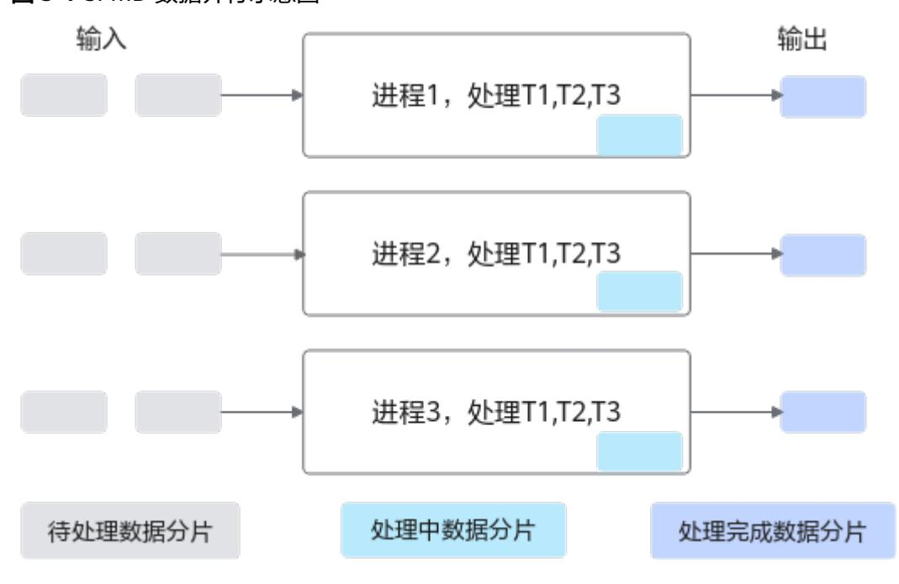

具体到Ascend C编程模型中的应用,是将需要处理的数据拆分并同时在多个计算核心 (类比于上文介绍中的多个进程)上运行,从而获取更高的性能。多个AI Core共享相 同的指令代码,每个核上的运行实例唯一的区别是block\_idx不同,每个核通过不同的 block\_idx来识别自己的身份。block的概念类似于上文中进程的概念,block\_idx就是标 识进程唯一性的进程ID。并行计算过程如下图所示。

### 图 **5-2** SPMD 并行计算示意图

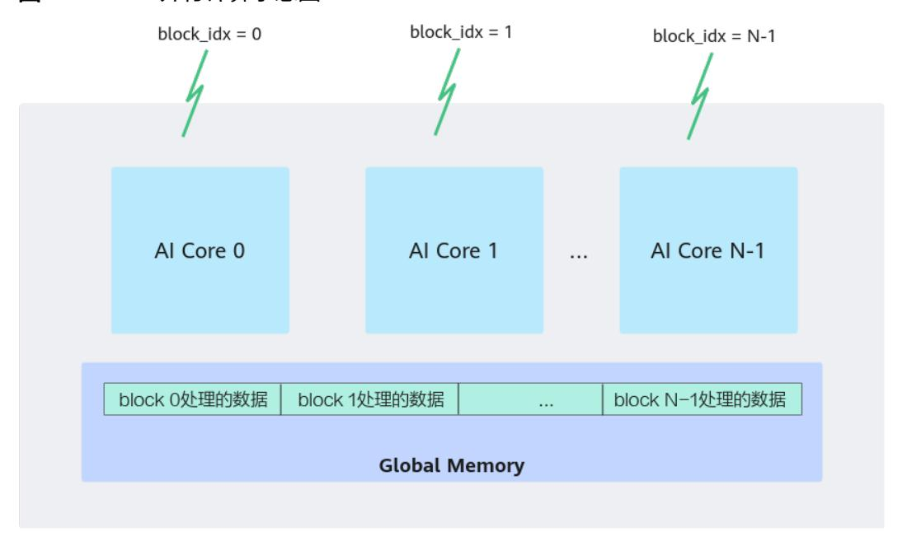

下面的代码片段取自于Ascend C Add算子的实现代码,算子被调用时,所有的计算核 心都执行相同的实现代码,入口函数的入参也是相同的。每个核上处理的数据地址需 要在起始地址上增加**GetBlockIdx()**\*BLOCK\_LENGTH(每个核处理的数据长度)的偏 移来获取。这样也就实现了多核并行计算的数据切分。代码中GetBlockIdx接口用于获 取每个核的block\_idx。

```
class KernelAdd {
public:
 __aicore__ inline KernelAdd() {}
 __aicore__ inline void Init(GM_ADDR x, GM_ADDR y, GM_ADDR z)
 {
 // 不同核根据各自的block_idx设置数据地址
 xGm.SetGlobalBuffer((__gm__ half*)x + BLOCK_LENGTH * AscendC::GetBlockIdx(), BLOCK_LENGTH);
 yGm.SetGlobalBuffer((__gm__ half*)y + BLOCK_LENGTH * AscendC::GetBlockIdx(), BLOCK_LENGTH);
 zGm.SetGlobalBuffer((__gm__ half*)z + BLOCK_LENGTH * AscendC::GetBlockIdx(), BLOCK_LENGTH);
 // Queue初始化,单位为字节
 pipe.InitBuffer(inQueueX, BUFFER_NUM, TILE_LENGTH * sizeof(half));
 pipe.InitBuffer(inQueueY, BUFFER_NUM, TILE_LENGTH * sizeof(half));
 pipe.InitBuffer(outQueueZ, BUFFER_NUM, TILE_LENGTH * sizeof(half));
 }
 ...
}
// 实现核函数
extern "C" __global__ __aicore__ void add_custom(GM_ADDR x, GM_ADDR y, GM_ADDR z)
{
 // 初始化算子类,算子类提供算子初始化和核心处理等方法
 KernelAdd op;
 // 初始化函数,获取该核函数需要处理的输入输出地址,同时完成必要的内存初始化工作
 op.Init(x, y, z);
 // 核心处理函数,完成算子的数据搬运与计算等核心逻辑
```

```
 op.Process();
}
```

## <span id="page-78-0"></span>**5.2** 核函数

核函数(Kernel Function)是Ascend C算子设备侧实现的入口。Ascend C允许用户使 用C/C++函数的语法扩展来编写设备端的运行代码,用户在核函数中进行数据访问和计 算操作,由此实现该算子的所有功能。区别于普通的C++函数调用时仅执行一次,当核 函数被调用时,多个核都执行相同的核函数代码,具有相同的函数入参,并行执行。

核函数定义时需要使用函数类型限定符\_\_global\_\_和\_\_aicore\_\_;其指针入参变量需要 增加变量类型限定符\_\_gm\_\_,表明该指针变量指向Global Memory上某处内存地址; 使用<<<>>>内核调用符调用执行核函数,并指定调用时的执行核数。

以下是一个Add算子的核函数示例,完整样例请参考**6.2** [矢量编程](#page-92-0)中的Add算子示例。

```
// 实现核函数
extern "C" __global__ __aicore__ void add_custom(__gm__ uint8_t* x, __gm__ uint8_t* y, __gm__ uint8_t* z)
 // 初始化算子类,算子类提供算子初始化和核心处理等方法
 KernelAdd op;
 // 初始化函数,获取该核函数需要处理的输入输出地址,同时完成必要的内存初始化工作
 op.Init(x, y, z);
 // 核心处理函数,完成算子的数据搬运与计算等核心逻辑
 op.Process();
}
// 调用核函数
void add_custom_do(uint32_t blockDim, void* l2ctrl, void* stream, uint8_t* x, uint8_t* y, uint8_t* z)
 add_custom<<<blockDim, l2ctrl, stream>>>(x, y, z);
}
```

## 核函数定义和调用

定义核函数时需要遵循以下规则。

### ● 使用函数类型限定符

除了需要按照C/C++函数声明的方式定义核函数之外,还要为核函数加上额外的函 数类型限定符,包含\_\_global\_\_和\_\_aicore\_\_。

使用\_\_global\_\_函数类型限定符来标识它是一个核函数,可以被<<<>>>调用;使 用\_\_aicore\_\_函数类型限定符来标识该核函数在设备端AI Core上执行:

```
__global__ __aicore__ void kernel_name(argument list);
```

编程中使用到的函数可以分为三类:核函数(device侧执行)、host侧执行函 数、device侧执行函数(除核函数之外的)。下图以Kernel直调算子开发方式为例 描述三者的调用关系:

- host侧执行函数可以调用同类的host执行函数,也就是通用C/C++编程中的函 数调用;也可以通过<<<>>>调用核函数。
- device侧执行函数(除核函数之外的)可以调用同类的device侧执行函数。
- 核函数可以调用device侧执行函数(除核函数之外的)。


<span id="page-79-0"></span>图 **5-3** 核函数、host 侧执行函数、device 侧执行函数调用关系

### ● 使用变量类型限定符

指针入参变量需要增加变量类型限定符\_\_gm\_\_,表明该指针变量指向Global Memory上某处内存地址。

### ● 其他规则或建议

- a. 规则:核函数必须具有void返回类型。
- b. 规则:仅支持入参为指针或C/C++内置数据类型(Primitive data types), 如:half\* s0、float\* s1、int32\_t c。
- c. 建议:为了统一表达,建议使用GM\_ADDR宏来修饰入参,GM\_ADDR宏定义 如下:

#define GM\_ADDR \_\_gm\_\_ uint8\_t\*

使用GM\_ADDR修饰入参的样例如下:

extern "C" \_\_global\_\_ \_\_aicore\_\_ void add\_custom(GM\_ADDR x, GM\_ADDR y, GM\_ADDR z) 这里统一使用uint8\_t类型的指针,在后续的使用中需要将其转化为实际的指 针类型。

核函数的调用语句是C/C++函数调用语句的一种扩展。本节仅描述最基础的调用方式, 实际进行算子开发时,对算子调用可以有更多选择,更多细节请参考**[6.6 Kernel](#page-194-0)**直调 [算子开发和](#page-194-0)**6.7** [工程化算子开发。](#page-213-0)

常见的函数调用方式是如下的形式:

function\_name(argument list);

核函数使用内核调用符<<<...>>>这种语法形式,来规定核函数的执行配置:

kernel\_name<<<blockDim, l2ctrl, stream>>>(argument list);

内核调用符仅可在NPU侧编译时调用,CPU侧编译无法识别该符号。

### 执行配置由3个参数决定:

● blockDim,规定了核函数将会在几个核上执行。每个执行该核函数的核会被分配 一个逻辑ID,即block\_idx,可以在核函数的实现中调用**[14.1.4.6.2 GetBlockIdx](#page-1065-0)**来 获取block\_idx;

### 说明

blockDim是逻辑核的概念,取值范围为[1,65535]。为了充分利用硬件资源,一般设置为 物理核的核数或其倍数。对于耦合架构和分离架构,blockDim在运行时的意义和设置规则 有一些区别,具体说明如下:

- 耦合架构:由于其Vector、Cube单元是集成在一起的,blockDim用于设置启动多个 AICore核实例执行,不区分Vector、Cube。AI Core的核数可以通过**[GetCoreNumAiv](#page-2245-0)** 或者**[GetCoreNumAic](#page-2244-0)**获取。
- 分离架构
  - 针对仅包含Vector计算的算子,blockDim用于设置启动多少个Vector(AIV)实例 执行,比如某款AI处理器上有40个Vector核,建议设置为40。
  - 针对仅包含Cube计算的算子,blockDim用于设置启动多少个Cube(AIC)实例执 行,比如某款AI处理器上有20个Cube核,建议设置为20。
  - 针对Vector/Cube融合计算的算子,启动时,按照AIV和AIC组合启动,blockDim 用于设置启动多少个组合执行,比如某款AI处理器上有40个Vector核和20个Cube 核,一个组合是2个Vector核和1个Cube核,建议设置为20,此时会启动20个组 合,即40个Vector核和20个Cube核。注意:该场景下,设置的**blockDim**逻辑核 的核数不能超过物理核(**2**个**Vector**核和**1**个**Cube**核组合为**1**个物理核)的核数。
  - AIC/AIV的核数分别通过**[GetCoreNumAic](#page-2244-0)**和**[GetCoreNumAiv](#page-2245-0)**接口获取。
- l2ctrl,保留参数,暂时设置为固定值nullptr,开发者无需关注;
- stream,类型为aclrtStream,stream用于维护一些异步操作的执行顺序,确保按 照应用程序中的代码调用顺序在device上执行。stream创建等管理接口请参考 《**AscendCL**[应用开发指南](https://www.hiascend.com/document/detail/zh/CANNCommunityEdition/82RC1/appdevg/acldevg/aclcppdevg_000000.html) **(C&C++)**》中的"acl API参考 > 运行时管理 > **[Stream](https://www.hiascend.com/document/detail/zh/CANNCommunityEdition/82RC1/API/appdevgapi/aclcppdevg_03_0066.html)**管理"章节。

如下名为add\_custom的核函数,实现两个矢量的相加,调用示例如下:

// blockDim设置为8表示在8个核上调用了add\_custom核函数,每个核都会独立且并行地执行该核函数,该核函 数的参数列表为x,y,z。 add\_custom<<<8, nullptr, stream>>>(x, y, z);

核函数的调用是异步的,核函数的调用结束后,控制权立刻返回给主机端,可以调用 以下**aclrtSynchronizeStream**函数来强制主机端程序等待所有核函数执行完毕。

aclError aclrtSynchronizeStream(aclrtStream stream);

aclrtSynchronizeStream的具体用法参考《**AscendCL**[应用开发指南](https://www.hiascend.com/document/detail/zh/CANNCommunityEdition/82RC1/appdevg/acldevg/aclcppdevg_000000.html) **(C&C++)**》。

## 模板核函数定义和调用

支持开发者使用模板定义核函数,核函数定义示例如下,它有两个模板参数:a和T。a 是一个非类型模板参数,T是一个类型模板参数。

```
template<int a, typename T>
__global__ __aicore__ void add_custom(GM_ADDR x, GM_ADDR y, GM_ADDR z)
{
...
 AscendC::printf("Print Template a: %d\n", a);
...
 xGm.SetGlobalBuffer((__gm__T*)x + BLOCK_LENGTH * AscendC::GetBlockIdx(), BLOCK_LENGTH);
 yGm.SetGlobalBuffer((__gm__T*)y + BLOCK_LENGTH * AscendC::GetBlockIdx(), BLOCK_LENGTH);
```

```
 zGm.SetGlobalBuffer((__gm__T*)z + BLOCK_LENGTH * AscendC::GetBlockIdx(), BLOCK_LENGTH);
...
}
```

模板核函数的调用方式如下:add\_custom<20, float>这部分代码调用了名为 add\_custom的核函数,并为其模板参数提供了具体值。

add\_custom<20, float><<<blockDim, nullptr, stream>>>(x, y, z);

### 模板核函数当前有如下使用限制:

- 仅支持<<<>>>调用方式。
- 暂不支持自定义数据类型。

如下是一个反例,hello\_world核函数尝试使用自定义数据类型Person,这种用法 不被支持。

```
struct Person {
 int age;
};
template<int a, typename T>
__global__ __aicore__ void hello_world()
{
 AscendC::printf("Hello World!!!\n");
 AscendC::printf("template %d\n", a);
 T x = {30};
 AscendC::printf("template T %d\n", x.age);
}
void hello_world_do(uint32_t blockDim, void *stream)
 Person person = {30};
 hello_world<300, Person><<<blockDim, nullptr, stream>>>(person);
}
```

## **5.3** 编程范式

### 编程范式描述了算子实现的固定流程,基于编程范式进行编程,可以快速搭建算子实 现的代码框架。

根据**4** [抽象硬件架构](#page-74-0)可以了解到,AI Core内部的执行单元异步并行地执行接收到的指 令。如下图所示,从输入数据到输出数据需要经过3个阶段任务的处理(T1、T2、 T3),多个执行单元并行处理,每个执行单元只会专注于一个任务的处理,会处理所 有的数据分片。可以看出,流水线并行和工业生产中的流水线是类似的,每一个执行 单元都可以看成是流水线上的节点,通过流水线并行的方式来提高计算效率:执行单 元1完成对某个数据分片的处理后,将其加入到通信队列,执行单元2空闲时就会从队 列中取出数据继续处理;可以类比为生产流水线中的工人只完成某一项固定工序,完 成后就交由下一项工序负责人继续处理。

### 图 **5-4** 流水线并行示意图

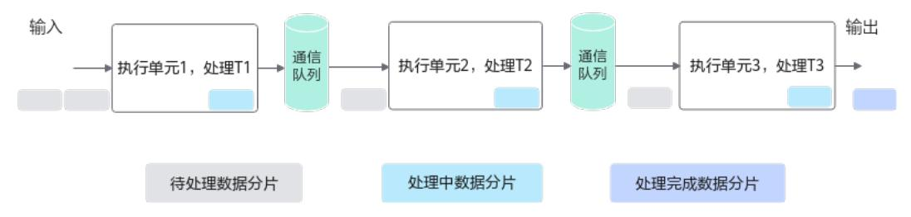

Ascend C编程范式就是这样一种流水线式的编程范式,把算子核内的处理程序,分成 多个流水任务,通过队列(Queue)完成任务间通信和同步,并通过统一的资源管理 模块(Pipe)来统一管理内存、事件等资源。

## <span id="page-82-0"></span>**Vector** 编程范式


如上图所示,Vector编程范式把算子的实现流程分为3个基本任务:CopyIn, Compute,CopyOut。

- **CopyIn**负责搬入操作:将输入数据从Global Memory搬运到Local Memory (VECIN用于表达矢量计算搬入数据的存放位置),完成搬运后执行入队列操 作;
- **Compute**负责矢量指令计算操作:完成队列出队后,从Local Memory获取数据 并计算,计算完成后执行入队操作;
- **CopyOut**负责搬出操作:完成队列出队后,将计算结果从Local Memory (VECOUT用于表达矢量计算搬出数据的存放位置)搬运到Global Memory。

上文中提到的VECIN/VECOUT是**[TPosition](#page-1056-0)**的概念。Ascend C管理不同层级的物理内存 时,用一种抽象的逻辑位置(TPosition)来表达各级别的存储,代替了片上物理存储 的概念,达到隐藏硬件架构的目的。除了VECIN/VECOUT,矢量编程中还会使用到 VECCALC,一般在定义临时变量时使用此位置。TPosition与物理内存的映射关系请参 考表**[14-28](#page-422-0)**。

从编程的角度来讲,具体流程(如下文的伪代码)和流程图如下:

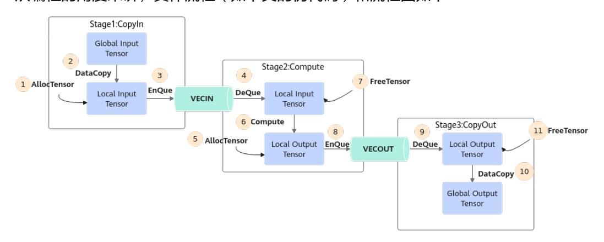

```
AscendC::TPipe pipe; //创建全局的资源管理 
AscendC::TQue<AscendC::TPosition::VecIn, 1> queIn; //创建CopyIn阶段的队列
AscendC::TQue<AscendC::TPosition::VecOut, 1> queOut; //创建CopyOut阶段的队列
// Init 阶段:
pipe.InitBuffer(queIn, 2, 1024); // 开启double buffer,将待处理的数据一分为二,实现流水并行
pipe.InitBuffer(queOut, 2, 1024);
for-loop {
 //CopyIn 阶段{
 auto tensor = queIn.AllocTensor<half>(); //从Que上申请资源, 长度1024
 AscendC::DataCopy(tensor, gm, 1024); //搬运数据从GM到VECIN
 queIn.EnQue(tensor);
```

```
 }
 //Compute阶段{
 auto tensor = queIn.DeQue<half>();
 auto tensorOut = queOut.AllocTensor<half>();
 AscendC::Abs(tensorOut, tensor, 1024);
 queIn.FreeTensor(tensor);
 queOut.EnQue(tensorOut);
 }
 //CopyOut 阶段{
 auto tensor = queOut.DeQue<half>();
 AscendC::DataCopy(gmOut, tensor, 1024);
 queOut.FreeTensor(tensor);
 }
}
```

任务间数据传递使用到的内存、事件等资源统一由管理模块Pipe进行管理。如下所示 的内存管理示意图,TPipe通过 **[InitBuffer](#page-947-0)**接口对外提供Queue内存初始化功能,开发 者可以通过该接口为指定的Queue分配内存。

Queue队列内存初始化完成后,需要使用内存时,通过调用 **[AllocTensor](#page-980-0)**来为 LocalTensor分配内存,当创建的LocalTensor完成相关计算无需再使用时,再调用 **[FreeTensor](#page-982-0)**来回收LocalTensor的内存。

### 图 **5-5** 内存管理示意图

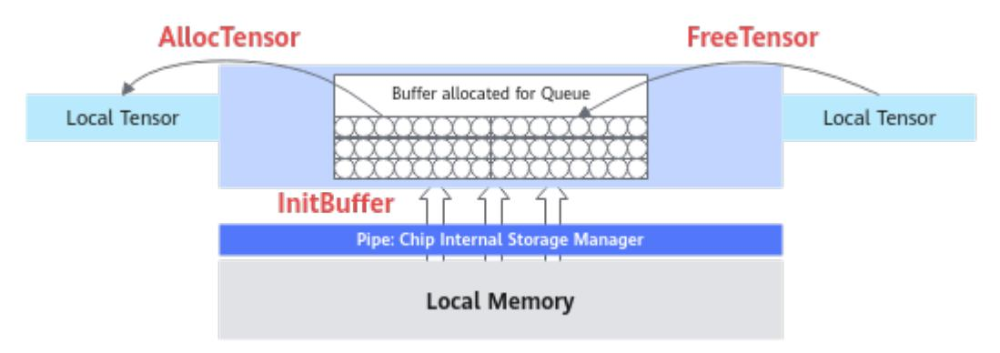

编程过程中使用到的临时变量内存同样通过Pipe进行管理。临时变量可以使用TBuf数 据结构来申请指定TPosition上的存储空间。使用TBuf申请的内存空间只能参与计算, 无法执行Queue队列的入队出队操作。具体的接口使用说明请参考**[14.1.4.4.7 TBuf](#page-1009-0)**。

按照上述编程范式进行编程即可实现单核上数据的并行处理。需要处理的数据被切分 成n片,每个并行任务(Stage1、2、3)需要依次完成n个数据切片的处理。Stage间 的箭头表达数据间的依赖关系,比如Stage1(CopyIn)处理完第一个数据分片之后, Stage2(Compute)才能对该分片进行处理。

### 图 **5-6** 流水任务示意图


上图中的流水任务运行起来的示意图如下,Progress1、2、3代表数据分片处理流程, 从运行图中可以看出,对于同一片数据,Stage1、Stage2、Stage3之间的处理具有依 赖关系,需要串行处理;不同的数据切片,同一时间点,可以有多个任务在并行处 理,由此达到任务并行、提升性能的目的。

图 **5-7** 流水任务运行示意图

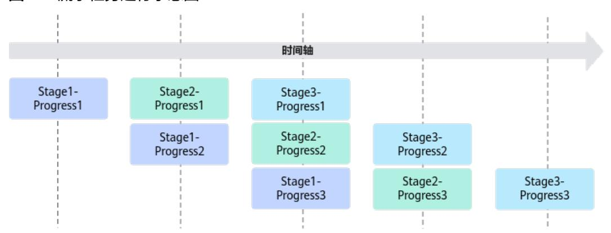

## **Cube** 编程范式

Cube计算的典型数据流图如下所示:

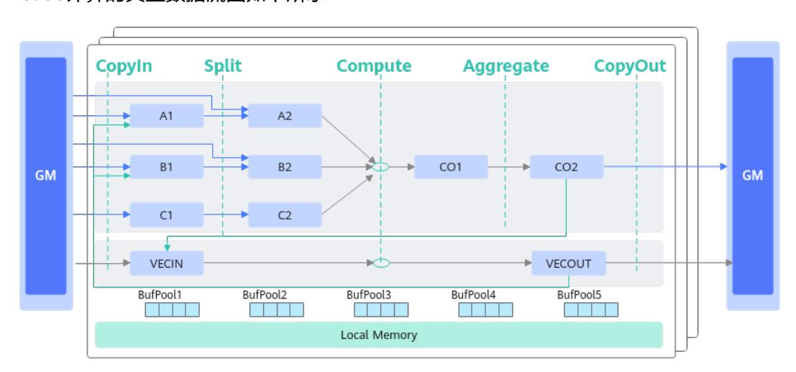

和矢量编程范式一样,同样也使用逻辑位置(TPosition)来表达数据流,Cube编程范 式中主要使用的逻辑位置定义如下:

- A1:代表设备上用于矩阵计算的逻辑内存,用于存放左矩阵,物理存储对应AI Core的L1 Buffer。
- B1:代表设备上用于矩阵计算的逻辑内存,用于存放右矩阵,物理存储对应AI Core的L1 Buffer。
- C1:代表设备上用于矩阵计算的逻辑内存,用于存放Bias(偏置)数据,物理存 储对应AI Core的L1 Buffer或Unified Buffer。
- A2:代表设备上用于矩阵计算的逻辑内存,用于存放小块左矩阵(如经过分割、 适配L0A Buffer容量的分块),物理存储对应AI Core的L0A Buffer。
- B2:代表设备上用于矩阵计算的逻辑内存,用于存放小块右矩阵(如经过分割、 适配L0B Buffer容量的分块),物理存储对应AI Core的L0B Buffer。

- C2:代表设备上用于矩阵计算的逻辑内存,用于存放小块Bias(偏置)数据(如 经过分割、适配BT Buffer容量的分块),物理存储对应AI Core的BT Buffer或L0C Buffer。
- CO1:代表设备上用于矩阵计算的逻辑内存,用于存放小块矩阵计算结果(如经 过分割的矩阵计算结果分块),物理存储对应AI Core的L0C Buffer。
- CO2:代表设备上用于矩阵计算的逻辑内存,用于存放矩阵计算结果(如原始矩 阵的最终计算结果),物理存储对应Global Memory或AI Core的Unified Buffer。
- VECIN:代表设备上用于矢量计算的逻辑内存,用于存放矢量计算的输入数据, 物理存储对应AI Core的Unified Buffer。
- VECCALC:代表设备上用于矢量计算的逻辑内存,用于存放临时变量,物理存储 对应AI Core的Unified Buffer。
- VECOUT:代表设备上用于矢量计算的逻辑内存,用于存放矢量计算的输出数 据,物理存储对应AI Core的Unified Buffer。

TPosition与物理内存的映射关系请参考表**[14-28](#page-422-0)**。

Cube计算流程同样也可以理解为CopyIn、Compute、CopyOut这几个阶段,因为流程 相对复杂,Matmul高阶API提供对此的高阶封装,简化了编程范式。

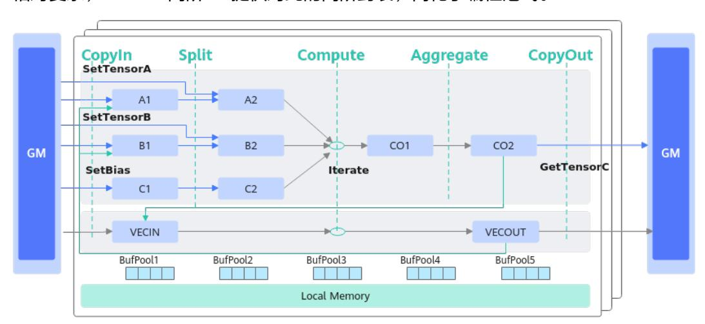

如上图所示:CopyIn阶段对应**[SetTensorA](#page-1482-0)**、**[SetTensorB](#page-1485-0)**、**[SetBias](#page-1487-0)**接口;Compute阶 段对应**[Iterate](#page-1492-0)**接口;CopyOut阶段对应**[GetTensorC](#page-1494-0)**接口。具体流程可参考如下示例:

```
// 创建Matmul对象 创建对象时需要传入A、B、C、Bias的参数类型信息, 类型信息通过MatmulType来定义,
包括:内存逻辑位置、数据格式、数据类型。
typedef MatmulType<TPosition::GM, CubeFormat::ND, half> aType; 
typedef MatmulType<TPosition::GM, CubeFormat::ND, half> bType; 
typedef MatmulType<TPosition::GM, CubeFormat::ND, float> cType; 
typedef MatmulType<TPosition::GM, CubeFormat::ND, float> biasType; 
Matmul<aType, bType, cType, biasType> mm; 
REGIST_MATMUL_OBJ(&pipe, GetSysWorkSpacePtr(), mm, &tiling); // 初始化
// CopyIn阶段:完成从GM到LocalMemory的搬运
mm.SetTensorA(gm_a); // 设置左矩阵A
mm.SetTensorB(gm_b); // 设置右矩阵B
mm.SetBias(gm_bias); // 设置Bias
// Compute阶段:完成矩阵乘计算
while (mm.Iterate()) { 
 // CopyOut阶段:完成从LocalMemory到GM的搬运
 mm.GetTensorC(gm_c); 
}
// 结束矩阵乘操作
mm.End();
```

## 融合算子编程范式

支持Vector与Cube混合计算的算子称之为融合算子。Ascend C提供融合算子的编程范 式,方便开发者基于该范式表达融合算子的数据流,快速实现自己的融合算子。

融合算子数据流指融合算子的输入输出在各存储位置间的流向。以一个典型的Cube和 Vector融合算子为例,逻辑位置间的数据流向如下图所示(为了简化描述,没有列出 bias):

- Cube的输出可以作为Vector的输入:CO2->VECIN
- Vector的输出可以作为Cube的输入:VECOUT->A1->A2、VECOUT->B1->B2

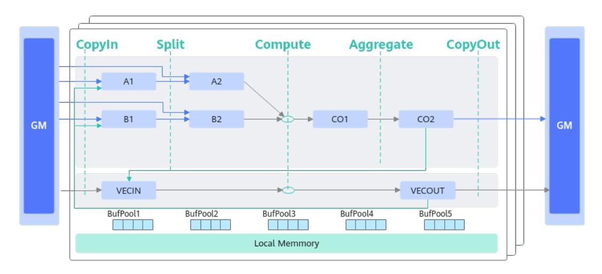

基于Matmul高阶API的融合算子编程范式,对上述数据流简化表达如下:

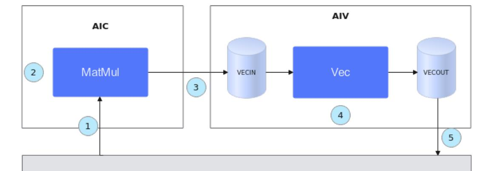

图 **5-8** 融合算子编程范式

- 1. 初始化一个MatMul对象,将输入数据从Global Memory搬运到Cube核上。
- 2. 进行MatMul内部的计算。
- 3. 将MatMul的计算结果搬运到Vector核上。
- 4. 进行Vector矢量计算。
- 5. 将输出结果搬运到Global Memory上。

整个过程的示例代码如下(伪代码):

{

```
template<typename aType, typename bType, typename cType, typename biasType>
__aicore__ inline void MatmulLeakyKernel<aType, bType, cType, biasType>::Process()
 // 步骤1:初始化一个MatMul对象,将输入数据从Global Memory搬运到Cube核上。
 uint32_t computeRound = 0;
 REGIST_MATMUL_OBJ(&pipe, GetSysWorkSpacePtr(), matmulObj);
 matmulObj.Init(&tiling);
 matmulObj.SetTensorA(aGlobal);
 matmulObj.SetTensorB(bGlobal);
 matmulObj.SetBias(biasGlobal);
 while (matmulObj.template Iterate<true>()) { // 步骤2:进行MatMul内部的计算。
 // 步骤3:将MatMul的计算结果搬运到Vector核上。
 reluOutLocal = reluOutQueue_.AllocTensor<cType>();
 matmulObj.template GetTensorC<true>(reluOutLocal, false, true);
 // 步骤4:进行Vector矢量计算。
 AscendC::LeakyRelu(reluOutLocal, reluOutLocal, (cType)alpha, tiling.baseM * tiling.baseN);
 reluOutQueue_.EnQue(reluOutLocal);
 // 步骤5:将输出结果搬运到Global Memory上
 reluOutQueue_.DeQue<cType>();
 ...
 AscendC::DataCopy(cGlobal[startOffset], reluOutLocal, copyParam);
 reluOutQueue_.FreeTensor(reluOutLocal);
 computeRound++;
 }
 matmulObj.End();
```

## **5.4** 编程接口概述

}

### 说明

本章提供编程API的概述。具体API参考见**[Ascend C API](#page-401-0)**。

Ascend C提供一组类库API,开发者使用标准C++语法和类库API进行编程。Ascend C 编程类库API示意图如下所示,分为:

- Kernel API:用于实现算子核函数的API接口。包括:
  - 基本数据结构:kernel API中使用到的基本数据结构,比如GlobalTensor和 LocalTensor。
  - 基础**API**:实现对硬件能力的抽象,开放芯片的能力,保证完备性和兼容性。 标注为ISASI(Instruction Set Architecture Special Interface,硬件体系结构 相关的接口)类别的API,不能保证跨硬件版本兼容。
  - 高阶**API**:实现一些常用的计算算法,用于提高编程开发效率,通常会调用多 种基础API实现。高阶API包括数学库、Matmul、Softmax等API。高阶API可 以保证兼容性。

### ● Host API:

- 高阶API配套的Tiling API:kernel侧高阶API配套的Tiling API,方便开发者获 取kernel计算时所需的Tiling参数。
- Ascend C算子原型注册与管理API:用于Ascend C算子原型定义和注册的 API。
- Tiling数据结构注册API:用于Ascend C算子TilingData数据结构定义和注册 的API。
- 平台信息获取API:在实现Host侧的Tiling函数时,可能需要获取一些硬件平 台的信息,来支撑Tiling的计算,比如获取硬件平台的核数等信息。平台信息 获取API提供获取这些平台信息的功能。

● 算子调测API:用于算子调测的API,包括孪生调试,性能调测等。

进行Ascend C算子Host侧编程时,需要使用基础数据结构和API,请参[考基础数据结构](#page-2415-0) [与接口](#page-2415-0);完成算子开发后,需要使用Runtime API完成算子的调用,请参考 《**AscendCL**[应用开发指南](https://www.hiascend.com/document/detail/zh/CANNCommunityEdition/82RC1/appdevg/acldevg/aclcppdevg_000000.html) **(C&C++)**》中的"acl API参考"章节。

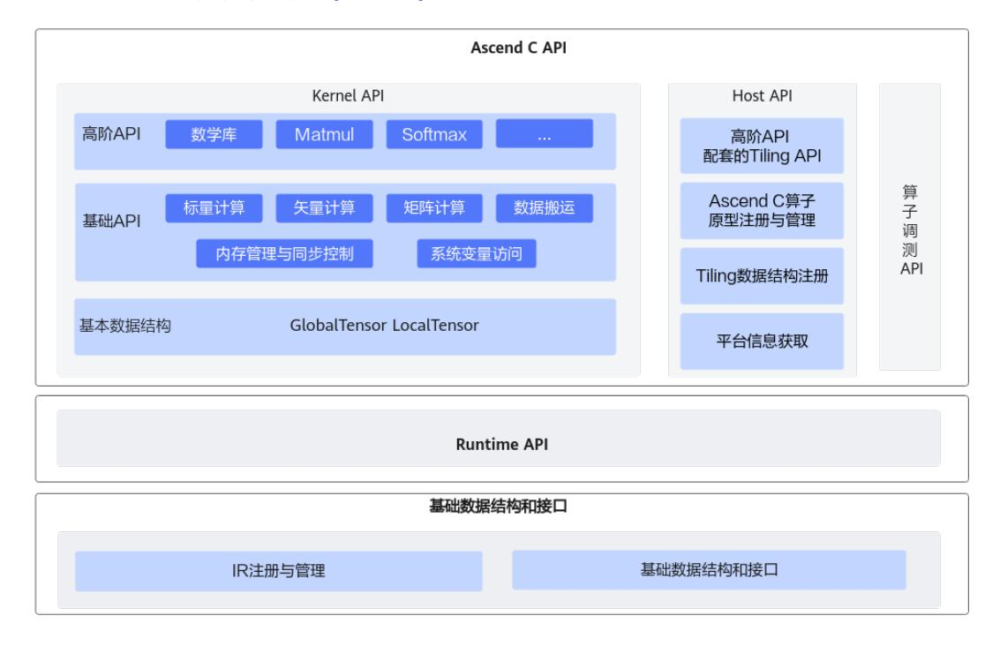

### 说明

Ascend C API所在头文件目录为:

- 基础API:\${INSTALL\_DIR}/include/ascendc/basic\_api/interface
- 高阶API:(注意,如下目录头文件中包含的接口如果未在资料中声明,属于间接调用接 口,开发者无需关注)
  - \${INSTALL\_DIR}/include/ascendc/highlevel\_api/lib
  - \${INSTALL\_DIR}/include/tiling

\${INSTALL\_DIR}请替换为CANN软件安装后文件存储路径。若安装的Ascend-cann-toolkit软件 包,以root安装举例,则安装后文件存储路径为:/usr/local/Ascend/ascend-toolkit/latest。

## 基础 **API** 概述

### 对于基础**API**,主要分为以下几类:

- [标量计算](#page-402-0)**API**,实现调用Scalar计算单元执行计算的功能。
- [矢量计算](#page-403-0)**API**,实现调用Vector计算单元执行计算的功能。
- [矩阵计算](#page-1087-0)**API**,实现调用Cube计算单元执行计算的功能。
- [数据搬运](#page-406-0)**API**,计算API基于Local Memory数据进行计算,所以数据需要先从 Global Memory搬运至Local Memory,再使用计算API完成计算,最后从Local Memory搬出至Global Memory。执行搬运过程的接口称之为数据搬运API,比如 DataCopy接口。
- [内存管理与同步控制](#page-406-0)**API**
  - 内存管理API,用于分配管理内存,比如AllocTensor、FreeTensor接口;

– 同步控制API,完成任务间的通信和同步,比如EnQue、DeQue接口。不同的 API指令间有可能存在依赖关系,从**4** [抽象硬件架构](#page-74-0)可知,不同的指令异步并 行执行,为了保证不同指令队列间的指令按照正确的逻辑关系执行,需要向 不同的组件发送同步指令。同步控制API内部即完成这个发送同步指令的过 程,开发者无需关注内部实现逻辑,使用简单的API接口即可完成。

对于基础API中的计算**API**,根据对数据操作方法的不同,分为以下几种计算方式:

- 整个**tensor**参与计算:通过运算符重载的方式实现,支持"+, -, \*, /, |, &, <, >, <=, >=, ==, !=",实现计算的简化表达。例如: dst=src1+src2
- **tensor**前**n**个数据计算:针对源操作数的连续n个数据进行计算并连续写入目的操 作数,解决一维tensor的连续计算问题。例如: Add(dst, src1, src2, n);
- **tensor**高维切分计算:功能灵活的计算API,充分发挥硬件优势,支持对每个操作 数的DataBlock Stride,Repeat Stride,Mask等参数的操作。这些参数的详细介 绍请参见**11.4** 如何使用**Tensor**[高维切分计算](#page-336-0)**API**。

下图以矢量加法为例,展示了几种计算方式的特点。

### 图 **5-9** 计算 API 几种计算方式的特点

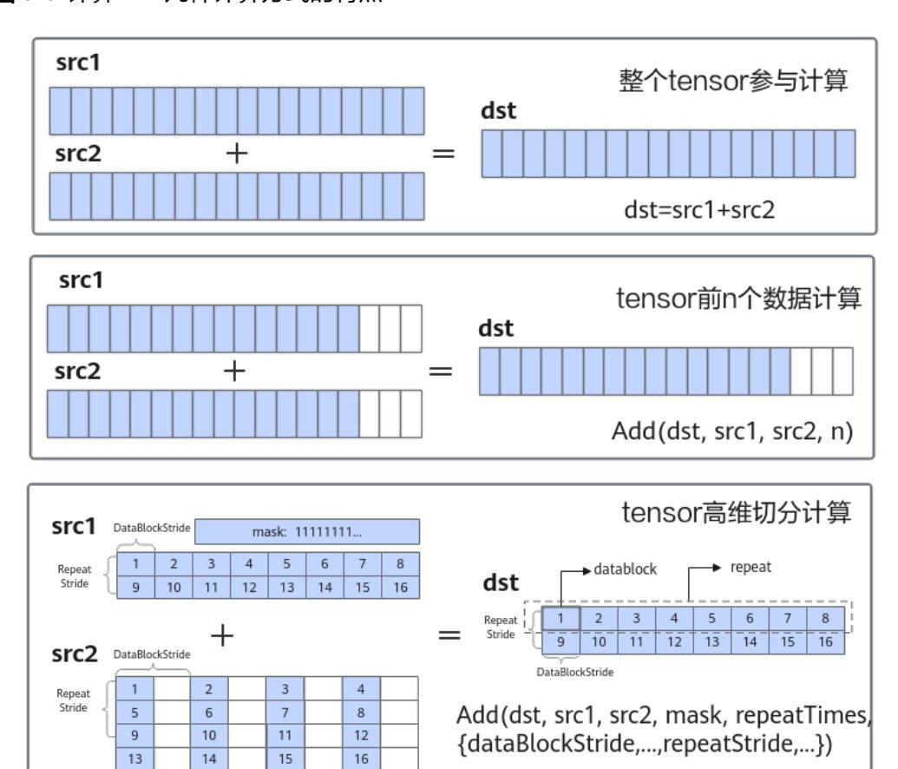

## 高阶 **API** 概述

[高阶](#page-413-0)**API**一般是基于单核对常见算法的抽象和封装,用于提高编程开发效率,通常会调 用多种基础API实现。高阶API包括数学库、Matmul、Softmax等API。

如下图所示,实现一个矩阵乘操作,使用基础API需要的步骤较多,需要关注格式转 换、数据切分等逻辑;使用高阶API则无需关注这些逻辑,可以快速实现功能。

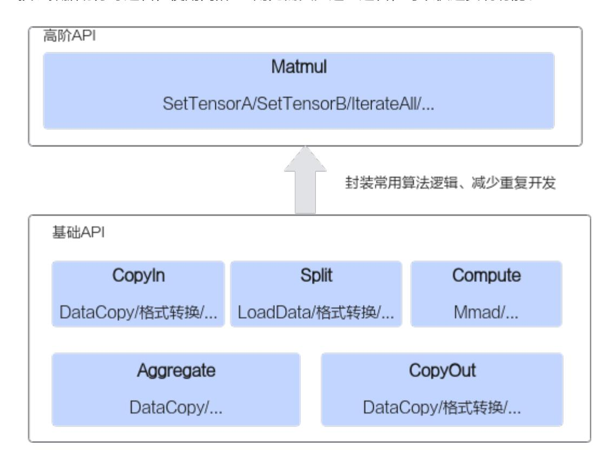

由于AI处理器的Scalar计算单元执行能力有限,为减少算子Kernel侧的Scalar计算,将 部分计算在Host端执行,这需要编写**Host**端**[Tiling](#page-224-0)**代码。注意,在程序中调用高阶API 的Tiling接口或者使用高阶API的Tiling结构体参数时,需要引入依赖的头文件,示例如 下:

#include "tiling/tiling\_api.h"

# **6** 算子实现

<span id="page-91-0"></span>概述

[矢量编程](#page-92-0)

[矩阵编程\(高阶](#page-133-0)API)

[矩阵编程\(基础](#page-168-0)API)

[融合算子编程](#page-184-0)

Kernel[直调算子开发](#page-194-0)

[工程化算子开发](#page-213-0)

## **6.1** 概述

Ascend C的算子实现主要包含两个部分:

● Host侧Tiling实现

由于NPU中AI Core内部存储无法完全容纳算子输入输出的所有数据,需要每次搬 运一部分输入数据进行计算然后搬出,再搬运下一部分输入数据进行计算,这个 过程就称之为Tiling。切分数据的算法称为Tiling算法或者Tiling策略。根据算子的 shape等信息来确定数据切分算法相关参数(比如每次搬运的块大小,以及总共循 环多少次)的计算程序,称之为Tiling实现,也叫Tiling函数(Tiling Function)。由于Tiling实现中完成的均为标量计算,AI Core并不擅长,所以我们 将其独立出来放在Host侧CPU上执行。

● Device侧Kernel实现

Kernel实现即算子核函数实现,在Kernel函数内部通过解析Host侧传入的Tiling结 构体获取Tiling信息,根据Tiling信息控制数据搬入搬出Local Memory的流程;通 过调用计算、数据搬运、内存管理、任务同步API,实现算子逻辑。其核心逻辑基 本上都为计算密集型任务,需要在NPU上执行。

本章首先介绍矢量编程、矩阵编程、融合算子编程三种典型场景下的算子Tiling、 Kernel实现,是对上文中三种典[型编程范式](#page-81-0)的具体应用,同时也介绍了编程的更多细 节、API的使用方法等;然后介绍**Kernel**[直调算子开发](#page-194-0)[和工程化算子开发两](#page-213-0)种开发方 式。

## <span id="page-92-0"></span>**6.2** 矢量编程

## **6.2.1** 概述

本节将以Add算子为例,带您快速构建Ascend C矢量算子程序,并学习矢量算子开发 的典型场景以及处理方式。涉及的场景包括:

- 基础矢量算子:开发一个简单的Add矢量算子。
- **TBuf**[的使用:](#page-98-0)在算子计算过程中使用临时空间存储运算的中间结果。
- 多核**[Tiling](#page-102-0)**:算子在AI处理器的多个核上运行,所有核的计算数据量相等且32字 节对齐。
- 尾块**[Tiling](#page-108-0)**:算子在AI处理器的多个核上运行,所有核的计算数据量相等,每个核 上除最后一个数据块(尾块)外,其余数据块的数据量相等,每个核都需要处理 尾块数据的计算。
- 尾核**[Tiling](#page-111-0)**:算子在AI处理器的多个核上运行,数据无法平均分配到每个核。将所 有核分为多个整核和多个尾核,整核的计算数据量相等,尾核的计算数据量相 等。
- [尾核](#page-114-0)**&**尾块:算子在AI处理器的多个核上运行,数据无法平均分配到每个核,同时 每个核内的数据无法均分,除最后一个数据块(尾块)外,其余数据块的数据量 相等,每个核都需要单独处理尾块数据的计算。
- **[DoubleBuffer](#page-116-0)**场景:使能double buffer,算子中的多条流水并行执行。
- **[Broadcast](#page-119-0)**场景:算子中两个输入的shape(形状)不相等,需要将一个输入的 shape进行Broadcast(广播)后,再执行计算。
- [非对齐场景](#page-123-0):更多数据非32字节对齐场景的处理方案。

### 须知

进行数据搬运和Vector计算时,对于搬运的数据长度和操作数的起始地址有如下的对 齐要求:

- 使用DataCopy接口进行数据搬运,搬运的数据长度和操作数的起始地址(Unified Buffer上)必须保证32字节对齐。
- 通常情况下,进行Vector计算时,操作数的起始地址必须保证32字节对齐,执行计 算的基本单位为32字节。

## **6.2.2** 基础矢量算子

基于Ascend C方式实现基础矢量算子核函数的流程如下图所示。

<span id="page-93-0"></span>图 **6-1** 矢量算子核函数实现流程

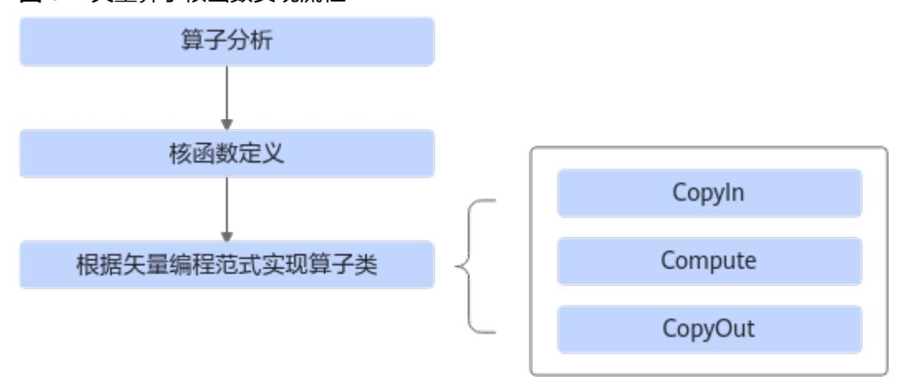

- 算子分析:分析算子的数学表达式、输入、输出以及计算逻辑的实现,明确需要 调用的Ascend C接口。
- 核函数定义:定义Ascend C算子入口函数。
- 根据[矢量编程范式实](#page-82-0)现算子类:完成核函数的内部实现,包括3个基本任务: CopyIn,Compute,CopyOut。

下文以输入为half数据类型且shape的最后一维为32Bytes对齐、在单核上运行的、一 次完成计算的Add算子为例,对上述步骤进行详细介绍。本样例中介绍的算子完整代 码请参见基础**Add**[算子样例。](https://gitee.com/ascend/samples/blob/master/operator/ascendc/0_introduction/21_vectoradd_kernellaunch/VectorAddSingleCore)

## 算子分析

算子分析具体步骤如下:

步骤**1** 明确算子的数学表达式及计算逻辑。

Add算子的数学表达式为:

z = x + y

计算逻辑是:Ascend C提供的[矢量计算接口的](#page-532-0)操作元素都为**[LocalTensor](#page-424-0)**,输入数据 需要先从外部存储(Global Memory)搬运进片上存储(Unified Buffer),然后使用 计算接口完成两个输入参数相加,得到最终结果,再搬出到外部存储上。Ascend C Add算子的计算逻辑如下图所示。

图 **6-2** 算子计算逻辑

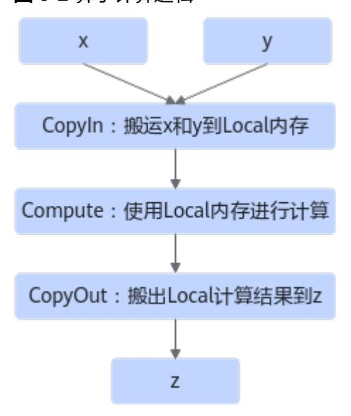

### 步骤**2** 明确输入和输出。

- Add算子有两个输入:x与y;输出为z。
- 本样例中算子的输入支持的数据类型为half(float16),算子输出的数据类型与 输入的数据类型相同。
- 算子输入支持的shape为(1,2048),输出shape与输入shape相同。
- 算子输入支持的**[format](#page-301-0)**为:ND。

### 步骤**3** 确定核函数名称和参数。

- 您可以自定义核函数名称,本样例中核函数命名为add\_custom。
- 根据对算子输入输出的分析,确定核函数有3个参数x,y,z;x,y为输入在 Global Memory上的内存地址,z为输出在Global Memory上的内存地址。

### 步骤**4** 确定算子实现所需接口。

- 实现涉及外部存储和内部存储间的数据搬运,查看Ascend C API参考中的数据搬 运接口,需要使用**[DataCopy](#page-868-0)**来实现数据搬运。
- 本样例只涉及矢量计算的加法操作,查看Ascend C API参考中的[矢量计算接](#page-501-0)口, 初步分析可使用双目指令Add接口**[Add](#page-532-0)**实现x+y。
- 使用**[Queue](#page-976-0)**队列管理计算中使用的Tensor数据结构,具体使用**[EnQue](#page-984-0)**、**[DeQue](#page-985-0)**等 接口。

### **----**结束

通过以上分析,得到Ascend C Add算子的设计规格如下:

表 **6-1** Ascend C Add 算子设计规格

| 算子类型<br>(OpType) | Add   |           |           |        |
|------------------|-------|-----------|-----------|--------|
| 算子输入输出           | name  | shape     | data type | format |
|                  | x(输入) | (1, 2048) | half      | ND     |

|              | y(输入)                      | (1, 2048)<br>half |      | ND |  |  |  |
|--------------|----------------------------|-------------------|------|----|--|--|--|
|              | z(输出)                      | (1, 2048)         | half | ND |  |  |  |
| 核函数名称        | add_custom                 |                   |      |    |  |  |  |
| 使用的主要接       | DataCopy:数据搬移接口            |                   |      |    |  |  |  |
| 口            | Add:矢量双目指令接口               |                   |      |    |  |  |  |
|              | EnQue、DeQue等接口:Queue队列管理接口 |                   |      |    |  |  |  |
| 算子实现文件<br>名称 | add_custom.cpp             |                   |      |    |  |  |  |

## 核函数定义

根据[核函数](#page-78-0)中介绍的规则进行核函数的定义。

### 步骤**1** 函数原型定义

本样例中,函数名为add\_custom(核函数名称可自定义),根据[算子分析中](#page-93-0)对算子输 入输出的分析,确定有3个参数x,y,z,其中x,y为输入内存,z为输出内存。根[据核](#page-78-0) [函数的](#page-78-0)规则介绍,函数原型定义如下所示:使用\_\_global\_\_函数类型限定符标识它是一 个核函数,可以被<<<>>>调用;使用\_\_aicore\_\_函数类型限定符标识该核函数在设备 端aicore上执行;为方便起见,统一使用GM\_ADDR宏修饰入参,GM\_ADDR宏定义请 参考[核函数](#page-79-0)。

```
extern "C" __global__ __aicore__ void add_custom(GM_ADDR x, GM_ADDR y, GM_ADDR z)
{
}
```

### 步骤**2** 调用算子类的Init和Process函数。

算子类的Init函数,完成内存初始化相关工作,Process函数完成算子实现的核心逻 辑,具体介绍参见[算子类实现](#page-96-0)。

```
extern "C" __global__ __aicore__ void add_custom(GM_ADDR x, GM_ADDR y, GM_ADDR z)
{
 KernelAdd op;
 op.Init(x, y, z);
 op.Process();
}
```

步骤**3** 对核函数的调用进行封装,得到add\_custom\_do函数,便于主程序调用。#ifndef ASCENDC\_CPU\_DEBUG表示该封装函数仅在编译运行NPU侧的算子时会用到,编译运 行CPU侧的算子时,可以直接调用add\_custom函数。根[据核函数定义和调用](#page-78-0)章节,调 用核函数时,除了需要传入参数x,y,z,还需要传入blockDim(核函数执行的核 数),l2ctrl(保留参数,设置为nullptr),stream(应用程序中维护异步操作执行顺 序的stream)来规定核函数的执行配置。

```
#ifndef ASCENDC_CPU_DEBUG
// call of kernel function
void add_custom_do(uint32_t blockDim, void* l2ctrl, void* stream, uint8_t* x, uint8_t* y, uint8_t* z)
 add_custom<<<blockDim, l2ctrl, stream>>>(x, y, z);
}
#endif
```

### **----**结束

## <span id="page-96-0"></span>算子类实现

根据上一节介绍,核函数中会调用算子类的Init和Process函数,本节具体讲解如何基 于编程范式实现算子类。

根据矢量编程范式对Add算子的实现流程进行设计的思路如下,矢量编程范式请参考 **Vector**[编程范式](#page-82-0),设计完成后得到的Add算子实现流程图参见图**3 Add**算子实现流程:

- Add算子的实现流程分为3个基本任务:CopyIn,Compute,CopyOut。CopyIn任 务负责将Global Memory上的输入Tensor xGm和yGm搬运至Local Memory,分 别存储在xLocal,yLocal,Compute任务负责对xLocal,yLocal执行加法操作,计 算结果存储在zLocal中,CopyOut任务负责将输出数据从zLocal搬运至Global Memory上的输出Tensor zGm中。
- CopyIn,Compute任务间通过VECIN队列inQueueX,inQueueY进行同步, Compute,CopyOut任务间通过VECOUT队列outQueueZ进行同步。
- 任务间交互使用到的内存、临时变量的内存统一使用**Pipe**[内存管理对象](#page-943-0)进行管 理。

### 图 **6-3** Add 算子实现流程

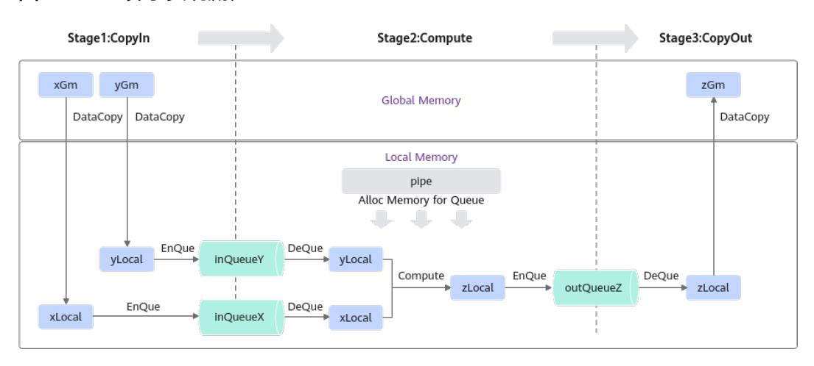

算子类中主要实现上述流程,包含对外开放的初始化Init函数和核心处理函数 Process,Process函数中会对上图中的三个基本任务进行调用;同时包括一些算子实现 中会用到的私有成员,比如上图中的GlobalTensor(xGm、yGm、zGm)和VECIN、 VECOUT队列等。KernelAdd算子类具体成员如下:

```
class KernelAdd {
public:
 __aicore__ inline KernelAdd() {}
 // 初始化函数,完成内存初始化相关操作
 __aicore__ inline void Init(GM_ADDR x, GM_ADDR y, GM_ADDR z){}
 // 核心处理函数,实现算子逻辑,调用私有成员函数CopyIn、Compute、CopyOut完成矢量算子的三级流水操
作
 __aicore__ inline void Process(){}
private:
 // 搬入函数,完成CopyIn阶段的处理,被核心Process函数调用
 __aicore__ inline void CopyIn(int32_t progress){}
 // 计算函数,完成Compute阶段的处理,被核心Process函数调用
 __aicore__ inline void Compute(int32_t progress){}
 // 搬出函数,完成CopyOut阶段的处理,被核心Process函数调用
 __aicore__ inline void CopyOut(int32_t progress){}
private:
```

```
 AscendC::TPipe pipe; // Pipe内存管理对象
 AscendC::TQue<AscendC::TPosition::VECIN, 1> inQueueX; // 输入数据Queue队列管理对象,TPosition为
VECIN
 AscendC::TQue<AscendC::TPosition::VECIN, 1> inQueueY; // 输入数据Queue队列管理对象,TPosition为
VECIN
 AscendC::TQue<AscendC::TPosition::VECOUT, 1> outQueueZ; // 输出数据Queue队列管理对象,TPosition为
VECOUT 
 AscendC::GlobalTensor<half> xGm; // 管理输入输出Global Memory内存地址的对象,其中xGm, yGm为输
入,zGm为输出
 AscendC::GlobalTensor<half> yGm;
 AscendC::GlobalTensor<half> zGm;
};
```

### 初始化函数主要完成以下内容:

● 设置输入输出Global Tensor的Global Memory内存地址。

本样例中的分配方案是:数据整体长度TOTAL\_LENGTH为1 \* 2048,使用 GlobalTensor类的**[SetGlobalBuffer](#page-447-0)**接口设定该核上Global Memory的起始地址以 及长度。

xGm.SetGlobalBuffer((\_\_gm\_\_ half \*)x, TOTAL\_LENGTH);

● 通过**Pipe**[内存管理对象为](#page-943-0)输入输出Queue分配内存。

比如,为输入x的Queue分配内存,可以通过如下代码段实现:

pipe.InitBuffer(inQueueX, 1, TOTAL\_LENGTH \* sizeof(half))

### 具体的初始化函数代码如下:

```
constexpr int32_t TOTAL_LENGTH = 1 * 2048; // 数据总长
__aicore__ inline void Init(GM_ADDR x, GM_ADDR y, GM_ADDR z)
{
 // 设置Global Memory的起始地址以及长度
 xGm.SetGlobalBuffer((__gm__ half *)x, TOTAL_LENGTH);
 yGm.SetGlobalBuffer((__gm__ half *)y, TOTAL_LENGTH);
 zGm.SetGlobalBuffer((__gm__ half *)z, TOTAL_LENGTH);
 // 通过Pipe内存管理对象为输入输出Queue分配内存
 pipe.InitBuffer(inQueueX, 1, TOTAL_LENGTH * sizeof(half));
 pipe.InitBuffer(inQueueY, 1, TOTAL_LENGTH * sizeof(half));
 pipe.InitBuffer(outQueueZ, 1, TOTAL_LENGTH * sizeof(half));
}
```

基于矢量编程范式,将核函数的实现分为3个基本任务:CopyIn,Compute, CopyOut。Process函数中通过如下方式调用这三个函数。

```
__aicore__ inline void Process()
{
 CopyIn();
 Compute();
 CopyOut();
}
```

根据编程范式上面的算法分析,将整个计算拆分成三个Stage,用户单独编写每个 Stage的代码,三阶段流程示意图参见图**[6-3](#page-96-0)**,具体流程如下:

### 步骤**1** Stage1:CopyIn函数实现。

- 1. 使用**[DataCopy](#page-868-0)**接口将GlobalTensor数据拷贝到LocalTensor。
- 2. 使用**[EnQue](#page-984-0)**将LocalTensor放入VECIN的Queue中。

```
__aicore__ inline void CopyIn(int32_t progress)
{
 // 从Que中为LocalTensor分配内存
 AscendC::LocalTensor<half> xLocal = inQueueX.AllocTensor<half>();
 AscendC::LocalTensor<half> yLocal = inQueueY.AllocTensor<half>();
 // 将GlobalTensor数据拷贝到LocalTensor
 AscendC::DataCopy(xLocal, xGm, TOTAL_LENGTH);
```

```
 AscendC::DataCopy(yLocal, yGm, TOTAL_LENGTH);
 // LocalTensor放入VECIN的Queue中
 inQueueX.EnQue(xLocal);
 inQueueY.EnQue(yLocal);
}
```

### 步骤**2** Stage2:Compute函数实现。

- 1. 使用**[DeQue](#page-985-0)**从VECIN中取出LocalTensor。
- 2. 使用Ascend C接口**[Add](#page-532-0)**完成矢量计算。
- 3. 使用**[EnQue](#page-984-0)**将计算结果LocalTensor放入到VECOUT的Queue中。
- 4. 使用**[FreeTensor](#page-982-0)**释放不再使用的LocalTensor。

```
__aicore__ inline void Compute(int32_t progress)
 // 将Input从VECIN的Queue中取出
 AscendC::LocalTensor<half> xLocal = inQueueX.DeQue<half>();
 AscendC::LocalTensor<half> yLocal = inQueueY.DeQue<half>();
 AscendC::LocalTensor<half> zLocal = outQueueZ.AllocTensor<half>();
 // 调用Add算子进行计算
 AscendC::Add(zLocal, xLocal, yLocal, TOTAL_LENGTH);
 // 将计算结果LocalTensor放入到VECOUT的Queue中
 outQueueZ.EnQue<half>(zLocal);
 // 释放LocalTensor
 inQueueX.FreeTensor(xLocal);
 inQueueY.FreeTensor(yLocal);
}
```

### 步骤**3** Stage3:CopyOut函数实现。

- 1. 使用**[DeQue](#page-985-0)**接口从VECOUT的Queue中取出LocalTensor。
- 2. 使用**[DataCopy](#page-868-0)**接口将LocalTensor拷贝到GlobalTensor上。
- 3. 使用**[FreeTensor](#page-982-0)**将不再使用的LocalTensor进行回收。

```
 __aicore__ inline void CopyOut(int32_t progress)
 // 将计算结果从到VECOUT的Queue中取出
 AscendC::LocalTensor<half> zLocal = outQueueZ.DeQue<half>();
 // 将计算结果从LocalTensor数据拷贝到GlobalTensor
 AscendC::DataCopy(zGm, zLocal, TOTAL_LENGTH);
 // 释放LocalTensor
 outQueueZ.FreeTensor(zLocal);
}
```

### **----**结束

## 运行验证

核函数即算子Kernel程序开发完成后,即可编写Host侧的核函数调用程序,实现从 Host侧的APP程序调用算子,进行运行验证。包括CPU侧和NPU侧两种运行验证方 法:

- **CPU**侧运行验证主要通过ICPU\_RUN\_KF CPU调测宏等CPU调测库提供的接口来完 成;
- **NPU**侧运行验证主要通过使用Kernel Launch接口或者<<<>>>内核调用符,以及 AscendCL API提供的运行时接口来完成。

具体步骤请参考**[Kernel](#page-198-0)**直调。

## **6.2.3 TBuf** 的使用

在大多数算子开发时,核函数计算过程需要使用临时内存来存储运算的中间结果,这 些中间结果以临时变量表示,临时变量占用的内存可以使用TBuf数据结构来管理,具 体介绍请参考**[TBuf](#page-1009-0)**。下文将以输入的数据类型为bfloat16\_t、在单核上运行的Add算子 为例,介绍TBuf的使用方式。本样例中介绍的算子完整代码请参[见使用临时内存的](https://gitee.com/ascend/samples/tree/master/operator/ascendc/0_introduction/21_vectoradd_kernellaunch/VectorAddSingleCoreWithTmpbuf) **Add**[算子样例。](https://gitee.com/ascend/samples/tree/master/operator/ascendc/0_introduction/21_vectoradd_kernellaunch/VectorAddSingleCoreWithTmpbuf)

在Atlas A2 训练系列产品/Atlas 800I A2 推理产品上,**[Add](#page-532-0)**接口不支持对数据类型 bfloat16\_t的源操作数进行求和计算。因此,需要先将算子输入的数据类型转换成Add 接口支持的数据类型,再进行计算。为保证计算精度,调用**[Cast](#page-687-0)**接口将输入bfloat16\_t 类型转换为float类型,再进行Add计算,并在计算结束后将float类型转换回bfloat16\_t 类型。

通过以上分析,得到Ascend C Add算子的设计规格如下:

表 **6-2** Ascend C Add 算子设计规格

| 算子类型<br>(OpType) | Add                                    |                            |            |        |  |  |  |  |  |  |  |
|------------------|----------------------------------------|----------------------------|------------|--------|--|--|--|--|--|--|--|
| 算子输入输出           | name                                   | shape                      | data type  | format |  |  |  |  |  |  |  |
|                  | x(输入)                                  | (1, 2048)                  | bfloat16_t | ND     |  |  |  |  |  |  |  |
|                  | y(输入)<br>(1, 2048)<br>bfloat16_t<br>ND |                            |            |        |  |  |  |  |  |  |  |
|                  | z(输出)                                  | (1, 2048)                  | bfloat16_t | ND     |  |  |  |  |  |  |  |
| 核函数名称            | add_custom                             |                            |            |        |  |  |  |  |  |  |  |
| 使用的主要接           | DataCopy:数据搬移接口                        |                            |            |        |  |  |  |  |  |  |  |
| 口                | Cast:矢量精度转换接口                          |                            |            |        |  |  |  |  |  |  |  |
|                  | Add:矢量双目指令接口                           |                            |            |        |  |  |  |  |  |  |  |
|                  |                                        | EnQue、DeQue等接口:Queue队列管理接口 |            |        |  |  |  |  |  |  |  |
| 算子实现文件<br>名称     | add_custom.cpp                         |                            |            |        |  |  |  |  |  |  |  |

## 算子类实现

该样例的CopyIn,CopyOut任务[与基础矢量算子](#page-92-0)相同,Compute任务的具体流程如下 图所示。

图 **6-4** 输入为 bfloat16\_t 类型的 Add 计算流程

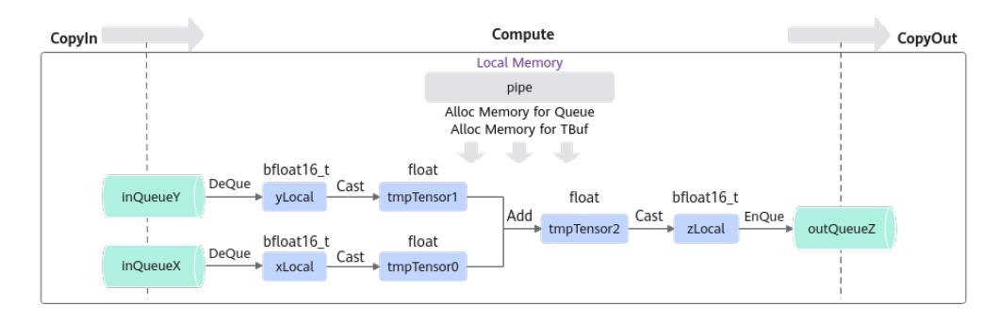

在Compute任务中,表示Cast转换结果、Add计算结果的临时变量均需要使用临时内 存存储。[与基础矢量算子实现](#page-96-0)的KernelAdd算子类相比,本样例新增三个**[TBuf](#page-1009-0)**类型的 成员变量tmpBuf0、tmpBuf1、tmpBuf2,用于管理计算过程中使用的临时内存,代 码如下。

```
class KernelAdd {
public:
 __aicore__ inline KernelAdd() {}
 __aicore__ inline void Init(GM_ADDR x, GM_ADDR y, GM_ADDR z){}
 __aicore__ inline void Process(){}
private:
 __aicore__ inline void CopyIn(int32_t progress){}
 __aicore__ inline void Compute(int32_t progress){}
 __aicore__ inline void CopyOut(int32_t progress){}
private:
 AscendC::TPipe pipe;
 AscendC::TQue<AscendC::TPosition::VECIN, BUFFER_NUM> inQueueX, inQueueY;
 AscendC::TQue<AscendC::TPosition::VECOUT, BUFFER_NUM> outQueueZ;
 AscendC::TBuf<AscendC::TPosition::VECCALC> tmpBuf0, tmpBuf1, tmpBuf2; 
 AscendC::GlobalTensor<bfloat16_t> xGm; 
 AscendC::GlobalTensor<bfloat16_t> yGm;
 AscendC::GlobalTensor<bfloat16_t> zGm;
};
```

初始化函数阶段除原有步骤外,需要调用**[InitBuffer](#page-947-0)**接口为TBuf变量分配内存,具体的 初始化函数代码如下:

```
 __aicore__ inline void Init(GM_ADDR x, GM_ADDR y, GM_ADDR z)
{
 xGm.SetGlobalBuffer((__gm__ half *)x, TOTAL_LENGTH);
 yGm.SetGlobalBuffer((__gm__ half *)y, TOTAL_LENGTH);
 zGm.SetGlobalBuffer((__gm__ half *)z, TOTAL_LENGTH);
 pipe.InitBuffer(inQueueX, 1, TOTAL_LENGTH * sizeof(bfloat16_t));
 pipe.InitBuffer(inQueueY, 1, TOTAL_LENGTH * sizeof(bfloat16_t));
 pipe.InitBuffer(outQueueZ, 1, TOTAL_LENGTH * sizeof(bfloat16_t));
 pipe.InitBuffer(tmpBuf0, TOTAL_LENGTH * sizeof(float));
 pipe.InitBuffer(tmpBuf1, TOTAL_LENGTH * sizeof(float));
 pipe.InitBuffer(tmpBuf2, TOTAL_LENGTH * sizeof(float));
}
```

基于矢量编程范式,核函数需要实现3个基本任务:CopyIn,Compute,CopyOut。 [与基础矢量算子实现](#page-96-0)相同,Process函数按顺序调用CopyIn函数,Compute函数, CopyOut函数。其中,CopyIn函数,CopyOut函数[与基础矢量算子的](#page-97-0)**CopyIn**函数、[基](#page-98-0) [础矢量算子的](#page-98-0)**CopyOut**函数的实现没有差异,此处不过多赘述。Compute函数的实现 步骤如下:

- 1. 使用**[DeQue](#page-985-0)**从VECIN的Queue中取出LocalTensor。
- 2. 使用TBuf.**[Get](#page-1010-0)**从TBuf上获取全部长度的Tensor作为临时内存。
- 3. 使用**[Cast](#page-687-0)**接口将LocalTensor转换为float类型,并存入临时内存。
- 4. 使用**[Add](#page-532-0)**接口完成矢量计算,将计算结果存入临时内存。
- 5. 使用**[Cast](#page-687-0)**接口将临时内存中的计算结果转换为bfloat16\_t类型。
- 6. 使用**[EnQue](#page-984-0)**将bfloat16\_t类型的结果LocalTensor放入VECOUT的Queue中。
- 7. 使用**[FreeTensor](#page-982-0)**释放不再使用的LocalTensor。

```
__aicore__ inline void Compute(int32_t progress)
{
 AscendC::LocalTensor<bfloat16_t> xLocal = inQueueX.DeQue<bfloat16_t> ();
 AscendC::LocalTensor<bfloat16_t> yLocal = inQueueY.DeQue<bfloat16_t> ();
 AscendC::LocalTensor<bfloat16_t> zLocal = outQueueZ.AllocTensor<bfloat16_t> ();
 AscendC::LocalTensor<float> tmpTensor0 = tmpBuf0.Get<float>();
 AscendC::LocalTensor<float> tmpTensor1 = tmpBuf1.Get<float>();
```

```
 AscendC::LocalTensor<float> tmpTensor2 = tmpBuf2.Get<float>();
 AscendC::Cast(tmpTensor0, xLocal, AscendC::RoundMode::CAST_NONE, TOTAL_LENGTH);
 AscendC::Cast(tmpTensor1, yLocal, AscendC::RoundMode::CAST_NONE, TOTAL_LENGTH);
 AscendC::Add(tmpTensor2, tmpTensor0, tmpTensor1, TOTAL_LENGTH);
 AscendC::Cast(zLocal, tmpTensor2, AscendC::RoundMode::CAST_RINT, TOTAL_LENGTH);
 outQueueZ.EnQue<bfloat16_t>(zLocal);
 inQueueX.FreeTensor(xLocal);
 inQueueY.FreeTensor(yLocal);
}
```

## **6.2.4** 多核**&Tiling** 切分

## **6.2.4.1** 概述

Ascend C核函数是运行在一个核上的处理函数,上述介绍[的基础矢量算子](#page-92-0)与**[TBuf](#page-98-0)**的使 [用](#page-98-0)样例均为在单核上运行的算子,不涉及Host侧Tiling实现。矢量算子实现的组成如下 图所示。

为了提高算子的执行效率,通常在算子中实现多核并行计算,即对输入数据进行切 分,并将不同的数据块分配到不同的核上处理。关于并行计算的具体介绍请参考 **[SPMD](#page-76-0)**模型。此外,由于单个核上内部存储Local Memory大小有限,存在无法一次完 整地容纳算子的输入和输出数据的场景,因此需要每次搬运一部分输入进行计算然后 搬出,再搬运下一部分输入进行计算,直到获得最终的完整结果,这个数据切分、分 块计算的过程称之为**Tiling**。切分数据的算法称为Tiling算法或者Tiling策略。根据算子 的shape等信息来确定数据切分算法相关参数(比如每次搬运的块大小,以及总共循环 多少次)的计算程序,称之为**Tiling**实现,也叫Tiling函数(Tiling Function)。由于 Tiling实现中完成的均为标量计算,AI Core并不擅长,所以我们将其独立出来放在 Host侧CPU上执行。核函数内部通过解析Host侧传入的Tiling结构体获取Tiling信息, 根据Tiling信息控制数据搬入、搬出Local Memory的流程;通过调用计算、数据搬 运、内存管理、任务同步API,实现算子逻辑。

### 图 **6-5** 算子实现组成

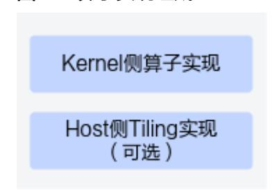

由于硬件限制,在对输入数据进行数据切分时应遵循以下几个原则:

- 1. 由于AI Core中Unified Buffer上的物理限制,要求Unified Buffer上的数据存储空 间必须保持32字节对齐。
  - 输入数据不满足32字节对齐时,需要取输入数据长度向上对齐到32字节的长 度作为输入数据总长度。
  - 进行Tiling有关计算时,以32字节为最小单位进行计算。
- 2. 尽可能最大利用Unified Buffer空间。

AI Core与外部存储交互时会产生性能开销,频繁的进行数据搬运会导致性能瓶 颈,因此应尽可能充分利用Unified Buffer空间,减少从Global Memory上搬运数 据的次数。

<span id="page-102-0"></span>3. 昇腾AI处理器包含多个AI Core,应该充分均衡利用多核计算能力,将计算均衡分 配到多个AI Core上。

本章将基于以上原则对几种典型场景进行说明,完整代码请参见多核**Add**[算子样例。](https://gitee.com/ascend/samples/tree/master/operator/ascendc/0_introduction/21_vectoradd_kernellaunch/VectorAddMultiCoreWithTiling)

### 图 **6-6** 多核及 Tiling 示意图

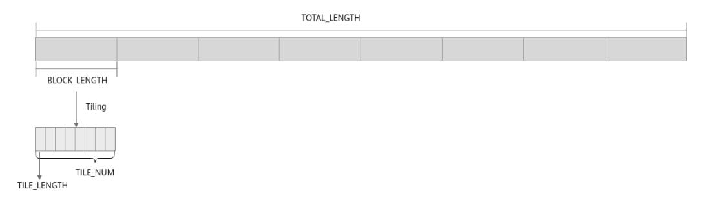

数据切分示意如上图所示,将长度为TOTAL\_LENGTH的算子输入分配到多个核上进行 计算,每个核上计算的数据长度为BLOCK\_LENGTH。对于每个核的计算数据,基于 Local Memory的大小进一步切分,切分数据块的个数为TILE\_NUM,得到的每个数据 块的长度为TILE\_LENGTH。

根据每个核计算的数据量是否相同、核内每个数据块的数据量是否相同,切分策略可 能会存在以下几种场景:

- 1. 核间均分,核内均分:每个核处理的数据量相同,核内每个数据块的数据量相 同。在此场景中,通过多核**Tiling**将数据均匀分配到各个核上执行,每个核上每次 计算的数据长度相同。
- 2. 核间均分,核内不均分:每个核处理的数据量相同,核内各数据块的数据量不完 全相同。此场景基于多核Tiling,核内数据不能切分为多个数据量相同且32字节对 齐的数据块,需要通过尾块**[Tiling](#page-108-0)**处理尾块数据的计算。
- 3. 核间不均分,核内均分:每个核处理的数据量不同,核内每个数据块的数据量相 同。在此场景中,通过尾核**[Tiling](#page-111-0)**的处理解决数据无法在各核间均匀分配的问题。
- 4. 核间不均分,核内不均分:每个核处理的数据量不同,核内各数据块的数据量不 完全相同。该场景下需要同时考[虑尾核](#page-114-0)**&**尾块,处理多核间及核内数据的合理切 分。

## **6.2.4.2** 多核 **Tiling**

基于Ascend C方式实现带有Tiling的算子的开发流程如下图所示。

图 **6-7** 算子开发流程

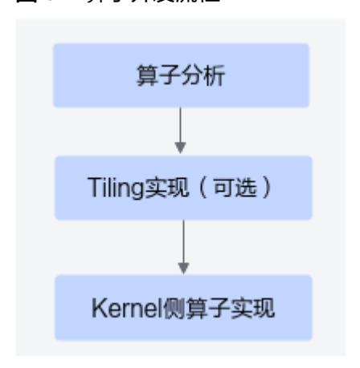

## 算子分析

本样例为输入数据在核间均分、核内均分场景。本样例的Tiling策略为:数据整体长度 TOTAL\_LENGTH为8 \* 2048,数据平均分配到8个核上运行,每个核上计算的数据长度 BLOCK\_LENGTH为2048,将单核上的数据切分成16块(此处切分成16块仅用来作为 Tiling的样例,并不代表性能最佳,仅供参考),每块数据的长度TILE\_LENGTH为 128。数据切分示意如下图所示:

### 图 **6-8** 数据切分示意图

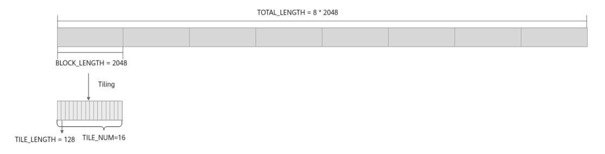

表 **6-3** Ascend C Add 算子设计规格

| 算子类型<br>(OpType) | Add                        |           |      |        |  |  |  |  |  |  |
|------------------|----------------------------|-----------|------|--------|--|--|--|--|--|--|
| 算子输入输出           | name<br>shape<br>data type |           |      | format |  |  |  |  |  |  |
|                  | x(输入)                      | (8, 2048) | half | ND     |  |  |  |  |  |  |
|                  | y(输入)                      | (8, 2048) | half | ND     |  |  |  |  |  |  |
|                  | z(输出)                      | (8, 2048) | half | ND     |  |  |  |  |  |  |
| 核函数名称            | add_custom                 |           |      |        |  |  |  |  |  |  |
| 使用的主要接           | DataCopy:数据搬移接口            |           |      |        |  |  |  |  |  |  |
| 口                | Add:矢量双目指令接口               |           |      |        |  |  |  |  |  |  |
|                  | EnQue、DeQue等接口:Queue队列管理接口 |           |      |        |  |  |  |  |  |  |

算子实现文件 名称

add\_custom.cpp

## **Tiling** 实现

前述场景中算子的输入和输出均为固定shape,然而在实际的算子开发场景中,这些信 息是支持动态变化的,场景会更加灵活和复杂。动态shape场景下,输入的shape是未 知的。一些与输入shape相关的变量(比如每次搬运的块大小等),需要通过Tiling计 算出来,然后传递到kernel侧,kernel侧使用该参数进行后续的计算。

具体实现方式为:分析设计Tiling参数、定义Tiling结构体,在HOST侧通过上下文获取 输入输出的shape信息,根据shape信息,计算Tiling参数并设置到对应的Tiling结构体 中;通过核函数入口参数将Tiling信息传入核函数,在核函数内通过解析Tiling结构 体,获取并使用相关参数来实现核函数内部逻辑,详细介绍请参考**Host**侧**[tiling](#page-224-0)**实现。 本节将以上述分析中的切分策略为例,说明如何实现Tiling。

基于本节的切分策略,Tiling需要定义如下参数:

- blockLength:每个核的计算数据长度;
- tileNum:每个核需要计算的数据块个数;
- tileLength:每个核内每个数据块的长度。

根据确定的Tiling参数,在算子TilingData结构定义头文件中,使用C++语法定义 TilingData结构体,代码如下。该头文件命名为"算子名称\_tiling.h"。本章节中的算 子名称为add\_custom,对应头文件命名应为add\_custom\_tiling.h。

```
struct AddCustomTilingData {
 uint32_t blockLength;
 uint32_t tileNum;
 uint32_t tileLength;
}
```

接下来,创建一个与Tiling结构体头文件对应的cpp文件add\_custom\_tiling.cpp,并在 该文件内完成Tiling参数的计算。由于每个核内数据被切分为16块,根据使用的核数和 核内切分数,计算Tiling参数,并写入到Tiling结构体内。代码示例如下:

```
#include "add_custom_tiling.h"
constexpr int32_t CORE_NUM = 8; // 使用的核数
constexpr int32_t TILE_NUM = 16; // 核内切分数量
void GenerateTilingData(uint8_t* tilingBuf)
{
 uint32_t totalLength;
 // 此处省略如何获取数据总长TOTAL_LENGTH,可以根据具体情况实现。本章节仅介绍Tiling相关内容。
 AddCustomTilingData *tiling = reinterpret_cast<AddCustomTilingData *>(tilingBuf);
 uint32_t blockLength = TOTAL_LENGTH / CORE_NUM;
 uint32_t tileNum = TILE_NUM;
 uint32_t tileLength = blockLength / tileNum;
 tiling->blockLength = blockLength;
 tiling->tileNum = tileNum;
 tiling->tileLength = tileLength;
}
```

最后,在Host侧调用程序中,调用上述Tiling参数计算函数,计算出相关参数,然后传 递到Kernel侧核函数。

```
extern void GenerateTilingData(uint8_t* tilingBuf);
constexpr int32_t CORE_NUM = 8;
 ...
 uint8_t *tiling = nullptr;
```

```
 size_t tilingSize = sizeof(AddCustomTilingData);
#ifdef ASCENDC_CPU_DEBUG
 tiling = (uint8_t *)AscendC::GmAlloc(tilingSize); // CPU Debug模式
 ...
#else
 ...
 CHECK_ACL(aclrtMallocHost((void **)(&tiling), tilingSize)); // NPU模式
 ...
#endif
 GenerateTilingData(tiling); // 调用tiling参数计算函数
 ....
#ifdef ASCENDC_CPU_DEBUG
 ...
 ICPU_RUN_KF(add_custom, CORE_NUM, x, y, z,
 *reinterpret_cast<AddCustomTilingData *>(tiling)); // CPU Debug模式下核函数调用
 ....
#else
 ....
 ACLRT_LAUNCH_KERNEL(add_custom)(CORE_NUM, stream, xDevice, yDevice, zDevice, // NPU模式下核函
数调用
 reinterpret_cast<AddCustomTilingData *>(tiling));
 ....
```

## 算子类实现

Kernel侧算子实现仍遵[循矢量算子核函数实现流程,](#page-93-0)接下来重点介绍本场景中算子类 实现的不同点。

● 设置输入输出Global Tensor的Global Memory内存地址。

由于本样例中将数据分配到了多个核上进行处理,每个核处理不同的数据,因此 不同核要处理的数据在Global Memory上的地址不同,在初始化函数Init中,需要 获取单核所需处理的输入输出在Global Memory上的内存偏移地址,并将该偏移 地址设置到GlobalTensor中。

以获取输入x在Global Memory上的内存偏移地址为例,数据整体长度 TOTAL\_LENGTH为8 \* 2048,平均分配到8个核上运行,每个核上处理的数据长度 blockLength为2048,调用**[GetBlockIdx](#page-1065-0)**接口获取当前核的index,x + blockLength \* GetBlockIdx()即为单核处理程序中x在Global Memory上的内存偏 移地址,获取偏移地址后,使用GlobalTensor类的**[SetGlobalBuffer](#page-447-0)**接口设定该核 上Global Memory的起始地址以及长度,具体示意图请参考图**[6-9](#page-106-0)**。代码如下所 示:

xGm.SetGlobalBuffer((\_\_gm\_\_ half \*)x + this->blockLength \* AscendC::GetBlockIdx(), this- >blockLength);

### <span id="page-106-0"></span>图 **6-9** 多核并行处理示意图

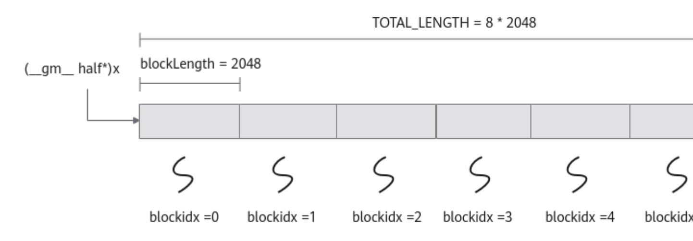

● 通过Pipe内存管理对象为输入输出Queue分配内存。

对于单核上的处理数据,可以进行数据切块(Tiling),在本示例中,仅作为参 考,将单核上的数据(2048个数)切分成16块(并不意味着16块就是性能最 优),每块tileLength(128)个数据。数据切分示意图如图**6-10**所示。

### 图 **6-10** 单核数据切分示意图

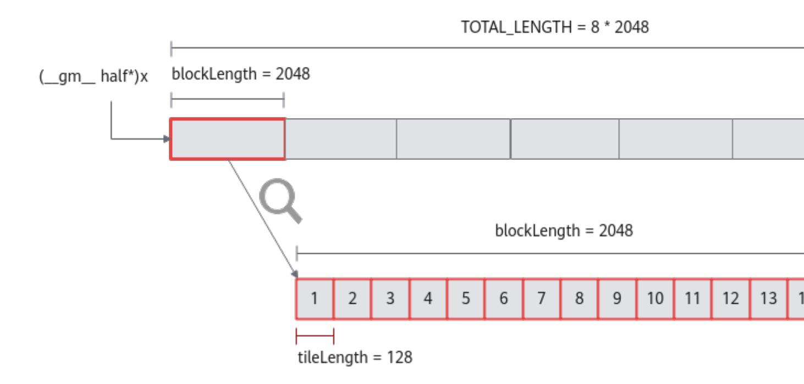

[与基础矢量算子](#page-92-0)相比,在通过Pipe内存管理对象为输入输出Queue分配内存时, 需使用单核内每个数据块的长度tileLength作为分配内存的长度。比如,为输入x 的Queue分配内存,可以通过如下代码段实现,Pipe为inQueueX分配了一块大小 为tileLength \* sizeof(half)个字节的内存块,每个内存块能容纳tileLength (128)个half类型数据。

pipe.InitBuffer(inQueueX, 1, this->tileLength \* sizeof(half))

具体的初始化函数代码如下:

```
__aicore__ inline void Init(GM_ADDR x, GM_ADDR y, GM_ADDR z, AddCustomTilingData tiling)
 this->blockLength = tiling.blockLength;
 this->tileNum = tiling.tileNum;
 this->tileLength = tiling.tileLength;
 // 计算每个核上的地址偏移
 xGm.SetGlobalBuffer((__gm__ half *)x + this->blockLength * AscendC::GetBlockIdx(), this->blockLength);
 yGm.SetGlobalBuffer((__gm__ half *)y + this->blockLength * AscendC::GetBlockIdx(), this->blockLength);
 zGm.SetGlobalBuffer((__gm__ half *)z + this->blockLength * AscendC::GetBlockIdx(), this->blockLength);
 // pipe alloc memory to queue, the unit is Bytes
 pipe.InitBuffer(inQueueX, 1, this->tileLength * sizeof(half));
 pipe.InitBuffer(inQueueY, 1, this->tileLength * sizeof(half));
 pipe.InitBuffer(outQueueZ, 1, this->tileLength * sizeof(half));
}
```

每个核需要对tileNum个数据块分别进行搬入、计算、搬出处理,因此Process函数内 将tileNum作为循环上限。

```
__aicore__ inline void Process()
{
 int32_t loopCount = this->tileNum;
 // tiling strategy, pipeline parallel
 for (int32_t i = 0; i < loopCount; i++) {
 CopyIn(i);
 Compute(i);
 CopyOut(i);
 }
}
```

对应的,每个核内搬入、搬出每个数据块时,需定位到每个数据块所在Global Memory上的内存偏移地址,因此在CopyIn和CopyOut函数内部使用**[DataCopy](#page-868-0)**接口 时,需增加每个数据块的地址偏移。Compute函数没有变化,[与基础矢量算子](#page-92-0)相同。

```
CopyIn函数实现代码如下:
```

```
__aicore__ inline void CopyIn(int32_t progress)
 ...
 // copy progress_th tile from global tensor to local tensor
 AscendC::DataCopy(xLocal, xGm[progress * this->tileLength], this->tileLength);
 AscendC::DataCopy(yLocal, yGm[progress * this->tileLength], this->tileLength);
 ...
}
```

### CopyOut函数实现代码如下:

```
 __aicore__ inline void CopyOut(int32_t progress)
{
 ...
 // copy progress_th tile from local tensor to global tensor
 AscendC::DataCopy(zGm[progress * this->tileLength], zLocal, this->tileLength);
 ...
}
```

## 运行验证

Host侧的核函数调用程序,实现从Host侧的APP程序调用算子,进行运行验证。在程 序中调用开启多核运行的核函数时,需要指定使用的核数,代码如下所示。

● CPU侧运行验证:

```
constexpr uint32_t BLOCK_DIM = 8;
.... 
// 调用ICPU_RUN_KF调测宏,完成核函数CPU侧的调用
ICPU_RUN_KF(add_custom, BLOCK_DIM, x, y, z, *reinterpret_cast<AddCustomTilingData *>(tiling));
// 输出数据写出
...
```

● NPU侧运行验证

```
constexpr uint32_t BLOCK_DIM = 8;
....
```

// 用ACLRT\_LAUNCH\_KERNEL接口调用核函数完成指定的运算 ACLRT\_LAUNCH\_KERNEL(add\_custom)(BLOCK\_DIM, stream, xDevice, yDevice, zDevice, \*reinterpret\_cast<AddCustomTilingData \*>(tiling)); // 用内核调用符<<<>>>调用核函数完成指定的运算,add\_custom\_do中封装了<<<>>>调用 ...

## <span id="page-108-0"></span>**6.2.4.3** 尾块 **Tiling**

如下图中的示例,算子的输入shape为(1,2048),支持的数据类型为half类型,输 入数据可以对齐到一个datablock的大小(32字节),输入数据为2048 \* 2 / 32 = 128 个datablock,因此可以平均分配到每个核上(假设使用8个核),每个核上处理256个 数,16个datablock。此时不需要进行尾块处理。

### 图 **6-11** shape 对齐场景

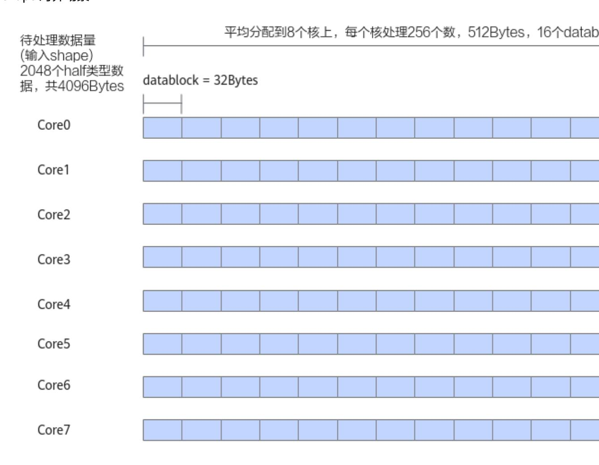

针对一些shape,比如算子的输入shape为(1,1904),支持的数据类型为half类 型,输入数据可以对齐到一个datablock的大小(32字节),可以平均分配到每个核上 (假设使用8个核),每个核上处理238个数,238个数无法均分到datablock上,分满 14个datablock后,剩余14个数(28字节),多核切分后需要进行尾块处理。

对于不同shape的输入进行数据切分时,可能会发生Tiling后的数据平均分配到多核 上,但每个核内的数据无法均分的情况。针对此种场景,在Tiling参数中增加变量 lastTileLength,用来表示最后一个分块,即尾块的大小。因此,在定义算子的Tiling 结构体时包含以下四个成员:

- blockLength:每个核上计算的数据长度;
- tileNum:每个核上切分的数据块的个数;
- tileLength:每个核上除尾块外,每个数据块的长度;
- lastTileLength:每个核上尾块的长度。其中,当lastTileLength等于tileLength 时,为核间均分同时核内均分场景,因此这两种场景可以做代码归一化处理。

### 图 **6-12** 多核 Tiling 尾块示意图

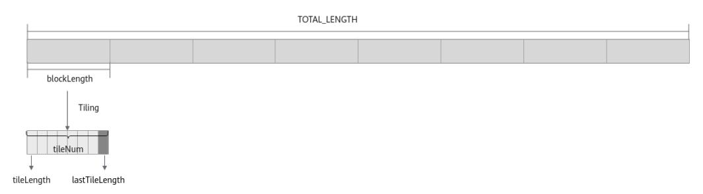

## **Tiling** 实现

### 算子的Tiling结构体定义如下:

```
struct AddCustomTilingData {
 uint32_t blockLength;
 uint32_t tileNum;
 uint32_t tileLength;
 uint32_t lastTileLength;
};
```

Host侧Tiling实现的主要内容为计算以上四个成员变量。步骤如下:

步骤**1** 判断数据总长度totalLength是否满足32字节对齐,如不满足,则计算totalLength向上 32字节对齐后的长度totalLengthAligned。

```
constexpr uint32_t BLOCK_SIZE = 32;
// 为方便计算,这里根据数据类型定义变量alignNum作为对齐数
uint32_t alignNum = BLOCK_SIZE / dataTypeSize;
// totalLength为数据总量
uint32_t totalLengthAligned = (totalLength % alignNum == 0)?
 totalLength : ((totalLength + alignNum - 1) / alignNum) * alignNum;
```

步骤**2** 判断totalLengthAligned是否能被使用的核数BlockDim均分,如果可以,则计算每个 核上计算数据长度blockLength。

```
constexpr uint32_t BLOCK_DIM = 8;
constexpr uint32_t UB_BLOCK_NUM = 20; // 此处为方便验证,使用UB_BLOCK_NUM作为Unified Buffer可用
的Block数量,因此可得出可用UB空间的大小为UB_BLOCK_NUM * BLOCK_SIZE
uint32_t blockLength, tileNum;
if (totalLengthAligned % BLOCK_DIM == 0) {
 blockLength = totalLengthAligned / BLOCK_DIM;
}
```

步骤**3** 计算tileNum。为了减少数据搬运开销,应尽量使用核内的Unified Buffer空间。基于 每个核上的计算量以及可用Unified Buffer空间的大小,计算tileNum。

tileNum = blockLength / alignNum / UB\_BLOCK\_NUM;

步骤**4** 根据计算出的tileNum,计算tileLength和lastTileLength。

如果每个核的计算量能够被当前可用Unified Buffer空间均分,或者计算量小于可用 Unified Buffer空间,则按照无尾块场景处理。

// (blockLength / alignNum) % UB\_BLOCK\_NUM为0,表示每个核的计算量能够被当前可用Unified Buffer空间 均分

```
// tileNum为0,表示计算量小于可用Unified Buffer空间
if ((blockLength / alignNum) % UB_BLOCK_NUM == 0 || tileNum == 0) {
 if (tileNum == 0) {
 tileNum = 1;
 }
 if (blockLength < UB_BLOCK_NUM * alignNum) {
 tileLength = ((blockLength + alignNum - 1) / alignNum) * alignNum;
 lastTileLength = tileLength;
 } else {
 tileLength = UB_BLOCK_NUM * alignNum;
 lastTileLength = tileLength;
 }
}
```

反之,按照尾块场景处理,在tileNum上加1作为每个核的数据块个数,尾块长度为单 核计算数据长度 - (tileNum - 1) \* tileLength。

```
else {
 tileNum = tileNum + 1;
 tileLength = UB_BLOCK_NUM * alignNum;
 lastTileLength = blockLength - (tileNum - 1) * tileLength;
}
```

### **----**结束

Host侧Tiling实现的代码如下:

```
constexpr uint32_t BLOCK_SIZE = 32;
constexpr uint32_t BLOCK_DIM = 8;
constexpr uint32_t UB_BLOCK_NUM = 20; // 此处为方便验证,使用UB_BLOCK_NUM作为UB可用的Block数
量,因此可得出可用UB空间的大小为UB_BLOCK_NUM * BLOCK_SIZE
...
uint32_t alignNum = BLOCK_SIZE / dataTypeSize; // 为方便计算,这里根据数据类型定义变量alignNum作为对
齐数,dataTypeSize为运算数据的数据类型对应的字节数
// totalLength为数据总量
uint32_t totalLengthAligned = (totalLength % alignNum == 0)?
 totalLength : ((totalLength + alignNum - 1) / alignNum) * alignNum;
uint32_t blockLength, tileNum;
if ((totalLengthAligned / alignNum) % BLOCK_DIM == 0) {
 blockLength = totalLengthAligned / BLOCK_DIM;
 tileNum = blockLength / alignNum / UB_BLOCK_NUM;
 if ((blockLength / alignNum) % UB_BLOCK_NUM == 0 || tileNum == 0) {
 if (tileNum == 0) {
 tileNum = 1;
 }
 if (blockLength < UB_BLOCK_NUM * alignNum) {
 tileLength = ((blockLength / alignNum) + 1) * alignNum;
 lastTileLength = tileLength;
 } else {
 tileLength = UB_BLOCK_NUM * alignNum;
 lastTileLength = tileLength;
 }
 } else {
 tileNum = tileNum + 1;
 tileLength = UB_BLOCK_NUM * alignNum;
 lastTileLength = blockLength - (tileNum - 1) * tileLength;
 }
 ...
}
```

## 算子类实现

由于尾块长度为lastTileLength,与其它数据块的长度不同,因此CopyIn函数、 CopyOut函数需要对尾块单独处理。

CopyIn函数实现代码如下:

```
__aicore__ inline void CopyIn(int32_t progress)
 AscendC::LocalTensor<dataType> xLocal = inQueueX.AllocTensor<dataType>();
 AscendC::LocalTensor<dataType> yLocal = inQueueY.AllocTensor<dataType>();
 if (progress == (this->tileNum - 1)) {
 AscendC::DataCopy(xLocal, xGm[progress * this->tileLength],
 this->lastTileLength);
 AscendC::DataCopy(yLocal, yGm[progress * this->tileLength],
 this->lastTileLength);
 } else {
 AscendC::DataCopy(xLocal, xGm[progress * this->tileLength], this->tileLength);
 AscendC::DataCopy(yLocal, yGm[progress * this->tileLength], this->tileLength);
 }
 inQueueX.EnQue(xLocal);
 inQueueY.EnQue(yLocal);
}
CopyOut函数实现代码如下:
__aicore__ inline void CopyOut(int32_t progress)
```

```
 AscendC::LocalTensor<dataType> zLocal = outQueueZ.DeQue<dataType>();
 if (progress == (this->tileNum - 1)) {
 AscendC::DataCopy(zGm[progress * this->tileLength],
 this->lastTileLength);
 } else {
 AscendC::DataCopy(zGm[progress * this->tileLength], zLocal, this->tileLength);
 }
 outQueueZ.FreeTensor(zLocal);
}
```

## **6.2.4.4** 尾核 **Tiling**

对于不同shape的输入进行数据切分时,可能会发生数据无法平均分配到多个核的情 况。例如当算子的输入shape为[1, 1999],使用核数为8,数据类型为half时,需要计 算的数据总量为1 \* 1999 \* sizeof(half) = 3998字节,3998字节既不满足32字节对 齐,也无法平均分配到8个核上。因此该场景下,对数据进行多核切分后,每个核的计 算数据量不同。此种情况下,应该尽可能均匀的分配数据,所有核上的计算数据量有 两种情况,将计算量较多的核称为整核,计算量较少的核称为尾核。

### 图 **6-13** 数据对齐示意图

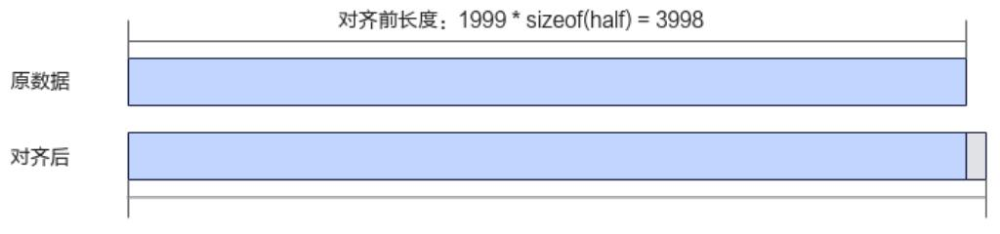

## **Tiling** 实现

● 因为昇腾AI处理器在进行数据搬运和Vector计算时,对于搬运的数据长度和 Unified Buffer首地址都有必须32字节对齐的要求,首先待处理数据需要先保证向 上对齐到**32**字节的大小。该场景下后续搬运和计算的处理细节请参考**6.2.7** [非对齐](#page-123-0) [场景。](#page-123-0)如下代码片段展示了将数据对齐到datablock大小的示例:

```
constexpr uint32_t SIZE_OF_HALF = 2;
constexpr uint32_t BLOCK_SIZE = 32;
constexpr uint32_t BLOCK_DIM = 8;
constexpr uint32_t ALIGN_NUM = BLOCK_SIZE / SIZE_OF_HALF;
```

// shape需要对齐到的32字节,假设原totalLength为1999,向上满足32字节对齐后为2000 uint32\_t totalLengthAligned = ((totalLength + ALIGN\_NUM - 1) / ALIGN\_NUM) \* ALIGN\_NUM;

● 满足32字节对齐后的数据,应尽可能的均分到每个核上。如果无法均分,那么先 将可以均分的部分平均分配,剩余的部分分配给部分核,会有部分核多算一个 datablock。为了保证切分后的数据仍是满足32字节对齐的,以ALIGN\_NUM (ALIGN\_NUM个数据为32字节)为粒度,将数据分配到所有核上。在本样例 中,数据类型为half,ALIGN\_NUM = BLOCK\_SIZE / sizeof(half) = 16。将对齐 后的数据总量按ALIGN\_NUM为粒度分成x个数据块,x = 2000 / 16 = 125。 AI处理器的核数BLOCK\_DIM为8,无法将125个数据块均分到8个核上。按照以下 步骤将数据块尽可能的均分到每个核上:

- a. 计算x / BLOCK\_DIM = 15;
- b. 计算x % BLOCK\_DIM = 5。

根据上述步骤得出,如果每个核上分配15个数据块,那么将有5个数据块剩余。将 这5个剩余的数据块分配到5个核上,这样可以得到5个计算16个数据块的整核和3 个计算15个数据块的尾核。下图展示了数据无法均分时多核切分的示例。

### 图 **6-14** 无法均分到每个核上的示例

| 待处理数据量<br>(输入shape)<br>1999个half类型数<br>据,共3998Bytes | 无法<br>datablock = 3 |      | 到8个核上, | 5个核约 | 处理大块   | 256个数,  | 512Byte | es, 16 | 6∕rda |
|-----------------------------------------------------|---------------------|------|--------|------|--------|---------|---------|--------|-------|
| Core0                                               |                     |      |        |      |        |         |         |        |       |
| Core1                                               |                     |      |        |      |        |         |         |        |       |
| Core2                                               |                     |      |        |      |        |         |         |        |       |
| Core3                                               |                     |      |        |      |        |         |         |        |       |
| Core4                                               |                     |      |        |      |        |         |         |        |       |
|                                                     |                     | 剩余3个 | 个核处理小块 | 快(尾块 | ) 240↑ | 、数,480E | ytes, 1 | 5个dat  | ablo  |
| Core5                                               |                     |      |        |      |        |         |         |        |       |
| Core6                                               |                     |      |        |      |        |         |         |        |       |
| Core7                                               |                     |      |        |      |        |         |         |        |       |

### 基于上文,设计如下的算子Tiling结构体成员:

- formerNum:分配到数据量较多的核数,即整核的核数。
- tailNum:分配到数据量较少的核数,即尾核的核数。
- formerLength:整核计算的数据长度。
- tailLength:尾核计算的数据长度。

### Tiling参数的计算代码如下:

```
constexpr uint32_t BLOCK_DIM = 8;
constexpr uint32_t SIZE_OF_HALF = 2;
constexpr uint32_t BLOCK_SIZE = 32;
// shape需要对齐到的最小单位
constexpr uint32_t ALIGN_NUM = BLOCK_SIZE / SIZE_OF_HALF;
...
uint8_t *GenerateTiling()
{
 // shape需要对齐到的datablock,假设原totalLength为1999,向上满足32字节对齐后为2000
 uint32_t totalLengthAligned = ((totalLength + ALIGN_NUM - 1) / ALIGN_NUM) * ALIGN_NUM;
 // 核心数为8,一个datablock包含16个数,那么:datablock的总数:2000 / 16 = 125
 // 有5个核会分到16个datablock:125 % 8 =5,可以称之为整核
 // 有3个核会分到15个datablock:8 - 5 = 3,可以称之为尾核
 uint32_t formerNum = (totalLengthAligned / ALIGN_NUM) % BLOCK_DIM; 
 uint32_t tailNum = BLOCK_DIM - formerNum;
 // 整核计算的数据长度:totalLengthAligned / BLOCK_DIM为每个核上计算的元素个数,formerLength为上
述元素个数向上32字节对齐的结果
 uint32_t formerLength = ((totalLengthAligned / BLOCK_DIM + ALIGN_NUM - 1) / ALIGN_NUM) * 
ALIGN_NUM;
 // 尾核计算的数据长度:totalLengthAligned / BLOCK_DIM为每个核上计算的元素个数,tailLength 为上述元
素个数向下32字节对齐的结果
 uint32_t tailLength = (totalLengthAligned / BLOCK_DIM / ALIGN_NUM) * ALIGN_NUM;
 ...
}
```

## 算子类实现

在Kernel侧的Init函数中,计算输入在Global Memory上的内存偏移地址时,应对整核 和尾核加以区分。

### 整核上,输入的内存偏移地址计算代码如下:

xGm.SetGlobalBuffer((\_\_gm\_\_ half \*)x + formerLength \* AscendC::GetBlockIdx(), formerLength);

尾核上,计算输入的内存偏移地址时,需在全部整核的数据长度基础上加上尾核的偏 移量,代码如下:

xGm.SetGlobalBuffer((\_\_gm\_\_ half \*)x + formerLength \* formerNum + tailLength \* (AscendC::GetBlockIdx() - formerNum), tailLength);

### 完整的Init函数实现代码如下:

```
__aicore__ inline void Init(GM_ADDR x, GM_ADDR y, GM_ADDR z, AddCustomTilingData tiling)
{
 if (AscendC::GetBlockIdx() < formerNum) {
 this->tileLength = formerLength;
 xGm.SetGlobalBuffer((__gm__ half *)x + formerLength * AscendC::GetBlockIdx(), formerLength);
 yGm.SetGlobalBuffer((__gm__ half *)y + formerLength * AscendC::GetBlockIdx(), formerLength);
 zGm.SetGlobalBuffer((__gm__ half *)z + formerLength * AscendC::GetBlockIdx(), formerLength);
 } else {
 this->tileLength = tailLength;
 xGm.SetGlobalBuffer((__gm__ half *)x + formerLength * formerNum + tailLength * 
(AscendC::GetBlockIdx() - formerNum), tailLength);
 yGm.SetGlobalBuffer((__gm__ half *)y + formerLength * formerNum + tailLength * 
(AscendC::GetBlockIdx() - formerNum), tailLength);
 zGm.SetGlobalBuffer((__gm__ half *)z + formerLength * formerNum + tailLength *
```

```
(AscendC::GetBlockIdx() - formerNum), tailLength);
 }
 pipe.InitBuffer(inQueueX, 1, this->tileLength * sizeof(half));
 pipe.InitBuffer(inQueueY, 1, this->tileLength * sizeof(half));
 pipe.InitBuffer(outQueueZ, 1, this->tileLength * sizeof(half));
}
```

其余实现与多核**[Tiling](#page-102-0)**中的实现一致,这里不重复进行说明。

## **6.2.4.5** 尾核**&**尾块

对于不同shape的输入进行数据切分时,可能会发生数据无法平均分配到多个核、同时 每个核内的数据无法均分的情况。参[考核间均分场景下的尾块处理](#page-108-0)与[核间不均分场景](#page-111-0) [下的尾核处理的](#page-111-0)处理方式,将两者结合起来考虑整核的尾块、尾核的尾块的处理方 式。

## **Tiling** 实现

由于本场景中核间、核内的数据均无法均分,[在核间不均分场景下的尾核处理定](#page-111-0)义的 Tiling结构体的基础上增加两个成员变量:

● formerLastTileLength:数据量多的核最后一个分块大小,即整核的尾块大小。 计算时,先按**[6.2.4.4](#page-111-0)** 尾核**Tiling**中提到的分核策略,切分数据量多的核。

```
// shape需要对齐到的datablock,
uint32_t totalLengthAligned = ((totalLength + ALIGN_NUM - 1) / ALIGN_NUM) * ALIGN_NUM;
// 计算整核数量
uint32_t formerNum = (totalLengthAligned / ALIGN_NUM) % BLOCK_DIM;
// 计算整核的数据量
uint32_t formerLength = ((totalLengthAligned / BLOCK_DIM + ALIGN_NUM - 1) / ALIGN_NUM) * 
ALIGN_NUM;
```

### 再按**[6.2.4.3](#page-108-0)** 尾块**Tiling**中的切分策略,计算尾块长度。

```
uint32_t formerTileNum = formerLength / ALIGN_NUM/ UB_BLOCK_NUM;
if ((formerLength / alignNum) % UB_BLOCK_NUM == 0 || formerTileNum == 0) {
 if (formerTileNum == 0) {
 formerTileNum = 1;
 }
 if (formerLength < UB_BLOCK_NUM * ALIGN_NUM) {
 formerTileLength = formerLength / ALIGN_NUM * ALIGN_NUM;
 formerLastTileLength = formerTileLength;
 } else {
 formerTileLength = UB_BLOCK_NUM * ALIGN_NUM;
 formerLastTileLength = formerTileLength;
 }
} else {
 formerTileNum = formerTileNum + 1;
 formerTileLength = UB_BLOCK_NUM * ALIGN_NUM;
 formerLastTileLength = (formerLength - (formerTileNum - 1) * formerTileLength);
}
```

● tailLastTileLength:数据量少的核最后一个分块大小,即尾核的尾块大小。 计算时,先按**[6.2.4.4](#page-111-0)** 尾核**Tiling**中提到的分核策略,切分数据量少的核。

```
// 计算尾核数量
uint32_t tailNum = BLOCK_DIM - formerNum;
// 计算尾核的数据量
uint32_t tailLength = (totalLengthAligned / BLOCK_DIM / ALIGN_NUM) * ALIGN_NUM;
再按6.2.4.3 尾块Tiling中的切分策略,计算尾块长度。
uint32_t tailTileNum = tailLength / ALIGN_NUM/ UB_BLOCK_NUM;
if ((tailLength / alignNum) % UB_BLOCK_NUM == 0 || tailTileNum == 0) {
 if (tailTileNum == 0) {
 tailTileNum = 1;
 }
```

```
 if (tailLength < UB_BLOCK_NUM * ALIGN_NUM) {
 tailTileLength = tailLength / ALIGN_NUM * ALIGN_NUM;
 tailLastTileLength = tailTileLength;
 } else {
 tailTileLength = UB_BLOCK_NUM * ALIGN_NUM;
 tailLastTileLength = tailTileLength;
 }
} else {
 tailTileNum = tailTileNum + 1;
 tailTileLength = UB_BLOCK_NUM * ALIGN_NUM;
 tailLastTileLength = (tailLength - (tailTileNum - 1) * tailTileLength);
}
```

## 算子类实现

Kernel侧Init函数和Process函数的实现需[将核间均分场景下的尾块处理](#page-108-0)与[核间不均分场](#page-111-0) [景下的尾核处理](#page-111-0)的实现结合起来。

Init函数中由于整核和尾核对应的tileLength和lastTileLength不同。因此需按[照核间不](#page-111-0) [均分场景下的尾核处理中](#page-111-0)提到的分别处理整核和尾核。

Init函数实现代码如下:

```
__aicore__ inline void Init(GM_ADDR x, GM_ADDR y, GM_ADDR z, AddCustomTilingData tiling)
 if (AscendC::GetBlockIdx() < formerNum) {
 this->tileNum = tiling.formerTileNum;
 this->tileLength = tiling.formerTileLength;
 this->lastTileLength = tiling.formerLastTileLength;
 xGm.SetGlobalBuffer((__gm__ half *)x + tiling.formerLength * AscendC::GetBlockIdx(),
 tiling.formerLength);
 yGm.SetGlobalBuffer((__gm__ half *)y + tiling.formerLength * AscendC::GetBlockIdx(),
 tiling.formerLength);
 zGm.SetGlobalBuffer((__gm__ half *)z + tiling.formerLength * AscendC::GetBlockIdx(),
 tiling.formerLength);
 } else {
 this->tileNum = tiling.tailTileNum;
 this->tileLength = tiling.tailTileLength;
 this->lastTileLength = tiling.tailLastTileLength;
 xGm.SetGlobalBuffer((__gm__ half *)x + tiling.formerLength * tiling.formerNum +
 tiling.tailLength * (AscendC::GetBlockIdx() - tiling.formerNum), tiling.tailLength);
 yGm.SetGlobalBuffer((__gm__ half *)y + tiling.formerLength * tiling.formerNum +
 tiling.tailLength * (AscendC::GetBlockIdx() - tiling.formerNum), tiling.tailLength);
 zGm.SetGlobalBuffer((__gm__ half *)z + tiling.formerLength * tiling.formerNum +
 tiling.tailLength * (AscendC::GetBlockIdx() - tiling.formerNum), tiling.tailLength);
 }
 pipe.InitBuffer(inQueueX, 1, this->tileLength * sizeof(half));
 pipe.InitBuffer(inQueueY, 1, this->tileLength * sizeof(half));
 pipe.InitBuffer(outQueueZ, 1, this->tileLength * sizeof(half));
}
```

CopyIn函数、CopyOut函数的整块和尾块处理按照[核间均分场景下的尾块处理方](#page-108-0)式, 尾块场景单独处理。

CopyIn函数实现代码如下:

```
__aicore__ inline void CopyIn(int32_t progress)
{
 AscendC::LocalTensor<dataType> xLocal = inQueueX.AllocTensor<dataType>();
 AscendC::LocalTensor<dataType> yLocal = inQueueY.AllocTensor<dataType>();
 if (progress == (this->tileNum * BUFFER_NUM - 1)) {
 AscendC::DataCopy(xLocal, xGm[progress * this->tileLength],
 this->lastTileLength);
 AscendC::DataCopy(yLocal, yGm[progress * this->tileLength],
```

```
 this->lastTileLength);
 } else {
 AscendC::DataCopy(xLocal, xGm[progress * this->tileLength], this->tileLength);
 AscendC::DataCopy(yLocal, yGm[progress * this->tileLength], this->tileLength);
 }
 inQueueX.EnQue(xLocal);
 inQueueY.EnQue(yLocal);
}
```

### CopyOut函数实现代码如下:

```
__aicore__ inline void CopyOut(int32_t progress)
{
 AscendC::LocalTensor<dataType> zLocal = outQueueZ.DeQue<dataType>();
 if (progress == (this->tileNum * BUFFER_NUM - 1)) {
 AscendC::DataCopy(zGm[progress * this->tileLength], zLocal,
 this->lastTileLength);
 } else {
 AscendC::DataCopy(zGm[progress * this->tileLength], zLocal, this->tileLength);
 }
 outQueueZ.FreeTensor(zLocal);
}
```

## **6.2.5 DoubleBuffer** 场景

因存在算子中多次搬入搬出数据的场景,为充分利用硬件资源,实现多流水并行,引 入**[DoubleBuffer](#page-329-0)**机制。**[DoubleBuffer](#page-329-0)**是通过将输入数据分成大小相等的两块,充分 利用AI Core的硬件资源,实现数据搬入、计算、数据搬出的并行执行方式。下面以 "核间不均分,核内不均分"的样例为例,介绍算子中DoubleBuffer的实现,完整样 例代码请参见使用**[DoubleBuffer](https://gitee.com/ascend/samples/tree/master/operator/ascendc/0_introduction/21_vectoradd_kernellaunch/VectorAddMultiCoreWithTiling)**的**Add**算子样例。

### 图 **6-15** DoubleBuffer 数据切分示意图

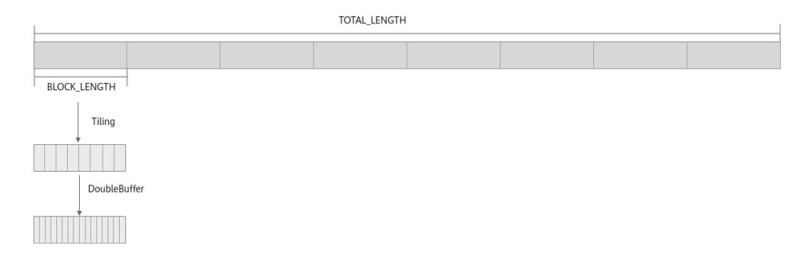

## **Tiling** 实现

使能DoubleBuffer后,每一个数据块会分成大小相等的两块,因此,若要使能 DoubleBuffer,要求数据总量应该能够均分。为了简化处理,将可用的Unified Buffer 空间以32字节为粒度,分成n块dataBlock,如果n不是偶数,则减1,这样就可以保证 一套代码兼容开启或不开启DoubleBuffer功能。对应步骤如下:

步骤**1** 判断数据总长度totalLength是否满足32字节对齐,如不满足,则计算totalLength向上 32字节对齐后的长度totalLengthAligned。

```
constexpr uint32_t BLOCK_SIZE = 32;
// 为方便计算,这里根据数据类型定义变量alignNum作为对齐数
uint32_t alignNum = BLOCK_SIZE / dataTypeSize;
// totalLength为数据总量
uint32_t totalLengthAligned = (totalLength % alignNum == 0)?
 totalLength : ((totalLength + alignNum - 1) / alignNum) * alignNum;
```

步骤**2** 根据totalLengthAligned,计算每个核的计算数据长度blockLength,分核策略可参照 **[6.2.4.4](#page-111-0)** 尾核**Tiling**。

步骤**3** 计算其余Tiling参数。

对当前Unified Buffer可用空间以32字节为粒度,进行切分,计算出数据块个数 UB\_BLOCK\_NUM。根据是否开启DoubleBuffer计算出当前可用的最大数据块个数, 记作MAX\_AVAILABLE\_UB\_BLOCK\_NUM。最后,以

MAX\_AVAILABLE\_UB\_BLOCK\_NUM为粒度,对blockLength进行切分。为方便演示, 如下代码直接给出UB\_BLOCK\_NUM,作为当前Unified Buffer可用空间包含的block (32字节)数。

```
constexpr uint32_t BUFFER_NUM = 2;
constexpr uint32_t UB_BLOCK_NUM = 21; // UB最大可以使用的block数量
constexpr uint32_t MAX_AVAILABLE_UB_BLOCK_NUM = UB_BLOCK_NUM / BUFFER_NUM * BUFFER_NUM;
tileNum = blockLength / (alignNum * MAX_AVAILABLE_UB_BLOCK_NUM);
if ((blockLength / alignNum) % MAX_AVAILABLE_UB_BLOCK_NUM == 0 || tileNum == 0) {
 if (tileNum == 0) {
 tileNum = 1;
 }
 if (blockLength < MAX_AVAILABLE_UB_BLOCK_NUM * alignNum) {
 tileLength = ((blockLength / alignNum) + 1) / BUFFER_NUM * BUFFER_NUM * alignNum;
 lastTileLength = tileLength;
 } else {
 tileLength = MAX_AVAILABLE_UB_BLOCK_NUM * alignNum;
 lastTileLength = (blockLength - (tileNum - 1) * tileLength);
 }
} else {
 tileNum = tileNum + 1;
 tileLength = MAX_AVAILABLE_UB_BLOCK_NUM * alignNum;
 lastTileLength = (blockLength - (tileNum - 1) * tileLength);
}
```

### **----**结束

## 算子类实现

不开启DoubleBuffer时,只需要对每个核上最后一个分块的起始地址做处理;开启 DoubleBuffer后,需要处理的数据块长度变成原来的一半,所以需要对最后两个数据 块的起始地址做处理。

开启DoubleBuffer,参考**InitBuffer**[接口函数原型](#page-948-0),将num参数配置成2。

```
pipe.InitBuffer(inQueueX, BUFFER_NUM, this->tileLength * sizeof(dataType));
pipe.InitBuffer(inQueueY, BUFFER_NUM, this->tileLength * sizeof(dataType));
pipe.InitBuffer(outQueueZ, BUFFER_NUM, this->tileLength * sizeof(dataType));
```

同时在计算核内每个数据块的长度时,考虑DoubleBuffer场景,需要将Buffer数量, 即BUFFER\_NUM=2带入计算。

this->tileLength = tiling.tileLength / BUFFER\_NUM;

由于无法保证尾块满足DoubleBuffer的条件,因此不对尾块进行切分。

this->lastTileLength = tiling.lastTileLength;

### Init函数实现代码如下:

```
__aicore__ inline void Init(GM_ADDR x, GM_ADDR y, GM_ADDR z, AddCustomTilingData tiling)
{
 if (tiling.isEvenCore) {
 this->blockLength = tiling.blockLength;
 this->tileNum = tiling.tileNum;
 this->tileLength = tiling.tileLength / BUFFER_NUM;
 this->lastTileLength = tiling.lastTileLength;
```

```
 xGm.SetGlobalBuffer((__gm__ dataType *)x + this->blockLength * AscendC::GetBlockIdx(), this-
>blockLength);
 yGm.SetGlobalBuffer((__gm__ dataType *)y + this->blockLength * AscendC::GetBlockIdx(), this-
>blockLength);
 zGm.SetGlobalBuffer((__gm__ dataType *)z + this->blockLength * AscendC::GetBlockIdx(), this-
>blockLength);
 } else {
 if (AscendC::GetBlockIdx() < tiling.formerNum) {
 this->tileNum = tiling.formerTileNum;
 this->tileLength = tiling.formerTileLength / BUFFER_NUM;
 this->lastTileLength = tiling.formerLastTileLength;
 xGm.SetGlobalBuffer((__gm__ dataType *)x + tiling.formerLength * AscendC::GetBlockIdx(), 
tiling.formerLength);
 yGm.SetGlobalBuffer((__gm__ dataType *)y + tiling.formerLength * AscendC::GetBlockIdx(), 
tiling.formerLength);
 zGm.SetGlobalBuffer((__gm__ dataType *)z + tiling.formerLength * AscendC::GetBlockIdx(), 
tiling.formerLength);
 } else {
 this->tileNum = tiling.tailTileNum;
 this->tileLength = tiling.tailTileLength / BUFFER_NUM;
 this->lastTileLength = tiling.tailLastTileLength;
 xGm.SetGlobalBuffer((__gm__ dataType *)x + tiling.formerLength * tiling.formerNum +
 tiling.tailLength * (AscendC::GetBlockIdx() - tiling.formerNum), tiling.tailLength);
 yGm.SetGlobalBuffer((__gm__ dataType *)y + tiling.formerLength * tiling.formerNum +
 tiling.tailLength * (AscendC::GetBlockIdx() - tiling.formerNum), tiling.tailLength);
 zGm.SetGlobalBuffer((__gm__ dataType *)z + tiling.formerLength * tiling.formerNum +
 tiling.tailLength * (AscendC::GetBlockIdx() - tiling.formerNum), tiling.tailLength);
 }
 }
 pipe.InitBuffer(inQueueX, BUFFER_NUM, this->tileLength * sizeof(dataType));
 pipe.InitBuffer(inQueueY, BUFFER_NUM, this->tileLength * sizeof(dataType));
 pipe.InitBuffer(outQueueZ, BUFFER_NUM, this->tileLength * sizeof(dataType));
}
```

由于开启DoubleBuffer后,切分后的数据块个数翻倍,在Process函数中,需要将 BUFFER\_NUM带入计算。

```
__aicore__ inline void Process()
{
 // loop count need to be doubled, due to DoubleBuffer
 constexpr int32_t loopCount = TILE_NUM * BUFFER_NUM;
 for (int32_t i = 0; i < loopCount; i++) {
 CopyIn(i);
 Compute(i);
 CopyOut(i);
 }
}
```

CopyIn函数、CopyOut函数需要对尾块进行单独处理。对于最后一个数据块,先向前 偏移tileLength +lastTileLength索引,再使用tileLength作为单次计算量(仅作为参 考,可能并非最佳)。

CopyIn函数实现代码如下:

```
__aicore__ inline void CopyIn(int32_t progress)
{
 AscendC::LocalTensor<dataType> xLocal = inQueueX.AllocTensor<dataType>();
 AscendC::LocalTensor<dataType> yLocal = inQueueY.AllocTensor<dataType>();
 if (progress == (this->tileNum * BUFFER_NUM - 1)) {
 AscendC::DataCopy(xLocal, xGm[(progress - 2) * this->tileLength + this->lastTileLength],
 this->tileLength);
 AscendC::DataCopy(yLocal, yGm[(progress - 2) * this->tileLength + this->lastTileLength],
 this->tileLength);
 } else {
 AscendC::DataCopy(xLocal, xGm[progress * this->tileLength], this->tileLength);
 AscendC::DataCopy(yLocal, yGm[progress * this->tileLength], this->tileLength);
```

```
 }
 inQueueX.EnQue(xLocal);
 inQueueY.EnQue(yLocal);
}
```

### CopyOut函数实现代码如下:

```
__aicore__ inline void CopyOut(int32_t progress)
{
 AscendC::LocalTensor<dataType> zLocal = outQueueZ.DeQue<dataType>();
 if (progress == (this->tileNum * BUFFER_NUM - 1)) {
 AscendC::DataCopy(zGm[(progress - 2) * this->tileLength + this->lastTileLength], zLocal,
 this->tileLength);
 } else {
 AscendC::DataCopy(zGm[progress * this->tileLength], zLocal, this->tileLength);
 }
 outQueueZ.FreeTensor(zLocal);
}
```

## **6.2.6 Broadcast** 场景

在某些场景下,可能会存在两个输入shape不相同的情况。由于**[Add](#page-532-0)**接口只支持对 shape相同的输入进行计算,因此需要先对输入进行shape变换,再进行Add计算。本 节将对满足Broadcast条件的输入在算子实现中的Broadcast处理进行介绍,其他场景 可以参考本章节中提供的思路。

### 须知

Broadcast机制通过扩展较小维度的数据,使得不同shape的输入能够进行运算,从而 避免了显式的复制操作,提高了计算效率。数据进行Broadcast需满足:两个输入的维 度个数相同,并且仅在某一个维度上的长度不同,某一个输入在此维度的长度为1。比 如:shape为(32, 8) 和 (32, 1) 的两个输入可以进行Broadcast,因为它们都是二维, 且第一个维度大小相等,而不相等的维度中第二个输入的维度为1,满足条件。

本节中将使用**[Broadcast](#page-1927-0)**接口,因此输入需满足该API相关约束。同时,由于硬件限 制,该API的输入地址需满足32字节对齐。本节以输入维度为2、第二个轴(axis = 1) 需要Broadcast为例进行说明。完整的样例代码请参见输入**[Broadcast](https://gitee.com/ascend/samples/tree/master/operator/ascendc/0_introduction/21_vectoradd_kernellaunch/VectorAddMultiCoreWithTilingBroadcast)**的**Add**算子样 [例](https://gitee.com/ascend/samples/tree/master/operator/ascendc/0_introduction/21_vectoradd_kernellaunch/VectorAddMultiCoreWithTilingBroadcast)。

## **Tiling** 实现

与输入shape相同的场景相比,在Tiling结构体中增加相应的成员变量,表示是否需要 对输入进行Broadcast、需要对哪个维度进行Broadcast、Broadcast的轴需要扩充的倍 数。因此新增四个Tiling结构体成员:

- xLen和yLen:表示两个输入的数据长度。
- axis:表示对输入的哪个维度进行Broadcast。
- coef:表示Broadcast的输入需要扩维的倍数。例如,x shape为(m, n), y shape为 (1, n), 则coef = m。如下图所示,图中相同颜色部分为单次计算的数据块。

### 图 **6-16** axis=1 时 coef 示意图

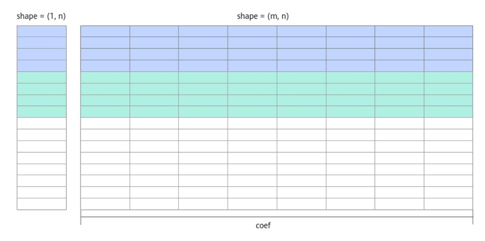

### Tiling结构体定义代码如下所示:

```
struct AddCustomTilingData {
 uint32_t xLen;
 uint32_t yLen;
 uint32_t coef;
 uint32_t axis;
 ...
};
```

设需要进行Broadcast的输入长度为shorterAxisLen;不需要进行Broadcast的输入长度 为totalLength。

```
constexpr uint32_t BLOCK_SIZE = 32;
... // 读入数据
uint32_t totalLength = (xLen > yLen)? xLen : yLen;
uint32_t shorterAxisLen = (xLen < yLen)? xLen : yLen;
```

使用shorterAxisLen进行分核计算,并使用分核后的长度与coef相乘作为totalLength 的分核长度。

```
constexpr uint32_t BLOCK_SIZE = 32;
if (shorterAxisLen % (BLOCK_DIM * BUFFER_NUM) == 0) {
 uint32_t blockLength = shorterAxisLen / BLOCK_DIM * coef;
 ...
} else {
 uint32_t formerNum = (shorterAxisLen / BUFFER_NUM) % BLOCK_DIM;
 uint32_t tailNum = BLOCK_DIM - formerNum;
 uint32_t formerLength = ((shorterAxisLen / BUFFER_NUM) / BLOCK_DIM + 1) * BUFFER_NUM * coef;
 uint32_t tailLength = ((shorterAxisLen / BUFFER_NUM) / BLOCK_DIM) * BUFFER_NUM * coef;
 ....
}
```

进行核内数据切分时,需要计算Unified Buffer数据块的数量向coef和BUFFER\_NUM对 齐之后的数量ubBlockAligned。

```
ubBlockAligned =
 (UB_BLOCK_NUM * alignNum / (coef * BUFFER_NUM) * (coef * BUFFER_NUM) == 0)?
 UB_BLOCK_NUM : UB_BLOCK_NUM * alignNum / (coef * BUFFER_NUM) * (coef * BUFFER_NUM);
...
tileNum = length / ubBlockAligned;
if (length % ubBlockAligned == 0 || tileNum == 0) {
 if (tileNum == 0) {
 tileNum = 1;
 }
```

```
 if (length < ubBlockAligned ) {
 tileLength = length;
 lastTileLength = tileLength;
 } else {
 tileLength = ubBlockAligned;
 lastTileLength = tileLength;
 }
} else {
 tileNum = tileNum + 1;
 tileLength = ubBlockNum;
 lastTileLength = (length - (tileNum - 1) * tileLength);
}
```

## 算子类实现

在核函数初始化阶段,根据Tiling结构体传入的参数确定对哪个输入进行Broadcast。 由于针对输入的第二个轴(axis = 1)进行Broadcast,可以计算出,对于需要进行 Broadcast的输入,每个核搬入数据长度为blockLength / coef。

### 初始化函数代码如下:

```
__aicore__ inline void Init(GM_ADDR x, GM_ADDR y, GM_ADDR z, AddCustomTilingData tiling)
{
 GM_ADDR longerInputPtr;
 GM_ADDR shorterInputPtr;
 if (tiling.xLen > tiling.yLen) {
 longerInputPtr = x;
 shorterInputPtr = y;
 } else {
 longerInputPtr = y;
 shorterInputPtr = x;
 }
 this->coef = tiling.coef;
 if (tiling.isEvenCore) {
 this->tileNum = tiling.tileNum;
 this->tileLength = tiling.tileLength / BUFFER_NUM;
 this->lastTileLength = tiling.lastTileLength;
 xGm.SetGlobalBuffer((__gm__ dataType *)longerInputPtr + tiling.blockLength * 
AscendC::GetBlockIdx(), tiling.blockLength);
 yGm.SetGlobalBuffer((__gm__ dataType *)shorterInputPtr + tiling.blockLength * 
AscendC::GetBlockIdx() / this->coef, tiling.blockLength / this->coef);
 zGm.SetGlobalBuffer((__gm__ dataType *)z + tiling.blockLength * AscendC::GetBlockIdx(), 
tiling.blockLength);
 } else {
 if (AscendC::GetBlockIdx() < tiling.formerNum) {
 this->tileNum = tiling.formerTileNum;
 this->tileLength = tiling.formerTileLength / BUFFER_NUM;
 this->lastTileLength = tiling.formerLastTileLength;
 xGm.SetGlobalBuffer((__gm__ dataType *)longerInputPtr + tiling.formerLength * 
AscendC::GetBlockIdx(), tiling.formerLength);
 yGm.SetGlobalBuffer((__gm__ dataType *)shorterInputPtr + tiling.formerLength * 
AscendC::GetBlockIdx() / this->coef, tiling.formerLength / this->coef);
 zGm.SetGlobalBuffer((__gm__ dataType *)z + tiling.formerLength * AscendC::GetBlockIdx(), 
tiling.formerLength);
 } else {
 this->tileNum = tiling.tailTileNum;
 this->tileLength = tiling.tailTileLength / BUFFER_NUM;
 this->lastTileLength = tiling.tailLastTileLength;
 xGm.SetGlobalBuffer((__gm__ dataType *)longerInputPtr + tiling.formerLength * tiling.formerNum +
 tiling.tailLength * (AscendC::GetBlockIdx() - tiling.formerNum), tiling.tailLength);
 yGm.SetGlobalBuffer((__gm__ dataType *)shorterInputPtr + tiling.formerLength * 
tiling.formerNum / this->coef +
 tiling.tailLength * (AscendC::GetBlockIdx() - tiling.formerNum) / this->coef, tiling.tailLength / this-
>coef);
 zGm.SetGlobalBuffer((__gm__ dataType *)z + tiling.formerLength * tiling.formerNum +
 tiling.tailLength * (AscendC::GetBlockIdx() - tiling.formerNum), tiling.tailLength);
 }
 }
```

```
 pipe.InitBuffer(inQueueX, BUFFER_NUM, this->tileLength * sizeof(dataType));
 pipe.InitBuffer(inQueueY, BUFFER_NUM, this->coef * sizeof(dataType));
 pipe.InitBuffer(outQueueZ, BUFFER_NUM, this->tileLength * sizeof(dataType));
 pipe.InitBuffer(tmpBuf2, this->tileLength * sizeof(dataType));
}
```

由于数据是向coef对齐的,在数据拷贝的过程中可能会出现地址不满足32字节对齐的 场景,因此CopyIn函数、CopyOut函数中使用**[DataCopyPad](#page-924-0)**进行数据拷贝。

### CopyIn函数实现代码如下:

```
__aicore__ inline void CopyIn(int32_t progress)
{
 AscendC::LocalTensor<dataType> xLocal = inQueueX.AllocTensor<dataType>();
 AscendC::LocalTensor<dataType> yLocal = inQueueY.AllocTensor<dataType>();
 AscendC::DataCopyExtParams copyXParams = {1, (uint32_t)(this->tileLength * sizeof(dataType)), 0, 0, 0};
 AscendC::DataCopyExtParams copyYParams = {1, (uint32_t)(this->tileLength * sizeof(dataType) / this-
>coef), 0, 0, 0};
 AscendC::DataCopyPadExtParams<dataType> padParams = {false, 0, 0, 0};
 if (progress == (this->tileNum * BUFFER_NUM - 1)) {
 AscendC::DataCopyPad<dataType>(xLocal, xGm[(progress - LAST_TWO_TILE) * this->tileLength + this-
>lastTileLength],
 copyXParams, padParams);
 AscendC::DataCopyPad<dataType>(yLocal, yGm[((progress - LAST_TWO_TILE) * this->tileLength + this-
>lastTileLength) / this->coef],
 copyYParams, padParams);
 } else {
 AscendC::DataCopyPad<dataType>(xLocal, xGm[progress * this->tileLength], copyXParams, 
padParams);
 AscendC::DataCopyPad<dataType>(yLocal, yGm[progress * this->tileLength / this->coef], 
copyYParams, padParams);
 }
 inQueueX.EnQue(xLocal);
 inQueueY.EnQue(yLocal);
}
```

### CopyOut函数实现代码如下:

```
__aicore__ inline void CopyOut(int32_t progress)
 AscendC::LocalTensor<dataType> zLocal = outQueueZ.DeQue<dataType>();
 AscendC::DataCopyExtParams copyParams = {1, (uint32_t)(this->tileLength * sizeof(dataType)), 0, 0, 0};
 if (progress == (this->tileNum * BUFFER_NUM - 1)) {
 AscendC::DataCopyPad<dataType>(zGm[(progress - LAST_TWO_TILE) * this->tileLength + this-
>lastTileLength], zLocal, copyParams);
 } else {
 AscendC::DataCopyPad<dataType>(zGm[progress * this->tileLength], zLocal, copyParams);
 }
 outQueueZ.FreeTensor(zLocal);
}
```

在Compute函数中,调用Add接口前需要先对输入进行Broadcast。这里需要计算 Broadcast前后的shape。基于前文提到的数据关系,可以计算得出Broadcast前后的 shape分别为{tileLength / broadcastCoef, 1}和{tileLength / broadcastCoef, broadcastCoef}。在此基础上对输入进行Broadcast,并将计算结果存入临时空间中, 然后进行Add计算。实现代码示例如下所示:

```
__aicore__ inline void Compute(int32_t progress)
{
 AscendC::LocalTensor<dataType> xLocal = inQueueX.DeQue<dataType>();
 AscendC::LocalTensor<dataType> yLocal = inQueueY.DeQue<dataType>();
 AscendC::LocalTensor<dataType> zLocal = outQueueZ.AllocTensor<dataType>();
 AscendC::LocalTensor<dataType> broadcastTmpTensor = broadcastTmpBuf.Get<dataType>();
 uint32_t dstShape[] = {this->tileLength / this->coef, this->coef};
 uint32_t srcShape[] = {this->tileLength / this->coef, 1};
 AscendC::BroadCast<dataType, 2, 1>(broadcastTmpTensor, yLocal, dstShape, srcShape);
 ...
}
```

## <span id="page-123-0"></span>**6.2.7** 非对齐场景

本节介绍非32字节对齐数据的更多处理方式,包括数据搬入、计算和搬出的处理。用 户在实际算子开发中,可以参考如下方案介绍和算子样例灵活地处理非对齐场景。

## 数据搬运和 **Vector** 计算的对齐要求

### 须知

进行数据搬运和Vector计算时,对于搬运的数据长度和操作数的起始地址有如下的对 齐要求:

- 使用DataCopy接口进行数据搬运,搬运的数据长度和操作数的起始地址(UB上) 必须保证32字节对齐。
- 通常情况下,进行Vector计算时,操作数的起始地址必须保证32字节对齐。具体对 齐要求需要查阅对应的API参考进行确认。

下文描述中的Global指Global Memory上的tensor,Local指Local Memory上的 tensor。

下面是一些非对齐搬运和计算的例子。

### ● 非对齐搬入

当需要从Global拷贝11个half数值到Local时,为保证搬运的数据长度32字节对 齐,使用DataCopy拷贝16个half(32B)数据到Local上,Local[11]~Local[15]被 写成无效数据-1。

### 图 **6-17** 非对齐搬入

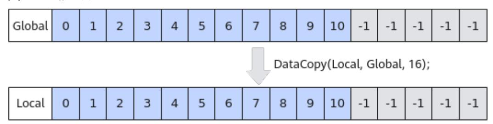

### ● 非对齐搬出

当需要从Local拷贝11个half数值到Global时,为保证搬运的数据长度32字节对 齐,使用DataCopy拷贝16个half(32B)数据到Global上, Global[11]~Global[15]被写成无效数据-1。

### 图 **6-18** 非对齐搬出

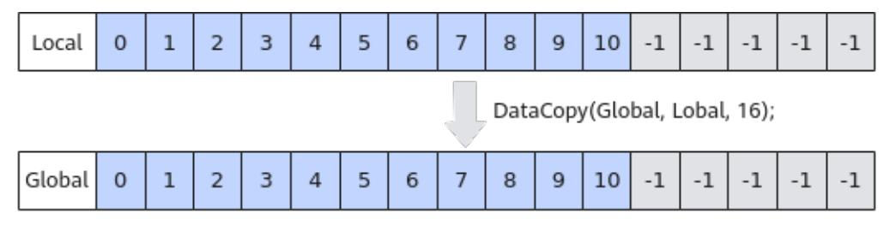

### ● 矢量计算起始地址非**32**字节对齐的错误示例

矢量计算时需要保证起始地址32字节对齐,如下的示例中,从Local1[7],即 LocalTensor的第8个数开始计算,起始地址不满足32字节对齐,是错误示例。

图 **6-19** 矢量计算起始地址非 32 字节对齐的错误示例

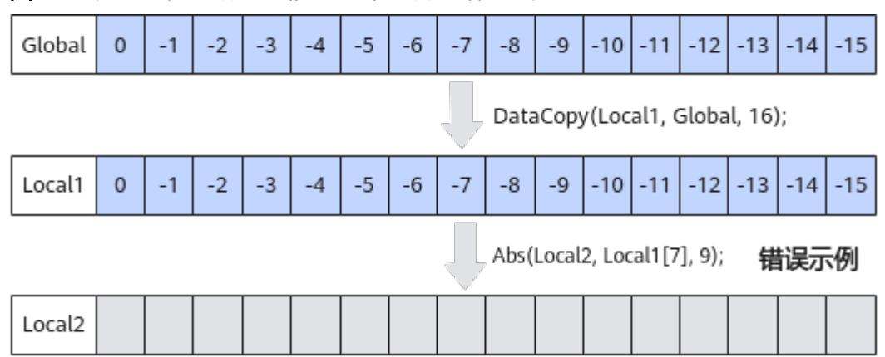

## 非对齐处理方案

**[DataCopyPad](#page-924-0)**接口提供非对齐搬运的功能,如果基于该接口支持的产品开发算子(参 [见产品支持情况](#page-924-0)),则可以直接使用该接口解决非对齐场景下的搬运问题。使用 DataCopyPad的完整示例请参考**DataCopyPad**[样例\(工程化算子开发\)](https://gitee.com/ascend/samples/tree/89e7cb94aedf7a55d6eb54a01902f137b7fb42ab/operator/ascendc/0_introduction/18_unaligned_wholereduces_frameworklaunch)和 **[DataCopyPad](https://gitee.com/ascend/samples/tree/89e7cb94aedf7a55d6eb54a01902f137b7fb42ab/operator/ascendc/0_introduction/17_unaligned_reducemin_kernellaunch)**样例(**kernel**直调)。

部分型号不支持DataCopyPad接口,需要参考如下的方案处理。

图 **6-20** 非对齐处理方案示意图

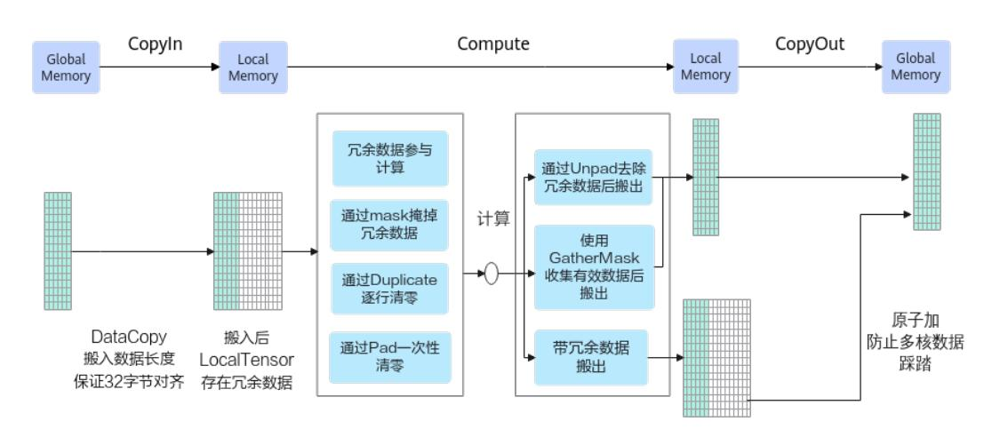

由于搬入时搬运的数据长度必须保证32字节对齐。数据长度非对齐的情况下,从 Global逐行搬运Tensor数据到Local中,Local中每行都存在冗余数据。

搬入后,进行矢量计算时对冗余数据的处理方式有以下几种:

- 冗余数据参与计算。一般用于elewise计算场景。
- 通过**mask**参数掩掉冗余数据。一般用于轴归约计算等场景。
- 通过**[Duplicate](#page-808-0)**逐行清零。计算前,针对每一行数据,调用基础API Duplicate对冗 余数据位置填充0值。

● 通过**[Pad](#page-1914-0)**一次性清零。计算前,针对多行数据,可以采用高阶API Pad接口对冗余 数据一次性清零。

由于搬出时搬运的数据长度和操作数的起始地址(UB上)必须保证32字节对齐,搬出 时可以选择去除冗余数据或者带着冗余数据搬出的方式。

- 使用**[UnPad](#page-1921-0)**接口去除冗余数据后搬出。待搬出的有效数据总长度满足32字节对齐 时,可使用高阶API UnPad接口去除冗余数据并完整搬出。
- 使用**[GatherMask](#page-679-0)**收集有效数据后搬出。待搬出的有效数据总长度大于等于32字 节时,可使用GatherMask重新收集有效数据,保证搬出的有效数据起始地址和数 据长度32字节对齐。
- 带冗余数据搬出。注意多核处理时开启原子加(使用**[SetAtomicAdd](#page-1074-0)**接口),防 止数据踩踏。

下面分别对上述几种处理方案做详细说明。

● 冗余数据参与计算

如下图所示,对前11个half数据进行Abs计算,冗余数据可以参与计算,不影响最 终结果。步骤为:

- a. 使用DataCopy从GLobal搬运16个half数据到Local1中,包含冗余数 据-11~-15;
- b. 直接使用Abs做整块计算,不用计算尾块大小,冗余数据参与计算。

### 图 **6-21** 冗余数据参与计算

| Global                        | 0 | -1 | -2 | -3 | -4 | -5 | -6 | -7 | -8 | -9 | -10 | -11 | -12 | -13 | -14 | -15 |
|-------------------------------|---|----|----|----|----|----|----|----|----|----|-----|-----|-----|-----|-----|-----|
| DataCopy(Local1, Global, 16); |   |    |    |    |    |    |    |    |    |    |     |     |     |     |     |     |
| Local1                        | 0 | -1 | -2 | უ  | -4 | -5 | -6 | -7 | -8 | -9 | -10 | -11 | -12 | -13 | -14 | -15 |
| Abs(Local2, Local1, 16);      |   |    |    |    |    |    |    |    |    |    |     |     |     |     |     |     |
| Local2                        | 0 | 1  | 2  | 3  | 4  | 5  | 6  | 7  | 8  | 9  | 10  | 11  | 12  | 13  | 14  | 15  |

### ● 使用mask掩掉冗余数据

如下图所示,假设输入数据的shape为16 \* 4,将输入数据搬入到UB后每行数据前 4个half数据为有效数据,其余为冗余数据。为只对前4个half数据进行ReduceMin 计算,可以通过设置mask参数的方法掩掉冗余数据。针对每行数据的处理步骤 为:

- a. 使用DataCopy从Global搬运16个half数据到Local1中;
- b. 对归约计算的目的操作数Local2清零,如使用Duplicate等;
- c. 进行归约操作,将ReduceMin的mask模式设置为前4个数据有效,从而掩掉 冗余数据。

### 图 **6-22** 使用 mask 掩掉脏数据

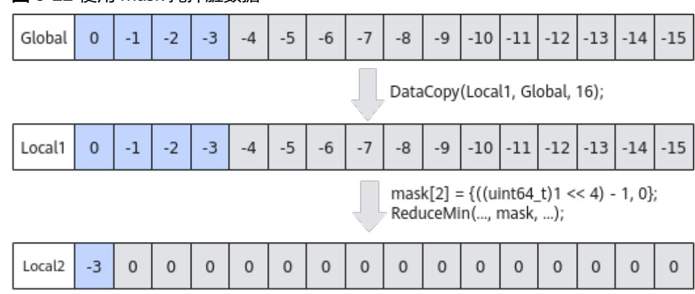

● 通过Duplicate逐行清零。

如下图所示,对于搬入后的非对齐数据,逐行进行Duplicate清零处理,步骤为:

- a. 使用DataCopy从Global搬运16个half数据到Local中;
- b. 使用基础API Duplicate,按照如下方式设置mask值,控制仅后5个元素位置 有效,将冗余数据填充为0。

uint64\_t mask0 = ((uint64\_t)1 << 16) - ((uint64\_t)1 << 11); uint64\_t mask[2] = {mask0, 0};

### 图 **6-23** 通过 Duplicate 逐行清零

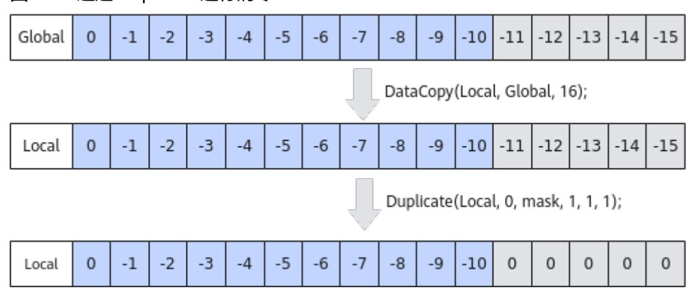

● 通过Pad一次性清零。

如下图所示,假设输入数据的shape为16 \* 6,搬入Local后大小为16 \* 16,每行 都包含冗余数据,逐行清零性能较差,可以使用Pad一次性清零,步骤为:

- a. 将16 \* 6的数据从GM上逐行搬入UB后,每行有6个有效数据;
- b. 使用Pad接口将冗余数据位置填充为0。(对应Pad接口使用场景为:tensor 的width已32B对齐,但是有部分冗余数据)。

图 **6-24** 通过 Pad 一次性清零

|                  | 0  | 1  | 2  | 3  | 4  | 5  |
|------------------|----|----|----|----|----|----|
| Global<br>(16*6) | •  |    | •  |    |    | •  |
|                  |    |    |    |    |    |    |
|                  | 90 | 91 | 92 | 93 | 94 | 95 |

|         | 0  | 1  | 2  | 3  | 4  | 5  | 6 | 7 | 8 | 9 | 10 | 11 | 12 | 13 | 14 | 15 |
|---------|----|----|----|----|----|----|---|---|---|---|----|----|----|----|----|----|
| Local1  | 6  | 7  | 8  | 9  | 10 | 11 |   |   |   |   |    |    |    |    |    |    |
| (16*16) |    |    |    |    |    |    |   |   |   |   |    |    |    |    |    |    |
|         | 90 | 91 | 92 | 93 | 94 | 95 | 0 | 0 | 0 | 0 | 0  | 0  | 0  | 0  | 0  | 0  |

|         | 0  | 1  | 2  | 3  | 4  | 5  | 0 | 0 | 0 | 0 | 0 | 0 | 0 | 0 | 0 | 0 |
|---------|----|----|----|----|----|----|---|---|---|---|---|---|---|---|---|---|
| Local2  |    | •  | •  | •  | •  | •  | • | • |   |   |   | • | • |   |   |   |
| (16*16) |    | •  | •  | •  | •  | •  | • | • |   |   |   | • | • |   |   |   |
|         | 90 | 91 | 92 | 93 | 94 | 95 | 0 | 0 | 0 | 0 | 0 | 0 | 0 | 0 | 0 | 0 |

● 使用UnPad接口去除冗余数据后搬出。

如下图所示,Local内存大小为16\*16,每行中只有前6个数为有效数据, 要搬出 的有效数据16 \* 6满足32B对齐,可以使用UnPad接口去除冗余数据并完整搬出。 步骤如下:

- a. 使用UnPad高阶API去除冗余值;
- b. 使用DataCopy搬运出连续的16 \* 6个half数据到Global中。

### 图 **6-25** 使用 UnPad 接口去除冗余数据后搬出

|         | 0  | 1  | 2  | 3  | 4  | 5  | 0 | 0 | 0 | 0 | 0 | 0 | 0 | 0 | 0 | 0 |
|---------|----|----|----|----|----|----|---|---|---|---|---|---|---|---|---|---|
| Local1  |    |    |    |    |    |    |   |   |   |   |   |   |   |   |   |   |
| (16*16) |    |    |    |    |    |    |   |   |   |   |   |   |   |   |   |   |
|         | 90 | 91 | 92 | 93 | 94 | 95 | 0 | 0 | 0 | 0 | 0 | 0 | 0 | 0 | 0 | 0 |

| Local2<br>(16*6) | 0  | 1  | 2  | 3  | 4  | 5  |
|------------------|----|----|----|----|----|----|
|                  |    | •  |    |    |    |    |
|                  |    |    |    |    |    |    |
|                  | 90 | 91 | 92 | 93 | 94 | 95 |

| Global<br>(16*6) | 0  | 1  | 2  | 3  | 4  | 5  |
|------------------|----|----|----|----|----|----|
|                  |    |    |    |    |    |    |
|                  |    |    |    |    |    |    |
|                  | 90 | 91 | 92 | 93 | 94 | 95 |

● 使用GatherMask收集有效数据后搬出。

如下图所示,为搬出19个half数据到Global中,有16-18这3个数据的搬运无法满 足对齐要求,使用GatherMask对有效数据进行重新收集,收集3-18这16个数据并 搬出。步骤如下:

- a. 完整拷贝前16个half(32B)数据到Global中;
- b. 使用GatherMask接口,将Local1[3]~[18]的数Gather到Local2中,Local2从 对齐地址开始;
- c. 从Local2中搬运Gather的数据(32B整数倍)到Global中。

### 图 **6-26** 使用 GatherMask 收集有效数据后搬出。

| Local1 | 0 | 1 | 2 | 3 | 4 | 5 | 6     | 7      | 8        | 9       | 10      | 11       | 12      | 13     | 14 | 15 | 16 |
|--------|---|---|---|---|---|---|-------|--------|----------|---------|---------|----------|---------|--------|----|----|----|
|        |   |   |   |   | 1 | Ţ | Dat   | aCopy( | Global,  | Local1  | , 16);  |          |         |        |    |    |    |
| Global | 0 | 1 | 2 | 3 | 4 | 5 | 6     | 7      | 8        | 9       | 10      | 11       | 12      | 13     | 14 | 15 | 0  |
|        |   |   |   |   |   |   |       |        |          |         |         |          |         |        |    |    |    |
| Local1 | 0 | 1 | 2 | 3 | 4 | 5 | 6     | 7      | 8        | 9       | 10      | 11       | 12      | 13     | 14 | 15 | 16 |
|        |   |   |   |   | 2 | - | Gathe | rMask( | Local2,  | Local1  | , SrcPa | ttern, t | rue, ma | ask,); |    |    |    |
| Local2 | 3 | 4 | 5 | 6 | 7 | 8 | 9     | 10     | 11       | 12      | 13      | 14       | 15      | 16     | 17 | 18 |    |
|        |   |   |   |   | 3 | - | DataC | opy(Gl | obal, Lo | cal2, 1 | 6);     |          |         |        |    |    | _  |
| Global | 0 | 1 | 2 | 3 | 4 | 5 | 6     | 7      | 8        | 9       | 10      | 11       | 12      | 13     | 14 | 15 | 16 |

### ● 带冗余数据搬出

如下图所示,有4个核参与计算,每个核拷贝出4个数,每个核上拷贝的数据长度 不满足32字节对齐,采用将冗余数据一起搬出的方式,步骤如下:

- a. 将目标Global完整清零,可以通过在host清零或者在kernel侧用UB覆盖的方 式处理;
- b. 将本核内的Local数据,除了要搬出的4个有效数据,其余冗余部分清零(使 用Duplicate接口);
- c. 使用原子累加的方式拷贝到Global,原子累加结合冗余数据清零,确保不会 出现数据踩踏。

# 图 **6-27** 带冗余数据搬出

## 样例介绍

● 样例一:冗余数据参与计算**+**使用**GatherMask**[收集有效数据后搬出](https://gitee.com/ascend/samples/tree/master/operator/ascendc/0_introduction/16_unaligned_abs_kernellaunch/AbsGatherMaskKernelInvocation)。

本样例中展示了shape为128 \* 18的tensor进行Abs计算的算子实现。针对每行数 据的处理方案如下:

搬入后,每行数据的后14个数为冗余数据。Abs接口入参BLOCKLEN\_CEIL为32个 数,是18个数进行32字节对齐后的结果,有14个冗余数据参与计算。

AscendC::Abs(outputLocal, inputLocal, BLOCKLEN\_CEIL); // main calculation

计算完成后,通过GatherMask的bufPattern入参控制收集18个数中的后16个数。

uint16\_t tmpValue = 0;

AscendC::Duplicate<uint16\_t>(bufPattern, tmpValue, 16);

bufPattern.SetValue(0, 0b1111111111111100); // select the last 14 elements of the first 16 positions bufPattern.SetValue(1, 0b0000000000000011); // select the first 2 elements of the next 16 positions uint32\_t mask = 32;

uint64\_t rsvdCnt = 0;

AscendC::LocalTensor<half> tailLocal = outQueueTail.AllocTensor<half>();

AscendC::GatherMask(tailLocal, outputLocal, bufPattern, true, mask, {1, 1, 8, 8}, rsvdCnt);

首先使用DataCopy搬运前16个数,然后搬运后16个数,中间的14个数存在重复 搬运。注意:因为DataCopy的目的地址存在重叠所以需要通过PipeBarrier添加流 水同步。

```
uint32_t copyLenMain = TILE_LENGTH * sizeof(half) / 32 * 32 / sizeof(half);
uint32_t offsetMain = progress * TILE_LENGTH;
AscendC::DataCopy(dstGlobal[offsetMain], outputLocal, copyLenMain);
AscendC::PipeBarrier<PIPE_MTE3>();
uint32_t tailLen = 32 / sizeof(half);
uint32_t offsetTail = offsetMain + (TILE_LENGTH - tailLen);
AscendC::DataCopy(dstGlobal[offsetTail], tailLocal, tailLen);
```

<span id="page-131-0"></span>搬入时要保证32字节对齐,所以要将输入的最后一行补齐到32字节对齐,防止访 问非法数据,main.cpp中对GM上输入的长度的定义如下:

```
size_t inputByteSize = 2318 * sizeof(int16_t); // 2318 = 2304 + 32 - 18
size_t outputByteSize = 2304 * sizeof(int16_t);
```

● 样例二:通过**Duplicate**逐行清零**+**[带冗余数据搬出。](https://gitee.com/ascend/samples/blob/master/operator/ascendc/0_introduction/16_unaligned_abs_kernellaunch/AbsDuplicateKernelInvocation)

本样例中展示了shape为64 \* 11的tensor进行Abs计算的算子实现。 共使用4个 核,每个核处理16 \* 11个数据。

搬入后,每行数据的后5个数为冗余数据。通过Duplicate接口对每行数据中的后5 个数据进行清零。

```
// mask mode controls only the last 5 elements doing Duplicate
uint64_t mask0 = (1ul << 16) - (1ul << BLOCK_ELEMENT_NUM);
uint64_t mask[2] = {mask0, 0};
for (int32_t i = 0; i < BLOCK_GROUP_NUM; i++) {
 AscendC::Duplicate<half>(inputLocal[i * BLOCKLEN_CEIL], 0, mask, 1, 1, 1); // clear dummy data on 
inputLocal
}
AscendC::Abs(outputLocal, inputLocal, BLOCKLEN_CEIL * BLOCK_GROUP_NUM);
```

搬出时,带冗余数据搬出并开启原子累加,BLOCKLEN\_CEIL中包含冗余数据。

```
AscendC::SetAtomicAdd<half>();
for (int32_t i = 0; i < BLOCK_GROUP_NUM; i++) {
 AscendC::DataCopy<half>(dstGlobal[i * BLOCK_ELEMENT_NUM], outputLocal[i * BLOCKLEN_CEIL], 
BLOCKLEN_CEIL);
}
AscendC::SetAtomicNone();
```

所以在初始化时,需要对GM数据进行清零,清零代码如下,示例中多个核都调用 **[InitGlobalMemory](#page-2061-0)**接口进行清零,需要调用SyncAll进行核间同步。

AscendC::InitGlobalMemory<half>(dstGlobal, blockLength, 0);

pipe.InitBuffer(inQueue, BUFFER\_NUM, BLOCK\_GROUP\_NUM \* BLOCKLEN\_CEIL \* sizeof(half)); pipe.InitBuffer(outQueue, BUFFER\_NUM, BLOCK\_GROUP\_NUM \* BLOCKLEN\_CEIL \* sizeof(half)); pipe.InitBuffer(syncLocalTbuf, USE\_CORE\_NUM \* DEFAULT\_SYNCALL\_NEED\_SIZE \* sizeof(int32\_t)); AscendC::LocalTensor<int32\_t> SyncLocal = syncLocalTbuf.Get<int32\_t>(); AscendC::SyncAll(syncGlobal, SyncLocal, USE\_CORE\_NUM);

搬入时要保证32字节对齐,需要将输入的最后一行补齐到32字节对齐,防止访问 非法数据;搬出时带冗余数据搬出,输出的最后一行也需要补齐到32字节对齐。 main.cpp中对GM上输入输出的长度的定义如下:

```
// copy in borrow the next (BLOCKLEN_CEIL - BLOCK_ELEMENT_NUM) elements of srcGM 
size_t inputByteSize = 709 * sizeof(int16_t);
// copy out atomic add extra (BLOCKLEN_CEIL - BLOCK_ELEMENT_NUM) zeros to dstGM
size_t outputByteSize = 709 * sizeof(int16_t);
```

● 样例三:冗余数据参与计算**+**使用**UnPad**[接口去除冗余数据后搬出](https://gitee.com/ascend/samples/tree/master/operator/ascendc/0_introduction/16_unaligned_abs_kernellaunch/AbsUnPadKernelInvocation)。

本样例中展示了shape为2048 \* 14的tensor进行Abs计算的算子实现。 共使用8个 核,每个核处理256 \* 14个数据。

搬入后,每行数据的后2个数为冗余数据。Abs接口入参BLOCK\_GROUP\_NUM \* BLOCKLEN\_CEIL为连续的16行数据,每行16个数,每行的冗余数据参与计算。

AscendC::Abs(inputLocal, inputLocal, BLOCK\_GROUP\_NUM \* BLOCKLEN\_CEIL); // main calculation 计算后,使用UnPad接口去除冗余数据后再搬出,通过unPadParams.rightPad参 数控制去除每行最后的2个冗余数据。

unPadParams.rightPad = BLOCKLEN\_CEIL - BLOCK\_ELEMENT\_NUM; // delete 2 dummy half each row AscendC::UnPad<half>(outputLocal, inputLocal, unPadParams, this->tiling);

注意:UnPad接口需要传入tiling参数。abs\_unpad\_tiling.cpp中关键计算过程如 下:

AscendC::GetUnPadMaxMinTmpSize(\*ascendcPlatform, srcShape, sizeof(int16\_t), tmpMaxSize, tmpMinSize);

optiling::UnPadTiling tilingData;

AscendC::UnPadTilingFunc(srcShape, tmpMaxSize, sizeof(int16\_t), tilingData);

main.cpp中tiling参数需要通过核函数的入参传入到kernel侧,供UnPad高阶API使 用。

ACLRT\_LAUNCH\_KERNEL(abs\_unpad\_custom)(blockDim, stream, xDevice, zDevice, workspaceDevice, tilingDevice);

搬入时要保证32字节对齐,所以要将输入的最后一行补齐到32字节对齐,防止访 问非法数据,main.cpp中对GM上输入的长度的定义如下。

```
// 28674 is TOTAL_LENGTH + (BLOCKLEN_CEIL - BLOCK_ELEMENT_NUM)
// 28672 is TOTAL_LENGTH
// copy in borrow the next (BLOCKLEN_CEIL - BLOCK_ELEMENT_NUM) elements of srcGM
uint32_t oriLength = 28672;
uint32_t colNum = 14;
uint32_t maxColNum = 32 / sizeof(uint16_t);
uint32_t padLength = oriLength + maxColNum - colNum;
size_t inputByteSize = padLength * sizeof(int16_t);
size_t outputByteSize = oriLength * sizeof(int16_t);
```

● 示例四:通过**Pad**一次性清零**+**[带冗余数据搬出。](https://gitee.com/ascend/samples/tree/master/operator/ascendc/0_introduction/16_unaligned_abs_kernellaunch/AbsPadKernelInvocation)

本样例中展示了shape为2048 \* 7的tensor进行Abs计算的算子实现。 共使用8个 核,每个核处理256 \* 7个数据。

搬入后,每行数据的后9个数为冗余数据。每个核上通过Pad接口将256 \* 9的冗余 数据块整体清零后参与Abs计算。

```
AscendC::PadParams padParams = {0, BLOCKLEN_CEIL - BLOCK_ELEMENT_NUM, 0};
AscendC::Pad(outputLocal, inputLocal, padParams, this->tiling);
AscendC::Abs(outputLocal, outputLocal, BLOCK_GROUP_NUM * BLOCKLEN_CEIL); // main calculation
```

计算后带冗余数据搬出的代码解释和[样例二](#page-131-0)一致。

注意:Pad接口需要传入tiling参数。abs\_pad\_tiling.cpp中关键计算过程如下: AscendC::GetPadMaxMinTmpSize(srcShape, sizeof(int16\_t), tmpMaxSize, tmpMinSize);

optiling::PadTiling tilingData; AscendC::PadTilingFunc(srcShape, oriSrcShape, tmpMaxSize, sizeof(int16\_t), tilingData);

main.cpp中tiling参数需要通过核函数的入参传入到kernel侧,供Pad高阶API使 用。

ACLRT\_LAUNCH\_KERNEL(abs\_pad\_custom)(blockDim, stream, xDevice, zDevice, workspaceDevice, tilingDevice);

搬入时要保证32字节对齐,需要将输入的最后一行补齐到32字节对齐,防止访问 非法数据;搬出时带冗余数据搬出,输出的最后一行也需要补齐到32字节对齐。 main.cpp中对GM上输入输出的长度的定义如下:

```
// 14336 is the length of input data
uint32_t oriLength = 14336;
// we must allocate more space to prevent invalid address access
uint32_t padLength = oriLength + shapePad[1] - shapeUsed[1];
size_t inputByteSize = padLength * sizeof(int16_t);
size_t outputByteSize = padLength * sizeof(int16_t);
// however, original length must be used when output to file
size_t outputFileSize = oriLength * sizeof(int16_t);
```

● 样例五:使用**mask**掩掉冗余数据**+**[带冗余数据搬出](https://gitee.com/ascend/samples/tree/master/operator/ascendc/0_introduction/17_unaligned_reducemin_kernellaunch/ReduceMinKernelInvocation)。

本样例中展示了shape为16 \* 4的tensor每行数据进行ReduceMin计算的算子实 现。 共使用4个核,每个核处理4 \* 4个数据。

搬入后,每行数据的后12个数为冗余数据。通过ReduceMin的入参Mask控制只有 前4个数参与计算。

```
uint64_t Mask0 = ((uint64_t)1 << BLOCK_ELEMENT_NUM) - 1; // mask mode controls only the first 4 
elements do ReduceMin calculation
uint64_t Mask[2] = {Mask0, 0};
// main calculation
for (int i = 0; i < BLOCK_GROUP_NUM; i++) {
 AscendC::ReduceMin<half>(outputLocal[i * BLOCKLEN_CEIL], inputLocal[i * BLOCKLEN_CEIL], 
workLocal, Mask, 1, 8, false);
}
```

<span id="page-133-0"></span>outQueue.EnQue<half>(outputLocal); inQueue.FreeTensor(inputLocal);

计算后带冗余数据搬出的代码解释和[样例二](#page-131-0)一致。

搬入时要保证32字节对齐,需要将输入的最后一行补齐到32字节对齐,防止访问 非法数据;搬出时带冗余数据搬出,输出的最后一行也需要补齐到32字节对齐。 main.cpp中对GM上输入输出的长度的定义如下:

// copy in borrow the next (BLOCKLEN\_CEIL - BLOCK\_ELEMENT\_NUM) elements of srcGM size\_t inputByteSize = 76 \* sizeof(int16\_t);

// copy out atomic add extra (BLOCKLEN\_CEIL - BLOCK\_ELEMENT\_NUM) zeros to dstGM size\_t outputByteSize = 76 \* sizeof(int16\_t);

## **6.3** 矩阵编程(高阶 **API**)

## **6.3.1** 基础知识

### 说明

本节内容为使用高阶API进行矩阵乘法的编程指导。使用高阶API进行实际的矩阵编程时,需要通 过**API**[参考确](#page-1410-0)认接口支持的产品型号。

## 矩阵乘法概述

Matmul的计算公式为:C = A \* B + bias,其示意图如下。

- A、B为源操作数,A为左矩阵,形状为[M, K];B为右矩阵,形状为[K, N]。
- C为目的操作数,存放矩阵乘结果的矩阵,形状为[M, N]。
- bias为矩阵乘偏置,形状为[1, N]。对A\*B结果矩阵的每一行都采用该bias进行偏 置。

### 图 **6-28** Matmul 矩阵乘示意图

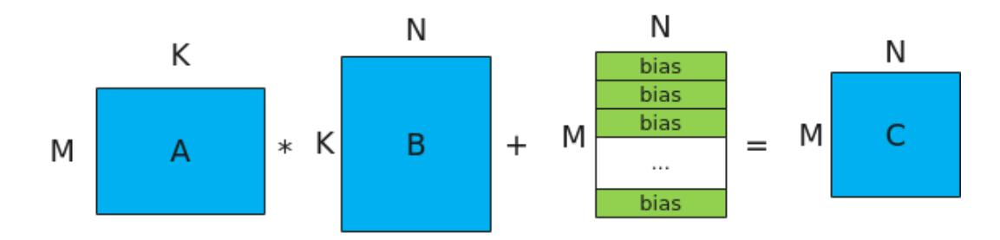

## 矩阵乘法数据流

在了解矩阵乘法数据流之前,需要先回顾一下几个重要的存储逻辑位置的概念:

- 搬入数据的存放位置:A1,用于存放整块A矩阵,可类比CPU多级缓存中的二级 缓存;
- 搬入数据的存放位置:B1,用于存放整块B矩阵,可类比CPU多级缓存中的二级缓 存;
- 搬入数据的存放位置:C1,用于存放整块的矩阵乘偏置Bias矩阵,可类比CPU多 级缓存中的二级缓存;

- <span id="page-134-0"></span>● 搬入数据的存放位置:A2,用于存放切分后的小块A矩阵,可类比CPU多级缓存 中的一级缓存;
- 搬入数据的存放位置:B2,用于存放切分后的小块B矩阵,可类比CPU多级缓存中 的一级缓存;
- 搬入数据的存放位置:C2,用于存放切分后的小块矩阵乘偏置Bias矩阵,可类比 CPU多级缓存中的一级缓存;
- 结果数据的存放位置:CO1,用于存放小块结果C矩阵,可理解为Cube Out;
- 结果数据的存放位置:CO2,用于存放整块结果C矩阵,可理解为Cube Out;
- 搬入数据的存放位置:VECCALC,一般在计算需要临时变量时使用此位置。

矩阵乘法数据流指矩阵乘的输入输出在各存储位置间的流向。逻辑位置的数据流向如 下图所示(为了简化描述,没有列出bias):

- A矩阵从输入位置到A2的数据流如下(输入位置可以是GM或者VECOUT):GM- >A2,GM->A1->A2;VECOUT->A1->A2。
  - 由于A1比A2的空间更大,数据从GM或VECOUT可以先搬入A1进行缓存,待该数 据执行Cube计算前,数据直接从A1搬入A2,这样在搬运大量数据时可以减少计算 前的等待时间,提升性能,只有在搬入数据较少的场景才可能使用GM->A2的数 据流。
- B矩阵从输入位置到B2的数据流如下(输入位置可以是GM或者VECOUT):GM- >B2,GM->B1->B2;VECOUT->B1->B2。
  - 由于B1比B2的空间更大,数据从GM或VECOUT可以先搬入B1进行缓存,待该数 据执行Cube计算前,数据直接从B1搬入B2,这样在搬运大量数据时可以减少计算 前的等待时间,提升性能,只有在搬入数据较少的场景才可能使用GM->B2的数据 流。
- 完成A2\*B2=CO1计算。
- CO1数据汇聚到CO2:CO1->CO2。
- 从CO2到输出位置(输出位置可以是GM或者VECIN):CO2->GM/CO2- >VECIN。

<span id="page-135-0"></span>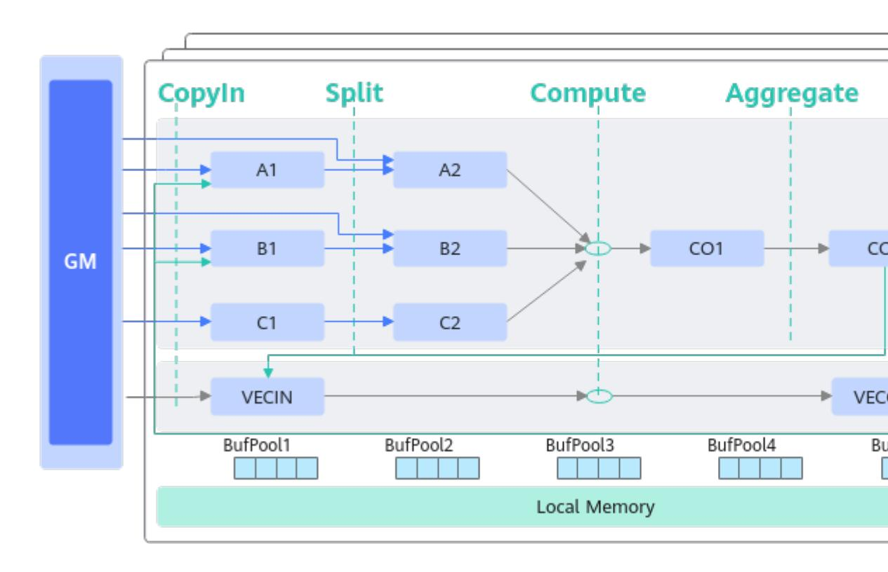

## 数据格式

在完成Matmul矩阵乘法时,主要涉及到两种分形格式ND和**[NZ](#page-303-0)**。

- ND:普通格式,N维张量。
- NZ:为满足AICore中Cube计算单元高性能计算的需要,引入该特殊格式。
  - ND –> NZ的变换过程为:

(..., N,H, W )->pad->(..., N, H1\*H0, W1\*W0)->reshape->(..., N, H1, H0, W1, W0)->transpose->(..., N, W1, H1, H0, W0)

如下图所示 (W,H)大小的矩阵被分为(H1\*W1)个分形,按照列优先排布, 形状如N字形;每个分形内部有(H0\*W0)个元素,按照行优先排布,形状如z字 形。所以这种数据格式称为NZ(大N小Z)格式。

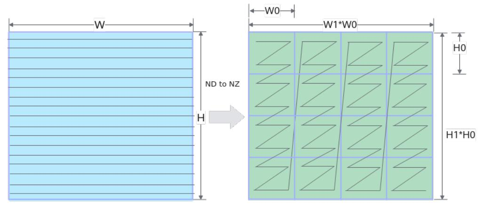

下面我们再通过一个具体的例子来深入理解ND和NZ格式的数据排布区别。假设 分形格式为2\*2,如下图所示4\*4的矩阵,ND和NZ格式存储两种情况下,数据在 内存中的排布格式分别为:

ND: 0, 1, 2, 3, 4, 5, 6, 7, 8, 9, 10, 11, 12, 13, 14, 15

<span id="page-136-0"></span>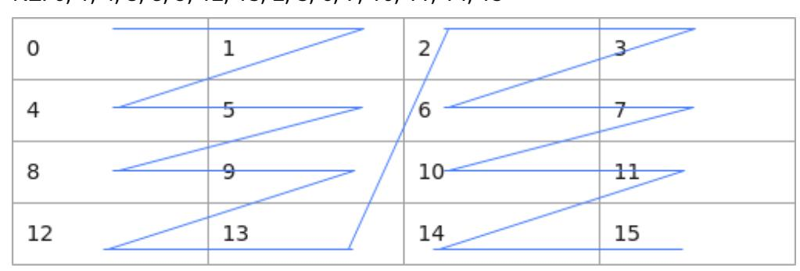

NZ: 0, 1, 4, 5, 8, 9, 12, 13, 2, 3, 6, 7, 10, 11, 14, 15

关于矩阵ND到NZ格式转换的样例请参考**Matmul**输入矩阵**ND**到**NZ**[格式转换的算](https://gitee.com/ascend/ascendc-api-adv/tree/v1.6-8.2.RC1/examples/matrix/matmul_nz) [子样例](https://gitee.com/ascend/ascendc-api-adv/tree/v1.6-8.2.RC1/examples/matrix/matmul_nz)。

## 数据分块(**Tiling**)

### ● 多核切分

为了实现多核并行,需要将矩阵数据进行切分,分配到不同的核上进行处理。切 分策略如下图所示:

- 对于A矩阵,沿着M轴进行切分,切分成多份的singleCoreM,单核上处理 SingleCoreM \* K大小的数据。
- 对于B矩阵,沿着N轴进行切分,切分成多份的singleCoreN,单核上处理K \* SingleCoreN大小的数据。
- 对于C矩阵,SingleCoreM \* K大小的A矩阵和K \* SingleCoreN大小的B矩阵相 乘得到SingleCoreM \* SingleCoreN大小的C矩阵,即为单核上输出的C矩阵大 小。

比如,下图中共有8个核参与计算,将A矩阵沿着M轴划分为4块,将B矩阵沿着N 轴切分为两块,单核上仅处理某一分块(比如图中绿色部分为core3上参与计算的 数据):SingleCoreM \* K大小的A矩阵分块和SingleCoreN\* K大小的B矩阵分块相 乘得到SingleCoreM \* SingleCoreN大小的C矩阵分块。

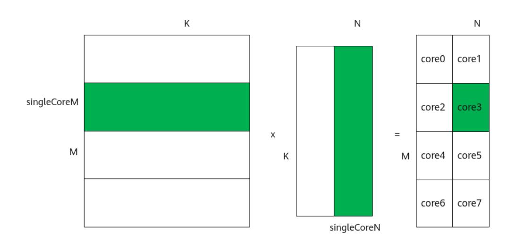

### ● 核内切分

大多数情况下,Local Memory的存储,无法完整的容纳算子的输入与输出,需要 每次搬运一部分输入进行计算然后搬出,再搬运下一部分输入进行计算,直到得 到完整的最终结果,也就是需要做核内的输入切分。切分的策略如下所示:

- <span id="page-137-0"></span>– 对于A矩阵,沿M轴进行切分,将singleCoreM切分成多份的baseM,切分成 的份数对应图示的mIter;沿K轴进行切分,切分成多份的baseK。
- 对于B矩阵,沿N轴进行切分,将singleCoreN切分成多份的baseN,切分成的 份数对应图示的nIter;沿K轴进行切分,切分成多份的baseK。
- 对于C矩阵,A矩阵中baseM\*baseK大小的分块和B矩阵中baseK\*baseN大小 的分块相乘并累加,得到C矩阵中对应位置baseM\*baseN大小的分块。比 如,图中结果矩阵中的蓝色矩阵块5是通过如下的累加过程得到的:a\*a+b\*b +c\*c+d\*d+e\*e+f\*f。

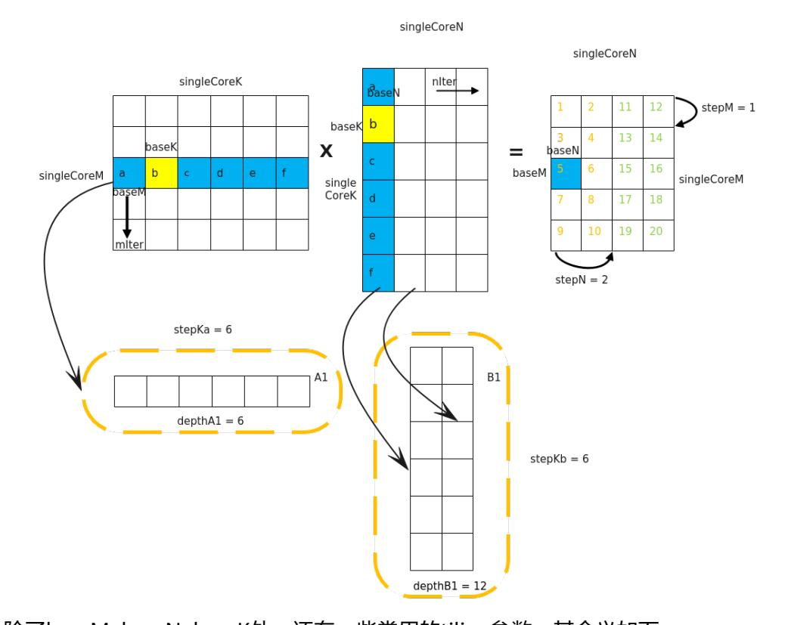

除了baseM, baseN, baseK外,还有一些常用的tiling参数,其含义如下:

- iterateOrder:一次Iterate迭代计算出[baseM, baseN]大小的C矩阵分片。 Iterate完成后,Matmul会自动偏移下一次Iterate输出的C矩阵位置, iterateOrder表示自动偏移的顺序。
  - <sup>0</sup>代表先往M轴方向偏移再往N轴方向偏移;
  - <sup>1</sup>代表先往N轴方向偏移再往M轴方向偏移。

在上图的示例中,iterateOrder取值为0。

- depthA1,depthB1:A1、B1上存储的矩阵片全载A2/B2的份数,A2、B2存 储大小分别是baseM \* baseK,baseN \* baseK,即depthA1是A1矩阵切片含 有baseM \* baseK块的个数,depthB1是B1矩阵切片含有baseN \* baseK块的 个数。
- stepM,stepN:stepM为左矩阵在A1中缓存的buffer M方向上baseM的倍 数,stepN为右矩阵在B1中缓存的buffer N方向上baseN的倍数。
- stepKa,stepKb:stepKa为左矩阵在A1中缓存的buffer K方向上baseK的倍 数,stepKb为右矩阵在B1中缓存的buffer K方向上baseK的倍数。

## <span id="page-138-0"></span>**6.3.2** 算子实现

## 实现流程

上文介绍了Matmul矩阵乘的数据切分方案和数据流。Ascend C提供一组Matmul高阶 API,封装了这些常用的切分和数据搬运、计算的算法逻辑,方便用户快速实现 Matmul矩阵乘法的运算操作。开发者在host侧通过调用API自动获取Tiling参数,该参 数传递到kernel侧后,在初始化操作时传入,通过几个简单的API即可完成矩阵乘操 作。完整样例请参考**[LINK](https://gitee.com/ascend/samples/tree/v1.5-8.2.RC1/operator/ascendc/0_introduction/10_matmul_frameworklaunch/MatmulCustomSingleCore)**。

### 图 **6-29** 矩阵编程流程示意图


host侧自动获取Tiling参数的关键步骤介绍如下:

### 步骤**1** 创建**Tiling**对象。

auto ascendcPlatform = platform\_ascendc::PlatformAscendC(context->GetPlatformInfo()); matmul\_tiling::MatmulApiTiling cubeTiling(ascendcPlatform);

传入硬件平台信息创建PlatformAscendC对象,然后创建Tiling对象,硬件平台信息可 以通过**[14.2.2.23.25 GetPlatformInfo](#page-2577-0)**获取。

### 步骤**2** 设置**A**、**B**、**Bias**的内存逻辑位置、格式和数据类型。

cubeTiling.SetAType(AscendC::TPosition::GM, CubeFormat::ND, matmul\_tiling::DataType::DT\_FLOAT16); cubeTiling.SetBType(AscendC::TPosition::GM, CubeFormat::ND, matmul\_tiling::DataType::DT\_FLOAT16); cubeTiling.SetCType(AscendC::TPosition::GM, CubeFormat::ND, matmul\_tiling::DataType::DT\_FLOAT); cubeTiling.SetBiasType(AscendC::TPosition::GM, CubeFormat::ND, matmul\_tiling::DataType::DT\_FLOAT);

### 步骤**3** 设置矩阵**shape**信息。

cubeTiling.SetShape(M, N, K); cubeTiling.SetOrgShape(M, N, K); // 设置原始完整的形状M、N、K

### 步骤**4** 设置可用空间大小信息。

设置Matmul计算时可用的L1 Buffer/L0C Buffer/Unified Buffer空间大小,-1表示AI处 理器对应Buffer的大小。

cubeTiling.SetBufferSpace(-1, -1, -1);

### <span id="page-139-0"></span>步骤**5** 按需设置其他参数,比如设置**bias**参与计算。

cubeTiling.EnableBias(true);

### 步骤**6** 获取**Tiling**参数。

```
MatmulCustomTilingData tiling;
if (cubeTiling.GetTiling(tiling.cubeTilingData) == -1){ 
 return ge::GRAPH_FAILED; 
}
```

### 步骤**7** Tiling参数的序列化保存等其他操作。

### **----**结束

kernel侧使用Matmul API矩阵乘运算的具体步骤如下:

### 步骤**1** 创建**Matmul**对象

创建Matmul对象的示例如下:

- 纯Cube模式(只有矩阵计算)场景下,需要在代码中定义ASCENDC\_CUBE\_ONLY 宏,本节内容以纯Cube模式举例。
- 默认为MIX模式(包含矩阵计算和矢量计算),该场景下,不能定义 ASCENDC\_CUBE\_ONLY宏,更多内容请参考**6.5** [融合算子编程。](#page-184-0)

```
// 纯Cube模式(只有矩阵计算)场景下,需要设置该代码宏,并且必须在#include "lib/matmul_intf.h"之前设置
#define ASCENDC_CUBE_ONLY 
#include "lib/matmul_intf.h"
typedef AscendC::MatmulType<AscendC::TPosition::GM, CubeFormat::ND, half> aType; 
typedef AscendC::MatmulType<AscendC::TPosition::GM, CubeFormat::ND, half> bType; 
typedef AscendC::MatmulType<AscendC::TPosition::GM, CubeFormat::ND, float> cType; 
typedef AscendC::MatmulType<AscendC::TPosition::GM, CubeFormat::ND, float> biasType; 
AscendC::Matmul<aType, bType, cType, biasType> mm;
```

创建对象时需要传入A、B、C、Bias的参数类型信息, 类型信息通过MatmulType来定 义,包括:内存逻辑位置、数据格式、数据类型。

### 步骤**2** 初始化操作。

REGIST\_MATMUL\_OBJ(&pipe, GetSysWorkSpacePtr(), mm, &tiling); // 初始化

### 说明

Matmul高阶API内部实现时需要使用系统workspace(即对应本步骤中的GetSysWorkSpacePtr 接口),开发者需要自行申请系统workspace的空间:

● 在host侧Tiling实现时,设置总的workspace的数值大小(包含用户workspace和系统 workspace),workspace空间由框架来申请并管理。系统workspace的空间大小通过 **[GetLibApiWorkSpaceSize](#page-2249-0)**获取。

```
size_t userWorkspaceSize = 0;
size_t systemWorkspaceSize = static_cast<size_t>(ascendcPlatform.GetLibApiWorkSpaceSize());
size_t *currentWorkspace = context->GetWorkspaceSizes(1);
currentWorkspace[0] = userWorkspaceSize + systemWorkspaceSize;
```

● 若算子工程不是[自定义算子工程,](#page-213-0)也不是带有**[-DHAVE\\_WORKSPACE](#page-203-0)**编译宏的**[Kernel](#page-194-0)**直调 [算子工程,](#page-194-0)框架不会自动设置workspace,需要在kernel侧的Matmul初始化前,通过 **[SetSysWorkSpace](#page-1020-0)**设置系统workspace。

```
// 使用Matmul时必须设置workspace空间 
SetSysWorkspace(workspace);
if (GetSysWorkSpacePtr() == nullptr) {
 return;
```

### 步骤**3** 设置左矩阵**A**、右矩阵**B**、**Bias**。

```
mm.SetTensorA(gm_a); // 设置左矩阵A
mm.SetTensorB(gm_b); // 设置右矩阵B
mm.SetBias(gm_bias); // 设置Bias
```

### 步骤**4** 完成矩阵乘操作。

● 调用Iterate完成单次迭代计算,叠加while循环完成单核全量数据的计算。Iterate 方式,可以自行控制迭代次数,完成所需数据量的计算,方式比较灵活。

```
while (mm.Iterate()) { 
 mm.GetTensorC(gm_c); 
}
```

● 调用IterateAll完成单核上所有数据的计算。IterateAll方式,无需循环迭代,使用 比较简单。

mm.IterateAll(gm\_c);

### 步骤**5** 结束矩阵乘操作。

mm.End();

**----**结束

## 设置 **Shape** 信息

在实现Host Tiling时可以设置Shape信息,用于Tiling计算;kernel侧运行时也可以修 改部分Shape信息,用于尾块设置、Matmul复用(多个Matmul计算复用一个Matmul 对象)等场景。本节对涉及到的Shape概念进行介绍,并给出host侧和kernel侧设置 Tiling信息的指导。

● orgShape:M、N、K

● singleCoreShape:singleCoreM、singleCoreN、singleCoreK

● singleShape:singleM、singleN、singleK

● baseShape:baseM、baseN、baseK

通过[数据分块\(](#page-136-0)**Tiling**)的介绍我们已经了解了orgShape(M、N、K), singleCoreShape(singleCoreM、singleCoreN、singleCoreK),baseShape(baseM、 baseN、baseK)的概念,如下图所示:

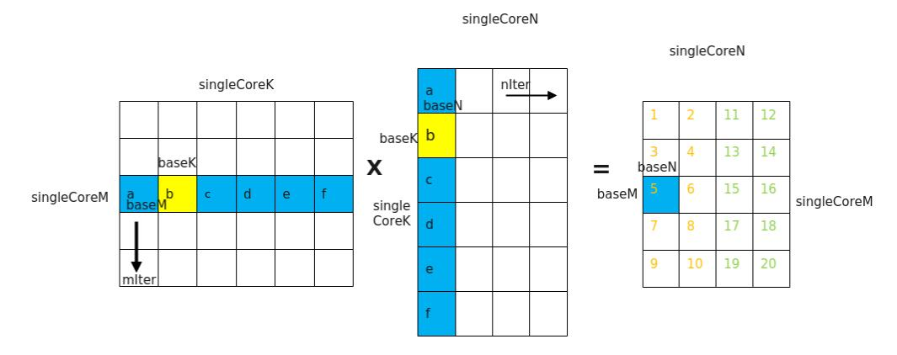

除此之外,单核的Matmul Tiling时,实际参与Matmul计算的shape可以是原始shape 中的一部分,singleM, singleN, singleK用于表达实际参与Matmul计算的shape,如下 图所示。在单核的情况下,singleM, singleN, singleK会透传给singleCoreM, singleCoreN, singleCoreK。

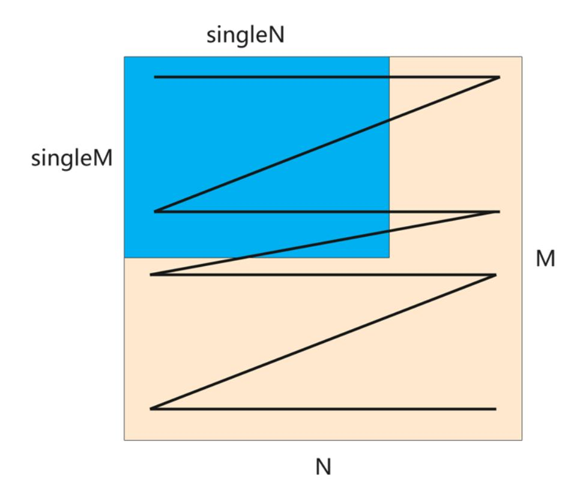

### ● Kernel运行时设置

- **[SetTail](#page-1516-0)**、**[SetSingleShape](#page-1522-0)**都是运行时修改singleCoreM、singleCoreN、 singleCoreK,处理尾块时使用SetTail,Matmul复用(多个Matmul计算复用 一个Matmul对象)的场景可以使用SetSingleShape重新设置。
- **[SetOrgShape](#page-1521-0)**是运行时修改M、N、K,Matmul复用的场景可以使用 SetOrgShape重新设置。
- 单核Tiling时设置
  - **[SetOrgShape](#page-1556-0)**(必选):设置M、N、K
  - **[SetShape](#page-1554-0)**(非必选): 设置singleM、singleN、singleK,等同于设置 singleCoreM、singleCoreN、singleCoreK
  - **[SetFixSplit](#page-1557-0)**(非必选):设置baseM、baseN、baseK
- 多核Tiling时设置
  - **[SetOrgShape](#page-1556-0)**(必选):设置M、N、K
  - **[SetShape](#page-1554-0)**(非必选): 设置singleM、singleN、singleK
  - **[SetFixSplit](#page-1557-0)**(非必选):设置baseM、baseN、baseK
  - **[SetSingleShape](#page-1553-0)**(非必选): 设置singleCoreM、singleCoreN、singleCoreK
  - **[SetSingleRange](#page-1569-0)**(非必选) :设置singleCoreM、singleCoreN、singleCoreK 的范围

## 设置 **format** 格式

创建Matmul对象时需要传入A、B、C、Bias的参数类型信息, 类型信息通过 MatmulType来定义,包括:内存逻辑位置、数据格式、数据类型。示例如下:

typedef AscendC::MatmulType<AscendC::TPosition::GM, CubeFormat::ND, half> aType; typedef AscendC::MatmulType<AscendC::TPosition::GM, CubeFormat::ND, half> bType; <span id="page-142-0"></span>typedef AscendC::MatmulType<AscendC::TPosition::GM, CubeFormat::ND, float> cType; typedef AscendC::MatmulType<AscendC::TPosition::GM, CubeFormat::ND, float> biasType; AscendC::Matmul<aType, bType, cType, biasType> mm;

针对数据格式,包括CubeFormat::ND, CubeFormat::NZ, CubeFormat::ND\_ALIGN三 种,ND和NZ格式[在数据格式](#page-135-0)章节已经介绍,ND\_ALIGN格式的介绍请参[考数据排布格](#page-313-0) [式](#page-313-0)。

## **6.3.3** 特性场景

## **6.3.3.1 Matmul** 特性介绍

除了前述[基础知识和](#page-133-0)[算子实现](#page-138-0)中介绍的基本计算能力外,Matmul矩阵编程还提供了适 用于不同场景的处理能力及多种功能,具体场景和功能列于下表中,详细内容请见后 续章节。

表 **6-4** Matmul 特性表

| 特性<br>分类 | 特性描述                | 功能简介                                                                                                               |
|----------|---------------------|--------------------------------------------------------------------------------------------------------------------|
| 功能<br>实现 | 多核对齐切分              | 在多核场景中,支持将矩阵数据沿M、N、K轴切分,满<br>足M能被singleCoreM整除、N能被singleCoreN整除、K<br>能被singleCoreK整除的对齐场景时的处理方式,从而实<br>现多核并行计算矩阵乘。 |
|          | 多核非对齐切分             | 在多核场景中,支持将矩阵数据沿M、N、K轴切分。当<br>出现M不能被singleCoreM整除、或N不能被singleCoreN<br>整除、或K不能被singleCoreK整除的非对齐场景(即尾块<br>场景)时的处理方式。 |
|          | 异步场景处理              | MIX场景(包含矩阵计算和矢量计算)下不需要等待矩阵<br>乘计算完成,先执行其它计算。                                                                       |
|          | 自定义数据搬入<br>搬出       | 自定义矩阵乘计算前后的数据搬运函数。本功能支持用户<br>实现左矩阵A、右矩阵B从Global Memory分别自定义搬<br>入到A1、B1的过程,输出C矩阵从CO1自定义搬出到<br>Global Memory的过程。    |
|          | 矩阵乘输出的量<br>化/反量化    | 将矩阵乘的计算结果从CO1搬出到Global Memory时,<br>对矩阵元素执行数据量化或反量化操作。                                                              |
|          | 矩阵乘输出的<br>Channel拆分 | 矩阵乘输出的Channel拆分,又称ChannelSplit。指float<br>数据类型、NZ数据格式的输出C矩阵按照16*8的分形大小<br>存储。                                       |
|          | 矩阵向量乘               | 矩阵向量乘即GEMV,指矩阵乘计算中M=1,K>1的场<br>景,即对形状为(1, K)的左矩阵A实现矩阵乘计算。                                                          |
|          | 4:2稀疏矩阵乘            | 4:2稀疏矩阵乘,又称Sparse Matmul。指对稀疏左矩阵A<br>和4:2稠密化的右矩阵B实现矩阵乘计算。                                                          |
|          | 上/下三角矩阵<br>乘        | 忽略位于矩阵中下三角或上三角位置的元素的计算,实现<br>矩阵中上三角或下三角位置的元素的矩阵乘计算。                                                                |

<span id="page-143-0"></span>

| 特性<br>分类 | 特性描述              | 功能简介                                                                         |
|----------|-------------------|------------------------------------------------------------------------------|
|          | TSCM输入的矩<br>阵乘    | 对内存逻辑位置为TSCM的左矩阵A或右矩阵B实现矩阵乘<br>计算。                                           |
|          | 矩阵乘输出的N<br>方向对齐   | 矩阵乘输出的N方向对齐,又称ND_ALIGN格式输出。指<br>对数据格式为ND_ALIGN的输出C矩阵实现N方向32字节<br>对齐的自动补齐及输出。 |
|          | 单次矩阵乘局部<br>输出     | 单次矩阵乘局部输出,又称Partial Output,指矩阵乘计<br>算时不对单核K方向的计算结果做累加,直接输出计算结<br>果。          |
|          | AIC和AIV独立<br>运行机制 | AIC和AIV独立运行机制,又称双主模式。MIX场景(包含<br>矩阵计算和矢量计算)下AIC核和AIV核独立运行代码,<br>不依赖消息驱动。     |

### 表 **6-5** BatchMatmul 特性表

| 特性<br>分类 | 特性描述                 | 功能简介                                                                                          |
|----------|----------------------|-----------------------------------------------------------------------------------------------|
| 功能<br>实现 | Batch Matmul<br>基础功能 | Batch Matmul基础功能,支持批量处理Matmul,调用<br>一次IterateBatch接口,计算出多个singleCoreM *<br>singleCoreN大小的C矩阵。 |

## **6.3.3.2** 多核对齐切分

## 功能介绍

为了实现多核并行,提升计算效率,需要将矩阵数据进行切分,分配到不同的核上进 行处理。主要的切分策略有切分K轴和不切分K轴两种。

不切分K轴、仅切分M、N轴的策略如下:

- 对于A矩阵,沿着M轴进行切分,切分成多份的singleCoreM,单核上处理 SingleCoreM \* K大小的数据。
- 对于B矩阵,沿着N轴进行切分,切分成多份的singleCoreN,单核上处理K \* SingleCoreN大小的数据。
- 对于C矩阵,SingleCoreM \* K大小的A矩阵和K \* SingleCoreN大小的B矩阵相乘得 到SingleCoreM \* SingleCoreN大小的C矩阵,即为单核上输出的C矩阵大小。

比如,下图中共有8个核参与计算,将A矩阵沿着M轴划分为4块,将B矩阵沿着N轴切 分为两块,单核上仅处理某一分块(比如图中蓝色部分为core5上参与计算的数据): SingleCoreM \* K大小的A矩阵分块和SingleCoreN \* K大小的B矩阵分块相乘得到 SingleCoreM \* SingleCoreN大小的C矩阵分块。

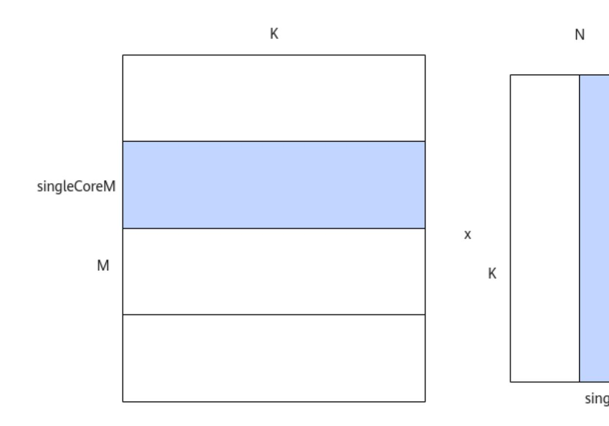

切分M、N、K轴的策略如下图所示:

- 对于A矩阵,沿着M轴进行切分,切分成多份的singleCoreM,沿着K轴切分,切 分成多份的singleCoreK,单核上处理singleCoreM \* singleCoreK大小的数据。
- 对于B矩阵,沿着K轴进行切分,切分成多份的singleCoreK,沿着N轴进行切分, 切分成多份的singleCoreN,单核上处理singleCoreK \* singleCoreN大小的数据。
- 对于C矩阵,singleCoreM \* singleCoreK大小的A矩阵与singleCoreK \* singleCoreN大小的B矩阵相乘并累加得到singleCoreM \* singleCoreN大小的C矩阵 分块。

比如下图中,C矩阵中的R矩阵块,是通过A1\*B1+A2\*B2+A3\*B3累加得到的,其中, A1\*B1、A2\*B2、A3\*B3可在多个核上并行计算。

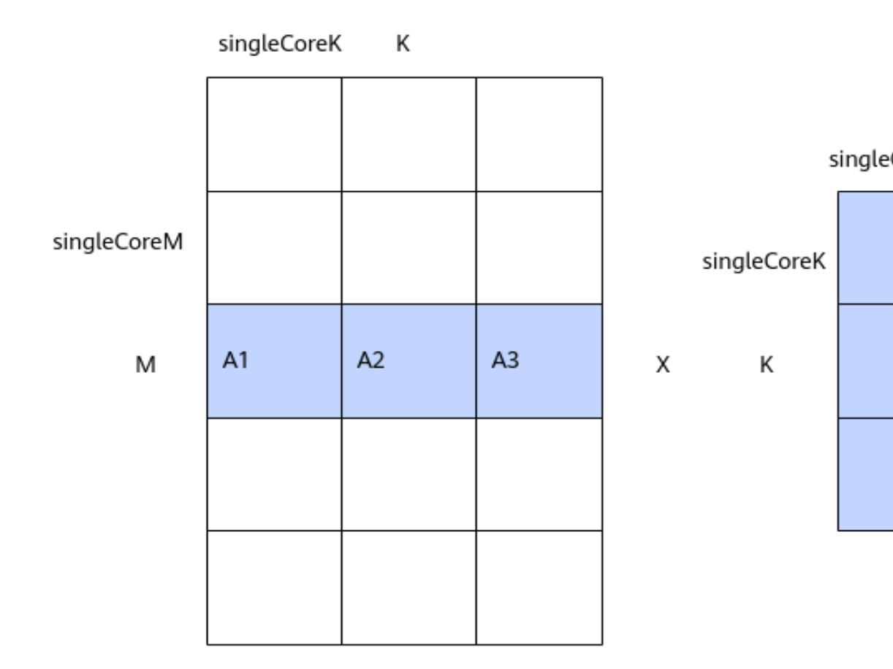

上述的切分策略会在Tiling参数中体现,比如SingleCoreM、SingleCoreN、 SingleCoreK,开发者在host侧通过调用API自动获取Tiling参数,与单核场景的不同的 是,多核Tiling需要使用**[MultiCoreMatmulTiling](#page-1542-0)**构造多核Tiling对象,并通过 **[SetDim](#page-1567-0)**接口设置Matmul计算所用的核数。注意:这里设置的核数为Matmul计算可用 的核数,仅在多核场景下设置,用于计算tiling参数;SetBlockDim为整个算子计算所 用核数,是实际会加载的核数,是必须设置的。SetBlockDim的设置规则请参考 **[blockDim](#page-226-0)**的说明。SetDim的设置规则如下:

- 纯Cube模式(只有矩阵计算)场景,本节内容以纯Cube模式举例。 **[SetDim](#page-1567-0)**设置当前AI处理器可用的核数,通过**[Tiling](#page-1566-0)**计算得到执行Matmul计算实 际使用的核数,实际使用的核数小于等于AI处理器可用的核数。**[SetBlockDim](#page-2569-0)**按 照实际使用的核数由用户进行配置。
- MIX模式(包含矩阵计算和矢量计算)的设置规则请参考**MIX**[场景核数设置规则](#page-194-0)。

## 使用场景

多核处理Matmul矩阵计算场景。

## 约束说明

<span id="page-146-0"></span>该场景的关键代码示例如下。Matmul多核对齐场景的完整样例请参考:多核切M、N 的样例:**Matmul**多核**Kernel**[直调样例;](https://gitee.com/ascend/samples/tree/v1.5-8.2.RC1/operator/ascendc/0_introduction/11_matmul_kernellaunch/MatmulInvocationNeo)多核切K的样例:多核切**K**[场景的算子样例。](https://gitee.com/ascend/ascendc-api-adv/tree/v1.6-8.2.RC1/examples/matrix/matmul_splitk)

```
// 构造多核Tiling对象
auto ascendcPlatform = platform_ascendc::PlatformAscendCManager::GetInstance(socVersion);
matmul_tiling::MultiCoreMatmulTiling cubeTiling(*ascendcPlatform);
// 仅包含Cube计算的算子,设置可参与矩阵乘运算的核数为当前AI处理器上的Cube核数
cubeTiling.SetDim(ascendcPlatform.GetCoreNumAic());
cubeTiling.SetAType(matmul_tiling::TPosition::GM, matmul_tiling::CubeFormat::ND, 
matmul_tiling::DataType::DT_FLOAT16);
cubeTiling.SetBType(matmul_tiling::TPosition::GM, matmul_tiling::CubeFormat::ND, 
matmul_tiling::DataType::DT_FLOAT16);
cubeTiling.SetCType(matmul_tiling::TPosition::GM, matmul_tiling::CubeFormat::ND, 
matmul_tiling::DataType::DT_FLOAT);
cubeTiling.SetBiasType(matmul_tiling::TPosition::GM, matmul_tiling::CubeFormat::ND, 
matmul_tiling::DataType::DT_FLOAT);
cubeTiling.SetOrgShape(M, N, K);
cubeTiling.SetShape(M, N, K);
cubeTiling.EnableBias(isBias);
optiling::TCubeTiling tilingData; 
// 获取Tiling参数
int ret = tiling.GetTiling(tilingData); // if ret = -1, gen tiling failed
```

## **6.3.3.3** 多核非对齐切分

## 功能介绍

多核场景,对矩阵进行切分时,若M、N、K无法整除singleCoreM 、singleCoreN、 singleCoreK时,就会出现尾块,即多核非对齐场景。如下图矩阵A、B的最后一行和最 后一列的矩阵块:

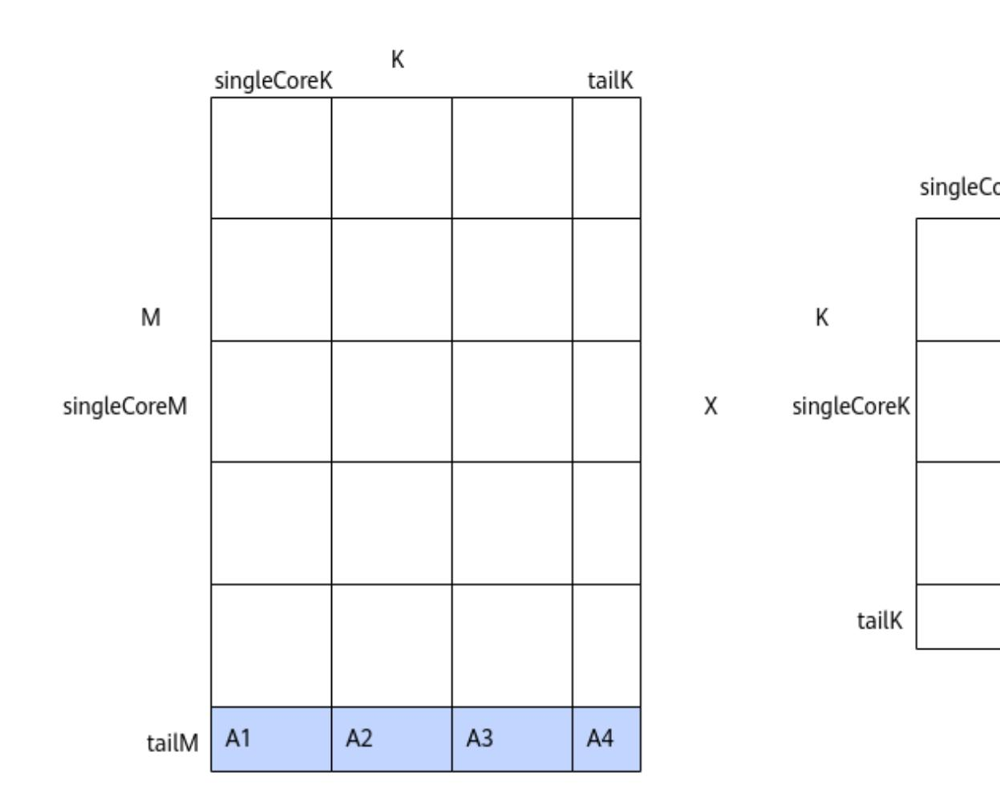

此时,C矩阵中的R矩阵块,依然是通过A1\*B1+A2\*B2+A3\*B3+A4\*B4累加得到的,处 理A1\*B1、A2\*B2、A3\*B3、A4\*B4等尾块时,需在kernel侧设置尾块大小,在不改变原 有tiling的情况下,调用**[SetTail](#page-1516-0)**接口重新设置本次计算的singleCoreM/singleCoreN/ singleCoreK,在处理尾块的时候按照设置的值也就是tailM/tailN/tailK进行搬运和计 算。

## 使用场景

多核处理Matmul矩阵计算,存在尾块的场景。

## 约束说明

处理尾块调用的SetTail接口,需要在Iterate/IterateAll之前调用。

## 调用示例

Matmul多核非对齐场景的完整样例请参考**Matmul**[多核非对齐切分算子样例。](https://gitee.com/ascend/ascendc-api-adv/tree/v1.6-8.2.RC1/examples/matrix/matmul_unaligned)该场景 的关键代码示例如下。

// 处理尾块 int tailM = tiling.M - mCoreIndex \* tiling.singleCoreM;

```
tailM = tailM < tiling.singleCoreM ? tailM : tiling.singleCoreM;
int tailN = tiling.N - nCoreIndex * tiling.singleCoreN;
tailN = tailN < tiling.singleCoreN ? tailN : tiling.singleCoreN;
// 当tailM < singleCoreM 或 tailN < singleCoreN时被认为需要处理尾块,此时可以调用SetTail接口进行设置
if (tailM < tiling.singleCoreM || tailN < tiling.singleCoreN) {
 matmulObj.SetTail(tailM, tailN);
}
```

## **6.3.3.4** 异步场景处理

## 功能介绍

Matmul的**[Iterate](#page-1492-0)**和**[IterateAll](#page-1499-0)**接口在MIX场景(包含矩阵计算和矢量计算)下提供了 同步和异步两种模式,纯Cube场景(只有矩阵计算)下,只支持同步模式。

同步模式指的是程序执行时,需要等待某个操作完成后才能继续执行下一步操作。 异 步模式指的是程序执行时,不需要等待某个操作完成就可以继续执行下一步操作。

- Iterate&GetTensorC的同步和异步
  - 同步:执行完一次Iterate迭代计算后,执行**[GetTensorC](#page-1494-0)**搬运矩阵C分片,搬 运完成后,才能进行下一次计算。如下图所示,C矩阵中,矩阵块1搬走后, 才能计算矩阵块2,矩阵块2搬运完成后,才能计算矩阵块3。

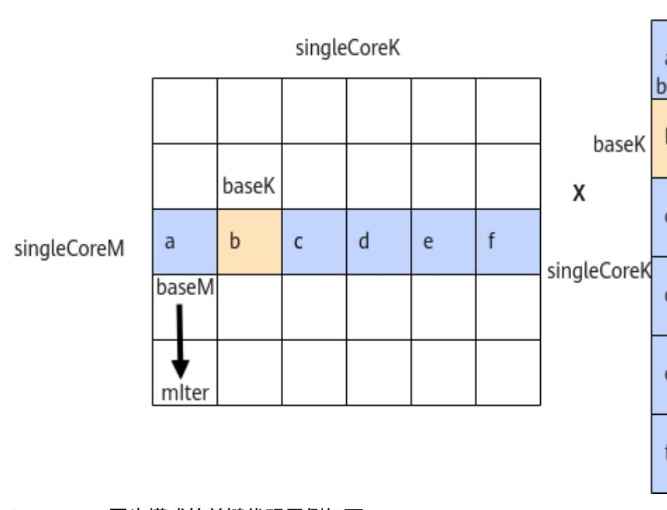

Iterate&GetTensorC同步模式的关键代码示例如下:

```
while (mm.Iterate()) {
 mm.GetTensorC(gm_c);
}
```

– 异步:通过设置Iterate接口的模板参数开启异步模式。调用Iterate后,无需 立即调用GetTensorC同步等待矩阵C分块搬运完成,可以先执行其它操作, 待需要获取结果时再调用GetTensorC。异步模式可以减少同步等待,提高并 行度,开发者对计算性能要求较高时,可以选用该方式。异步场景时,需要

使用一块临时空间来缓存Iterate计算结果,否则会覆盖计算结果,调用 GetTensorC时会在该临时空间中获取C的矩阵分片。临时空间通过 **[SetWorkspace](#page-1524-0)**接口进行设置。SetWorkspace接口需要在Iterate接口之前调 用。

Iterate&GetTensorC异步模式的关键代码示例如下:

```
mm.SetWorkspace(workspace, size); // 其中,workspace为临时空间的物理地址,size为
singleCoreM * singleCoreN的矩阵C大小
// 异步模式
mm.template Iterate<false>();
…… // 执行其他操作
auto mIter = Ceil(singleCoreM, baseM);
auto nIter = Ceil(singleCoreN, baseN);
for (int i = 0; i < mIter * nIter ; ++i) {
 mm.GetTensorC<false> (gm_c);
}
```

- IterateAll的同步和异步
  - 同步:后续操作需要同步等待IterateAll执行结束。

IterateAll同步模式的关键代码示例如下:

```
mm.SetTensorA(gm_a); // 设置左矩阵A
mm.SetTensorB(gm_b); // 设置右矩阵B
mm.SetBias(gm_bias); // 设置Bias
mm.IterateAll(gm_c);
// 后续操作
...
```

– 异步:后续操作不需要同步等待IterateAll执行结束,需要IterateAll的结果 时,调用**[WaitIterateAll](#page-1502-0)**等待IterateAll异步接口返回。

IterateAll异步模式的关键代码示例如下:

```
AscendC::Matmul<aType, bType, cType, biasType> mm;
mm.SetTensorA(queryGm[tensorACoreOffset]);
mm.SetTensorB(keyGm[tensorBCoreOffset + sInnerStart * singleProcessSInnerSize *
 tilingData->attentionScoreOffestStrideParams.matmulHead], true);
mm.SetTail(singleProcessSOuterSize, mmNNum);
mm.template IterateAll<false>(workspaceGm[tmp_block_idx * mmResUbSize * 
sInnerLoopTimes],0, false,true);
// 执行其他操作
mm.WaitIterateAll(); // 等待IterateAll完成
DataCopy(dstUB, GM); // 进行GM到UB的拷贝
```

## 使用场景

- Iterate&GetTensorC的同步:MIX场景(包含矩阵计算和矢量计算)、纯Cube场 景(只有矩阵计算)。
- Iterate&GetTensorC的异步:仅MIX场景(包含矩阵计算和矢量计算)。
- IterateAll的同步:MIX场景(包含矩阵计算和矢量计算)、纯Cube场景(只有矩 阵计算)。
- IterateAll的异步:仅MIX场景(包含矩阵计算和矢量计算)。

## 约束说明

- Iterate&GetTensorC的异步场景:
  - 传入的C矩阵地址空间大小需要保证不小于baseM \* baseN。
  - SetWorkspace接口需要在Iterate接口之前调用。
  - 支持只输出到VECIN、只输出到Global Memory,同时输出到Global Memory和VECIN三种输出方式。
  - 取出C矩阵到VECIN时,数据格式仅支持NZ;取出C矩阵到GM时,数据格式 支持ND或NZ。

- <span id="page-150-0"></span>● IterateAll的异步场景:
  - 传入的C矩阵地址空间大小需要保证不小于singleCoreM \* singleCoreN。
  - 仅支持连续输出至Global Memory。

- Iterate&GetTensorC的异步场景的完整样例请参考[异步场景样例、](https://gitee.com/ascend/samples/tree/v1.5-8.2.RC1/operator/ascendc/0_introduction/13_matmulleakyrelu_kernellaunch/MatmulLeakyReluInvocationAsync)[异步场景](https://gitee.com/ascend/ascendc-api-adv/tree/v1.6-8.2.RC1/examples/matrix/matmul_async) **Matmul**[矩阵乘法](https://gitee.com/ascend/ascendc-api-adv/tree/v1.6-8.2.RC1/examples/matrix/matmul_async)。
- IterateAll的异步场景的完整样例请参[考异步场景](https://gitee.com/ascend/ascendc-api-adv/tree/v1.6-8.2.RC1/examples/matrix/matmul_async)**Matmul**矩阵乘法。

## **6.3.3.5** 矩阵乘输出的量化**/**反量化

## 功能介绍

对于[特定输入输出数据类型,](#page-151-0)Matmul支持将计算结果从CO1搬出到Global Memory 时,对输出C矩阵元素执行数据量化或反量化操作。

● Matmul量化场景:Matmul计算时左矩阵A、右矩阵B为half或bfloat16\_t数据类 型,输出C矩阵为int8\_t数据类型。该场景下,C矩阵的数据从CO1搬出到Global Memory时,会执行量化操作,将最终结果量化为int8\_t类型,如下图所示。

图 **6-30** Matmul 量化场景示意图

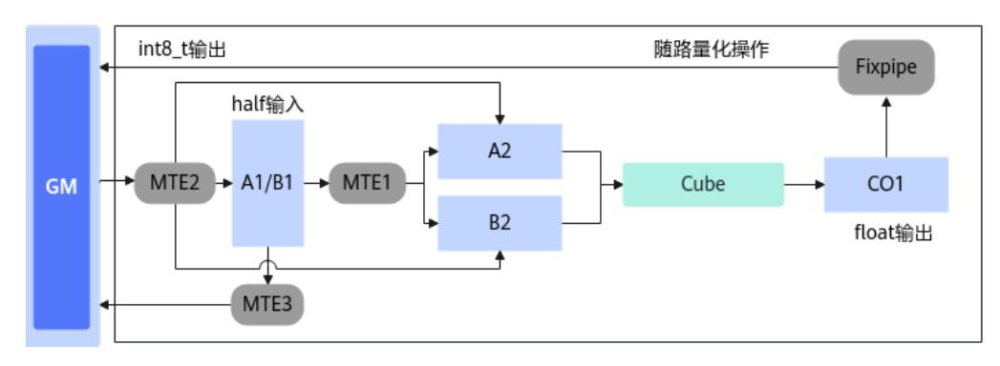

● Matmul反量化场景:Matmul计算时左矩阵A、右矩阵B为int8\_t或int4b\_t数据类 型,输出C矩阵为half数据类型,或者左矩阵A、右矩阵B为int8\_t数据类型,输出 C矩阵为int8\_t数据类型。该场景下,C矩阵的数据从CO1搬出到Global Memory 时,会执行反量化操作,将最终结果反量化为对应的half类型或int8\_t类型,如下 图所示。

图 **6-31** Matmul 反量化场景示意图

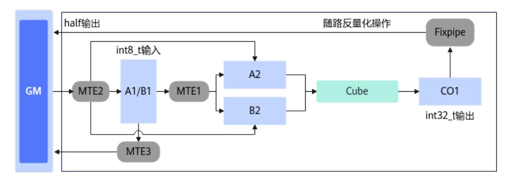

<span id="page-151-0"></span>Matmul量化/反量化包含两种模式:同一系数的量化/反量化模式、向量的量化/反量化 模式,开发者在算子Tiling侧调用**[SetDequantType](#page-1573-0)**接口设置量化或反量化模式,这两 种模式的具体区别为:

- 同一系数的量化/反量化模式(PER\_TENSOR模式):整个C矩阵对应一个量化参 数,量化参数的shape为[1]。开发者在算子Kernel侧调用接口**[SetQuantScalar](#page-1518-0)**设 置量化参数。
- 向量的量化/反量化模式(PER\_CHANNEL模式):C矩阵的shape为[m, n],每个 channel维度即C矩阵的每一列,对应一个量化参数,量化参数的shape为[n]。开 发者在算子Kernel侧调用接口**[SetQuantVector](#page-1519-0)**设置量化参数。

表 **6-6** 量化/反量化模式对应的接口配置

| 模式     | Tiling侧接口                        | Kernel侧接口              |
|--------|----------------------------------|------------------------|
| 同一系数的量 | SetDequantType(DequantType::SCAL | SetQuantScalar(gmScala |
| 化/反量化  | AR)                              | r)                     |
| 向量的量化/ | SetDequantType(DequantType::TENS | SetQuantVector(gmTens  |
| 反量化    | OR)                              | or)                    |

## 使用场景

需要对矩阵计算结果进行量化/反量化操作的场景,当前该场景下,Matmul输入输出 矩阵支持的数据类型如下表所示。

表 **6-7** Matmul 量化/反量化支持的数据类型

| A矩阵        | B矩阵        | C矩阵    | 支持平台                                                            |
|------------|------------|--------|-----------------------------------------------------------------|
| half       | half       | int8_t | ●<br>Atlas A3 训练系列产品/Atlas<br>A3 推理系列产品                         |
|            |            |        | ●<br>Atlas A2 训练系列产品/Atlas<br>800I A2 推理产品/A200I A2<br>Box 异构组件 |
| bfloat16_t | bfloat16_t | int8_t | ●<br>Atlas A3 训练系列产品/Atlas<br>A3 推理系列产品                         |
|            |            |        | ●<br>Atlas A2 训练系列产品/Atlas<br>800I A2 推理产品/A200I A2<br>Box 异构组件 |
| int8_t     | int8_t     | half   | ●<br>Atlas A3 训练系列产品/Atlas<br>A3 推理系列产品                         |
|            |            |        | ●<br>Atlas A2 训练系列产品/Atlas<br>800I A2 推理产品/A200I A2<br>Box 异构组件 |

| A矩阵     | B矩阵     | C矩阵    | 支持平台                                                            |
|---------|---------|--------|-----------------------------------------------------------------|
| int4b_t | int4b_t | half   | ●<br>Atlas A3 训练系列产品/Atlas<br>A3 推理系列产品                         |
|         |         |        | ●<br>Atlas A2 训练系列产品/Atlas<br>800I A2 推理产品/A200I A2<br>Box 异构组件 |
| int8_t  | int8_t  | int8_t | ●<br>Atlas A3 训练系列产品/Atlas<br>A3 推理系列产品                         |
|         |         |        | ●<br>Atlas A2 训练系列产品/Atlas<br>800I A2 推理产品/A200I A2<br>Box 异构组件 |

- **[SetQuantScalar](#page-1518-0)**和**[SetQuantVector](#page-1519-0)**接口必须在**[Iterate](#page-1492-0)**或者**[IterateAll](#page-1499-0)**接口前调 用。
- 在Kernel侧与Tiling侧设置的量化/反量化模式需要保持一致:
  - Kernel侧调用SetQuantScalar接口设置同一系数的量化/反量化模式,对应 Tiling侧调用SetDequantType接口配置模式为DequantType::SCALAR。
  - Kernel侧调用SetQuantVector接口设置向量的量化/反量化模式,对应Tiling 侧调用SetDequantType接口配置模式为DequantType::TENSOR。

## 调用示例

● Tiling实现

调用**[SetDequantType](#page-1573-0)**接口设置量化或反量化模式,其他实现内容与基础场景相 同。

```
auto ascendcPlatform = platform_ascendc::PlatformAscendC(context->GetPlatformInfo());
matmul_tiling::MatmulApiTiling tiling(ascendcPlatform); 
tiling.SetAType(matmul_tiling::TPosition::GM, matmul_tiling::CubeFormat::ND, 
matmul_tiling::DataType::DT_INT8);
tiling.SetBType(matmul_tiling::TPosition::GM, matmul_tiling::CubeFormat::ND, 
matmul_tiling::DataType::DT_INT8); 
tiling.SetCType(matmul_tiling::TPosition::GM, matmul_tiling::CubeFormat::ND, 
matmul_tiling::DataType::DT_INT32); 
tiling.SetBiasType(matmul_tiling::TPosition::GM, matmul_tiling::CubeFormat::ND, 
matmul_tiling::DataType::DT_INT32); 
tiling.SetShape(M, N, K); 
tiling.SetOrgShape(M, N, K); 
tiling.EnableBias(true);
tiling.SetDequantType(DequantType::SCALAR); // 设置同一系数的量化/反量化模式
// tiling.SetDequantType(DequantType::TENSOR); // 设置向量的量化/反量化模式
... // 执行其他配置
```

● Kernel实现

根据具体量化模式场景,调用**[SetQuantScalar](#page-1518-0)**或**[SetQuantVector](#page-1519-0)**接口设置量化 参数。其他实现内容与基础场景相同。

– 同一系数的量化/反量化模式 REGIST\_MATMUL\_OBJ(&pipe, GetSysWorkSpacePtr(), mm, &tiling); float tmp = 0.1; // 输出gm时会乘以0.1 uint64\_t ans = static\_cast<uint64\_t>(\*reinterpret\_cast<int32\_t\*>(&tmp)); // 浮点值量化系数转换为 uint64\_t类型进行设置 mm.SetQuantScalar(ans);

```
mm.SetTensorA(gm_a);
     mm.SetTensorB(gm_b);
     mm.SetBias(gm_bias);
     mm.IterateAll(gm_c);
– 向量的量化/反量化模式
     GlobalTensor gmQuant;
     ...
     REGIST_MATMUL_OBJ(&pipe, GetSysWorkSpacePtr(), mm, &tiling);
     mm.SetQuantVector(gmQuant);
     mm.SetTensorA(gm_a);
     mm.SetTensorB(gm_b);
     mm.SetBias(gm_bias);
     mm.IterateAll(gm_c);
```

## **6.3.3.6** 矩阵乘输出的 **Channel** 拆分

## 功能介绍

矩阵乘输出的Channel拆分,又称ChannelSplit。指当Matmul计算结果C矩阵的格式为 **[NZ](#page-135-0)**时,C矩阵采用分形存储,关于NZ格式的详细内容请参[考数据格式](#page-135-0)。当C矩阵的物 理排布格式为NZ、数据类型为float时,默认情况下,每个分形内部包含16\*16个元 素,即分形的大小为16\*16。ChannelSplit的功能为将此场景下C矩阵的每个16\*16的分 形切分为16\*8的分形,使得C矩阵按照16\*8的分形进行存储。

由于1个float类型数据的大小为4字节,16\*8的分形在内轴满足32字节对齐,内轴上的 数据量与一条NPU矢量计算指令处理的数据单元一致,这便于后续的其它计算。 ChannelSplit功能默认不启用,用户需通过设置**[MatmulConfig](#page-1426-0)**中的 isEnableChannelSplit参数为true来开启此功能。

### 图 **6-32** ChannelSplit 功能示意图

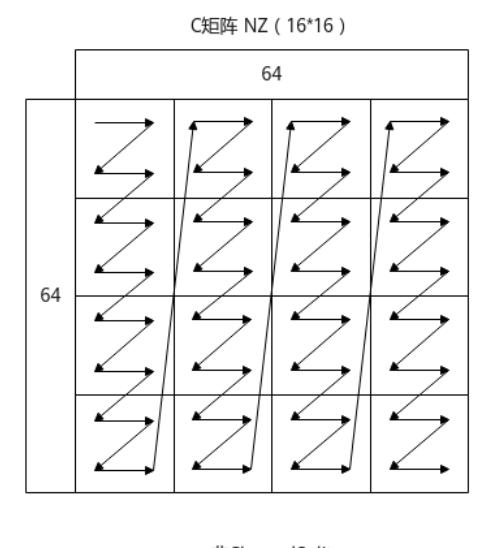

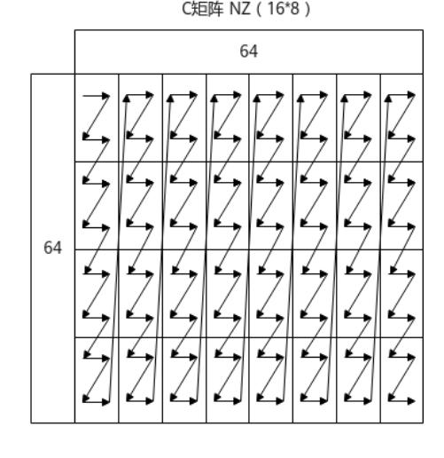

使用场景

对于NZ格式、float类型的C矩阵,需要按16\*8的分形存储时,使用该功能。

## 约束说明

开启ChannelSplit功能需满足:

- <span id="page-154-0"></span>● C矩阵的数据排布格式为CubeFormat::NZ。
- C矩阵的数据类型为float。
- C矩阵的内存逻辑位置为Global Memory。

```
// 指定获取和修改的MatmulConfig模板
constexpr static MatmulConfigMode configMode = MatmulConfigMode::CONFIG_NORM;
// 修改模板参数isEnableChannelSplit=true,开启该MatmulConfig模板的ChannelSplit功能
constexpr static MatmulFuncParams funcParamsChannelSplit{
 false, false, false, false, 0, IterateOrder::ORDER_M, ScheduleType::INNER_PRODUCT, true, false, false, 
false, true/*isEnableChannelSplit*/
};
constexpr static MatmulConfig MM_CFG = GetMMConfig<configMode>(funcParamsChannelSplit);
Matmul<A_TYPE, B_TYPE, C_TYPE, BIAS_TYPE, MM_CFG> mm;
// 常规Matmul计算,最后输出分形为16*8
REGIST_MATMUL_OBJ(&pipe, GetSysWorkSpacePtr(), mm);
mm.SetTensorA(gm_a);
mm.SetTensorB(gm_b);
mm.SetBias(gm_bias);
mm.IterateAll(gm_c);
```

## **6.3.3.7** 矩阵向量乘

## 功能介绍

矩阵向量乘(General Matrix-Vector multiplication),即GEMV,是指Matmul计算 中M=1,形状为(1, K)的左矩阵A与形状为(K, N)的右矩阵B进行矩阵乘运算的场景。 Matmul支持在Tiling侧与Kernel侧通过配置A矩阵的数据格式为**[VECTOR](#page-314-0)**来开启GEMV 模式,从而高效处理M=1的计算场景。若在M=1时未开启GEMV模式,Matmul计算则 将M方向作为非对齐场景进行处理。GEMV模式相较于非对齐处理方式,搬运数据量更 少,性能更好。

以M=1,K=256,N=32,左右矩阵数据类型为half的Matmul为具体示例,说明GEMV 模式的Matmul API内部处理过程。

### ● GEMV模式

将A矩阵从A1搬运到A2时,1\*256的向量被当作16\*16的矩阵进行处理,调用 **[LoadData](#page-1092-0)**接口一次完成16\*16分形大小的矩阵搬运。B矩阵的搬运以及矩阵乘计 算跟基础场景相同,如下图所示。

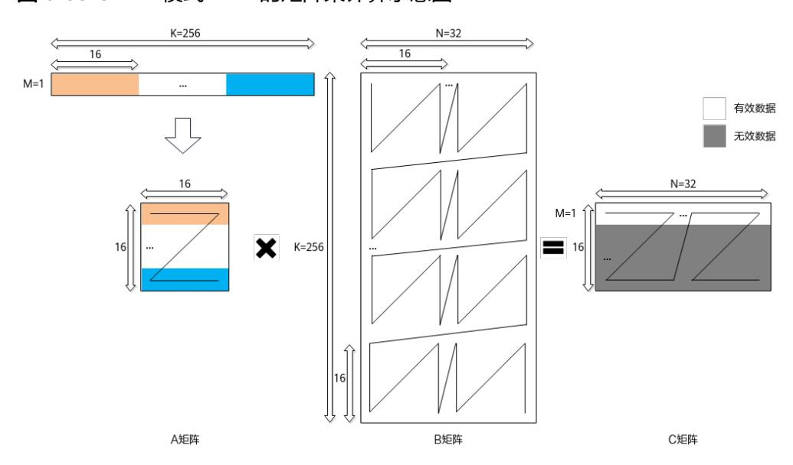

图 **6-33** GEMV 模式 M=1 的矩阵乘计算示意图

### ● 非GEMV模式

将A矩阵从A1搬运到A2时,1\*256的向量被当作非对齐矩阵数据进行处理,将M方 向对齐到32字节后进行搬运。调用**[LoadData](#page-1092-0)**接口每次搬运16\*16分形大小的矩 阵,一共搬运K/16=16次,导致搬运数据量增加,性能相较于GEMV模式差,如下 图所示。

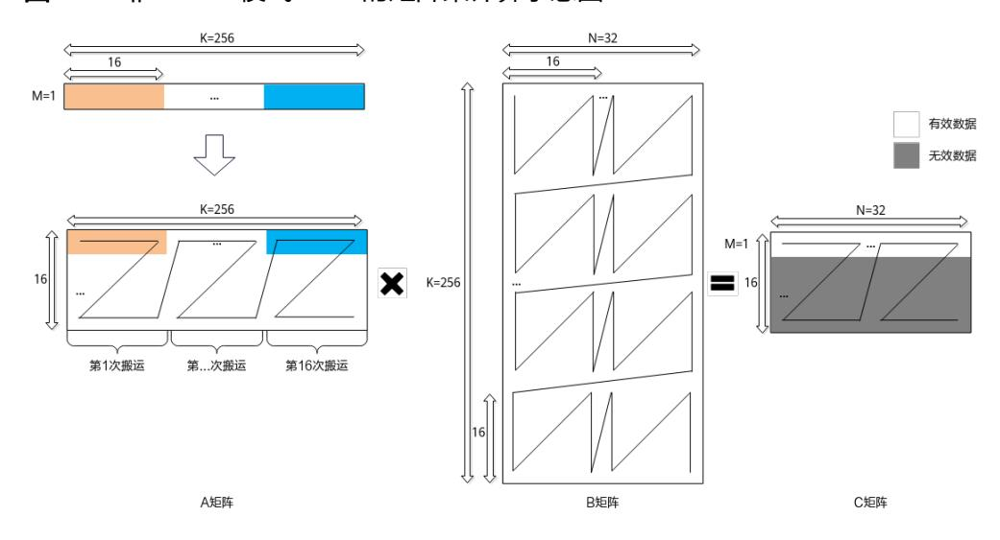

图 **6-34** 非 GEMV 模式 M=1 的矩阵乘计算示意图

## 使用场景

形状为(1, K)的A矩阵(M=1,K>1)做矩阵乘计算,即输入A矩阵的数据是向量数据。

## 约束说明

- 在Matmul计算中,若要开启GEMV模式,A矩阵的原始输入形状M必须等于1。
- GEMV场景下,左矩阵A不支持转置。

### <span id="page-156-0"></span>● Tiling实现

调用**[SetAType](#page-1549-0)**接口,设置A矩阵的数据格式为CubeFormat::VECTOR,其它Tiling 实现[与基础场景](#page-138-0)相同。

auto ascendcPlatform = platform\_ascendc::PlatformAscendC(context->GetPlatformInfo()); matmul\_tiling::MatmulApiTiling tiling(ascendcPlatform); // 调用设置A矩阵的格式为CubeFormat::VECTOR tiling.SetAType(matmul\_tiling::TPosition::GM, matmul\_tiling::CubeFormat::VECTOR, matmul\_tiling::DataType::DT\_FLOAT16); tiling.SetBType(matmul\_tiling::TPosition::GM, matmul\_tiling::CubeFormat::ND, matmul\_tiling::DataType::DT\_FLOAT16); tiling.SetCType(matmul\_tiling::TPosition::GM, matmul\_tiling::CubeFormat::ND, matmul\_tiling::DataType::DT\_FLOAT); tiling.SetBiasType(AscendC::TPosition::GM, matmul\_tiling::CubeFormat::ND, matmul\_tiling::DataType::DT\_FLOAT); ... // 其他实现内容 optiling::TCubeTiling tilingData; int ret = tiling.GetTiling(tilingData);

### ● Kernel实现

相较[于基础场景](#page-139-0),GEMV场景在创建Matmul对象时,设置模板参数A\_Type的数据 格式为CubeFormat::VECTOR。

#include "lib/matmul\_intf.h"

using A\_TYPE = AscendC::MatmulType<AscendC::TPosition::GM, CubeFormat::VECTOR, half>; using B\_TYPE = AscendC::MatmulType<AscendC::TPosition::GM, CubeFormat::ND, half>; using C\_TYPE = AscendC::MatmulType<AscendC::TPosition::GM, CubeFormat::ND, float>; using BIAS\_TYPE = AscendC::MatmulType<AscendC::TPosition::GM, CubeFormat::ND, float>; AscendC::Matmul<A\_TYPE, B\_TYPE, C\_TYPE, BIAS\_TYPE> mm;

## **6.3.3.8 4:2** 稀疏矩阵乘

## 功能介绍

4:2稀疏矩阵乘,又称Sparse Matmul。该场景下输入的原始左矩阵A、右矩阵B为稀疏 矩阵,稀疏矩阵B中每4个元素中至少有2个为零元素;在进行Matmul计算前,用户需 要自行对B矩阵进行4:2稠密化,即基于原始稀疏矩阵B在每4个元素中过滤掉2个零元 素,使B矩阵稠密化为稠密矩阵;Sparse Matmul场景调用Matmul API完成A矩阵与 4:2稠密化后的B矩阵的矩阵乘计算。Sparse Matmul可以跳过稀疏矩阵B中的零元素, 仅对非零元素进行数据搬运存储和计算,从而减少矩阵乘计算时的内存占用和计算 量,提升性能。

## 实现流程

### 步骤**1** 数据预处理

在计算前的数据准备阶段,用户自行对原始为稀疏矩阵的B矩阵完成稠密化,稠密过程 请参[考稠密算法说明](#page-1156-0)。稠密化过程结束后,得到4:2稠密化后的右矩阵B和索引矩阵 index,稠密化后的右矩阵B和索引矩阵index将作为Sparse Matmul场景的计算输入。

<span id="page-157-0"></span>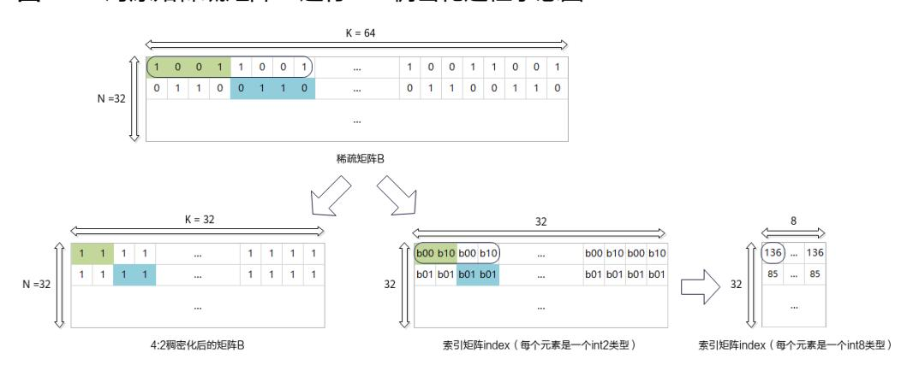

### 图 **6-35** 对原始稀疏矩阵 B 进行 4:2 稠密化过程示意图

稠密化过程对于稀疏矩阵B的每4个元素,在索引矩阵index中生成2个2位索引,每个索 引分别指向对应非零元素的相对位置,具体规则可参考[稠密算法说明。](#page-1156-0)稠密化过程生 成的索引矩阵的数据类型为int2,索引矩阵在加载入Matmul前,需要拼成int8的数据 类型。索引矩阵在一个int8的地址中的排布是逆序排布的,例如:索引矩阵1 2 0 1 0 2 1 0,在地址中的排布为1 0 2 1 0 1 2 0,其中1 0 2 1(对应索引矩阵前四位1 2 0 1) 为一个int8,0 1 2 0(对应索引矩阵后四位0 2 1 0)为一个int8。

### 步骤**2** 使能Sparse Matmul场景

```
在Host侧,获取Tiling前需要通过SetSparse接口设置使能Sparse Matmul场景。
```

auto ascendcPlatform = platform\_ascendc::PlatformAscendC(context->GetPlatformInfo());

matmul\_tiling::MatmulApiTiling tiling(ascendcPlatform);

tiling.SetAType(matmul\_tiling::TPosition::GM, matmul\_tiling::CubeFormat::ND,

matmul\_tiling::DataType::DT\_INT8);

tiling.SetBType(matmul\_tiling::TPosition::GM, matmul\_tiling::CubeFormat::ND,

matmul\_tiling::DataType::DT\_INT8);

tiling.SetCType(matmul\_tiling::TPosition::GM, matmul\_tiling::CubeFormat::ND,

matmul\_tiling::DataType::DT\_INT32);

tiling.SetBiasType(matmul\_tiling::TPosition::GM, matmul\_tiling::CubeFormat::ND,

matmul\_tiling::DataType::DT\_INT32);

// 设置使能Sparse Matmul场景

tiling.SetSparse(true);

... // 其他实现内容

optiling::TCubeTiling tilingData;

int ret = tiling.GetTiling(tilingData);

### 步骤**3** 创建Matmul对象

在Kernel侧创建Matmul对象时,通过**[MatmulType](#page-1412-0)**定义A、C、Bias的参数类型信息, 包括:内存逻辑位置、数据格式、数据类型。通过**[SparseMatmulType](#page-158-0)**类型定义B矩 阵的参数类型,包括:B矩阵的内存逻辑位置、索引矩阵的内存逻辑位置、数据格式、 数据类型等。

#include "lib/matmul\_intf.h"

using A\_TYPE = AscendC::MatmulType<AscendC::TPosition::GM, CubeFormat::ND, ATYPE, false>; // 使用SparseMatmulType定义B矩阵的参数类型信息

using B\_TYPE = AscendC::SparseMatmulType<AscendC::TPosition::GM, AscendC::TPosition::GM, CubeFormat::ND, BType, true>;

using C\_TYPE = AscendC::MatmulType<AscendC::TPosition::GM, CubeFormat::ND, CType>; using BIAS\_TYPE = AscendC::MatmulType<AscendC::TPosition::GM, CubeFormat::ND, BiasType>; AscendC::Matmul<A\_TYPE, B\_TYPE, C\_TYPE, BIAS\_TYPE, CFG\_MDL> mm;

### 步骤**4** 设置索引矩阵

通过**[SetSparseIndex](#page-1538-0)**接口传入稠密化过程中生成的索引矩阵。

```
mm.SetTensorA(gm_a); // 设置左矩阵A
mm.SetTensorB(gm_b); // 设置右矩阵B
mm.SetSparseIndex(gm_index); // 传入稠密化过程中生成的索引矩阵
mm.SetBias(gm_bias); // 设置Bias
```

### 步骤**5** 完成矩阵乘操作

在Kernel侧,基于[步骤](#page-157-0)**4**加载的索引矩阵,完成矩阵乘操作。Matmul API内部完成对A 矩阵的稠密化,即根据索引矩阵从A矩阵的每4个元素中,选择2个对应位置元素参与计 算。

```
// 调用Iterate和GetTensorC或IterateAll接口完成矩阵乘计算
while (mm.Iterate()) { 
 mm.GetTensorC(gm_c); 
}
// mm.IterateAll(gm_c);
mm.End();
```

### **----**结束

## 参数说明

表 **6-8** SparseMatmulType 类型参数说明

| 参数           | 说明                                                                                                                         |
|--------------|----------------------------------------------------------------------------------------------------------------------------|
| POSITION     | 内存逻辑位置。                                                                                                                    |
|              | B矩阵仅支持设置为TPosition::GM。                                                                                                    |
| INDEX_POSITI | 索引矩阵内存逻辑位置。                                                                                                                |
| ON           | 仅支持设置为TPosition::GM。                                                                                                       |
| CubeFormat   | 数据的物理排布格式,详细介绍请参考数据格式。                                                                                                     |
|              | B矩阵支持设置为CubeFormat::ND,CubeFormat::NZ。                                                                                     |
| TYPE         | B矩阵仅支持设置为int8_t数据类型。                                                                                                       |
| ISTRANS      | 是否开启使能矩阵转置的功能。                                                                                                             |
|              | 当前只支持取值为true,表示开启使能矩阵转置的功能。                                                                                                |
| LAYOUT       | 表征数据的排布。Sparse Matmul场景仅支持取值为                                                                                              |
|              | LAYOUT::NONE。                                                                                                              |
|              | NONE:默认值,表示不使用BatchMatmul。                                                                                                 |
| IBSHARE      | 是否使能IBShare(IntraBlock Share)。IBShare的功能是能够复<br>用L1 Buffer上相同的A矩阵或B矩阵数据。当A矩阵和B矩阵同时使<br>能IBShare时,表示L1 Buffer上的A矩阵和B矩阵同时复用。 |
|              | Sparse Matmul场景当前仅支持该参数取值为false,表示不使能<br>IBShare。                                                                          |

## 使用场景

左矩阵A为稀疏矩阵、右矩阵B为4:2稠密化后的矩阵的Matmul计算场景。

- <span id="page-159-0"></span>● 该场景仅支持**[MDL](#page-1427-0)**模板下的纯Cube模式(只有矩阵计算)。
- 通过**[SetSparseIndex](#page-1538-0)**接口传入的索引矩阵只支持int8数据类型和**NZ**[数据排布格](#page-303-0) [式](#page-303-0)。
- 原始稀疏矩阵B中每4个元素中应保证最多2个非零元素(即最少2个零元素),如 果存在3个或更多非零元素,则仅使用前2个非零元素。
- M、K、N中的任意一个值不能为0。

## 调用示例

Sparse Matmul场景的完整样例请参考**[Sparse Matmul](https://gitee.com/ascend/ascendc-api-adv/tree/v1.6-8.2.RC1/examples/matrix/matmul_sparse)**场景的算子样例。

## **6.3.3.9 TSCM** 输入的矩阵乘

## 功能介绍

**[TSCM](#page-1057-0)**表示L1 Buffer空间对应的逻辑内存,L1 Buffer相关内容见**10.3.3** [存储单元](#page-320-0),开 发者可以自行管理TSCM以高效利用硬件资源。比如,开发者可缓存一份TSCM数据, 在不同使用场景中灵活配置为Matmul操作的A矩阵、B矩阵或Bias偏置矩阵,实现内存 复用与计算效率优化。在TSCM输入场景,用户管理整块TSCM内存空间,Matmul直 接使用传入的TSCM内存地址,不进行Global Memory到TSCM的数据搬入。

## 使用场景

用户需要自定义数据搬入到TSCM及自定义管理的场景,即需要自定义实现数据搬入功 能,如非连续搬入或对搬入数据进行预处理等。用户通过自定义管理TSCM可灵活配置 MTE2流水,实现跨Matmul对象的全局**[DoubleBuffer](#page-329-0)**,MTE2相关内容见**[10.3.1](#page-315-0)** 基本 [架构。](#page-315-0)

## 约束说明

设置为TSCM输入的矩阵必须在TSCM中全载,全载即全部的矩阵数据同时搬入及保持 在TSCM中。

## 调用示例

完整的算子样例请参考自定义**TSCM**[输入的算子样例](https://gitee.com/ascend/ascendc-api-adv/blob/v1.6-8.2.RC1/examples/matrix/matmul_tscm)。

```
TQue<TPosition::A1, 1> scm; // 队列逻辑位置A1,队列深度为1
pipe->InitBuffer(scm, 1, tiling.M * tiling.Ka * sizeof(A_T)); 
// A_TYPE的TPosition为TSCM, B_TYPE的TPosition为GM
Matmul<A_TYPE, B_TYPE, C_TYPE, BIAS_TYPE> mm1;
REGIST_MATMUL_OBJ(&pipe, GetSysWorkSpacePtr(), mm1);
mm1.Init(&tiling);
// 自定义A矩阵GM到TSCM的搬运
auto scmTensor = scm.AllocTensor<A_T>();
DataCopy(scmTensor, gm_a, tiling.M * tiling.Ka);
scm.EnQue(scmTensor);
LocalTensor<A_T> scmLocal = scm.DeQue<A_T>();
// A矩阵设置为TSCM输入,B矩阵为GM输入
mm1.SetTensorA(scmLocal);
mm1.SetTensorB(gm_b);
mm1.SetBias(gm_bias);
mm1.IterateAll(gm_c);
scm.FreeTensor(scmLocal);
```

## <span id="page-160-0"></span>**6.3.3.10** 矩阵乘输出的 **N** 方向对齐

## 功能介绍

矩阵乘输出的N方向对齐,即矩阵乘结果C矩阵按ND\_ALIGN格式输出。在Matmul矩 阵乘法中,常用的矩阵数据格式有ND、NZ,相关介绍可参[考数据格式](#page-135-0)章节。 ND\_ALIGN是矩阵的另一种数据格式,该格式一般用于N方向非32字节对齐的矩阵乘计 算中,配置结果C矩阵为ND\_ALIGN格式后,将按照N方向32字节对齐的补齐规则输出 C矩阵,详细内容请见**[ND\\_ALIGN](#page-313-0)**。

以M=16,K=16,N=14,A、B矩阵数据类型为half的Matmul为具体示例,说明 ND\_ALIGN输出功能。当配置C矩阵为ND格式并输出到Global Memory时,按照原始 N方向大小非32字节对齐输出如图**6-36**所示。当配置C矩阵为ND格式时,按照N方向 32字节对齐输出如图**[6-37](#page-161-0)**所示,C矩阵的N方向最后两列由下一行的实际数据进行填充 补齐,以实现N方向对齐到32字节并输出。当配置C矩阵为ND\_ALIGN格式时, Matmul API会在C矩阵的N方向上通过添加无效数据来填充最后两列,以确保N方向对 齐至32字节并输出,如图**[6-38](#page-162-0)**所示。

### 图 **6-36** ND 格式 C 矩阵 N 方向非 32 字节对齐示意图

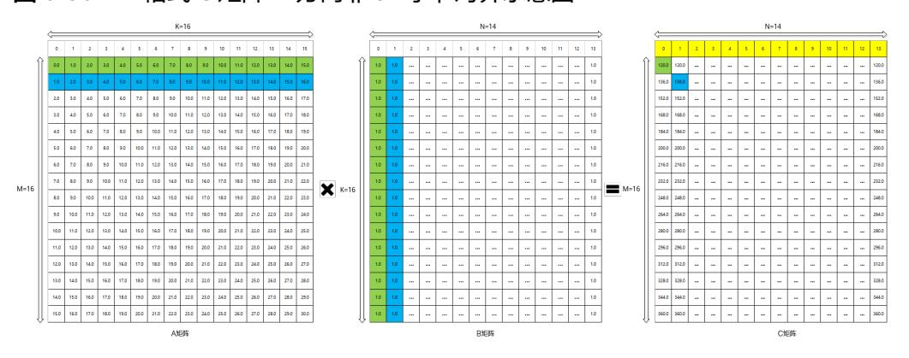

### <span id="page-161-0"></span>图 **6-37** ND 格式 C 矩阵 N 方向 32 字节对齐示意图

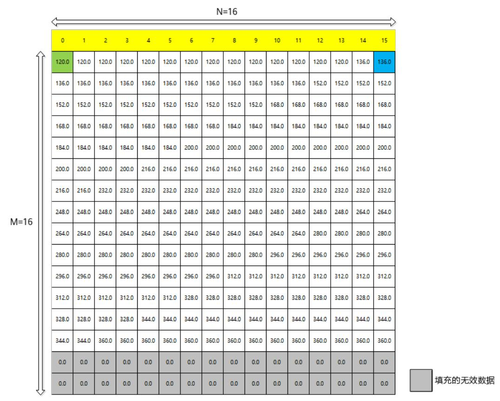

### <span id="page-162-0"></span>图 **6-38** ND\_ALIGN 格式 C 矩阵 N 方向 32 字节对齐示意图

## 使用场景

Matmul计算中N方向非32字节对齐,输出C矩阵的N方向要求32字节对齐的场景。

## 约束说明

若配置C矩阵为ND\_ALIGN格式输出,则为C矩阵申请的Buffer空间为N向上32字节对齐 后的空间大小。

## 调用示例

● Tiling实现

调用**[SetCType](#page-1551-0)**接口,设置C矩阵的数据格式为CubeFormat::ND\_ALIGN,其它 Tiling实现与[基础场景相](#page-138-0)同。

auto ascendcPlatform = platform\_ascendc::PlatformAscendC(context->GetPlatformInfo()); matmul\_tiling::MatmulApiTiling tiling(ascendcPlatform); tiling.SetAType(matmul\_tiling::TPosition::GM, matmul\_tiling::CubeFormat::ND, matmul\_tiling::DataType::DT\_FLOAT16); tiling.SetBType(matmul\_tiling::TPosition::GM, matmul\_tiling::CubeFormat::ND, matmul\_tiling::DataType::DT\_FLOAT16); // 设置C矩阵,buffer位置为GM,数据格式为ND\_ALIGN tiling.SetCType(matmul\_tiling::TPosition::GM, matmul\_tiling::CubeFormat::ND\_ALIGN, matmul\_tiling::DataType::DT\_FLOAT); tiling.SetBiasType(AscendC::TPosition::GM, matmul\_tiling::CubeFormat::ND, matmul\_tiling::DataType::DT\_FLOAT); ... // 其他实现内容

optiling::TCubeTiling tilingData; int ret = tiling.GetTiling(tilingData);

### <span id="page-163-0"></span>● Kernel实现

相较[于基础场景](#page-139-0),ND\_ALIGN输出功能要求在创建Matmul对象时,设置模板参数 cType的数据格式为CubeFormat::ND\_ALIGN。

#include "lib/matmul\_intf.h"

typedef AscendC::MatmulType<AscendC::TPosition::GM, CubeFormat::ND, half> aType; typedef AscendC::MatmulType<AscendC::TPosition::GM, CubeFormat::ND, half> bType; // 设置模板参数cTyped的数据格式为ND\_ALIGN typedef AscendC::MatmulType<AscendC::TPosition::GM, CubeFormat::ND\_ALIGN, float> cType; typedef AscendC::MatmulType<AscendC::TPosition::GM, CubeFormat::ND, float> biasType; AscendC::Matmul<aType, bType, cType, biasType> mm;

## **6.3.3.11** 单次矩阵乘局部输出

## 功能介绍

单次矩阵乘局部输出,又称Partial Output。[如基础知识](#page-137-0)中所述,一次**[Iterate](#page-1492-0)**计算过程 中,会按K方向进行一次或多次基本块计算,其中的一次基本块计算为baseM\*baseK和 baseK\*baseN大小的输入数据进行计算得到baseM\*baseN大小的结果;每次基本块计 算的结果进行累加后,便得到baseM\*singleCoreK和singleCoreK\*baseN大小的输入数 据计算得到的结果baseM\*baseN,并将其作为一次Iterate的最终结果输出。

开启Partial Output功能后,调用Iterate接口不会进行K轴累加,只进行单次基本块计 算。用户可以通过GetTensorC接口获取对应的单片数据,最后自行进行K轴上的累 加。

### 图 **6-39** 未开启 Partial Output 功能计算示意图

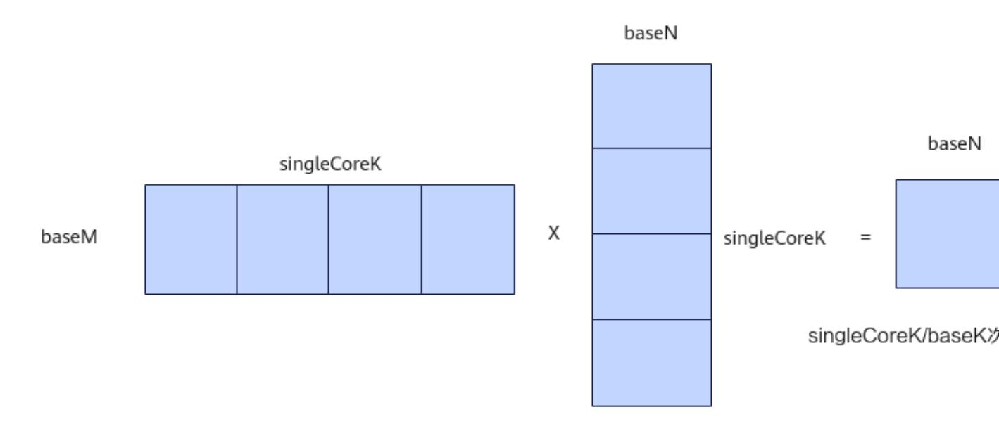

### 图 **6-40** 开启 Partial Output 功能计算示意图

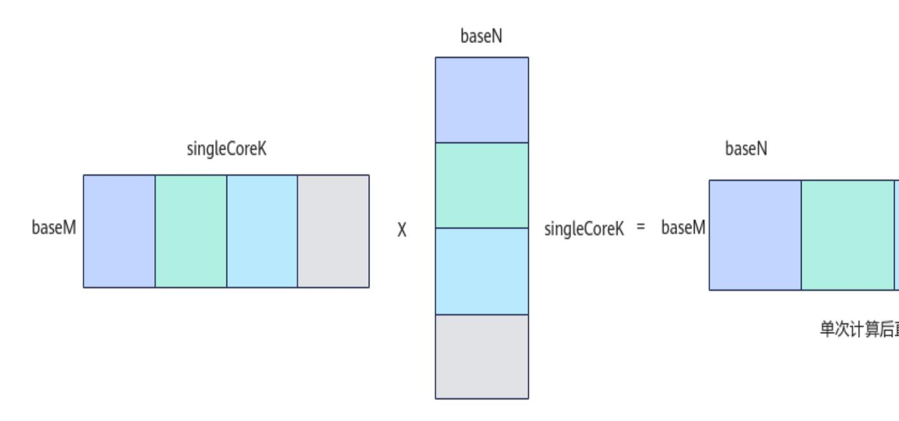

## 使用场景

矩阵乘计算结果不需要累加,只需要输出baseM\*baseK和baseK\*baseN的计算结果 baseM\*baseN。例如需要先获取单次基本块计算的数据进行反量化,再累加得到最终 结果。

## 约束说明

- 该功能仅支持**[MDL](#page-1425-0)**模板。
- 获取矩阵乘计算结果时,仅支持调用Iterate和GetTensorC接口的连续写模式,不 支持非连续写模式以及IterateAll接口获取计算结果,连续写模式的介绍请参考 **[GetTensorC](#page-1494-0)**。
- 该功能不支持带有Bias矩阵的Matmul计算,即不支持输入Bias矩阵。

## 调用示例

### 完整的算子样例请参考开启**Partial Output**[功能的算子样例。](https://gitee.com/ascend/ascendc-api-adv/blob/v1.6-8.2.RC1/examples/matrix/matmul_partial_output)

```
// 配置MDL模板,使能Partial Output
constexpr static MatmulConfigMode configMode = MatmulConfigMode::CONFIG_MDL;
constexpr static MatmulFuncParams funcParams = {
 false, false, false, false, 0, IterateOrder::UNDEF, ScheduleType::INNER_PRODUCT, true, true,
 true /* isPartialOutput */
};
constexpr static MatmulConfig CFG_PARTIAL = GetMMConfig<configMode>(funcParams);
Matmul<A_TYPE, B_TYPE, C_TYPE, BIAS_TYPE, CFG_PARTIAL> mm;
REGIST_MATMUL_OBJ(&pipe, GetSysWorkSpacePtr(), mm);
mm.Init(&tiling);
mm.SetTensorA(gmA, isTransposeA);
mm.SetTensorB(gmB, isTransposeB);
while (mm.Iterate()) {
 mm.GetTensorC(tmpGmC[dstOffset], false, true);
 dstOffset += baseM * baseN;
 // 其他操作
}
```

## <span id="page-165-0"></span>**6.3.3.12 AIC** 和 **AIV** 独立运行机制

## 功能介绍

AIC和AIV独立运行机制,又称双主模式。在[分离架构下](#page-316-0),区别于MIX模式(包含矩阵 计算和矢量计算)通过消息机制驱动AIC运行,双主模式为AIC和AIV独立运行代码,不 依赖消息驱动,使能双主模式能够提高Matmul计算性能。默认情况下,双主模式不使 能,需要通过**[MatmulConfig](#page-1426-0)**中的enableMixDualMaster参数开启。

## 使用场景

算子中的矩阵计算和矢量计算相关代码独立运行,不依赖消息驱动时,可以开启双主 模式,以提高Matmul计算性能。

## 约束说明

- 该功能仅支持**[Norm](#page-1425-0)**模板和**[MDL](#page-1425-0)**模板。
- 算子核函数的类型为MIX,同时AIC核数 : AIV核数为1:1。
- 算子核函数的类型为MIX,同时AIC核数 : AIV核数为1:2,且A矩阵和B矩阵同时使 能**[IBSHARE](#page-1412-0)**参数。
- 同一算子中所有Matmul对象的该参数取值必须保持一致。
- A、B、Bias矩阵只支持从Global Memory输入。
- 获取矩阵计算结果只支持调用**[IterateAll](#page-1499-0)**接口输出到**[GlobalTensor](#page-447-0)**,即计算结果 放置于Global Memory的地址,不能调用**[GetTensorC](#page-1494-0)**等接口获取结果。

## 调用示例

完整的算子样例请参考[使能双主模式的算子样例](https://gitee.com/ascend/ascendc-api-adv/tree/v1.6-8.2.RC1/examples/matrix/matmul_mixdualmaster)。

```
// 修改模板参数enableMixDualMaster=true,Norm模板开启双主模式,MDL模板使用GetMDLConfig接口获取
模板参数。
constexpr static MatmulConfig MM_CFG = GetNormalConfig(false, false, false, 
BatchMode::BATCH_LESS_THAN_L1, true, IterateOrder::ORDER_M, ScheduleType::OUTER_PRODUCT, false, 
true/*enableMixDualMaster*/);
Matmul<A_TYPE, B_TYPE, C_TYPE, BIAS_TYPE, MM_CFG> mm;
// 常规Matmul计算
REGIST_MATMUL_OBJ(&pipe, GetSysWorkSpacePtr(), mm);
mm.SetTensorA(gm_a);
mm.SetTensorB(gm_b);
mm.SetBias(gm_bias);
mm.IterateAll(gm_c);
```

## **6.3.3.13 Batch Matmul** 基础功能

## 功能介绍

Batch Matmul是指批量处理Matmul计算的场景。该场景对外提供了**[IterateBatch](#page-1503-0)**的 调用接口,调用一次IterateBatch,可以计算出多个singleCoreM \* singleCoreN大小的 C矩阵。

Matmul单次计算的过程需要搬入和搬出数据,当进行多次Matmul计算且单次 Matmul计算的输入shape较小时,搬运开销在整体耗时中占比较大。通过IterateBatch 接口批量处理Matmul,可以有效提升带宽利用率。

Batch Matmul当前支持4种Layout类型:**[BSNGD](#page-1504-0)**、**[SBNGD](#page-1504-0)**、**[BNGS1S2](#page-1505-0)**、**[NORMAL](#page-1503-0)** (BMNK的数据排布格式),相关数据排布格式请参考**[IterateBatch](#page-1503-0)**。

下图为NORMAL数据排布格式的Batch Matmul计算。整个Matmul计算一共包含4个 矩阵乘操作:mat\_a1\*mat\_b1、mat\_a2\*mat\_b2、mat\_a3\*mat\_b3、 mat\_a4\*mat\_b4,需要单核上计算四个singleCoreM \*singleCoreN。在该场景下,如 果shape较小,可以将其视为Batch Matmul场景进行批量处理,以提升性能。一次 IterateBatch可同时计算出mat\_c1 = mat\_a1 \* mat\_b1、mat\_c2 = mat\_a2 \* mat\_b2、mat\_c3 = mat\_a3 \* mat\_b3、mat\_c4 = mat\_a4 \* mat\_b4。

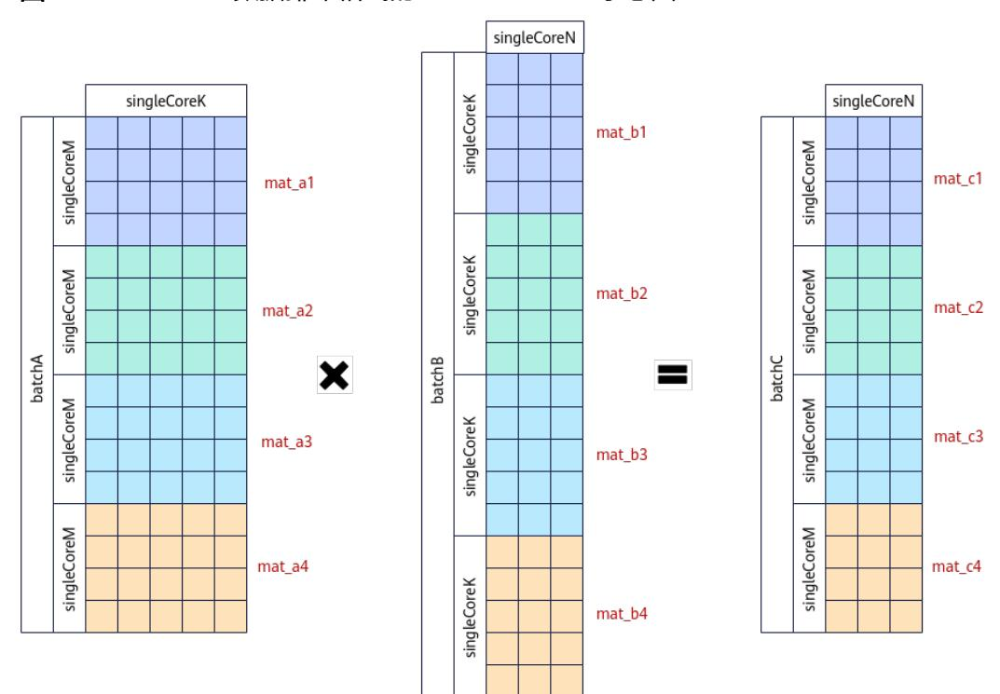

图 **6-41** NORMAL 数据排布格式的 Batch Matmul 示意图

## 使用场景

Matmul计算需要计算出多个singleCoreM \* singleCoreN大小的C矩阵,且单次 Matmul计算处理的shape较小。

## 约束说明

- 只支持**[Norm](#page-1425-0)**模板。
- 对于BSNGD、SBNGD、BNGS1S2 Layout格式,输入A、B矩阵按分形对齐后的多 Batch数据总和应小于L1 Buffer的大小;对于NORMAL Layout格式没有这种限 制,但需通过**[MatmulConfig](#page-1426-0)**配置**[batchMode](#page-1430-0)**参数,即输入A、B矩阵多Batch数 据大小与L1 Buffer的大小关系;
- 对于BSNGD、SBNGD、BNGS1S2 Layout格式,称左矩阵、右矩阵的G轴分别为 ALayoutInfoG、BLayoutInfoG,则ALayoutInfoG / batchA = BLayoutInfoG / batchB;对于NORMAL Layout格式,batchA 、batchB必须满足倍数关系。
- 如果接口输出到Unified Buffer上,输出C矩阵大小BaseM\*BaseN应小于分配的 Unified Buffer内存大小。

- 对于BSNGD、SBNGD Layout格式,输入输出只支持ND格式数据。对于 BNGS1S2、NORMAL Layout格式, 输入支持ND/NZ格式数据。
- Batch Matmul不支持量化/反量化模式,即不支持**[SetQuantScalar](#page-1518-0)**、 **[SetQuantVector](#page-1519-0)**接口。
- BSNGD场景,不支持一次计算多行SD,需要算子程序中循环计算。
- 异步模式不支持IterateBatch搬运到Unified Buffer上。
- 模板参数**[enableMixDualMaster](#page-1439-0)**(默认取值为false)设置为true,即使能 MixDualMaster(双主模式)场景时,不支持Batch Matmul。
- 在batch场景,A矩阵、B矩阵支持half/float/bfloat16\_t/int8\_t数据类型,不支持 int4b\_t数据类型。

以下是NORMAL数据排布格式的Batch Matmul调用示例。BSNDG数据排布格式的 Batch Matmul完整示例请参考**[BatchMatmul](https://gitee.com/ascend/ascendc-api-adv/tree/v1.6-8.2.RC1/examples/matrix/batch_matmul)**样例。

● Tiling实现

使用**[SetBatchInfoForNormal](#page-1580-0)**设置A/B/C的M/N/K轴信息和A/B矩阵的BatchNum 数。

```
auto ascendcPlatform = platform_ascendc::PlatformAscendC(context->GetPlatformInfo());
matmul_tiling::MultiCoreMatmulTiling tiling(ascendcPlatform); 
int32_t M = 32;
int32_t N = 256;
int32_t K = 64;
tiling->SetDim(1);
tiling->SetAType(matmul_tiling::TPosition::GM, matmul_tiling::CubeFormat::ND, 
matmul_tiling::DataType::DT_FLOAT16);
tiling->SetBType(matmul_tiling::TPosition::GM, matmul_tiling::CubeFormat::ND, 
matmul_tiling::DataType::DT_FLOAT16);
tiling->SetCType(matmul_tiling::TPosition::GM, matmul_tiling::CubeFormat::ND, 
matmul_tiling::DataType::DT_FLOAT);
tiling->SetBiasType(matmul_tiling::TPosition::GM, matmul_tiling::CubeFormat::ND, 
matmul_tiling::DataType::DT_FLOAT);
tiling->SetShape(M, N, K);
tiling->SetOrgShape(M, N, K);
tiling->EnableBias(true);
tiling->SetBufferSpace(-1, -1, -1);
constexpr int32_t BATCH_NUM = 3;
tiling->SetBatchInfoForNormal(BATCH_NUM, BATCH_NUM, M, N, K); // 设置矩阵排布
tiling->SetBufferSpace(-1, -1, -1);
optiling::TCubeTiling tilingData;
int ret = tiling.GetTiling(tilingData);
```

### ● Kernel实现

– 创建Matmul对象。

通过MatmulType设置输入输出的Layout格式为NORMAL。

```
#include "lib/matmul_intf.h"
typedef AscendC::MatmulType <AscendC::TPosition::GM, CubeFormat::ND, half, false, 
LayoutMode::NORMAL> aType;
typedef AscendC::MatmulType <AscendC::TPosition::GM, CubeFormat::ND, half, true, 
LayoutMode::NORMAL> bType;
typedef AscendC::MatmulType <AscendC::TPosition::GM, CubeFormat::ND, float, false, 
LayoutMode::NORMAL> cType;
typedef AscendC::MatmulType <AscendC::TPosition::GM, CubeFormat::ND, float> biasType;
constexpr MatmulConfig MM_CFG = GetNormalConfig(false, false, false, 
BatchMode::BATCH_LESS_THAN_L1);
AscendC::Matmul<aType, bType, cType, biasType, MM_CFG> mm;
```

- <span id="page-168-0"></span>– 初始化操作。
  - REGIST\_MATMUL\_OBJ(&pipe, GetSysWorkSpacePtr(), mm, &tiling); // 初始化matmul对象
- 设置左矩阵A、右矩阵B、Bias。

mm.SetTensorA(gm\_a); // 设置左矩阵A mm.SetTensorB(gm\_b); // 设置右矩阵B mm.SetBias(gm\_bias); // 设置Bias

- 完成矩阵乘操作。左矩阵每次计算batchA个MK数据,右矩阵每次计算 batchB个KN数据。
  - mm.IterateBatch(gm\_c, **batchA, batchB**, false);
- 结束矩阵乘操作。 mm.End();

## **6.4** 矩阵编程(基础 **API**)

## **6.4.1** 耦合架构

### 说明

本节内容为针[对耦合架构](#page-315-0),使用基础API进行矩阵乘法的编程指导。

## 编程范式

Cube编程范式把算子的实现流程分为5个基本任务:CopyIn,Split,Compute, Aggregate,CopyOut。CopyIn负责搬入操作,Split负责数据切分操作,Compute负 责矩阵指令计算操作,Aggregate负责数据汇聚操作,CopyOut负责搬出操作。

### 图 **6-42** 矩阵编程基本任务设计

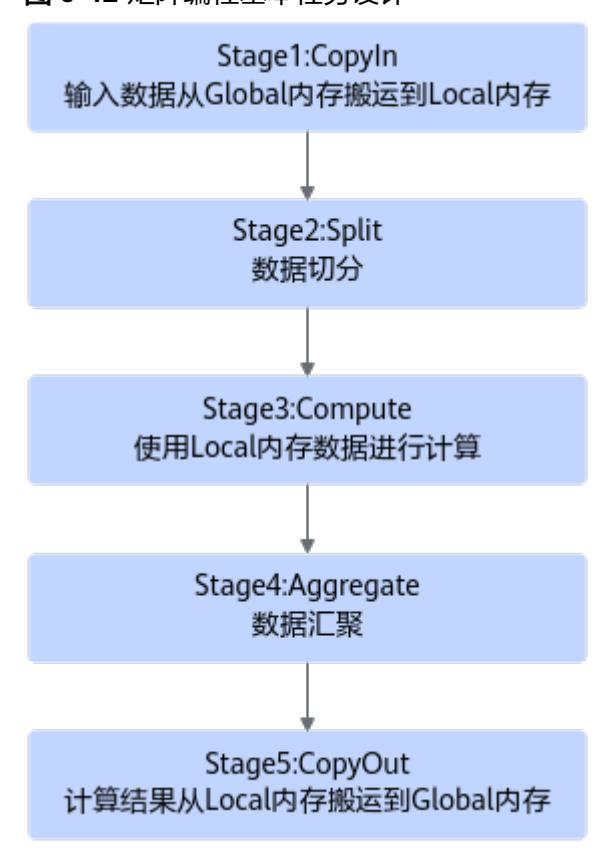

具体任务之间的交互流程和流程图如下。

### 步骤**1** Stage1:CopyIn任务。

- 1. 使用**[14.1.4.3.1 DataCopy](#page-868-0)**接口将GlobalTensor数据拷贝到LocalTensor。
- 2. 使用 **[EnQue](#page-984-0)**将LocalTensor放入A1/B1的Queue中。

### 步骤**2** Stage2:Split任务。

- 1. 使用 **[DeQue](#page-985-0)**从A1/B1中取出LocalTensor。
- 2. 使用**[17.1.1.5.8.2 LoadData](#page-1092-0)**接口将LocalTensor从A1/B1中搬运到A2/B2。
- 3. 使用 **[EnQue](#page-984-0)**将计算结果LocalTensor放入到A2/B2的Queue中。

### 步骤**3** Stage3:Compute任务。

- 1. 使用 **[DeQue](#page-985-0)**从A2/B2中取出LocalTensor。
- 2. 使用**[14.1.4.8.13 Mmad](#page-1148-0)**接口完成矩阵计算。
- 3. 使用 **[EnQue](#page-984-0)**将计算结果LocalTensor放入到CO1的Queue中。

### 步骤**4** Stage4:Aggregate任务。

- 1. 使用 **[DeQue](#page-985-0)**从CO1中取出LocalTensor。
- 2. 使用Ascend C接口拷贝结果矩阵到CO2。
- 3. 使用 **[EnQue](#page-984-0)**将计算结果LocalTensor放入到CO2的Queue中。

### 步骤**5** Stage5:CopyOut任务。

- 1. 使用 **[DeQue](#page-985-0)**接口从CO2的Queue中取出LocalTensor。
- 2. 使用**[14.1.4.3.1 DataCopy](#page-868-0)**接口将LocalTensor拷贝到GlobalTensor上。

### **----**结束

### 图 **6-43** 矩阵编程 Queue 队列

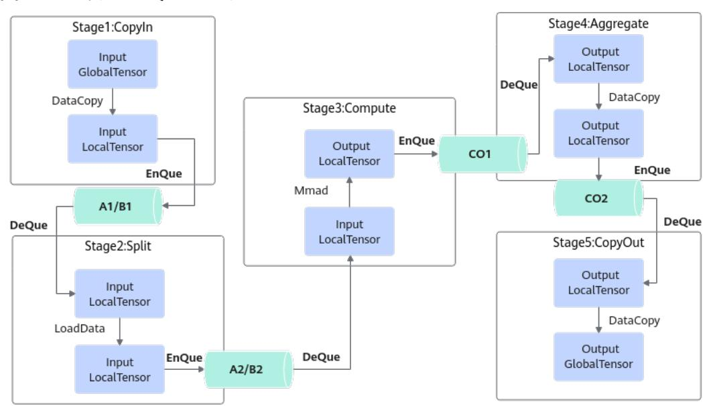

## 开发流程

基于Ascend C方式实现矩阵算子的流程如下图所示。

图 **6-44** 矩阵算子实现流程

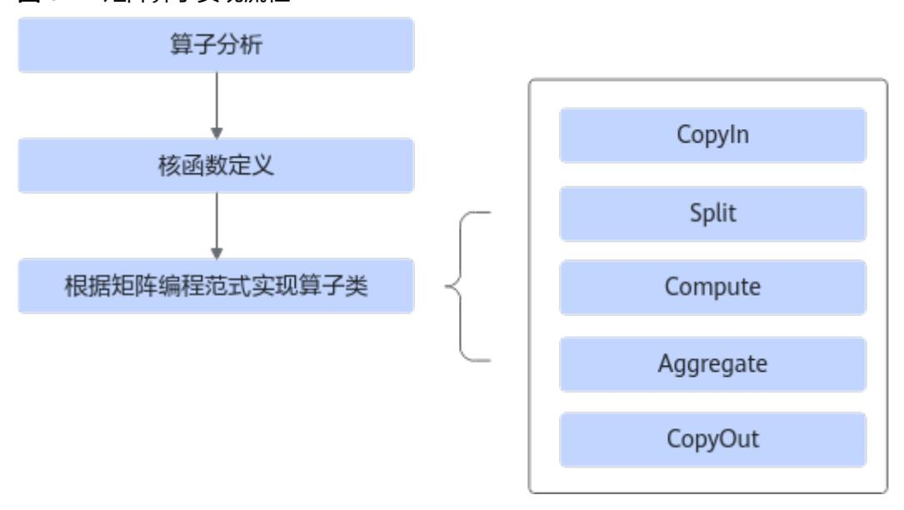

- 算子分析:分析算子的数学表达式、输入、输出以及计算逻辑的实现,明确需要 调用的Ascend C接口。
- 核函数定义:定义Ascend C算子入口函数。
- 根据矩阵编程范式实现算子类:完成核函数的内部实现,调用私有成员函数 CopyIn、SplitA、SplitB、Compute、Aggregate、CopyOut完成矩阵算子的五级 流水操作。

下文将以Matmul算子为例对上述步骤进行详细介绍,Matmul算子的代码框架如下, 完整代码请参见**[Mmad](https://gitee.com/ascend/samples/tree/master/operator/ascendc/0_introduction/20_mmad_kernellaunch/MmadInvocation)**样例。

```
#include "kernel_operator.h"
// 根据编程范式实现算子类
class KernelMatmul {
public:
 __aicore__ inline void Init(GM_ADDR a, GM_ADDR b, GM_ADDR c)
 {
 // ...
 }
 __aicore__ inline void Process()
 {
 CopyIn();
 SplitA();
 AscendC::LocalTensor<half> b1Local = inQueueB1.DeQue<half>();
 AscendC::LocalTensor<half> a2Local = inQueueA2.DeQue<half>();
 AscendC::LocalTensor<float> c2Local = outQueueCO2.AllocTensor<float>();
 // split matrix b into 2 parts, [32, 16] and [32, 16]
 for (int i = 0; i < 2; ++i) {
 SplitB(b1Local, i);
 Compute(a2Local);
 Aggregate(c2Local, i);
 }
 inQueueB1.FreeTensor(b1Local);
 inQueueA2.FreeTensor(a2Local);
 outQueueCO2.EnQue<float>(c2Local);
 CopyOut();
 }
private:
 __aicore__ inline void CopyIn()
 {
 // ...
```

```
 }
 __aicore__ inline void SplitA()
 {
 // ...
 }
 __aicore__ inline void SplitB(const LocalTensor<half>& b1Local, const int bSplitIdx)
 {
 // ...
 }
 __aicore__ inline void Compute(const LocalTensor<half>& a2Local)
 {
 // ...
 }
 __aicore__ inline void Aggregate(const LocalTensor<float>& c2Local, const int bSplitIdx)
 {
 // ...
 }
 __aicore__ inline void CopyOut()
 {
 // ...
 }
private:
 // ...
};
//核函数定义
extern "C" __global__ __aicore__ void matmul_custom(GM_ADDR a, GM_ADDR b, GM_ADDR c)
{
 KernelMatmul op;
 op.Init(a, b, c);
 op.Process();
}
```

## 算子分析

在开发算子代码之前需要分析算子的数学表达式、输入、输出以及计算逻辑的实现, 明确需要调用的Ascend C接口。

### 步骤**1** 明确算子的数学表达式及计算逻辑。

Matmul算子完成矩阵乘操作,其数学表达式如下,形状为[m, k]的矩阵a和形状为[k, n]的矩阵b相乘,得到形状为[m, n]的矩阵c。为了方便,令m=k=n=32。 c = a \* b

注意需要处理的数据过大时,需要对数据进行切分并分块搬运到A2、B2,分别计算后 再进行汇聚。下文的计算逻辑为了展示Split和Aggregate阶段的样例,请您根据实际需 要处理的数据大小决定是否需要切分和汇聚。

### 计算逻辑如下:

- 1. 分别搬运输入数据矩阵a、b至Local Memory A1、B1。
- 2. 将a矩阵从A1搬运至A2。为实现部分并行,将b矩阵切分为part1和part2,形状均 为[k, n / 2],切分后再分块搬运至B2。
- 3. a矩阵和b矩阵part1、part2分别做矩阵乘运算,获得矩阵c的part1和part2,形状 均为[m, n / 2]。计算结果在CO1存储。
- 4. 将矩阵c的part1和part2分别拷贝到CO2进行合并。
- 5. 将合并后的输出数据从CO2搬出。

### 步骤**2** 明确输入和输出。

● Matmul算子有两个输入:a与b,输出为c。

- 本样例中算子输入支持的数据类型为half(float16),算子输出的数据类型为 float32。
- 矩阵a、b、c的形状均为[32, 32]。
- 算子输入输出支持的数据格式为:ND。

### 步骤**3** 确定核函数名称和参数。

- 您可以自定义核函数名称,本样例中核函数命名为matmul\_custom。
- 根据对算子输入输出的分析,确定核函数有3个参数a,b,c;a,b为输入在 Global Memory上的内存地址,c为输出在Global Memory上的内存地址。

### 步骤**4** 约束分析。

由于硬件架构对矩阵乘计算的输入输出有格式约束,需要在算子实现中增加格式转换 的流程。

- 搬运矩阵a、b至A1、B1时,将ND格式的矩阵a、b转换为NZ格式。
- 从A1搬运矩阵a至A2时,将NZ格式的a矩阵转换为ZZ格式;从B1搬运矩阵b到B2 时将NZ格式的b矩阵转换为ZN格式。
- 将计算结果从CO2搬出时,将NZ格式的c矩阵转换为ND格式。
- 数据排布格式的相关介绍详[见数据排布格式](#page-301-0)。

### 步骤**5** 确定算子实现所需接口。

- 实现外部存储和内部存储间的数据搬运,查看Ascend C API参考中的数据搬移接 口,具体参考**[14.1.4.3.1 DataCopy](#page-868-0)**。
- 实现矩阵数据格式转换,查看Ascend C API参考中的数据转换接口,具体参考 **[14.1.4.8.2 LoadData](#page-1092-0)**。
- 矩阵计算过程涉及矩阵乘法,查看Ascend C API参考中的矩阵计算接口,具体参 考**[14.1.4.8.13 Mmad](#page-1148-0)**。
- 计算中使用到的Tensor数据结构,使用Queue队列进行管理,会使用到 **[EnQue](#page-984-0)**、 **[DeQue](#page-985-0)**等接口。

### **----**结束

通过以上分析,得到Ascend C Matmul算子的计算流程图和设计规格如下:

图 **6-45** Matmul 算子的计算流程图

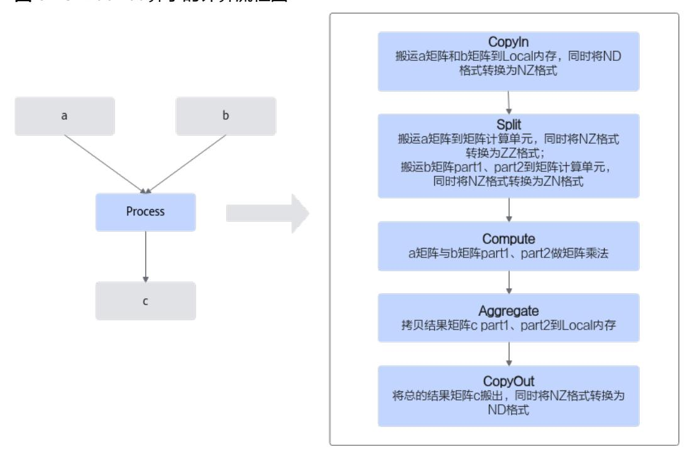

表 **6-9** Ascend C Matmul 算子设计规格

| 算子类型<br>(OpType)          | Matmul                     |                      |           |        |
|---------------------------|----------------------------|----------------------|-----------|--------|
| 算子输入                      | name                       | shape                | data type | format |
|                           | a                          | (m, k) =<br>(32, 32) | half      | ND     |
|                           | b                          | (k, n) =<br>(32, 32) | half      | ND     |
| 算子输出                      | c                          | (m, n) =<br>(32, 32) | float32   | ND     |
| 核函数名称                     | matmul_custom              |                      |           |        |
| 使用的主要接<br>DataCopy:数据搬移接口 |                            |                      |           |        |
| 口                         | LoadData:矩阵数据格式转换接口        |                      |           |        |
|                           | Mmad:矩阵乘计算接口               |                      |           |        |
|                           | EnQue、DeQue等接口:Queue队列管理接口 |                      |           |        |
| 算子实现文件<br>名称              |                            | matmul_custom.cpp    |           |        |

## 核函数定义

根据**5.2** [核函数](#page-78-0)中介绍的规则进行核函数的定义。

### 步骤**1** 函数原型定义。

本样例中,函数名为matmul\_custom(核函数名称可自定义);根[据算子分析](#page-171-0)中对算 子输入输出的分析,确定有3个参数a,b,c,其中a,b都为输入内存,c为输出内存。 根据**5.2** [核函数](#page-78-0)中核函数的规则介绍,函数原型定义如下所示:使用\_\_global\_\_函数类 型限定符来标识它是一个核函数,可以被<<<>>>调用;使用\_\_aicore\_\_函数类型限定 符来标识该核函数在设备端aicore上执行;为方便起见,统一使用GM\_ADDR宏修饰入 参,GM\_ADDR宏定义请参考**5.2** [核函数。](#page-78-0)

```
extern "C" __global__ __aicore__ void matmul_custom(GM_ADDR a, GM_ADDR b, GM_ADDR c)
{
}
```

### 步骤**2** 调用算子类的Init和Process函数。

算子类的Init函数,完成内存初始化相关工作,Process函数完成算子实现的核心逻 辑,具体介绍参见算子类实现。

```
extern "C" __global__ __aicore__ void matmul_custom(GM_ADDR a, GM_ADDR b, GM_ADDR c)
 KernelMatmul op;
 op.Init(a, b, c);
 op.Process();
}
```

步骤**3** 对核函数进行封装,得到matmul\_custom\_do函数,便于主程序调用。#ifndef ASCENDC\_CPU\_DEBUG表示该封装函数仅在编译运行NPU侧的算子时会用到,编译运 行CPU侧的算子时,可以直接调用matmul\_custom函数。根据[核函数定义和调用章](#page-78-0) 节,调用核函数时,除了需要传入参数a,b,c,还需要传入blockDim(核函数执行 的核数),l2ctrl(保留参数,设置为nullptr),stream(应用程序中维护异步操作执 行顺序的stream)来规定核函数的执行配置。

```
#ifndef ASCENDC_CPU_DEBUG
// call of kernel function
void matmul_custom_do(uint32_t blockDim, void* l2ctrl, void* stream, uint8_t* a, uint8_t* b, uint8_t* c)
 matmul_custom<<<blockDim, l2ctrl, stream>>>(a, b, c);
}
#endif
```

### **----**结束

## 算子类实现

根据上一章节介绍,核函数中会调用算子类的Init和Process函数,本章具体讲解基于 编程范式实现算子类。矩阵编程范式请参[考编程范式](#page-168-0)。

算子类中主要包含对外开放的初始化Init函数和核心处理函数Process以及一些实现中 会用到的私有成员。KernelMatmul算子类的定义如下:

```
class KernelMatmul {
public:
 __aicore__ inline KernelMatmul(){}
 // 初始化函数,完成内存初始化相关操作
 __aicore__ inline void Init(GM_ADDR a, GM_ADDR b, GM_ADDR c){}
 // 核心处理函数,实现算子逻辑
 // 调用私有成员函数CopyIn、SplitA、SplitB、Compute、Aggregate、CopyOut完成矩阵算子的五级流水操作
 __aicore__ inline void Process(){}
private:
 __aicore__ inline void CopyND2NZ(const LocalTensor<half>& dst, const GlobalTensor<half>& src, const 
uint16_t height, const uint16_t width){}
 // 搬进函数,完成编程范式中的CopyIn阶段的处理,由Process函数调用
 __aicore__ inline void CopyIn(){}
 // 搬进函数,完成编程范式中的Split阶段的处理,由Process函数调用
 __aicore__ inline void SplitA(){}
```

```
 // 搬进函数,完成编程范式中的Split阶段的处理,由Process函数循环调用两次,分别搬运b矩阵的两个part
 __aicore__ inline void SplitB(const LocalTensor<half>& b1Local, const int bSplitIdx){}
 // 计算函数,完成编程范式中的Compute阶段的处理,由Process函数循环调用两次,分别计算出矩阵c的两个
part
 __aicore__ inline void Compute(const LocalTensor<half>& a2Local){}
 // 搬出函数,完成编程范式中的Aggregate阶段的处理,由Process函数循环调用两次,分别搬出矩阵c的两个
part
 __aicore__ inline void Aggregate(const LocalTensor<float>& c2Local, const int bSplitIdx){}
 // 搬出函数,完成编程范式中的CopyOut阶段的处理,由Process函数调用
 __aicore__ inline void CopyOut(){}
private:
 AscendC::TPipe pipe; // Pipe内存管理对象,管理Queue队列的内存
 AscendC::TQue<AscendC::TPosition::A1, 1> inQueueA1; // 输入数据的队列,TPosition为A1
 AscendC::TQue<AscendC::TPosition::A2, 1> inQueueA2; // 输入数据的队列,TPosition为A2
 AscendC::TQue<AscendC::TPosition::B1, 1> inQueueB1; // 输入数据的队列,TPosition为B1
 AscendC::TQue<AscendC::TPosition::B2, 2> inQueueB2; // 输入数据的队列,TPosition为B2
 AscendC::TQue<AscendC::TPosition::CO1, 2> outQueueCO1; // 输出数据的队列,TPosition为CO1
 AscendC::TQue<AscendC::TPosition::CO2, 1> outQueueCO2; // 输出数据的队列,TPosition为CO2
 // 管理输入输出Global Memory内存地址的对象,其中aGM,bGM为输入,cGM为输出
 AscendC::GlobalTensor<half> aGM, bGM;
 AscendC::GlobalTensor<float> cGM;
 uint16_t m = 32;
 uint16_t n = 32;
 uint16_t k = 32;
 uint16_t aSize, bSize, cSize, mBlocks, nBlocks, kBlocks;
};
```

### **KernelMatmul**构造函数实现

构造函数中对私有成员变量进行初始化,具体代码如下:

```
__aicore__ inline KernelMatmul()
 aSize = m * k;
 bSize = k * n;
 cSize = m * n;
 mBlocks = m / 16;
 nBlocks = n / 16;
 kBlocks = k / 16;
}
```

矩阵a的形状为[m, k],矩阵b的形状为[k, n],矩阵c的形状为[m,n],此样例中m、 n、k均设置为32。

aSize、bSize、cSize分别为矩阵a、b、c的数值个数。

mBlocks、 nBlocks、 kBlocks为m、n、k所占分形数量,half类型一个分形长度为 16,blocks计算公式为:

- mBlocks = m / 16
- nBlocks = n / 16
- kBlocks = k / 16

分形具体介绍可参考**10.2.2** [数据排布格式](#page-301-0)。

### **Init**函数实现

Init函数主要完成以下内容:

● 设置输入输出Global Tensor的Global Memory内存地址。 以设置输入a在Global Memory上的内存偏移地址为例: aGM.SetGlobalBuffer((\_\_gm\_\_ half\*)a);

注意,因为本样例中Init函数的入参统一设置为uint8\_t\*,这里需要强转成具体的 数据类型(\_\_gm\_\_ half\*),再进行偏移。

● 通过Pipe内存管理对象为输入输出Queue分配内存。

比如,为输入数据队列inQueueB2分配内存,可以通过如下代码段实现:

```
pipe.InitBuffer(inQueueB2, 2, bSize * sizeof(half) / 2);
```

此样例中将b矩阵切分为两个part,为inQueueB2分配内存时需要申请两块内存空 间,每一块的大小为b矩阵大小的一半,outQueueCO1的内存初始化同理。

### 具体的初始化函数代码如下:

```
__aicore__ inline void Init(GM_ADDR a, GM_ADDR b, GM_ADDR c)
 aGM.SetGlobalBuffer((__gm__ half*)a);
 bGM.SetGlobalBuffer((__gm__ half*)b);
 cGM.SetGlobalBuffer((__gm__ float*)c);
 pipe.InitBuffer(inQueueA1, 1, aSize * sizeof(half));
 pipe.InitBuffer(inQueueA2, 1, aSize * sizeof(half));
 pipe.InitBuffer(inQueueB1, 1, bSize * sizeof(half));
 pipe.InitBuffer(inQueueB2, 2, bSize * sizeof(half) / 2);
 pipe.InitBuffer(outQueueCO1, 2, cSize * sizeof(float) / 2);
 pipe.InitBuffer(outQueueCO2, 1, cSize * sizeof(float));
}
```

### **Process**函数实现

基于矩阵编程范式,将核函数的实现分为5个基本阶段:CopyIn,Split,Compute, Aggregate,CopyOut。Split,Compute,Aggregate阶段需要区分a、b矩阵。 Process函数中通过如下方式调用这几个函数。

```
__aicore__ inline void Process()
 CopyIn();
 SplitA();
 AscendC::LocalTensor<half> b1Local = inQueueB1.DeQue<half>();
 AscendC::LocalTensor<half> a2Local = inQueueA2.DeQue<half>();
 AscendC::LocalTensor<float> c2Local = outQueueCO2.AllocTensor<float>();
 // split matrix b into 2 parts, [32, 16] and [32, 16]
 for (int i = 0; i < 2; ++i) {
 SplitB(b1Local, i);
 Compute(a2Local);
 Aggregate(c2Local, i);
 }
 inQueueB1.FreeTensor(b1Local);
 inQueueA2.FreeTensor(a2Local);
 outQueueCO2.EnQue<float>(c2Local);
 CopyOut();
}
```

两次循环内,SplitB需要从inQueueB1中分别搬运两个part的b矩阵,Compute需要分 别计算a矩阵和两个part b矩阵的乘法,Aggregate要分别搬运两个part的c矩阵,具体 五个阶段数据流通示意图如下:

图 **6-46** 数据流通示意图

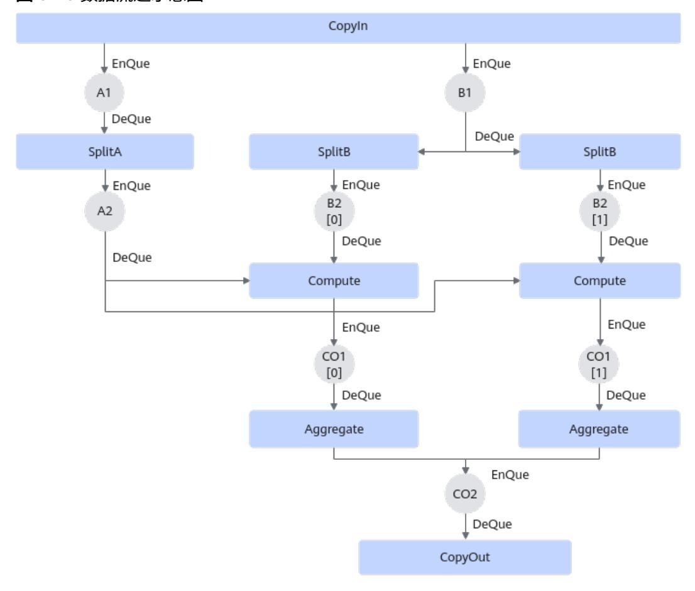

切分b矩阵,可以实现一部分的并行,本样例的流水并行示意图如下:

### 图 **6-47** 并行示意图

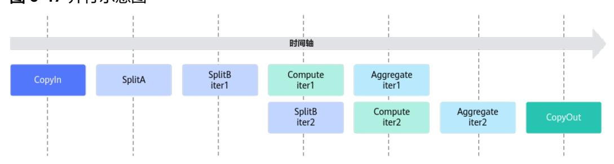

### 步骤**1** Stage1:CopyIn函数实现。

- 1. 使用 **[AllocTensor](#page-980-0)**从A1,B1的Queue中申请a1Local和b1Local。
- 2. 使用**[14.1.4.3.1 DataCopy](#page-868-0)**接口将矩阵a、b搬运到Local Memory,同时将其数据 格式从ND转换为NZ。
  - 一次DataCopy指令搬运height\*16个数,循环执行width/16次。DataCopy的参数 设置如下:
  - blockCount设置为height,共搬运height次。
  - blockLen设置为1,一次搬运16个类型为half的数。
  - srcStride设置为width/16 1,源矩阵每搬运一个block需要跳跃一行。

- dstStride设置为0,目的矩阵每个block在内存中连续存储。
- 每次循环迭代,源矩阵首地址移动16个数,目的矩阵首地址移动16\*height个 数。

格式转换示意图如下,第一次循环搬运蓝色部分,第二次循环搬运绿色部分;图 中width为32,占两个分形,height为32,占两个分形,一共搬运4个16\*16分 形。

### 图 **6-48** ND to NZ 转换示意图

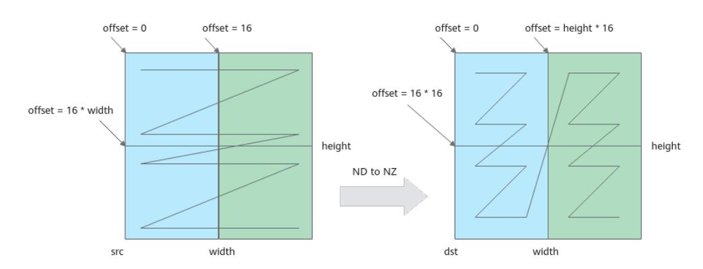

注意:上述ND到NZ的格式转换仅作为举例说明,开发者可根据实际情况选择合 适的转换方式。

3. 使用 **[EnQue](#page-984-0)**将a1Local、b1Local分别放入A1、B1的Queue中。

### 具体代码如下:

```
__aicore__ inline void CopyND2NZ(const LocalTensor<half>& dst, const GlobalTensor<half>& src, const 
uint16_t height, const uint16_t width)
 for (int i = 0; i < width / 16; ++i) {
 int srcOffset = i * 16;
 int dstOffset = i * 16 * height;
 AscendC::DataCopy(dst[dstOffset], src[srcOffset], { height, 1, uint16_t(width / 16 - 1), 0 });
 }
}
__aicore__ inline void CopyIn()
{
 AscendC::LocalTensor<half> a1Local = inQueueA1.AllocTensor<half>();
 AscendC::LocalTensor<half> b1Local = inQueueB1.AllocTensor<half>();
 CopyND2NZ(a1Local, aGM, m, k);
 CopyND2NZ(b1Local, bGM, k, n);
 inQueueA1.EnQue(a1Local);
 inQueueB1.EnQue(b1Local);
}
```

### 步骤**2** Stage2:SplitA函数实现。

- 1. 使用 **[DeQue](#page-985-0)**从A1的Queue中取出a1Local。
- 2. 使用 **[AllocTensor](#page-980-0)**从A2的Queue中申请a2Local。
- 3. 使用**[14.1.4.8.2 LoadData](#page-1092-0)**将矩阵a搬运到A2,同时将a矩阵从NZ格式转换为ZZ格 式。

搬运及格式转换示意图如下:图中k为32,占kBlocks(k/16=2)个分形,m为 32,占mBlocks(m/16=2)个分形,一共搬运4个16\*16分形。本示例中,调用一 次LoadData接口完成两个16\*16分形的搬运,循环调用两次LoadData。第一次循 环搬运蓝色部分两个分形,第二次循环搬运绿色部分两个分形。

单次循环中LoadData(本样例中要完成2个分形的搬运,蓝色部分或者绿色部 分)的参数设置如下:

- repeatTimes表示数据处理的迭代次数,因为LoadData每个迭代处理一个分 形,所以也可以理解为待搬运分形的个数。本样例中即为k轴方向的分形个 数,设置为kBlocks,表示搬运kBlocks个分形。
- srcStride表示,相邻迭代间源操作数分形首地址之间的间隔,以搬运蓝色部 分分形为例:下图中左侧源操作数矩阵,第一个蓝色分形和第二个蓝色分形 起始地址之间的间隔为mBlocks个分形,此处设置为mBlocks。
- dstStride使用默认值,目的矩阵两个分形连续存储。
- ifTranspose设置为false,每块分形搬运前搬运后都为Z格式,不使能转置。
- 每次循环迭代源矩阵首地址偏移16\*16,目的矩阵首地址偏移16\*k。

### 图 **6-49** NZ to ZZ 格式转换示意图


4. 使用 **[EnQue](#page-984-0)**将计算结果a2Local放入到A2的Queue中。

### 具体代码如下:

```
 __aicore__ inline void SplitA()
 {
 int srcOffset = 0;
 int dstOffset = 0;
 AscendC::LocalTensor<half> a1Local = inQueueA1.DeQue<half>();
 AscendC::LocalTensor<half> a2Local = inQueueA2.AllocTensor<half>();
 // transform nz to zz
 for (int i = 0; i < mBlocks; ++i) {
 AscendC::LoadData2DParams loadDataParams;
 loadDataParams.repeatTimes = kBlocks;
 loadDataParams.srcStride = mBlocks;
 loadDataParams.ifTranspose = false;
 AscendC::LoadData(a2Local[dstOffset], a1Local[srcOffset], loadDataParams);
 srcOffset += 16 * 16;
 dstOffset += k * 16;
 }
 inQueueA2.EnQue<half>(a2Local);
 inQueueA1.FreeTensor(a1Local);
 }
```

步骤**3** Stage2:SplitB函数实现。

1. SplitB需要传入两个参数:使用 **[DeQue](#page-985-0)**从B1的Queue中取出的b1Local和循环迭 代变量index。

- 2. 使用 **[AllocTensor](#page-980-0)**从B2的Queue中申请b2Local。
- 3. 使用**[14.1.4.8.2 LoadData](#page-1092-0)**将b矩阵搬运到B2,同时从NZ格式转换为ZN格式。 搬运及格式转换示意图如下:图中k为32,占kBlocks(k/16=2)个分形,n为 32,占nBlocks(n/16=2)个分形,一共搬运4个16\*16分形。本示例中,调用一 次LoadData接口完成两个16\*16分形的搬运,循环调用两次LoadData。第一次循 环搬运蓝色部分两个分形,第二次循环搬运绿色部分两个分形。

单次循环中LoadData(本样例中要完成2个分形的搬运,蓝色部分或者绿色部 分)的参数设置如下:

- repeatTimes表示数据处理的迭代次数,因为LoadData每个迭代处理一个分 形,所以也可以理解为待搬运分形的个数。本样例中即为k轴方向的分形个 数,设置为kBlocks,表示搬运kBlocks个分形。
- srcStride相邻迭代间源操作数分形首地址之间的间隔,以搬运蓝色部分分形 为例:下图中左侧源操作数矩阵,第一个蓝色分形和第二个蓝色分形起始地 址之间的间隔为1个分形,此处设置为1,源矩阵两个分形连续存储。
- dstStride使用默认值0,目的矩阵两个分形连续存储。
- ifTranspose设置为true,每块分形搬运前为Z格式,搬运后需要为N格式,需 要使能转置。
- 每次循环迭代,源矩阵首地址需要偏移k\*n/2。

### 图 **6-50** NZ to ZN 格式转换示意图

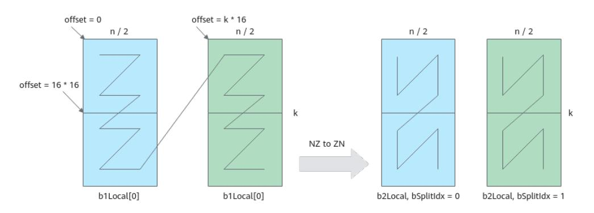

4. 使用 **[EnQue](#page-984-0)**将计算结果b2Local放入到B2的Queue中。

### 具体代码如下:

```
 __aicore__ inline void SplitB(const AscendC::LocalTensor<half>& b1Local, const int bSplitIdx)
 {
 AscendC::LocalTensor<half> b2Local = inQueueB2.AllocTensor<half>();
 // transform nz to zn
 AscendC::LoadData2DParams loadDataParams;
 loadDataParams.repeatTimes = kBlocks;
 loadDataParams.srcStride = 1;
 loadDataParams.ifTranspose = true;
 AscendC::LoadData(b2Local, b1Local[bSplitIdx * bSize / 2], loadDataParams);
 inQueueB2.EnQue<half>(b2Local);
 }
```

步骤**4** Stage3:Compute函数实现,完成核心的矩阵计算功能。

1. Compute函数需要传入参数a2Local,a2Local从A2的Queue中使用 **[DeQue](#page-985-0)**取 出。

- 2. 使用 **[AllocTensor](#page-980-0)**从CO1的Queue中申请c1Local。
- 3. 使用 **[DeQue](#page-985-0)**从B2中取出b2Local。
- 4. 使用**[14.1.4.8.13 Mmad](#page-1148-0)**完成矩阵乘计算。
- 5. 使用 **[EnQue](#page-984-0)**将计算结果c1Local放入到CO1的Queue中。

### 具体代码如下:

```
 __aicore__ inline void Compute(const AscendC::LocalTensor<half>& a2Local)
 {
 AscendC::LocalTensor<half> b2Local = inQueueB2.DeQue<half>();
 AscendC::LocalTensor<float> c1Local = outQueueCO1.AllocTensor<float>();
 AscendC::MmadParams mmadParams;
 mmadParams.m = m;
 mmadParams.n = n / 2;
 mmadParams.k = k;
 AscendC::Mmad(c1Local, a2Local, b2Local, mmadParams);
 outQueueCO1.EnQue<float>(c1Local);
 inQueueB2.FreeTensor(b2Local);
 }
```

### 步骤**5** Stage4:Aggregate函数实现,完成数据汇聚操作。

- 1. Aggregate需要传入两个参数:使用 **[AllocTensor](#page-980-0)**从CO2的Queue中申请的 c2Local和循环迭代变量index。
- 2. 使用 **[DeQue](#page-985-0)**从CO1中取出c1Local。
- 3. 使用**[14.1.4.3.1 DataCopy](#page-868-0)**将结果矩阵从CO1搬运到CO2。

DataCopy参数设置如下:

- blockCount设置为1,blockLen设置为2,连续搬运两个分形,无需格式转 换。
- blockMode设置为BlockMode::BLOCK\_MODE\_MATRIX,表示需要按分形搬 运。
- c2Local首地址偏移量设置为index \* cSize / 2。

### 具体代码如下:

```
 __aicore__ inline void Aggregate(const AscendC::LocalTensor<float>& c2Local, const int bSplitIdx)
 {
 AscendC::LocalTensor<float> c1Local = outQueueCO1.DeQue<float>();
 AscendC::DataCopyParams dataCopyParams;
 dataCopyParams.blockCount = 1;
 dataCopyParams.blockLen = 2;
 AscendC::DataCopyEnhancedParams enhancedParams;
 enhancedParams.blockMode = AscendC::BlockMode::BLOCK_MODE_MATRIX;
 AscendC::DataCopy(c2Local[bSplitIdx * cSize / 2], c1Local, dataCopyParams, enhancedParams);
 outQueueCO1.FreeTensor(c1Local);
 }
```

### 步骤**6** Stage5:CopyOut函数实现。

- 1. 使用 **[DeQue](#page-985-0)**从CO2中取出c2Local。
- 2. 使用**[14.1.4.3.1 DataCopy](#page-868-0)**将结果矩阵从CO2搬运到Global Memory,同时需要将 格式从NZ转换为ND。

每次循环移动一个分形,搬运m\*16个数。DataCopy参数说明如下:

– blockCount设置为m,共搬运m次。

- <span id="page-182-0"></span>– blockLen设置为2,DataCopy指令一次搬运2个block,每个block16个数。
- srcStride设置为0,每两次搬运间没有间隙。
- dstStride设置为(nBlocks 1) \* 2,每两次搬运间隔2个block。
- 每次循环迭代,目的矩阵偏移16,源矩阵偏移m\*16。

格式转换示意图如下,第一次循环搬运蓝色部分数据,第二次循环搬运绿色部分 数据。

### 图 **6-51** NZ to ND 格式转换示意图

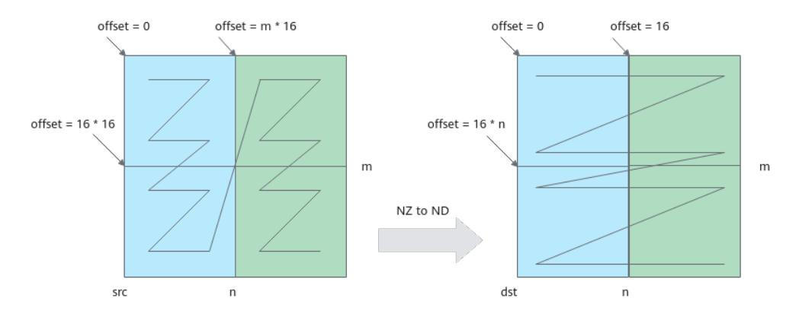

### 具体代码如下:

```
 __aicore__ inline void CopyOut()
 {
 AscendC::LocalTensor<float> c2Local = outQueueCO2.DeQue<float>();
 // transform nz to nd
 for (int i = 0; i < nBlocks; ++i) {
 AscendC::DataCopy(cGM[i * 16], c2Local[i * m * 16], { m, 2, 0, uint16_t((nBlocks - 1) * 2) });
 }
 outQueueCO2.FreeTensor(c2Local);
 }
```

### **----**结束

## **6.4.2** 分离架构

针对[分离架构,](#page-316-0)使用基础API进行矩阵乘法算子实现的编程范式和**6.4.1** [耦合架构一](#page-168-0) 致,由于硬件架构不同,具体实现有一些差异,本节仅提供差异点说明。完整代码请 参见**[Mmad](https://gitee.com/ascend/samples/tree/master/operator/ascendc/0_introduction/20_mmad_kernellaunch/MmadInvocation)**样例。

### ● **CopyIn**阶段差异

### – 耦合架构

在CopyIn阶段,即从GM->A1/B1(L1 Buffer)的阶段,耦合架构可以使用 DataCopy接口直接将数据从GM搬入L1 Buffer,也可以将数据从GM搬入 UB,再搬入L1 Buffer。若需要ND2NZ的格式转换,需要开发者自行完成; 或使用DataCopy接口提供的[随路格式转换功](#page-898-0)能,但该功能会使用UB临时空 间。

如下示例,直接使用了GM->A1/B1的数据搬运指令,自行完成ND2NZ的格 式转换。

```
 __aicore__ inline void CopyND2NZ(const AscendC::LocalTensor<half>& dst, const 
AscendC::GlobalTensor<half>& src,
 const uint16_t height, const uint16_t width)
```

```
 {
 for (int i = 0; i < width / 16; ++i) {
 int srcOffset = i * 16;
 int dstOffset = i * 16 * height;
 AscendC::DataCopy(dst[dstOffset], src[srcOffset], { height, 1, uint16_t(width / 16 - 1), 
0 });
 }
 }
 __aicore__ inline void CopyIn()
 {
 AscendC::LocalTensor<half> a1Local = inQueueA1.AllocTensor<half>();
 AscendC::LocalTensor<half> b1Local = inQueueB1.AllocTensor<half>();
 CopyND2NZ(a1Local, aGM, m, k);
 CopyND2NZ(b1Local, bGM, k, n);
 inQueueA1.EnQue(a1Local);
 inQueueB1.EnQue(b1Local);
 }
```

### – 分离架构

分离架构中数据无法经过VECIN/VECCALC/VECOUT (UB) 直接搬运到A1/B1 (L1 Buffer) ,但是使用DataCopy接口提供的[随路格式转换功](#page-898-0)能一条指令即 可完成格式转换,无需UB作为临时空间。

### 示例如下:

```
 __aicore__ inline void CopyIn()
 {
 AscendC::LocalTensor<half> a1Local = inQueueA1.AllocTensor<half>();
 AscendC::LocalTensor<half> b1Local = inQueueB1.AllocTensor<half>();
 AscendC::Nd2NzParams nd2nzA1Params;
 nd2nzA1Params.ndNum = 1;
 nd2nzA1Params.nValue = m;
 nd2nzA1Params.dValue = k;
 nd2nzA1Params.srcNdMatrixStride = 0;
 nd2nzA1Params.srcDValue = k;
 nd2nzA1Params.dstNzC0Stride = CeilCubeBlock(m) * CUBE_BLOCK;
 nd2nzA1Params.dstNzNStride = 1;
 nd2nzA1Params.dstNzMatrixStride = 0;
 AscendC::DataCopy(a1Local, aGM, nd2nzA1Params);
 AscendC::Nd2NzParams nd2nzB1Params;
 nd2nzB1Params.ndNum = 1;
 nd2nzB1Params.nValue = k;
 nd2nzB1Params.dValue = n;
 nd2nzB1Params.srcNdMatrixStride = 0;
 nd2nzB1Params.srcDValue = n;
 nd2nzB1Params.dstNzC0Stride = CeilCubeBlock(k) * CUBE_BLOCK;
 nd2nzB1Params.dstNzNStride = 1;
 nd2nzB1Params.dstNzMatrixStride = 0;
 AscendC::DataCopy(b1Local, bGM, nd2nzB1Params);
 inQueueA1.EnQue(a1Local);
 inQueueB1.EnQue(b1Local);
 }
```

### ● **Aggregate**及**CopyOut**阶段差异

### – 耦合架构

耦合架构中,完成矩阵乘计算后之后数据存放于CO1(L0C Buffer),最终搬 入GM需要通过CO2(UB),且NZ2ND的格式转换需要在CO1->CO2->GM 阶段中手动完成。如下样例,在Aggregate阶段将NZ格式数据从CO1搬入 CO2中,在CO2->GM的阶段使用for循环调用DataCopy完成了格式转换。

```
 __aicore__ inline void Aggregate(const AscendC::LocalTensor<float>& c2Local, const int 
bSplitIdx)
```

```
 {
 AscendC::LocalTensor<float> c1Local = outQueueCO1.DeQue<float>();
 AscendC::DataCopyParams dataCopyParams;
 dataCopyParams.blockCount = 1;
 dataCopyParams.blockLen = 2;
 AscendC::DataCopyEnhancedParams enhancedParams;
 enhancedParams.blockMode = AscendC::BlockMode::BLOCK_MODE_MATRIX;
 AscendC::DataCopy(c2Local[bSplitIdx * cSize / 2], c1Local, dataCopyParams, 
enhancedParams);
 outQueueCO1.FreeTensor(c1Local);
 }
 __aicore__ inline void CopyOut()
 {
 AscendC::LocalTensor<float> c2Local = outQueueCO2.DeQue<float>();
 // transform nz to nd
 for (int i = 0; i < nBlocks; ++i) {
 AscendC::DataCopy(cGM[i * 16], c2Local[i * m * 16], { m, 2, 0, uint16_t((nBlocks - 1) * 
2) });
 }
 outQueueCO2.FreeTensor(c2Local);
 }
```

### – 分离架构

分离架构中,矩阵乘的计算结果从CO1(L0C Buffer)可以通过Fixpipe通路 直接写入GM,而且**[Fixpipe](#page-1159-0)**提供了随路NZ2ND的功能,方便用户做格式转 换。样例如下,样例中省去了Aggregate阶段,直接CopyOut。

```
 __aicore__ inline void CopyOut()
 {
 AscendC::LocalTensor<float> c1Local = outQueueCO1.DeQue<float>();
 AscendC::FixpipeParamsV220 fixpipeParams;
 fixpipeParams.nSize = n;
 fixpipeParams.mSize = m;
 fixpipeParams.srcStride = m;
 fixpipeParams.dstStride = n;
 fixpipeParams.ndNum = 1;
 fixpipeParams.srcNdStride = 0;
 fixpipeParams.dstNdStride = 0;
 AscendC::Fixpipe(cGM, c1Local, fixpipeParams);
 outQueueCO1.FreeTensor(c1Local);
 }
```

## **6.5** 融合算子编程

## **6.5.1** 基础知识

### 说明

学习融合算子编程之前,请确保已经掌[握矩阵编程](#page-133-0)相关知识。

## 融合算子

融合算子由多个独立的小算子融合而成,其功能与多个小算子的功能等价,性能方面 通常优于独立的小算子。用户可以根据实际业务场景诉求,按照具体算法自由融合向 量(Vector)、矩阵(Cube)算子以达到性能上的收益。

比如对于LLM大模型中最核心的一个融合算子Flash Attention, 其核心实现如下图。 图中的MatMul算子(Cube)、Scale算子(Vector)、Mask算子(Vector)、 SoftMax算子(Vector)融合为一个大的算子Flash Attention。

图 **6-52** Flash Attention 核心实现

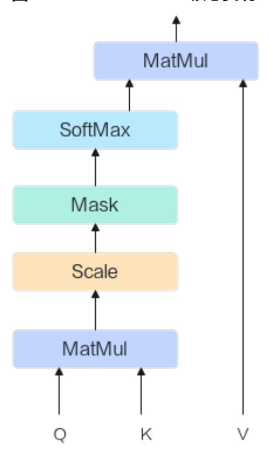

## 融合算子使用场景和优势

针对有数据依赖的矢量算子和矩阵算子,可以通过融合算子编程的方式,将矢量算子 和矩阵算子进行融合,通过一个算子kernel函数来承载,由此来获得性能上的收益。 下图展示了独立矢量算子和矩阵算子、Mix融合算子的执行耗时对比,由此可以看出为 什么开发Mix融合算子会带来性能上的收益。

图 **6-53** 独立矢量算子和矩阵算子、Mix 融合算子的执行耗时对比

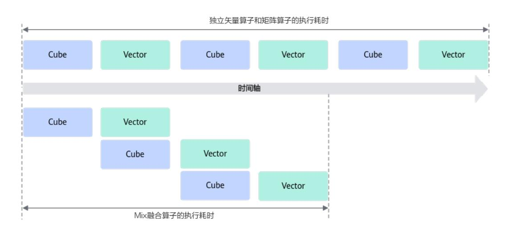

- 独立的矢量算子和矩阵算子实现:矩阵计算后的结果需要搬运到Global Memory 上,然后由Global Memory搬运到Local Memory,再进行矢量算子的计算,计算 和搬运都是串行执行,另外多个算子的调度执行,会增加算子的调度耗时。
- 融合算子的实现方法:可以对数据进行切片,再通过流水的设计,使得矢量计算 单元和矩阵计算单元实现并行计算;另外相比于不融合的单算子,减少了算子的 调度耗时。

除了有效提升算子性能,充分发挥AI处理器的算力,融合算子还有如下优势:

- 减少计算量:融合算子可以将多个算子合并为一个,简化计算过程,减少计算 量,提高计算效率。
- 减少内存占用:融合算子可以将多个算子的中间结果合并为一个,从而减少内存 占用,提高内存利用率。
- 优化数据流:融合算子可以优化数据流,减少数据在不同算子之间的传输,从而 提高数据处理效率。
- 简化代码实现:融合算子可以简化代码实现,减少代码量,提高代码可读性和可 维护性。

总之,融合算子是一种优化计算的有效手段,可以提高计算效率和内存利用率,优化 数据流,简化代码实现。

## 编程范式

Ascend C提供融合算子的编程范式,方便开发者基于该范式表达融合算子的数据流, 快速实现自己的融合算子。

融合算子数据流指融合算子的输入输出在各存储位置间的流向。以一个典型的Cube和 Vector融合算子为例,逻辑位置间的数据流向如下图所示:

- Cube的输出可以作为Vector的输入:CO2->VECIN
- Vector的输出可以作为Cube的输入:VECOUT->A1->A2、VECOUT->B1->B2

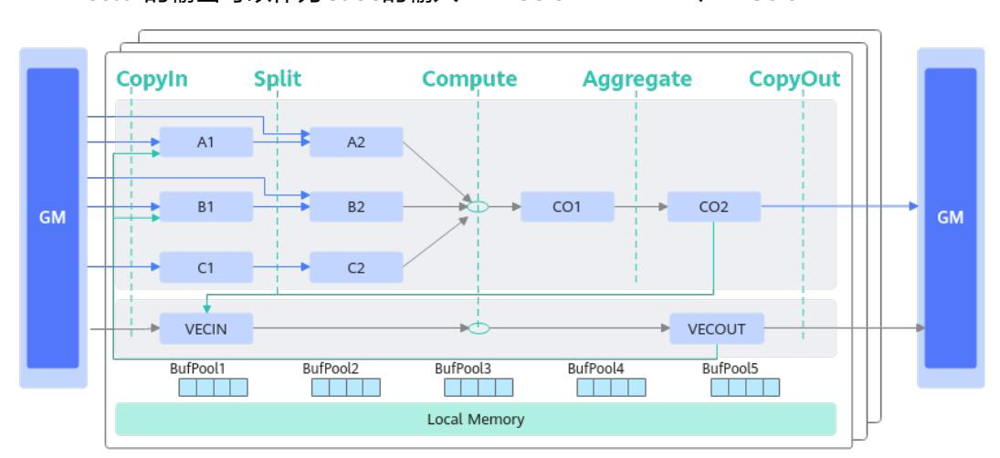

基于Matmul高阶API的融合算子编程范式,对上述数据流简化表达如下:

<span id="page-187-0"></span>图 **6-54** 融合算子编程范式

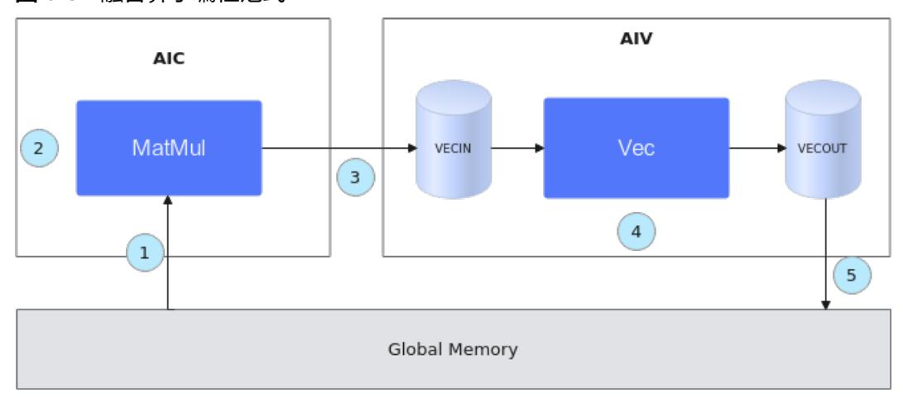

- 1. 初始化一个MatMul对象,将输入数据从Global Memory搬运到Cube核上。
- 2. 进行MatMul内部的计算。
- 3. 将MatMul的计算结果搬运到Vector核上。
- 4. 进行Vector矢量计算。
- 5. 将输出结果搬运到Global Memory上。

整个过程的示例代码如下(伪代码)。完整样例请参考**[MatmulLeakyRelu](https://gitee.com/ascend/samples/tree/v1.5-8.2.RC1/operator/ascendc/0_introduction/13_matmulleakyrelu_kernellaunch/MatmulLeakyReluInvocation)**。

```
template<typename aType, typename bType, typename cType, typename biasType>
__aicore__ inline void MatmulLeakyKernel<aType, bType, cType, biasType>::Process()
{
 // 步骤1:初始化一个MatMul对象,将输入数据从Global Memory搬运到Cube核上。
 uint32_t computeRound = 0;
 REGIST_MATMUL_OBJ(&pipe, GetSysWorkSpacePtr(), matmulObj);
 matmulObj.Init(&tiling);
 matmulObj.SetTensorA(aGlobal);
 matmulObj.SetTensorB(bGlobal);
 matmulObj.SetBias(biasGlobal);
 while (matmulObj.template Iterate<true>()) { // 步骤2:进行MatMul内部的计算。
 // 步骤3:将MatMul的计算结果搬运到Vector核上。
 reluOutLocal = reluOutQueue_.AllocTensor<cType>();
 matmulObj.template GetTensorC<true>(reluOutLocal, false, true);
 // 步骤4:进行Vector矢量计算。
 AscendC::LeakyRelu(reluOutLocal, reluOutLocal, (cType)alpha, tiling.baseM * tiling.baseN);
 reluOutQueue_.EnQue(reluOutLocal);
 // 步骤5:将输出结果搬运到Global Memory上
 reluOutQueue_.DeQue<cType>();
 ...
 AscendC::DataCopy(cGlobal[startOffset], reluOutLocal, copyParam);
 reluOutQueue_.FreeTensor(reluOutLocal);
 computeRound++;
 }
 matmulObj.End();
}
```

## **6.5.2** 算子实现

下文将以Matmul+LeakyRelu融合算子的实现为例,介绍Mix融合算子的设计和实现流 程。该样例仅支持在**Atlas A2** 训练系列产品**/Atlas 800I A2** 推理产品**/A200I A2 Box** 异构组件上运行。

算子的设计过程分为算子分析、数据流分析、**Tiling**策略设计三部分。

## 算子分析

算子分析是指明确算子的数学表达式、输入、输出,核函数的名称等信息。

步骤**1** 明确算子的数学表达式及计算逻辑。该算子的计算逻辑为,先进行一个矩阵乘操作, 然后将矩阵乘的结果与一个alpha参数进行LeakyRelu操作。数学表达式如下: c = LeakyRelu(a \* b + bias, alpha);

### 步骤**2** 明确输入和输出。

- MatMul+Leakyrelu算子输入为a、b、bias,输出为c。alpha作为激活函数 LeakyRelu的系数,为固定值,可以在算子实现中直接使用常数值参与计算。
- 本样例中算子输入a、b支持的数据类型为half(float16),算子输入bias支持的 数据类型为float32,算子输出c的数据类型为float32。
- 输入矩阵a的形状为[M,K],输入矩阵b的形状为[K, N],输出矩阵c的形状为 [M,N],输入bias的形状为[1, N]。
- 算子输入输出支持的数据格式为:ND。

### 步骤**3** 确定核函数名称和参数。

- 您可以自定义核函数名称,本样例中核函数命名为matmul\_leakyrelu\_custom。
- 根据对算子输入输出的分析,确定核函数的参数a,b,bias,c;a,b, bias为输 入在Global Memory上的内存地址,c为输出在Global Memory上的内存地址。

### **----**结束

表 **6-10** Ascend C MatMul+Leakyrelu 算子设计规格

| 算子类型<br>(OpType) | MATMUL_LEAKYRELU        |        |           |        |
|------------------|-------------------------|--------|-----------|--------|
| 算子输入             | name                    | shape  | data type | format |
|                  | a                       | [M, K] | half      | ND     |
|                  | b                       | [K, N] | half      | ND     |
|                  | bias                    | [1, N] | float32   | -      |
| 算子输出             | c                       | [M, N] | float32   | ND     |
| 核函数名称            | matmul_leakyrelu_custom |        |           |        |

## 数据流分析

进行算子的数据流分析:数据流向为在Cube核上完成Matmul计算后将数据搬运至 Vector核进行LeakyRelu计算。根据上述数据流并结合融合算子的编程范式,规划并行 的流水任务。如下图所示:


步骤**1** 将输入数据从Global Memory搬运到Cube核。

步骤**2** 进行MatMul内部的计算,计算公式和计算示意图如下:

注:bias的shape为[1, N],对A\*B结果矩阵的每一行都采用该bias进行偏置。

### 图 **6-55** Matmul 矩阵乘示意图

$$\begin{array}{c|ccccccccccccccccccccccccccccccccccc$$

步骤**3** 将MatMul的计算结果搬运到Vector核。

步骤**4** 进行Vector矢量计算,该样例中进行LeakyReLU计算。

Leaky ReLU(带泄露线性整流函数)激活函数,是人工神经网络中一种常用的激活函 数,其数学表达式和函数图像如下所示:

$$f(x_i) = \begin{cases} x_i & \text{if } x_i \ge 0 \\ ax_i & \text{if } x_i < 0 \end{cases}$$

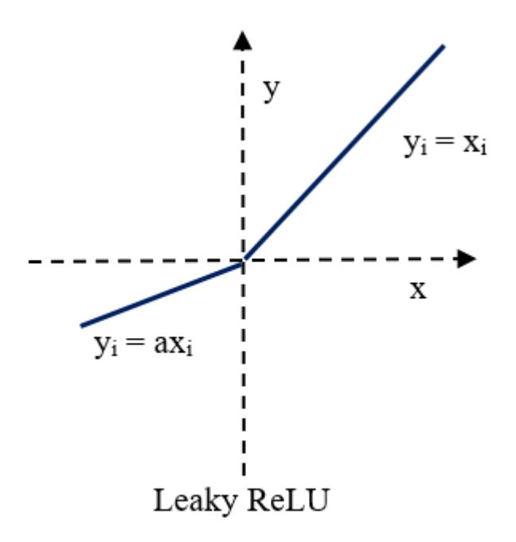

步骤**5** 将输出结果搬运到Global Memory。

### **----**结束

前三步的内容都封装在Matmul高阶API内,本样例中可以简化为3个stage。如下图所 示:

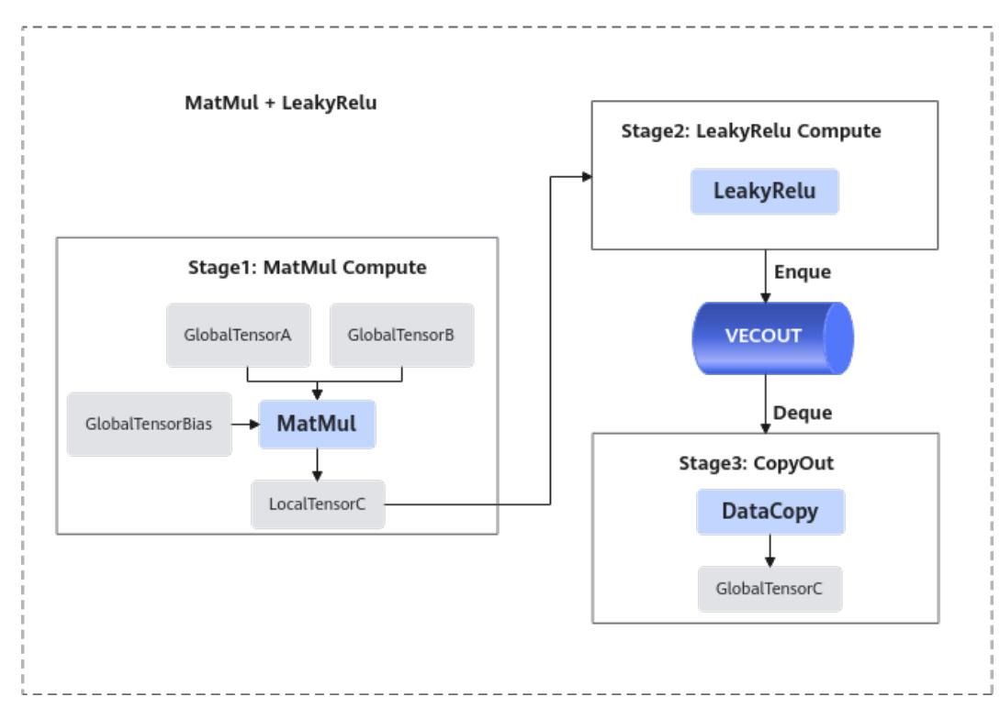

根据上述分析,明确实现过程中会使用到**[Matmul](#page-1410-0)**高阶**API**接口,**[LeakyRelu Vector](#page-632-0)**计 [算接口](#page-632-0)、**[14.1.4.3.1 DataCopy](#page-868-0)**、 **[EnQue](#page-984-0)**、 **[DeQue](#page-985-0)**接口。

## **Tiling** 策略设计

Tiling策略的设计主要包括多核切分和核内切分策略。

- 多核切分: 根据当前核数,对输入shape的M, K, N进行多核切分,得到单核内 shape大小singleCoreM, singleCoreK, singleCoreN。
- 核内切分: 根据Local Memory的大小约束,对单核内的shape大小进一步切分,得 到A、B、C矩阵参与一次矩阵乘指令的shape大小baseM, baseN, baseK。切分时 需要注意:GetTensorC的结果如果放在LocalMemory(UB)上,需要注意, baseM \* baseN的大小不能超出UB的限制。

切分策略示意图如下,更多切分策略相关原理请参[考数据分块\(](#page-136-0)**Tiling**)。

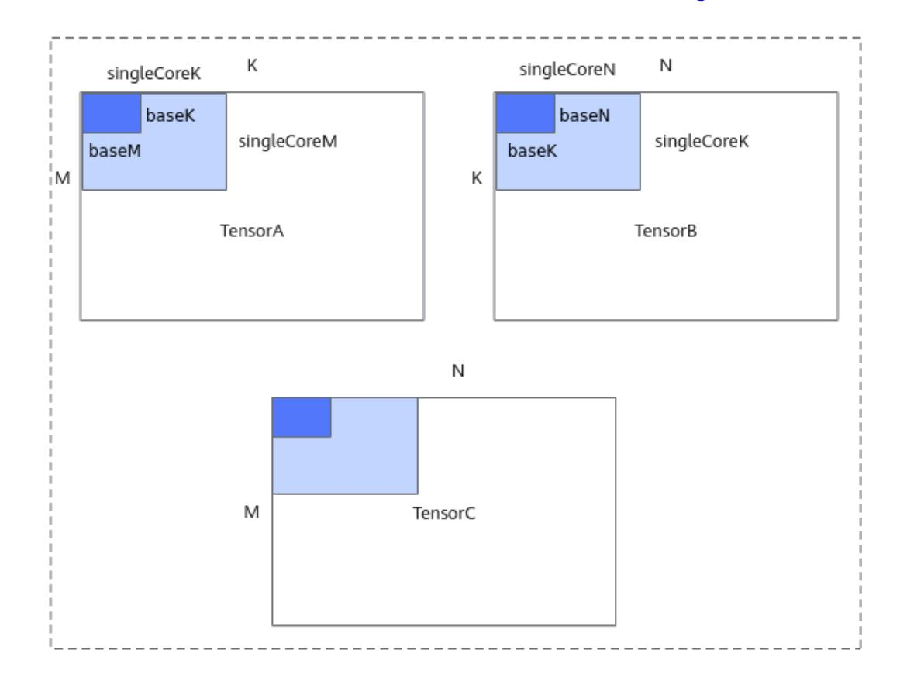

## 算子实现

[在矩阵编程章节](#page-133-0),我们得知Ascend C提供一组Matmul高阶API,封装了常用的切分和 数据搬运、计算的算法逻辑,方便用户快速实现Matmul矩阵乘法的运算操作。融合算 子中矩阵编程部分的实现与之类似,开发者在host侧通过调用API自动获取Tiling参 数,该参数传递到kernel侧后,在初始化操作时传入,通过几个简单的API即可完成矩 阵乘操作。再结合上文的融合算子的编程范式,融合算子实现的步骤如下。完整样例 请参考**[MatmulLeakyRelu](https://gitee.com/ascend/samples/tree/v1.5-8.2.RC1/operator/ascendc/0_introduction/13_matmulleakyrelu_kernellaunch/MatmulLeakyReluInvocation)**。

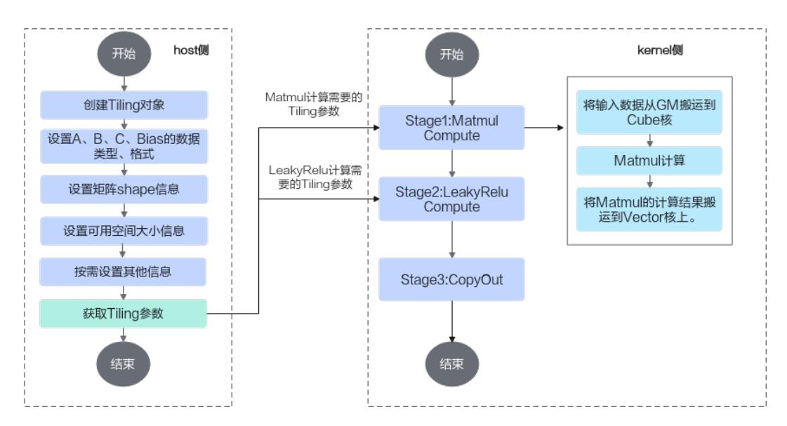

kernel侧实现的代码框架如下,在完成Matmul对象的初始化、左矩阵A、右矩阵B、 Bias的设置后,通过单次Iterate叠加while循环的方式完成后续的Matmul计算、 LeakyRelu计算、CopyOut流程。

```
template<typename aType, typename bType, typename cType, typename biasType>
__aicore__ inline void MatmulLeakyKernel<aType, bType, cType, biasType>::Process(){
 uint32_t computeRound = 0;
 // Matmul对象初始化
 REGIST_MATMUL_OBJ(&pipe, GetSysWorkSpacePtr(), matmulObj);
 // 设置Matmul的输入(包括左矩阵、右矩阵、bias)
 matmulObj.Init(&tiling);
 matmulObj.SetTensorA(aGlobal);
 matmulObj.SetTensorB(bGlobal);
 matmulObj.SetBias(biasGlobal);
 // 调用matmul iterate获取一块[baseM, baseN]的计算结果
 while (matmulObj.template Iterate<true>())
 {
 MatmulCompute();
 LeakyReluCompute();
 CopyOut(computeRound);
 computeRound++;
 }
 matmulObj.End();
}
```

Matmul计算、LeakyRelu计算、CopyOut的具体实现代码如下:

### 步骤**1** Matmul计算:

- 1. 将输入数据从Global Memory搬运到Cube核。
- 2. 进行MatMul内部的计算。
- 3. 将MatMul的计算结果搬运到Vector核。

```
template<typename aType, typename bType, typename cType, typename biasType>
__aicore__ inline void MatmulLeakyKernel<aType, bType, cType, biasType>::Process(){
 uint32_t computeRound = 0;
 // ...
 // 调用matmul iterate获取一块[baseM, baseN]的计算结果
 while (matmulObj.template Iterate<true>())
 {
 MatmulCompute();
 // ...
 computeRound++;
 }
```

```
 matmulObj.End();
}
template<typename aType, typename bType, typename cType, typename biasType>
__aicore__ inline void MatmulLeakyKernel<aType, bType, cType, biasType>::MatmulCompute(){
 reluOutLocal = reluOutQueue_.AllocTensor<cType>();
 // 调用GetTensorC将Matmul的计算结果搬运到Vector核。
 matmulObj.template GetTensorC<true>(reluOutLocal, false, true);
}
```

### 步骤**2** LeakyRelu计算。

```
// 调用LeakyRule接口进行计算
template<typename aType, typename bType, typename cType, typename biasType>
__aicore__ inline void MatmulLeakyKernel<aType, bType, cType, biasType>::LeakyReluCompute(){
 AscendC::LeakyRelu(reluOutLocal, reluOutLocal, (cType)alpha, tiling.baseM * tiling.baseN);
 reluOutQueue_.EnQue(reluOutLocal);
}
```

### 步骤**3** CopyOut,将输出结果搬运到Global Memory。

```
// 将结果搬出到GM
template<typename aType, typename bType, typename cType, typename biasType>
__aicore__ inline void MatmulLeakyKernel<aType, bType, cType, biasType>::CopyOut(uint32_t count){
 reluOutQueue_.DeQue<cType>();
 const uint32_t roundM = tiling.singleCoreM / tiling.baseM;
 const uint32_t roundN = tiling.singleCoreN / tiling.baseN;
 uint32_t startOffset = (count % roundM * tiling.baseM * tiling.N + count / roundM * tiling.baseN);
 AscendC::DataCopyParams copyParam = {(uint16_t)tiling.baseM,
 (uint16_t)(tiling.baseN * sizeof(cType) / DEFAULT_C0_SIZE), 0,
 (uint16_t)((tiling.N - tiling.baseN) * sizeof(cType) / DEFAULT_C0_SIZE)};
 AscendC::DataCopy(cGlobal[startOffset], reluOutLocal, copyParam);
 reluOutQueue_.FreeTensor(reluOutLocal);
}
```

### **----**结束

host侧自动获取Tiling参数的关键步骤介绍如下:

### 步骤**1** 创建**Tiling**对象。

auto ascendcPlatform = platform\_ascendc::PlatformAscendC(context->GetPlatformInfo()); matmul\_tiling::MultiCoreMatmulTiling cubeTiling(ascendcPlatform);

创建对象时需要传入硬件平台信息,硬件平台信息可以通过**[14.2.2.23.25](#page-2577-0) [GetPlatformInfo](#page-2577-0)**获取。

### 步骤**2** 设置**A**、**B**、**Bias**的数据类型和格式。

设置示例如下,其中TPosition::LCM是Unified Buffer上的逻辑位置,等同于 TPosition::VECCALC,关于TPosition的详细内容请参考**[TPosition](#page-1056-0)**。

```
cubeTiling.SetAType(matmul_tiling::TPosition::GM, matmul_tiling::CubeFormat::ND, 
matmul_tiling::DataType::DT_FLOAT16);
cubeTiling.SetBType(matmul_tiling::TPosition::GM, matmul_tiling::CubeFormat::ND, 
matmul_tiling::DataType::DT_FLOAT16);
```

cubeTiling.SetCType(matmul\_tiling::TPosition::LCM, matmul\_tiling::CubeFormat::ND, matmul\_tiling::DataType::DT\_FLOAT);

cubeTiling.SetBiasType(matmul\_tiling::TPosition::GM, matmul\_tiling::CubeFormat::ND, matmul\_tiling::DataType::DT\_FLOAT);

### 步骤**3** 设置矩阵**shape**信息。

cubeTiling.SetShape(M, N, K); cubeTiling.SetOrgShape(M, N, K);

### 步骤**4** 设置可用空间大小信息。

设置**Matmul**计算时可用的**L1 Buffer/L0C Buffer/Unified Buffer**空间大小,**-1**表示 **AI**处理器对应**Buffer**的大小。

cubeTiling.SetBufferSpace(-1, -1, -1);

### <span id="page-194-0"></span>步骤**5** 按需设置其他参数,比如设置**bias**参与计算。

cubeTiling.SetBias(true);

### 步骤**6** 获取**Tiling**参数。

```
MatmulLeakyreluCustomTilingData tiling;
if (cubeTiling.GetTiling(tiling.cubeTilingData) == -1){
 return ge::GRAPH_FAILED;
}
```

### 步骤**7** Tiling参数的序列化保存等其他操作。

### **----**结束

### 说明

- 特别的对于多核场景,需要通过SetDim接口设置Matmul计算所用的核数,MIX模式(包含 矩阵计算和矢量计算)的设置规则如下:
  - 分离架构:Matmul API都是从AIV侧发起的,调用Iterate计算时在AIV侧只会起到通知 的作用,通知AIC去做矩阵计算,计算完成后AIC告知AIV计算完成。这个架构下, SetBlockDim设置为实际计算会用到的AI Core(AIC、AIV组合)的数量,SetDim设置 为实际计算会用到的AIV的数量。例如,SetBlockDim时可以设置为20,启动20个AI Core(AIC AIV的组合),SetDim设置为40,表示按照40个AIV进行切分。
  - 耦合架构:SetBlockDim加载的核数就是Matmul API实际计算会用到的核数,SetDim 和SetBlockDim设置的值是一样的。
- Matmul高阶API内部实现时需要使用系统workspace,开发者需要:
  - 在host侧Tiling实现时,设置总的workspace的数值大小(包含用户workspace和系统 workspace),workspace空间由框架来申请并管理。系统workspace的空间大小通过 **[GetLibApiWorkSpaceSize](#page-2249-0)**获取。

```
size_t userWorkspaceSize = 0;
size_t systemWorkspaceSize = ascendcPlatform.GetLibApiWorkSpaceSize();
size_t *currentWorkspace = context->GetWorkspaceSizes(1);
currentWorkspace[0] = userWorkspaceSize + systemWorkspaceSize;
```

● 若算子工程不是[自定义算子工程,](#page-213-0)也不是带有**[-DHAVE\\_WORKSPACE](#page-203-0)**编译宏的Kernel 直调算子工程,kernel侧需要在Matmul初始化前,通过 **[SetSysWorkSpace](#page-1020-0)**设置系统 workspace。

```
// 使用Matmul时必须设置workspace空间 
SetSysWorkspace(workspace);
if (GetSysWorkSpacePtr() == nullptr) {
 return;
}
```

## **6.6 Kernel** 直调算子开发

## **6.6.1** 概述

开发者完成**kernel**侧算子实现和**host**侧**tiling**实现后,即可通过AscendCL运行时接 口,完成算子kernel直调。该方式下tiling开发不受CANN框架的限制,简单直接,多 用于算子功能的快速验证。

Kernel直调算子开发流程如下图所示:

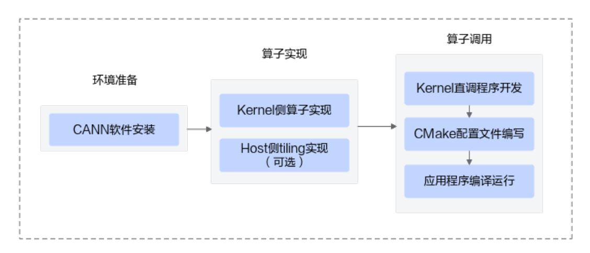

### 步骤**1** 环境准备

CANN软件安装请参考**2** [环境准备。](#page-52-0)

### 步骤**2** 算子实现

Kernel侧算子实现和host侧tiling实现请参考**6** [算子实现](#page-91-0)。

### 步骤**3** 算子调用

完成kernel直调程序的开发、CMake配置文件的编写后,按照如下**kernel**直调工程 (如下工程结构仅为示例)组织相关代码文件,最后完成应用程序编译及运行。

```
|-- cmake // CMake编译文件
|-- CMakeLists.txt // CMake编译配置文件
|-- my_add.cpp // Kernel侧算子实现
|-- main.cpp // Kernel直调程序
```

### **----**结束

Kernel直调分为CPU侧/NPU侧调用两种:

- **CPU**侧主要通过ICPU\_RUN\_KF CPU调测宏等CPU调测库提供的接口来完成;
- **NPU**侧主要通过使用Kernel Launch接口或者<<<>>>内核调用符,以及AscendCL API提供的运行时接口来完成。

CPU侧和NPU侧的kernel直调原理图如下:

### 图 **6-56** CPU 侧和 NPU 侧的 kernel 直调原理图

<span id="page-196-0"></span>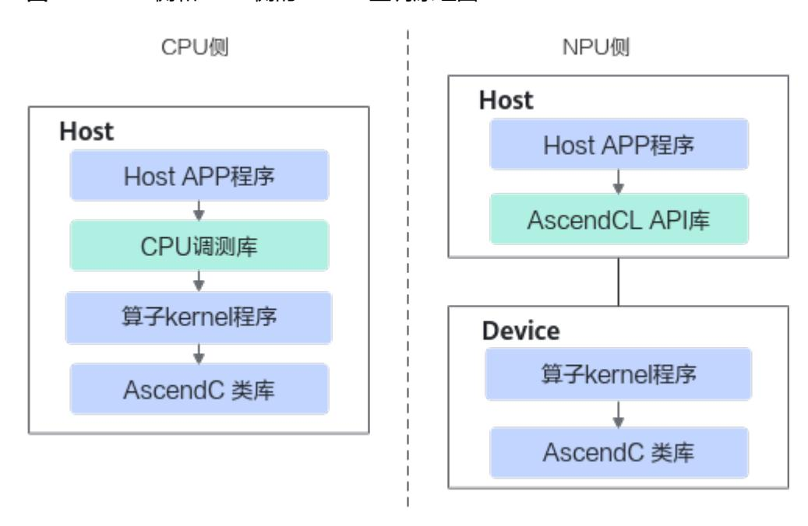

您可以根据下文**[6.6.2 Kernel](#page-198-0)**直调的介绍来完成基本的运行验证流程,流程中使用到接 口请参考:

- CPU侧kernel直调请参[考调测接口](#page-2395-0)。
- NPU侧kernel直调分为**Kernel Launch**方式[和内核调用符方式。](#page-197-0)
- AscendCL API使用方法请参考《**AscendCL**[应用开发指南](https://www.hiascend.com/document/detail/zh/CANNCommunityEdition/82RC1/appdevg/acldevg/aclcppdevg_000000.html) **(C&C++)**》"acl API参 考"章节。

基于NPU域算子调用编写的算子程序,通过毕昇编译器编译后运行,可以完成算子 NPU域的运行验证;基于CPU域算子的调用接口(ICPU\_RUN\_KF)编写的算子程序, 通过标准的GCC编译器进行编译后运行,可以完成算子CPU域的运行验证。

CPU侧的运行程序,通过GDB通用调试工具进行单步调试,精准验证程序执行流程是 否符合预期。如果您想进一步了解CPU侧调试的具体内容,可在完成本节内容的学习 后参考**[7.2 CPU](#page-252-0)**域调试。

## **Kernel Launch** 方式

### 须知

当前版本暂不支持获取用户workspace特性。

ACLRT\_LAUNCH\_KERNEL调用接口的使用方法如下:

ACLRT\_LAUNCH\_KERNEL(kernel\_name)(blockDim, stream, argument list);

- kernel\_name:算子核函数的名称。
- blockDim:规定了核函数将会在几个核上执行。每个执行该核函数的核会被分配 一个逻辑ID,即block\_idx,可以在核函数的实现中调用**[14.1.4.6.2 GetBlockIdx](#page-1065-0)**来 获取block\_idx。

- <span id="page-197-0"></span>● stream,类型为aclrtStream,stream用于维护一些异步操作的执行顺序,确保按 照应用程序中的代码调用顺序在Device上执行。stream创建等管理接口请参考 《**AscendCL**[应用开发指南](https://www.hiascend.com/document/detail/zh/CANNCommunityEdition/82RC1/appdevg/acldevg/aclcppdevg_000000.html) **(C&C++)**》中的"AscendCL API参考 > 运行时管理 > Stream管理"章节。
- argument list:参数列表,与核函数的参数列表保持一致。

考虑名为add\_custom的核函数调用的例子,该函数实现两个矢量的相加,调用示例如 下:

// blockDim设置为8表示在8个核上调用了add\_custom核函数,每个核都会独立且并行地执行该核函数,该核函 数的参数列表为x,y,z。

**ACLRT\_LAUNCH\_KERNEL(add\_custom)(8, stream, x, y, z)**

## 内核调用符方式

核函数可以使用内核调用符<<<...>>>这种语法形式,来规定核函数的执行配置:

kernel\_name<<<blockDim, l2ctrl, stream>>>(argument list);

● blockDim,规定了核函数将会在几个核上执行。每个执行该核函数的核会被分配 一个逻辑ID,即block\_idx,可以在核函数的实现中调用**[14.1.4.6.2 GetBlockIdx](#page-1065-0)**来 获取block\_idx;

### 说明

blockDim是逻辑核的概念,取值范围为[1,65535]。为了充分利用硬件资源,一般设置为 物理核的核数或其倍数。对于耦合架构和分离架构,blockDim在运行时的意义和设置规则 有一些区别,具体说明如下:

- 耦合架构:由于其Vector、Cube单元是集成在一起的,blockDim用于设置启动多个 AICore核实例执行,不区分Vector、Cube。AI Core的核数可以通过**[GetCoreNumAiv](#page-2245-0)** 或者**[GetCoreNumAic](#page-2244-0)**获取。
- 分离架构
  - 针对仅包含Vector计算的算子,blockDim用于设置启动多少个Vector(AIV)实例 执行,比如某款AI处理器上有40个Vector核,建议设置为40。
  - 针对仅包含Cube计算的算子,blockDim用于设置启动多少个Cube(AIC)实例执 行,比如某款AI处理器上有20个Cube核,建议设置为20。
  - 针对Vector/Cube融合计算的算子,启动时,按照AIV和AIC组合启动,blockDim 用于设置启动多少个组合执行,比如某款AI处理器上有40个Vector核和20个Cube 核,一个组合是2个Vector核和1个Cube核,建议设置为20,此时会启动20个组 合,即40个Vector核和20个Cube核。注意:该场景下,设置的**blockDim**逻辑核 的核数不能超过物理核(**2**个**Vector**核和**1**个**Cube**核组合为**1**个物理核)的核数。
  - AIC/AIV的核数分别通过**[GetCoreNumAic](#page-2244-0)**和**[GetCoreNumAiv](#page-2245-0)**接口获取。
- l2ctrl,保留参数,暂时设置为固定值nullptr,开发者无需关注;
- stream,类型为aclrtStream,stream用于维护一些异步操作的执行顺序,确保按 照应用程序中的代码调用顺序在device上执行。stream创建等管理接口请参考 《**AscendCL**[应用开发指南](https://www.hiascend.com/document/detail/zh/CANNCommunityEdition/82RC1/appdevg/acldevg/aclcppdevg_000000.html) **(C&C++)**》中的"AscendCL API参考 > 运行时管理 > Stream管理"章节。

考虑名为add\_custom的核函数调用的例子,该函数实现两个矢量的相加,调用示例如 下:

// blockDim设置为8表示在8个核上调用了add\_custom核函数,每个核都会独立且并行地执行该核函数,该核函 数的参数列表为x,y,z。 add\_custom<<<8, nullptr, stream>>>(x, y, z);

内核调用符进行核函数调用的详细示例可参见[核函数定义和调用。](#page-78-0)

核函数的调用是异步的,核函数的调用结束后,控制权立刻返回给主机端,可以调用 以下**aclrtSynchronizeStream**函数来强制主机端程序等待所有核函数执行完毕。

aclError aclrtSynchronizeStream(aclrtStream stream);

## <span id="page-198-0"></span>**6.6.2 Kernel** 直调

为了帮助开发者快速的完成算子的Kernel直调,方便开发者调试调优,提供Kernel直调 算子工程,您可以基于该算子工程中的样例代码和工程框架进行算子开发。算子工程 提供的功能如下:

- 该工程支持**[printf](#page-2383-0)**功能、**[DumpTensor](#page-2379-0)**功能。
- 通过该工程编译生成的应用程序。可以通过msProf命令行方式采集和解析性能数 据。性能分析工具的具体使用方法请参考[《性能调优工具用户指南](https://www.hiascend.com/document/detail/zh/CANNCommunityEdition/82RC1/devaids/Profiling/atlasprofiling_16_0001.html)》。

算子样例工程请通过如下链接获取:

- [矢量算子样例](https://gitee.com/ascend/samples/tree/master/operator/ascendc/0_introduction/3_add_kernellaunch/AddKernelInvocationNeo)
- 支持**Tiling**[的矢量算子样例](https://gitee.com/ascend/samples/tree/master/operator/ascendc/0_introduction/3_add_kernellaunch/AddKernelInvocationTilingNeo)
- [矩阵算子样例](https://gitee.com/ascend/samples/tree/v1.5-8.2.RC1/operator/ascendc/0_introduction/11_matmul_kernellaunch/MatmulInvocationNeo)
- 矢量**+**[矩阵融合算子样例](https://gitee.com/ascend/samples/tree/v1.5-8.2.RC1/operator/ascendc/0_introduction/13_matmulleakyrelu_kernellaunch/MatmulLeakyReluInvocation)

基于Kernel直调工程的算子开发流程图如下:

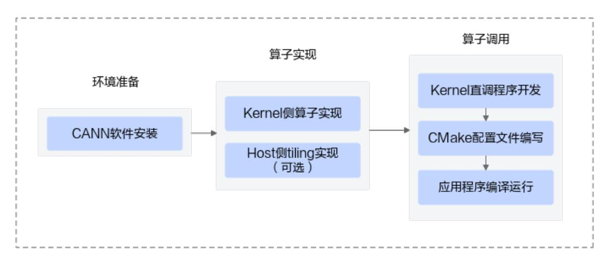

下文将以Add矢量算子为例对算子工程进行详细介绍。

## 环境准备

- 使用Kernel Launch算子工程之前,需要参考**2** [环境准备章](#page-52-0)节安装驱动固件和 CANN软件包,完成开发环境和运行环境的准备。
- 使用该算子工程要求cmake版本为3.16及以上版本,如不符合要求,请参考如下 的命令示例更新cmake版本,如下示例以更新到3.16.0版本为例。

wget https://cmake.org/files/v3.16/cmake-3.16.0.tar.gz tar -zxvf cmake-3.16.0.tar.gz cd cmake-3.16.0 ./bootstrap --prefix=/usr sudo make sudo make install

## <span id="page-199-0"></span>工程目录

您可以单[击矢量算子样例](https://gitee.com/ascend/samples/tree/master/operator/ascendc/0_introduction/3_add_kernellaunch/AddKernelInvocationNeo),获取核函数开发和运行验证的完整样例。样例目录结构如 下所示:

```
AddKernelInvocationNeo
|-- cmake // CMake编译文件
|-- scripts
| ├── gen_data.py // 输入数据和真值数据生成脚本文件
| ├── verify_result.py // 验证输出数据和真值数据是否一致的验证脚本
|-- CMakeLists.txt // CMake编译配置文件
|-- add_custom.cpp // 矢量算子kernel实现
|-- data_utils.h // 数据读入写出函数
|-- main.cpp // 主函数,调用算子的应用程序,含CPU域及NPU域调用
|-- run.sh // 编译运行算子的脚本
```

### 基于该算子工程,开发者进行算子开发的步骤如下:

- 完成算子kernel侧实现。
- 编写算子调用应用程序main.cpp。
- 编写CMake编译配置文件CMakeLists.txt。
- 根据实际需要修改输入数据和真值数据生成脚本文件gen\_data.py;验证输出数据 和真值数据是否一致的验证脚本verify\_result.py。
- 根据实际需要修改编译运行算子的脚本run.sh并执行该脚本,完成算子的编译运 行和结果验证。

## 算子 **kernel** 侧实现

请参考**6.2** [矢量编程](#page-92-0)和工程目录中的矩阵算子、融合算子的kernel实现完成Ascend C算 子实现文件的编写。

## 算子调用应用程序

下面代码以固定shape的add\_custom算子为例,介绍算子核函数调用的应用程序 main.cpp如何编写。您在实现自己的应用程序时,需要关注由于算子核函数不同带来 的修改,包括算子核函数名,入参出参的不同等,合理安排相应的内存分配、内存拷 贝和文件读写等,相关API的调用方式直接复用即可。

步骤**1** 按需包含头文件,通过ASCENDC\_CPU\_DEBUG宏区分CPU/NPU侧需要包含的头文 件。需要注意的是,NPU侧需要包含对应的核函数调用接口声明所在的头文件 aclrtlaunch\_{kernel\_name}.h(该头文件为工程框架自动生成),kernel\_name为算 子核函数的名称。

```
#include "data_utils.h"
#ifndef ASCENDC_CPU_DEBUG
#include "acl/acl.h"
#include "aclrtlaunch_add_custom.h"
#else
#include "tikicpulib.h"
extern "C" __global__ __aicore__ void add_custom(GM_ADDR x, GM_ADDR y, GM_ADDR z);
#endif
```

步骤**2** 应用程序框架编写。该应用程序通过ASCENDC\_CPU\_DEBUG宏区分代码逻辑运行于 CPU侧还是NPU侧。

```
int32_t main(int32_t argc, char* argv[])
{
 uint32_t blockDim = 8;
 size_t inputByteSize = 8 * 2048 * sizeof(uint16_t);
 size_t outputByteSize = 8 * 2048 * sizeof(uint16_t);
```

```
#ifdef ASCENDC_CPU_DEBUG
 // 用于CPU调试的调用程序
#else
 // NPU侧运行算子的调用程序
#endif
 return 0;
}
```

步骤**3** CPU侧运行验证。完成算子核函数CPU侧运行验证的步骤如下:

### 图 **6-57** CPU 侧运行验证步骤

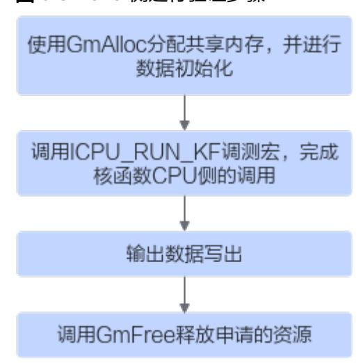

```
 // 使用GmAlloc分配共享内存,并进行数据初始化
 uint8_t* x = (uint8_t*)AscendC::GmAlloc(inputByteSize);
 uint8_t* y = (uint8_t*)AscendC::GmAlloc(inputByteSize);
 uint8_t* z = (uint8_t*)AscendC::GmAlloc(outputByteSize);
 ReadFile("./input/input_x.bin", inputByteSize, x, inputByteSize);
 ReadFile("./input/input_y.bin", inputByteSize, y, inputByteSize);
 // 矢量算子需要设置内核模式为AIV模式
 AscendC::SetKernelMode(KernelMode::AIV_MODE);
 // 调用ICPU_RUN_KF调测宏,完成核函数CPU侧的调用
 ICPU_RUN_KF(add_custom, blockDim, x, y, z);
 // 输出数据写出
 WriteFile("./output/output_z.bin", z, outputByteSize);
 // 调用GmFree释放申请的资源
 AscendC::GmFree((void *)x);
 AscendC::GmFree((void *)y);
 AscendC::GmFree((void *)z);
```

步骤**4** NPU侧运行验证。完成算子核函数NPU侧运行验证的步骤如下:

### 图 **6-58** NPU 侧运行验证步骤

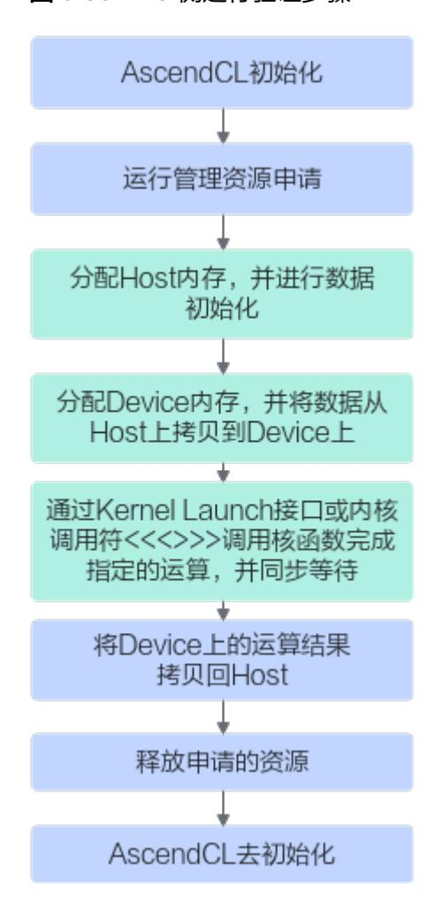

```
 // AscendCL初始化
 CHECK_ACL(aclInit(nullptr));
 // 运行管理资源申请
 int32_t deviceId = 0;
 CHECK_ACL(aclrtSetDevice(deviceId));
 aclrtStream stream = nullptr;
 CHECK_ACL(aclrtCreateStream(&stream));
 // 分配Host内存
 uint8_t *xHost, *yHost, *zHost;
 uint8_t *xDevice, *yDevice, *zDevice;
 CHECK_ACL(aclrtMallocHost((void**)(&xHost), inputByteSize));
 CHECK_ACL(aclrtMallocHost((void**)(&yHost), inputByteSize));
 CHECK_ACL(aclrtMallocHost((void**)(&zHost), outputByteSize));
 // 分配Device内存
 CHECK_ACL(aclrtMalloc((void**)&xDevice, inputByteSize, ACL_MEM_MALLOC_HUGE_FIRST));
 CHECK_ACL(aclrtMalloc((void**)&yDevice, inputByteSize, ACL_MEM_MALLOC_HUGE_FIRST));
 CHECK_ACL(aclrtMalloc((void**)&zDevice, outputByteSize, ACL_MEM_MALLOC_HUGE_FIRST));
 // Host内存初始化
 ReadFile("./input/input_x.bin", inputByteSize, xHost, inputByteSize);
 ReadFile("./input/input_y.bin", inputByteSize, yHost, inputByteSize);
 // 将数据从Host上拷贝到Device上
 CHECK_ACL(aclrtMemcpy(xDevice, inputByteSize, xHost, inputByteSize, 
ACL_MEMCPY_HOST_TO_DEVICE));
 CHECK_ACL(aclrtMemcpy(yDevice, inputByteSize, yHost, inputByteSize, 
ACL_MEMCPY_HOST_TO_DEVICE));
 // 用ACLRT_LAUNCH_KERNEL接口调用核函数完成指定的运算
 ACLRT_LAUNCH_KERNEL(add_custom)(blockDim, stream, xDevice, yDevice, zDevice);
```

```
 // 用内核调用符<<<>>>调用核函数完成指定的运算,add_custom_do中封装了<<<>>>调用
 // add_custom_do(blockDim, nullptr, stream, xDevice, yDevice, zDevice);
 CHECK_ACL(aclrtSynchronizeStream(stream));
 // 将Device上的运算结果拷贝回Host
 CHECK_ACL(aclrtMemcpy(zHost, outputByteSize, zDevice, outputByteSize, 
ACL_MEMCPY_DEVICE_TO_HOST));
 WriteFile("./output/output_z.bin", zHost, outputByteSize);
 // 释放申请的资源
 CHECK_ACL(aclrtFree(xDevice));
 CHECK_ACL(aclrtFree(yDevice));
 CHECK_ACL(aclrtFree(zDevice));
 CHECK_ACL(aclrtFreeHost(xHost));
 CHECK_ACL(aclrtFreeHost(yHost));
 CHECK_ACL(aclrtFreeHost(zHost));
 // AscendCL去初始化
 CHECK_ACL(aclrtDestroyStream(stream));
 CHECK_ACL(aclrtResetDevice(deviceId));
 CHECK_ACL(aclFinalize());
```

### **----**结束

## **CMake** 编译配置文件编写

本节会介绍CMake文件中一些关键环境变量和Cmake命令参数的说明,通常情况下不 需要开发者修改,但是这些参数可以帮助开发者更好的理解编译原理,方便有能力的 开发者对Cmake进行定制化处理。

### 表 **6-11** 环境变量说明

| 环境变量                         | 配置说明                                                                                                                                                                                                                                                     |
|------------------------------|----------------------------------------------------------------------------------------------------------------------------------------------------------------------------------------------------------------------------------------------------------|
| SOC_VERSION                  | AI处理器的型号。                                                                                                                                                                                                                                                |
|                              | ●<br>非Atlas A3 训练系列产品/Atlas A3 推理系列产品:在安装<br>昇腾AI处理器的服务器执行npu-smi info命令进行查询,获<br>取Name信息。实际配置值为AscendName,例如Name取<br>值为xxxyy,实际配置值为Ascendxxxyy。                                                                                                         |
|                              | ●<br>Atlas A3 训练系列产品/Atlas A3 推理系列产品:在安装昇<br>腾AI处理器的服务器执行npu-smi info -t board -i id -c<br>chip<br>id命令进行查询,获取Chip Name和NPU Name信<br>_<br>息,实际配置值为Chip Name_NPU Name。例如Chip<br>Name取值为Ascendxxx,NPU Name取值为1234,实际配<br>置值为Ascendxxx<br>1234。<br>_<br>其中: |
|                              | –<br>id:设备id,通过npu-smi info -l命令查出的NPU ID即<br>为设备id。                                                                                                                                                                                                     |
|                              | –<br>chip_id:芯片id,通过npu-smi info -m命令查出的Chip<br>ID即为芯片id。                                                                                                                                                                                                |
| ASCEND_CANN_P<br>ACKAGE_PATH | CANN软件包安装后的实际路径。                                                                                                                                                                                                                                         |
| CMAKE_BUILD_T                | 编译模式选项,可配置为:                                                                                                                                                                                                                                             |
| YPE                          | ●<br>"Release",Release版本,不包含调试信息,编译最终发<br>布的版本。                                                                                                                                                                                                          |
|                              | ●<br>"Debug",Debug版本,包含调试信息,便于开发者开发<br>和调试。                                                                                                                                                                                                              |

<span id="page-203-0"></span>

| 环境变量                                | 配置说明                                                                                                                                               |
|-------------------------------------|----------------------------------------------------------------------------------------------------------------------------------------------------|
| CMAKE_INSTALL_<br>PREFIX            | 用于指定CMAKE执行install时,安装的路径前缀,执行install<br>后编译产物(ascendc_library中指定的target以及对应的头文<br>件)会安装在该路径下。默认路径为当前目录的out目录下。                                    |
| CMAKE_CXX_CO<br>MPILER_LAUNCH<br>ER | 用于配置C++语言编译器(如g++)、毕昇编译器的启动器程序<br>为ccache,配置后即可开启cache缓存编译,加速重复编译并<br>提高构建效率。使用该功能前需要安装ccache。                                                     |
|                                     | 配置方法如下,在对应的CMakeLists.txt进行设置:<br>set(CMAKE_CXX_COMPILER_LAUNCHER <launcher_program>)</launcher_program>                                           |
|                                     | 其中 <launcher_program>是ccache的安装路径,比如ccache<br/>的安装路径为/usr/bin/ccache,示例如下:<br/>set(CMAKE_CXX_COMPILER_LAUNCHER /usr/bin/ccache)</launcher_program> |

### 表 **6-12** Cmake 命令语法说明

| Cmake命令         | 语法说明                                                                                                                                                                                        |
|-----------------|---------------------------------------------------------------------------------------------------------------------------------------------------------------------------------------------|
| add_executable  | 使用指定的源文件将可执行文件添加到项目中。和Cmake通用<br>的命令参数使用方法一致。                                                                                                                                               |
| ascendc_library | 使用指定的核函数源文件向项目(project)添加库。语法格式<br>如下:<br>ascendc_library( <target_name> [STATIC   SHARED]<br/>[<source/>])</target_name>                                                                   |
|                 | 其中 <target_name>表示库文件的名字,该库文件会根据命令<br/>里列出的源文件来建立。STATIC、SHARED的作用是指定生成<br/>的库文件的类型。STATIC库是目标文件的归档文件,在连接其<br/>它目标的时候使用。SHARED库会被动态连接(动态连接<br/>库),在运行时会被加载。<source/>表示核函数源文件。</target_name> |

<span id="page-204-0"></span>

| Cmake命令                         | 语法说明                                                                                                                                                                                                                                                                                                                                                                                                                                                                                                                                                                                                                                         |
|---------------------------------|----------------------------------------------------------------------------------------------------------------------------------------------------------------------------------------------------------------------------------------------------------------------------------------------------------------------------------------------------------------------------------------------------------------------------------------------------------------------------------------------------------------------------------------------------------------------------------------------------------------------------------------------|
| ascendc_compile_<br>definitions | 添加编译宏。可以添加Ascend C提供的编译宏和开发者自定义<br>的编译宏。语法格式如下:<br>ascendc_compile_definitions( <target_name> [PRIVATE]<br/>[<xxx>])</xxx></target_name>                                                                                                                                                                                                                                                                                                                                                                                                                                                                                                     |
|                                 | Ascend C提供的编译宏介绍如下:                                                                                                                                                                                                                                                                                                                                                                                                                                                                                                                                                                                                                          |
|                                 | ●<br>-DASCENDC_DUMP用于控制Dump开关,默认开关打开,<br>开发者调用printf/DumpTensor/assert后会有信息打印(需<br>要注意直调工程的kernel文件内存在host函数,如果在host<br>函数内调用了printf接口,也会触发kernel内的printf相关初<br>始化动作,进而影响kernel的执行性能);设置为0后,表示<br>开关关闭。示例如下:<br>// 关闭所有算子的printf打印功能<br>ascendc_compile_definitions(ascendc_kernels_\${RUN_MODE} PRIVATE<br>-DASCENDC_DUMP=0                                                                                                                                                                                                                                                                                                                 |
|                                 | )<br>●<br>-DASCENDC_DEBUG用于控制Ascend C API的调测开关,<br>默认开关关闭;增加该编译宏后,表示开关打开,此时接口<br>内部的assert校验生效,校验不通过会有assert日志打屏。<br>开启该功能会对算子实际运行的性能带来一定影响,通常在<br>调测阶段使用。示例如下:<br>ascendc_compile_definitions(ascendc_kernels_\${RUN_MODE} PRIVATE<br>-DASCENDC_DEBUG<br>)                                                                                                                                                                                                                                                                                                                                                                                  |
|                                 | 当前-DASCENDC_DEBUG功能支持的产品型号为:                                                                                                                                                                                                                                                                                                                                                                                                                                                                                                                                                                                                                 |
|                                 | Atlas 推理系列产品<br>Atlas A2 训练系列产品/Atlas 800I A2 推理产品/A200I A2<br>Box 异构组件                                                                                                                                                                                                                                                                                                                                                                                                                                                                                                                                                                      |
|                                 | ●<br>-DHAVE_WORKSPACE用于表示kernel入口是否包含<br>workspace入参。默认情况下为不包含;增加该编译宏后,<br>表示包含,此时框架会获取kernel入参的倒数第一个参数<br>(未配置-DHAVE_TILING),或倒数第二个参数(配置<br>DHAVE_TILING),自动在kernel侧设置系统workspace,<br>开发者在kernel侧入参处获取的workspace为偏移了系统<br>workspace后的用户workspace。当开发者使用了14.1.5.2.1<br>Matmul等需要系统workspace的高阶API时,建议开启此<br>参数,入参排布、系统workspace的设置逻辑与6.7 工程化<br>算子开发保持一致,可减少算子实现在不同开发方式间切换<br>带来的修改成本。需要注意的是,host侧开发者仍需要自行<br>申请workspace的空间,系统workspace大小可以通过<br>14.1.6.3.2 PlatformAscendCManager的<br>GetLibApiWorkSpaceSize接口获取。-<br>DHAVE_WORKSPACE的设置样例如下:<br>ascendc_compile_definitions(ascendc_kernels_\${RUN_MODE} PRIVATE<br>-DHAVE_WORKSPACE<br>) |
|                                 | ●<br>-DHAVE_TILING用于表示kernel入口是否含有tiling入参。<br>在配置了-DHAVE_WORKSPACE之后,此编译宏才会生效。<br>默认情况下为不包含,开关关闭;增加该编译宏后,表示包<br>含,此时框架会将kernel入参的最后一个参数当做tiling,<br>将倒数第二个参数当做workspace。框架不会对此tiling入<br>参做任何处理,仅通过该入参来判断workspace参数的位                                                                                                                                                                                                                                                                                                                                                                                                                      |

| Cmake命令                         | 语法说明                                                                                                                                                                                                    |
|---------------------------------|---------------------------------------------------------------------------------------------------------------------------------------------------------------------------------------------------------|
|                                 | 置,使用此编译宏可以和6.7 工程化算子开发保持入参一<br>致,减少算子实现在不同开发方式间切换带来的修改成本。<br>设置样例如下:<br>ascendc_compile_definitions(ascendc_kernels_\${RUN_MODE} PRIVATE<br>-DHAVE_WORKSPACE<br>-DHAVE_TILING<br>)                      |
| ascendc_compile_<br>options     | 添加编译选项。可以添加相应的编译选项用于host侧与device<br>侧的编译过程。语法格式如下:<br>ascendc_compile_options(ascendc_kernels_\${RUN_MODE} PRIVATE<br>[ <xxx>]<br/>)</xxx>                                                              |
|                                 | 默认情况下,指定的编译选项都将传递给device侧编译器进行<br>编译。若想传递编译选项给host侧编译器,则需要使用"-<br>forward-options-to-host-compiler"编译选项,该选项后的编<br>译选项将传递给host侧编译器,示例如下:<br>ascendc_compile_options(ascendc_kernels_\${RUN_MODE} PRIVATE |
|                                 | -g<br>-forward-options-to-host-compiler<br>-gdwarf-4<br>)                                                                                                                                               |
|                                 | 如上代码所示,在编译时,"-g"编译选项传递给device侧编<br>译器,"-gdwarf-4"编译选项传递给host侧编译器。                                                                                                                                       |
|                                 | 备注:host侧编译选项只支持g++与clang编译器共同支持的编<br>译选项。                                                                                                                                                               |
| ascendc_include_<br>directories | 添加开发者自定义的头文件搜索路径。语法格式如下:<br>ascendc_include_directories( <target_name> [PRIVATE]<br/>[<xxx>])</xxx></target_name>                                                                                       |

简化的编译流程图如下图所示:将算子核函数源文件编译生成kernel侧的库文件(\*.so 或\*.a库文件);工程框架自动生成核函数调用接口声明头文件;编译main.cpp(算子 调用应用程序)时依赖上述头文件,将编译应用程序生成的目标文件和kernel侧的库 文件进行链接,生成最终的可执行文件。

### 图 **6-59** 编译简化流程图

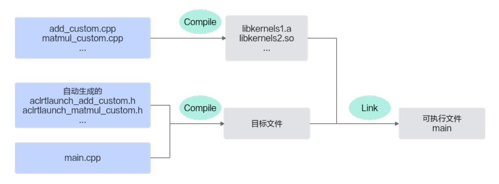

编译安装结束后在CMAKE\_INSTALL\_PREFIX目录下生成的编译产物示例如下;最终的 可执行文件会生成在cmake命令的执行目录下。

```
out
├── lib 
│ ├── libkernels1.a
│ ├── libkernels2.so
├── include
│ ├── kernels1
│ ├── aclrtlaunch_matmul_custom.h
│ ├── aclrtlaunch_add_custom.h
│ ├── kernels2
│ ├── aclrtlaunch_xxx.h
│ ├── ...
```

对于lib目录下生成的库文件可通过msobjdump工具进一步解析得到kernel信息,具体 操作参见**[12.3 msobjdump](#page-371-0)**工具。

## 输入数据和真值数据生成以及验证脚本文件

以固定shape的add\_custom算子为例,输入数据和真值数据生成的脚本样例如下:根 据算子的输入输出编写脚本,生成输入数据和真值数据。

```
#!/usr/bin/python3
# -*- coding:utf-8 -*-
import numpy as np
def gen_golden_data_simple():
 input_x = np.random.uniform(1, 100, [8, 2048]).astype(np.float16)
 input_y = np.random.uniform(1, 100, [8, 2048]).astype(np.float16)
 golden = (input_x + input_y).astype(np.float16)
 input_x.tofile("./input/input_x.bin")
 input_y.tofile("./input/input_y.bin")
 golden.tofile("./output/golden.bin")
if __name__ == "__main__":
 gen_golden_data_simple()
```

验证输出数据和真值数据是否一致的验证脚本样例如下:当前使用numpy接口计算了 输出数据和真值数据的绝对误差和相对误差,误差在容忍偏差范围内,视为精度符合 要求,输出"test pass"字样。

```
import os
import sys
import numpy as np
loss = 1e-3 # 容忍偏差,一般fp16要求绝对误差和相对误差均不超过千分之一
minimum = 10e-10
def verify_result(real_result, golden):
 real_result = np.fromfile(real_result, dtype=np.float16) # 从bin文件读取实际运算结果
 golden = np.fromfile(golden, dtype=np.float16) # 从bin文件读取预期运算结果
 result = np.abs(real_result - golden) # 计算运算结果和预期结果偏差
 deno = np.maximum(np.abs(real_result), np.abs(golden)) # 获取最大值并组成新数组
 result_atol = np.less_equal(result, loss) # 计算绝对误差
 result_rtol = np.less_equal(result / np.add(deno, minimum), loss) # 计算相对误差
 if not result_rtol.all() and not result_atol.all():
 if np.sum(result_rtol == False) > real_result.size * loss and np.sum(result_atol == False) > 
real_result.size * loss:
 print("[ERROR] result error")
 return False
 print("test pass")
 return True
if __name__ == '__main__':
 verify_result(sys.argv[1],sys.argv[2])
```

## <span id="page-207-0"></span>修改并执行一键式编译运行脚本

您可以基于样例工程中提供的一键式编译运行脚本进行快速编译,并在CPU侧和NPU 侧执行Ascend C算子。一键式编译运行脚本主要完成以下功能:

图 **6-60** 一键式编译运行脚本流程图

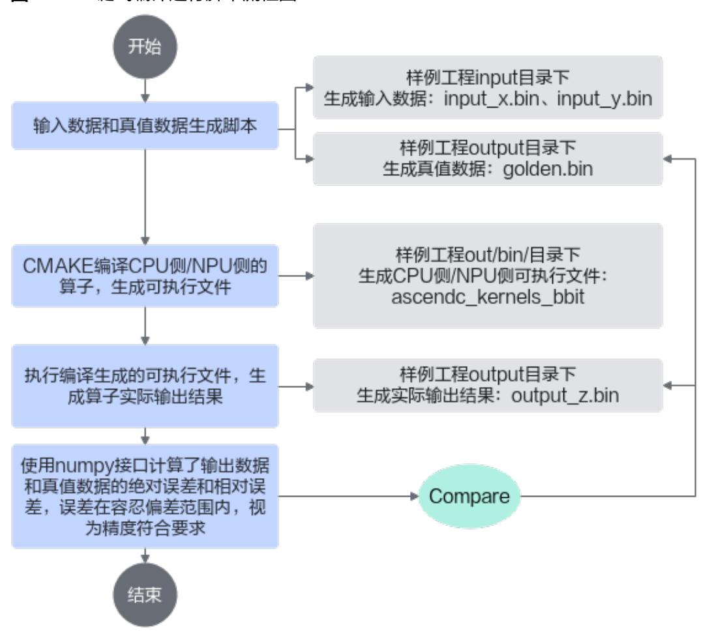

### 须知

### 样例中提供的一键式编译运行脚本并不能适用于所有的算子运行验证场景,使用时请 根据实际情况进行修改。

● 根据Ascend C算子的算法原理的不同,自行实现输入和真值数据的生成脚本。

完成上述文件的编写后,可以执行一键式编译运行脚本,编译和运行应用程序。

脚本执行方式和脚本参数介绍如下:

**bash run.sh --run-mode=npu --soc-version=<soc\_version> --install-path=<install\_path> --buildtype=Debug --install-prefix=<install-prefix>**

**bash run.sh -r npu -v <soc\_version> -i <install\_path> -b Debug -p <install-prefix>**

表 **6-13** 脚本参数介绍

| 参数名               | 参数简<br>写 | 参数介绍                                                                                                                                                                                                                                       |
|-------------------|----------|--------------------------------------------------------------------------------------------------------------------------------------------------------------------------------------------------------------------------------------------|
| run               | -r       | 表明算子以cpu模式或npu模式运行。                                                                                                                                                                                                                        |
| mode              |          | 取值为cpu或npu。                                                                                                                                                                                                                                |
| soc               | -v       | 算子运行的AI处理器型号。                                                                                                                                                                                                                              |
| version           |          | 说明<br>AI处理器的型号 <soc_version>请通过如下方式获取:</soc_version>                                                                                                                                                                                       |
|                   |          | ●<br>非Atlas A3 训练系列产品/Atlas A3 推理系列产品:在安装昇腾<br>AI处理器的服务器执行npu-smi info命令进行查询,获取Name<br>信息。实际配置值为AscendName,例如Name取值为xxxyy,<br>实际配置值为Ascendxxxyy。                                                                                           |
|                   |          | ●<br>Atlas A3 训练系列产品/Atlas A3 推理系列产品:在安装昇腾AI<br>处理器的服务器执行npu-smi info -t board -i id -c chip_id命<br>令进行查询,获取Chip Name和NPU Name信息,实际配置值<br>为Chip Name_NPU Name。例如Chip Name取值为<br>Ascendxxx,NPU Name取值为1234,实际配置值为<br>Ascendxxx_1234。<br>其中: |
|                   |          | ●<br>id:设备id,通过npu-smi info -l命令查出的NPU ID即为设<br>备id。                                                                                                                                                                                       |
|                   |          | ●<br>chip_id:芯片id,通过npu-smi info -m命令查出的Chip ID<br>即为芯片id。                                                                                                                                                                                 |
|                   |          | 该样例支持以下型号:                                                                                                                                                                                                                                 |
|                   |          | ●<br>Atlas 推理系列产品                                                                                                                                                                                                                          |
|                   |          | ●<br>Atlas 训练系列产品                                                                                                                                                                                                                          |
|                   |          | ●<br>Atlas A2 训练系列产品/Atlas 800I A2 推理产品/A200I A2 Box<br>异构组件                                                                                                                                                                               |
| install<br>path   | -i       | 配置为CANN软件的安装路径,请根据实际安装路径进行修<br>改。                                                                                                                                                                                                          |
|                   |          | 默认值为\$HOME/Ascend/ascend-toolkit/latest。                                                                                                                                                                                                   |
| build             | -b       | 编译模式选项,可配置为:                                                                                                                                                                                                                               |
| type              |          | ●<br>Release,Release版本,不包含调试信息,编译最终发布<br>的版本。                                                                                                                                                                                              |
|                   |          | ●<br>Debug,Debug版本,包含调试信息,便于开发者开发<br>和调试。                                                                                                                                                                                                  |
|                   |          | 默认值为Debug。                                                                                                                                                                                                                                 |
| install<br>prefix | -p       | 用于指定CMAKE执行install时,安装的路径前缀,执行<br>install后编译产物(ascendc_library中指定的target以及对<br>应的头文件)会安装在该路径下。默认路径为当前目录的<br>out目录下。                                                                                                                        |

脚本执行完毕输出"test pass"字样表示算子精度符合要求。

## <span id="page-209-0"></span>**6.6.3 Pybind** 调用

## **Pybind** 调用介绍

通过PyTorch框架进行模型的训练、推理时,会调用很多算子进行计算,其中的调用方 式与kernel编译流程有关。对于自定义算子工程,需要使用PyTorch Ascend Adapter 中的OP-Plugin算子插件对功能进行扩展,让torch可以直接调用自定义算子包中的算 子,详细内容可以参考**[9.2 PyTorch](#page-275-0)**框架;对于KernelLaunch开放式算子编程的方式, 通过适配Pybind调用,可以实现PyTorch框架调用算子kernel程序。

Pybind是一个用于将C++代码与Python解释器集成的库,实现原理是通过将C++代码编 译成动态链接库(DLL)或共享对象(SO)文件,使用Pybind提供的API将算子核函数 与Python解释器进行绑定。在Python解释器中使用绑定的C++函数、类和变量,从而 实现Python与C++代码的交互。在Kernel直调中使用时,就是将Pybind模块与算子核 函数进行绑定,将其封装成Python模块,从而实现两者交互。

Pybind调用方式中,使用的主要接口有:

- c10\_npu::getCurrentNPUStream:获取当前npu流,返回值类型NPUStream,使 用方式请参考《**[Ascend Extension for PyTorch](https://www.hiascend.com/document/detail/zh/Pytorch/710/apiref/torchnpuCustomsapi/context/%E6%A6%82%E8%BF%B0.md)** 自定义**API**参考》中的 "(**beta**)**[c10\\_npu::getCurrentNPUStream](https://www.hiascend.com/document/detail/zh/Pytorch/710/apiref/torchnpuCustomsapi/context/%EF%BC%88beta%EF%BC%89c10_npu-getCurrentNPUStream.md)**"章节。
- ACLRT\_LAUNCH\_KERNEL:同**[Kernel Launch](#page-196-0)**方式中ACLRT\_LAUNCH\_KERNEL 接口。

算子样例工程请通过如下链接获取:

- [矢量算子样例](https://gitee.com/ascend/samples/tree/master/operator/ascendc/0_introduction/3_add_kernellaunch/CppExtensions)
- 矢量**+**[矩阵融合算子样例](https://gitee.com/ascend/samples/tree/master/operator/ascendc/0_introduction/13_matmulleakyrelu_kernellaunch/CppExtensions)

## 环境准备

基于[环境准备,](#page-198-0)还需要安装以下依赖:

- 安装**[PyTorch](https://www.hiascend.com/document/detail/zh/Pytorch/60RC3/configandinstg/instg/insg_0005.html)**框架
- 安装**[torch\\_npu](https://www.hiascend.com/document/detail/zh/Pytorch/60RC3/configandinstg/instg/insg_0006.html)**插件
- 安装pybind11 pip3 install pybind11

## 工程目录

您可以单[击矢量算子样例](https://gitee.com/ascend/samples/tree/master/operator/ascendc/0_introduction/3_add_kernellaunch/CppExtensions),获取核函数开发和运行验证的完整样例。样例目录结构如 下所示:

```
├── CppExtensions 
│ ├── add_custom_test.py // Python调用脚本
│ ├── add_custom.cpp // 算子实现
│ ├── CMakeLists.txt // 编译工程文件
│ ├── pybind11.cpp // pybind11函数封装
│ └── run.sh // 编译运行算子的脚本
```

基于该算子工程,开发者进行算子开发的步骤如下:

- 完成算子kernel侧实现。
- 编写算子调用应用程序和定义pybind模块pybind11.cpp。
- 编写Python调用脚本add\_custom\_test.py,包括生成输入数据和真值数据,调用 封装的模块以及验证结果。

- 编写CMake编译配置文件CMakeLists.txt。
- 根据实际需要修改编译运行算子的脚本run.sh并执行该脚本,完成算子的编译运 行和结果验证。

## 算子 **kernel** 侧实现

请参考**6.2** [矢量编程](#page-92-0)和工程目录中的算子kernel实现完成Ascend C算子实现文件的编 写。

## 算子调用应用程序和定义 **pybind** 模块

下面代码以add\_custom算子为例,介绍算子核函数调用的应用程序pybind11.cpp如何 编写。您在实现自己的应用程序时,需要关注由于算子核函数不同带来的修改,包括 算子核函数名,入参出参的不同等,相关API的调用方式直接复用即可。

步骤**1** 按需包含头文件。需要注意的是,需要包含对应的核函数调用接口声明所在的头文件 alcrtlaunch\_{kernel\_name}.h(该头文件为工程框架自动生成),kernel\_name为算 子核函数的名称。

```
#include <pybind11/pybind11.h>
#include <torch/extension.h>
#include "aclrtlaunch_add_custom.h"
#include "torch_npu/csrc/core/npu/NPUStream.h"
```

步骤**2** 应用程序框架编写。需要注意的是,本样例的输入x,y的内存是在**Python**[调用脚本](#page-211-0) add\_custom\_test.py中分配的。

```
namespace my_add {
at::Tensor run_add_custom(const at::Tensor &x, const at::Tensor &y) {
}
}
```

步骤**3** NPU侧运行验证。使用ACLRT\_LAUNCH\_KERNEL接口调用算子核函数完成指定的运 算。

```
 // 运行资源申请,通过c10_npu::getCurrentNPUStream()的函数获取当前NPU上的流
 auto acl_stream = c10_npu::getCurrentNPUStream().stream(false);
 // 分配Device侧输出内存
 at::Tensor z = at::empty_like(x);
 uint32_t blockDim = 8;
 uint32_t totalLength = 1;
 for (uint32_t size : x.sizes()) {
 totalLength *= size;
 }
 // 用ACLRT_LAUNCH_KERNEL接口调用核函数完成指定的运算
 ACLRT_LAUNCH_KERNEL(add_custom)(blockDim, acl_stream, 
 const_cast<void *>(x.storage().data()),
 const_cast<void *>(y.storage().data()),
 const_cast<void *>(z.storage().data()), 
 totalLength);
 // 将Device上的运算结果拷贝回Host并释放申请的资源
 return z;
```

步骤**4** 定义Pybind模块,将C++函数封装成Python函数。PYBIND11\_MODULE是Pybind11库 中的一个宏,用于定义一个Python模块。它接受两个参数,第一个参数是封装后的模 块名,第二个参数是一个Pybind11模块对象,用于定义模块中的函数、类、常量等。 通过调用m.def()方法,可以将步骤2中函数my\_add::run\_add\_custom()转成Python函 数run\_add\_custom,使其可以在Python代码中被调用。

```
PYBIND11_MODULE(add_custom, m) { // 模块名add_custom,模块对象m
 m.doc() = "add_custom pybind11 interfaces"; // optional module docstring
```

 m.def("run\_add\_custom", &my\_add::run\_add\_custom, ""); // 将函数run\_add\_custom与Pybind模块进行绑定 }

### **----**结束

## <span id="page-211-0"></span>**Python** 调用脚本

在Python调用脚本中,使用torch接口生成随机输入数据并分配内存,通过导入封装的 自定义模块add\_custom,调用自定义模块add\_custom中的run\_add\_custom函数,从 而在NPU上执行算子。算子核函数NPU侧运行验证的步骤如图**1 NPU**侧运行验证原理 图。

### 图 **6-61** NPU 侧运行验证原理图

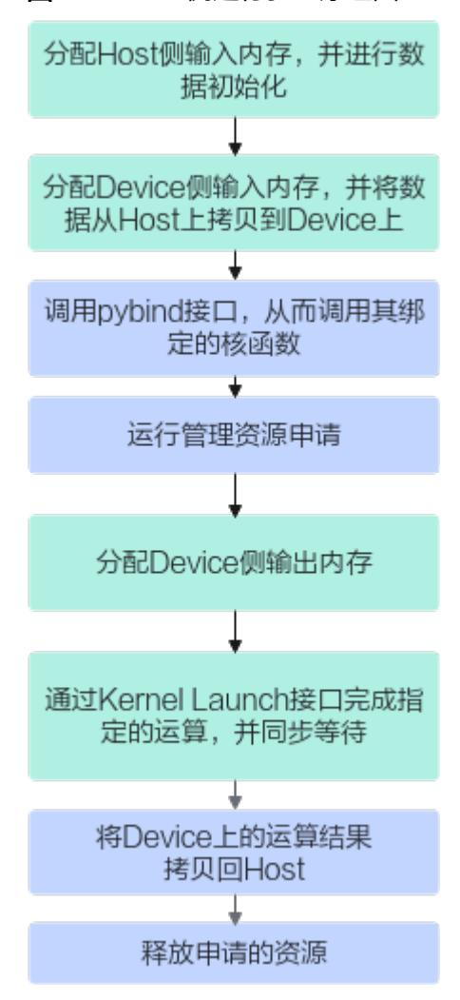

import torch import torch\_npu from torch\_npu.testing.testcase import TestCase, run\_tests import sys, os sys.path.append(os.getcwd()) import add\_custom torch.npu.config.allow\_internal\_format = False class TestCustomAdd(TestCase): def test\_add\_custom\_ops(self): # 分配Host侧输入内存,并进行数据初始化 length = [8, 2048]

```
 x = torch.rand(length, device='cpu', dtype=torch.float16)
 y = torch.rand(length, device='cpu', dtype=torch.float16)
 # 分配Device侧输入内存,并将数据从Host上拷贝到Device上
 x_npu = x.npu()
 y_npu = y.npu()
 output = add_custom.run_add_custom(x_npu, y_npu)
 cpuout = torch.add(x, y)
 self.assertRtolEqual(output, cpuout)
if __name__ == "__main__":
 run_tests()
```

## **CMake** 编译配置文件编写

通常情况下不需要开发者修改编译配置文件,但是了解编译配置文件可以帮助开发者 更好的理解编译原理,方便有能力的开发者对Cmake进行定制化处理,具体内容请参 考**CMake**[编译配置文件编写。](#page-202-0)

## 修改并执行一键式编译运行脚本

您可以基于样例工程中提供的一键式编译运行脚本run.sh进行快速编译,在NPU侧执 行Ascend C算子。一键式编译运行脚本主要完成以下功能:

图 **6-62** 一键式编译运行脚本流程图

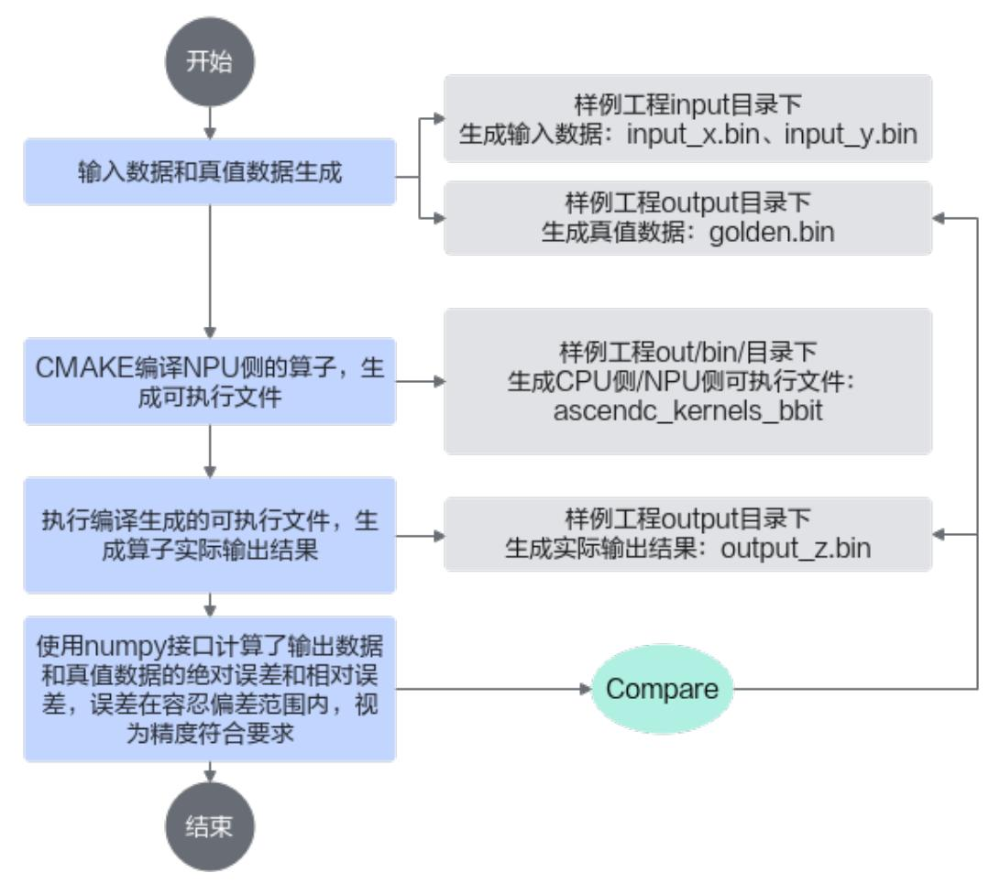

### <span id="page-213-0"></span>须知

### 样例中提供的一键式编译运行脚本并不能适用于所有的算子运行验证场景,使用时请 根据实际情况进行修改。

● 根据Ascend C算子的算法原理的不同,自行实现输入和真值数据的生成。

完成上述文件的编写后,可以执行一键式编译运行脚本,编译和运行应用程序。

脚本执行方式和脚本参数介绍如下:

**bash run.sh --soc-version=<soc\_version>** 

**bash run.sh -v <soc\_version>** 

### 表 **6-14** 脚本参数介绍

| 参数名     | 参数简<br>写 | 参数介绍                                                                                                                                                                                                                                       |
|---------|----------|--------------------------------------------------------------------------------------------------------------------------------------------------------------------------------------------------------------------------------------------|
| soc     | -v       | 算子运行的AI处理器型号。                                                                                                                                                                                                                              |
| version |          | 说明<br>AI处理器的型号请通过如下方式获取:                                                                                                                                                                                                                   |
|         |          | ●<br>非Atlas A3 训练系列产品/Atlas A3 推理系列产品:在安装昇腾<br>AI处理器的服务器执行npu-smi info命令进行查询,获取Name<br>信息。实际配置值为AscendName,例如Name取值为xxxyy,<br>实际配置值为Ascendxxxyy。                                                                                           |
|         |          | ●<br>Atlas A3 训练系列产品/Atlas A3 推理系列产品:在安装昇腾AI<br>处理器的服务器执行npu-smi info -t board -i id -c chip_id命<br>令进行查询,获取Chip Name和NPU Name信息,实际配置值<br>为Chip Name_NPU Name。例如Chip Name取值为<br>Ascendxxx,NPU Name取值为1234,实际配置值为<br>Ascendxxx_1234。<br>其中: |
|         |          | ●<br>id:设备id,通过npu-smi info -l命令查出的NPU ID即为设<br>备id。                                                                                                                                                                                       |
|         |          | ●<br>chip_id:芯片id,通过npu-smi info -m命令查出的Chip ID<br>即为芯片id。                                                                                                                                                                                 |
|         |          | 该样例支持以下型号:                                                                                                                                                                                                                                 |
|         |          | ●<br>Atlas 推理系列产品                                                                                                                                                                                                                          |
|         |          | ●<br>Atlas 训练系列产品                                                                                                                                                                                                                          |
|         |          | ●<br>Atlas A2 训练系列产品/Atlas 800I A2 推理产品/A200I A2 Box<br>异构组件                                                                                                                                                                               |

## **6.7** 工程化算子开发

## **6.7.1** 概述

工程化算子开发是指基于自动生成的自定义算子工程完成算子实现、编译部署、单算 子调用代码自动生成等一系列流程。

<span id="page-214-0"></span>该开发流程是标准的开发流程,建议开发者按照该流程进行算子开发。该方式下,算 子开发的代码会更规范、统一、易于维护;同时该方式考虑了单算子API调用、算子入 图、AI框架调用等功能的集成,使得开发者易于借助CANN框架实现上述功能。

### 工程化算子开发流程如下图所示:

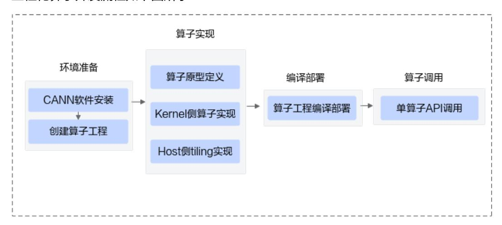

### 步骤**1** 环境准备。

- 1. CANN软件安装请参考**2** [环境准备](#page-52-0)。
- 2. 创建算子工程。使用msOpGen工具创建算子开发工程。

### 步骤**2** 算子实现。

- [算子原型定义。](#page-217-0)通过原型定义来描述算子输入输出、属性等信息以及算子在AI处 理器上相关实现信息,并关联tiling实现等函数。
- Kernel侧算子实现和host侧tiling实现请参考**6** [算子实现](#page-91-0);工程化算子开发,支持 开发者调用Tiling API基于CANN提供的编程框架进行tiling开发,kernel侧也提供 对应的接口方便开发者获取tiling参数,具体内容请参考**[6.7.4 Kernel](#page-222-0)**侧算子实现 和**[6.7.5 Host](#page-224-0)**侧**tiling**实现,由此而带来的额外约束也在上述章节说明。

步骤**3** 编译部署。通过工程编译脚本完成算子的编译部署,分[为算子包编译和](#page-236-0)[算子动态库编](#page-244-0) [译](#page-244-0)两种方式。

步骤**4** [单算子](#page-246-0)**API**调用:调用单算子API接口,基于C语言的API执行算子。

**----**结束

## **6.7.2** 创建算子工程

CANN开发套件包中提供了自定义算子工程生成工具msOpGen,可基于算子原型定义 输出算子工程:包括算子**host**侧代码实现文件、算子**kernel**侧实现文件以及工程编译 配置文件等。

### 说明

使用msOpGen工具创建算子工程之前,需要参考**2** [环境准备](#page-52-0)章节安装驱动固件和CANN软件 包,完成开发环境和运行环境的准备。

使用msOpGen工具创建算子开发工程的步骤如下:

步骤**1** 编写算子的原型定义json文件,用于生成算子开发工程。

例如,AddCustom算子的json文件命名为add\_custom.json,文件内容如下:

```
 {
 "op": "AddCustom",
 "input_desc": [
 {
 "name": "x",
 "param_type": "required",
 "format": [
 "ND",
 "ND",
 "ND"
 ],
 "type": [
 "float16",
 "float",
 "int32"
 ]
 },
 {
 "name": "y",
 "param_type": "required",
 "format": [
 "ND",
 "ND",
 "ND"
 ],
 "type": [
 "float16",
 "float",
 "int32"
 ]
 }
 ],
 "output_desc": [
 {
 "name": "z",
 "param_type": "required",
 "format": [
 "ND",
 "ND",
 "ND"
 ],
 "type": [
 "float16",
 "float",
 "int32"
 ]
 }
 ]
 }
```

例如,ReduceMaxCustom算子(包含属性)的json文件命名为 reduce\_max\_custom.json,文件内容如下:

```
 {
 "op": "ReduceMaxCustom",
 "input_desc": [
 {
 "name": "x",
 "param_type": "required",
 "format": ["ND"],
 "type": ["float16"]
 }
 ],
 "output_desc": [
 {
 "name": "y",
 "param_type": "required",
```

```
 "format": ["ND"],
 "type": ["float16"]
 },
 {
 "name": "idx",
 "param_type": "required",
 "format": ["ND"],
 "type": ["int32"]
 }
 ],
 "attr": [ 
 {
 "name": "reduceDim",
 "param_type": "required",
 "type": "int"
 },
 {
 "name": "isKeepDim",
 "param_type": "optional",
 "type": "int",
 "default_value": 1
 }
 ]
 }
```

步骤**2** 使用msOpGen工具生成算子的开发工程。以生成AddCustom的算子工程为例,下文仅 针对关键参数进行解释,详细参数说明请参见[《算子开发工具用户指南](https://www.hiascend.com/document/detail/zh/CANNCommunityEdition/82RC1/devaids/optool/atlasopdev_16_0002.html)》。

**\${INSTALL\_DIR}**/python/site-packages/bin/msopgen gen -i \$HOME/sample/add\_custom.json -c ai\_core- **<soc\_version>** -lan cpp -out \$HOME/sample/AddCustom

- **\${INSTALL\_DIR}**为CANN软件安装后文件存储路径,请根据实际环境进行替换。
- -i:指定算子原型定义文件add\_custom.json所在路径,请根据实际情况修改。
- -c:ai\_core-<soc\_version>代表算子在AI Core上执行,<soc\_version>为昇腾AI处 理器的型号。

### 说明

AI处理器的型号<soc\_version>请通过如下方式获取:

- 非Atlas A3 训练系列产品/Atlas A3 推理系列产品:在安装昇腾AI处理器的服务器执行 **npu-smi info**命令进行查询,获取**Name**信息。实际配置值为AscendName,例如 **Name**取值为xxxyy,实际配置值为Ascendxxxyy。
- Atlas A3 训练系列产品/Atlas A3 推理系列产品:在安装昇腾AI处理器的服务器执行 **npu-smi info -t board -i** id **-c** chip\_id命令进行查询,获取**Chip Name**和**NPU Name** 信息,实际配置值为Chip Name\_NPU Name。例如**Chip Name**取值为Ascendxxx, **NPU Name**取值为1234,实际配置值为Ascendxxx\_1234。

其中:

- id:设备id,通过**npu-smi info -l**命令查出的NPU ID即为设备id。
- chip\_id:芯片id,通过**npu-smi info -m**命令查出的Chip ID即为芯片id。

基于同系列的AI处理器型号创建的算子工程,其基础功能(基于该工程进行算子开发、编 译和部署)通用。

- -lan: 参数cpp代表算子基于Ascend C编程框架,使用C/C++编程语言开发。
- -out:生成文件所在路径,可配置为绝对路径或者相对路径,并且工具执行用户 对路径具有可读写权限。若不配置,则默认生成在执行命令的当前路径。

步骤**3** 命令执行完后,会在-out指定目录或者默认路径下生成算子工程目录,工程中包含算 子实现的模板文件,编译脚本等,以AddCustom算子为例,目录结构如下所示:

```
AddCustom
├── build.sh // 编译入口脚本
```

```
├── cmake // 算子工程编译所需脚本及公共编译文件存放目录
├── CMakeLists.txt // 算子工程的CMakeLists.txt
├── CMakePresets.json // 编译配置项
├── framework // AI框架适配时,算子插件实现文件目录
├── op_host // host侧实现文件
│ ├── add_custom_tiling.h // 算子tiling定义文件
│ ├── add_custom.cpp // 算子原型注册、shape推导、信息库、tiling实现等内容文件
│ ├── CMakeLists.txt
├── op_kernel // kernel侧实现文件
│ ├── CMakeLists.txt 
│ ├── add_custom.cpp // 算子代码实现文件
└── scripts // 自定义算子工程打包相关脚本所在目录
```

### 说明

- 上述目录结构中的粗体文件为后续算子开发过程中需要修改的文件,其他文件无需修改。
- kernel侧实现依赖的所有文件需全部放置在op\_kernel目录下,不遵循该约束会导致[源码发布](#page-236-0) 场景在线编译失败。因为在后续的算子源码发布时,只会打包发布op\_kernel目录下的文件。

### **----**结束

工程目录中的op\_kernel和op\_host包含了算子的核心实现文件。op\_kernel下存放 **kernel**[侧算子实现](#page-222-0)。op\_host下存放host侧代码实现,包括算子原型定义、**[host](#page-224-0)**侧 **[tiling](#page-224-0)**实现。其中kernel侧算子实现和host侧tiling实现在**6** [算子实现章](#page-91-0)节已经介绍了其 核心的实现方法,在该章节会侧重于介绍接入CANN框架后的编程模式和API的使用。 工程目录中的CMakePresets.json,用于开发者完成工程编译相关配置,之后即可进行 编译部署。

## **6.7.3** 算子原型定义

算子原型主要描述了算子的输入输出、属性等信息以及算子在AI处理器上相关实现信 息,并关联**[tiling](#page-224-0)**实现等函数。算子原型通过自定义的算子类来承载,该算子类继承自 **[OpDef](#page-2168-0)**类。完成算子的原型定义等操作后,需要调用**[OP\\_ADD](#page-2168-0)**接口,传入算子类型 (自定义算子类的类名),进行算子原型注册。下面是一个简单的Add算子原型定义 和注册的例子。

```
namespace ops {
class AddCustom : public OpDef {
public:
 AddCustom(const char* name) : OpDef(name)
 {
 this->Input("x")
 .ParamType(REQUIRED)
 .DataType({ge::DT_FLOAT16, ge::DT_FLOAT, ge::DT_INT32})
 .Format({ge::FORMAT_ND, ge::FORMAT_ND, ge::FORMAT_ND});
 this->Input("y")
 .ParamType(REQUIRED)
 .DataType({ge::DT_FLOAT16, ge::DT_FLOAT, ge::DT_INT32})
 .Format({ge::FORMAT_ND, ge::FORMAT_ND, ge::FORMAT_ND});
 this->Output("z")
 .ParamType(REQUIRED)
 .DataType({ge::DT_FLOAT16, ge::DT_FLOAT, ge::DT_INT32})
 .Format({ge::FORMAT_ND, ge::FORMAT_ND, ge::FORMAT_ND});
 // 如下的shape/datatype推导函数仅在算子入图场景使用
 this->SetInferShape(ge::InferShape);
 this->SetInferDataType(ge::InferDataType); 
 this->AICore()
 .SetTiling(optiling::TilingFunc);
 // 请替换为实际的昇腾AI处理器型号
 this->AICore().AddConfig("ascendxxx");
 }
};
OP_ADD(AddCustom);
} // namespace ops
```

### 须知

注册算子类型后,框架会根据算子类型获取算子注册信息,同时在编译和运行时按照 一定的规则匹配算子实现文件名称和kernel侧核函数名称。为了保证正确匹配,算子 类型、算子实现文件名称和核函数名称需要遵循如下定义规则。通常情况下,开发者 只需要保证创建算子工程时原型定义json文件中算子类型op的参数值为大驼峰命名方 式即可,工程创建后自动生成的代码即满足该规则。在手动编写算子原型定义和算子 实现文件时需要按照如下规则定义。

- 算子类型需要采用大驼峰的命名方式,即采用大写字符区分不同的语义。
- 算子实现文件名称、核函数名称需相同,均为算子类型转换为下划线命名方式后的 值。下文描述了通过算子类型转换成算子实现文件名称和核函数名称的过程:
  - 首字符的大写字符转换为小写字符。例如:Abc -> abc。
  - 大写字符的前一个字符为小写字符或数字,则在大写字符前插一个下划线 "\_",并将该字符转换为小写字符。例如:AbcDef -> abc\_def。
  - 大写字符前一个字符为大写字符且后一个字符是小写字符,则在大写字符前插 一个下划线"\_",并将该字符转换为小写字符。例如:AbcAAc -> abc\_a\_ac。
  - 其他大写字符转换为小写字符,小写字符保持不变。

## 算子输入**/**输出**/**属性定义

算子原型定义描述了算子的输入输出、属性等信息。输入输出支持的datatype、 format格式的数量需要一致,并保持一一对应的关系。

如下的代码片段呈现了Add算子输入x的描述信息。

```
 this->Input("x")
 .ParamType(REQUIRED)
 .DataType({ge::DT_FLOAT16, ge::DT_FLOAT, ge::DT_INT32})
 .Format({ge::FORMAT_ND, ge::FORMAT_ND, ge::FORMAT_ND});
```

### 表 **6-15** 输入输出参数说明

| 原型定<br>义         | 参数            | 具体描述                                                                                                   |
|------------------|---------------|--------------------------------------------------------------------------------------------------------|
| Input/<br>Output | ParamTy<br>pe | 参数类型,Option取值为:OPTIONAL(可选)、<br>REQUIRED(必选)、DYNAMIC(动态输入)。                                            |
|                  |               | ●<br>类似于上文中的Add样例,其输入输出是必选的。                                                                           |
|                  |               | ●<br>有些算子的输入或者输出个数是动态的,例如AddN,将<br>N个输入Tensor累加到一起,输出一个Tensor;SplitV,<br>将一个Tensor在某个轴上,拆分为N个Tensor输出。 |
|                  |               | ●<br>有些算子的输入/输出是可选的,例如BatchNorm算子,<br>在训练的时候没有均值和方差输入,在推理的时候有均值<br>和方差的输入。                             |
|                  | DataType      | 算子输入输出支持的datatype。datatype的取值请参考<br>14.2.3.53 DataType。                                                |

| 原型定<br>义 | 参数     | 具体描述                                              |
|----------|--------|---------------------------------------------------|
|          | Format | 算子输入输出支持的format。format的取值请参考<br>14.2.3.54 Format。 |

从上文的原型定义中可以看出,列出了输入输出所有datatype和format的组合,保持 一一对应。使用如下接口,可以达到简化这种代码逻辑的目的。

● 在指定输入/输出的datatype信息时,如果某个输入/输出的datatype支持和其他 所有输入/输出的datatype/format组合使用,其datatype可以通过**[DataTypeList](#page-2180-0)** 来表达;在指定输入/输出的format信息时,如果某个输入/输出的format支持和 其他所有输入/输出的datatype/format组合使用,其format可以通过**[FormatList](#page-2185-0)** 来表达。示例如下,以下两种代码表达含义相同。

```
// 列出所有一一对应的组合
class XxxCustom : public OpDef {
public:
 XxxCustom(const char* name) : OpDef(name)
 {
 this->Input("x")
 .ParamType(REQUIRED)
 .DataType({ge::DT_FLOAT16, ge::DT_FLOAT16, ge::DT_FLOAT16})
 .Format({ge::FORMAT_ND, ge::FORMAT_ND, ge::FORMAT_ND});
 this->Input("y")
 .ParamType(REQUIRED)
 .DataType({ge::DT_FLOAT16, ge::DT_FLOAT, ge::DT_INT32})
 .Format({ge::FORMAT_ND, ge::FORMAT_ND, ge::FORMAT_ND});
 this->Output("z")
 .ParamType(REQUIRED)
 .DataType({ge::DT_FLOAT16, ge::DT_FLOAT, ge::DT_INT32})
 .Format({ge::FORMAT_ND, ge::FORMAT_ND, ge::FORMAT_ND});
 ...
 }
};
// 通过DataTypeList和FormatList来表达,无需重复列出
class XxxCustom : public OpDef {
public:
 XxxCustom(const char* name) : OpDef(name)
 {
 this->Input("x")
 .ParamType(REQUIRED)
 .DataTypeList({ge::DT_FLOAT16})
 .FormatList({ge::FORMAT_ND});
 this->Input("y")
 .ParamType(REQUIRED)
 .DataType({ge::DT_FLOAT16, ge::DT_FLOAT, ge::DT_INT32})
 .Format({ge::FORMAT_ND, ge::FORMAT_ND, ge::FORMAT_ND});
 this->Output("z")
 .ParamType(REQUIRED)
 .DataType({ge::DT_FLOAT16, ge::DT_FLOAT, ge::DT_INT32})
 .Format({ge::FORMAT_ND, ge::FORMAT_ND, ge::FORMAT_ND});
 ...
 }
};
```

● 通过**[Follow](#page-2196-0)**接口指定当前输入/输出的datatype/format/shape信息与之前定义过 的某个输入一致。示例如下:输出"y1"Follow输入"x1"场景,此时"y1"的 datatype、format以及shape都将会和"x1"保持一致。使用Follow接口指定 shape一致时通常比**[shape](#page-260-0)**推导函数逻辑更加简单,能用Follow表达的逻辑,建议 使用Follow接口,则无需再编写注册InferShape函数。

```
this->Input("x1")
 .ParamType(REQUIRED)
```

```
 .DataType({ge::DT_FLOAT, ge::DT_FLOAT})
 .Format({ge::FORMAT_ND, ge::FORMAT_ND});
this->Input("x2")
 .ParamType(REQUIRED)
 .DataType({ge::DT_FLOAT, ge::DT_FLOAT})
 .Format({ge::FORMAT_ND, ge::FORMAT_ND});
this->Output("y1")
 .ParamType(REQUIRED)
 .Follow("x1")
 .OutputShapeDependOnCompute();
```

原型定义中还包括算子属性信息,如下的代码片段呈现了ReduceMax算子的属性 reduceDim和isKeepDim的描述信息。

```
 this->Attr("reduceDim")
 .AttrType(REQUIRED)
 .Int();
 this->Attr("isKeepDim")
 .AttrType(OPTIONAL)
 .Int(1);
```

### 具体参数说明如下:

### 表 **6-16** 属性参数说明

| 原型定<br>义 | 注册方式                   | 具体描述                                            |
|----------|------------------------|-------------------------------------------------|
| Attr     | AttrType               | 设置算子属性类型,取值为:OPTIONAL(可选)、<br>REQUIRED(必选)。     |
|          | Bool/<br>Float/<br>Int | 设置算子属性数据类型为Bool/Float/Int。具体说明请参考<br>OpAttrDef。 |

## **AI** 处理器上相关实现信息

通过 **[AddConfig](#page-2205-0)**注册算子支持的AI处理器型号以及相关的配置信息。AddConfig接口 原型如下:soc参数表示AI处理器型号,aicore\_config表示其他配置信息。

```
void AddConfig(const char *soc);
void AddConfig(const char *soc, OpAICoreConfig &aicore_config);
```

通过该接口注册AI处理器型号的样例如下,ascendxxx请替换为实际的AI处理器型号。

```
 this->AICore().AddConfig("ascendxxx");
```

其他AI Core配置信息的配置方式请参考**[14.1.6.1.6 OpAICoreConfig](#page-2206-0)**。

## 关联 **Tiling** 实现、**Shape** 推导等函数

通过 **[SetInferShape](#page-2170-0)**、 **[SetInferDataType](#page-2171-0)**、 **[SetTiling](#page-2201-0)**接口来关联对应的shape推导 函数和Tiling函数,样例如下。

```
 // 如下的shape/datatype推导函数仅在算子入图场景使用 
 this->SetInferShape(ge::InferShape);
 this->SetInferDataType(ge::InferDataType);
 this->AICore()
 .SetTiling(optiling::TilingFunc);
```

## <span id="page-221-0"></span>多硬件平台注册差异化的算子原型

算子类继承基类OpDef,使用Input、Output、Attr等注册算子原型信息,硬件平台支 持相同的算子原型的情况下,直接通过AICore().AddConfig添加支持的AI处理器型号即 可;不同的硬件形态算子原型定义不同的情况,可以通过新增OpAICoreConfig的方 式,针对不同的AI处理器型号注册差异化的算子原型。

### 差异化的算子原型生效规则如下:

- 对于算子类的输入输出原型信息,OpAICoreConfig未配置的会继承OpDef定义的 原型,比如算子类中定义了输出y,OpAICoreConfig中没有定义输出y, OpAICoreConfig会继承y的原型定义;
- 对于算子类和新增OpAICoreConfig中定义的算子原型相同的情况,新增 OpAICoreConfig中定义的算子原型信息会覆盖OpDef定义的原型信息,比如算子 类中定义了输入x支持DT\_FLOAT16数据类型,新增OpAICoreConfig中也定义了输 入x,但是支持DT\_FLOAT16、DT\_BF16数据类型,则以OpAICoreConfig新增定义 为准。

如下样例中ascendxxx1、ascendxxx2(AI处理器型号)使用相同的算子原型,算子类 通过继承基类OpDef,使用Input、Output、Attr等注册算子原型信息,再通过 AICore().AddConfig添加支持的AI处理器型号;对于ascendxxx3支持的算子原型需要 定制化处理,新增了DT\_BF16的类型,通过新增OpAICoreConfig的方式进行注册,x, y,z的定义会覆盖算子类中对应定义的原型信息。

```
namespace ops {
class MyAdd : public OpDef {
public:
 MyAdd(const char* name) : OpDef(name)
 {
 // ascendxxx1 ascendxxx2 AI处理器型号原型定义
 this->Input("x")
 .ParamType(REQUIRED)
 .DataType({ge::DT_FLOAT16})
 .Format({ge::FORMAT_ND});
 this->Input("y")
 .ParamType(OPTIONAL)
 .DataType({ge::DT_INT64})
 .Format({ge::FORMAT_ND});
 this->Output("z")
 .ParamType(REQUIRED)
 .DataType({ge::DT_FLOAT16})
 .Format({ge::FORMAT_ND});
 this->AICore()
 .SetTiling(optiling::TilingFunc);
 this->AICore().AddConfig("ascendxxx1");
 this->AICore().AddConfig("ascendxxx2");
 // ascendxxx3 AI处理器定义OpAICoreConfig变量,定制化原型
 OpAICoreConfig config;
 config.Input("x")
 .ParamType(REQUIRED)
 .DataType({ge::DT_FLOAT16, ge::DT_BF16})
 .Format({ge::FORMAT_ND, ge::FORMAT_ND});
 config.Input("y")
 .ParamType(REQUIRED)
 .DataType({ge::DT_FLOAT16, ge::DT_BF16})
 .Format({ge::FORMAT_ND, ge::FORMAT_ND});
 config.Output("z")
 .ParamType(REQUIRED)
 .DataType({ge::DT_FLOAT16, ge::DT_BF16})
 .Format({ge::FORMAT_ND, ge::FORMAT_ND});
 this->AICore().AddConfig("ascendxxx3", config);
 }
};
```

```
OP_ADD(MyAdd);
}
```

如下的样例中,只有几个参数原型信息在不同硬件平台不一致,开发者也可以通过 OpAICoreConfig定制部分算子原型信息,复用OpDef定义的其他算子原型信息,达到 部分原型信息硬件平台定制化的目的。

```
class AddCustom : public OpDef {
public:
 AddCustom(const char* name) : OpDef(name)
 {
 this->Input("x").DataType({ ge::DT_FLOAT16 }).ParamType(OPTIONAL);
 this->Output("y").DataType({ ge::DT_FLOAT16 });
 OpAICoreConfig aicConfig1;
 OpAICoreConfig aicConfig2;
 aicConfig1.Input("x")
 .ParamType(OPTIONAL)
 .DataType({ ge::DT_FLOAT })
 .Format({ ge::FORMAT_ND });
 aicConfig2.Input("x")
 .ParamType(REQUIRED)
 .DataType({ ge::DT_INT32 })
 .Format({ ge::FORMAT_ND });
 this->AICore().AddConfig("ascendxxx1", aicConfig1);
 this->AICore().AddConfig("ascendxxx2", aicConfig2);
 }
};
```

## **6.7.4 Kernel** 侧算子实现

在**6** [算子实现章](#page-91-0)节已经介绍了kernel侧算子核心的实现方法,本章节侧重于介绍接入 CANN框架时编程模式和API的使用。

## 自动生成 **kernel** 侧算子实现模板

在算子工程目录下的"op\_kernel/xxx.cpp"文件中实现算子的核函数。核函数的定义 模板已通过msOpGen工具自动生成,样例如下所示。注意这里参数的顺序按照"输 入、输出、**workspace**、**tiling**"的顺序排布,开发者不要调整其顺序。

```
#include "kernel_operator.h"
extern "C" __global__ __aicore__ void add_custom(GM_ADDR x, GM_ADDR y, GM_ADDR z, GM_ADDR 
workspace, GM_ADDR tiling) {
 GET_TILING_DATA(tiling_data, tiling);// 获取Tiling参数,详见下文介绍
 // TODO: user kernel impl
}
```

### 说明

```
算子原型定义中的输入和输出同名的情况下,自动生成的核函数中,输出参数增加ref后缀予以
区分。示例如下:
extern "C" __global__ __aicore__ void add_custom(GM_ADDR x, GM_ADDR y, GM_ADDR x_ref, 
GM_ADDR workspace, GM_ADDR tiling) {
 ...
}
```

## **GET\_TILING\_DATA** 获取 **Tiling** 参数

提供**[14.1.4.10.1 GET\\_TILING\\_DATA](#page-1225-0)**,用于获取算子kernel入口函数传入的tiling信 息,并填入注册的Tiling结构体中,此函数会以宏展开的方式进行编译。注意,对应的 算子host实现中需要定义TilingData结构体,实现并注册计算TilingData的Tiling函 数。具体请参考**[6.7.5 Host](#page-224-0)**侧**tiling**实现。

核函数中调用**[14.1.4.10.1 GET\\_TILING\\_DATA](#page-1225-0)**获取TilingData的样例如下:

```
extern "C" __global__ __aicore__ void add_custom(GM_ADDR x, GM_ADDR y, GM_ADDR z, GM_ADDR 
workspace, GM_ADDR tiling)
{
 GET_TILING_DATA(tilingData, tiling);
 KernelAdd op;
 op.Init(x, y, z, tilingData.totalLength, tilingData.tileNum);
 if (TILING_KEY_IS(1)) {
 op.Process();
 }
}
```

## 核函数内推导输入数据类型和格式

算子工程在核函数内提供了DTYPE\_<Arg>、ORIG\_DTYPE\_<Arg>、FORMAT\_<Arg>三 种宏用于推导核函数入参的数据类型、原始数据类型和数据格式。其中<Arg>会自动大 写。样例如下:

```
template<class T> func() {}
extern "C" __global__ __aicore__ void add_custom(GM_ADDR x, GM_ADDR y, GM_ADDR z, GM_ADDR 
workspace, GM_ADDR tiling)
{
 DTYPE_X temp;
 func<DTYPE_Z>();
 if (FORMAT_Y == FORMAT_ND) {
 ...
 }
}
```

## 输出 **shape** 依赖计算的算子 **kernel** 实现

某些算子,比如NonZero(统计tensor中非零值的个数),计算完成前无法得知算子 输出的shape信息,算子计算完成后才能获取。该类算子在原型定义时,需要使用 **[OutputShapeDependOnCompute](#page-2195-0)**接口进行标识,同时在算子核函数中将实际输出 shape写入到出参中,便于框架侧基于该信息进行输出内存的管理。

在核函数所有输出的最后增加一个GM\_ADDR类型的输出参数,并在核函数计算完成 后,将输出shape信息写入到该出参中。shape信息的排布格式如下,大小为**n \* (8 + 1)**,每个元素的数据类型为**uint64\_t**。其中n表示待刷新shape信息的输出个数,每个 输出的shape信息都通过第1个元素来保存实际的shape维度(dim),后续的8个元素 来保存具体每个维度的shape信息。

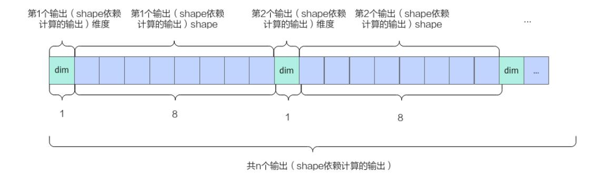

### 说明

- 输出的顺序和原型定义中输出的顺序保持一致。
- 对于uint64\_t的输出数据类型(对于tensor而言),需要将dim的uint32\_t的高位设置为1, 表示以uint64\_t类型解析该tensor。

<span id="page-224-0"></span>● 如下示例中,算子中有一个输出依赖计算得出,输出tensor的数据类型为 uint32\_t,计算完成后,得到输出的shape为(32, 64),出参shape\_out用于存 放该shape信息,值为(2, 32, 64)。代码示例如下:

```
extern "C" __global__ __aicore__ void xxx_custom(GM_ADDR x, GM_ADDR y, GM_ADDR z, GM_ADDR 
shape_out, GM_ADDR workspace, GM_ADDR tiling) {
```

```
...
 constexpr uint32_t SHAPEOUT_SIZE = 9;
 // 输出数据为2维([32, 64]),tensor类型为uint32_t
 GlobalTensor<uint64_t> shapeoutGlobal_uint32;
 shapeoutGlobal_uint32.SetGlobalBuffer((__gm__ uint64_t*)shape_out, SHAPEOUT_SIZE);
 shapeoutGlobal_uint32.SetValue(0, 2);
 shapeoutGlobal_uint32.SetValue(1, 32);
 shapeoutGlobal_uint32.SetValue(2, 64);
...
}
```

● 如下示例中,算子中有一个输出依赖计算得出,输出tensor的数据类型为 uint64\_t,计算完成后,得到输出的shape为(1, 64, 128, 128),出参shape\_out 用于存放该shape信息,值为(0x0000000080000000 | 4 , 1, 64, 128, 128)。代 码示例如下:

```
extern "C" __global__ __aicore__ void xxx_custom(GM_ADDR x, GM_ADDR y, GM_ADDR z, GM_ADDR 
shape_out, GM_ADDR workspace, GM_ADDR tiling) {
...
 constexpr uint32_t SHAPEOUT_SIZE = 9;
 // 输出数据为4维([1, 64, 128, 128]),tensor类型为uint64_t
 GlobalTensor<uint64_t> shapeoutGlobal_uint64;
 shapeoutGlobal_uint64.SetGlobalBuffer((__gm__ uint64_t*)shape_out, SHAPEOUT_SIZE);
 shapeoutGlobal_uint64.SetValue(0, 0x0000000080000000 | 4);
 shapeoutGlobal_uint64.SetValue(1, 1);
 shapeoutGlobal_uint64.SetValue(2, 64);
 shapeoutGlobal_uint64.SetValue(3, 128);
 shapeoutGlobal_uint64.SetValue(4, 128);
...
}
```

● 如下示例中,算子中有两个输出依赖计算得出,输出tensor的数据类型为 uint64\_t,计算完成后,得到输出的shape为(16, 32)和 (1, 16, 16, 32),出 参shape\_out用于存放该shape信息。示例如下:

```
extern "C" __global__ __aicore__ void xxx_custom(GM_ADDR x, GM_ADDR y, GM_ADDR z, GM_ADDR 
shape_out, GM_ADDR workspace, GM_ADDR tiling) {
```

```
 ...
 // 有两个输出需要刷新shape,一个维度为2维[16, 32],一个维度为4维[1, 16, 16, 32]
 // tensor类型为uint64_t
 constexpr uint32_t SHAPEOUT_SIZE_2 = 18;
 GlobalTensor<uint64_t> shapeoutGlobal_uint64_2;
 shapeoutGlobal_uint64_2.SetGlobalBuffer((__gm__ uint64_t*)shape_out, SHAPEOUT_SIZE_2 );
 shapeoutGlobal_uint64_2.SetValue(0, 0x0000000080000000 | 2);
 shapeoutGlobal_uint64_2.SetValue(1, 16);
 shapeoutGlobal_uint64_2.SetValue(2, 32);
 // index[3]~index[8]数据为占位
 shapeoutGlobal_uint64_2.SetValue(9, 0x0000000080000000 | 4);
 shapeoutGlobal_uint64_2.SetValue(10, 1);
 shapeoutGlobal_uint64_2.SetValue(11, 16);
 shapeoutGlobal_uint64_2.SetValue(12, 16);
 shapeoutGlobal_uint64_2.SetValue(13, 32);
 ...
```

## **6.7.5 Host** 侧 **tiling** 实现

}

在**6** [算子实现章](#page-91-0)节已经介绍了host侧tiling核心的实现方法,本章节侧重于介绍接入 CANN框架时编程模式和API的使用。

大多数情况下,Local Memory的存储,无法完整的容纳算子的输入与输出,需要每次 搬运一部分输入进行计算然后搬出,再搬运下一部分输入进行计算,直到得到完整的 最终结果,这个数据切分、分块计算的过程称之为**Tiling**。根据算子的shape等信息来

确定数据切分算法相关参数(比如每次搬运的块大小,以及总共循环多少次)的计算 程序,称之为**Tiling**实现。

Tiling实现完成后,获取到的Tiling切分算法相关参数,会传递给kernel侧,用于指导 并行数据的切分。由于Tiling实现中完成的均为标量计算,AI Core并不擅长,所以我 们将其独立出来放在host CPU上执行。

### 图 **6-63** Tiling 实现的输入输出

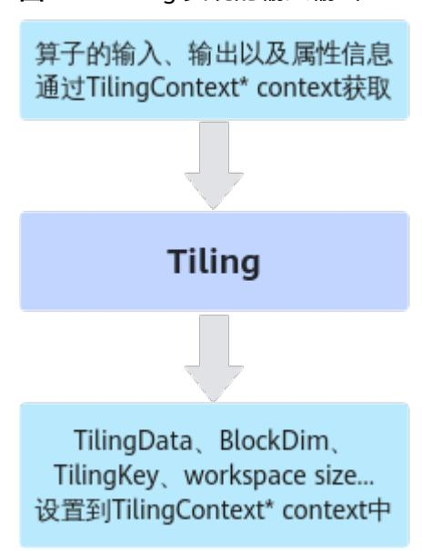

如上图所示,Tiling实现即为根据算子shape等信息来确定切分算法相关参数的过程, 这里的算子shape等信息可以理解为是**Tiling**实现的输入,切分算法相关参数可以理解 为是**Tiling**实现的输出。输入和输出都通过Tiling函数的参数(TilingContext\* context 上下文结构)来承载。也就是说,开发者可以从上下文结构中获取算子的输入、输出 以及属性信息,也就是**Tiling**实现的输入,经过Tiling计算后,获取到TilingData数据 结构(切分算法相关参数)、blockDim变量、用于选择不同的kernel实现分支的 TilingKey、算子workspace的大小,也就是**Tiling**实现的输出,并将这些输出设置到上 下文结构中。

TilingData、blockDim、TilingKey、workspace这些概念的具体解释如下:

● **TilingData**:切分算法相关参数,比如每次搬运的块大小,以及总共循环多少 次,通过结构体存储,由开发者自行设计。

TilingData结构定义支持单结构定义方法,也支持结构体嵌套:

– 单结构定义方法,以平铺的形式定义:

```
namespace optiling {
BEGIN_TILING_DATA_DEF(MyAddTilingData) // 声明tiling结构名字
 TILING_DATA_FIELD_DEF(uint32_t, field1); // 结构成员的类型和名字
 TILING_DATA_FIELD_DEF(uint32_t, field2);
 TILING_DATA_FIELD_DEF(uint32_t, field3);
END_TILING_DATA_DEF;
REGISTER_TILING_DATA_CLASS(MyAdd, MyAddTilingData) // tiling结构注册给算子
}
```

Tiling实现函数中对tiling结构成员赋值的方式如下:

```
MyAddTilingData myTiling;
myTiling.set_field1(1);
myTiling.set_field2(2);
```

### <span id="page-226-0"></span>– 支持结构体嵌套:

```
namespace optiling {
BEGIN_TILING_DATA_DEF(MyStruct1) // 声明结构1名字
 TILING_DATA_FIELD_DEF(uint32_t, field1); // 结构成员的类型和名字
 TILING_DATA_FIELD_DEF(uint32_t, field2); // 结构成员的类型和名字
END_TILING_DATA_DEF; 
REGISTER_TILING_DATA_CLASS(MyStruct1Op, MyStruct1) // 注册结构体到<op_type>Op
BEGIN_TILING_DATA_DEF(MyStruct2) // 声明结构2名字
 TILING_DATA_FIELD_DEF(uint32_t, field3); // 结构成员的类型和名字
 TILING_DATA_FIELD_DEF(uint32_t, field4); // 结构成员的类型和名字
END_TILING_DATA_DEF;
REGISTER_TILING_DATA_CLASS(MyStruct2Op, MyStruct2) // 注册结构体到<op_type>Op
BEGIN_TILING_DATA_DEF(MyAddTilingData) // 声明tiling结构名字
 TILING_DATA_FIELD_DEF_STRUCT(MyStruct1, st1); // 结构成员的引用结构体
 TILING_DATA_FIELD_DEF_STRUCT(MyStruct2, st2); // 结构成员的引用结构体
END_TILING_DATA_DEF;
REGISTER_TILING_DATA_CLASS(MyAdd, MyAddTilingData) // tiling结构注册给算子
}
```

### Tiling实现函数中对tiling结构成员赋值的方式如下:

```
MyAddTilingData myTiling;
myTiling.st1.set_field1(1);
myTiling.st1.set_field2(2);
myTiling.st2.set_field3(3);
myTiling.st2.set_field4(4);
```

● **blockDim**:规定了核函数将会在几个核上执行。例如,需要计算8M的数据,每 个核上计算1M的数据,blockDim设置为8,但是为了充分利用硬件资源,一般将 blockDim设置为硬件平台的核数,根据核数进行数据切分。

### 说明

blockDim是逻辑核的概念,取值范围为[1,65535]。为了充分利用硬件资源,一般设置为 物理核的核数或其倍数。对于耦合架构和分离架构,blockDim在运行时的意义和设置规则 有一些区别,具体说明如下:

- 耦合架构:由于其Vector、Cube单元是集成在一起的,blockDim用于设置启动多个 AICore核实例执行,不区分Vector、Cube。AI Core的核数可以通过**[GetCoreNumAiv](#page-2245-0)** 或者**[GetCoreNumAic](#page-2244-0)**获取。
- 分离架构
  - 针对仅包含Vector计算的算子,blockDim用于设置启动多少个Vector(AIV)实例 执行,比如某款AI处理器上有40个Vector核,建议设置为40。
  - 针对仅包含Cube计算的算子,blockDim用于设置启动多少个Cube(AIC)实例执 行,比如某款AI处理器上有20个Cube核,建议设置为20。
  - 针对Vector/Cube融合计算的算子,启动时,按照AIV和AIC组合启动,blockDim 用于设置启动多少个组合执行,比如某款AI处理器上有40个Vector核和20个Cube 核,一个组合是2个Vector核和1个Cube核,建议设置为20,此时会启动20个组 合,即40个Vector核和20个Cube核。注意:该场景下,设置的**blockDim**逻辑核 的核数不能超过物理核(**2**个**Vector**核和**1**个**Cube**核组合为**1**个物理核)的核数。
  - AIC/AIV的核数分别通过**[GetCoreNumAic](#page-2244-0)**和**[GetCoreNumAiv](#page-2245-0)**接口获取。
- **TilingKey**(可选):TilingKey是一个算子内为了区分不同的实现而将kernel代码 进行区分的方法,该方法类似于C++的Template模板机制,可减少不必要的 icache miss以及scalar耗时,有助于优化单次调用kernel的性能。不同的kernel实 现分支可以通过TilingKey来标识,host侧设置TilingKey后,可以选择对应的分 支。例如,一个算子在不同的shape下,有不同的算法逻辑,kernel侧可以通过 TilingKey来选择不同的算法逻辑,在host侧Tiling算法也有差异,host/kernel侧通 过相同的TilingKey进行关联。

### 假如有如下kernel代码:

```
if (condition) {
 ProcessA();
```

```
} else {
 ProcessB();
}
```

如果函数ProcessA、ProcessB两个函数是个非常大的函数,那么上述代码在编译 后会变得更大,而每次kernel运行只会选择1个分支,条件的判断和跳转在代码大 到一定程度(16-32K,不同芯片存在差异)后会出现icache miss。通过TilingKey 可以对这种情况进行优化,给2个kernel的处理函数设置不同的TilingKey 1和2:

```
if (TILING_KEY_IS(1)) {
 ProcessA();
} else if (TILING_KEY_IS(2)) {
 ProcessB();
}
```

这样device kernel编译时会自动识别到2个TilingKey并编译2个kernel入口函数, 将条件判断进行常量折叠。同时需要和host tiling函数配合,判断走ProcessA的场 景设置TilingKey为1,走ProcessB的场景设置TilingKey为2:

```
static ge::graphStatus TilingFunc(gert::TilingContext* context)
{
 // some code
 if (condition) {
 context->SetTilingKey(1);
 } else {
 context->SetTilingKey(2);
 }
 return ge::GRAPH_SUCCESS;
}
```

### 说明

编译时,可以通过设置**[--tiling\\_keys](#page-241-0)**编译选项指定TilingKey,编译时只编译指定TilingKey 相关的kernel代码,用于加速编译过程。

- **WorkspaceSize**(可选):workspace是设备侧Global Memory上的一块内存。 在Tiling函数中可以设置workspace的大小,框架侧会为其申请对应大小的设备侧 Global Memory,在对应的算子kernel侧实现时可以使用这块workspace内存。 workspace内存分为两部分:Ascend C API需要的workspace内存和算子实现使用 到的workspace内存(按需)。
  - Ascend C API需要预留workspace内存 API在计算过程需要一些workspace内存作为缓存,因此算子Tiling函数需要 为API预留workspace内存,预留内存大小通过 **[GetLibApiWorkSpaceSize](#page-2249-0)**接 口获取。
  - 算子实现使用到的workspace内存(按需) 算子内部需要通过额外的device内存进行数据交换或者缓存的时候才需要分 配,根据算子计算的空间自行分配。

整体的workspace内存就是上述两部分之和,在Tiling函数中设置方法如下:

auto workspaceSizes = context->GetWorkspaceSizes(1); // 只使用1块workspace workspaceSizes[0] = sysWorkspaceSize + usrWorkspaceSize;

## **Tiling** 实现基本流程

Tiling实现开发的流程图如下:

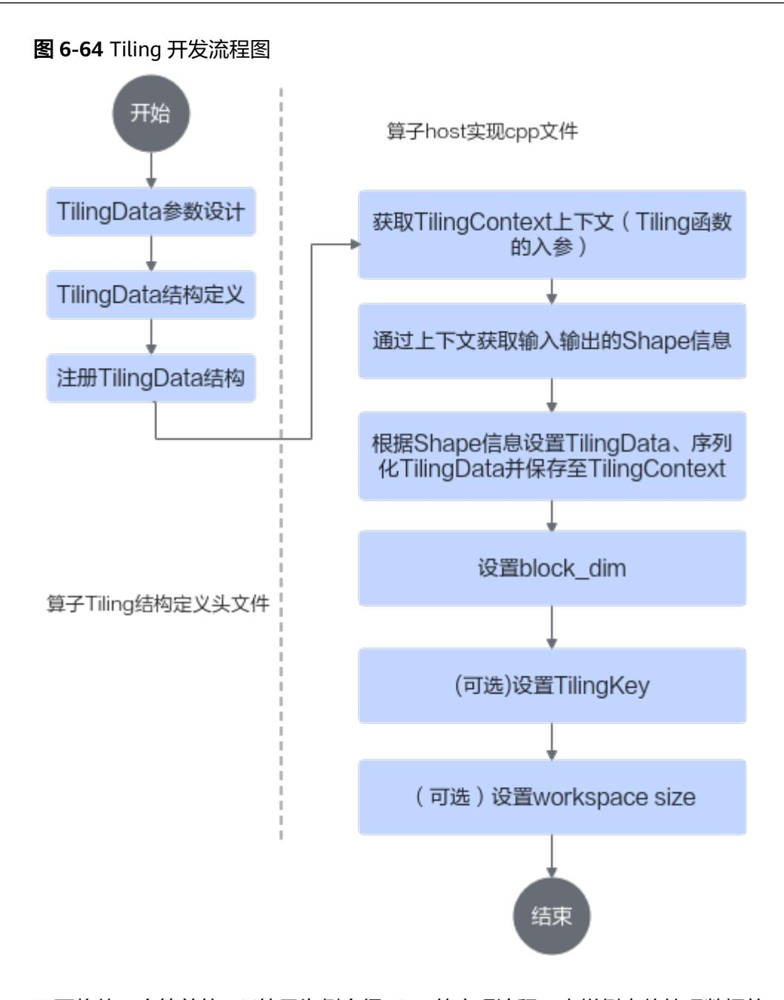

下面将从一个简单的Add算子为例介绍Tiling的实现流程。本样例中待处理数据的 Shape大小可以平均分配到每个核上,并且可以对齐到一个datablock(32B)的大 小。

首先完成算子TilingData结构定义头文件的编写,该文件命名为"算子名称 \_tiling.h",位于算子工程的op\_host目录下。样例代码如下:

```
#ifndef ADD_CUSTOM_TILING_H
#define ADD_CUSTOM_TILING_H
#include "register/tilingdata_base.h"
namespace optiling {
BEGIN_TILING_DATA_DEF(TilingData) // 注册一个tiling的类,以tiling的名字作为入参
 TILING_DATA_FIELD_DEF(uint32_t, totalLength); // 添加tiling字段,总计算数据量
 TILING_DATA_FIELD_DEF(uint32_t, tileNum); // 添加tiling字段,每个核上总计算数据分块个数
END_TILING_DATA_DEF;
// 注册算子tilingdata类到对应的AddCustom算子
REGISTER_TILING_DATA_CLASS(AddCustom, TilingData)
```

```
}
#endif // ADD_CUSTOM_TILING_H
```

### 具体的编写步骤如下:

步骤**1** 代码框架编写,需要增加#ifndef...的判断条件,防止头文件的重复包含;需要包含 register/tilingdata\_base.h头文件,tilingdata\_base.h中定义了多个用于tilingdata注册 的宏。样例代码如下:

```
#ifndef ADD_CUSTOM_TILING_H
#define ADD_CUSTOM_TILING_H
#include "register/tilingdata_base.h"
namespace optiling {
// tiling结构定义和注册代码
// ...
}
#endif // ADD_CUSTOM_TILING_H
```

步骤**2** TilingData参数设计,TilingData参数本质上是和并行数据切分相关的参数,本示例算 子使用了2个tiling参数:totalLength、tileNum。totalLength是指需要计算的数据量 大小,tileNum是指每个核上总计算数据分块个数。比如,totalLength这个参数传递 到kernel侧后,可以通过除以参与计算的核数,得到每个核上的计算量,这样就完成 了多核数据的切分。

步骤**3** TilingData结构定义,通过BEGIN\_TILING\_DATA\_DEF接口定义一个TilingData的类, 通过TILING\_DATA\_FIELD\_DEF接口增加TilingData的两个字段totalLength、 tileNum,通过END\_TILING\_DATA\_DEF接口结束TilingData定义。相关接口的详细说 明请参考**[14.1.6.2.1 TilingData](#page-2214-0)**结构定义。

```
BEGIN_TILING_DATA_DEF(TilingData) // 注册一个tiling的类,以tiling的名字作为入参
 TILING_DATA_FIELD_DEF(uint32_t, totalLength); // 添加tiling字段,总计算数据量
 TILING_DATA_FIELD_DEF(uint32_t, tileNum); // 添加tiling字段,每个核上总计算数据分块个数
END_TILING_DATA_DEF;
```

步骤**4** 注册TilingData结构,通过REGISTER\_TILING\_DATA\_CLASS接口,注册TilingData类, 和自定义算子相关联。REGISTER\_TILING\_DATA\_CLASS第一个参数为op\_type(算子类 型),本样例中传入AddCustom,第二个参数为TilingData的类名。 REGISTER\_TILING\_DATA\_CLASS接口介绍请参考**[14.1.6.2.2 TilingData](#page-2217-0)**结构注册。

// 注册算子tilingdata类到对应的AddCustom算子 REGISTER\_TILING\_DATA\_CLASS(AddCustom, TilingData)

### **----**结束

然后完成算子host实现cpp文件中Tiling函数实现,该文件命名为"算子名称.cpp", 位于算子工程的op\_host目录下。样例代码如下:

```
namespace optiling {
const uint32_t BLOCK_DIM = 8;
const uint32_t TILE_NUM = 8;
static ge::graphStatus TilingFunc(gert::TilingContext *context)
 TilingData tiling;
 uint32_t totalLength = context->GetInputShape(0)->GetOriginShape().GetShapeSize();
 context->SetBlockDim(BLOCK_DIM);
 tiling.set_totalLength(totalLength);
 tiling.set_tileNum(TILE_NUM);
 tiling.SaveToBuffer(context->GetRawTilingData()->GetData(), context->GetRawTilingData()-
>GetCapacity());
 context->GetRawTilingData()->SetDataSize(tiling.GetDataSize());
 size_t *currentWorkspace = context->GetWorkspaceSizes(1);
 currentWorkspace[0] = 0;
 return ge::GRAPH_SUCCESS;
}
} // namespace optiling
```

### 具体步骤如下:

步骤**1** 获取TilingContext的上下文,即Tiling函数的入参gert::TilingContext\* context。

步骤**2** 设置TilingData。[在步骤](#page-229-0)**3**中定义了TilingData类后,可以创建该类的一个实例,并通 过调用set\_{field\_name}方法来设置各个字段值(其中field\_name[是步骤](#page-229-0)**3**中定义的 tiling字段名)。设置完tiling字段后,通过调用SaveToBuffer方法完成TilingData实例 的序列化和保存。

1. 通过上下文获取输入输出shape信息。本样例中通过TilingContext的**[14.2.2.23.2](#page-2561-0) [GetInputShape](#page-2561-0)**接口获取输入的shape大小。

// 获取输入shape信息

uint32\_t totalLength = context->GetInputShape(0)->GetOriginShape().GetShapeSize();

2. 设置TilingData。通过调用set\_{field\_name}方法来设置TilingData的字段值。 // 用TilingData定义一个具体的实例

TilingData tiling; // 设置TilingData

tiling.set\_totalLength(totalLength);

tiling.set\_tileNum(TILE\_NUM);

3. 调用TilingData类的SaveToBuffer接口完成序列化并保存至TilingContext上下文。 SaveToBuffer的第一个参数为存储Buffer的首地址,第二个参数为Buffer的长度。 通过调用**[14.2.2.23.22 GetRawTilingData](#page-2575-0)**获取无类型的TilingData的地址,再通 过**[14.2.2.24.6 GetData](#page-2584-0)**获取数据指针,作为Buffer的首地址;通过调用 **[14.2.2.23.22 GetRawTilingData](#page-2575-0)**获取无类型的TilingData的地址,再通过 **[14.2.2.24.3 GetCapacity](#page-2582-0)**获取TilingData的长度,作为Buffer的长度。完成 SaveToBuffer操作后需要通过**[14.2.2.24.5 SetDataSize](#page-2584-0)**设置TilingData的长度,该 长度通过TilingData类的GetDataSize接口获取。

// 序列化并保存

tiling.SaveToBuffer(context->GetRawTilingData()->GetData(), context->GetRawTilingData()- >GetCapacity());

context->GetRawTilingData()->SetDataSize(tiling.GetDataSize());

步骤**3** 通过**[14.2.2.23.13 SetBlockDim](#page-2569-0)**接口设置blockDim。

context->SetBlockDim(BLOCK\_DIM);

步骤**4** (可选)通过**[14.2.2.23.11 SetTilingKey](#page-2567-0)**设置TilingKey。

context->SetTilingKey(1);

步骤**5** (可选)通过**[14.2.2.23.23 GetWorkspaceSizes](#page-2576-0)**获取workspace size指针,并设置size 大小。此处仅作为举例,设置workspace的大小为0。

size\_t \*currentWorkspace = context->GetWorkspaceSizes(1); currentWorkspace[0] = 0;

**----**结束

## **Tiling** 参数设计更多样例**-**属性信息通过 **TilingData** 传递

如果算子包含属性信息,该属性信息可以通过TilingData传递到kernel侧,参与kernel 侧算子核函数的计算。以ReduceMaxCustom算子为例,该算子用于对输入数据按维度 dim返回最大值,并且返回索引。ReduceMaxCustom算子有两个属性,reduceDim和 isKeepDim,reduceDim表示按照哪一个维度进行reduce操作;isKeepDim表示是否需 要保持输出的维度与输入一样。本样例仅支持对最后一维做reduce操作,输入数据类 型为half。

1. ReduceMaxCustom算子TilingData的定义如下:这里我们重点关注 reduceAxisLen。参数reduceAxisLen表示获取reduceDim轴的长度,这里也就是 最后一维的长度。该参数后续会通过TilingData传递到kernel侧参与计算。 #ifndef REDUCE\_MAX\_CUSTOM\_TILING\_H #define REDUCE\_MAX\_CUSTOM\_TILING\_H

```
#include "register/tilingdata_base.h"
namespace optiling {
BEGIN_TILING_DATA_DEF(ReduceMaxTilingData)
 TILING_DATA_FIELD_DEF(uint32_t, reduceAxisLen); // 添加tiling字段,reduceDim轴的长度
 //其他TilingData参数的定义
 ...
END_TILING_DATA_DEF;
// 注册算子tilingdata类到对应的ReduceMaxCustom算子
REGISTER_TILING_DATA_CLASS(ReduceMaxCustom, ReduceMaxTilingData)
}
#endif // REDUCE_MAX_CUSTOM_TILING_H
```

2. ReduceMaxCustom算子的Tiling实现如下。这里我们重点关注属性信息通过 TilingData传递的过程:首先通过TilingContext上下文从attr获取reduceDim属性 值;然后根据reduceDim属性值获取reduceDim轴的长度并设置到TilingData中。 namespace optiling {

```
static ge::graphStatus TilingFunc(gert::TilingContext* context)
 ReduceMaxTilingData tiling;
 // 从attr获取reduceDim属性值,因为reduceDim是第一个属性,所以GetAttrPointer传入的索引值为0
 const gert::RuntimeAttrs* attrs = context->GetAttrs();
 const uint32_t* reduceDim = attrs->GetAttrPointer<uint32_t>(0);
 // 获取reduceDim轴的长度
 const gert::StorageShape* xShapePtr = context->GetInputShape(0);
 const gert::Shape& xShape = xShapePtr->GetStorageShape();
 const uint32_t reduceAxisLen = xShape.GetDim(*reduceDim);
 // 计算TilingData中除了reduceAxisLen之外其他成员变量的值
 ...
 // 将reduceAxisLen设置到tiling结构体中,传递到kernel函数使用
 tiling.set_reduceAxisLen(reduceAxisLen);
 // 设置TilingData中除了reduceAxisLen之外其他成员变量的值
 ...
 // TilingData序列化保存
 tiling.SaveToBuffer(context->GetRawTilingData()->GetData(), context->GetRawTilingData()-
>GetCapacity());
 context->GetRawTilingData()->SetDataSize(tiling.GetDataSize());
 ...
 return ge::GRAPH_SUCCESS;
}} // namespace optiling
```

## **Tiling** 参数设计更多样例**-**使用高阶 **API** 时配套的 **Tiling**

1. 首先进行tiling结构定义:

```
namespace optiling {
BEGIN_TILING_DATA_DEF(MyAddTilingData) // 声明tiling结构名字
 TILING_DATA_FIELD_DEF_STRUCT(TCubeTiling, cubeTilingData); // 引用高阶API的tiling结构体
 TILING_DATA_FIELD_DEF(uint32_t, field); // 结构成员的引用结构体
END_TILING_DATA_DEF;
REGISTER_TILING_DATA_CLASS(MyAdd, MyAddTilingData) // tiling结构注册给算子
}
```

2. 通过高阶API配套的tiling函数对tiling结构初始化:

```
static ge::graphStatus TilingFunc(gert::TilingContext* context) {
 int32_t M = 1024;
 int32_t N = 640;
 int32_t K = 256;
 int32_t baseM = 128;
 int32_t baseN = 128;
 auto ascendcPlatform = platform_ascendc::PlatformAscendC(context->GetPlatformInfo());
 MultiCoreMatmulTiling cubeTiling(ascendcPlatform);
 cubeTiling.SetDim(2);
 cubeTiling.SetAType(TPosition::GM, CubeFormat::ND, matmul_tiling::DataType::DT_FLOAT16);
 cubeTiling.SetBType(TPosition::GM, CubeFormat::ND, matmul_tiling::DataType::DT_FLOAT16);
 cubeTiling.SetCType(TPosition::LCM, CubeFormat::ND, matmul_tiling::DataType::DT_FLOAT);
 cubeTiling.SetBiasType(TPosition::GM, CubeFormat::ND, matmul_tiling::DataType::DT_FLOAT);
 cubeTiling.SetShape(M, N, K);
 cubeTiling.SetOrgShape(M, N, K);
 cubeTiling.SetFixSplit(baseM, baseN, -1);
 cubeTiling.SetBias(true);
```

```
 cubeTiling.SetBufferSpace(-1, -1, -1);
 MyAddTilingData tiling;
 if (cubeTiling.GetTiling(tiling.cubeTilingData) == -1){
 return ge::GRAPH_FAILED;
 }
 // some code
}
```

## 使用标准 **C++**语法定义 **TilingData**

支持使用标准C++语法定义POD类型(Plain Old Data,即与C语言兼容的数据类型)的 TilingData结构体。相比较使用BEGIN\_TILING\_DATA\_DEF等宏进行定义的方式,该方 式更符合开发者的开发习惯,并且提供了更大的灵活性。支持结构体数组、自定义 TilingData赋值函数、同名结构体等特性。具体使用步骤如下:

步骤**1** 使用C++语法定义TilingData结构体。

该结构体定义所在头文件需放置算子工程的op\_kernel目录下。

```
#ifndef ADD_CUSTOM_TILING_H
#define ADD_CUSTOM_TILING_H
#include <cstdint>
class TilingData{
public:
 uint32_t totalLength;
 uint32_t tileNum;
};
#endif // ADD_CUSTOM_TILING_H
```

### 步骤**2** Host侧tiling函数中对TilingData赋值。

- 需要包含TilingData定义头文件。
- 通过**[GetTilingData](#page-2574-0)**获取TilingData,并对其成员变量进行赋值。

```
#include "../op_kernel/add_custom_tiling.h" // 包含TilingData定义头文件
namespace optiling {
const uint32_t BLOCK_DIM = 8;
const uint32_t TILE_NUM = 8;
static ge::graphStatus TilingFunc(gert::TilingContext* context)
 TilingData *tiling = context->GetTilingData<TilingData>(); // 获取TilingData结构体
 uint32_t totalLength = context->GetInputTensor(0)->GetShapeSize();
 context->SetBlockDim(BLOCK_DIM);
 tiling->totalLength = totalLength; // 赋值TilingData成员变量
 tiling->tileNum = TILE_NUM; // 赋值TilingData成员变量
 size_t *currentWorkspace = context->GetWorkspaceSizes(1);
 currentWorkspace[0] = 0;
 return ge::GRAPH_SUCCESS;
}
} // namespace optiling
```

### 步骤**3** Kernel侧通过**[REGISTER\\_TILING\\_DEFAULT](#page-1230-0)**或者**[REGISTER\\_TILING\\_FOR\\_TILINGKEY](#page-1231-0)** 注册TilingData结构体,解析tiling数据至TilingData结构并使用,其中 **[REGISTER\\_TILING\\_DEFAULT](#page-1230-0)**同时也用于标识使用标准C++语法定义TilingData结构 体。

注册TilingData结构体用于告知框架侧用户使用标准C++语法来定义TilingData,同时 告知框架TilingData结构体类型,用于框架做tiling数据解析。

```
#include "add_custom_tiling.h" // 包含TilingData定义头文件
#include "kernel_operator.h"
extern "C" __global__ __aicore__ void add_custom(GM_ADDR x, GM_ADDR y, GM_ADDR z, GM_ADDR 
workspace, GM_ADDR tiling)
{
 REGISTER_TILING_DEFAULT(TilingData); // 注册默认TilingData结构体
```

```
 GET_TILING_DATA(tilingData, tiling); // kernel侧解析tiling数据,对TilingData结构赋值
 KernelAdd op;
 op.Init(x, y, z, tilingData.totalLength, tilingData.tileNum);
 ......
}
```

### **----**结束

使用标准C++语法定义TilingData时存在如下约束限制:

● TilingData成员变量不支持指针、引用类型,此类数据类型会导致host侧到device 侧数据解析异常:

```
class TilingData {
public:
 uint32_t* totalLength; // 指针场景不支持,Host无法传递指针到Device
 uint32_t& tileNum; // 引用场景不支持,Host无法传递指针到Device
};
```

● TilingData结构体仅支持POD类型,没有虚函数、虚继承等面向对象特性,也不 支持模板类:

```
class A {
public:
 uint32_t totalLength;
 uint32_t tileNum;
};
class B: public A {
public:
 uint32_t xxx;
 uint32_t xxx;
};
static ge::graphStatus TilingFunc(gert::TilingContext* context)
{
 // 错误用法
 B *tiling = context->GetTilingData<A>(); // 不支持,会触发未知问题
 // 正确用法
 B *tiling = context->GetTilingData<B>();
 ......
 return ge::GRAPH_SUCCESS;
}
```

● GetTilingData获取的TilingData不包含初值,需显示赋值或在TilingData类中定义 并调用赋值函数;

```
static ge::graphStatus TilingFunc(gert::TilingContext* context)
 TilingData *tiling = context->GetTilingData<TilingData>(); //获取TilingData结构体,此时
totalLength、tileNum为0,并不会带入初始值
 ......
 // 需显示赋值
 tiling->totalLength = totalLength; // 赋值TilingData成员变量
 tiling->tileNum = TILE_NUM; // 赋值TilingData成员变量
 ......
 return ge::GRAPH_SUCCESS;
```

## **Tiling** 模板编程

在**[TilingKey](#page-226-0)**编程章节介绍的TilingKey编程方式中,TilingKey不易于记忆和理解,因为 它们通常是较长又没有明确含义的数字。

在涉及多个TilingKey的场景中,开发者依赖TilingKey来管理kernel的实现,无论是在 管理还是使用上都会遇到相当大的复杂性。为了简化这一过程,可以采用模板编程的 方法来替代传统的TilingKey编程,从而减少对TilingKey数值标识的依赖,使kernel的 管理更加直观和高效。使用步骤如下:

步骤**1** [在自定义算子工程的](#page-213-0)op\_kernel目录下,新增定义模板参数和模板参数组合的头文件, 本示例中头文件命名为tiling\_key\_add\_custom.h。

- 该头文件中需要包含模板头文件ascendc/host\_api/tiling/template\_argument.h。
- 定义模板参数ASCENDC\_TPL\_ARGS\_DECL和模板参数组合 ASCENDC\_TPL\_ARGS\_SEL(即可使用的模板)。具体API参考见**[14.1.6.2.5](#page-2234-0)** 模板 [参数定义。](#page-2234-0)

```
#include "ascendc/host_api/tiling/template_argument.h"
#define ADD_TPL_FP16 1 // 数据类型定义
#define ADD_TPL_FP32 0
#define ADD_TPL_ND 2 // 数据格式定义
#define ADD_TPL_NZ 29
// 模板参数
ASCENDC_TPL_ARGS_DECL(AddTemplateCustom, // 算子OpType
ASCENDC_TPL_DTYPE_DECL(D_T_X, ADD_TPL_FP16, ADD_TPL_FP32), // DataType类型的模板参数定义:输入
参数x的数据类型,取值范围为float16/float32
ASCENDC_TPL_DTYPE_DECL(D_T_Y, ADD_TPL_FP16, ADD_TPL_FP32), // DataType类型的模板参数定义:输入
参数y的数据类型,取值范围为float16/float32
ASCENDC_TPL_DTYPE_DECL(D_T_Z, ADD_TPL_FP16, ADD_TPL_FP32), // DataType类型的模板参数定义:输入
参数z的数据类型,取值范围为float16/float32
ASCENDC_TPL_UINT_DECL(TILE_NUM, ASCENDC_TPL_8_BW, ASCENDC_TPL_UI_MIX, 2, 0, 2, 3, 5, 10, 12, 13, 
9, 8),// 自定义UINT类型(无符号整形)的模板参数定义:模板参数为切分的块数,编码位宽为
ASCENDC_TPL_8_BW即8比特,表示该模板参数的个数不超过8比特能表达的范围;ASCENDC_TPL_UI_MIX表示
通过混合模式表达取值范围,有2组的数据{0-2}、{3-5}和穷举值10、12、13、9、8,最后结果为{0, 1, 2, 3, 4, 
5, 10, 12, 13, 9, 8}
ASCENDC_TPL_BOOL_DECL(IS_SPLIT, 0, 1), // 自定义bool类型的模板参数定义:模板参数为是否切分标志位,
取值范围为0和1,1表示切分,0表示不切分
);
// 模板参数组合
// 用于调用GET_TPL_TILING_KEY获取TilingKey时,接口内部校验TilingKey是否合法
ASCENDC_TPL_SEL(
 ASCENDC_TPL_ARGS_SEL(
 ASCENDC_TPL_DTYPE_SEL(D_T_X, ADD_TPL_FP16),
 ASCENDC_TPL_DTYPE_SEL(D_T_Y, ADD_TPL_FP16),
 ASCENDC_TPL_DTYPE_SEL(D_T_Z, ADD_TPL_FP16),
 ASCENDC_TPL_UINT_SEL(TILE_NUM, ASCENDC_TPL_UI_LIST, 1, 8),
 ASCENDC_TPL_BOOL_SEL(IS_SPLIT, 0, 1),
 ),
 ASCENDC_TPL_ARGS_SEL(
 ASCENDC_TPL_DTYPE_SEL(D_T_X, ADD_TPL_FP32),
 ASCENDC_TPL_DTYPE_SEL(D_T_Y, ADD_TPL_FP32),
 ASCENDC_TPL_DTYPE_SEL(D_T_Z, ADD_TPL_FP32),
 ASCENDC_TPL_UINT_SEL(TILE_NUM, ASCENDC_TPL_UI_LIST, 1, 8),
 ASCENDC_TPL_BOOL_SEL(IS_SPLIT, 0, 1),
 ),
);
```

### 步骤**2** host侧调用**[GET\\_TPL\\_TILING\\_KEY](#page-2238-0)**接口生成TilingKey。

- host实现文件中包含[步骤](#page-233-0)**1**中定义模板参数和模板参数组合的头文件。
- 调用GET\_TPL\_TILING\_KEY接口生成TilingKey,GET\_TPL\_TILING\_KEY输入参数为 模板参数的具体值,传入时需要与定义模板参数和模板参数组合的头文件中的模 板参数顺序保持一致。

```
#include "tiling_key_add_custom.h"
static ge::graphStatus TilingFunc(gert::TilingContext *context)
{
 TilingData tiling;
 uint32_t totalLength = context->GetInputShape(0)->GetOriginShape().GetShapeSize();
 ge::DataType dtype_x = context->GetInputDesc(0)->GetDataType();
 ge::DataType dtype_y = context->GetInputDesc(1)->GetDataType();
 ge::DataType dtype_z = context->GetOutputDesc(1)->GetDataType();
 uint32_t D_T_X = ADD_TPL_FP32, D_T_Y=ADD_TPL_FP32, D_T_Z=ADD_TPL_FP32, TILE_NUM=1, 
IS_SPLIT=0;
 if(dtype_x == ge::DataType::DT_FLOAT){
 D_T_X = ADD_TPL_FP32;
```

```
 }else if(dtype_x == ge::DataType::DT_FLOAT16){
 D_T_X = ADD_TPL_FP16;
 }
 if(dtype_y == ge::DataType::DT_FLOAT){
 D_T_Y = ADD_TPL_FP32;
 }else if(dtype_y == ge::DataType::DT_FLOAT16){
 D_T_Y = ADD_TPL_FP16;
 }
 if(dtype_z == ge::DataType::DT_FLOAT){
 D_T_Z = ADD_TPL_FP32;
 }else if(dtype_z == ge::DataType::DT_FLOAT16){
 D_T_Z = ADD_TPL_FP16;
 }
 if(totalLength< MIN_LENGTH_FOR_SPLIT){
 IS_SPLIT = 0;
 TILE_NUM = 1;
 }else{
 IS_SPLIT = 1;
 TILE_NUM = DEFAULT_TILE_NUM;
 }
 context->SetBlockDim(BLOCK_DIM);
 tiling.set_totalLength(totalLength);
 tiling.SaveToBuffer(context->GetRawTilingData()->GetData(), context->GetRawTilingData()-
>GetCapacity());
 context->GetRawTilingData()->SetDataSize(tiling.GetDataSize());
 const uint64_t tilingKey = GET_TPL_TILING_KEY(D_T_X, D_T_Y, D_T_Z, TILE_NUM, IS_SPLIT);
 context->SetTilingKey(tilingKey);
 size_t *currentWorkspace = context->GetWorkspaceSizes(1);
 currentWorkspace[0] = 0;
 return ge::GRAPH_SUCCESS;
}
```

### 步骤**3** kernel侧实现

- host实现文件中包含[步骤](#page-233-0)**1**中定义模板参数和模板参数组合的头文件。
- 核函数添加template模板,以便支持模板参数的传入,参数顺序需要与定义模板 参数和模板参数组合的头文件中的模板参数顺序保持一致。
- 通过对模板参数的分支判断,选择不同的kernel侧实现。

```
#include "tiling_key_add_custom.h"
...
...
template<int D_T_X, int D_T_Y, int D_T_Z, int TILE_NUM, int IS_SPLIT>
 __global__ __aicore__ void add_custom(GM_ADDR x, GM_ADDR y, GM_ADDR z, GM_ADDR workspace, 
GM_ADDR tiling)
 GET_TILING_DATA(tiling_data, tiling);
 if(D_T_X == ADD_TPL_FP32 && D_T_Y == ADD_TPL_FP32 && D_T_Z == ADD_TPL_FP32){
 KernelAdd<float, float, float> op;
 op.Init(x, y, z, tiling_data.totalLength, TILE_NUM, IS_SPLIT);
 op.Process1();
 }else if(D_T_X == ADD_TPL_FP16 && D_T_Y == ADD_TPL_FP16 && D_T_Z == ADD_TPL_FP16){
 KernelAdd<half, half, half> op;
 if(IS_SPLIT == 0){
 op.Init(x, y, z, tiling_data.totalLength, TILE_NUM, IS_SPLIT);
 op.Process1();
 }else if(IS_SPLIT==1){
 op.Init(x, y, z, tiling_data.totalLength, TILE_NUM, IS_SPLIT);
 op.Process2();
 }
 }
}
```

### **----**结束

### 说明

完整样例请参考**Tiling**[模板编程样例](https://gitee.com/ascend/samples/tree/master/operator/ascendc/0_introduction/6_addtemplate_frameworklaunch)。

## <span id="page-236-0"></span>**6.7.6** 算子包编译

## **6.7.6.1** 算子工程编译

算子kernel侧和host侧实现开发完成后,需要对算子工程进行编译,生成自定义算子安 装包\*.run,详细的编译操作包括:

- 编译Ascend C算子kernel侧代码实现文件\*.cpp,分为源码发布和二进制发布两种 方式。
  - 源码发布:不对算子kernel侧实现进行编译,保留算子kernel源码文件 \*.cpp。该方式可以支持算子的在线编译、通过ATC模型转换的方式编译算子 的场景。
  - 二进制发布:对算子kernel侧实现进行编译,生成描述算子相关信息的json文 件\*.json和算子二进制文件\*.o。算子调用时,如果需要直接调用算子二进制, 则使用该编译方式,比如通过**6.7.8** [单算子](#page-246-0)**API**调用的方式完成单算子的调 用,**[9.2 PyTorch](#page-275-0)**框架中单算子调用的场景,动态网络中调用算子的场景。
- 编译Ascend C算子host侧代码实现文件\*.cpp、\*.h。
  - 将原型定义和shape推导实现编译成算子原型定义动态库 libcust\_opsproto\_\*.so,并生成算子原型对外接口op\_proto.h。
  - 将算子信息库定义编译成信息库定义文件\*.json。
  - 将Tiling实现编译成Tiling动态库liboptiling.so等。
  - 基于算子原型定义,自动生成单算子API调用代码和头文件aclnn\_\*.h,并编译 生成单算子API调用的动态库libcust\_opapi.so。

### 上述编译过程示意图如下:

### 图 **6-65** 算子工程编译示意图

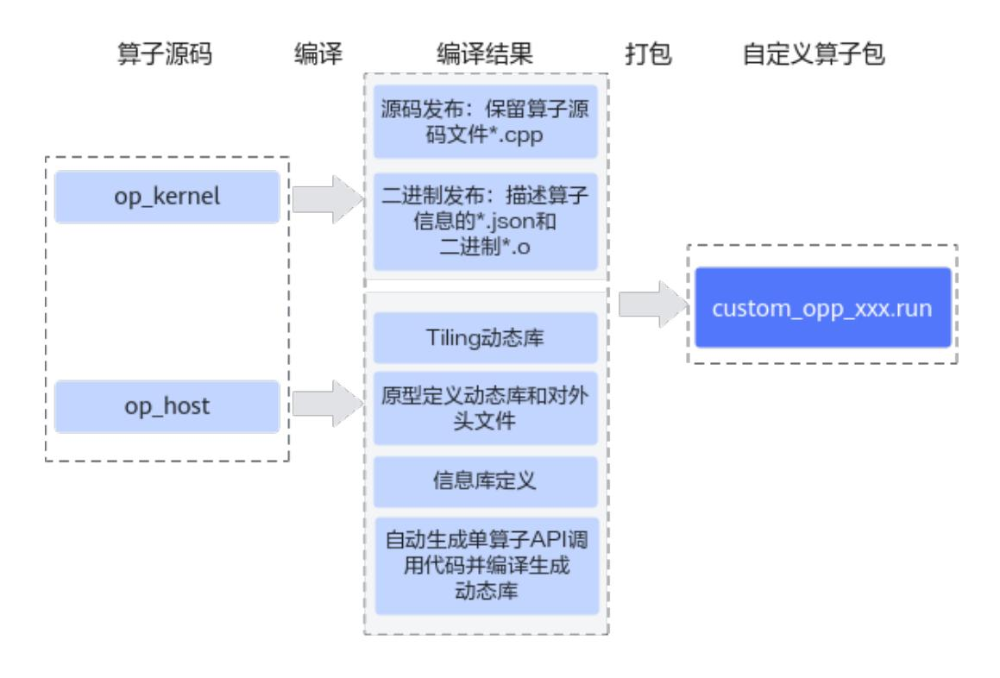

## <span id="page-237-0"></span>编译步骤

### 步骤**1** 完成工程编译相关配置。

● 修改工程目录下的**CMakePresets.json** cacheVariables的配置项。

```
CMakePresets.json文件内容如下:
 "version": 1,
 "cmakeMinimumRequired": {
 "major": 3,
 "minor": 19,
 "patch": 0
 },
 "configurePresets": [
 {
 "name": "default",
 "displayName": "Default Config",
 "description": "Default build using Unix Makefiles generator",
 "generator": "Unix Makefiles",
 "binaryDir": "${sourceDir}/build_out",
 "cacheVariables": {
 "CMAKE_BUILD_TYPE": {
 "type": "STRING",
 "value": "Release"
 },
 "ENABLE_SOURCE_PACKAGE": {
 "type": "BOOL",
 "value": "True"
 },
 "ENABLE_BINARY_PACKAGE": {
 "type": "BOOL",
 "value": "True"
 },
 "ASCEND_COMPUTE_UNIT": {
 "type": "STRING",
 "value": "ascendxxx"
 },
 "ENABLE_TEST": {
 "type": "BOOL",
 "value": "True"
 },
 "vendor_name": {
 "type": "STRING",
 "value": "customize"
 },
 "ASCEND_PYTHON_EXECUTABLE": {
 "type": "STRING",
 "value": "python3"
 },
 "CMAKE_INSTALL_PREFIX": {
 "type": "PATH",
 "value": "${sourceDir}/build_out"
 },
 "ENABLE_CROSS_COMPILE": {
 "type": "BOOL",
 "value": "False"
 },
 "CMAKE_CROSS_PLATFORM_COMPILER": {
 "type": "PATH",
 "value": "/usr/bin/aarch64-linux-gnu-g++"
 },
 "ASCEND_PACK_SHARED_LIBRARY": {
 "type": "BOOL",
 "value": "False"
 }
 }
 }
 ]
}
```

表 **6-17** 需要开发者配置的常用参数列表

| 参数名称                           | 参数描述                                                                                                                     | 默认值         |
|--------------------------------|--------------------------------------------------------------------------------------------------------------------------|-------------|
| CMAKE_BUILD_TYP<br>E           | 编译模式选项,可配置为:<br>–<br>"Release",Release版<br>本,不包含调试信息,编译<br>最终发布的版本。<br>–<br>"Debug","Debug"版<br>本,包含调试信息,便于开<br>发者开发和调试。 | "Release"   |
| ENABLE_SOURCE_P<br>ACKAGE      | 是否开启源码编译                                                                                                                 | "True"      |
| ENABLE_BINARY_PA<br>CKAGE      | 是否开启二进制编译                                                                                                                | "True"      |
| vendor_name                    | 标识自定义算子所属厂商的名<br>称。建议开发者自行指定所属<br>厂商名称,避免和其他厂商提<br>供的算子包冲突。                                                              | "customize" |
| ASCEND_PACK_SHA<br>RED_LIBRARY | 是否开启动态库编译功能。                                                                                                             | "False"     |

### ● 配置编译相关环境变量(可选)

### 表 **6-18** 环境变量说明

| 环境变量                            | 配置说明                                                                                                                                               |
|---------------------------------|----------------------------------------------------------------------------------------------------------------------------------------------------|
| CMAKE_CXX_COMPI<br>LER_LAUNCHER | 用于配置C++语言编译器(如g++)、毕昇编译器的启<br>动器程序为ccache,配置后即可开启cache缓存编译,<br>加速重复编译并提高构建效率。使用该功能前需要安装<br>ccache。                                                 |
|                                 | 配置方法如下,在对应的CMakeLists.txt进行设置:<br>set(CMAKE_CXX_COMPILER_LAUNCHER <launcher_program>)</launcher_program>                                           |
|                                 | 其中 <launcher_program>是ccache的安装路径,比如<br/>ccache的安装路径为/usr/bin/ccache,示例如下:<br/>set(CMAKE_CXX_COMPILER_LAUNCHER /usr/bin/ccache)</launcher_program> |

### 步骤**2** 在算子工程目录下执行如下命令,进行算子工程编译。

### **./build.sh**

编译成功后,会在当前目录下创建build\_out目录,并在build\_out目录下生成自定义算 子安装包**custom\_opp\_**<target os>**\_**<target architecture>**.run**。

用户如果需要编译过程日志存盘,可以使用环境变量ASCENDC\_BUILD\_LOG\_DIR来控 制存储路径。用户设置该选项之后,如果编译过程中无错误产生,则对应的log文件后 缀会添加"\_success",若编译过程有错误产生,则会在屏幕打印对应的报错信息,以及 指示用户log文件的具体路径与文件名,同时,对应log文件后缀会添加"\_error"。

# 如希望编译日志存储在/home/build\_log/,则可以按照如下设置,默认不打开日志存储 export ASCENDC\_BUILD\_LOG\_DIR=/home/build\_log/

### **----**结束

## <span id="page-239-0"></span>算子包交叉编译

完成算子代码实现后,如果当前平台架构和运行环境一致则参考上一节的内容进行编 译即可,如果需要实现算子包的交叉编译,您可以参考如下流程。

步骤**1** 交叉编译工具下载,下表以Ubuntu系列操作系统为例,展示了编译工具下载命令的样 例。其他操作系统,请替换为实际的下载命令。

表 **6-19** Ubuntu 系列操作系统交叉编译工具下载命令样例

| 当前平台架构  | 运行环境平台架构 | 编译工具下载命令                                         |
|---------|----------|--------------------------------------------------|
| x86_64  | aarch64  | sudo apt-get install -y g++-aarch64-linux<br>gnu |
| aarch64 | x86_64   | sudo apt-get install g++-x86-64-linux-gnu        |

### 步骤**2** 自定义算子工程交叉编译,构建生成自定义算子包。

1. 修改CMakePresets.json中**ENABLE\_CROSS\_COMPILE**为True,使能交叉编译。 "**ENABLE\_CROSS\_COMPILE**": {

```
 "type": "BOOL",
 "value": "True"
 }
```

2. 修改CMakePresets.json中**CMAKE\_CROSS\_PLATFORM\_COMPILER**为安装后的 交叉编译工具路径。

```
"CMAKE_CROSS_PLATFORM_COMPILER": {
 "type": "PATH",
 "value": "/usr/bin/aarch64-linux-gnu-g++"
}
```

3. 在算子工程目录下执行如下命令,进行算子工程交叉编译。

### **./build.sh**

编译成功后,会在当前目录下创建build\_out目录,并在build\_out目录下生成自定 义算子安装包**custom\_opp\_**<target os>**\_**<target architecture>**.run**

### **----**结束

## 支持自定义编译选项

在算子工程中,如果开发者想对算子kernel侧代码增加一些自定义的编译选项,可以 参考如下内容进行编译选项的定制。

修改算子工程op\_kernel目录下的CMakeLists.txt,使用add\_ops\_compile\_options来增 加编译选项,方法如下:

add\_ops\_compile\_options(OpType COMPUTE\_UNIT soc\_version1 soc\_version2 ... OPTIONS option1 option2 ...)

### 具体参数的介绍如下:

### <span id="page-240-0"></span>表 **6-20** 具体参数介绍

| 参数名称         | 可选/必<br>选 | 参数描述                                                                                                                                                                                                                                                                                                                                                                                                                                                                                                                                                                                                                         |
|--------------|-----------|------------------------------------------------------------------------------------------------------------------------------------------------------------------------------------------------------------------------------------------------------------------------------------------------------------------------------------------------------------------------------------------------------------------------------------------------------------------------------------------------------------------------------------------------------------------------------------------------------------------------------|
| OpType(算子类型) | 必选        | 第一个参数应传入算子类型,如果需要对算<br>子工程中的所有算子生效,需要配置为<br>ALL。                                                                                                                                                                                                                                                                                                                                                                                                                                                                                                                                                                             |
| COMPUTE_UNIT | 可选        | 标识编译选项在哪些AI处理器型号上生效,<br>多个型号之间通过空格间隔。不配置时表示<br>对所有AI处理器型号生效。<br>说明<br>COMPUTE_UNIT具体配置如下:<br>●<br>非Atlas A3 训练系列产品/Atlas A3 推理系列<br>产品:在安装昇腾AI处理器的服务器执行<br>npu-smi info命令进行查询,获取Name信<br>息。实际配置值为AscendName,例如Name<br>取值为xxxyy,实际配置值为Ascendxxxyy。<br>●<br>Atlas A3 训练系列产品/Atlas A3 推理系列产<br>品:在安装昇腾AI处理器的服务器执行npu<br>smi info -t board -i id -c chip_id命令进行查<br>询,获取Chip Name和NPU Name信息,实<br>际配置值为Chip Name_NPU Name。例如<br>Chip Name取值为Ascendxxx,NPU Name<br>取值为1234,实际配置值为<br>Ascendxxx_1234。<br>其中:<br>●<br>id:设备id,通过npu-smi info -l命令查<br>出的NPU ID即为设备id。<br>●<br>chip_id:芯片id,通过npu-smi info -m<br>命令查出的Chip ID即为芯片id。 |

<span id="page-241-0"></span>

| 自定义的编译选项。多个编译选项之间通过<br>增加-D编译选项,用于在编译时定义<br>增加-g -O0等调试用编译选项。<br>增加Ascend C框架提供的调试用编译选<br>-DASCENDC_DUMP用于控制Dump<br>开关,默认开关打开,开发者调用<br>printf/DumpTensor/assert后会有信<br>息打印;设置为0后,表示开关关<br>-DASCENDC_DEBUG用于控制<br>Ascend C API的调测开关,默认开关<br>关闭;增加该编译选项后,表示开关<br>打开,此时接口内部的assert校验生<br>效,校验不通过会有assert日志打<br>屏。开启该功能会对算子实际运行的<br>性能带来一定影响,通常在调测阶段<br>当前-DASCENDC_DEBUG功能支持的<br>Atlas A2 训练系列产品/Atlas 800I<br>A2 推理产品/A200I A2 Box 异构组件<br>tiling_key,设置该选项后,只编译<br>指定的TilingKey相关的kernel代码,<br>用于加速编译过程。若不指定<br>TilingKey编译,则默认编译所有的<br>TilingKey。配置多个TilingKey时,<br>TilingKey之间不能有空格。示例如<br>下,其中1、2为tiling_key。 |
|-----------------------------------------------------------------------------------------------------------------------------------------------------------------------------------------------------------------------------------------------------------------------------------------------------------------------------------------------------------------------------------------------------------------------------------------------------------------------------------------------------------------------------------------------------------------------------------------------------------------|
|                                                                                                                                                                                                                                                                                                                                                                                                                                                                                                                                                                                                                 |

### <span id="page-242-0"></span>须知

- 编译选项是基于"算子类型+AI处理器型号系列"进行配置的,也就是说不同的 "算子类型+AI处理器型号系列"可以配置不同的编译选项。 add\_ops\_compile\_options(AddCustom COMPUTE\_UNIT Ascendxxxyy ... OPTIONS -DNEW\_MACRO1=xx) add\_ops\_compile\_options(AddCustom COMPUTE\_UNIT Ascendxxxyy ... OPTIONS -DNEW\_MACRO2=xx) add\_ops\_compile\_options(AddCustom COMPUTE\_UNIT Ascendxxxyy ... OPTIONS -DNEW\_MACRO3=xx)
- 对相同算子类型+AI处理器型号系列,做多次编译选项配置,以后配置的为准。
- 对ALL生效的编译选项和对单一算子生效的编译选项如果没有冲突,同时生效,如 果有冲突,以单一算子的编译选项为准。

## **6.7.6.2** 算子包部署

算子包部署指执行自定义算子包的安装,算子工程的编译结果会自动部署到算子包安 装目录下。

## 算子包部署

步骤**1** 自定义算子包安装部署。

在自定义算子包所在路径下,执行如下命令,安装自定义算子包。

**./custom\_opp\_**<target os>**\_**<target architecture>**.run --install-path=**<path>

--install-path为可选参数,用于指定自定义算子包的安装目录。支持指定绝对路径, 运行用户需要对指定的安装路径有可读写权限。

下文描述中的<vendor\_name>为算子工程编译时CMakePresets.json配置文件中字段 "vendor\_name"的取值,默认为"customize"。

● 默认安装场景,不配置--install-path参数,安装成功后会将编译生成的自定义算 子相关文件部署到\${INSTALL\_DIR}/opp/vendors/<vendor\_name>目录。\$ {INSTALL\_DIR}请替换为CANN软件安装后文件存储路径。例如,若安装的 Ascend-cann-toolkit软件包,安装后文件存储路径示例为:\$HOME/Ascend/ ascend-toolkit/latest。

### 说明

自定义算子包默认安装路径\${INSTALL\_DIR}/opp/vendors的目录权限与CANN软件包安装 用户和安装配置有关。如果因权限不足导致自定义算子包安装失败,可使用--install-path 参数并配置环境变量ASCEND\_CUSTOM\_OPP\_PATH来指定安装目录(参考指定目录安 装)或者联系CANN软件包的安装用户修改vendors目录权限来解决。详细的案例请参考 **13.8** [调用算子时出现无法打开](#page-399-0)**config.ini**的报错和**13.9** [算子包部署时出现权限不足报错](#page-400-0)。

● 指定目录安装场景,配置--install-path参数,安装成功后会将编译生成的自定义 算子相关文件部署到<path>/vendors/<vendor\_name>目录,并在<path>/ vendors/<vendor\_name>/bin目录下新增set\_env.bash,写入当前自定义算子包相 关的环境变量。

### 须知

如果部署算子包时通过配置--install-path参数指定了算子包的安装目录,则在使 用自定义算子前,需要执行**source <path>/vendors/<vendor\_name>/bin/ set\_env.bash**命令,**set\_env.bash**脚本中将自定义算子包的安装路径追加到环境 变量ASCEND\_CUSTOM\_OPP\_PATH中,使自定义算子在当前环境中生效。

命令执行成功后,自定义算子包中的相关文件将部署至当前环境中。

### 步骤**2** 以默认安装场景为例,可查看部署后的目录结构,如下所示:

```
├── opp //算子库目录
│ ├── vendors //自定义算子所在目录
│ ├── config.ini
│ └── vendor_name1 // 存储对应厂商部署的自定义算子,此名字为编译自定义算子安装包时配置的
vendor_name,若未配置,默认值为customize
│ ├── framework //自定义算子插件库
│ ├── op_api
│ │ ├── include
│ │ │ └── aclnn_xx.h //算子调用API声明文件
│ │ └── lib
│ │ └── libcust_opapi.so
│ ├── op_impl
│ │ └── ai_core
│ │ └── tbe
│ │ ├── config
│ │ │ └── ${soc_version} //昇腾AI处理器类型
│ │ │ └── aic-${soc_version}-ops-info.json //自定义算子信息库文件
│ │ ├── vendor_name1_impl //自定义算子实现代码文件
│ │ │ └── dynamic
│ │ │ ├── xx.cpp
│ │ │ └── xx.py
│ │ ├── kernel //自定义算子二进制文件
│ │ │ └── ${soc_version} //昇腾AI处理器类型
│ │ │ └── config
│ │ └── op_tiling
│ │ ├── lib
│ │ └── liboptiling.so 
│ └── op_proto //自定义算子原型库所在目录
│ ├── inc
│ │ └── op_proto.h
│ └── lib
│ ├── vendor_name2 // 存储厂商vendor_name2部署的自定义算子
```

### 步骤**3** 配置自定义算子优先级。

多算子包共存的情况下,若不同的算子包目录下存在相同OpType的自定义算子,则以 优先级高的算子包目录下的算子为准。下面介绍如何配置算子包优先级:

### ● 默认安装场景

当"opp/vendors"目录下存在多个厂商的自定义算子时,您可通过配置"opp/ vendors"目录下的"config.ini"文件,配置自定义算子包的优先级。

"config.ini"文件的配置示例如下:

**load\_priority=**vendor\_name1,vendor\_name2,vendor\_name3

- "load\_priority":优先级配置序列的关键字,不允许修改。
- "vendor\_name1,vendor\_name2,vendor\_name3":自定义算子厂商的优先 级序列,按照优先级从高到低的顺序进行排列。

### ● 指定目录安装场景

指定目录安装场景下,如果需要多个自定义算子包同时生效,分别执行各算子包 安装路径下的**set\_env.bash**脚本即可。每次脚本执行都会将当前算子包的安装路 径追加到ASCEND\_CUSTOM\_OPP\_PATH环境变量的最前面。因此可以按照脚本执 行顺序确定优先级:脚本执行顺序越靠后,算子包优先级越高。

比如先执行**source <path>/vendor\_name1/bin/set\_env.bash**,后执行**source <path>/vendor\_name2/bin/set\_env.bash**,vendor\_name2算子包的优先级高 于vendor\_name1。ASCEND\_CUSTOM\_OPP\_PATH示例如下:

ASCEND\_CUSTOM\_OPP\_PATH=<path>/vendor\_name2:<path>/vendor\_name1:

● 指定目录安装场景下安装的算子包优先级高于默认方式安装的算子包。

### **----**结束

## <span id="page-244-0"></span>多平台算子包部署

支持安装多平台的自定义算子包,安装时同样支持默认路径和自定义路径安装。

以默认路径安装为例,在aarch64平台上分别安装aarch64平台和x86\_64平台算子包, 安装成功后可查看目录结构兼容两种平台类型,如下所示:

```
├── opp //算子库目录
│ ├── vendors //自定义算子所在目录
│ ├── config.ini
│ └── vendor_name1 // 存储对应厂商部署的自定义算子,此名字为编译自定义算子安装包时配置的
vendor_name,若未配置,默认值为customize
│ ├── framework //自定义算子插件库
│ ├── op_impl
│ │ └── ai_core
│ │ └── tbe
│ │ ├── config
│ │ │ └── ${soc_version}
│ │ │ └── aic-${soc_version}-ops-info.json //自定义算子信息库文件
│ │ ├── vendor_name1_impl //自定义算子实现代码文件
│ │ │ └── dynamic
│ │ │ ├── xx.cpp
│ │ │ └── xx.py
│ │ ├── kernel //自定义算子二进制文件
│ │ │ └── ${soc_version} 
               config
│ │ └── op_tiling
│ │ ├── lib
│ │ │ └──linux
│ │ │ ├──aarch64
│ │ │ │ └──libcust_opmaster_rt2.0.so
│ │ │ └──x86_64
│ │ │ └──libcust_opmaster_rt2.0.so
│ │ └── liboptiling.so -> lib/linux/aarch64/libcust_opmaster_rt2.0.so
│ └── op_proto //自定义算子原型库所在目录
│ ├── inc
│ │ └── op_proto.h
│ └── lib
│ └──linux
│ ├──aarch64
│ │ └──libcust_opsproto_rt2.0.so
│ └──x86_64
│ └──libcust_opsproto_rt2.0.so
│ ├── vendor_name2 // 存储厂商vendor_name2部署的自定义算子
```

## **6.7.7** 算子动态库编译

算子动态库编译是将算子实现代码及相关文件编译为动态库的过程。相比自定义算子 包编译,动态库编译能够显著简化集成与部署流程。该过程包括将算子kernel实现、 host侧tiling实现[、入图适配文件](#page-257-0)以[及自动生成的单算子调用实现代码](#page-246-0)编译链接成动态 库。

同时会自动生成以下头文件:

- 单算子调用aclnn头文件,用[于单算子调用场景;](#page-246-0)
- 算子原型定义头文件,用于[算子入图场景。](#page-256-0)

### 说明

算子动态库编译支持如下型号:

- Atlas A2 训练系列产品/Atlas 800I A2 推理产品/A200I A2 Box 异构组件
- Atlas A3 训练系列产品/Atlas A3 推理系列产品
- Atlas 推理系列产品

算子动态库编译的具体步骤如下:

### 步骤**1** 完成工程编译相关配置。

除了上文介绍[的基础配置](#page-237-0),算子动态库编译需要在工程目录下的CMakePresets.json cacheVariables的配置项中配置ASCEND\_PACK\_SHARED\_LIBRARY为True,默认为 False(会生成run包)。

```
"ASCEND_PACK_SHARED_LIBRARY": {
 "type": "BOOL",
 "value": "True"
 }
```

步骤**2** 在算子工程目录下执行如下命令,进行算子工程编译。

./build.sh

编译成功后,会在**[\\${CMAKE\\_INSTALL\\_PREFIX}](#page-237-0)**/op\_api目录生成算子原型定义头文 件、单算子调用aclnn头文件和lib库libcust\_opapi.so。具体目录结构如下:

```
├── op_api
│ ├── include
│ ├── aclnn_optype1.h // 单算子调用aclnn头文件
│ └── aclnn_optype2.h
│ └── aclnn_optypexxx.h
│ └── op_proto.h // 算子原型定义头文件
│ ├── lib
│ ├── libcust_opapi.so // 算子动态库
```

### 步骤**3** 动态库的使用。

- 单算子调用场景,在应用程序的编译文件中链接libcust\_opapi.so,具体使用方法 可参考**6.7.8** [单算子](#page-246-0)**API**调用。
- 算子入图场景
  - 配置ASCEND\_CUSTOM\_OPP\_PATH环境变量,将libcust\_opapi.so的绝对路 径追加到该环境变量。由GE框架在图编译和执行时根据该环境变量搜索算子 动态库并使用。环境变量位置越靠前,算子的优先级越高。

export ASCEND\_CUSTOM\_OPP\_PATH=\${CMAKE\_INSTALL\_PREFIX}/op\_api/lib/:\$ {ASCEND\_CUSTOM\_OPP\_PATH}

### 说明

动态库编译和[算子包编译功](#page-236-0)能同时使用时,前者生成的动态库优先级更高。

如下示例中,path1和path3是算子包编译生成的目录,path2和path4是动态库编译 产物的存放目录,则编译产物的优先级为2>4>1>3。

ASCEND\_CUSTOM\_OPP\_PATH=<path1>/vendor\_name1:<path2>/op\_api/lib/:<path3>/ vendor\_name3:<path4>/op\_api/lib/

– 如果开发者通过Ascend Graph进行图开发,除了配置环境变量的方式也可以 采用直接在应用程序的编译文件中链接libcust\_opapi.so的方式。Ascend Graph图开发的相关信息请参考《**[Ascend Graph](https://www.hiascend.com/document/detail/zh/CANNCommunityEdition/82RC1/graph/graphdevg/atlasag_25_0001.html)**开发指南》。动态库链接方 式的so加载优先级高于环境变量配置方式。

### **----**结束

## <span id="page-246-0"></span>**6.7.8** 单算子 **API** 调用

单算子API调用方式,是指直接调用单算子API接口,基于C语言的API执行算子。算子 工程创建完成后,基于工程代码框架完成算子原型定义、kernel侧算子实现、host侧 tiling实现,通过工程编译脚本完成算子的编译部署,之后再进行单算子API的调用。

## 基本原理

完成自定义算子编译后,会自动生成单算子API,可以直接在应用程序中调用。

单算子API的形式一般定义为"两段式接口",形如:

aclnnStatus **aclnnXxxGetWorkspaceSize**(const aclTensor \*src, ..., aclTensor \*out, uint64\_t \*workspaceSize, aclOpExecutor \*\*executor);

aclnnStatus **aclnnXxx**(void \*workspace, uint64\_t workspaceSize, aclOpExecutor \*executor, aclrtStream stream);

其中aclnnXxxGetWorkspaceSize为第一段接口,主要用于计算本次API调用过程中需 要多少workspace内存,获取到本次计算所需的workspaceSize后,按照 workspaceSize申请NPU内存,然后调用第二段接口aclnnXxx执行计算。Xxx代[表算子](#page-217-0) [原型注册时](#page-217-0)传入的算子类型。

**aclnnXxxGetWorkspaceSize**接口的输入输出参数生成规则如下:

- 可选输入的命名增加Optional后缀。如下样例中,x是可选输入。 aclnnStatus **aclnnXxxGetWorkspaceSize**(const aclTensor \*xOptional, ..., aclTensor \*out, uint64\_t \*workspaceSize, aclOpExecutor \*\*executor);
- 输入输出同名、使用同一个Tensor承载的情况下,生成的aclnn接口中只保留 input参数同时去掉input的const修饰,并以Ref作为后缀。如下样例中,原型定义 input、output都定义为x,xRef既作为输入,又作为输出。 aclnnStatus **aclnnXxxGetWorkspaceSize**(aclTensor \*xRef, ..., uint64\_t \*workspaceSize, aclOpExecutor \*\*executor);
- 如果仅有一个输出,输出参数命名为out;如果存在多个输出,每个输出后面都以 Out作为后缀。

// 仅有一个输出

aclnnStatus **aclnnXxxGetWorkspaceSize**(const aclTensor \*src, ..., aclTensor \*out, uint64\_t \*workspaceSize, aclOpExecutor \*\*executor);

// 存在多个输出

aclnnStatus **aclnnXxxGetWorkspaceSize**(const aclTensor \*src, ..., aclTensor \*yOut, aclTensor \*y1Out, ..., uint64\_t \*workspaceSize, aclOpExecutor \*\*executor);

● 如果算子包含属性,则属性参数的位置介于输入输出之间。如下示例中,x是算子 输入,negativeSlope是算子属性,out是算子输出。 aclnnStatus **aclnnXxxGetWorkspaceSize**(const aclTensor \*x, double negativeSlope, aclTensor \*out, uint64\_t \*workspaceSize, aclOpExecutor \*\*executor);

## 前置步骤

- 参考**6.7.2** [创建算子工程完](#page-214-0)成自定义算子工程的创建或者参考**12.1** [简易自定义算](#page-364-0) [子工程](#page-364-0)完成简易自定义算子工程的创建。
- 参考**[6.7.4 Kernel](#page-222-0)**侧算子实现完成kernel侧实现的相关准备,参考**[6.7.5 Host](#page-224-0)**侧 **[tiling](#page-224-0)**实现、**6.7.3** [算子原型定义](#page-217-0)完成host侧实现相关准备。
- 对于自定义算子工程,参考**6.7.6.1** [算子工程编译、](#page-236-0)**6.7.6.2** [算子包部署](#page-242-0)完成算子 的编译部署,编译部署时需要开启算子的二进制编译功能:修改算子工程中的编 译配置项文件CMakePresets.json,将ENABLE\_BINARY\_PACKAGE设置为True。编 译部署时可将算子的二进制部署到当前环境,便于后续算子的调用。

"ENABLE\_BINARY\_PACKAGE": { "type": "BOOL",

```
 "value": "True"
 },
```

算子编译部署后,会在算子包安装目录下的op\_api目录生成单算子调用的头文件 aclnn\_xx.h和动态库libcust\_opapi.so。

以默认安装场景为例,单算子调用的头文件.h和动态库libcust\_opapi.so所在的目 录结构,如下所示:

```
├── opp //算子库目录
│ ├── vendors //自定义算子所在目录
│ ├── config.ini
│ └── vendor_name1 // 存储对应厂商部署的自定义算子,此名字为编译自定义算子安装包时配置
的vendor_name,若未配置,默认值为customize
│ ├── op_api
│ │ ├── include
│ │ │ └── aclnn_xx.h
│ │ └── lib
│ │ └── libcust_opapi.so
...
```

- 对于简易自定义算子开发工程,参考**12.1** [简易自定义算子工程完](#page-364-0)成算子的编译。 编译完成后会在如下路径生成单算子调用的头文件aclnn\_xx.h和动态库 libcust\_opapi.so。其中CMAKE\_INSTALL\_PREFIX为开发者在cmake文件中配置的 编译产物存放路径。
  - 动态库路径:\${CMAKE\_INSTALL\_PREFIX}/op\_api/lib/libcust\_opapi.so
  - 头文件路径:\${CMAKE\_INSTALL\_PREFIX}/op\_api/include

## 准备验证代码工程

代码工程目录结构如下,您可以单击**[LINK](https://gitee.com/ascend/samples/tree/master/operator/ascendc/0_introduction/1_add_frameworklaunch/AclNNInvocation)**,获取样例工程的完整样例:

```
├──input // 存放脚本生成的输入数据目录
├──output // 存放算子运行输出数据和真值数据的目录
├── inc // 头文件目录
│ ├── common.h // 声明公共方法类,用于读取二进制文件
│ ├── operator_desc.h // 算子描述声明文件,包含算子输入/输出,算子类型以及输入描述与输出描述
│ ├── op_runner.h // 算子运行相关信息声明文件,包含算子输入/输出个数,输入/输出大小等
├── src 
│ ├── CMakeLists.txt // 编译规则文件
│ ├── common.cpp // 公共函数,读取二进制文件函数的实现文件
│ ├── main.cpp // 单算子调用应用的入口
│ ├── operator_desc.cpp // 构造算子的输入与输出描述
│ ├── op_runner.cpp // 单算子调用主体流程实现文件
├── scripts
│ ├── verify_result.py // 真值对比文件
│ ├── gen_data.py // 输入数据和真值数据生成脚本文件
│ ├── acl.json // acl配置文件
```

下文将重点介绍和单算子调用流程相关的main.cpp、op\_runner.cpp文件、 CMakeLists.txt文件如何编写,其他文件请自行参考。

## 单算子调用流程

单算子API执行流程如下:

图 **6-66** 单算子 API 执行接口调用流程

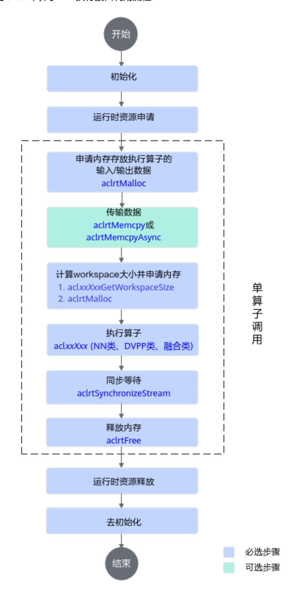

本节以**AddCustom**自定义算子调用为例,介绍如何编写单算子调用的代码逻辑。其他 算子的调用逻辑与Add算子大致一样,请根据实际情况自行修改代码。

以下是关键步骤的代码示例,不可以直接拷贝编译运行,仅供参考,调用接口后,需 增加异常处理的分支,并记录报错日志、提示日志,此处不一一列举。

### 说明

因为单算子API执行方式,会自动在编译工程的build\_out/autogen目录下生成.cpp和.h,编写单

算子的调用代码时,要包含自动生成的单算子API执行接口头文件。示例如下: #include "aclnn\_add\_custom.h"

```
// 1.AscendCL初始化
aclRet = aclInit("../scripts/acl.json");
// 2.运行管理资源申请
int deviceId = 0;
aclRet = aclrtSetDevice(deviceId);
// 获取软件栈的运行模式,不同运行模式影响后续的接口调用流程(例如是否进行数据传输等)
aclrtRunMode runMode;
bool g_isDevice = false;
aclError aclRet = aclrtGetRunMode(&runMode);
g_isDevice = (runMode == ACL_DEVICE);
// 3.申请内存存放算子的输入输出
// ......
// 4.传输数据
if (aclrtMemcpy(devInputs_[i], size, hostInputs_[i], size, kind) != ACL_SUCCESS) {
 return false;
}
// 5.计算workspace大小并申请内存
size_t workspaceSize = 0;
aclOpExecutor *handle = nullptr;
auto ret = aclnnAddCustomGetWorkspaceSize(inputTensor_[0], inputTensor_[1], outputTensor_[0],
 &workspaceSize, &handle);
// ...
void *workspace = nullptr;
if (workspaceSize != 0) {
 if (aclrtMalloc(&workspace, workspaceSize, ACL_MEM_MALLOC_HUGE_FIRST) != ACL_SUCCESS) {
 ERROR_LOG("Malloc device memory failed");
 }
}
// 6.执行算子
if (aclnnAddCustom(workspace, workspaceSize, handle, stream) != ACL_SUCCESS) {
 (void)aclrtDestroyStream(stream);
 ERROR_LOG("Execute Operator failed. error code is %d", static_cast<int32_t>(ret));
 return false;
}
// 7.同步等待
aclrtSynchronizeStream(stream);
// 8.处理执行算子后的输出数据,例如在屏幕上显示、写入文件等,由用户根据实际情况自行实现
// ......
// 9.释放运行管理资源
aclRet = aclrtResetDevice(deviceId);
// ....
// 10.AscendCL去初始化
aclRet = aclFinalize();
```

## **CMakeLists** 文件

算子编译后,会生成单算子调用的头文件aclnn\_xx.h和动态库libcust\_opapi.so。具体 路径请参[考前置步骤](#page-246-0)。

编译算子调用程序时,需要在头文件的搜索路径include\_directories中增加单算子调用 的头文件目录,便于找到该头文件;同时需要链接cust\_opapi动态库并在库文件的搜 索路径link\_directories中增加libcust\_opapi.so所在目录。

● 在头文件的搜索路径include\_directories中增加单算子调用的头文件目录。以下样 例仅为参考,请根据头文件的实际目录位置进行设置。

```
include_directories(
 ${INC_PATH}/runtime/include
 ${INC_PATH}/atc/include
 ../inc
 ${OP_API_PATH}/include
)
```

● 链接cust\_opapi链接库。

```
target_link_libraries(execute_add_op
 ascendcl
 cust_opapi
 acl_op_compiler
 nnopbase
 stdc++
)
```

● 在库文件的搜索路径link\_directories中增加libcust\_opapi.so所在目录。以下样例 仅为参考,请根据库文件的实际目录位置进行设置。

```
link_directories(
 ${LIB_PATH}
 ${LIB_PATH1}
 ${OP_API_PATH}/lib
)
```

## 生成测试数据

在样例工程目录下,执行如下命令:

python3 scripts/gen\_data.py

会在工程目录下input目录中生成两个shape为(8,2048),数据类型为float16的数据文 件input\_0.bin与input\_1.bin,用于进行AddCustom算子的验证。

代码样例如下:

```
import numpy as np
a = np.random.randint(100, size=(8, 2048,)).astype(np.float16)
b = np.random.randint(100, size=(8, 2048,)).astype(np.float16)
a.tofile('input_0.bin')
b.tofile('input_1.bin')
```

## 编译与运行

1. 开发环境上,设置环境变量,配置AscendCL单算子验证程序编译依赖的头文件与 库文件路径,如下为设置环境变量的示例。\${INSTALL\_DIR}表示CANN软件安装 目录,例如,\$HOME/Ascend/ascend-toolkit/latest。{arch-os}为运行环境的架 构和操作系统,arch表示操作系统架构,os表示操作系统,例如x86\_64-linux或 aarch64-linux。

```
export DDK_PATH=${INSTALL_DIR}
export NPU_HOST_LIB=${INSTALL_DIR}/{arch-os}/devlib
```

2. 编译样例工程,生成单算子验证可执行文件。

a. 切换到样例工程根目录,然后在样例工程根目录下执行如下命令创建目录用 于存放编译文件,例如,创建的目录为"build"。

mkdir -p build

b. 进入build目录,执行cmake编译命令,生成编译文件 命令示例如下所示:

cd build

**cmake ../src -DCMAKE\_SKIP\_RPATH=TRUE**

c. 执行如下命令,生成可执行文件。

make

会在工程目录的output目录下生成可执行文件**execute\_add\_op**。

### 3. 执行单算子

a. 以运行用户(例如HwHiAiUser)拷贝开发环境中样例工程output目录下的 **execute\_add\_op**到运行环境任一目录。

说明: 若您的开发环境即为运行环境,此拷贝操作可跳过。

b. 在运行环境中,执行**execute\_add\_op**文件:

chmod +x execute\_add\_op

./execute\_add\_op

### 会有如下屏显信息:

- [INFO] Set device[0] success
- [INFO] Get RunMode[1] success
- [INFO] Init resource success
- [INFO] Set input success
- [INFO] Copy input[0] success
- [INFO] Copy input[1] success
- [INFO] Create stream success
- [INFO] Execute aclnnAddCustomGetWorkspaceSize success, workspace size 0
- [INFO] Execute aclnnAddCustom success
- [INFO] Synchronize stream success
- [INFO] Copy output[0] success
- [INFO] Write output success
- [INFO] Run op success
- [INFO] Reset Device success
- [INFO] Destroy resource success

如果有Run op success,表明执行成功,会在output目录下生成输出文件 output\_z.bin。

### 4. 比较真值文件

切换到样例工程根目录,然后执行如下命令:

python3 scripts/verify\_result.py output/output\_z.bin output/golden.bin

### 会有如下屏显信息:

test pass

可见,AddCustom算子验证结果正确。

# **7** 算子调试调优

<span id="page-252-0"></span>孪生调试简介

CPU域调试

NPU[域调试调优](#page-254-0)

## **7.1** 孪生调试简介

Ascend C提供孪生调试方法,相同的算子代码可以在CPU域调试精度,NPU域调试性 能。孪生调试的整体方案如下:开发者通过调用Ascend C类库编写Ascend C算子 kernel侧源码,kernel侧源码通过通用的GCC编译器进行编译,编译生成通用的CPU域 的二进制,可以通过gdb通用调试工具等调试手段进行调试;kernel侧源码通过毕昇编 译器进行编译,编译生成NPU域的二进制文件,可以通过仿真打点图或者Profiling工 具进行上板数据采集等方式进行调试。


## **7.2 CPU** 域调试

本节介绍CPU域调试的方法:gdb调试、使用printf打印命令打印。

本节提供的调试方法基于**[6.6.2 Kernel](#page-198-0)**直调章节中的算子程序进行调试,请先完成核函 数运行验证章节的学习。

### 说明

CPU调测过程中,配置日志相关环境变量,可以记录程序的运行过程及异常信息,有助于开发者 进行功能调测。

关于环境变量的使用约束以及详细说明,可参见[《环境变量参考](https://www.hiascend.com/document/detail/zh/CANNCommunityEdition/82RC1/maintenref/envvar/envref_07_0001.html)》中"辅助功能 > 日志"章 节。

### **gdb** 调试

可使用**gdb**单步调试算子计算精度。由于cpu调测已转为多进程调试,每个核都会拉起 独立的子进程,故gdb需要转换成子进程调试的方式。针对Atlas 推理系列产品、Atlas 训练系列产品,每个核会拉起1个子进程。针对Atlas A2 训练系列产品/Atlas 800I A2 推理产品/A200I A2 Box 异构组件,每个核会拉起3个子进程,1个Cube,2个Vector。

### ● 调试单独一个子进程

启动gdb,示例中的add\_custom\_cpu为CPU域的算子可执行文件,参[考修改并执](#page-207-0) [行一键式编译运行脚本,](#page-207-0)将一键式编译运行脚本中的run-mode设置成cpu,即可 编译生成CPU域的算子可执行文件。

gdb启动后,首先设置跟踪子进程,之后再打断点,就会停留在子进程中,但是这 种方式只会停留在遇到断点的第一个子进程中,其余子进程和主进程会继续执行 直到退出。涉及到核间同步的算子无法使用这种方法进行调试。

gdb --agrs add\_custom\_cpu // 启动gdb,add\_custom\_cpu为算子可执行文件 (gdb) set follow-fork-mode child

### ● 调试多个子进程

如果涉及到核间同步,那么需要能同时调试多个子进程。

在gdb启动后,首先设置调试模式为只调试一个进程,挂起其他进程。设置的命令 如下:

(gdb) set detach-on-fork off

查看当前调试模式的命令为:

(gdb) show detach-on-fork

中断gdb程序要使用捕捉事件的方式,即gdb程序捕捉fork这一事件并中断。这样 在每一次起子进程时就可以中断gdb程序。设置的命令为:

(gdb) catch fork

当执行r后,可以查看当前的进程信息:

(gdb) info inferiors Num Description

\* 1 process 19613

可以看到,当第一次执行fork的时候,程序断在了主进程fork的位置,子进程还未 生成。

执行c后,再次查看info inferiors,可以看到此时第一个子进程已经启动。

(gdb) info inferiors Num Description

\* 1 process 19613

2 process 19626

这个时候可以使用切换到第二个进程,也就是第一个子进程,再打上断点进行调 试,此时主进程是暂停状态:

(gdb) inferior 2

[Switching to inferior 2 [process 19626] (\$HOME/demo)]

(gdb) info inferiors

<span id="page-254-0"></span> Num Description 1 process 19613 \* 2 process 19626

请注意,inferior后跟的数字是进程的序号,而不是进程号。

如果遇到同步阻塞,可以切换回主进程继续生成子进程,然后再切换到新的子进 程进行调试,等到同步条件完成后,再切回第一个子进程继续执行。

### 如下是调试一个单独子进程的命令样例:

gdb --args add\_custom\_cpu set follow-fork-mode child break add\_custom.cpp:45 run list backtrace print i break add\_custom.cpp:56 continue display xLocal quit

## 使用 **printf** 打印命令打印

在代码中直接编写printf(...)来观察数值的输出。样例代码如下:

printf("xLocal size: %d\n", xLocal.GetSize()); printf("tileLength: %d\n", tileLength);

## **7.3 NPU** 域调试调优

## 通过 **DumpTensor**、**printf** 打印进行调试

NPU域上板数据打印功能包括DumpTensor、printf两种,其中DumpTensor用于打印 指定Tensor的数据,printf主要用于打印标量和字符串信息。

### 该功能仅在如下场景支持:

- 通过**[Kernel](#page-198-0)**直调方式调用算子。
- 通过[单算子](#page-246-0)**API**调用方式调用算子。
- 间接调用单算子API(aclnnxxx)接口:Pytorch框架单算子直调的场景。

### 具体的使用方法如下:

在算子kernel侧实现代码中需要输出日志信息的地方调用DumpTensor接口或者printf 接口打印相关内容。

● DumpTensor示例,srcLocal表示待打印的Tensor;5表示用户的自定义附加信 息,比如当前的代码行号;dataLen表示元素个数。DumpTensor接口的使用说明 和具体约束请参考**[14.1.7.1 DumpTensor](#page-2379-0)**。

DumpTensor(srcLocal,5, dataLen);

Dump时,每个block核的dump信息前会增加对应信息头DumpHead(32字节大 小),用于记录核号和资源使用信息;每次Dump的Tensor数据前也会添加信息头 DumpTensorHead(32字节大小),用于记录Tensor的相关信息。打印结果的样 例如下:

opType=AddCustom, DumpHead: AIV-0, CoreType=AIV, block dim=8, total\_block\_num=8, block\_remain\_len=1046912, block\_initial\_space=1048576, rsv=0, magic=5aa5bccd CANN Version: XX.XX, TimeStamp: XXXXXXXXXXXXXXXXX DumpTensor: desc=5, addr=0, data\_type=float16, position=UB [19.000000, 4.000000, 38.000000, 50.000000, 39.000000, 67.000000, 84.000000, 98.000000, 21.000000, 36.000000, 18.000000, 46.000000, 10.000000, 92.000000, 26.000000, 38.000000, 39.000000, 9.000000, 82.000000, 37.000000, 35.000000, 65.000000, 97.000000, 59.000000, 89.000000, 63.000000, 70.000000, 57.000000, 35.000000, 3.000000, 16.000000, 42.000000] DumpTensor: desc=5, addr=100, data\_type=float16, position=UB [6.000000, 34.000000, 52.000000, 38.000000, 73.000000, 38.000000, 35.000000, 14.000000, 67.000000, 62.000000, 30.000000, 49.000000, 86.000000, 37.000000, 84.000000, 18.000000, 38.000000, 18.000000, 44.000000, 21.000000, 86.000000, 99.000000, 13.000000, 79.000000, 84.000000, 9.000000, 48.000000, 74.000000, 52.000000, 99.000000, 80.000000, 53.000000] ... DumpTensor: desc=5, addr=0, data\_type=float16, position=UB [35.000000, 41.000000, 41.000000, 22.000000, 84.000000, 49.000000, 60.000000, 0.000000, 90.000000, 14.000000, 67.000000, 80.000000, 16.000000, 46.000000, 16.000000, 83.000000, 6.000000, 70.000000, 97.000000, 28.000000, 97.000000, 62.000000, 80.000000, 22.000000, 53.000000, 37.000000, 23.000000, 58.000000, 65.000000, 28.000000, 4.000000, 29.000000]

● printf示例如下,printf接口的使用说明和具体约束请参考**[14.1.7.2 printf](#page-2383-0)**。 printf("fmt string %d", 0x123);

### 说明

DumpTensor、printf接口打印功能会对算子实际运行的性能带来一定影响,通常在调测阶段使 用。开发者可以按需关闭打印功能。具体方法请参考**[14.1.7.1 DumpTensor](#page-2379-0)**、**[14.1.7.2 printf](#page-2383-0)**。

## **NPU** 模式下的性能采集与分析

基于NPU域算子的调用接口编写的算子程序,通过毕昇编译器编译后生成可执行程 序,运行可执行程序,可以完成算子NPU域的运行验证。使用算子调优工具运行NPU 模式下生成的可执行文件从而采集Ascend C算子在AI处理器上执行的性能数据,进行 性能精细调优。性能调优工具的具体使用方法请参考《[算子开发工具用户指南》](https://www.hiascend.com/document/detail/zh/CANNCommunityEdition/82RC1/devaids/optool/atlasopdev_16_0002.html)。

# <span id="page-256-0"></span>**8** 算子入图(**GE** 图)开发

概述

[开发流程](#page-257-0)

[Tiling](#page-266-0)下沉

[图编译和图执行](#page-268-0)

## **8.1** 概述

图模式是神经网络模型的一种运行模式,在图模式下用户首先将模型的计算过程构造 成一张图,然后通过GE将图下发到昇腾硬件执行。相对于单个算子依次下发的方式, 图模式下,GE可以通过计算图优化、多流并行、内存复用、模型下沉等技术手段,加 速模型执行效率,减少模型内存占用。

算子入图的开发流程如下图所示:算子工程创建完成后,基于工程代码框架完成算子 原型定义、kernel侧算子实现、host侧tiling实现并完成算子入图开发,通过工程编译 脚本完成算子的编译部署,之后即可基于图IR执行算子,比如单算子模型执行或者IR构 图的方式调用自定义算子。该开发流程以**6.7** [工程化算子开发](#page-213-0)为基础,除了需要提供工 程化算子开发中的算子实现文件外,还需要额外交付算子入图的代码文件。

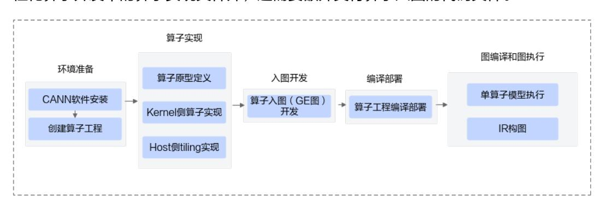

### 步骤**1** 环境准备。

- 1. CANN软件安装请参考**2** [环境准备](#page-52-0)。
- 2. [创建算子工程。](#page-214-0)使用msOpGen工具创建算子开发工程。

步骤**2** 算子实现。

- <span id="page-257-0"></span>● [算子原型定义。](#page-217-0)通过原型定义来描述算子输入输出、属性等信息以及算子在AI处 理器上相关实现信息,并关联tiling实现等函数。
- Kernel侧算子实现和host侧tiling实现请参考**6** [算子实现](#page-91-0);工程化算子开发,支持 开发者调用Tiling API基于CANN提供的编程框架进行tiling开发,kernel侧也提供 对应的接口方便开发者获取tiling参数,具体内容请参考**[6.7.4 Kernel](#page-222-0)**侧算子实现 和**[6.7.5 Host](#page-224-0)**侧**tiling**实现,由此而带来的额外约束也在上述章节说明。

步骤**3** 算子入图(**GE**图)开发。算子入图场景下,需要提供shape推导等算子入图适配函数 的实现。

步骤**4** 编译部署。通过工程编译脚本完成算子的编译部署,分[为算子包编译和](#page-236-0)[算子动态库编](#page-244-0) [译](#page-244-0)两种方式。

步骤**5** [图编译和图执行](#page-268-0):基于图IR执行算子,比如单算子模型执行或者IR构图的方式调用自定 义算子。

**----**结束

## **8.2** 开发流程

该开发流程以**6.7** [工程化算子开发](#page-213-0)为基础,除了需要提供工程化算子开发中的算子实现 文件外,还需要额外交付算子入图的代码文件。本节仅提供算子入图代码文件的开发 指导。

假设下图是我们需要使用的网络模型,您可能会想直接逐个算子调用,根据输入 tensor得到输出tensor就可以完成网络的运行,但在图模式场景下,实际的网络模型生 成过程中,会先进行tensor shape以及datatype的推导。这样可以让我们在图执行之 前,就知道各tensor的数据类型和形状,提前校验其正确性;同时提前推理出算子的 输出张量描述,包括张量的形状、数据类型及数据排布格式等信息,算子构图准备阶 段就可以为所有的张量静态分配内存,避免动态内存分配带来的开销。

下面的网络模型经过shape和datatype推导之后,可以得到灰色底纹框中的推导信息:

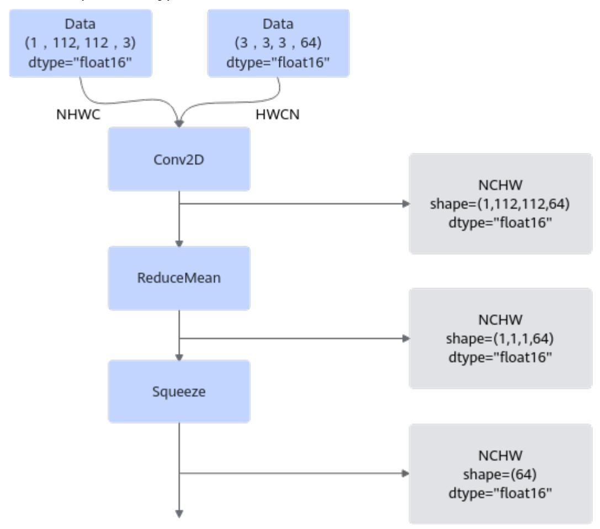

图 **8-1** shape 与 datatype 推导示意图

除了tiling实现外,算子入图时需要额外提供的实现代码有以下几种:

- datatype推导:根据算子的输入datatype、算子逻辑及算子属性等信息,推理出 算子的输出张量datatype。
- shape推导:根据算子的输入shape、算子逻辑及算子属性等信息,推理出算子的 输出张量shape。
- ShapeRange推导:编译时无法推导输出shape,只能推导输出shape range,执 行完才能得出输出shape。 在下发时需要按照输出shape range来申请最大输出内 存,该类算子需要提供ShapeRange推导函数。
- 声明数据依赖:部分算子在InferShape时,需要依赖某个输入的具体值才可以进 行,这类算子被称为"数据依赖算子",对应的输入被称为"数据依赖输入"。 该类算子在注册时,需要声明其数据依赖输入。

下表列出了不同类型的算子对上述实现代码的要求。

表 **8-1** 不同的类型的算子对入图实现代码的要求

| 分类             | 对入图实现代码的要求      |
|----------------|-----------------|
| 根据输入shape可以推导出 | ●<br>shape推导    |
| 输出shape。       | ●<br>datatype推导 |

| 分类                                                                                      | 对入图实现代码的要求                                                                          |
|-----------------------------------------------------------------------------------------|-------------------------------------------------------------------------------------|
| 依赖输入的value才能推导出<br>输出shape,即数据依赖算<br>子。 如Reshape算子,依赖<br>shape输入的value才能推导<br>出输出shape。 | ●<br>shape推导<br>●<br>datatype推导<br>●<br>声明数据依赖                                      |
| 编译时无法推导输出<br>shape,只能推导输出shape<br>range,执行完才能得出输<br>出shape。                             | ●<br>Shape推导(必选)<br>●<br>DataType推导(必选)<br>●<br>ShapeRange推导(必选)<br>●<br>声明数据依赖(按需) |

实际开发时通过固定的datatype和shape推导原型实现推导函数,然后再通过 **[SetInferShape](#page-2170-0)**、 **[SetInferDataType](#page-2171-0)**接口来关联对应的shape推导函数,样例如下。

```
namespace ge {
static graphStatus InferShape(gert::InferShapeContext *context)
 ...
 return GRAPH_SUCCESS;
}
static graphStatus InferDataType(gert::InferDataTypeContext *context)
{
 ...
 return ge::GRAPH_SUCCESS;
}
} // namespace ge
namespace ops {
class AddCustom : public OpDef {
public:
 AddCustom(const char* name) : OpDef(name)
 {
 this->Input("x")
 .ParamType(REQUIRED)
 .DataType({ge::DT_FLOAT16, ge::DT_FLOAT, ge::DT_INT32})
 .Format({ge::FORMAT_ND, ge::FORMAT_ND, ge::FORMAT_ND});
 this->Input("y")
 .ParamType(REQUIRED)
 .DataType({ge::DT_FLOAT16, ge::DT_FLOAT, ge::DT_INT32})
 .Format({ge::FORMAT_ND, ge::FORMAT_ND, ge::FORMAT_ND});
 this->Output("z")
 .ParamType(REQUIRED)
 .DataType({ge::DT_FLOAT16, ge::DT_FLOAT, ge::DT_INT32})
 .Format({ge::FORMAT_ND, ge::FORMAT_ND, ge::FORMAT_ND});
 // 根据用户的算子调用方式决定需不需要注册 图模式调用方式下需要
 this->SetInferShape(ge::InferShape);
 this->SetInferShapeRange(ge::InferShapeRange);
 this->SetInferDataType(ge::InferDataType); 
 this->AICore()
 .SetTiling(optiling::TilingFunc);
 // 请替换为实际的昇腾AI处理器型号
 this->AICore().AddConfig("ascendxxx");
 }
};
OP_ADD(AddCustom);
} // namespace ops
```

## <span id="page-260-0"></span>**datatype** 推导

以AddCustom算子为例,InferDataType的实现如下所示。该样例中输出tensor的数据 类型与输入tensor的数据类型相同,所以直接将任意一个输入tensor的数据类型赋给输 出tensor即可。

```
namespace ge {
static graphStatus InferDataType(gert::InferDataTypeContext* context)
{
 const auto inputDataType = context->GetInputDataType(0);
 context->SetOutputDataType(0, inputDataType);
 return ge::GRAPH_SUCCESS;
}
} // namespace ge
```

如下示例则给出了更灵活的datatype推导样例,当输入的数据类型为DT\_INT4时,其 输出的数据类型为DT\_INT32。

```
ge::graphStatus InferDataTypeForFoo(gert::InferDataTypeContext* context) {
 if (context->GetInputDataType(0) == DT_INT4) {
 context->SetOutputDataType(0, DT_INT32);
 }
}
```

## **shape** 推导

简单的shape推导逻辑可以使用**[Follow](#page-2196-0)**接口来表达,比如输出shape和输入shape相同 的情况。示例如下:输出"y1"Follow输入"x1"场景,指定Follow模式为SHAPE, 此时"y1"的shape将会和"x1"保持一致。

```
this->Input("x1")
 .ParamType(REQUIRED)
 .DataType({ge::DT_FLOAT, ge::DT_FLOAT})
 .Format({ge::FORMAT_ND, ge::FORMAT_ND});
this->Input("x2")
 .ParamType(REQUIRED)
 .DataType({ge::DT_FLOAT, ge::DT_FLOAT})
 .Format({ge::FORMAT_ND, ge::FORMAT_ND});
this->Output("y1")
 .ParamType(REQUIRED)
 .DataType({ge::DT_FLOAT, ge::DT_FLOAT})
 .Format({ge::FORMAT_ND, ge::FORMAT_ND})
 .Follow("x1", FollowType::SHAPE);
```

无法在原型定义中通过Follow表达的情况需要开发者编写InferShape函数,InferShape 函数的原型是固定的,如下示例,接受一个**[InferShapeContext](#page-2479-0)**作为输入,从此 context上可以获取到输入、输出的shape指针等内容。输入shape为const类型,因此 InferShape时,输入shape是只读、不允许修改的。InferShape成功后,返回 ge::GRAPH\_SUCCESS,其他返回值被认为推导失败。推导失败后,执行过程结束退 出。

以ReShape算子为例,InferShape的实现如下所示。根据第1个输入(shape输入)的 值,Reshape算子将第0个输入(x输入)的shape做变换,并输出到其第0个输出(y输 出)上。Reshape的InferShape实现为:

```
ge::graphStatus InferShapeForReshape(InferShapeContext *context) {
const gert::Shape *x_shape = context->GetInputShape(0); // 获取第0个输入的shape
const gert::Tensor *shape_tensor = context->GetInputTensor(1); // 获取第1个输入的tensor
gert::Shape *output_shape = context->GetOutputShape(0);
if (x_shape == nullptr || shape_tensor == nullptr || output_shape == nullptr) {
 // 防御式编程,不应该出现的场景,打印错误并返回失败
 return ge::GRAPH_FAILED;
}
```

```
auto reshape_size = static_cast<int32_t>(shape_tensor->GetShapeSize());
if (reshape_size < 1) {
 // 防御式编程,不应该出现的场景,打印错误并返回失败
 return ge::GRAPH_FAILED;
}
// 根据原型信息,Reshape的shape输入支持INT32与INT64两类,根据不同的类型进入对应的模板函数中做真正
的shape变换操作
if (shape_tensor->GetDataType() == ge::DT_INT32) {
 int32_t *reshape_data = shape_tensor->GetData<int32_t>();
 return ReshapeInferShapeImpl<int32_t>(reshape_data, *x_shape, *output_shape, reshape_size);
} else {
 int64_t *reshape_data = shape_tensor->GetData<int64_t>();
 return ReshapeInferShapeImpl<int64_t>(reshape_data, *x_shape, *output_shape, reshape_size);
}
}
```

**[InferShapeContext](#page-2479-0)**public继承自**[ExtendedKernelContext](#page-2455-0)**,因此 ExtendedKernelContext中提供的方法如获取算子type、name、属性等接口均可以在 **[InferShapeContext](#page-2479-0)**实例中调用。

## 注意

- InferShape推导函数和Follow接口不能混用,即不支持部分输出采用Infershape推 导、部分输出采用Follow推导的情况。若用户同时使用了InferShape函数和Follow 接口,以用户的InferShape函数为准,需要保证在InferShape函数中能够推导出所 有的输出shape。
- 为了效率考虑,调用InferShape函数时,框架不会为输出shape做初始化,因此, 在InferShape函数中,可以认为输出是未初始化的状态。如果在InferShape时,希 望通过Append方式操作输出shape,需要先将输出shape的DimNum清零,以防止 出现未定义行为。

## **InferShapeRange** 实现

某些算子的输出Shape在计算完成后才能确定。比如unique算子,其Shape的推导逻辑 如下:

给定一维Tensor x,找到其中不重复的元素,返回去重后的Tensor y,输出idx与输入x 大小相同,保存x每个元素在y中的索引。

```
# tensor 'x' is [1, 1, 2, 4, 4, 4, 7, 8, 8] x shape[9]
y, idx = unique(x)
y ==> [1, 2, 4, 7, 8] y shape[5] 
idx ==> [0, 0, 1, 2, 2, 2, 3, 4, 4] idx shape[9]
```

由此可知,y的shape在编译时为[-1],unique执行后shape才确定。

在入图场景执行时,需要在执行前分配输出内存,而内存的大小依赖于输出Shape和数 据类型。对于此类算子,由于输出Shape在执行后才能确定,因此需要根据输出Shape 的范围,按照最大范围申请输出内存,以确保有足够的空间供计算函数写入输出 Tensor。

这种场景下,开发者需要自行实现InferShapeRange函数,来推导输出Shape的范围。 下面以unique算子为例子,介绍InferShapeRange函数的实现方法。

```
ge::graphStatus UniqueInferShapeRangeFunc(gert::InferShapeRangeContext *context) {
 // 取输入的shape range
 auto x_shape_range = context->GetInputShapeRange(0U);
```

```
 OPS_CHECK_NULL_WITH_CONTEXT(context, x_shape_range);
 OPS_CHECK_NULL_WITH_CONTEXT(context, x_shape_range->GetMax());
 OPS_CHECK_NULL_WITH_CONTEXT(context, x_shape_range->GetMin());
 // 开始计算y输出的shape range
 auto y_shape_range = context->GetOutputShapeRange(0U);
 OPS_CHECK_NULL_WITH_CONTEXT(context, y_shape_range);
 y_shape_range->GetMax()->SetDimNum(1); // 一维向量,rank为1
 y_shape_range->GetMin()->SetDimNum(1);
 auto x_max_shape = x_shape_range->GetMax();
 auto x_shape_dimnum = x_max_shape->GetDim(0); // x为一维Tensor,其shape为[n], x_shape_dimnum表
示x输入的元素个数n
 if (x_shape_dimnum == 1) {
 // 若x输入只有1个元素,不存在去重,y的shape轴最小最大均为1. 因此range为[1~1]
 y_shape_range->GetMax()->SetDim(0, 1);
 y_shape_range->GetMin()->SetDim(0, 1);
 } else {
 // 若x输入有0个元素,或者大于1个元素,去重后,y的元素个数最小为x的min,最大为x的max
 y_shape_range->GetMax()->SetDim(0, x_shape_dimnum);
 y_shape_range->GetMin()->SetDim(0, x_shape_range->GetMin());
 }
 // 开始计算输出idx的shape range
 // 输出idx表示x元素在y中的索引,其元素个数与x相等,因此shape range与x一致
 auto idx_shape_range = context->GetOutputShapeRange(1U);
 OPS_CHECK_NULL_WITH_CONTEXT(context, idx_shape_range);
 *(idx_shape_range->GetMax()) = *(x_shape_range->GetMax());
 *(idx_shape_range->GetMin()) = *(x_shape_range->GetMin());
 return ge::GRAPH_SUCCESS;
}
```

## **InferShape** 时获取属性、输入

在InferShape、Tiling时,可以通过context实例获取算子IR属性值,所谓IR属性,是指 在IR注册时定义的属性,以TransData算子为例:

```
namespace ops {
class TransData : public OpDef {
public:
 explicit TransData(const char *name) : OpDef(name)
 {
 this->Input("src")
 ...
 this->Output("dst")
 ...
 this->Attr("src_format")
 .AttrType(REQUIRED)
 .String();
 this->Attr("dst_format")
 .AttrType(REQUIRED)
 .String();
 this->Attr("group")
 .AttrType(OPTIONAL) 
 .Int(1);
 ...
 }
};
OP_ADD(TransData);
} // namespace ops
```

其原型定义中声明了src\_format、dst\_format、group三个属性,可以通过如下方式获 取算子属性:

```
ge::graphStatus ExampleGetTransDataAttr(TilingContext *context) {
 // 获取所有属性
 const RuntimeAttrs *attrs = context->GetAttrs();
```

```
 ASSERT_NOT_NULL(attrs);
 // 按照在原型定义中的顺序,使用index获取属性,index从0开始计数
 const char *src_format = attrs->GetAttrPointer<char>(0); // 获取src_format,src_format是第一个属性,因
此index为0
 const char *dst_format = attrs->GetAttrPointer<char>(1); // 获取dst_format,dst_format是第二个属性,因
此index为1
 const int64_t group = attrs->GetAttrPointer<int64_t>(2); // 获取group,group是第三个属性,因此index为2
 return ge::GRAPH_SUCCESS;
}
```

通过index而不是字符串name来索引输入输出,对于带有OPTIONAL、DYNAMIC类型 输入的算子,可能出现实例化后,单纯通过index无法索引到具体输入的问题,以 DynamicRNNV3算子为例:

```
namespace ops {
class DynamicRNNV3 : public OpDef {
public:
 explicit DynamicRNNV3(const char *name) : OpDef(name)
 {
 this->Input("x")
 .ParamType(REQUIRED)
 ...
 this->Input("w")
 .ParamType(REQUIRED)
 ...
 this->Input("b")
 .ParamType(REQUIRED)
 ...
 this->Input("seq_length")
 .ParamType(OPTIONAL)
 ...
 this->Input("init_h")
 .ParamType(OPTIONAL)
 ...
 this->Input("init_c")
 .ParamType(OPTIONAL)
 ...
 this->Input("wci")
 .ParamType(OPTIONAL)
 ...
 this->Input("wcf")
 .ParamType(OPTIONAL)
 ...
 this->Input("mask")
 .ParamType(OPTIONAL)
 ...
 this->Input("mask")
 .ParamType(OPTIONAL)
 ...
 this->Input("project")
 .ParamType(OPTIONAL)
 ...
 ...
 }
};
OP_ADD(DynamicRNNV3);
} // namespace ops
```

由于DynamicRNNV3算子有连续的多个optional输入,这导致init\_h及其后面的输入的 实例化后index都是不确定的,对于这种类型的算子,可以通过 **[GetOptionalInputShape](#page-2481-0)**传入原型对应的index来获取对应的输入shape等数据,以 InferShape为例:

```
ge::graphStatus InferShapeForDynamicRNNV3(InferShapeContext *context) {
 // 对于前两个输入,不受到optional或dynamic的影响,可以按照常规方法获取输入shape
```

```
 auto x_shape = context->GetInputShape(0);
 auto w_shape = context->GetInputShape(1);
 if (x_shape == nullptr || w_shape == nullptr) {
 return ge::GRAPH_FAILED;
 }
 int64_t state_size = 0;
 // 在原型定义上,project是第11个输入(从0开始计数)
 constexpr int64_t kProjectInputIndex = 11;
 // 受到前面optional输入影响的,project实例化后输入的index是不确定的,通过GetOptionalInputShape来获
取对应的输入shape,
 // GetOptionalInputShape的入参为原型上对应的index
 auto project_shape = context->GetOptionalInputShape(kProjectInputIndex);
 if (project_shape != nullptr) {
 if (project_shape->GetDimNum() < 2) {
 return ge::GRAPH_FAILED;
 }
 state_size = project_shape->GetDim(1);
 }
 // 更多的infershape逻辑...
 return ge::GRAPH_SUCCESS;
}
```

对于dynamic类型的输入,实例化后的输入可能是一到多个,对于此类输入,获取方 式为:

```
// ir_index:此输入在原型定义中的index,从0开始计数
// relative_index:该输入实例化后的相对index,从0开始计数,例如某个DYNAMIC_INPUT实例化了3个,要取
第二个,那么relatvie_index = 1
auto shape = context->GetDynamicInputShape(ir_index, relative_index);
```

本节举例的获取optional、dynamic输入的方式,在InferShape、Tiling函数中均可以 调用。

## 数据依赖

一般来说,具备输入shape后,算子可以通过InferShape推导出输出shape。然而部分 算子在InferShape时,需要依赖某个输入的具体值才可以进行,这类算子被称为"数 据依赖算子",对应的输入被称为"数据依赖输入"。以Reshape算子为例,其依据 shape输入的描述,对输入的shape做调整,因此Reshape算子依赖shape输入的值。这 类算子需要在原型定义时通过**[ValueDepend](#page-2187-0)**接口声明对应的输入为数据依赖输入。

```
namespace ops {
class Reshape : public OpDef {
public:
 explicit Reshape(const char *name) : OpDef(name)
 {
 ...
 this->Input("shape")
 .ParamType(REQUIRED)
 ...
 .ValueDepend(REQUIRED) // 声明 ReShape算子的shape输入为数据依赖输入
 ...
 }
};
OP_ADD(Reshape);
} // namespace ops
```

根据第1个输入(shape输入)的值,Reshape算子将第0个输入(x输入)的shape做变 换,并输出到其第0个输出(y输出)上。Reshape的InferShape实现为:

```
// shape变换具体实现
template<typename T>
ge::graphStatus ReshapeInferShapeImpl(const T *reshape_dims, const gert::Shape &x_shape, gert::Shape 
&output_shape, int32_t reshape_rank) {
 constexpr T UNKNOWN_DIM = -1;
```

```
 // 将算子输出的维度数设置为reshape后的维度数reshape_rank
 output_shape.SetDimNum(reshape_rank);
 auto x_shape_size = x_shape.GetShapeSize();
 int64_t output_shapesize = 1;
 size_t unknown_dim_idx = std::numeric_limits<size_t>::max();
 for (int32_t i = 0; i < reshape_rank; i++) {
 if (reshape_dims[i] != UNKNOWN_DIM) { // reshape后某一轴的维度值不为-1 
 output_shape.SetDim(i, reshape_dims[i]); // 设置输出的维度值为reshape后的维度值
 output_shapesize *= reshape_dims[i]; // 计算当前输出元素数量
 } else {
 output_shape.SetDim(i, 1); // reshape后某一轴的维度值为-1,临时设置输出的维度值为1,后续计算
后看是否可以推导出确定值,并记录未知维度的索引
 unknown_dim_idx = i;
 }
 }
 if (unknown_dim_idx == std::numeric_limits<size_t>::max() && output_shapesize == x_shape_size) {
 return ge::GRAPH_SUCCESS; // 不存在未知维度,且输出shape size和输入x的shape size一致,直接返回
成功
 } else if (unknown_dim_idx != std::numeric_limits<size_t>::max() && x_shape_size % output_shapesize == 
0) {
 output_shape.SetDim(unknown_dim_idx, x_shape_size / output_shapesize); // 存在未知维度,根据输入
shape动态调整未知维度值保持总元素个数不变
 return ge::GRAPH_SUCCESS;
 }
 return ge::GRAPH_FAILED;
}
ge::graphStatus InferShapeForReshape(InferShapeContext *context) {
 const gert::Shape *x_shape = context->GetInputShape(0); // 获取第0个输入的shape
 const gert::Tensor *shape_tensor = context->GetInputTensor(1); // 获取第1个输入的tensor
 gert::Shape *output_shape = context->GetOutputShape(0);
 if (x_shape == nullptr || shape_tensor == nullptr || output_shape == nullptr) {
 // 防御式编程,不应该出现的场景,打印错误并返回失败
 return ge::GRAPH_FAILED;
 }
 auto reshape_size = static_cast<int32_t>(shape_tensor->GetShapeSize());
 if (reshape_size < 1) {
 // 防御式编程,不应该出现的场景,打印错误并返回失败
 return ge::GRAPH_FAILED;
 }
 // 根据原型信息,Reshape的shape输入支持INT32与INT64两类,根据不同的类型进入对应的模板函数中做真
正的shape变换操作
 if (shape_tensor->GetDataType() == ge::DT_INT32) {
 int32_t *reshape_data = shape_tensor->GetData<int32_t>();
 return ReshapeInferShapeImpl<int32_t>(reshape_data, *x_shape, *output_shape, reshape_size);
 } else {
 int64_t *reshape_data = shape_tensor->GetData<int64_t>();
 return ReshapeInferShapeImpl<int64_t>(reshape_data, *x_shape, *output_shape, reshape_size);
 }
}
```

### 注意

- 只有声明过数据依赖的输入,才可以在InferShape时调用GetInputTensor等获取 tensor的接口获取其对应的tensor数据。若对一个未声明数据依赖的输入调用 GetInputTensor等获取tensor的接口,只能在tensor中获取到正确的shape、 format、datatype信息,无法获取到真实的tensor数据地址(获取到的地址为 nullptr)。
- 从tensor中获取tensor\_data时(GetData<int32\_t>或GetData<int64\_t>),使用者需 要保证获取的数据类型是正确的,否则行为是未定义的。

## <span id="page-266-0"></span>**8.3 Tiling** 下沉

在静态图模式下,可以通过整图下沉优化调度性能。将完整的计算图一次性下发至 Device侧,后续执行则无需Host参与,由Device自主完成计算,从而减少Host-Device 交互开销,提升执行效率。部分算子的Tiling计算依赖运行时输入的具体数值(**Tiling** 值依赖),需在执行时动态计算Tiling参数。针对该场景,可采用**Tiling**下沉优化方 案:将Tiling计算下沉至Device侧的AI CPU上执行,从而实现计算全程在Device侧高效 完成。

### 说明

- 基于新版本CANN包(支持Tiling下沉特性)编译生成的Tiling下沉算子,不兼容旧版CANN (不支持Tiling下沉特性)运行环境。
- 当前仅融合算子(矢量计算和矩阵计算融合)支持进行Tiling下沉。
- Tiling下沉功能仅支持如下产品型号:
  - Atlas A3 训练系列产品/Atlas A3 推理系列产品
  - Atlas A2 训练系列产品/Atlas 800I A2 推理产品/A200I A2 Box 异构组件
- 算子开启Tiling下沉后,如果采[用编译成算子包](#page-236-0)的方式,仅支持默认路径安装,不支持通过- install-path进行指定目录安装。

自定义算子使能Tiling下沉的步骤如下,完整样例请参考**Tiling**[下沉算子样例。](https://gitee.com/ascend/samples/tree/master/operator/ascendc/2_features/17_tiling_sink)

Tiling下沉场景下,算子工程的op\_host目录结构如下,Tiling实现文件需单独放在在一 个cpp文件中,示例中为add\_custom\_tiling\_sink\_tiling.cpp。

```
├── op_host
│ ├── add_custom_tiling_sink.cpp // 算子原型定义、InferShape、InferDataType实现
│ ├── add_custom_tiling_sink_tiling.cpp // Tiling函数实现
│ ├── add_custom_tiling_sink_tiling.h // TilingData结构体定义、Tiling函数声明
│ └── CMakeLists.txt
```

以AddCustom算子为例,讲解关键代码文件的具体实现方法如下:

- TilingData结构体定义、Tiling函数声明头文件add\_custom\_tiling\_sink\_tiling.h
  - 进行TilingData结构体的定义
  - 进行Tiling实现函数的声明

```
#ifndef ADD_CUSTOM_TILING_SINK_TILING_H
#define ADD_CUSTOM_TILING_SINK_TILING_H
#include "register/tilingdata_base.h"
#include "register/op_def_registry.h"
namespace optiling {
BEGIN_TILING_DATA_DEF(TilingSinkTilingData)
TILING_DATA_FIELD_DEF(uint32_t, totalLength);
TILING_DATA_FIELD_DEF(uint32_t, tileNum);
END_TILING_DATA_DEF;
REGISTER_TILING_DATA_CLASS(AddCustomTilingSink, TilingSinkTilingData) // Tiling结构体定义
ge::graphStatus AddCustomSinkTilingFunc(gert::TilingContext* context); // Tiling函数声明
} // namespace optiling
#endif // ADD_CUSTOM_TILING_SINK_TILING_H
```

● 算子原型定义、InferShape、InferDataType实现文件 add\_custom\_tiling\_sink.cpp,需包含add\_custom\_tiling\_sink\_tiling.h,进行 Tiling函数和算子原型定义的关联。

Tiling下沉仅适用于存在Tiling值依赖(即当InferShape不依赖输入值,仅Tiling计 算需要输入值)且算子输入为非Const类型的场景,本示例中的输入y通过 **[ValueDepend](#page-2187-0)**配置了非Const类型的Tiling值依赖。

```
#include "add_custom_tiling_sink_tiling.h" // 包含头文件
// ...
namespace ops {
class AddCustomTilingSink : public OpDef {
public:
 explicit AddCustomTilingSink(const char *name) : OpDef(name)
 {
 this->Input("x")
 .ParamType(REQUIRED)
 .DataType({ge::DT_FLOAT})
 .Format({ge::FORMAT_ND});
 this->Input("y")
 .ParamType(REQUIRED)
 .DataType({ge::DT_FLOAT})
 .Format({ge::FORMAT_ND})
 .ValueDepend(OPTIONAL, DependScope::TILING); // 表示输入y为Tiling值依赖
 this->Output("z")
 .ParamType(REQUIRED)
 .DataType({ge::DT_FLOAT})
 .Format({ge::FORMAT_ND});
 this->SetInferShape(ge::InferShape).SetInferDataType(ge::InferDataType);
 this->AICore().SetTiling(optiling::AddCustomSinkTilingFunc); // Tiling函数和算子原型定义的关联
 // 请替换为实际的昇腾AI处理器型号
 this->AICore().AddConfig("ascendxxx");
 }
};
OP_ADD(AddCustomTilingSink);
} // namespace ops
```

- Tiling函数的实现文件add\_custom\_tiling\_sink\_tiling.cpp
  - Tiling函数中通过判断值依赖InputTensor即输入y的数据指针是否为空指针来 确认当前是否处于编译期。Tiling下沉场景,编译期需要为算子分配内存,包 括其所需的workspace。为了保证运行时的高效性,编译期应根据算子的执 行需求,合理设置所需的workspace最大值,以避免内存不足或浪费。 AddCustomTilingSink样例不需要workspace,不涉及设置,此处设置为固定 值仅作为示例。
  - 完成下沉Tiling函数注册:包含device\_op\_impl\_registry.h头文件,使用宏 **[DEVICE\\_IMPL\\_OP\\_OPTILING](#page-2240-0)**进行注册。

```
#include "add_custom_tiling_sink_tiling.h"
#include "register/device_op_impl_registry.h"
namespace optiling {
static constexpr uint32_t BLOCK_DIM = 8;
static constexpr uint32_t TILE_NUM = 8;
static constexpr size_t MAX_WORKSPACE_SIZE = 32; // 算子所需workspace的最大值,
AddCustomTilingSink样例不需要workspace,不涉及设置,此处设置为固定值仅作为示例
static constexpr size_t DEFAULT_WORKSPACE_SIZE = 0;
ge::graphStatus AddCustomSinkTilingFunc(gert::TilingContext *context)
 TilingSinkTilingData tiling;
 uint32_t totalLength = context->GetInputTensor(0)->GetShapeSize();
 context->SetBlockDim(BLOCK_DIM);
 tiling.set_totalLength(totalLength);
 tiling.set_tileNum(TILE_NUM);
 tiling.SaveToBuffer(context->GetRawTilingData()->GetData(), context->GetRawTilingData()-
>GetCapacity());
 context->GetRawTilingData()->SetDataSize(tiling.GetDataSize());
```

```
 size_t *currentWorkspace = context->GetWorkspaceSizes(1);
 currentWorkspace[0] = DEFAULT_WORKSPACE_SIZE; // 设置运行时workspace大小
 if (context->GetInputTensor(1) != nullptr && context->GetInputTensor(1)->GetData<float>() == 
nullptr) {
 // 通过判断值依赖InputTensor的Data是否为空指针来确认当前是否处于编译期。
 // Tiling下沉场景,编译期需要为算子分配内存,包括其所需的workspace。为了保证运行时的高效
性,编译期应根据算子的执行需求,合理设置所需的workspace最大值,以避免内存不足或浪费。
 currentWorkspace[0] = MAX_WORKSPACE_SIZE;
 }
 return ge::GRAPH_SUCCESS;
}
DEVICE_IMPL_OP_OPTILING(AddCustomTilingSink).Tiling(optiling::AddCustomSinkTilingFunc); // 下沉
Tiling函数注册
} // namespace optiling
```

● 算子核函数实现

```
当前Tiling下沉仅支持融合算子,为了模拟融合算子场景,通过
KERNEL_TASK_TYPE_DEFAULT接口强制指定算子在AIC、AIV混合场景运行。
extern "C" __global__ __aicore__ void add_custom_tiling_sink(GM_ADDR x, GM_ADDR y, GM_ADDR z, 
GM_ADDR workspace, GM_ADDR tiling)
 GET_TILING_DATA(tiling_data, tiling);
 KERNEL_TASK_TYPE_DEFAULT(KERNEL_TYPE_MIX_AIC_1_2); // 将算子强制指定在AIC、AIV混合场景
运行,模拟融合算子场景
 if ASCEND_IS_AIC {
 return;
 }
 AscendC::KernelAdd op;
 op.Init(x, y, z, tiling_data.totalLength, tiling_data.tileNum);
 op.Process();
}
```

● 修改op\_host目录下的编译脚本CMakeLists.txt,添加Tiling下沉编译命令。具体代 码如下所示:

```
# 通过ascendc_device_library添加Tiling下沉编译任务
ascendc_device_library( TARGET cust_opmaster # 任务名称,固定为cust_opmaster
 OPTION SHARED # 动态库(当前仅支持动态库入图下沉)
 SRC ${CMAKE_CURRENT_SOURCE_DIR}/add_custom_tiling_sink_tiling.cpp ) # Tiling函
数实现代码源文件
```

## **8.4** 图编译和图执行

本节通过单算子模型执行的样例来介绍图模式下图编译和图执行流程。单算子模型执 行是指基于图IR执行算子,先编译算子(例如,使用ATC工具将Ascend IR定义的单算 子描述文件编译成算子om模型文件),再调用AscendCL接口加载算子模型,最后调 用AscendCL接口执行算子。下文仅提供单算子模型执行的样例和基础内容讲解,详细 内容请参考《**AscendCL**[应用开发指南](https://www.hiascend.com/document/detail/zh/CANNCommunityEdition/82RC1/appdevg/acldevg/aclcppdevg_000000.html) **(C&C++)**》单算子调用>单算子模型执行章节。

## 环境要求

● 已参考**2** [环境准备,](#page-52-0)完成CANN驱动和软件的安装,配置CANN软件所需基本环境 变量。

安装CANN软件后,使用CANN运行用户进行编译、运行时,需要以CANN运行用 户登录环境,执行**source \${install\_path}/set\_env.sh**命令设置环境变量。其中\$ {install\_path}为CANN软件的安装目录,例如:/usr/local/Ascend/ascendtoolkit。

● 已参考**6.7** [工程化算子开发](#page-213-0)完成算子的开发和部署。

## 准备验证代码工程

代码工程目录结构如下,您可以单击**[LINK](https://gitee.com/ascend/samples/tree/master/operator/ascendc/0_introduction/1_add_frameworklaunch/AclOfflineModel)**,获取样例工程的完整样例:

```
├──input // 存放脚本生成的输入数据目录
├──output // 存放算子运行输出数据和真值数据的目录
├── inc // 头文件目录
│ ├── common.h // 声明公共方法类,用于读取二进制文件
│ ├── operator_desc.h // 算子描述声明文件,包含算子输入/输出,算子类型以及输入描述与输出描述
│ ├── op_runner.h // 算子运行相关信息声明文件,包含算子输入/输出个数,输入/输出大小等
├── src 
│ ├── CMakeLists.txt // 编译规则文件
│ ├── common.cpp // 公共函数,读取二进制文件函数的实现文件
│ ├── main.cpp // 将单算子编译为om文件并加载om文件执行
│ ├── operator_desc.cpp // 构造算子的输入与输出描述
│ ├── op_runner.cpp // 单算子编译与运行函数实现文件
├── scripts
│ ├── verify_result.py // 真值对比文件
│ ├── gen_data.py // 输入数据和真值数据生成脚本文件
│ ├── acl.json // acl配置文件
│ ├── add_custom_static_shape.json // 算子描述文件,用于构造静态shape单算子模型文件
│ ├── add_custom_dynamic_shape.json // 算子描述文件,用于构造动态shape单算子模型文件
```

## 生成单算子离线模型文件

步骤**1** 构造静态shape单算子描述文件add\_custom\_static\_shape.json,描述算子的输入、输 出及属性等信息。

AddCustom静态shape算子的描述文件示例如下:

```
 {
 "op": "AddCustom",
 "input_desc": [
 {
 "name": "x",
 "param_type": "required",
 "format": "ND",
 "shape": [8, 2048],
 "type": "float16"
 },
 {
 "name": "y",
 "param_type": "required",
 "format":"ND",
 "shape": [8, 2048],
 "type": "float16"
 }
 ],
 "output_desc": [
 {
 "name": "z",
 "param_type": "required",
 "format": "ND",
 "shape": [8, 2048],
 "type": "float16"
 }
 ]
 }
```

AddCustom动态shape算子的描述文件示例如下:

```
 {
 "op": "AddCustom",
 "input_desc": [
 {
 "name": "x",
 "param_type": "required",
 "format": "ND",
 "shape": [-1, -1],
 "shape_range": [[1,-1],[1,-1]],
 "type": "float16"
```

```
 },
 {
 "name": "y",
 "param_type": "required",
 "format":"ND",
 "shape": [-1, -1],
 "shape_range": [[1,-1],[1,-1]],
 "type": "float16"
 }
 ],
 "output_desc": [
 {
 "name": "z",
 "param_type": "required",
 "format": "ND",
 "shape": [-1, -1],
 "shape_range": [[1,-1],[1,-1]],
 "type": "float16"
 }
 ]
 }
```

步骤**2** 使用ATC工具,将该算子描述文件编译成单算子模型文件(\*.om文件)

ATC工具的命令示例如下:

atc --singleop=\$HOME/op\_verify/run/out/test\_data/config/add\_custom\_static\_shape.json - output=op\_models/ --soc\_version=<soc\_version>

关键参数解释如下(详细参数说明,请参见《**ATC**[离线模型编译工具用户指](https://www.hiascend.com/document/detail/zh/CANNCommunityEdition/82RC1/devaids/atctool/atlasatc_16_0001.html) [南](https://www.hiascend.com/document/detail/zh/CANNCommunityEdition/82RC1/devaids/atctool/atlasatc_16_0001.html)》。):

- --singleop:单算子描述文件(json格式)的路径。
- --output:存放om模型文件的目录。
- --soc\_version:配置为AI处理器的型号,请根据实际环境进行替换。

### 说明

AI处理器的型号请通过如下方式获取:

- 非Atlas A3 训练系列产品/Atlas A3 推理系列产品:在安装昇腾AI处理器的服务器执行 **npu-smi info**命令进行查询,获取**Name**信息。实际配置值为AscendName,例如 **Name**取值为xxxyy,实际配置值为Ascendxxxyy。
- Atlas A3 训练系列产品/Atlas A3 推理系列产品:在安装昇腾AI处理器的服务器执行 **npu-smi info -t board -i** id **-c** chip\_id命令进行查询,获取**Chip Name**和**NPU Name** 信息,实际配置值为Chip Name\_NPU Name。例如**Chip Name**取值为Ascendxxx, **NPU Name**取值为1234,实际配置值为Ascendxxx\_1234。

其中:

- id:设备id,通过**npu-smi info -l**命令查出的NPU ID即为设备id。
- chip\_id:芯片id,通过**npu-smi info -m**命令查出的Chip ID即为芯片id。

以上命令执行后,会在output参数指定路径下生成\*.om后缀的离线模型文件。

### **----**结束

## 生成测试数据

在样例工程目录下,执行如下命令:

python3 scripts/gen\_data.py

会在input目录下生成两个shape为(8,2048),数据类型为float16的数据文件 input\_0.bin与input\_1.bin,用于进行AddCustom算子的验证。

### 代码样例如下:

```
import numpy as np
a = np.random.randint(100, size=(8, 2048,)).astype(np.float16)
b = np.random.randint(100, size=(8, 2048,)).astype(np.float16)
a.tofile('input_0.bin')
b.tofile('input_1.bin')
```

## 编写验证代码

您可以参考如下样例编写单算子加载、执行的代码逻辑。

以下是关键步骤的代码示例,不可以直接拷贝编译运行,仅供参考,调用接口后,需 增加异常处理的分支,并记录报错日志、提示日志,此处不一一列举。

```
// 1.AscendCL初始化
aclRet = aclInit("../scripts/acl.json");
// 2.运行管理资源申请
int deviceId = 0;
aclRet = aclrtSetDevice(deviceId);
// 获取软件栈的运行模式,不同运行模式影响后续的接口调用流程(例如是否进行数据传输等)
aclrtRunMode runMode;
bool g_isDevice = false;
aclError aclRet = aclrtGetRunMode(&runMode);
g_isDevice = (runMode == ACL_DEVICE);
// 3.加载单算子模型文件(*.om文件)
// 该目录相对可执行文件所在的目录,例如,编译出来的可执行文件存放在output目录下,此处就表示工程目录
下的op_models目录
aclRet = aclopSetModelDir("../op_models");
// 4.设置算子的输入,申请内存,然后读取输入数据input_0.bin与input_1.bin并保存至申请的内存中
// ......
// 5.创建Stream流
aclrtStream stream = nullptr;
aclrtCreateStream(&stream)
// 6.执行算子
// opType表示算子类型名称,例如AddCustom
// numInputs表示算子输入个数,例如AddCustom算子是2个输入
// inputDesc表示算子输入tensor描述的数组,描述每个输入的format、shape、数据类型
// inputs表示算子输入tensor数据
// numOutputs表示算子输出个数,例如AddCustom算子是1个输出
// outputDesc表示算子输出tensor描述的数组,描述每个输出的format、shape、数据类型
// outputs表示算子输出tensor数据
// attr表示算子属性,如果算子没有属性,也需要调用aclopCreateAttr接口创建aclopAttr类型的数据
// stream用于维护一些异步操作的执行顺序
aclopExecuteV2(opType, numInputs, inputDesc, inputs, 
 numOutputs, outputDesc, outputs, attr, nullptr);
// 7.阻塞应用运行,直到指定Stream中的所有任务都完成
aclrtSynchronizeStream(stream);
// 8.处理执行算子后的输出数据,例如在屏幕上显示、写入文件等,由用户根据实际情况自行实现,本示例会将
结果写入output_z.bin文件中
// ......
// 9.释放stream流
aclrtDestroyStream(stream);
// 10.释放运行管理资源
```

```
aclRet = aclrtResetDevice(deviceId);
aclRet = aclFinalize();
// ....
```

## 运行和验证

- 1. 开发环境上,设置环境变量,配置AscendCL单算子验证程序编译依赖的头文件与 库文件路径,如下为设置环境变量的示例。\${INSTALL\_DIR}表示CANN软件安装 目录,例如,\$HOME/Ascend/ascend-toolkit/latest。{arch-os}为运行环境的架 构和操作系统,arch表示操作系统架构,os表示操作系统,例如x86\_64-linux。 export DDK\_PATH=\${INSTALL\_DIR} export NPU\_HOST\_LIB=\${INSTALL\_DIR}/{arch-os}/devlib
- 2. 编译样例工程,生成单算子验证可执行文件。
  - a. 切换到样例工程根目录,然后在样例工程根目录下执行如下命令创建目录用 于存放编译文件,例如,创建的目录为"build"。

**mkdir -p build**

b. 进入build目录,执行cmake编译命令,生成编译文件 命令示例如下所示:

**cd build**

**cmake ../src -DCMAKE\_SKIP\_RPATH=TRUE**

c. 执行如下命令,生成可执行文件。

**make**

会在工程目录的output目录下生成可执行文件**execute\_add\_op**。

- 3. 执行单算子
  - a. 以运行用户(例如HwHiAiUser)拷贝开发环境中样例工程output下的 **execute\_add\_op**到运行环境任一目录。

说明: 若您的开发环境即为运行环境,此拷贝操作可跳过。

b. 在运行环境中,执行**execute\_add\_op**文件,验证单算子模型文件。

**chmod +x execute\_add\_op**

### **./execute\_add\_op**

### 会有如下屏显信息:

- [INFO] static op will be called [INFO] Set device[0] success [INFO] Get RunMode[1] success
- [INFO] aclopSetModelDir op model success
- [INFO] Init resource success
- [INFO] Set input success
- [INFO] Copy input[0] success
- [INFO] Copy input[1] success
- [INFO] Create stream success
- [INFO] Execute AddCustom success
- [INFO] Synchronize stream success [INFO] Copy output[0] success
- [INFO] Write output success
- [INFO] Run op success [INFO] Reset Device success
- [INFO] Destroy resource success

如果有Run op success,表明执行成功,会在outout目录下生成输出文件 output\_z.bin。

4. 比较真值文件

切换到样例工程根目录,然后执行如下命令:

python3 scripts/verify\_result.py output/output\_z.bin output/golden.bin 会有如下屏显信息,可见AddCustom算子验证结果正确。 test pass

# **9 AI** 框架算子适配

### <span id="page-274-0"></span>概述

[PyTorch](#page-275-0)框架

[ONNX](#page-275-0)框架

[TensorFlow](#page-279-0)框架

## **9.1** 概述

本章节内容介绍AI框架调用自定义算子的方法。如下图所示,Pytorch支持单算子和图 模式两种,TensorFlow仅支持图模式。

AI框架调用时,除了需要提供CANN框架调用时需要的代码实现文件,还需要进行插件 适配开发。

<span id="page-275-0"></span>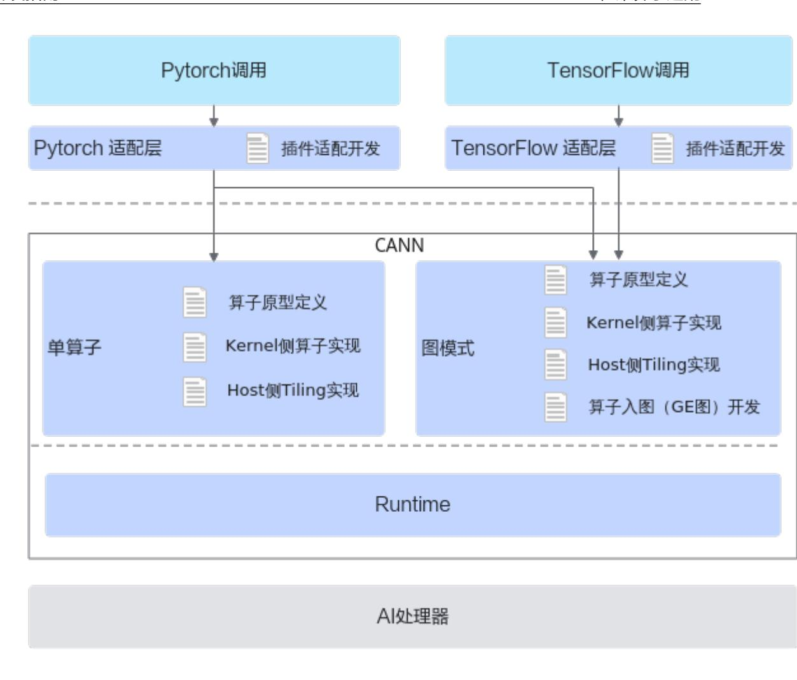

## **9.2 PyTorch** 框架

Pytorch框架单算子模式下的适配插件开发流程和具体样例请参见《**[Ascend Extension](https://www.hiascend.com/document/detail/zh/Pytorch/710/ptmoddevg/Frameworkfeatures/featuresguide_00001.html) for PyTorch** [框架特性指南》](https://www.hiascend.com/document/detail/zh/Pytorch/710/ptmoddevg/Frameworkfeatures/featuresguide_00001.html)中的"基于**OpPlugin**[算子适配开发](https://www.hiascend.com/document/detail/zh/Pytorch/710/ptmoddevg/Frameworkfeatures/featuresguide_00021.html)"章节。图模式下自 定义算子入图的开发指导请参见《**PyTorch**[图模式使用指南](https://www.hiascend.com/document/detail/zh/Pytorch/710/modthirdparty/torchairuseguide/torchair_00003.html)**(TorchAir)**》中的"[自定义](https://www.hiascend.com/document/detail/zh/Pytorch/710/modthirdparty/torchairuseguide/torchair_00042.html) [算子入图"](https://www.hiascend.com/document/detail/zh/Pytorch/710/modthirdparty/torchairuseguide/torchair_00042.html)章节。

## **9.3 ONNX** 框架

## **9.3.1** 适配插件开发

### 说明

针对Atlas A3 训练系列产品/Atlas A3 推理系列产品,暂不支持ONNX框架算子调用。

您可以参考本章节进行算子适配插件的开发,将ONNX框架的算子映射成适配昇腾AI 处理器的算子(下文简称CANN算子),从而完成从ONNX框架调用Ascend C自定义 算子的过程。

完成[算子工程创建后](#page-279-0),会在算子工程目录下生成framework/onnx\_plugin目录,用于 存放ONNX框架适配插件实现文件。以自定义CANN算子LeakyReluCustom为例,算子 工程目录如下:

```
LeakyReluCustom
├── build.sh // 编译入口脚本
├── cmake 
├── CMakeLists.txt // 算子工程的CMakeLists.txt
├── CMakePresets.json // 编译配置项
├── framework // 框架适配插件实现文件目录
│ ├── onnx_plugin // ONNX框架适配插件实现文件目录
│ │ ├── CMakeLists.txt 
│ │ ├── leaky_relu_custom_plugin.cc // ONNX框架适配插件实现文件 
│ ├── CMakeLists.txt
├── op_host // host侧实现文件
├── op_kernel // kernel侧实现文件
└── scripts // 自定义算子工程打包相关脚本所在目录
```

下文主要讲解ONNX框架适配插件实现文件(leaky\_relu\_custom\_plugin.cc )的开发 流程。

```
#include "register/register.h"
#include "graph/operator.h"
#include "json.hpp"
namespace domi {
 Status ParseParamByOpFunc(const ge::Operator& op_src, ge::Operator& op_dest) {
 //...
 }
 REGISTER_CUSTOM_OP("OpType")
 .FrameworkType(ONNX) 
 .OriginOpType("OriginOpType")
 .ParseParamsByOperatorFn(ParseParamByOpFunc) //用来注册解析算子属性的函数
 .ImplyType(ImplyType::TVM); // Ascend C算子实现类型设置为TVM
}
```

### 步骤**1** 包含所需头文件。

- register.h,存储在CANN软件安装后文件存储路径的"include/register/"目录 下,包含该头文件,可使用算子注册相关类,调用算子注册相关的接口。
- operator.h(可选),存储在CANN软件安装后文件存储路径的"include/ graph/"目录下,包含该头文件,可以使用Operator类相关接口,获取算子输入 输出及属性等算子信息。
- json.hpp,用于进行ONNX数据定义的解析,将String类型的算子参数定义转换为 json格式。若样例工程中未提供"json.hpp"文件,用户可以自行下载,并将 "json.hpp"放在工程可以找到的任意路径下,然后包含此头文件即可,下载路 径可参见**[json.hpp](https://github.com/nlohmann/json/blob/develop/include/nlohmann/json.hpp)**。

步骤**2** 使用REGISTER\_CUSTOM\_OP宏,完成CANN算子和ONNX框架的算子映射关系注册。 使用方法如下:

- REGISTER\_CUSTOM\_OP:注册自定义算子,OpType为算子类型名称,需要[与算](#page-217-0) [子原型注册](#page-217-0)中的OpType保持一致。
- **[FrameworkType](#page-2722-0)**:ONNX代表原始框架为ONNX。
- **[OriginOpType](#page-2723-0)**:算子在原始框架中的类型。例如自定义算子OpTypeA,对应 ONNX算子库版本opset\_version=11,应传入"ai.onnx::11::OpTypeA",当前支 持的ONNX版本范围为9~15。
- **[ParseParamsByOperatorFn](#page-2724-0)**(ParseParamByOpFunc):用来注册解析算子参数实 现映射关系的回调函数,需要用户自定义实现回调函数**[ParseParamByOpFunc](#page-2724-0)**。 具体实现方式参考[步骤](#page-277-0)**3**。
- ImplyType:指定算子的实现方式。Ascend C算子实现类型设置为TVM。

### <span id="page-277-0"></span>步骤**3** 实现回调函数ParseParamByOpFunc。其函数声明如下所示:

Status ParseParamByOpFunc(const ge::Operator& op\_src, ge::Operator& op\_dest)

- ParseParamByOpFunc:函数名称,用户自定义。
- op\_src:ONNX框架定义的Operator类对象,包含ONNX模型中自定义的算子属性 信息,定义来源于ONNX框架的原始模型文件。
- op\_dest:CANN算子数据结构,保存算子信息,Operator类的详细描述请参见 **[Operator](#page-2680-0)**类。

开发者需要在回调函数中实现属性的解析和映射,具体实现方式如下:

ONNX原始模型中,属性为repeated message类型,对于repeated message类型的参 数,可使用**GetAttr(const char \*name, ge::AscendString &attr\_value)**接口获取其 属性值,然后将AscendString类型的属性值转换为String类型,再将其转换为json格式 进行属性字段的解析。

### 实现如下所示:

```
Status ParseParamLeakyReluAscend(const ge::Operator& op_src, ge::Operator& op_dest) {
 float negative_slope = 0.01f;
 string negative_slope_str;
 AscendString attrs_string;
 // 使用固定属性名称"attribute"获取ONNX算子中的属性,并赋值给AscendString类型对象
 if (ge::GRAPH_SUCCESS == op_src.GetAttr("attribute", attrs_string)) {
 // 转换为json格式
 json attrs = json::parse(attrs_string.GetString());
 for (json attr : attrs["attribute"]) {
 if (attr["name"] == "alpha" && attr["type"] == kTypeFloat) {
 negative_slope_str = attr["f"]; // float type in json has accuracy loss, so we use string type to store it
 negative_slope = atof(negative_slope_str.c_str());
 }
 }
 }
 op_dest.SetAttr("negative_slope", negative_slope);
 return SUCCESS;
}
```

### 须知

- 当前版本GetAttr与SetAttr接口不支持对原始文件中数据类型为double和uint64的 字段进行解析。
- 使用ATC工具执行模型转换时,对属性的获取情况不会进行强校验。所以进行算子 适配插件实现时,若用户调用GetAttr失败,建议根据算子实际情况增加相应的处理 逻辑,例如,针对必选属性,可返回失败,针对可选属性,可设置默认值。

### **----**结束

## **9.3.2** 调用样例

完成了ONNX框架的适配插件开发后,即可实现从ONNX框架调用Ascend C自定义算 子。下面以一个仅包含LeakyRelu算子的ONNX框架网络为例(该网络中的LeakyRelu 算子通过适配插件映射为自定义的LeakyRelu算子),呈现一个使用推理工具进行推理 的过程,目的在于让您快速体验推理场景下网络中自定义算子调用的过程。

在完成如下步骤之前,您需要先参考上文内容完成自定义LeakyRelu算子kernel侧和 host侧的开发、ONNX适配插件的开发,并完成算子的编译部署。

LeakyRelu算子实现的完整样例请参考**[LINK](https://gitee.com/ascend/samples/tree/master/operator/ascendc/0_introduction/9_leakyrelu_frameworklaunch/LeakyReluCustom)**。ONNX框架调用的完整示例请参考 **[LINK](https://gitee.com/ascend/samples/tree/master/operator/ascendc/0_introduction/9_leakyrelu_frameworklaunch/OnnxInvocation)**。

步骤**1** 通过如下命令获取ONNX框架网络模型。作为示例,该模型中仅包含一个LeakyRelu算 子。

wget https://obs-9be7.obs.cn-east-2.myhuaweicloud.com/AscendC/leaky\_relu.onnx

步骤**2** 执行如下命令生成离线模型。(如下命令中使用的目录以及文件均为样例,请以实际 为准)

atc --model=\$HOME/module/leaky\_relu.onnx --framework=5 --soc\_version=<soc\_version> --output= \$HOME/module/out/leaky\_relu --input\_shape="X:8,16,1024" --input\_format=ND

### 关键参数的解释如下:

- --model:ONNX框架网络模型文件(\*.onnx)的路径。
- --framework:原始框架类型。5表示ONNX。
- --output:转换后的离线模型的路径以及文件名。请注意,记录保存该om模型文 件的路径,后续开发应用时需要使用。
- --soc\_version:昇腾AI处理器的型号。

### 说明

AI处理器的型号请通过如下方式获取:

- 非Atlas A3 训练系列产品/Atlas A3 推理系列产品:在安装昇腾AI处理器的服务器执行 **npu-smi info**命令进行查询,获取**Name**信息。实际配置值为AscendName,例如 **Name**取值为xxxyy,实际配置值为Ascendxxxyy。
- Atlas A3 训练系列产品/Atlas A3 推理系列产品:在安装昇腾AI处理器的服务器执行 **npu-smi info -t board -i** id **-c** chip\_id命令进行查询,获取**Chip Name**和**NPU Name** 信息,实际配置值为Chip Name\_NPU Name。例如**Chip Name**取值为Ascendxxx, **NPU Name**取值为1234,实际配置值为Ascendxxx\_1234。

### 其中:

- id:设备id,通过**npu-smi info -l**命令查出的NPU ID即为设备id。
- chip\_id:芯片id,通过**npu-smi info -m**命令查出的Chip ID即为芯片id。
- --input\_shape:指定模型输入数据的shape,请基于算子支持的shape范围和实际 使用场景进行设置,这里设置输入X为固定shape [8,16,1024]。
- --input\_format:指定模型输入数据的格式,请基于算子支持的格式和实际使用场 景进行设置,这里配置为ND。
- 步骤**3** 使用export ASCEND\_GLOBAL\_LOG\_LEVEL=1改变日志级别为INFO,若出现如下提示 信息,则说明进入了Ascend C自定义算子编译流程且模型转换成功。

start compile Ascend C operator LeakyReluCustom. kernel name is leaky\_relu\_custom compile Ascend C operator: LeakyReluCustom success!

... ATC run success

...

成功执行命令后,在--output参数指定的路径下,可查看离线模型(如: leaky\_relu.om)。

步骤**4** 准备符合模型输入要求的\*.bin格式的输入数据,单击**[LINK](https://gitee.com/ascend/tools/tree/master/msame)**,获取msame工具,参考该 工具配套的README,使用推理工具快速完成推理体验,样例如下。

./msame --model "\$HOME/module/out/leaky\_relu.om" --output "\$HOME/module/out/" --outfmt TXT - loop 1

### **----**结束

## <span id="page-279-0"></span>**9.4 TensorFlow** 框架

本章节介绍TensorFlow框架算子适配的流程,用于将TensorFlow框架的算子映射成 CANN算子(开发者基于CANN框架自定义开发的算子),从而完成从TensorFlow框架 调用到CANN算子的过程。同时给出TensorFlow框架侧算子调用的示例,便于开发者 了解完整流程。

下图展示了完整的开发流程,具体步骤如下:

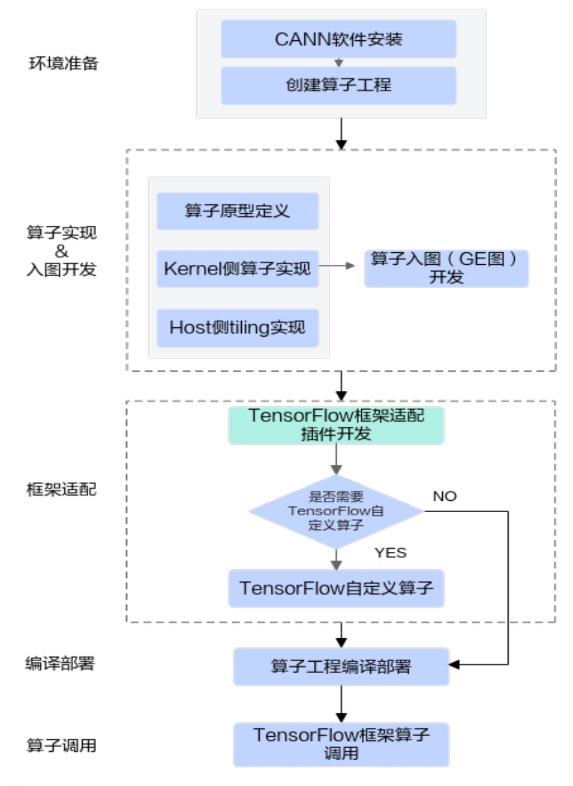

### 步骤**1** 环境准备。

- 1. CANN软件安装请参考**2** [环境准备](#page-52-0)。
- 2. [创建算子工程。](#page-214-0)使用msOpGen工具创建算子开发工程。TensorFlow框架算子适配 场景下,需要通过framework参数指定具体的框架为tf或者tensorflow,工具会自

动生成框架适配代码。以自定义CANN算子AddCustom为例,使用msOpGen工具 创建算子开发工程的具体命令如下:

**\${INSTALL\_DIR}**/python/site-packages/bin/msopgen gen -i \$HOME/sample/add\_custom.json -f tf -c ai\_core-**<soc\_version>** -lan cpp -out \$HOME/sample/AddCustom

### 步骤**2** 算子实现。

- [算子原型定义。](#page-217-0)通过原型定义来描述算子输入输出、属性等信息以及算子在AI处 理器上相关实现信息,并关联tiling实现等函数。
- Kernel侧算子实现和host侧tiling实现请参考**6** [算子实现](#page-91-0);工程化算子开发,支持 开发者调用Tiling API基于CANN提供的编程框架进行tiling开发,kernel侧也提供 对应的接口方便开发者获取tiling参数,具体内容请参考**[6.7.4 Kernel](#page-222-0)**侧算子实现 和**[6.7.5 Host](#page-224-0)**侧**tiling**实现,由此而带来的额外约束也在上述章节说明。

步骤**3** [算子入图\(](#page-257-0)**GE**图)开发。算子入图场景下,需要提供shape推导等算子入图适配函数 的实现。

步骤**4** TensorFlow框架适配插件开发。详细说明见适配插件开发。

步骤**5** 编译部署。通过工程编译脚本完成算子的编译部署,分[为算子包编译和](#page-236-0)[算子动态库编](#page-244-0) [译](#page-244-0)两种方式。

步骤**6** TensorFlow框架算子调用。详细说明见**TensorFlow**[原生算子映射到](#page-281-0)**CANN**算子和 **TensorFlow**[自定义算子开发并映射到](#page-282-0)**CANN**算子。完整样例请参考**[LINK](https://gitee.com/ascend/samples/tree/master/operator/ascendc/0_introduction/1_add_frameworklaunch/TensorflowInvocation)**。

**----**结束

## 适配插件开发

完成[算子工程创建后](#page-279-0),会在算子工程目录下生成framework/tf\_plugin目录,用于存放 TensorFlow框架适配插件实现文件。以自定义CANN算子AddCustom为例,算子工程 目录如下:

```
AddCustom
├── build.sh // 编译入口脚本
├── cmake 
├── CMakeLists.txt // 算子工程的CMakeLists.txt
├── CMakePresets.json // 编译配置项
├── framework // 框架适配插件实现文件目录
│ ├── tf_plugin // TensorFlow框架适配插件实现文件目录
│ │ ├── CMakeLists.txt 
│ │ ├── tensorflow_add_custom_plugin.cc // TensorFlow框架适配插件实现文件 
│ ├── CMakeLists.txt
├── op_host // host侧实现文件
├── op_kernel // kernel侧实现文件
└── scripts // 自定义算子工程打包相关脚本所在目录
```

当TensorFlow算子与CANN算子原型定义一致时,TensorFlow框架适配插件实现代码 如下:

```
#include "register/register.h"
namespace domi {
REGISTER_CUSTOM_OP("AddCustom")
 .FrameworkType(TENSORFLOW) 
 .OriginOpType("AddCustom") 
 .ParseParamsByOperatorFn(AutoMappingByOpFn);
}
```

当TensorFlow算子与CANN算子原型定义不一致时,TensorFlow框架适配插件实现代 码如下:

```
#include "register/register.h"
REGISTER_CUSTOM_OP("FlashAttentionScore")
 .FrameworkType(TENSORFLOW)
```

<span id="page-281-0"></span> .OriginOpType({"FlashAttentionScore"}) .ParseParamsByOperatorFn(FlashAttentionScoreMapping) .ParseOpToGraphFn(AddOptionalPlaceholderForFA);

- 包含插件实现函数相关的头文件。 register.h存储在CANN软件安装后文件存储路径的"include/register/"目录下,
- REGISTER\_CUSTOM\_OP:注册自定义算子,传入算子的OpType,需要与算子原 型注册中的OpType保持一致。
  - **[FrameworkType](#page-2722-0)**:TENSORFLOW代表原始框架为TensorFlow。

包含该头文件,可使用算子注册相关类,调用算子注册相关的接口。

- **[OriginOpType](#page-2723-0)**:算子在原始框架中的类型。对于TensorFlow自定义算子, 还需要完成**TensorFlow**[自定义算子的开发](#page-283-0),这里的OriginOpType与 REGISTER\_OP注册算子名相同,对于TensorFlow原生算子, 即为原生算子 名。
- **[ParseParamsByOperatorFn](#page-2724-0)**:用来注册解析算子参数实现映射关系的回调 函数,需要用户自定义实现回调函数**[ParseParamByOpFunc](#page-2724-0)**。原始 TensorFlow算子中参数与CANN算子中参数一一对应时,可直接使用自动映 射回调函数**[14.2.3.22.26 AutoMappingByOpFn](#page-2736-0)**自动实现映射。
- **[ParseOpToGraphFn](#page-2728-0)**:当TensorFlow算子与CANN算子原型定义不一致(比 如CANN算子原型定义原型中有可选输入,但TensorFlow原型定义中不支持 可选输入,没有可选输入)的情况时,用来注册调整算子原型映射关系的回 调函数。

## **TensorFlow** 原生算子映射到 **CANN** 算子

以自定义算子AddCustom为例,将该算子映射到TensorFlow内置算子Add上,需要先 修改AddCustom自定义算子目录framework/tf\_plugin下插件代码,完成算子名映射:

```
#include "register/register.h"
namespace domi {
REGISTER_CUSTOM_OP("AddCustom") // 当前Ascend C自定义算子名
 .FrameworkType(TENSORFLOW) // 第三方框架类型TENSORFLOW
 .OriginOpType("Add") // 映射到TensorFlow原生算子Add
 .ParseParamsByOperatorFn(AutoMappingByOpFn);
}
```

完成算子工程的编译部署后,构造单算子的TensorFlow 1.15版本测试用例进行验证。

步骤**1** 编写测试用例"tf\_add.py"。

步骤**2** 导入python库。

```
import logging # Python标准库日志模块
import tensorflow as tf # 导入TensorFlow开源库
from npu_bridge.estimator import npu_ops # 导入TensorFlow开源库中的npu_ops模块
import numpy as np # 导入Python的数学基础库
```

步骤**3** 通过config()定义昇腾AI处理器和CPU上的运行参数。

当"execute\_type"为"ai\_core"时,代表在昇腾AI处理器上运行单算子网络,最终 会调用到Ascend C算子。

当"execute\_type"为"cpu"时,代表在Host侧的CPU运行单算子网络,调用的是 TensorFlow算子。

```
def config(execute_type):
 if execute_type == 'ai_core':
 session_config = tf.ConfigProto(
 allow_soft_placement=True,
 log_device_placement=False,)
```

```
 custom_op = session_config.graph_options.rewrite_options.custom_optimizers.add()
 custom_op.name = "NpuOptimizer"
 custom_op.parameter_map["enable_data_pre_proc"].b = True # 开启数据预处理下沉到Device侧执行
 custom_op.parameter_map["mix_compile_mode"].b = True 
 custom_op.parameter_map["use_off_line"].b = True # True表示在昇腾AI处理器上执行训练
 elif execute_type == 'cpu':
 session_config = tf.ConfigProto(
 allow_soft_placement=True,
 log_device_placement=False)
 return session_config
```

### 步骤**4** 单算子网络测试用例主函数。

- 算子输入请根据算子实际输入个数及shape进行构造。
- 算子输出的计算,请根据算子逻辑调用TensorFlow相关接口进行实现。

```
#设置np.allclose比较函数的公差参数。
#np.allclose比较函数的相对公差参数
atol = 0.001
#np.allclose比较函数的绝对公差参数
rtol = 0.001
def main(unused_argv):
 shape_params = (8, 2048)
 dtype_params = np.float16
 # 构造Add算子的两个输入数据,shape为shape_params,范围在[-2,2]之间的随机数
 x_data = np.random.uniform(-2, 2, size=shape_params).astype(dtype_params)
 y_data = np.random.uniform(-2, 2, size=shape_params).astype(dtype_params)
 # 分别对Add算子的两个输入数据进行占位
 x = tf.compat.v1.placeholder(dtype_params, shape=shape_params)
 y = tf.compat.v1.placeholder(dtype_params, shape=shape_params)
 # 计算算子输出
 out = tf.math.add(x, y)
 # 在Host侧CPU上运行单算子,得到期望运行结果
 with tf.compat.v1.Session(config=config('cpu')) as session:
 result_cpu = session.run(out, feed_dict={x: x_data, y: y_data})
 # 在昇腾AI处理器上运行单算子,得到实际运行结果
 with tf.compat.v1.Session(config=config('ai_core')) as session:
 result_ai_core = session.run(out, feed_dict={x: x_data, y: y_data})
 np.array(result_ai_core).astype(dtype_params)
 np.array(result_cpu).astype(dtype_params)
 print('====================================')
 # 通过np.allclose比较昇腾AI处理器上运行的实际结果和cpu上运行的期望结果,其中atol和rtol为np.allclose比
较函数的相对公差参数和绝对公差参数
 cmp_result = np.allclose(result_ai_core, result_cpu, atol, rtol)
 print(cmp_result)
 print('====================================')
```

### 步骤**5** 运行单算子网络。

```
if __name__ == "__main__":
 tf.app.run()
```

### **----**结束

## **TensorFlow** 自定义算子开发并映射到 **CANN** 算子

步骤**1** 适配插件代码开发。以自定义算子AddCustom为例,将该算子映射到TensorFlow自定 义算子AddCustom上,需要先修改CANN AddCustom自定义算子工程目录 framework/tf\_plugin下插件代码,完成算子名映射:

```
REGISTER_CUSTOM_OP("AddCustom")
 .FrameworkType(TENSORFLOW) 
 .OriginOpType("AddCustom") 
 .ParseParamsByOperatorFn(AutoMappingByOpFn);
```

<span id="page-283-0"></span>步骤**2** TensorFlow自定义算子的开发。本节仅给出示例说明,详细内容请参考TensorFlow官 方文档。

创建TensorFlow原型注册文件custom\_assign\_add\_custom.cc,内容如下:

```
#include "tensorflow/core/framework/op.h"
#include "tensorflow/core/framework/shape_inference.h"
#include "tensorflow/core/framework/op_kernel.h"
#include "tensorflow/core/framework/common_shape_fns.h"
using namespace tensorflow;
// 通过TensorFlow提供的REGISTER_OP接口完成算子原型的注册
REGISTER_OP("AddCustom") // TensorFlow 注册算子名
 .Input("x: T") // 算子原型,输入参数x,类型为T
 .Input("y: T") // 算子原型,输入参数y,类型为T
 .Output("z: T") // 算子原型,输入参数z,类型为T
 .Attr("T: {half}") // T类型支持范围
 .SetShapeFn(shape_inference::BroadcastBinaryOpShapeFn); // 算子shape信息推导,
BroadcastBinaryOpShapeFn为TensorFlow提供的内置函数,输出shape信息由输入shape传播推导,即输入和输
出shape保持一致
// 实现一个CPU版本的kernel函数,因为Tensorflow的计算图在构建时会检查所有的算子是否有任意设备上的
kernel函数(NPU Kernel无法被感知),如果没有将会报错。这里实现一个固定返回错误的CPU kernel函数:
class AddCustomOp : public OpKernel {
 public:
 explicit AddCustomOp(OpKernelConstruction* context) : OpKernel(context) {}
 void Compute(OpKernelContext* context) override {
 OP_REQUIRES_OK(context, errors::Unimplemented("AddCustomOp is not supported on CPU")); 
 }
};
REGISTER_KERNEL_BUILDER(Name("AddCustom").Device(DEVICE_CPU), AddCustomOp); // 注册
AddCustom算子的CPU实现内核,该函数当前仅打印日志提示CPU不支持
```

使用如下命令对上述代码进行编译,产物为libcustom\_ops.so,后续的算子调用脚本中 可通过load\_op\_library接口加载该so为python模块,从而调用自定义算子。

```
TF_CFLAGS=( $(python3 -c 'import tensorflow as tf; print(" ".join(tf.sysconfig.get_compile_flags()))') ) // 
获取TensorFlow编译选项
TF_LFLAGS=( $(python3 -c 'import tensorflow as tf; print(" ".join(tf.sysconfig.get_link_flags()))') ) // 获
取TensorFlow链接选项
SOURCE_FILES=custom_assign_add_custom.cc // 包含
TensorFlow算子注册和CPU内核实现的cc文件
g++ -std=c++14 -shared $SOURCE_FILES -o ${Path}/libcustom_ops.so -fPIC ${TF_CFLAGS[@]} $
{TF_LFLAGS[@]} -O2 // 编译命令,产物为libcustom_ops.so,TensorFlow即可通过load_op_library加载该so为
python模块,调用自定义算子
```

### 步骤**3** 测试脚本中加载上一步骤编译好的动态库,实现自定义算子的调用。

● TensorFlow 1.15.0调用代码示例

```
import os
import tensorflow as tf
import numpy as np
from npu_bridge.npu_init import *
tf.enable_resource_variables()
#np.allclose比较函数的相对公差参数
atol = 0.001
#np.allclose比较函数的绝对公差参数
rtol = 0.001
def main(unused_argv):
 custom_op_lib = tf.load_op_library('./outputs/libcustom_ops.so') # 加载so为python模块
 shape_params = (8, 2048)
 dtype_params = np.float16
 x_data = np.random.uniform(-2, 2, size=shape_params).astype(dtype_params)
 y_data = np.random.uniform(-2, 2, size=shape_params).astype(dtype_params)
 x = tf.compat.v1.placeholder(dtype_params, shape=shape_params)
 y = tf.compat.v1.placeholder(dtype_params, shape=shape_params)
 tf_z = tf.math.add(x, y) # 调用TensorFlow原生算子
```

```
 ac_z = custom_op_lib.add_custom(x, y) # 调用AscendC AddCustom自定义算子;
add_custom是将REGISTER_OP(AddCustom)中的AddCustom由大驼峰命名转为下划线格式
 config = tf.ConfigProto()
 custom_op = config.graph_options.rewrite_options.custom_optimizers.add()
 custom_op.name = "NpuOptimizer" # 配置在昇腾AI处理器上运行单算子
 config.graph_options.rewrite_options.remapping = RewriterConfig.OFF
 config.graph_options.rewrite_options.memory_optimization = RewriterConfig.OFF
 with tf.Session(config=config) as sess:
 sess.run(tf.global_variables_initializer())
 tf_golden = sess.run(tf_z, feed_dict={x: x_data, y: y_data})
 with tf.Session(config=config) as sess:
 sess.run(tf.global_variables_initializer())
 ascend_out = sess.run(ac_z, feed_dict={x: x_data, y: y_data})
 np.array(tf_golden).astype(dtype_params)
 np.array(ascend_out).astype(dtype_params)
 print('====================================')
 # 通过np.allclose比较昇腾AI处理器上运行的实际结果和使用TensorFlow原生算子运行的期望结果,其
中atol和rtol为np.allclose比较函数的相对公差参数和绝对公差参数。
 cmp_result = np.allclose(tf_golden, ascend_out, atol, rtol)
 print(cmp_result)
 print('====================================')
if __name__ == "__main__":
 tf.app.run()
```

### ● TensorFlow 2.6.5调用代码

```
import os
import tensorflow as tf
import numpy as np
import npu_device
from npu_device.compat.v1.npu_init import *
npu_device.compat.enable_v1()
tf.compat.v1.enable_resource_variables()
#np.allclose比较函数的相对公差参数
atol = 0.001
#np.allclose比较函数的绝对公差参数
rtol = 0.001
def main(unused_argv):
 custom_op_lib = tf.load_op_library('./outputs/libcustom_ops.so') # 加载so为python模块
 shape_params = (8, 2048)
 dtype_params = np.float16
 x_data = np.random.uniform(-2, 2, size=shape_params).astype(dtype_params)
 y_data = np.random.uniform(-2, 2, size=shape_params).astype(dtype_params)
 x = tf.compat.v1.placeholder(dtype_params, shape=shape_params)
 y = tf.compat.v1.placeholder(dtype_params, shape=shape_params)
 tf_z = tf.math.add(x, y) # 调用TensorFlow原生算子
 ac_z = custom_op_lib.add_custom(x, y) # 调用AscendC AddCustom自定义算子;
add_custom是将REGISTER_OP(AddCustom)中的AddCustom由大驼峰命名转为下划线格式 
 config = tf.compat.v1.ConfigProto()
 custom_op = config.graph_options.rewrite_options.custom_optimizers.add()
 custom_op.name = "NpuOptimizer"
 config.graph_options.rewrite_options.remapping = RewriterConfig.OFF
 config.graph_options.rewrite_options.memory_optimization = RewriterConfig.OFF
 with tf.compat.v1.Session(config=config) as sess:
 sess.run(tf.global_variables_initializer())
 tf_golden = sess.run(tf_z, feed_dict={x: x_data, y: y_data})
 with tf.compat.v1.Session(config=config) as sess:
 sess.run(tf.global_variables_initializer())
 ascend_out = sess.run(ac_z, feed_dict={x: x_data, y: y_data})
 np.array(tf_golden).astype(dtype_params)
 np.array(ascend_out).astype(dtype_params)
 print('====================================')
 # 通过np.allclose比较昇腾AI处理器上运行的实际结果和使用TensorFlow原生算子运行的期望结果,其
中atol和rtol为np.allclose比较函数的相对公差参数和绝对公差参数。
 cmp_result = np.allclose(tf_golden, ascend_out, atol, rtol)
 print(cmp_result)
 print('====================================')
```

```
if __name__ == "__main__":
 tf.app.run()
```

### **----**结束

## 可选输入算子映射关系开发

TensorFlow的原型定义中不支持可选输入,对于包含可选输入的算子,其从 TensorFlow到CANN的映射关系,不满足简单的一对一映射,需要在插件适配代码 中,将输入转换为可选输入,调整原型的映射关系。下文以CANN算子库中的 FlashAttentionScore算子为例,介绍针对此类算子的框架适配插件如何开发。

### 步骤**1** 适配插件开发

和上文中介绍的简单的一对一映射不同,进行插件适配开发时,需要调用 **[ParseOpToGraphFn](#page-2728-0)**注册回调函数,回调函数中用于调整算子原型映射关系。此时:

- 通过ParseParamsByOperatorFn注册回调函数,回调函数中将TensorFlow原生算 子映射到一个IR和TensorFlow一致的中间算子(调用AutoMappingByOpFn完成属 性映射)。
- 通过ParseOpToGraphFn注册回调函数,调整算子原型映射关系,将中间算子最终 映射到CANN算子库中的算子,这里映射到Graph图的概念是指一个算子构成的单 算子图。

需要注意:在ParseParamsByOperatorFn的回调函数中,需要将TensorFlow算子名称 设置到中间算子的original\_type属性中,用于后续ParseOpToGraphFn回调函数的触 发。示例代码如下:

```
#include <string>
#include <vector>
#include "register/register.h"
#include "graph/operator.h"
#include "graph/graph.h"
#include "graph/operator_factory.h"
namespace domi {
using namespace ge;
static Status AddOptionalPlaceholderForFA(const ge::Operator &tf_op, ge::Graph &graph) {
 // 1. 创建一个FlashAttentionScore算子npu_fa_op
 ge::AscendString op_name;
 tf_op.GetName(op_name);
 auto npu_fa_op = OperatorFactory::CreateOperator(op_name.GetString(), "FlashAttentionScore");
 // 2. 将TensorFlow算子属性映射到npu_fa_op算子上
 float scale_value = 1.0;
 (void)tf_op.GetAttr("scale_value", scale_value);
 (void)npu_fa_op.SetAttr("scale_value", scale_value);
 float keep_prob = 1.0;
 (void)tf_op.GetAttr("keep_prob", keep_prob);
 (void)npu_fa_op.SetAttr("keep_prob", keep_prob);
 int32_t pre_tockens = 2147483647;
 (void)tf_op.GetAttr("pre_tockens", pre_tockens);
 (void)npu_fa_op.SetAttr("pre_tockens", pre_tockens);
 int32_t next_tockens = 2147483647;
 (void)tf_op.GetAttr("next_tockens", next_tockens);
 (void)npu_fa_op.SetAttr("next_tockens", next_tockens);
 int32_t head_num = 0;
 (void)tf_op.GetAttr("head_num", head_num);
 (void)npu_fa_op.SetAttr("head_num", head_num);
 std::string input_layout;
```

```
 (void)tf_op.GetAttr("input_layout", input_layout);
 (void)npu_fa_op.SetAttr("input_layout", input_layout);
 int32_t inner_precise = 0;
 (void)tf_op.GetAttr("inner_precise", inner_precise);
 (void)npu_fa_op.SetAttr("inner_precise", inner_precise);
 int32_t sparse_mode = 0;
 (void)tf_op.GetAttr("sparse_mode", sparse_mode);
 (void)npu_fa_op.SetAttr("sparse_mode", sparse_mode);
 int32_t pse_type = 1;
 (void)tf_op.GetAttr("pse_type", pse_type);
 (void)npu_fa_op.SetAttr("pse_type", pse_type);
 int32_t seed = 0;
 (void)tf_op.GetAttr("seed", seed);
 (void)npu_fa_op.SetAttr("seed", seed);
 int32_t offset = 0;
 (void)tf_op.GetAttr("offset", offset);
 (void)npu_fa_op.SetAttr("offset", offset);
 int32_t out_dtype = 0;
 (void)tf_op.GetAttr("out_dtype", out_dtype);
 (void)npu_fa_op.SetAttr("out_dtype", out_dtype); 
 // 3. 创建输入Data
 std::vector<Operator> inputs;
 for (size_t i = 0UL; i < tf_op.GetInputsSize(); i++) {
 const std::string data_name = "Data_" + std::to_string(i);
 Operator data_op = OperatorFactory::CreateOperator(data_name.c_str(), "Data");
 (void)data_op.SetAttr("index", static_cast<int32_t>(i));
 inputs.emplace_back(data_op);
 }
 size_t index = 0UL;
 //4. 必选输入直接设置Data到算子输入
 (void)npu_fa_op.SetInput("query", inputs[index++]);
 (void)npu_fa_op.SetInput("key", inputs[index++]);
 (void)npu_fa_op.SetInput("value", inputs[index++]);
 // 5. 可选输入需要判断type属性的个数是否为0,不为0则表示可选输入已经使能
 std::vector<DataType> real_shift_type;
 (void)tf_op.GetAttr("real_shift_type", real_shift_type);
 if (!real_shift_type.empty()) {
 (void)npu_fa_op.SetInput("real_shift", inputs[index++]);
 }
 std::vector<DataType> drop_mask_type;
 (void)tf_op.GetAttr("drop_mask_type", drop_mask_type);
 if (!drop_mask_type.empty()) {
 (void)npu_fa_op.SetInput("drop_mask", inputs[index++]);
 }
 std::vector<DataType> padding_mask_type;
 (void)tf_op.GetAttr("padding_mask_type", padding_mask_type);
 if (!padding_mask_type.empty()) {
 (void)npu_fa_op.SetInput("padding_mask", inputs[index++]);
 }
 std::vector<DataType> atten_mask_type;
 (void)tf_op.GetAttr("atten_mask_type", atten_mask_type);
 if (!atten_mask_type.empty()) {
 (void)npu_fa_op.SetInput("atten_mask", inputs[index++]);
 }
 std::vector<DataType> prefix_type;
 (void)tf_op.GetAttr("prefix_type", prefix_type);
 if (!prefix_type.empty()) {
 (void)npu_fa_op.SetInput("prefix", inputs[index++]);
 }
 std::vector<DataType> actual_seq_qlen_type;
```

```
 (void)tf_op.GetAttr("actual_seq_qlen_type", actual_seq_qlen_type);
 if (!actual_seq_qlen_type.empty()) {
 (void)npu_fa_op.SetInput("actual_seq_qlen", inputs[index++]);
 }
 std::vector<DataType> actual_seq_kvlen_type;
 (void)tf_op.GetAttr("actual_seq_kvlen_type", actual_seq_kvlen_type);
 if (!actual_seq_kvlen_type.empty()) {
 (void)npu_fa_op.SetInput("actual_seq_kvlen", inputs[index++]);
 }
 std::vector<DataType> q_start_idx_type;
 (void)tf_op.GetAttr("q_start_idx_type", q_start_idx_type);
 if (!q_start_idx_type.empty()) {
 (void)npu_fa_op.SetInput("q_start_idx", inputs[index++]);
 }
 std::vector<DataType> kv_start_idx_type;
 (void)tf_op.GetAttr("kv_start_idx_type", kv_start_idx_type);
 if (!kv_start_idx_type.empty()) {
 (void)npu_fa_op.SetInput("kv_start_idx", inputs[index++]);
 }
 std::vector<DataType> d_scale_q_type;
 (void)tf_op.GetAttr("d_scale_q_type", d_scale_q_type);
 if (!d_scale_q_type.empty()) {
 (void)npu_fa_op.SetInput("d_scale_q", inputs[index++]);
 }
 std::vector<DataType> d_scale_k_type;
 (void)tf_op.GetAttr("d_scale_k_type", d_scale_k_type);
 if (!d_scale_k_type.empty()) {
 (void)npu_fa_op.SetInput("d_scale_k", inputs[index++]);
 }
 std::vector<DataType> d_scale_v_type;
 (void)tf_op.GetAttr("d_scale_v_type", d_scale_v_type);
 if (!d_scale_v_type.empty()) {
 (void)npu_fa_op.SetInput("d_scale_v", inputs[index++]);
 }
 std::vector<DataType> query_rope_type;
 (void)tf_op.GetAttr("query_rope_type", query_rope_type);
 if (!query_rope_type.empty()) {
 (void)npu_fa_op.SetInput("queryRope", inputs[index++]);
 }
 std::vector<DataType> key_rope_type;
 (void)tf_op.GetAttr("key_rope_type", key_rope_type);
 if (!key_rope_type.empty()) {
 (void)npu_fa_op.SetInput("keyRope", inputs[index++]);
 } 
 // 6. 使用npu_fa_op算子的输出构造图的输出。
 std::vector<std::pair<Operator, std::vector<size_t>>> output_indexs;
 std::vector<size_t> node_output_index;
 for (size_t i = 0UL; i < npu_fa_op.GetOutputsSize(); i++) {
 node_output_index.emplace_back(i);
 }
 (void)output_indexs.emplace_back(std::make_pair(npu_fa_op, node_output_index));
 (void)graph.SetInputs(inputs).SetOutputs(output_indexs);
 return SUCCESS;
}
static Status FlashAttentionScoreMapping(const ge::Operator& op_src, ge::Operator& op_dst) {
 // 1. 调用默认映射函数即可
 if (AutoMappingByOpFn(op_src, op_dst) != ge::GRAPH_SUCCESS) {
 return FAILED;
 }
 // 2. 需要将TensorFlow算子名称设置到op_dst的original_type属性中,用于后续ParseOpToGraphFn回调函数的
触发
 op_dst.SetAttr("original_type", "FlashAttentionScore");
 return SUCCESS;
}
```

```
REGISTER_CUSTOM_OP("FlashAttentionScore")
 .FrameworkType(TENSORFLOW)
 .OriginOpType({"FlashAttentionScore"})
 .ParseParamsByOperatorFn(FlashAttentionScoreMapping) // 注册此函数用于实现算子本身属性的映射
 .ParseOpToGraphFn(AddOptionalPlaceholderForFA); // 注册此函数用于实现将tf中的输入转化为可选输入,
改变连边关系
} // namespace domi
```

步骤**2** 在TensorFlow开源框架里注册FlashAttentionScore算子的原型定义,由于TensorFlow 不支持可选输入,需要将其可选输入在TensorFlow原型中表示为动态输入,并通过属 性来标记动态输入的个数,这些可选输入需要放置在原型定义的最后。示例代码 (FlashAttentionScore.cc)如下:

```
#include <algorithm>
#include <atomic>
#include <map> 
#include "tensorflow/core/framework/common_shape_fns.h"
#include "tensorflow/core/framework/op.h"
#include "tensorflow/core/framework/op_kernel.h"
using namespace tensorflow;
using shape_inference::InferenceContext;
using shape_inference::ShapeHandle; 
using namespace std;
using namespace chrono; 
using OpKernelConstructionPtr = OpKernelConstruction*;
using OpKernelContextPtr = OpKernelContext*;
using InferenceContextPtr = ::tensorflow::shape_inference::InferenceContext*;
namespace {
class CustOps : public OpKernel {
public: 
 explicit CustOps(OpKernelConstructionPtr context) : OpKernel(context) {}
 void Compute(OpKernelContextPtr context) override
 {
 std::cout << "Cust Ops not installed!!" << std::endl;
 }
 ~CustOps() override = default;};
} // namespace 
namespace tensorflow {
REGISTER_OP("FlashAttentionScore")
 .Input("query: T")
 .Input("key: T")
 .Input("value: T")
 .Input("real_shift: real_shift_type") // 可选输入在TensorFlow原型中注册为动态输入
 .Input("drop_mask: drop_mask_type")
 .Input("padding_mask: padding_mask_type")
 .Input("atten_mask: atten_mask_type")
 .Input("prefix: prefix_type")
 .Input("actual_seq_qlen: actual_seq_qlen_type")
 .Input("actual_seq_kvlen: actual_seq_kvlen_type")
 .Input("q_start_idx: q_start_idx_type")
 .Input("kv_start_idx: kv_start_idx_type")
 .Input("d_scale_q: d_scale_q_type")
 .Input("d_scale_k: d_scale_k_type")
 .Input("d_scale_v: d_scale_v_type")
 .Input("query_rope: query_rope_type")
 .Input("key_rope: key_rope_type")
 .Output("softmax_max: float32")
 .Output("softmax_sum: float32")
 .Output("softmax_out: T")
 .Output("attention_out: T")
 .Attr("scale_value: float = 1.0")
 .Attr("keep_prob: float = 1.0")
 .Attr("pre_tockens: int = 2147483647")
 .Attr("next_tockens: int = 2147483647")
 .Attr("head_num: int")
 .Attr("input_layout: string")
 .Attr("inner_precise: int = 0")
 .Attr("sparse_mode: int = 0")
 .Attr("pse_type: int = 1")
```

```
 .Attr("seed: int = 0")
 .Attr("offset: int = 0")
 .Attr("out_dtype: int = 0") 
 .Attr("T: {float16, float32, bfloat16} = DT_FLOAT")
 .Attr("real_shift_type: list({float16, float32, bfloat16}) >= 0") // 通过属性来标记动态输入个数
 .Attr("drop_mask_type: list({uint8}) >= 0")
 .Attr("padding_mask_type: list({float16, float32, bfloat16}) >= 0")
 .Attr("atten_mask_type: list({bool, uint8}) >= 0")
 .Attr("prefix_type: list({int64}) >= 0")
 .Attr("actual_seq_qlen_type: list({int64}) >= 0")
 .Attr("actual_seq_kvlen_type: list({int64}) >= 0")
 .Attr("q_start_idx_type: list({int64}) >= 0")
 .Attr("kv_start_idx_type: list({int64}) >= 0")
 .Attr("d_scale_q_type: list({float32}) >= 0")
 .Attr("d_scale_k_type: list({float32}) >= 0")
 .Attr("d_scale_v_type: list({float32}) >= 0")
 .Attr("query_rope_type: list({float32}) >= 0")
 .Attr("key_rope_type: list({float32}) >= 0")
 .SetShapeFn([](InferenceContext *c) {
 return Status::OK();
 });
REGISTER_KERNEL_BUILDER(Name("FlashAttentionScore").Device(DEVICE_CPU), CustOps)}
```

### 使用如下命令对上述代码进行编译,产物为libcustom\_ops.so,后续的算子调用脚本中 可通过load\_op\_library接口加载该so为python模块,从而调用自定义算子。

```
TF_CFLAGS=( $(python3 -c 'import tensorflow as tf; print(" ".join(tf.sysconfig.get_compile_flags()))') ) // 
获取TensorFlow编译选项
TF_LFLAGS=( $(python3 -c 'import tensorflow as tf; print(" ".join(tf.sysconfig.get_link_flags()))') ) // 获
取TensorFlow链接选项
SOURCE_FILES=FlashAttentionScore.cc // 包含TensorFlow
算子注册和CPU内核实现的cc文件
g++ -std=c++14 -shared $SOURCE_FILES -o ${Path}/libflashattention.so -fPIC ${TF_CFLAGS[@]} $
{TF_LFLAGS[@]} -O2 // 编译命令,产物为libflashattention.so,${Path}为自定义的路径,后续TensorFlow可
通过load_op_library加载该so为python模块,调用自定义算子
```

### 步骤**3** 封装一个TensorFlow的算子调用接口,在此接口中处理可选输入。在该脚本需要加载 上一步骤编译好的动态库。

```
from tensorflow.python.framework import ops
import tensorflow as tf
tfOpLib = tf.load_op_library("../build/tf_ops/libflashattention.so")
# 假如外部未使能该可选输入,则给底层传入空列表
def create_optional_input_list(input):
 input_list = []
 if not input is None:
 input_list.append(input)
 return input_list
# flash_attention_score 封装函数
def npu_flash_attention(query, key, value, head_num, input_layout, real_shift=None, drop_mask=None, 
padding_mask=None,
 atten_mask=None, prefix=None, actual_seq_qlen=None, actual_seq_kvlen=None,
 q_start_idx=None, kv_start_idx=None, 
d_scale_q=None,d_scale_k=None,d_scale_v=None,query_rope=None,key_rope=None,scale_value=1.0, 
keep_prob=1.0,
 pre_tockens=2147483647, next_tockens=2147483647, inner_precise=0, sparse_mode=0,
 pse_type=1,seed=0,offset=0,out_dtype=0
):
 output = tfOpLib.flash_attention_score(query=query, key=key, value=value,
 real_shift=create_optional_input_list(real_shift), drop_mask=create_optional_input_list(drop_mask),
 padding_mask=create_optional_input_list(padding_mask), 
atten_mask=create_optional_input_list(atten_mask),
 prefix=create_optional_input_list(prefix),
actual_seq_qlen=create_optional_input_list(actual_seq_qlen),
 actual_seq_kvlen=create_optional_input_list(actual_seq_kvlen), 
q_start_idx=create_optional_input_list(q_start_idx),
 kv_start_idx=create_optional_input_list(kv_start_idx),d_scale_q=create_optional_input_list(d_scale_q),
 d_scale_k=create_optional_input_list(d_scale_k),d_scale_v=create_optional_input_list(d_scale_v),
 query_rope=create_optional_input_list(query_rope),key_rope=create_optional_input_list(key_rope),
 scale_value=scale_value, keep_prob=keep_prob, pre_tockens=pre_tockens,
```

```
next_tockens=next_tockens,
 head_num=head_num, input_layout=input_layout, inner_precise=inner_precise, 
sparse_mode=sparse_mode,
 pse_type=pse_type,seed=seed,offset=offset,out_dtype=out_dtype
)
 return output
```

步骤**4** 测试脚本中实现自定义算子的调用。假设[上一步骤中](#page-289-0)代码文件保存为ops.py,从ops中 导入npu\_flash\_attention函数并使用。TensorFlow 2.6.5调用代码如下:

```
import sys
from ops import npu_flash_attention
import tensorflow as tf
import numpy as np
tf.compat.v1.disable_eager_execution()
import npu_device
from npu_device.compat.v1.npu_init import *
npu_device.compat.enable_v1()
def sess_config():
 config = tf.compat.v1.ConfigProto()
 custom_op = config.graph_options.rewrite_options.custom_optimizers.add()
 custom_op.name = "NpuOptimizer"
 config.graph_options.rewrite_options.remapping = RewriterConfig.OFF
 config.graph_options.rewrite_options.memory_optimization = RewriterConfig.OFF
 return config
shape = [1, 32, 32]
query_np = np.random.randn(*shape).astype(np.float16)
key_np = np.random.randn(*shape).astype(np.float16)
value_np = np.random.randn(*shape).astype(np.float16)
query = tf.Variable(query_np, tf.float16)
key = tf.Variable(key_np, tf.float16)
value = tf.Variable(value_np, tf.float16)
mask = tf.zeros(shape=(shape[0], 1, shape[1], shape[1]), dtype=tf.uint8)
head_num = 1
input_layout = "BSH"
flash_result_t = npu_flash_attention(query, key, value, head_num, input_layout, atten_mask=mask)
with tf.compat.v1.Session(config=sess_config()) as sess:
 sess.run(tf.compat.v1.global_variables_initializer())
 flash_result = sess.run(flash_result_t)
 print(flash_result)
```

### **----**结束

## 动态输入算子映射关系开发

对于存在动态输入/输出的算子,需要在插件的回调函数**[ParseParamByOpFunc](#page-2724-0)**中使 用**[AutoMappingByOpFnDynamic](#page-2738-0)**实现TensorFlow算子和CANN算子的匹配。通过 DynamicInputOutputInfo结构类描述动态输入/输出的信息,将动态输入/输出的名称 和描述其个数的属性名绑定,再传入**[AutoMappingByOpFnDynamic](#page-2738-0)**实现自动匹配。

以ParseSingleExample算子为例,插件适配代码如下:

```
#include "register/register.h"
namespace domi {
Status ParseSingleExampleMapping(const ge::Operator& op_src, ge::Operator& op) {
 std::vector<DynamicInputOutputInfo> value;
 const std::string dynamic_input_name_dense_defaults = "dense_defaults";
 const std::string dynamic_input_attr_name_dense_defaults = "Tdense";
 DynamicInputOutputInfo input(kInput, dynamic_input_name_dense_defaults.c_str(),
 dynamic_input_name_dense_defaults.size(), dynamic_input_attr_name_dense_defaults.c_str(),
 dynamic_input_attr_name_dense_defaults.size());
```

```
 value.push_back(input);
 const std::string dynamic_output_name_sparse_indices = "sparse_indices";
 const std::string dynamic_output_attr_name_sparse_indices = "num_sparse";
 DynamicInputOutputInfo output(kOutput, 
 dynamic_output_name_sparse_indices.c_str(),
 dynamic_output_name_sparse_indices.size(), dynamic_output_attr_name_sparse_indices.c_str(),
 dynamic_output_attr_name_sparse_indices.size());
 value.push_back(output);
 const std::string dynamic_output_name_sparse_values = "sparse_values";
 const std::string dynamic_output_attr_name_sparse_values = "sparse_types";
 DynamicInputOutputInfo output1(kOutput, 
 dynamic_output_name_sparse_values .c_str(),
 dynamic_output_name_sparse_values .size(), dynamic_output_attr_name_sparse_values.c_str(),
 dynamic_output_attr_name_sparse_values.size());
 value.push_back(output1);
 const std::string dynamic_output_name_sparse_shapes = "sparse_shapes";
 const std::string dynamic_output_attr_name_sparse_shapes = "sparse_types";
 DynamicInputOutputInfo output1(kOutput, 
 dynamic_output_name_sparse_shapes.c_str(),
 dynamic_output_name_sparse_shapes.size(), dynamic_output_attr_name_sparse_shapes.c_str(),
 dynamic_output_attr_name_sparse_shapes.size());
 value.push_back(output2);
 const std::string dynamic_output_name_dense_values = "dense_values";
 const std::string dynamic_output_attr_name_dense_values = "Tdense";
 DynamicInputOutputInfo output1(kOutput, 
 dynamic_output_name_dense_values .c_str(),
 dynamic_output_name_dense_values .size(), dynamic_output_attr_name_dense_values.c_str(),
 dynamic_output_attr_name_dense_values.size());
 value.push_back(output3);
 AutoMappingByOpFnDynamic(op_src, op, value);
 return SUCCESS;
}
// register ParseSingleExample op to GE
REGISTER_CUSTOM_OP("ParseSingleExample")
 .FrameworkType(TENSORFLOW)
 .OriginOpType("ParseSingleExample")
 .ParseParamsByOperatorFn(ParseSingleExampleMapping)
 }
```

### 说明

暂不支持同时有可选输入和动态输入的算子映射。

# **10** 概念原理和术语

<span id="page-292-0"></span>术语表

[神经网络和算子](#page-298-0)

[硬件架构与数据处理原理](#page-315-0)

[编程模型设计原理](#page-324-0)

[性能优化技术原理](#page-329-0)

## **10.1** 术语表

### 表 **10-1** 术语表

| 术语/缩略<br>语 | 含义                                                                                                          |
|------------|-------------------------------------------------------------------------------------------------------------|
| A1         | AscendC::TPosition::A1代表设备上用于矩阵计算的逻辑内存,用于存<br>放左矩阵,物理存储对应AI Core的L1 Buffer。                                 |
| A2         | AscendC::TPosition::A2代表设备上用于矩阵计算的逻辑内存,用于存<br>放小块左矩阵(如经过分割、适配L0A Buffer容量的分块),物理存<br>储对应AI Core的L0A Buffer。 |
| AI Core    | 昇腾AI处理器的计算核心,负责执行矩阵、矢量、标量计算密集的任<br>务。使用Ascend C编程语言开发的算子运行在AI Core上。                                        |
| Ascend IR  | Ascend Intermediate Representation,昇腾AI处理器专用的、用于表<br>达计算流程的抽象数据结构。在本文档中,若无特殊说明,IR默认指<br>代Ascend IR。         |
| B1         | AscendC::TPosition::B1代表设备上用于矩阵计算的逻辑内存,用于存<br>放右矩阵,物理存储对应AI Core的L1 Buffer。                                 |
| B2         | AscendC::TPosition::B2代表设备上用于矩阵计算的逻辑内存,用于存<br>放小块右矩阵(如经过分割、适配L0B Buffer容量的分块),物理存<br>储对应AI Core的L0B Buffer。 |

| 术语/缩略<br>语          | 含义                                                                                                                          |
|---------------------|-----------------------------------------------------------------------------------------------------------------------------|
| Block               | Block在不同场景下具有多种含义,通常情况下指AI Core的逻辑核。<br>典型场景有:                                                                              |
|                     | ●<br>AI Core逻辑核:一个Block表示一个AI Core的逻辑核,其BlockID<br>是以0为起始的逻辑编号。                                                             |
|                     | ●<br>DataBlock:一个DataBlock表示一条NPU矢量计算指令处理的数<br>据单元,大小通常为32字节,一条指令可同时处理多个<br>DataBlock。                                      |
|                     | ●<br>基本块:表示一次计算需要的典型数据块大小。                                                                                                  |
| BlockID             | 以0为起始的AI Core逻辑编号,可以比实际硬件核数大。                                                                                               |
| BlockDim            | 参与计算的逻辑AI Core核数,在调用核函数时由开发者指定,其值一<br>般等于或大于实际物理核数。                                                                         |
| BiasTable<br>Buffer | 偏置存储,AI Core内部物理存储单元,通常用于存储矩阵计算所需的<br>Bias(偏置)数据,与逻辑内存AscendC::TPosition::C2相对应。                                            |
| Broadcast           | 广播,一种张量操作机制。通过广播,较小的张量可以自动扩展以匹<br>配较大的张量的形状。                                                                                |
| C1                  | AscendC::TPosition::C1代表设备上用于矩阵计算的逻辑内存,用于存<br>放Bias(偏置)数据,物理存储对应AI Core的L1 Buffer或Unified<br>Buffer。                        |
| C2                  | AscendC::TPosition::C2代表设备上用于矩阵计算的逻辑内存,用于存<br>放小块Bias(偏置)数据(如经过分割、适配BT Buffer容量的分<br>块),物理存储对应AI Core的BT Buffer或L0C Buffer。 |
| CO1                 | AscendC::TPosition::CO1代表设备上用于矩阵计算的逻辑内存,用于<br>存放小块矩阵计算结果(如经过分割的矩阵计算结果分块),物理存<br>储对应AI Core的L0C Buffer。                      |
| CO2                 | AscendC::TPosition::CO2代表设备上用于矩阵计算的逻辑内存,用于<br>存放矩阵计算结果(如原始矩阵的最终计算结果),物理存储对应<br>Global Memory或AI Core的Unified Buffer。        |
| C2PIPE2G<br>M       | AscendC::TPosition::C2PIPE2GM代表设备上用于矩阵计算的逻辑内<br>存,用于存放量化参数,物理存储对应AI Core的Fixpipe Buffer。                                    |
| Compute             | Ascend C算子编程范式中典型的三个阶段之一,负责完成计算任务。                                                                                          |
| CopyIn              | Ascend C算子编程范式中典型的三个阶段之一,负责将待计算数据从<br>Global Memory搬运到Local Memory。                                                         |
| CopyOut             | Ascend C算子编程范式中典型的三个阶段之一,负责将计算结果从<br>Local Memory搬运到Global Memory。                                                          |
| Core ID             | AI Core核的物理编号,与实际硬件核数一一对应。                                                                                                  |
| Cube                | AI Core上的Cube计算单元,负责执行矩阵运算。Cube每次执行可完<br>成两个float16类型的16x16矩阵的乘法操作。                                                         |

| 术语/缩略<br>语              | 含义                                                                                                                                                                                                          |
|-------------------------|-------------------------------------------------------------------------------------------------------------------------------------------------------------------------------------------------------------|
| DataBlock               | 矢量计算指令处理的数据单元,大小通常为32字节,矢量计算指令执<br>行一次,可同时处理多个DataBlock。                                                                                                                                                    |
| DataBlock<br>Stride     | 矢量计算指令单次Repeat内DataBlock的间隔大小,即下次处理的起<br>始数据地址与本次处理的起始数据地址之间的DataBlock个数。                                                                                                                                   |
| DCache                  | Data Cache,数据缓存。<br>用于缓存Scalar计算单元近期可能被重复访问的数据段,以提升访问<br>效率。                                                                                                                                                |
| Device                  | Device指安装了昇腾AI处理器的硬件设备,利用PCIe接口与主机Host<br>侧连接,为Host提供神经网络计算能力。若存在多个Device,多个<br>Device之间的内存资源不能共享。                                                                                                          |
| DMA                     | Direct Memory Access,直接内存访问单元。                                                                                                                                                                              |
|                         | 负责数据搬运,包括Global Memory和Local Memory之间的数据搬<br>运以及不同层级Local Memory之间的数据搬运 ,包含搬运单元<br>MTE2、MTE3等。                                                                                                              |
| DoubleBuff<br>er/DB     | 双缓冲,并行领域常用的优化方式,通过创建多个持有数据的缓冲区<br>(Buffer)提高数据处理的并行性。                                                                                                                                                       |
| Elementwis<br>e         | 元素级操作是对张量的每个元素独立进行的操作。每个元素的结果仅<br>依赖于对应的输入元素。                                                                                                                                                               |
| Fixpipe                 | AI Core中负责将矩阵计算结果从L0C Buffer搬运到Global Memory或<br>L1 Buffer的单元,搬运过程中随路完成量化、激活等操作。                                                                                                                            |
| Fixpipe<br>Buffer       | AI Core内部物理存储单元,通常用于存储Fixpipe搬运过程中所需的<br>量化参数等数据,与逻辑内存AscendC::TPosition::C2PIPE2GM相对<br>应。                                                                                                                 |
| Global<br>Memory/G<br>M | 设备端的主内存,AI Core的外部存储,用于存储大规模数据,但需要<br>优化访问模式以提升性能。                                                                                                                                                          |
| GlobalTens<br>or        | 存放Global Memory全局数据的Tensor。                                                                                                                                                                                 |
| Host                    | 指与设备端Device相连接的X86服务器、ARM服务器,会利用Device<br>提供的NN(Neural-Network )计算能力,完成业务。                                                                                                                                  |
| ICache                  | Instruction Cache,指令缓存。                                                                                                                                                                                     |
|                         | 用于缓存最近或频繁使用的指令。极致性能优化时,需要关注如何降<br>低ICache Miss(指令缓存未命中)。                                                                                                                                                    |
| InferShape              | 算子shape推导,仅在GE图模式时才使用。 实际的网络模型生成过程<br>中,会先进行Tensor shape以及datatype的推导。这样可以在图执行<br>之前,就知道各Tensor的数据类型和形状,提前校验其正确性;同时<br>提前推理出算子的输出张量描述,包括张量的形状、数据类型及数据<br>排布格式等信息,算子构图准备阶段就可以为所有的张量静态分配内<br>存,避免动态内存分配带来的开销。 |

| 术语/缩略<br>语       | 含义                                                                                                                                                                          |
|------------------|-----------------------------------------------------------------------------------------------------------------------------------------------------------------------------|
| Kernel           | 核函数,是Device设备上执行的并行函数。核函数通过global修<br>饰,多个核并行执行相同的核函数,其主要区别是不同核函数运行时<br>具有不同的BlockID。                                                                                       |
| Kernel<br>Launch | 将kernel程序提交至硬件进行启动执行的过程。                                                                                                                                                    |
| L0A Buffer       | AI Core内部物理存储单元,通常用于存储矩阵计算的左矩阵,与逻辑<br>内存AscendC::TPosition::A2相对应。                                                                                                          |
| L0B Buffer       | AI Core内部物理存储单元,通常用于存储矩阵计算的右矩阵,与逻辑<br>内存AscendC::TPosition::B2相对应。                                                                                                          |
| L0C Buffer       | AI Core内部物理存储单元,通常用于存储矩阵计算的结果,与逻辑内<br>存AscendC::TPosition::CO1相对应。                                                                                                          |
| L1 Buffer        | AI Core内部物理存储单元,空间相对较大,通常用于缓存矩阵计算的<br>输入数据。 矩阵计算的输入一般需要从GM搬运到L1 Buffer,然后分<br>别搬运到L0A Buffer和L0B Buffer。L1 Buffer与逻辑内存<br>AscendC::TPosition::A1、AscendC::TPosition::B1相对应。 |
| L2 Cache         | 二级缓存,专门用于存储频繁访问的数据,以便减少对Global<br>Memory的读写。                                                                                                                                |
| LCM              | Local Cache Memory,AscendC::TPosition::LCM代表临时共享的<br>Unified Buffer空间,与VECCALC实现同样的功能。                                                                                      |
| Local<br>Memory  | AI Core的内部存储,包括L1 Buffer、L0A Buffer、L0B Buffer、L0C<br>Buffer、Unified Buffer等存储单元。                                                                                           |
| LocalTenso<br>r  | 存放AI Core中Local Memory本地数据的Tensor。                                                                                                                                          |
| Mask             | 用于控制矢量计算指令每次Repeat内参与计算的元素,可通过连续模<br>式和逐比特模式两种方式进行设置。                                                                                                                       |
| MTE1             | Memory Transfer Engine 1,AI Core的数据传递引擎,负责将数据从<br>L1 Buffer搬运到L0A Buffer或L0B Buffer等。注意:不同硬件能力可<br>能有差异。                                                                    |
| MTE2             | Memory Transfer Engine 2,AI Core的数据传递引擎,负责将数据从<br>GM搬运到L1 Buffer、L0A Buffer、L0B Buffer、Unified Buffer等。<br>注意:不同硬件能力可能有差异。                                                  |
| MTE3             | Memory Transfer Engine 3,AI Core的数据传递引擎,负责将数据从<br>Unified Buffer搬运到Global Memory、L1 Buffer等。注意:不同硬<br>件能力可能有差异。                                                             |
| NC1HWC0          | 一种五维数据格式,其中C0与硬件架构强相关,采用该格式可提升矩<br>阵乘法的计算效率。                                                                                                                                |
| NCHW             | 按照[Batch, Channels, Height, Width]的排列顺序存储特征图数据。                                                                                                                             |
| ND               | 普通格式,N维张量。                                                                                                                                                                  |

| 术语/缩略<br>语       | 含义                                                                                                                            |
|------------------|-------------------------------------------------------------------------------------------------------------------------------|
| NHWC             | 按照[Batch, Height, Width, Channels]的排列顺序存储特征图数据。                                                                               |
| NPU              | Neural-Network Processing Unit,神经网络处理器单元。采用"数<br>据驱动并行计算"的架构,专门用于处理人工智能应用中的大量计算<br>任务。                                        |
| OP               | 算子(Operator,简称OP),是深度学习算法中执行特定数学运算或<br>操作的基础单元,例如激活函数(如ReLU)、卷积(Conv)、池化<br>(Pooling)以及归一化(如Softmax)。通过组合这些算子,可以构<br>建神经网络模型。 |
| OpType           | 算子类型,一类算子的统称。例如,在网络中可能会出现多个Add算<br>子,名称分别为Add1、Add2,但这类算子的OpType均为Add。                                                        |
| Pipe             | Ascend C编程范式核心概念之一,用于统一管理Device端内存等资<br>源,一个Kernel函数必须且只能初始化一个Pipe对象。                                                         |
| Preload          | 在计算任务开始前,预先将必要的指令或数据加载到缓存中,用于减<br>少指令或数据访问的延迟,提高计算效率。                                                                         |
| Reduce           | 减维操作,用于减少多维张量的维度。常见的减维操作包括求和、求<br>平均、求最大值、求最小值等。                                                                              |
| Repeat           | 矢量计算指令执行一次,读取8个DataBlock数据进行计算,称之为一<br>个迭代(Repeat)。通常情况下,需要循环执行多次才能完成所有数<br>据的读取与计算。                                          |
| Repeat<br>Stride | 矢量计算指令循环执行时,下一次Repeat起始数据地址与当前Repeat<br>起始数据地址之间的DataBlock个数。                                                                 |
| Repeat<br>Times  | 矢量计算指令循环执行的次数。                                                                                                                |
| Scalar           | AI Core上的标量计算单元,主要负责标量数据运算和对其他单元(如<br>MTE数据搬运单元、Vector矢量计算单元、Cube矩阵计算单元)的指<br>令发射。                                            |
| SPMD             | Single-Program Multiple-Data,一种并行程序设计模型,其主要思<br>想是使用同一个程序在多个核上并行执行,但每个核处理不同数据。                                                |
| Tensor           | Tensor张量是算子计算数据的容器,是N维数据结构,最常见的是标<br>量、矢量或矩阵。张量的元素可以包含整数值、浮点值或字符串值。                                                           |
| Tiling           | Tiling指数据的切分和分块。计算数据量较大时,需要将数据进行多<br>核切分、每个核也需要分块多次计算。                                                                        |
| TilingData       | TilingData指数据切分和分块的相关参数(如每次搬运的块大小、循<br>环次数)。鉴于设备端Scalar计算能力限制,一般Tiling参数在Host侧<br>计算完成,然后传输到设备侧供Kernel函数使用。                   |
| TilingFunc       | 算子工程提供的在Host侧计算Tiling的默认函数。                                                                                                   |
| TilingKey        | 用来区分Kernel函数不同版本特例实现,不同的TilingKey会编译生成<br>不同二进制。                                                                              |

<span id="page-297-0"></span>

| 术语/缩略<br>语           | 含义                                                                                                                                                                                                                 |
|----------------------|--------------------------------------------------------------------------------------------------------------------------------------------------------------------------------------------------------------------|
| TPosition            | Ascend C管理不同层级的物理内存时,用一种抽象的逻辑位置<br>(TPosition)来表达各级别的存储,代替了片上物理存储的概念,达<br>到隐藏硬件架构的目的。TPosition类型包括:VECIN、VECOUT、<br>VECCALC、A1、A2、B1、B2、CO1、CO2等,其中VECIN、<br>VECCALC、VECOUT主要用于矢量编程,A1、A2、B1、B2、CO1、<br>CO2用于矩阵编程。 |
| TSCM                 | AscendC::TPosition::TSCM表示L1 Buffer空间对应的逻辑内存,需开<br>发者自行管理以高效利用硬件资源,主要用于Matmul计算。比如,<br>开发者可缓存一份TSCM数据,在不同使用场景中灵活配置为Matmul<br>操作的A矩阵、B矩阵或Bias偏置矩阵,实现内存复用与计算效率优<br>化。                                                |
| Unified<br>Buffer/UB | AI Core内部存储单元,主要用于矢量计算,与逻辑内存<br>AscendC::TPosition::VECIN、AscendC::TPosition::VECOUT、<br>AscendC::TPosition::VECCALC相对应。                                                                                           |
| VECCALC              | Vector Calculation,AscendC::TPosition::VECCALC代表设备上用于矢<br>量计算的逻辑内存,用于存放临时变量,物理存储对应AI Core的<br>Unified Buffer。                                                                                                      |
| VECIN                | Vector Input,AscendC::TPosition::VECIN代表设备上用于矢量计算的<br>逻辑内存,用于存放矢量计算的输入数据,物理存储对应AI Core的<br>Unified Buffer。                                                                                                         |
| VECOUT               | Vector Output,AscendC::TPosition::VECOUT代表设备上用于矢量计<br>算的逻辑内存,用于存放矢量计算的输出数据,物理存储对应AI Core<br>的Unified Buffer。                                                                                                       |
| Vector               | AI Core上的Vector计算单元,负责执行矢量运算。其算力低于<br>Cube,但灵活度高于Cube(如支持数学中的求倒数,求平方根<br>等)。                                                                                                                                       |
| Vector<br>Core       | 昇腾AI处理器的计算核心,专门用于处理矢量和标量计算,包含<br>Vector计算单元和Scalar计算单元,旨在缓解AI Core中可能出现的<br>Vector计算瓶颈。                                                                                                                            |
| Workspace            | 通常情况下指一个预分配的、临时使用的Global Memory内存,用于<br>存储中间结果或临时数据。                                                                                                                                                               |
| CPU域调试               | Ascend C提供的一种孪生调试方法,在CPU上模拟设备侧Kernel函数<br>的执行和调试,仅调试算子功能和精度。                                                                                                                                                       |
| 基本块                  | 一次计算需要的典型数据块大小。                                                                                                                                                                                                    |
| Kernel直调             | 一种简单直接的Kernel调用方式。<br>完成Kernel侧算子实现和Host侧Tiling实现后,即可通过AscendCL运<br>行时接口,完成算子Kernel直调。该方式下Tiling开发不受CANN框架<br>的限制,简单直接,多用于算子功能的快速验证。                                                                               |
| NPU域调试               | Ascend C提供的一种孪生调试方法,指基于NPU仿真软件或NPU硬件<br>调试。                                                                                                                                                                        |

<span id="page-298-0"></span>

| 术语/缩略<br>语  | 含义                                                                                                                   |
|-------------|----------------------------------------------------------------------------------------------------------------------|
| Tiling下沉    | Tiling下沉是指将Tiling计算下沉至Device侧的AI CPU上执行,从而实<br>现计算全程在Device侧高效完成。                                                    |
| 孪生调试        | Ascend C提供的算子调试方法,支持在CPU域调试精度和NPU域调试<br>精度/性能。                                                                       |
| 流水任务        | Ascend C编程范式是一种流水线式的编程范式,把算子核内的处理程<br>序,分成多个流水任务。流水任务是指单核处理程序中主程序调度的<br>并行任务。在核函数内部,可以通过流水任务实现数据的并行处理,<br>进一步提升性能。   |
| 连续模式        | 使用Mask控制矢量计算每次Repeat内参与计算的元素时,可选择的<br>模式之一,表示前面连续的多少个元素参与计算。                                                         |
| 融合算子        | 融合算子由多个独立的小算子融合而成,其功能与多个小算子的功能<br>等价,性能方面通常优于独立的小算子。用户可以根据实际业务场景<br>诉求,按照具体算法自由融合矢量(Vector)、矩阵(Cube)算子以<br>达到性能上的收益。 |
| 算子入图        | 算子入图指通过GE图模式运行算子,在图模式下首先将所有算子构造<br>成一张图,然后通过GE将图下发到昇腾AI处理器执行。                                                        |
| 算子原型        | 算子原型是算子的抽象描述,定义了算子的输入、输出、属性等信<br>息。                                                                                  |
| 通算融合        | 通算融合算子是融合集合通信任务和计算任务的算子,在算子执行过<br>程中,计算和通信任务可以实现部分流水并行,从而提升性能。                                                       |
| 逐比特模式       | 使用Mask控制矢量计算每次Repeat内参与计算的元素时,可选择的<br>模式之一,可以按位控制哪些元素参与计算,bit位的值为1表示参与<br>计算,0表示不参与。                                 |
| 自定义算子<br>工程 | Ascend C提供的基于msOpGen工具生成的算子工程。                                                                                       |

## **10.2** 神经网络和算子

## **10.2.1** 算子基本概念

算子(Operator,简称OP),是深度学习算法中执行特定数学运算或操作的基础单 元,例如激活函数(如ReLU)、卷积(Conv)、池化(Pooling)以及归一化(如 Softmax)。通过组合这些算子,可以构建神经网络模型。

本章节介绍算子中常用的基本概念。

## 算子名称(**Name**)

算子的名称,用于标志网络中的某个算子,同一网络中算子的名称需要保持唯一。如 下图所示Conv1、Pool1、Conv2都是此网络中的算子名称,其中Conv1与Conv2算子 的类型为Convolution,表示分别做一次卷积运算。

图 **10-1** 网络拓扑示例

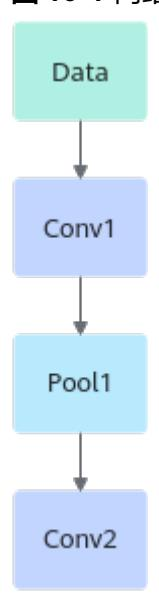

## 算子类型(**Type**)

网络中每一个算子根据算子类型进行算子实现的匹配,相同类型的算子的实现逻辑相 同。在一个网络中同一类型的算子可能存在多个,例如上图中的Conv1算子与Conv2算 子的类型都为Convolution。

## 张量(**Tensor**)

Tensor是算子计算数据的容器,TensorDesc(Tensor描述符)是对Tensor中数据的描 述。TensorDesc数据结构包含如下属性如表**10-2**所示。

表 **10-2** TensorDesc 属性解释

| 属性                 | 定义                                                                                                                                         |
|--------------------|--------------------------------------------------------------------------------------------------------------------------------------------|
| 名称(name)           | 用于对Tensor进行索引,不同Tensor的name需要保持唯<br>一。                                                                                                     |
| 形状(shape)          | Tensor的形状,比如(10, )或者(1024, 1024)或者(2, 3, 4)<br>等。如形状(3, 4)表示第一维有3个元素,第二维有4个元<br>素,(3, 4)表示一个3行4列的矩阵数组。<br>形式:(i1, i2, …, in),其中i1到in均为正整数。 |
| 数据类型(dtype)        | 指定Tensor对象的数据类型。<br>取值范围:float16, float32, int8, int16, int32, uint8,<br>uint16, bfloat16, bool等。                                          |
| 数据排布格式<br>(format) | 数据的物理排布格式,详细请参见10.2.2 数据排布格式。                                                                                                              |

## 形状(**Shape**)

张量的形状,以(D0, D1, … ,Dn-1)的形式表示,D0到Dn是任意的正整数。

如形状(3,4)表示第一维有3个元素,第二维有4个元素,(3,4)表示一个3行4列的矩阵数 组。

形状的第一个元素对应张量最外层中括号中的元素个数,形状的第二个元素对应张量 中从左边开始数第二个中括号中的元素个数,依此类推。例如:

| 张量                                 | 形状        | 描述          |
|------------------------------------|-----------|-------------|
| 1                                  | (0,)      | 0维张量,也是一个标量 |
| [1,2,3]                            | (3,)      | 1维张量        |
| [[1,2],[3,4]]                      | (2, 2)    | 2维张量        |
| [[[1,2],[3,4]], [[5,6],<br>[7,8]]] | (2, 2, 2) | 3维张量        |

物理含义我们应该怎么理解呢?假设我们有这样一个shape=(4, 20, 20, 3)。

假设有一些照片,每个像素点都由红/绿/蓝3色组成,即shape里面3的含义,照片的宽 和高都是20,也就是20\*20=400个像素,总共有4张的照片,这就是shape=(4, 20, 20, 3)的物理含义。

图 **10-2** 示意图


如果体现在编程上,可以简单把shape理解为操作Tensor的各层循环,比如我们要对 shape=(4, 20, 20, 3)的A tensor进行操作,循环语句如下:

```
produce A {
 for (i, 0, 4) {
 for (j, 0, 20) {
 for (p, 0, 20) {
 for (q, 0, 3) {
 A[((((((i*20) + j)*20) + p)*3) + q)] = a_tensor[((((((i*20) + j)*20) + p)*3) + q)]
 }
 }
 }
 }
}
```

## <span id="page-301-0"></span>轴(**axis**)

轴是相对shape来说的,轴代表张量的shape的下标,比如张量a是一个5行6列的二维 数组,即shape是(5,6),则axis=0表示是张量中的第一维,即行。axis=1表示是张量中 的第二维,即列。

例如张量数据[[[1,2],[3,4]], [[5,6],[7,8]]],Shape为(2,2,2),则轴0代表第一个维度的 数据即[[1,2],[3,4]]与[[5,6],[7,8]]这两个矩阵,轴1代表第二个维度的数据即[1,2]、 [3,4]、[5,6]、[7,8]这四个数组,轴2代表第三个维度的数据即1,2,3,4,5,6, 7,8这八个数。

轴axis可以为负数,此时表示是倒数第axis个维度。

N维Tensor的轴有:0 , 1, 2,……,N-1。

### 图 **10-3** 轴示意图

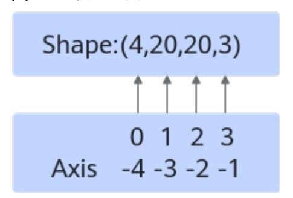

## **10.2.2** 数据排布格式

数据排布格式(Data Layout Format)是深度学习中对多维Tensor在内存中存储方式 的描述。

常见的数据格式包括ND、NHWC和NCHW等,为Tensor的每个轴赋予了特定的业务语 义。

除了上述NHWC和NCHW格式外,还存在一些特殊的数据格式,如FRACTAL\_NZ(也 简称NZ)、NC1HWC0、FRACTAL\_Z、NDC1HWC0、FRACTAL\_Z\_3D等。这些格式的 引入是为了满足AI Core中Cube计算单元的高性能计算需求,通过优化内存布局,这些 格式能够提升计算效率。在使用矩阵乘、卷积API开发相关算子的过程中,您可以看到 这些格式的具体应用。

## 普通格式

### ● **ND**、**NHWC**和**NCHW**

数据排布格式最初用于表示图像在内存中的存储方式,其中常见的包括ND、 NHWC和NCHW。在一般情况下,所有的Tensor都是N维的(ND),而NHWC和 NCHW则是为四维Tensor中的每个轴赋予了特定的业务语义,例如高度 (Height)、宽度(Width)和通道数(Channels)。

NHWC和NCHW的主要区别在于通道(Channel)维度的位置:

- NHWC格式中,通道维度位于最后一个位置。
- NCHW格式中,通道维度位于高度和宽度之前。

具体解释每个轴的含义:

– **N**:Batch数量,表示图像的数目。

- **H**:Height,图像的高度,即垂直方向的像素个数。
- **W**:Width,图像的宽度,即水平方向的像素个数。
- **C**:Channels,图像的通道数,例如彩色RGB图像的Channels为3。

如图**10-4**所示,以一张格式为RGB的图片为例,NCHW中,C排列在外层,实际存 储的是"RRRRRRGGGGGGBBBBBB",即同一通道的所有像素值顺序存储在一 起;而NHWC中C排列在最内层,实际存储的则是

"RGBRGBRGBRGBRGBRGB",即多个通道的同一位置的像素值顺序存储在一 起。

图 **10-4** NCHW 和 NHWC 存储示例

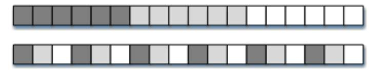

尽管存储的数据相同,但不同的存储顺序会导致数据的访问特性不一致,因此即 便进行同样的运算,相应的计算性能也会不同。

### ● **NDHWC**和**NCDHW**

NDHWC和NCDHW是五维Tensor,较NHWC和NCHW多了一个D的维度,D代表 特征深度(Depth),表示数据在深度方向上的扩展,如视频的时间步或医学图 像的深度层,因此该类格式便于在时间维度上进行卷积操作。以NDHWC为例, 其数据格式如下图所示:

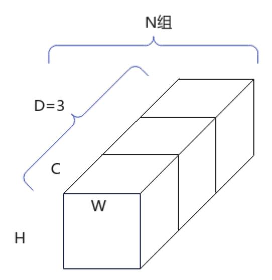

## 矩阵乘相关特殊格式

使用Mmad基础API进行矩阵乘计算时,对矩阵输入输出的数据排布格式有一定的要 求,如下图所示,要求A矩阵(位于L0A Buffer)为FRACTAL\_ZZ,B矩阵(位于L0B Buffer)为FRACTAL\_ZN,C矩阵(位于L0C Buffer)为FRACTAL\_NZ。这些格式将矩 阵划分成了一些分形(Fractal Matrix),适配Cube计算单元每次读取(16, 16)× (16, 16) 的数据进行计算的硬件特点(以half数据类型为例),从而提高矩阵计算的效率。 分形的大小和数据类型有关,也和所在的存储位置有关,具体可参见下文的详细介 绍。

<span id="page-303-0"></span>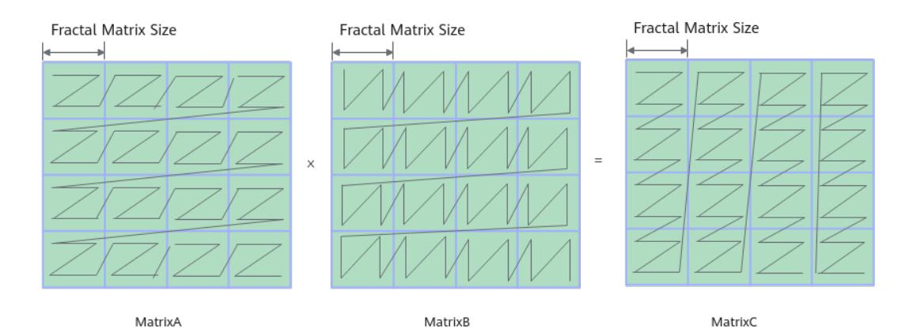

### ● **FRACTAL\_NZ/NZ**

FRACTAL\_NZ格式,简称NZ格式,是对一个Tensor最低两维(一个Tensor的所有 维度,右侧为低维,左侧为高维)进行填充(pad)、拆分(reshape)和转置 (transpose)操作后得到的格式。具体的转换过程如下:

(M,N)大小的矩阵被分为M1 \* N1个分形,按照column major(列优先)排布, 形状如N字形;每个分形内部有M0 \* N0个元素,按照row major(行优先)排 布,形状如Z字形,所以这种数据格式称为NZ格式。其中,(M0, N0)表示一个分 形的大小。

### 通过公式表达为:

(…, B, M, N)->pad->(…, B, M1 \* M0, N1 \* N0)->reshape->(…, B, M1, M0, N1, N0)->transpose->(…, B, N1, M1, M0, N0)

### 说明

通常情况下,NZ格式在L0C Buffer和L1 Buffer中分别用于不同的场景:

- 在L0C Buffer中,NZ格式用于存储矩阵乘法的结果。其分形形状为16x16,包含256个 元素,这种结构非常适合Cube计算单元进行高效的矩阵乘法运算。
- 在L1 Buffer中,NZ格式被采用以便于将数据搬运到L0A Buffer和L0B Buffer时,能够 方便地转换为对应的ZZ和ZN格式。此时,分形形状为16 x (32B / sizeof(Datatype)), 大小为512Byte。

因此,当数据从L0C Buffer搬运到L1 Buffer时,其分形大小可能会发生变化。

下面通过一个具体的例子来了解ND格式转换为NZ格式的过程。

### 原始Tensor的Shape为(2, 2, 28):

```
data = [x for x in range(2 * 2 * 28)]
data_a = data * np.ones((2 * 2 * 28), dtype="float16")
tensor_a = data_a.reshape((2, 2, 28))
print(tensor_a)
```

### 原始Tensor数据打印如下:

[[[ 0. 1. 2. 3. 4. 5. 6. 7. 8. 9. 10. 11. 12. 13. 14. 15. 16. 17. 18. 19. 20. 21. 22. 23. 24. 25. 26. 27.] [ 28. 29. 30. 31. 32. 33. 34. 35. 36. 37. 38. 39. 40. 41. 42. 43. 44. 45. 46. 47. 48. 49. 50. 51. 52. 53. 54. 55.]]

[[ 56. 57. 58. 59. 60. 61. 62. 63. 64. 65. 66. 67. 68. 69. 70. 71. 72. 73. 74. 75. 76. 77. 78. 79. 80. 81. 82. 83.]

[ 84. 85. 86. 87. 88. 89. 90. 91. 92. 93. 94. 95. 96. 97. 98. 99. 100. 101. 102. 103. 104.105. 106. 107. 108. 109. 110. 111.]]]

### 转换过程通过伪代码表达如下:

```
N0 = 16
N1 = (28 + N0 - 1) // N0
pad_n = N1 * N0 - 28
M0 = 16
M1 = (28 + N0 - 1) // M0
pad_m = M1 * M0 - 2
```

tensor\_b = np.pad(tensor\_a, [[0, 0], [0, pad\_m], [0, pad\_n]]) tensor\_b = tensor\_b.reshape((2, M1, M0, N1, N0)) tensor\_b = tensor\_b.transpose((0, 3, 1, 2, 4)) print(tensor\_b)

转换过程示意图如下:(仅对后两维数据中的一组进行呈现)

| 44127 | ユリエハヽ | VEN END | ч. |    | ייו דורני | 3=EXX. | и <b>п</b> . Г.Н. | ם= נ | <u>ντ</u> η υ = | E-20 / |    |    |    |    |    |         |
|-------|-------|---------|----|----|-----------|--------|-------------------|------|-----------------|--------|----|----|----|----|----|---------|
| 0     | 1     | 2       | 3  | 4  |           | 11     | 12                | 13   | 14              | 15     | 16 | 17 | 18 | 19 | 20 |         |
| 28    | 29    | 30      | 31 | 32 |           | 39     | 40                | 41   | 42              | 43     | 44 | 45 | 46 | 47 | 48 |         |
| 0     | 0     | 0       | 0  | 0  |           | 0      | 0                 | 0    | 0               | 0      | o  | 0  | 0  | 0  | 0  |         |
| 0     | 0     | 0       | 0  | 0  |           | 0      | 0                 | 0    | 0               | 0      | 0  | 0  | 0  | 0  | 0  |         |
| 0     | 0     | 0       | 0  | 0  |           | 0      | 0                 | 0    | 0               | 0      | 0  | 0  | 0  | 0  | 0  |         |
|       |       |         |    |    | /         |        |                   |      |                 |        |    |    |    |    |    |         |
| o     | 0     | 0       | 0  | 0  |           | 0      | 0                 | 0    | 0               | 0      | 0  | 0  | 0  | 0  | 0  |         |
| 0     | 0     | 0       | 0  | 0  |           | 0      | 0                 | 0    | 0               | 0      | 0  | 0  | 0  | 0  | 0  |         |
| 0     | 0     | 0       | 0  | 0  |           | 0      | 0                 | 0    | 0               | 0      | 0  | 0  | 0  | 0  | 0  |         |
| 0     | 9     | 0       | 0  | 0  |           | 0      | 0                 | 0    | 0               | 0      | o  | 0  | 0  | 0  | 0  |         |
| _0    | 0     | 0       | 0  | 0  |           | 0      | 0                 | 0    | 0               | 0      | 9_ | 0  | 0  | 0  | 0  |         |
| 0     | 0     | 0       | -0 | 0  |           | 0      | 0                 | 0    | 0               | 0      | 0  | 0  | 0  | 0  | U  |         |
| o     | 0     | 0       | 0  | 0  |           | 0      | 0                 | 0    | 0               | 0      | 0  | 0  | 0  | 0  | 0  |         |
| 0     | 0     | 0       | 0  | 0  |           | 0      | 0                 | 0    | 0               | 0      | 0  | 0  | 0  | 0  | 0  |         |
| 0     | 0     | o       | 0  | 0  |           | 0      | 0                 | 0    | 0               | 0      | 0  | 0  | 0  | 0  | 0  |         |
| 0     | 0     | 0       | 0  | 0  |           | 0      | 0                 | 0    | 0               | 0      | 0  | 0  | 0  | 0  | 0  |         |
|       |       |         |    |    | /         |        |                   |      |                 |        |    |    |    |    |    |         |
| 0     | 0     | 0       | 0  | 0  |           | 0      | 0                 | 0    | 0               | 0      | 0  | 0  | 0  | 0  | 0  | <b></b> |
| 0     | 0     | 0       | 0  | 0  |           | 0      | 0                 | 0    | 0               | 0      | 0  | 0  | 0  | 0  | 0  |         |
| 0     | 0     | 0       | 0  | 0  |           | 0      | 0                 | 0    | 0               | 0      | 0  | 0  | 0  | 0  | 0  |         |
| 0     | 0     | 0       | 0  | 0  |           | 0      | 0                 | 0    | 0               | 0      | 0  | 0  | 0  | 0  | 0  |         |
| 8     | 0     | 0       | 0  | 0  |           | 0      | 0                 | 0    | 0               | 0      | 0_ | 0  | 0  | 0  | 0  |         |
|       |       |         |    |    |           |        |                   |      |                 |        |    |    |    |    |    |         |

### 转换后Tensor打印如下:

```
[[[[[ 0. 1. 2. 3. 4. 5. 6. 7. 8. 9. 10. 11. 12. 13. 14. 15.]
[ 28. 29. 30. 31. 32. 33. 34. 35. 36. 37. 38. 39. 40. 41. 42. 43.]
[ 0. 0. 0. 0. 0. 0. 0. 0. 0. 0. 0. 0. 0. 0. 0. 0.]
[ 0. 0. 0. 0. 0. 0. 0. 0. 0. 0. 0. 0. 0. 0. 0. 0.]
[ 0. 0. 0. 0. 0. 0. 0. 0. 0. 0. 0. 0. 0. 0. 0. 0.]
[ 0. 0. 0. 0. 0. 0. 0. 0. 0. 0. 0. 0. 0. 0. 0. 0.]
[ 0. 0. 0. 0. 0. 0. 0. 0. 0. 0. 0. 0. 0. 0. 0. 0.]
[ 0. 0. 0. 0. 0. 0. 0. 0. 0. 0. 0. 0. 0. 0. 0. 0.]
[ 0. 0. 0. 0. 0. 0. 0. 0. 0. 0. 0. 0. 0. 0. 0. 0.]
[ 0. 0. 0. 0. 0. 0. 0. 0. 0. 0. 0. 0. 0. 0. 0. 0.]
[ 0. 0. 0. 0. 0. 0. 0. 0. 0. 0. 0. 0. 0. 0. 0. 0.]
[ 0. 0. 0. 0. 0. 0. 0. 0. 0. 0. 0. 0. 0. 0. 0. 0.]
[ 0. 0. 0. 0. 0. 0. 0. 0. 0. 0. 0. 0. 0. 0. 0. 0.]
[ 0. 0. 0. 0. 0. 0. 0. 0. 0. 0. 0. 0. 0. 0. 0. 0.]
[ 0. 0. 0. 0. 0. 0. 0. 0. 0. 0. 0. 0. 0. 0. 0. 0.]
[ 0. 0. 0. 0. 0. 0. 0. 0. 0. 0. 0. 0. 0. 0. 0. 0.]]
[[ 0. 0. 0. 0. 0. 0. 0. 0. 0. 0. 0. 0. 0. 0. 0. 0.]
[ 0. 0. 0. 0. 0. 0. 0. 0. 0. 0. 0. 0. 0. 0. 0. 0.]
[ 0. 0. 0. 0. 0. 0. 0. 0. 0. 0. 0. 0. 0. 0. 0. 0.]
```

```
[ 0. 0. 0. 0. 0. 0. 0. 0. 0. 0. 0. 0. 0. 0. 0. 0.]
[ 0. 0. 0. 0. 0. 0. 0. 0. 0. 0. 0. 0. 0. 0. 0. 0.]
[ 0. 0. 0. 0. 0. 0. 0. 0. 0. 0. 0. 0. 0. 0. 0. 0.]
[ 0. 0. 0. 0. 0. 0. 0. 0. 0. 0. 0. 0. 0. 0. 0. 0.]
[ 0. 0. 0. 0. 0. 0. 0. 0. 0. 0. 0. 0. 0. 0. 0. 0.]
[ 0. 0. 0. 0. 0. 0. 0. 0. 0. 0. 0. 0. 0. 0. 0. 0.]
[ 0. 0. 0. 0. 0. 0. 0. 0. 0. 0. 0. 0. 0. 0. 0. 0.]
[ 0. 0. 0. 0. 0. 0. 0. 0. 0. 0. 0. 0. 0. 0. 0. 0.]
[ 0. 0. 0. 0. 0. 0. 0. 0. 0. 0. 0. 0. 0. 0. 0. 0.]
[ 0. 0. 0. 0. 0. 0. 0. 0. 0. 0. 0. 0. 0. 0. 0. 0.]
[ 0. 0. 0. 0. 0. 0. 0. 0. 0. 0. 0. 0. 0. 0. 0. 0.]
[ 0. 0. 0. 0. 0. 0. 0. 0. 0. 0. 0. 0. 0. 0. 0. 0.]
[ 0. 0. 0. 0. 0. 0. 0. 0. 0. 0. 0. 0. 0. 0. 0. 0.]]]
[[[ 16. 17. 18. 19. 20. 21. 22. 23. 24. 25. 26. 27. 0. 0. 0. 0.]
[ 44. 45. 46. 47. 48. 49. 50. 51. 52. 53. 54. 55. 0. 0. 0. 0.]
[ 0. 0. 0. 0. 0. 0. 0. 0. 0. 0. 0. 0. 0. 0. 0. 0.]
[ 0. 0. 0. 0. 0. 0. 0. 0. 0. 0. 0. 0. 0. 0. 0. 0.]
[ 0. 0. 0. 0. 0. 0. 0. 0. 0. 0. 0. 0. 0. 0. 0. 0.]
[ 0. 0. 0. 0. 0. 0. 0. 0. 0. 0. 0. 0. 0. 0. 0. 0.]
[ 0. 0. 0. 0. 0. 0. 0. 0. 0. 0. 0. 0. 0. 0. 0. 0.]
[ 0. 0. 0. 0. 0. 0. 0. 0. 0. 0. 0. 0. 0. 0. 0. 0.]
[ 0. 0. 0. 0. 0. 0. 0. 0. 0. 0. 0. 0. 0. 0. 0. 0.]
[ 0. 0. 0. 0. 0. 0. 0. 0. 0. 0. 0. 0. 0. 0. 0. 0.]
[ 0. 0. 0. 0. 0. 0. 0. 0. 0. 0. 0. 0. 0. 0. 0. 0.]
[ 0. 0. 0. 0. 0. 0. 0. 0. 0. 0. 0. 0. 0. 0. 0. 0.]
[ 0. 0. 0. 0. 0. 0. 0. 0. 0. 0. 0. 0. 0. 0. 0. 0.]
[ 0. 0. 0. 0. 0. 0. 0. 0. 0. 0. 0. 0. 0. 0. 0. 0.]
[ 0. 0. 0. 0. 0. 0. 0. 0. 0. 0. 0. 0. 0. 0. 0. 0.]
[ 0. 0. 0. 0. 0. 0. 0. 0. 0. 0. 0. 0. 0. 0. 0. 0.]]
[[ 0. 0. 0. 0. 0. 0. 0. 0. 0. 0. 0. 0. 0. 0. 0. 0.]
[ 0. 0. 0. 0. 0. 0. 0. 0. 0. 0. 0. 0. 0. 0. 0. 0.]
[ 0. 0. 0. 0. 0. 0. 0. 0. 0. 0. 0. 0. 0. 0. 0. 0.]
[ 0. 0. 0. 0. 0. 0. 0. 0. 0. 0. 0. 0. 0. 0. 0. 0.]
[ 0. 0. 0. 0. 0. 0. 0. 0. 0. 0. 0. 0. 0. 0. 0. 0.]
[ 0. 0. 0. 0. 0. 0. 0. 0. 0. 0. 0. 0. 0. 0. 0. 0.]
[ 0. 0. 0. 0. 0. 0. 0. 0. 0. 0. 0. 0. 0. 0. 0. 0.]
[ 0. 0. 0. 0. 0. 0. 0. 0. 0. 0. 0. 0. 0. 0. 0. 0.]
[ 0. 0. 0. 0. 0. 0. 0. 0. 0. 0. 0. 0. 0. 0. 0. 0.]
[ 0. 0. 0. 0. 0. 0. 0. 0. 0. 0. 0. 0. 0. 0. 0. 0.]
[ 0. 0. 0. 0. 0. 0. 0. 0. 0. 0. 0. 0. 0. 0. 0. 0.]
[ 0. 0. 0. 0. 0. 0. 0. 0. 0. 0. 0. 0. 0. 0. 0. 0.]
[ 0. 0. 0. 0. 0. 0. 0. 0. 0. 0. 0. 0. 0. 0. 0. 0.]
[ 0. 0. 0. 0. 0. 0. 0. 0. 0. 0. 0. 0. 0. 0. 0. 0.]
[ 0. 0. 0. 0. 0. 0. 0. 0. 0. 0. 0. 0. 0. 0. 0. 0.]
[ 0. 0. 0. 0. 0. 0. 0. 0. 0. 0. 0. 0. 0. 0. 0. 0.]]]]
[[[[ 56. 57. 58. 59. 60. 61. 62. 63. 64. 65. 66. 67. 68. 69. 70. 71.]
[ 84. 85. 86. 87. 88. 89. 90. 91. 92. 93. 94. 95. 96. 97. 98. 99.]
[ 0. 0. 0. 0. 0. 0. 0. 0. 0. 0. 0. 0. 0. 0. 0. 0.]
[ 0. 0. 0. 0. 0. 0. 0. 0. 0. 0. 0. 0. 0. 0. 0. 0.]
[ 0. 0. 0. 0. 0. 0. 0. 0. 0. 0. 0. 0. 0. 0. 0. 0.]
[ 0. 0. 0. 0. 0. 0. 0. 0. 0. 0. 0. 0. 0. 0. 0. 0.]
[ 0. 0. 0. 0. 0. 0. 0. 0. 0. 0. 0. 0. 0. 0. 0. 0.]
[ 0. 0. 0. 0. 0. 0. 0. 0. 0. 0. 0. 0. 0. 0. 0. 0.]
[ 0. 0. 0. 0. 0. 0. 0. 0. 0. 0. 0. 0. 0. 0. 0. 0.]
[ 0. 0. 0. 0. 0. 0. 0. 0. 0. 0. 0. 0. 0. 0. 0. 0.]
[ 0. 0. 0. 0. 0. 0. 0. 0. 0. 0. 0. 0. 0. 0. 0. 0.]
[ 0. 0. 0. 0. 0. 0. 0. 0. 0. 0. 0. 0. 0. 0. 0. 0.]
[ 0. 0. 0. 0. 0. 0. 0. 0. 0. 0. 0. 0. 0. 0. 0. 0.]
[ 0. 0. 0. 0. 0. 0. 0. 0. 0. 0. 0. 0. 0. 0. 0. 0.]
[ 0. 0. 0. 0. 0. 0. 0. 0. 0. 0. 0. 0. 0. 0. 0. 0.]
[ 0. 0. 0. 0. 0. 0. 0. 0. 0. 0. 0. 0. 0. 0. 0. 0.]]
[[ 0. 0. 0. 0. 0. 0. 0. 0. 0. 0. 0. 0. 0. 0. 0. 0.]
[ 0. 0. 0. 0. 0. 0. 0. 0. 0. 0. 0. 0. 0. 0. 0. 0.]
[ 0. 0. 0. 0. 0. 0. 0. 0. 0. 0. 0. 0. 0. 0. 0. 0.]
[ 0. 0. 0. 0. 0. 0. 0. 0. 0. 0. 0. 0. 0. 0. 0. 0.]
[ 0. 0. 0. 0. 0. 0. 0. 0. 0. 0. 0. 0. 0. 0. 0. 0.]
[ 0. 0. 0. 0. 0. 0. 0. 0. 0. 0. 0. 0. 0. 0. 0. 0.]
[ 0. 0. 0. 0. 0. 0. 0. 0. 0. 0. 0. 0. 0. 0. 0. 0.]
[ 0. 0. 0. 0. 0. 0. 0. 0. 0. 0. 0. 0. 0. 0. 0. 0.]
```

```
[ 0. 0. 0. 0. 0. 0. 0. 0. 0. 0. 0. 0. 0. 0. 0. 0.]
[ 0. 0. 0. 0. 0. 0. 0. 0. 0. 0. 0. 0. 0. 0. 0. 0.]
[ 0. 0. 0. 0. 0. 0. 0. 0. 0. 0. 0. 0. 0. 0. 0. 0.]
[ 0. 0. 0. 0. 0. 0. 0. 0. 0. 0. 0. 0. 0. 0. 0. 0.]
[ 0. 0. 0. 0. 0. 0. 0. 0. 0. 0. 0. 0. 0. 0. 0. 0.]
[ 0. 0. 0. 0. 0. 0. 0. 0. 0. 0. 0. 0. 0. 0. 0. 0.]
[ 0. 0. 0. 0. 0. 0. 0. 0. 0. 0. 0. 0. 0. 0. 0. 0.]
[ 0. 0. 0. 0. 0. 0. 0. 0. 0. 0. 0. 0. 0. 0. 0. 0.]]]
[[[ 72. 73. 74. 75. 76. 77. 78. 79. 80. 81. 82. 83. 0. 0. 0. 0.]
[100. 101. 102. 103. 104. 105. 106. 107. 108. 109. 110. 111. 0. 0. 0. 0.]
[ 0. 0. 0. 0. 0. 0. 0. 0. 0. 0. 0. 0. 0. 0. 0. 0.]
[ 0. 0. 0. 0. 0. 0. 0. 0. 0. 0. 0. 0. 0. 0. 0. 0.]
[ 0. 0. 0. 0. 0. 0. 0. 0. 0. 0. 0. 0. 0. 0. 0. 0.]
[ 0. 0. 0. 0. 0. 0. 0. 0. 0. 0. 0. 0. 0. 0. 0. 0.]
[ 0. 0. 0. 0. 0. 0. 0. 0. 0. 0. 0. 0. 0. 0. 0. 0.]
[ 0. 0. 0. 0. 0. 0. 0. 0. 0. 0. 0. 0. 0. 0. 0. 0.]
[ 0. 0. 0. 0. 0. 0. 0. 0. 0. 0. 0. 0. 0. 0. 0. 0.]
[ 0. 0. 0. 0. 0. 0. 0. 0. 0. 0. 0. 0. 0. 0. 0. 0.]
[ 0. 0. 0. 0. 0. 0. 0. 0. 0. 0. 0. 0. 0. 0. 0. 0.]
[ 0. 0. 0. 0. 0. 0. 0. 0. 0. 0. 0. 0. 0. 0. 0. 0.]
[ 0. 0. 0. 0. 0. 0. 0. 0. 0. 0. 0. 0. 0. 0. 0. 0.]
[ 0. 0. 0. 0. 0. 0. 0. 0. 0. 0. 0. 0. 0. 0. 0. 0.]
[ 0. 0. 0. 0. 0. 0. 0. 0. 0. 0. 0. 0. 0. 0. 0. 0.]
[ 0. 0. 0. 0. 0. 0. 0. 0. 0. 0. 0. 0. 0. 0. 0. 0.]]
[[ 0. 0. 0. 0. 0. 0. 0. 0. 0. 0. 0. 0. 0. 0. 0. 0.]
[ 0. 0. 0. 0. 0. 0. 0. 0. 0. 0. 0. 0. 0. 0. 0. 0.]
[ 0. 0. 0. 0. 0. 0. 0. 0. 0. 0. 0. 0. 0. 0. 0. 0.]
[ 0. 0. 0. 0. 0. 0. 0. 0. 0. 0. 0. 0. 0. 0. 0. 0.]
[ 0. 0. 0. 0. 0. 0. 0. 0. 0. 0. 0. 0. 0. 0. 0. 0.]
[ 0. 0. 0. 0. 0. 0. 0. 0. 0. 0. 0. 0. 0. 0. 0. 0.]
[ 0. 0. 0. 0. 0. 0. 0. 0. 0. 0. 0. 0. 0. 0. 0. 0.]
[ 0. 0. 0. 0. 0. 0. 0. 0. 0. 0. 0. 0. 0. 0. 0. 0.]
[ 0. 0. 0. 0. 0. 0. 0. 0. 0. 0. 0. 0. 0. 0. 0. 0.]
[ 0. 0. 0. 0. 0. 0. 0. 0. 0. 0. 0. 0. 0. 0. 0. 0.]
[ 0. 0. 0. 0. 0. 0. 0. 0. 0. 0. 0. 0. 0. 0. 0. 0.]
[ 0. 0. 0. 0. 0. 0. 0. 0. 0. 0. 0. 0. 0. 0. 0. 0.]
[ 0. 0. 0. 0. 0. 0. 0. 0. 0. 0. 0. 0. 0. 0. 0. 0.]
[ 0. 0. 0. 0. 0. 0. 0. 0. 0. 0. 0. 0. 0. 0. 0. 0.]
[ 0. 0. 0. 0. 0. 0. 0. 0. 0. 0. 0. 0. 0. 0. 0. 0.]
[ 0. 0. 0. 0. 0. 0. 0. 0. 0. 0. 0. 0. 0. 0. 0. 0.]]]]]
```

### ● **FRACTAL\_ZZ/ZZ**

FRACTAL\_NZ格式,简称ZZ格式,是对一个Tensor最低两维(一个Tensor的所有 维度,右侧为低维,左侧为高维)进行填充(pad)、拆分(reshape)和转置 (transpose)操作后得到的格式。具体转换过程如下:

(M, K)大小的矩阵被分为M1 \* K1个分形,按照row major排布,形状如Z字形; 每个分形内部有M0 \* K0个元素,按照row major排布,形状如Z字形,所以这种 数据格式称为ZZ格式。其中,(M0, K0)表示一个分形的大小,分形Shape为16 x (32B / sizeof(Datatype)),大小为512Byte。

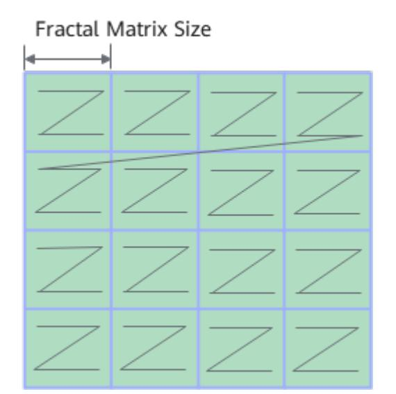

### 通过公式表达转换过程如下:

(…, B, M, K)->pad->(…, B, M1 \* M0, K1 \* K0)->reshape->(…, B, M1, M0, K1, K0)->transpose->(…, B, M1, K1, M0, K0)

### 对于不同的数据类型,M0和K0的大小不同:

- 位宽为4的数据类型:M0=16,K0=64。
- 位宽为8的数据类型:M0=16,K0=32。
- 位宽为16的数据类型:M0=16,K0=16。
- 位宽为32的数据类型,M0=16,K0=8。

### ● **FRACTAL\_ZN/ZN**

FRACTAL\_ZN格式,简称ZN格式,是对一个Tensor最低两维(一个Tensor的所有 维度,右侧为低维,左侧为高维)进行填充(pad)、拆分(reshape)和转置 (transpose)操作后得到的格式。具体转换过程如下:

(K, N)大小的矩阵被分为K1 \* N1个分形,按照row major排布,形状如Z字形;每 个分形内部有K0 \* N0个元素,按照column major排布,形状如N字形,所以这种 数据格式称为ZN格式。其中,(K0, N0)表示一个分形的大小,分形shape为 (32B / sizeof(Datatype)) x 16,大小为512Byte。

### 通过公式表达转换过程如下:

(…, B, K, N)->pad->(…, B, K1 \* K0, N1 \* N0)->reshape->(…, B, K1, K0, N1, N0)->transpose->(…, B, K1, N1, N0, K0)

### 对于不同的数据类型,K0和N0的大小不同:

- 位宽为4的数据类型:K0=16,N0=64;
- 位宽为8的数据类型:K0=16,N0=32;
- 位宽为16的数据类型:K0=16,N0=16;
- 位宽为32的数据类型:K0=16,N0=8。

### 卷积相关特殊格式

### ● **NC1HWC0**

昇腾AI处理器中,为了提高通用矩阵乘法(GEMM)运算数据块的访问效率,所 有张量数据统一采用NC1HWC0的五维数据格式。其中C0与微架构强相关,等于 AI Core中矩阵计算单元的大小。

C1=(C+C0-1)/C0。如果结果不整除,向下取整。

NHWC/NCHW -> NC1HWC0的转换过程为:将数据在C维度进行分割,变成C1 份NHWC0/NC0HW,再将C1份NHWC0/NC0HW在内存中连续排列成 NC1HWC0,其格式转换示意图如下图所示。

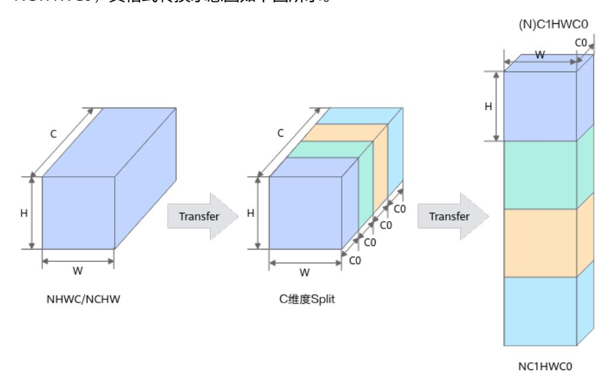

- NHWC -> NC1HWC0的转换公式如下: Tensor.reshape( [N, H, W, C1, C0]).transpose( [0, 3, 1, 2, 4] )
- NCHW -> NC1HWC0的转换公式如下: Tensor.reshape( [N, C1, C0, H, W]).transpose( [0, 1, 3, 4, 2] )

### ● **FRACTAL\_Z**

FRACTAL\_Z是用于定义卷积权重的数据格式,由FT Matrix(FT:Filter,卷积 核)变换得到。FRACTAL\_Z是送往Cube的最终数据格式,采用 "C1HW,N1,N0,C0"的4维数据排布。

数据有两层Tiling,如下图所示:

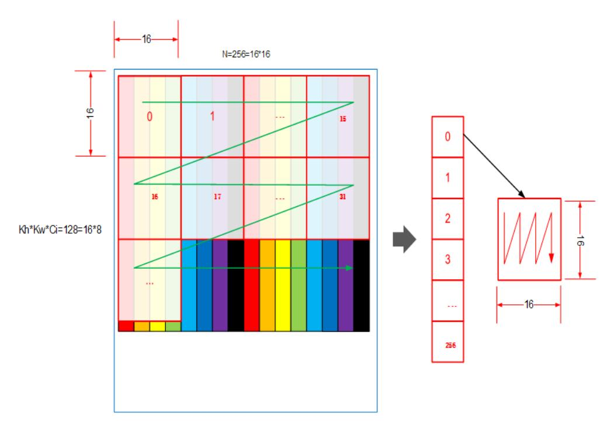

第一层与Cube的Size相关,数据按照列的方向连续(小n);第二层与矩阵的Size 相关,数据按照行的方向连续(大Z)。

例如:HWCN = (2, 2, 32, 32),将其变成FRACTAL\_Z(C1HW, N1, N0, C0) = (8, 2, 16, 16)。

### HWCN变换FRACTAL\_Z的过程为:

Tensor.padding([ [0,0], [0,0], [0,(C0-C%C0)%C0], [0,(N0-N%N0)%N0] ]).reshape( [H, W, C1, C0, N1, N0]).transpose( [2, 0, 1, 4, 5, 3] ).reshape( [C1\*H\*W, N1, N0, C0])

### NCHW变换FRACTAL\_Z的过程为:

Tensor.padding([ [0,(N0-N%N0)%N0], [0,(C0-C%C0)%C0], [0,0], [0,0] ]).reshape( [N1, N0, C1, C0, H, W,]).transpose( [2, 4, 5, 0, 1, 3] ).reshape( [C1\*H\*W, N1, N0, C0])

### ● **NDC1HWC0**

为了提高矩阵乘法运算数据块的访问效率,将NDHWC转换为NDC1HWC0格式。 其中C0与微架构强相关,等于AI Core中矩阵计算单元的大小,对于float16\_t类型 为16,对于int8\_t类型则为32,这部分数据需要连续存储。

C1=(C+C0-1)/C0。如果结果不整除,向下取整。

NDHWC -> NDC1HWC0的转换过程为:将数据在C维度进行分割,变成C1份 NDHWC0,再将C1份NDHWC0在内存中连续排列成NDC1HWC0,其格式转换示 意图如下图所示。

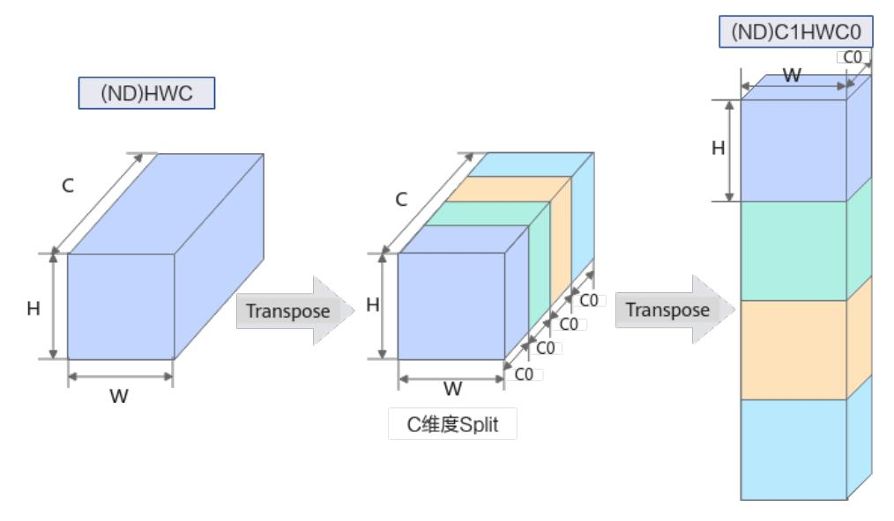

### ● **FRACTAL\_Z\_3D**

FRACTAL\_Z\_3D是3D卷积权重格式,例如Conv3D/MaxPool3D/AvgPool3D这些算 子都会涉及到用这种格式来表达3D卷积的权重。

NDHWC –> FRACTAL\_Z\_3D的变换过程通过公式表达如下:其中N=N1\*N0, C=C1\*C0

(…, N, D, H, W, C)->pad->(…, N1 \* N0, D, H, W, C1 \* C0)->reshape->(…, N1, N0, D, H, W, C1, C0)- >transpose->(D, C1, H, W, N1, N0, C0) ->(…, D \* C1 \* H \* W, N1, N0, C0)

输入一个NDHWC格式的Tensor,Shape大小为(48, 3, 3, 2, 32):

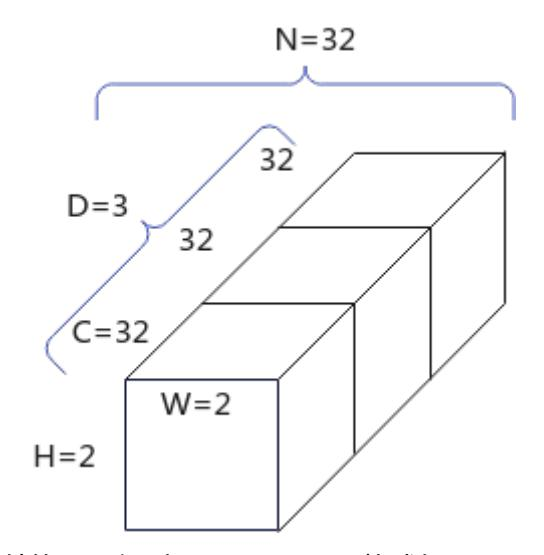

转换后,得到FRACTAL\_Z\_3D格式如下所示:

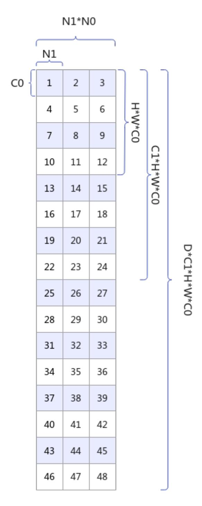

## **Matmul** 高阶 **API** 相关格式

● **BSH/SBH**:B:Batch,批处理的大小; S:sequence length,序列长度;H = N \* D,其中,N为head的数量,D为head的大小,此格式通常用于Matmul矩阵 乘。数据排布格式如下图所示:

| BSH  | (R = | = 2 | S | =2 | Н | = | 121 | ì |
|------|------|-----|---|----|---|---|-----|---|
| DJII |      |     |   |    |   | _ |     | ı |

|   |   |    |    |    |    |    | H  | 1  |    |    |    |    |    |
|---|---|----|----|----|----|----|----|----|----|----|----|----|----|
|   |   | 1  | 2  | 3  | 4  | 5  | 6  | 7  | 8  | 9  | 10 | 11 | 12 |
| D | S | 13 | 14 | 15 | 16 | 17 | 18 | 19 | 20 | 21 | 22 | 23 | 24 |
| В | S | 25 | 26 | 27 | 28 | 29 | 30 | 31 | 32 | 33 | 34 | 35 | 36 |
|   | 3 | 37 | 38 | 39 | 40 | 41 | 42 | 43 | 44 | 45 | 46 | 47 | 48 |

|   |    |    |    |    |    |    |    |    |    |    |    | В  |    |    |    |    |    |    |    |    |    |    |    |    |
|---|----|----|----|----|----|----|----|----|----|----|----|----|----|----|----|----|----|----|----|----|----|----|----|----|
|   |    |    |    |    |    | H  | ł  |    |    |    |    |    |    |    |    |    |    | ŀ  | +  |    |    |    |    |    |
| - | 1  | 2  | 3  | 4  | 5  | 6  | 7  | 8  | 9  | 10 | 11 | 12 | 13 | 14 | 15 | 16 | 17 | 18 | 19 | 20 | 21 | 22 | 23 | 24 |
| 5 | 25 | 26 | 27 | 28 | 29 | 30 | 31 | 32 | 33 | 34 | 35 | 36 | 37 | 38 | 39 | 40 | 41 | 42 | 43 | 44 | 45 | 46 | 47 | 48 |

● **BMNK**:通用数据格式,其数据排布格式如下:

|   |   |    | k  | (  |    |
|---|---|----|----|----|----|
|   |   | 1  | 2  | 3  | 4  |
|   | М | 5  | 6  | 7  | 8  |
| В |   | 9  | 10 | 11 | 12 |
| В |   | 13 | 14 | 15 | 16 |
|   | М | 17 | 18 | 19 | 20 |
|   |   | 21 | 22 | 23 | 24 |

|     |    |    |    | E  | 3  |    |    |    |
|-----|----|----|----|----|----|----|----|----|
|     |    | N  | 1  |    |    | N  | 1  |    |
|     | 1  | 2  | 17 | 18 | 19 | 20 |    |    |
| K   | 5  | 6  | 7  | 8  | 21 | 22 | 23 | 24 |
| , K | 9  | 10 | 11 | 12 | 25 | 26 | 27 | 28 |
|     | 13 | 14 | 15 | 16 | 29 | 30 | 31 | 32 |

● **BSNGD**:为原始BSH shape做reshape后的shape,S和D为单Batch的矩阵乘的M 轴(或N轴)和K轴,一个SD为一个batch的计算数据,此格式通常用于Matmul 矩阵乘,数据排布格式如下图所示:

<span id="page-313-0"></span>

|   |   |    |    |    |    |    | ١  | ١  |    |    |    |    |    |
|---|---|----|----|----|----|----|----|----|----|----|----|----|----|
|   |   |    | (  | 3  |    |    | (  | 3  |    |    | C  | j  |    |
|   |   | [  | )  | [  | )  | [  | )  | [  | )  | [  | )  | С  | )  |
|   |   | 1  | 2  | 3  | 4  | 5  | 6  | 7  | 8  | 9  | 10 | 11 | 12 |
| В | S | 13 | 14 | 15 | 16 | 17 | 18 | 19 | 20 | 21 | 22 | 23 | 24 |
| В |   | 25 | 26 | 27 | 28 | 29 | 30 | 31 | 32 | 33 | 34 | 35 | 36 |
|   | S | 37 | 38 | 39 | 40 | 41 | 42 | 43 | 44 | 45 | 46 | 47 | 48 |

● **SBNGD**:为原始SBH shape做reshape后shape,S和D为的矩阵乘的M轴(或N 轴)和K轴,一个SD为一个Batch的计算数据,此格式通常用于Matmul矩阵乘, 数据排布格式如下图所示:

|   |    |       |    |    |    |    |    |    |    |    |    | В  |    |    |    |    |    |    |    |    |    |    |    |    |
|---|----|-------|----|----|----|----|----|----|----|----|----|----|----|----|----|----|----|----|----|----|----|----|----|----|
|   |    |       |    |    |    | ١  | 1  |    |    |    |    |    |    |    |    |    |    | 1  | N  |    |    |    |    |    |
|   |    | G G G |    |    |    |    |    |    |    |    |    |    |    |    |    |    |    | (  | 3  |    |    | (  | 3  |    |
|   | -  | D     | ı  | )  | [  | )  | [  | )  | ı  | )  | [  | )  |    | D  | ı  | D  |    | D  | [  | D  | ı  | D  | ı  | D  |
|   | 1  | 2     | 3  | 4  | 5  | 6  | 7  | 8  | 9  | 10 | 11 | 12 | 13 | 14 | 15 | 16 | 17 | 18 | 19 | 20 | 21 | 22 | 23 | 24 |
| S | 25 | 26    | 27 | 28 | 29 | 30 | 31 | 32 | 33 | 34 | 35 | 36 | 37 | 38 | 39 | 40 | 41 | 42 | 43 | 44 | 45 | 46 | 47 | 48 |

● **BNGS1S2**:一般为前两种数据排布进行矩阵乘的输出,S1S2数据连续存放,一个 S1S2为一个Batch的计算数据,此格式通常用于Matmul矩阵乘,数据排布格式如 下图所示:


● **ND\_ALIGN**:ND\_ALIGN是ND数据格式的一种变换数据格式。输出矩阵乘的结果 矩阵C时,用于配置C矩阵按照N方向32字节对齐的规则进行输出。

<span id="page-314-0"></span>ND->ND\_ALIGN变换过程如下图所示,假设矩阵乘结果矩阵C的数据类型是 int32\_t,输出到VECOUT,原矩阵N方向没有32字节对齐,设置ND\_ALIGN后则在 其后补0,将其对齐到32字节。

|   | 1 | 2 | 3 | 4 | 5 | 6 | 7 |
|---|---|---|---|---|---|---|---|
|   | 1 | 2 | 3 | 4 | 5 | 6 | 7 |
|   | 1 | 2 | 3 | 4 | 5 | 6 | 7 |
|   | 1 | 2 | 3 | 4 | 5 | 6 | 7 |
| M | 1 | 2 | 3 | 4 | 5 | 6 | 7 |
|   | 1 | 2 | 3 | 4 | 5 | 6 | 7 |
|   | 1 | 2 | 3 | 4 | 5 | 6 | 7 |
|   | 1 | 2 | 3 | 4 | 5 | 6 | 7 |

● **VECTOR**:VECTOR是**[GEMV](#page-154-0)**(矩阵向量乘,General Matrix-Vector Multiply)场 景使用的一种数据格式,配置矩阵为VECTOR数据排布格式即代表输入数据是一个 向量。

### <span id="page-315-0"></span>图 **10-5** GEMV 场景输入 Vector 格式的 A 矩阵示意图

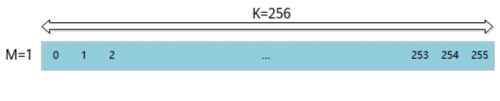

## **10.3** 硬件架构与数据处理原理

## **10.3.1** 基本架构

如下图所示,基于Ascend C开发的算子运行在AI Core上。Ascend C编程模型基于AI Core硬件架构的抽象进行介绍,了解硬件架构能够帮助开发者更好的理解编程模型; 对于需要完成高性能编程的深度开发者,更需要了解硬件架构相关知识,最佳实践中 很多内容都以本章为基础进行介绍。


AI Core负责执行标量、向量和张量相关的计算密集型算子,包括三种基础计算单元: Cube(矩阵)计算单元、Vector(向量)计算单元和Scalar(标量)计算单元,同时 还包含存储单元(包括硬件存储和用于数据搬运的搬运单元)和控制单元。硬件架构 根据Cube计算单元和Vector计算单元是否同核部署分为耦合架构和分离架构两种。如 下产品型号对应的处理器架构模式如下:

- Atlas 推理系列产品:耦合架构
- Atlas 训练系列产品:耦合架构
- Atlas A2 训练系列产品/Atlas 800I A2 推理产品/A200I A2 Box 异构组件:分离架 构
- Atlas A3 训练系列产品/Atlas A3 推理系列产品:分离架构
- Atlas 200I/500 A2 推理产品:分离架构

## 耦合架构

耦合架构是指Cube计算单元和Vector计算单元同核部署,架构图如下图所示,耦合架 构中Cube计算单元和Vector计算单元共享同一个Scalar单元,统一加载所有的代码

<span id="page-316-0"></span>段。下图中列出了计算架构中的存储单元和计算单元,箭头表示数据处理流向, MTE1/MTE2/MTE3代表搬运单元。

### 图 **10-6** 耦合架构示意图

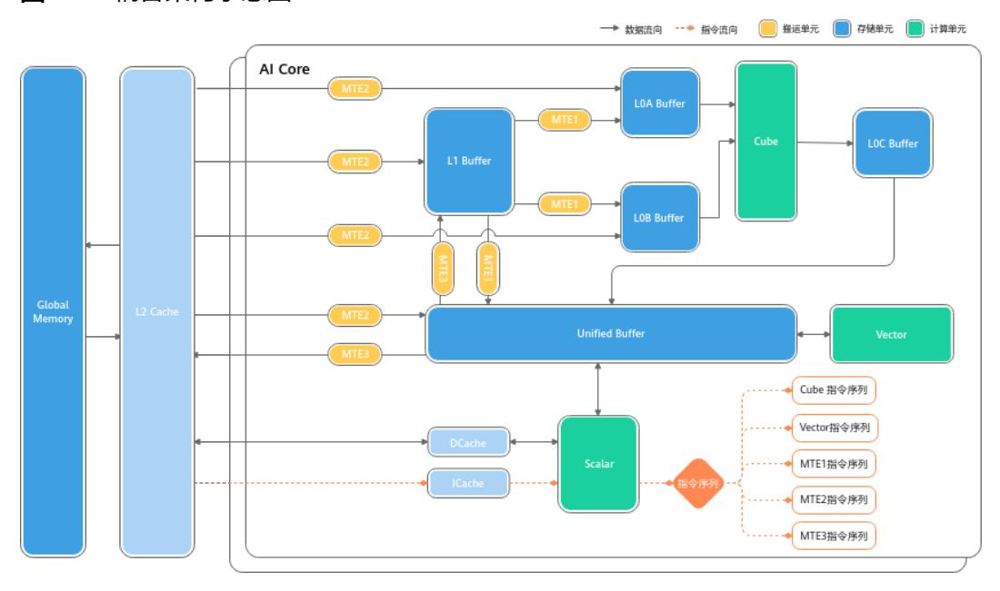

### 注:

- Atlas 训练系列产品:不支持Scalar直接读写GM数据。
- Atlas 推理系列产品:支持Scalar直接读写GM数据。

## 分离架构

如下图所示,分离架构将AI Core拆成矩阵计算(AI Cube,AIC)和向量计算(AI Vector,AIV)两个独立的核,每个核都有自己的Scalar单元,能独立加载自己的代码 段,从而实现矩阵计算与向量计算的解耦,在系统软件的统一调度下互相配合达到计 算效率优化的效果。AIV与AIC之间通过Global Memory进行数据传递。另外分离架构 相比耦合架构,增加了两个Buffer:BT Buffer(BiasTable Buffer,存放Bias)和FP Buffer(Fixpipe Buffer,存放量化参数、Relu参数等)。

### 图 **10-7** 分离架构示意图

<span id="page-317-0"></span>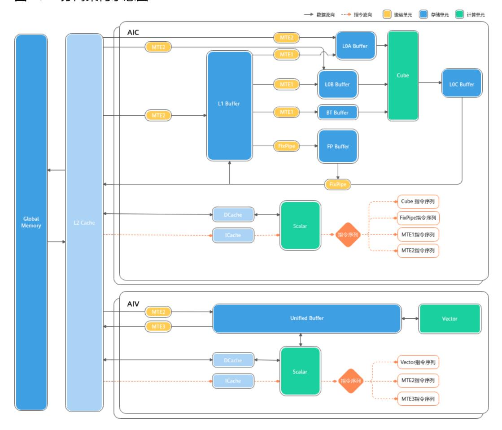

### ● AIC架构

- 包含5个并行执行单元(搬运单元和计算单元):MTE1,MTE2,Cube, Scalar,Fixpipe
- 包含7个内存单元:GM(核外),L1,L0A,L0B,L0C,BiasTable Buffer, Fixpipe Buffer

### ● AIV架构

- 包含4个并行执行单元:MTE2,MTE3,Vector,Scalar
- 包含2个内存单元:GM(核外),UB

### ● 典型计算数据流

- Vector计算:GM-UB- [Vector]-UB-GM
- Cube计算:
  - GM-L1-L0A/L0B-[Cube]-L0C-Fixpipe-GM
  - GM-L1-L0A/L0B-[Cube]-L0C-Fixpipe-L1

## **10.3.2** 计算单元

计算单元是AI Core中提供强大算力的核心单元,包括三种基础计算单元:Cube(矩 阵)计算单元、Vector(向量)计算单元和Scalar(标量)计算单元,完成AI Core中 不同类型的数据计算。

### **Scalar**

Scalar负责各类型的标量数据运算和程序的流程控制。功能上可以看做一个小CPU,完 成整个程序的循环控制、分支判断、Cube/Vector等指令的地址和参数计算以及基本的 算术运算,并且可以通过在事件同步模块中插入同步符的方式来控制AI Core中其他执 行单元的流水。相对于Host CPU,AI Core中的Scalar计算能力较弱,重点用于发射指 令,所以在实际应用场景中应尽量减少Scalar计算,比如性能调优时尽量减少if/else等 分支判断及变量运算。

如下图所示:Scalar执行标量运算指令时,执行标准的ALU(Arithmetic Logic Unit)语 句,ALU需要的代码段和数据段(栈空间)都来自于GM,ICache(Instruction Cache) 用于缓存代码段,缓存大小与硬件规格相关,比如为16K或32K,以2K为单位加载; DCache(Data Cache)用于缓存数据段,大小也与硬件规格相关,比如为16K,以 cacheline(64Byte)为单位加载。考虑到核内访问效率最高,应尽量保证代码段和数 据段被缓存在ICache和DCache,避免核外访问; 同时根据数据加载单位不同,编程时 可以考虑单次加载数据大小,来提升加载效率。例如在DCache加载数据时,当数据内 存首地址与cacheline(64Byte)对齐时,加载效率最高。

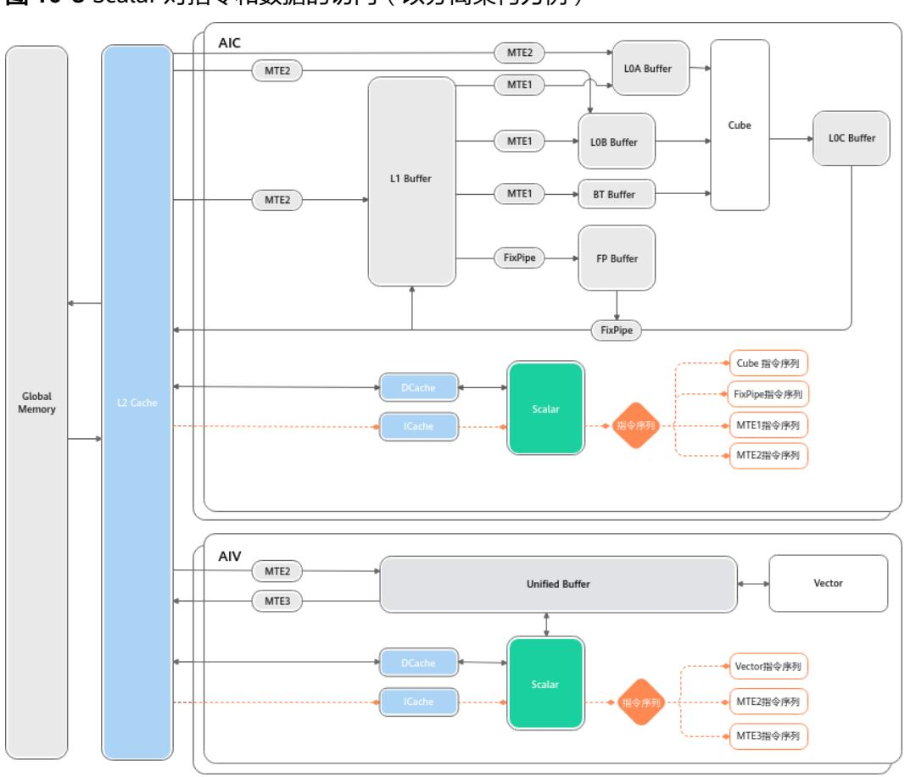

图 **10-8** Scalar 对指令和数据的访问(以分离架构为例)

### 说明

硬件提供L2Cache用于缓存访问GM的数据(包括代码段、数据段),以此加快访问速度,提高 访问效率。核外L2Cache以cacheline为单位加载数据,根据硬件规格不同,cacheline大小不同 (128/256/512Byte等)。

### **Vector**

Vector负责执行向量运算。向量计算单元执行向量指令,类似于传统的单指令多数据 (Single Instruction Multiple Data,SIMD)指令,每个向量指令可以完成多个操作 数的同一类型运算。向量计算单元可以快速完成两个FP16类型的向量相加或者相乘。 向量指令支持多次迭代执行,也支持对带有间隔的向量直接进行运算。

如下图所示,Vector所有计算的源数据以及目标数据都要求存储在**[Unified](#page-321-0) Buffer**中, Vector指令的首地址和操作长度有对齐要求,通常要求32B对齐,具体对齐要求参考 API的约束描述。

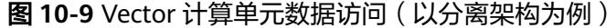

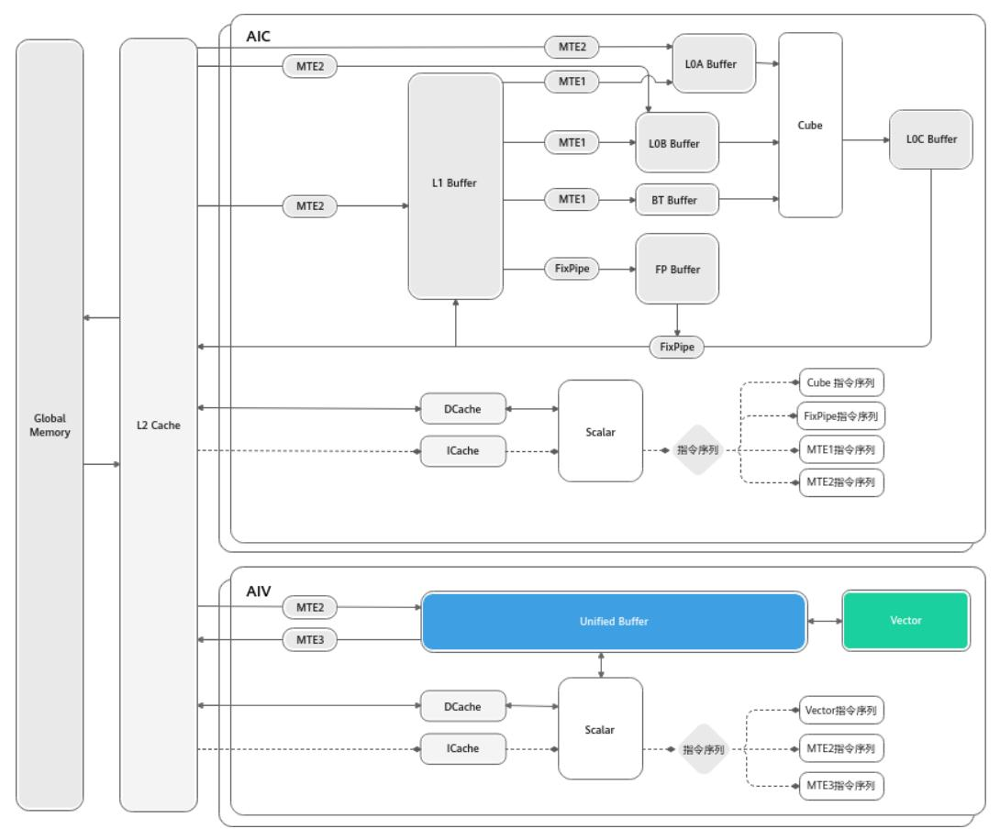

### **Cube**

Cube计算单元负责执行矩阵运算,一次执行即可完成A矩阵(M \* K)与B矩阵(K \* N)的矩阵乘。如下图所示,高亮部分为Cube计算单元及其访问的存储单元,其中L0A 存储左矩阵,L0B存储右矩阵,L0C存储矩阵乘的结果和中间结果。

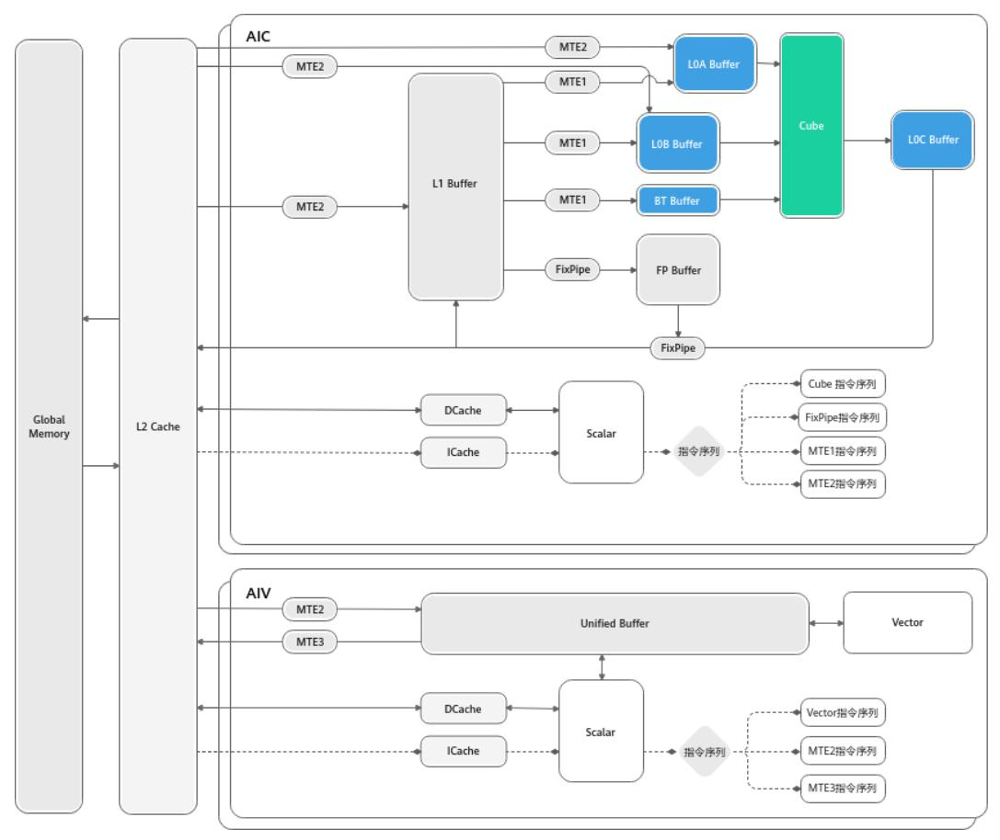

<span id="page-320-0"></span>图 **10-10** Cube 计算单元数据访问(以分离架构为例)

## **10.3.3** 存储单元

AI处理器中的计算资源要想发挥强劲算力,必要条件是保证输入数据能够及时准确地 出现在计算单元中,需要精心设计存储系统,保证计算单元所需的数据供应。

如下图所示:AI Core中包含多级内部存储,AI Core需要把外部存储中的数据加载到内 部存储中,才能完成相应的计算。AI Core的主要内部存储包括:L1 Buffer(L1缓冲 区),L0 Buffer(L0缓冲区),Unified Buffer(统一缓冲区)等。为了配合AI Core 中的数据传输和搬运,AI Core中还包含MTE(Memory Transfer Engine,存储转换引 擎)搬运单元,在搬运过程中可执行随路数据格式/类型转换。

<span id="page-321-0"></span>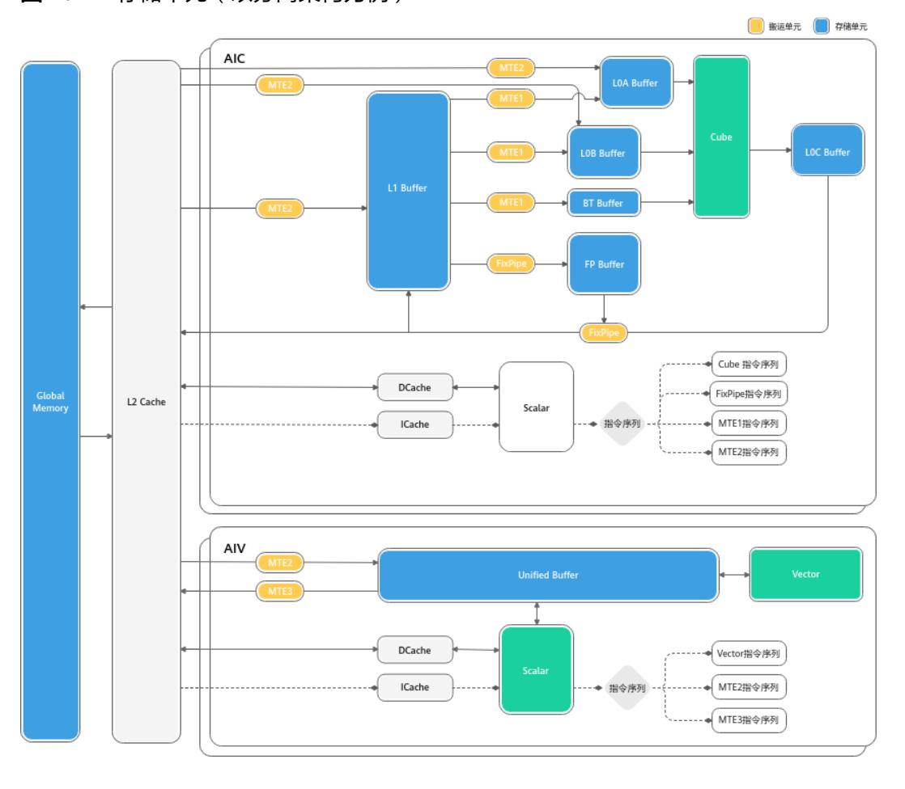

图 **10-11** 存储单元(以分离架构为例)

AI Core的内部存储列表如表**10-4**所示。

表 **10-4** 存储单元介绍

| 存储单元                       | 描述                                                                            |
|----------------------------|-------------------------------------------------------------------------------|
| L1 Buffer                  | L1缓冲区,通用内部存储,是AI Core内比较大的一块数据<br>中转区,可暂存Cube计算单元需要反复使用的一些数据从<br>而减少从总线读写的次数。 |
| L0A Buffer / L0B<br>Buffer | Cube指令的输入。                                                                    |
| L0C Buffer                 | Cube指令的输出,但进行累加计算的时候,也是输入的一<br>部分。                                            |
| Unified Buffer             | 统一缓冲区,向量和标量计算的输入和输出。                                                          |
| BT Buffer                  | BiasTable Buffer,存放Bias。                                                      |
| FP Buffer                  | Fixpipe Buffer,存放量化参数、Relu参数等。                                                |

### <span id="page-322-0"></span>表 **10-5** 搬运单元介绍

| 搬运单元    | 描述                                                                   |
|---------|----------------------------------------------------------------------|
| MTE1    | 负责如下通路的数据搬运:                                                         |
|         | ●<br>L1->L0A/L0B                                                     |
|         | ●<br>L1->UB(只有耦合架构支持)                                                |
|         | ●<br>L1->BT Buffer(只有分离架构支持)                                         |
| MTE2    | 负责如下通路的数据搬运:                                                         |
|         | ●<br>GM->{L1, L0A/B},在该通路下,基于分形大小搬运,<br>搬运时满足cacheline(512B)对齐,性能更优。 |
|         | ●<br>GM->UB,基于cacheline大小搬运性能更优。                                     |
| MTE3    | 负责如下通路的数据搬运:                                                         |
|         | ●<br>UB -> GM                                                        |
|         | ●<br>UB -> L1(只有耦合架构支持)                                              |
| FixPipe | 只有分离架构支持,负责如下通路的数据搬运,搬运过程<br>中可以完成随路数据格式/类型转换:                       |
|         | ●<br>L0C->{GM/L1}                                                    |
|         | ●<br>L1->FP Buffer                                                   |

### 说明

- 不同类型的AI处理器,存储单元大小不同,开发者可通过 **[GetCoreMemSize](#page-2247-0)**接口获取。
- 所有通过搬运单元读写GM的数据都缺省被缓存在L2Cache,以此加快访问速度,提高访问 效率。核外L2Cache以cacheline为单位加载数据,根据硬件规格不同,cacheline大小不同 (128/256/512Byte等)。

## **10.3.4** 控制单元

控制单元为整个计算过程提供了指令控制,负责整个AI Core的运行,指令的分类处理 机制如下图所示。

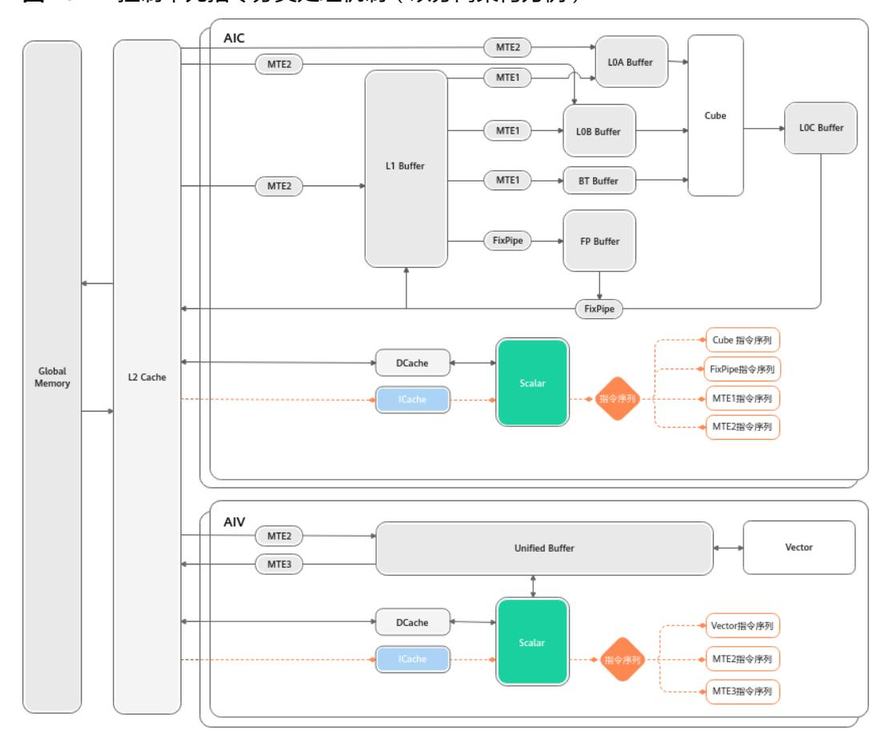

图 **10-12** 控制单元指令分类处理机制(以分离架构为例)

多条指令从系统内存通过总线接口进入到ICache(Instruction Cache)中,后续的指令执 行过程,根据指令的类型,有两种可能:

- 如果指令是Scalar指令,指令会被Scalar单元直接执行。
- 其他指令会被Scalar单元调度到独立的分类序列(Vector指令序列、Cube指令序 列、MTE1/MTE2/MTE3指令序列等),然后再被对应的执行单元执行。

同一个指令序列中的指令是按照进入指令序列的顺序执行的,不同指令序列之间可以 并行执行,通过多个指令序列的并行执行可以提升整体执行效率。对于并行执行过程 中可能出现的数据依赖,通过事件同步模块插入同步指令来控制流水线的同步,提供 PipeBarrier、SetFlag/WaitFlag两种API,保证序列内部以及序列之间按照逻辑关系执 行。

- PipeBarrier本身是一条指令,用于在序列内部约束执行顺序(虽然指令是顺序执 行,但并不意味着后一条指令开始执行时前一条指令执行结束)。PipeBarrier指 令可以保证前序指令中所有数据读写全部完成,后序指令才开始执行。
- SetFlag/WaitFlag为两条指令,在SetFlag/WaitFlag的指令中,可以指定一对指令 序列的关系,表示两个序列之间完成一组"锁"机制,其作用方式为:
  - SetFlag:当前序指令的所有读写操作都完成之后,当前指令开始执行,并将 硬件中的对应标志位设置为1。
  - WaitFlag:当执行到该指令时,如果发现对应标志位为0,该序列的后续指令 将一直被阻塞;如果发现对应标志位为1,则将对应标志位设置为0,同时后 续指令开始执行。

<span id="page-324-0"></span>Ascend C提[供同步控制](#page-1022-0)**API**,开发者可以使用这类API来自行完成同步控制。需要注意 的是,通常情况下,开发者基于**5** [编程模型](#page-76-0)中介绍的编程模型和范式进行编程时不需 要关注同步,编程模型帮助开发者完成了同步控制;使用编程模型和范式是我们推荐 的编程方式,自行同步控制可能会带来一定的编程复杂度。

但是我们仍然希望开发者可以理解同步的基本原理,便于后续更好的理解设计并行计 算程序;同时少数情况需要开发者手动插入同步,您可以通[过什么时候需要开发者手](#page-1025-0) [动插入同步](#page-1025-0)来了解具体内容。

## **10.4** 编程模型设计原理

Ascend C编程模型中,并行编程范式核心要素是:一组并行计算任务、通过队列实现 任务之间的同步、开发者自主表达对并行计算任务和资源的调度。本节介绍编程模型 的设计原理,作为扩展阅读,便于开发者更好的理解编程模型的设计思路和优势,对 于后续的深度开发也会有所帮助。

每个并行任务Stage的编程范式如下:

- 1. 获取Local Memory的内存:调用**AllocTensor**申请内存,或者从上游队列**DeQue** 一块内存数据。
- 2. 完成计算或者数据搬运。
- 3. 把上一步处理好的数据调用**EnQue**入队。
- 4. 调用**FreeTensor**释放不再需要的内存。

以最简单的矢量编程范式为例,在调用上述接口时,实际上会给各执行单元下发一些 指令,如下图所示:


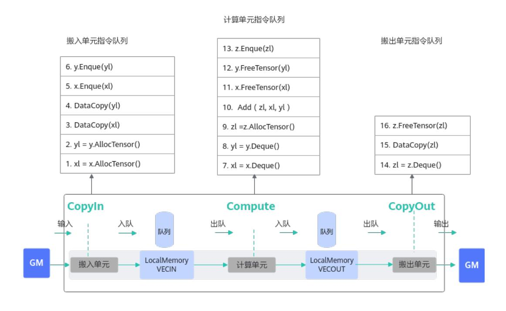

● EnQue/DeQue的具体处理流程:

- a. 标量执行单元读取算子指令序列
- b. 把这些指令发射到对应的执行单元的指令队列
- c. 各个执行单元并行执行这些指令序列
- d. EnQue/DeQue解决对内存的写后读问题
  - EnQue调用会发射同步指令set,发送信号激活wait
  - DeQue调用会发射同步指令wait,等待数据写入完成
  - wait需要等到set指令执行完成后才能执行否则阻塞

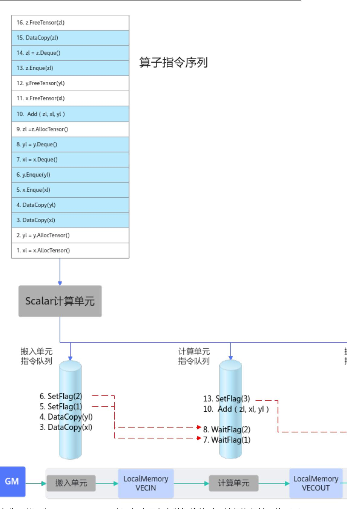

由此可以看出,EnQue/DeQue主要解决了存在数据依赖时,并行执行单元的写后 读同步控制问题。


- AllocTensor/FreeTensor的具体处理流程
  - a. 标量执行单元读取算子指令序列
  - b. 把这些指令发射到对应的执行单元的指令队列
  - c. 各个执行单元并行执行这些指令序列
  - d. AllocTensor/FreeTensor,解决对内存的读后写问题
    - AllocTensor调用会发射同步指令wait等待内存被读完成
    - FreeTensor调用会发射同步指令set,通知内存释放,可以重复写
    - wait需要等到set指令执行完成后才能执行否则阻塞

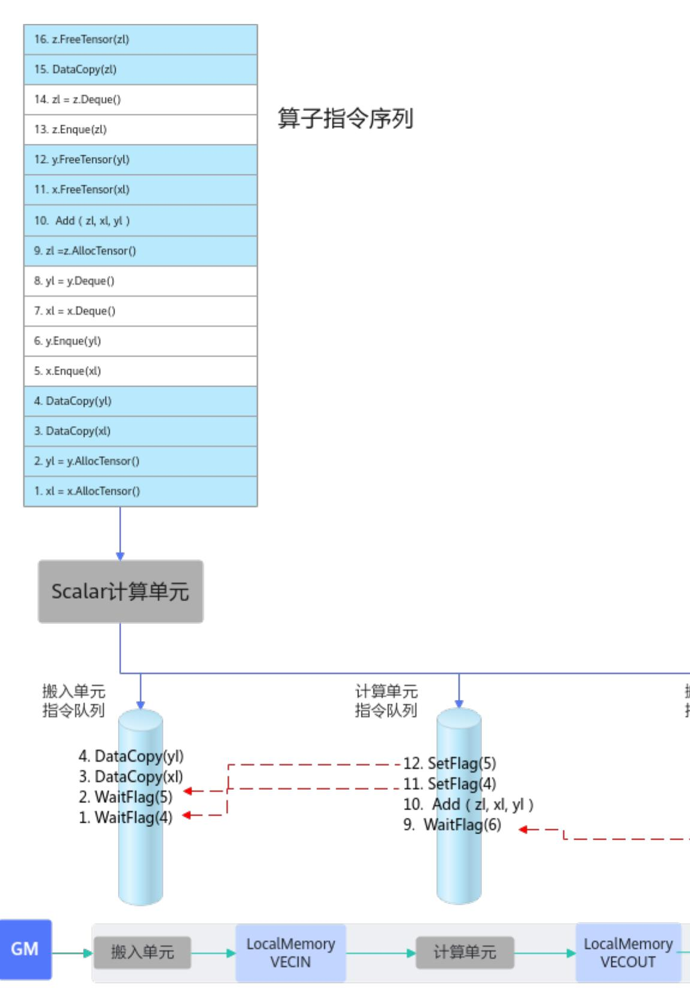

由此可以看出,AllocTensor/FreeTensor主要解决了存在数据依赖时,并行执行单 元的读后写同步控制问题。

<span id="page-329-0"></span>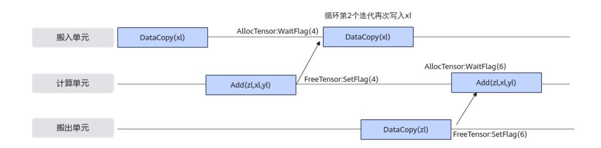

通过上文的详细说明,可以看出异步并行程序需要考虑复杂的同步控制,而Ascend C 编程模型将这些流程进行了封装,通过EnQue/DeQue/AllocTensor/FreeTensor这种开 发者熟悉的资源控制方式来体现,达到简化编程和易于理解的目的。

## **10.5** 性能优化技术原理

## **10.5.1 DoubleBuffer**

执行于AI Core上的指令队列主要包括如下几类,即Vector指令队列、Cube指令队列和 MTE指令队列。不同指令队列间的相互独立性和可并行执行性,是DoubleBuffer优化 机制的基石。

矢量计算CopyIn、CopyOut过程使用MTE指令队列(MTE2、MTE3),Compute过程 使用Vector指令队列(V),意味着CopyIn、CopyOut过程和Compute过程是可以并行 的。

如图**10-14**所示,考虑一个完整的数据搬运和计算过程,CopyIn过程将数据从Global Memory搬运到Local Memory,Vector计算单元完成计算后,经过CopyOut过程将计 算结果搬回Global Memory。

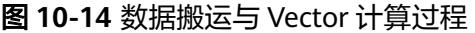

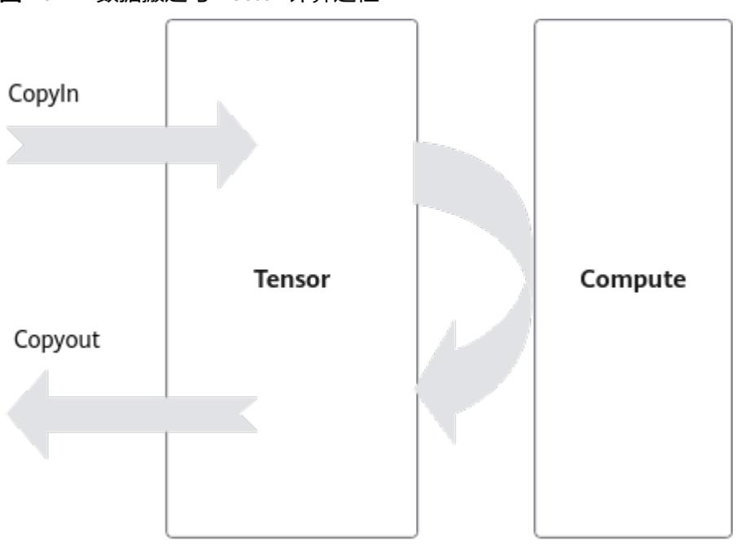

在此过程中,数据搬运与Vector计算串行执行,Vector计算单元无可避免存在资源闲置 问题。举例而言,若CopyIn、Compute、CopyOut三阶段分别耗时t,则Vector的时间 利用率仅为1/3,等待时间过长,Vector利用率严重不足。

为减少Vector等待时间,DoubleBuffer机制将待处理的数据一分为二,比如Tensor1、 Tensor2。如图**10-15**所示,当Vector对Tensor1中数据进行Compute时,Tensor2可以 执行CopyIn的过程;而当Vector切换到计算Tensor2时,Tensor1可以执行CopyOut的 过程。由此,数据的进出搬运和Vector计算实现并行执行,Vector闲置问题得以有效缓 解。

总体来说,DoubleBuffer是基于MTE指令队列与Vector指令队列的独立性和可并行 性,通过将数据搬运与Vector计算并行执行以隐藏数据搬运时间并降低Vector指令的等 待时间,最终提高Vector单元的利用效率,您可以通过为队列申请内存时设置内存块 的个数来实现数据并行,简单代码示例如下:

pipe.InitBuffer(inQueueX, 2, 256);

图 **10-15** DoubleBuffer 机制

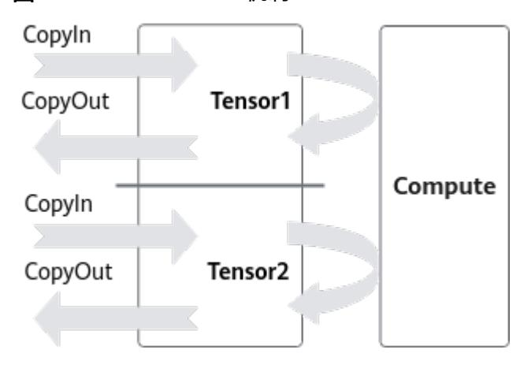

### 需要注意:

多数情况下,采用DoubleBuffer能有效提升Vector的时间利用率,缩减算子执行时 间。然而,DoubleBuffer机制缓解Vector闲置问题并不代表它总能带来整体的性能提 升。例如:

- 当数据搬运时间较短,而Vector计算时间显著较长时,由于数据搬运在整个计算 过程中的时间占比较低,DoubleBuffer机制带来的性能收益会偏小。
- 又如,当原始数据较小且Vector可一次性完成所有计算时,强行使用 DoubleBuffer会降低Vector计算资源的利用率,最终效果可能适得其反。

因此,DoubleBuffer的性能收益需综合考虑Vector算力、数据量大小、搬运与计算时 间占比等多种因素。

# **11** 常用操作

<span id="page-331-0"></span>如何开发动态输入算子

[如何在矢量编程时使能](#page-333-0)Vector Core

[如何开发通算融合算子](#page-334-0)

如何使用Tensor[高维切分计算](#page-336-0)API

[如何使用归约指令](#page-342-0)

[如何使用掩码操作](#page-344-0)API

如何使用[workspace](#page-347-0)

[如何进行](#page-348-0)Tiling调测

如何使用[SPM Buffer](#page-350-0)

[如何使用更底层编程方式提升算子性能](#page-351-0)

如何使用Tensor[原地操作提升算子性能](#page-360-0)

## **11.1** 如何开发动态输入算子

动态输入算子是指算子的输入个数是动态的,例如AddN,将N个输入tensor累加到一 起,输出一个tensor,输入tensor的个数是不固定的。动态输入算子的开发在构造和解 析输入数据方面有差异:核函数的入参采用ListTensorDesc的结构存储输入数据信息, 对应的,调用时需构造TensorList结构保存参数信息。下面基于kernel直调和工程化算 子开发两种开发方式分别介绍具体开发流程。

### 说明

下文仅列出代码片段,完整样例请参[考动态输入算子样例\(工程化算子开发\)](https://gitee.com/ascend/samples/tree/master/operator/ascendc/0_introduction/4_addn_frameworklaunch)[和动态输入算子样](https://gitee.com/ascend/samples/tree/master/operator/ascendc/0_introduction/5_addn_kernellaunch) 例(**[kernel](https://gitee.com/ascend/samples/tree/master/operator/ascendc/0_introduction/5_addn_kernellaunch)**直调)。

- kernel直调
  - 参考**[ListTensorDesc](#page-459-0)**数据结构自行定义ListTensorDesc和TensorDesc结构 体,并将实际的输入数据保存至ListTensorDesc结构中。示例如下: ptrOffset传入为ListTensorDesc首地址和数据指针首地址dataPtr之间的偏移 量,tensorDesc中保存两个输入的tensor描述信息, dataPtr传入为保存输入 数据的地址指针。

```
 constexpr uint32_t SHAPE_DIM = 2;
 struct TensorDesc {
 uint32_t dim{SHAPE_DIM};
 uint32_t index;
 uint64_t shape[SHAPE_DIM] = {8, 2048};
 };
 TensorDesc xDesc;
 xDesc.index = 0;
 TensorDesc yDesc;
 yDesc.index = 1;
 constexpr uint32_t TENSOR_DESC_NUM = 2;
 struct ListTensorDesc {
 uint64_t ptrOffset;
 TensorDesc tensorDesc[TENSOR_DESC_NUM];
 uintptr_t dataPtr[TENSOR_DESC_NUM];
 } inputDesc;
...
inputDesc = {(1 + (1 + SHAPE_DIM) * TENSOR_DESC_NUM) * sizeof(uint64_t), {xDesc, yDesc}, 
{(uintptr_t)xDevice, (uintptr_t)yDevice}};
```

– kernel侧调用时,直接传入ListTensorDesc表达的输入信息。示例如下:

```
 void *inputDescInDevice = nullptr;
 CHECK_ACL(aclrtMalloc((void **)&inputDescInDevice, sizeof(ListTensorDesc), 
ACL_MEM_MALLOC_HUGE_FIRST));
 CHECK_ACL(aclrtMemcpy(inputDescInDevice, sizeof(ListTensorDesc), &inputDesc, 
sizeof(ListTensorDesc),
 ACL_MEMCPY_HOST_TO_DEVICE));
 ACLRT_LAUNCH_KERNEL(addn_custom)(blockDim, stream, inputDescInDevice, zDevice);
```

– kernel侧算子实现,通过**[ListTensorDesc](#page-459-0)**和**[TensorDesc](#page-462-0)**提供的接口解析 ListTensorDesc输入信息,并处理。示例如下:

```
 uint64_t buf[SHAPE_DIM] = {0};
 AscendC::TensorDesc<int32_t> tensorDesc;
 tensorDesc.SetShapeAddr(buf);
 listTensorDesc.GetDesc(tensorDesc, 0);
 uint64_t totalLength = tensorDesc.GetShape(0) * tensorDesc.GetShape(1);
 __gm__ uint8_t *x = listTensorDesc.GetDataPtr<__gm__ uint8_t>(0);
 __gm__ uint8_t *y = listTensorDesc.GetDataPtr<__gm__ uint8_t>(1);
```

### ● 工程化算子开发

– 单算子调用时,构造List类型tensor并传入。

使用aclCreateTensor创建tensor后,需调用aclCreateTensorList,将创建好 的tensor组成List形式,如下所示。

inputTensorList = aclCreateTensorList(inputTensor\_.data(), inputTensor\_.size());

获取算子使用的workspace空间大小接口的入参,也需使用aclTensorList结构 参数,用来计算workspace的大小,调用示例如下。

```
// 获取算子使用的workspace空间大小
aclnnStatus aclnnAddNCustomGetWorkspaceSize(const aclTensorList *srcList, const aclTensor 
*out, uint64_t *workspaceSize, aclOpExecutor **executor);
```

– 算子原型定义中,输入数据的参数类型设置为动态,示例如下。

```
this->Input("srcList")
 .ParamType(DYNAMIC)
 .DataType({ge::DT_FLOAT16})
 .Format({ge::FORMAT_ND});
```

– host侧算子实现,获取动态输入信息的接口,需使用对应的动态接口。

例如,Tiling函数和InferShape函数中,GetDynamicInputShape接口用于获 取动态输入的shape信息,InferDataType函数中,

```
GetDynamicInputDataType接口用于获取动态输入的数据类型,示例如下。
```

```
namespace ge {
static graphStatus InferShape(gert::InferShapeContext *context)
{
```

```
 const gert::Shape *x1_shape = context->GetDynamicInputShape(0, 0);
 gert::Shape *y_shape = context->GetOutputShape(0);
 *y_shape = *x1_shape;
 return GRAPH_SUCCESS;
}
static graphStatus InferDataType(gert::InferDataTypeContext *context)
{
 const auto inputDataType = context->GetDynamicInputDataType(0, 0);
 context->SetOutputDataType(0, inputDataType);
 return ge::GRAPH_SUCCESS;
}
} // namespace ge
```

– kernel侧算子实现,入参需传入动态结构的数据,并使用 AscendC::ListTensorDesc结构做解析。

核函数入参需传入动态结构的数据,例如GM\_ADDR srcList,示例如下。

```
extern "C" __global__ __aicore__ void addn_custom(GM_ADDR srcList, GM_ADDR z, GM_ADDR 
workspace, GM_ADDR tiling)
```

对传入的参数srcList,需使用AscendC::ListTensorDesc结构做解析,得到每个 tensor的具体信息,示例如下。

```
AscendC::ListTensorDesc keyListTensorDescInit((__gm__ void*)srcList);
GM_ADDR x = (__gm__ uint8_t*)keyListTensorDescInit.GetDataPtr<__gm__ uint8_t>(0);
GM_ADDR y = (__gm__ uint8_t*)keyListTensorDescInit.GetDataPtr<__gm__ uint8_t>(1);
```

## **11.2** 如何在矢量编程时使能 **Vector Core**

针对Atlas 推理系列产品,其硬件架构除了AI Core外,还额外设置了单独的Vector Core,作为AI Core中Vector计算单元的补充,从而缓解Vector计算瓶颈。Vector Core 只包括了两种基础计算资源:向量计算单元(Vector Unit)和标量计算单元(Scalar Unit),分别用于完成向量与标量的数据计算。矢量算子开发时,使能Vector Core, 算子执行时会同时启动AI Core和Vector Core,这些核并行执行相同的核函数代码。

本节将重点介绍如何使能Atlas 推理系列产品中的Vector Core。学习本节内容之前, 建议您先熟悉[算子实现、](#page-91-0)**6.6 Kernel**[直调算子开发](#page-194-0)、**6.7** [工程化算子开发](#page-213-0)的相关内容, 掌握基于AI Core的算子端到端开发流程。在此基础上本章将重点阐述使能Vector Core 时的差异点。具体如下:

1. 完成算子kernel侧开发时,需要通过宏**[KERNEL\\_TASK\\_TYPE\\_DEFAULT](#page-1233-0)**使能 Vector Core,算子执行时会同时启动AI Core和Vector Core, 此时AI Core会当成 Vector Core使用。如下的代码样例展示了使能Vector Core的方法:

```
extern "C" __global__ __aicore__ void add_custom(__gm__ uint8_t *x, __gm__ uint8_t *y, __gm__ 
uint8_t *z, __gm__ uint8_t *workspace, __gm__ uint8_t *tiling)
 GET_TILING_DATA(tilingData, tiling);
 if (workspace == nullptr) {
 return;
 }
 GM_ADDR usr = AscendC::GetUserWorkspace(workspace);
 KernelAdd op;
 op.Init(x, y, z, tilingData.blockDim, tilingData.totalLength, tilingData.tileNum);
 KERNEL_TASK_TYPE_DEFAULT(KERNEL_TYPE_MIX_VECTOR_CORE); // 使能VectorCore
 if (TILING_KEY_IS(1)) {
 op.Process1();
 } else if (TILING_KEY_IS(2)) {
 op.Process2();
 }
 // ...
}
```

2. 完成host侧tiling开发时,设置的blockDim代表的是AI Core和Vector Core的总 数,比如用户在host侧设置blockDim为10,则会启动总数为10的AI Core和Vector <span id="page-334-0"></span>Core;为保证启动Vector Core,设置数值应大于AI Core的核数。您可以通过 **[GetCoreNumAic](#page-2244-0)**接口获取AI Core的核数, **[GetCoreNumVector](#page-2246-0)**接口获取Vector Core的核数。 如下代码片段,分别为使用kernel直调工程和自定义算子工程时的 设置样例,此处设置为AI Core和Vector Core的总和,表示所有AI Core和Vector Core都启动。

– kernel直调工程

```
auto ascendcPlatform = platform_ascendc::PlatformAscendCManager::GetInstance();
auto totalCoreNum = ascendcPlatform.GetCoreNumAic();
// ASCENDXXX请替换为实际的版本型号
if (ascendcPlatform.GetSocVersion() == platform_ascendc::SocVersion::ASCENDXXX) {
 totalCoreNum = totalCoreNum + ascendcPlatform.GetCoreNumVector();
}
...
kernel_name<<<totalCoreNum , l2ctrl, stream>>>(argument list);
```

– 自定义算子工程

```
// 配套的host侧tiling函数示例:
ge::graphStatus TilingFunc(gert::TilingContext* context)
{ 
 // 使能VectorCore,将blockDim置为AI Core中vector核数 + Vector Core中的vector核数
 auto ascendcPlatform = platform_ascendc::PlatformAscendC(platformInfo);
 auto totalCoreNum = ascendcPlatform.GetCoreNumAic();
 // ASCENDXXX请替换为实际的版本型号
 if (ascendcPlatform.GetSocVersion() == platform_ascendc::SocVersion::ASCENDXXX) {
 totalCoreNum = totalCoreNum + ascendcPlatform.GetCoreNumVector();
 }
 context->SetBlockDim(totalCoreNum);
}
```

### 说明

- 请参考**[Ascend C API](#page-401-0)**中具体API支持的型号,来判断API接口是否支持Atlas 推理系列产品 Vector Core。
- 支持Vector Core后,因为AI Core和Vector Core会分别执行,通过不同的任务进行调度,所 以不支持核间同步指令,如IBSet、IBWait、SyncAll等。
- 算子计算溢出(输入inf/nan或计算结果超出范围)时,需注意AI Core和Vector Core结果表 现不一致,AI Core仅支持饱和模式,Vector Core仅支持inf/nan模式。

## **11.3** 如何开发通算融合算子

相比于一般的计算或搬运类算子,通算融合算子是融合集合通信任务和计算任务的算 子,在算子执行过程中,计算和通信任务可以部分流水并行,以便提升性能。典型的 应用场景如Matmul计算+集合通信。通算融合类算子的实现,请参考并使用**[Hccl](#page-1977-0)**高阶 API。关于更多集合通信的内容和相关概念请参考《**HCCL**[集合通信库用户指南》](https://www.hiascend.com/document/detail/zh/CANNCommunityEdition/82RC1/hccl/hcclug/hcclug_000001.html)中的 "HCCL概述"章节。

通算融合算子的开发过程与一般算子相同,但请注意,当前通算融合算子暂不支持 **[Kernel](#page-198-0)**直调和入图(**GE**[图\)开发。](#page-256-0)

## 算子原型定义

相比于一般算子,通算融合算子在实[现算子原型定义](#page-217-0)时,有如下约束:

- 必须定义一个表示算子通信域名称的属性。通信域是集合通信执行的上下文,管 理对应的通信实体(例如一个NPU就是一个通信实体)和通信所需的资源。
- 必须通过**[MC2](#page-2172-0)**接口注册该算子为通算融合算子,并通过**[HcclGroup](#page-2213-0)**接口配置该算 子的通信域名称。

以算子属性"group"为例,"group"为该算子的通信域名称,在算子原型定义中,调用 方式如下:

this->Attr("group").AttrType(REQUIRED).String(); // "group"为通算融合算子的属性,表示通信域名称 ... this->MC2().HcclGroup("group"); // 将"group"配置为该算子的通信域

## 重执行

为避免执行通信任务的环境中硬件闪断导致发生通信中断,通算融合算子可通过配置 编译宏与环境变量,开启重执行能力。通算融合算子开启重执行后,AI CPU在检测到 环境异常时,通过下图示意的机制,通知AI Core重新下发通信任务,避免由于硬件闪 断造成的通信中断,提升通信稳定性。

当前,该能力的支持情况如下:

Atlas A2 训练系列产品/Atlas 800I A2 推理产品/A200I A2 Box 异构组件不支持通算融 合算子的重执行。

Atlas A3 训练系列产品/Atlas A3 推理系列产品支持通算融合算子的重执行。

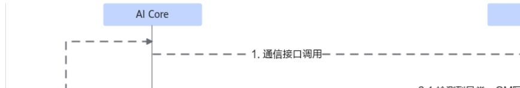

### 图 **11-1** 通信任务重执行机制

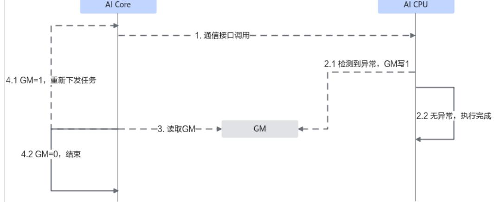

### 开启重执行的条件如下:

- 通算融合算子的输出内存地址和输入内存地址不相同。
- 算子编译时,配置编译宏AICORE\_EXCEPTION\_RESTART,如下所示。具体的编译 宏配置阶段和方式请参[考支持自定义编译选项。](#page-239-0) add\_ops\_compile\_options(ALL OPTIONS -DAICORE\_EXCEPTION\_RESTART)
- 配置HCCL重执行环境变量HCCL\_OP\_RETRY\_ENABLE,开启重执行的检测和上报 能力,该环境变量的说明请参考[《环境变量参考](https://www.hiascend.com/document/detail/zh/CANNCommunityEdition/82RC1/maintenref/envvar/envref_07_0001.html)》"执行相关 > 集合通信 > HCCL\_OP\_RETRY\_ENABLE"。请在算子执行前设置该环境变量,具体配置如下: # server内L0和server间L1均需配置为1, 不支持跨超节点,L2配置为0。 export HCCL\_OP\_RETRY\_ENABLE="L0:1, L1:1, L2:0"

注意,开启重执行后,若AI Core第一次下发通信任务后通信中断,默认只重执行 一次。若需修改重执行次数或重传间隔时间,请参考《[环境变量参考》](https://www.hiascend.com/document/detail/zh/CANNCommunityEdition/82RC1/maintenref/envvar/envref_07_0001.html)"执行相 关 > 集合通信 > HCCL\_OP\_RETRY\_PARAMS"。

## 调用示例

以AllGatherMatmul自定义算子为例,算子原型定义如下。

```
namespace ops {
 class AllGatherMatmulCustom : public OpDef {
 public:
 explicit AllGatherMatmulCustom(const char *name) : OpDef(name) {
 this->Input("x1")
 .ParamType(REQUIRED)
 .DataType({ge::DT_FLOAT16, ge::DT_BF16})
 .Format({ge::FORMAT_ND, ge::FORMAT_ND})
 .UnknownShapeFormat({ge::FORMAT_ND, ge::FORMAT_ND});
 this->Input("x2")
 .ParamType(REQUIRED)
 .DataType({ge::DT_FLOAT16, ge::DT_BF16})
 .Format({ge::FORMAT_ND, ge::FORMAT_ND})
 .UnknownShapeFormat({ge::FORMAT_ND, ge::FORMAT_ND})
 .IgnoreContiguous();
 this->Input("bias")
 .ParamType(OPTIONAL)
 .DataType({ge::DT_FLOAT16, ge::DT_BF16})
 .Format({ge::FORMAT_ND, ge::FORMAT_ND})
 .UnknownShapeFormat({ge::FORMAT_ND, ge::FORMAT_ND});
 this->Output("y")
 .ParamType(REQUIRED)
 .DataType({ge::DT_FLOAT16, ge::DT_BF16})
 .Format({ge::FORMAT_ND, ge::FORMAT_ND})
 .UnknownShapeFormat({ge::FORMAT_ND, ge::FORMAT_ND});
 this->Output("gather_out")
 .ParamType(REQUIRED)
 .DataType({ge::DT_FLOAT16, ge::DT_BF16})
 .Format({ge::FORMAT_ND, ge::FORMAT_ND})
 .UnknownShapeFormat({ge::FORMAT_ND, ge::FORMAT_ND});
 this->Attr("group").AttrType(REQUIRED).String();
 this->Attr("isTransA").AttrType(OPTIONAL).Bool(false);
 this->Attr("isTransB").AttrType(OPTIONAL).Bool(false);
 this->Attr("gatherIndex").AttrType(OPTIONAL).Int(0);
 this->Attr("commTurn").AttrType(OPTIONAL).Int(0);
 this->Attr("rank_size").AttrType(OPTIONAL).Int(8);
 this->Attr("is_gather_out").AttrType(OPTIONAL).Bool(true);
 this->AICore().SetTiling(AllGatherMatmulCustomTilingFunc);
 this->AICore().AddConfig("ascendxxx"); // ascendxxx请修改为对应的昇腾AI处理器型号。
 this->MC2().HcclGroup("group");
 }
 };
}
```

## **11.4** 如何使用 **Tensor** 高维切分计算 **API**

### 说明

- 本章节对矢量计算基础**API**中的**tensor**高维切分计算接口做解释说明。如果您不需要使用此 类接口,可略过该章节。
- 下文中的repeatTimes、dataBlockStride、repeatStride、mask为通用描述,其命名不一定 与具体指令中的参数命名完全对应。

比如,单次迭代内不同datablock间地址步长dataBlockStride参数,在单目指令中,对应为 dstBlkStride、srcBlkStride参数;在双目指令中,对应为dstBlkStride、src0BlkStride、 src1BlkStride参数。

您可以在具体接口的参数说明中,找到参数含义的描述。

使用**tensor**高维切分计算API可充分发挥硬件优势,支持开发者控制指令的迭代执行和 操作数的地址间隔,功能更加灵活。

矢量计算通过Vector计算单元完成,矢量计算的源操作数和目的操作数均通过Unified Buffer(UB)来进行存储。Vector计算单元每个迭代会从UB中取出**8**个**datablock**(每 个datablock数据块内部地址连续,长度32Byte),进行计算,并写入对应的8个 datablock中。下图为单次迭代内的8个datablock进行Exp计算的示意图。

图 **11-2** 单次迭代内的 8 个 datablock 进行 Exp 计算示意图

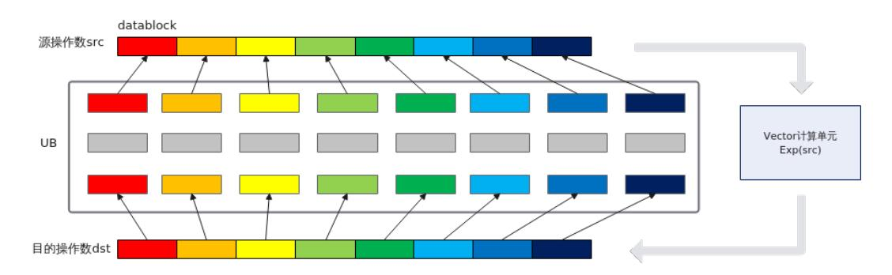

● 矢量计算API支持开发者通过**repeatTimes**来配置迭代次数,从而控制指令的多次 迭代执行。假设**repeatTimes**设置为2,矢量计算单元会进行2个迭代的计算,可 计算出2 \* 8(每个迭代8个datablock) \* 32Byte(每个datablock32Byte) = 512Byte的结果。如果数据类型为half,则计算了256个元素。下图展示了2次迭代 Exp计算的示意图。由于硬件限制,**repeatTimes**不能超过**255**。

图 **11-3** 2 次迭代 Exp 计算

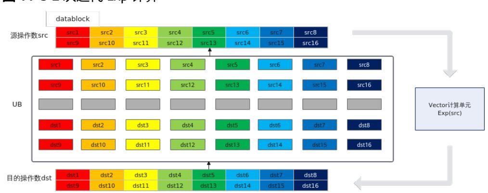

● 针对同一个迭代中的数据,可以通过**mask**参数进行掩码操作来控制实际参与计算 的个数。下图为进行Abs计算时通过mask逐比特模式按位控制哪些元素参与计算 的示意图,1表示参与计算,0表示不参与计算。


图 **11-4** 通过 **mask** 参数进行掩码操作示意图(以 float 数据类型为例)

- 矢量计算单元还支持带间隔的向量计算,通过**dataBlockStride**(单次迭代内不同 datablock间地址步长)和**repeatStride**(相邻迭代间相同datablock的地址步 长)来进行配置。
  - **dataBlockStride**

如果需要控制单次迭代内,数据处理的步长,可以通过设置同一迭代内不同 datablock的地址步长dataBlockStride来实现。下图给出了单次迭代内非连续 场景的示意图,示例中源操作数的dataBlockStride配置为2,表示单次迭代内 不同datablock间地址步长(起始地址之间的间隔)为2个datablock。

### 图 **11-5** 单次迭代内非连续场景的示意图

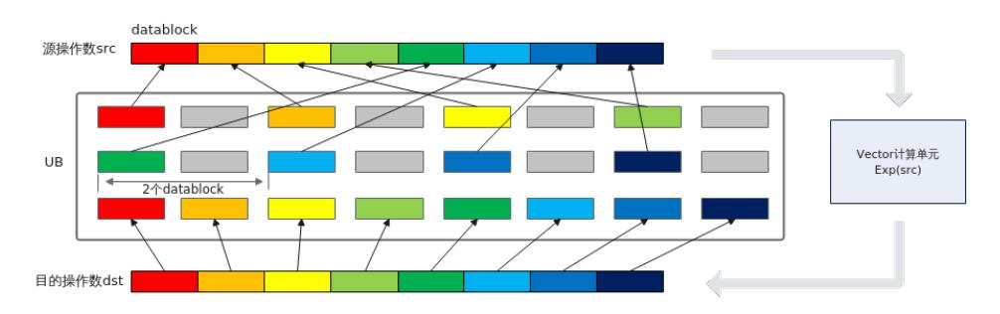

– repeatStride

当repeatTimes大于1,需要多次迭代完成矢量计算时,您可以根据不同的使 用场景合理设置相邻迭代间相同datablock的地址步长repeatStride的值。

下图给出了多次迭代间非连续场景的示意图,示例中源操作数和目的操作数 的**repeatStride**均配置为9,表示相邻迭代间相同datablock起始地址之间的 间隔为9个datablock。相同datablock是指datablock在迭代内的位置相同, 比如下图中的src1和src9处于相邻迭代,在迭代内都是第一个datablock的位 置,其间隔即为**repeatStride**的数值。

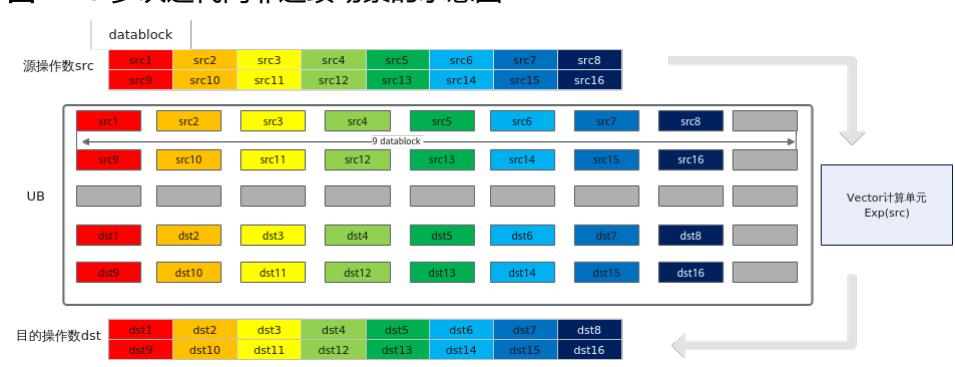

<span id="page-339-0"></span>图 **11-6** 多次迭代间非连续场景的示意图

下文中给出了dataBlockStride、repeatStride、mask的详细配置说明和示例。

### **dataBlockStride**

dataBlockStride是指同一迭代内不同datablock的地址步长。

- 连续计算,dataBlockStride设置为1,对同一迭代内的8个datablock数据连续进行 处理。
- 非连续计算,dataBlockStride值大于1(如取2),同一迭代内不同datablock之间 在读取数据时出现一个datablock的间隔,如下图所示。

### 图 **11-7** dataBlockStride 不同取值举例

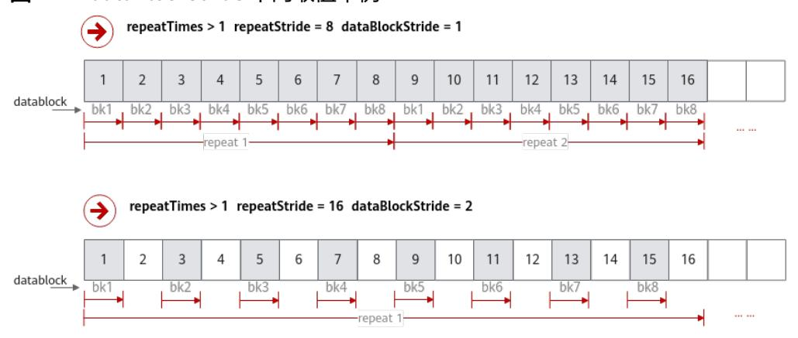

## **repeatStride**

repeatStride是指相邻迭代间相同datablock的地址步长。

● 连续计算场景:假设定义一个Tensor供目的操作数和源操作数同时使用(即地址 重叠),repeatStride取值为8。此时,矢量计算单元第一次迭代读取连续8个 datablock,第二轮迭代读取下一个连续的8个datablock,通过多次迭代即可完成 所有输入数据的计算。

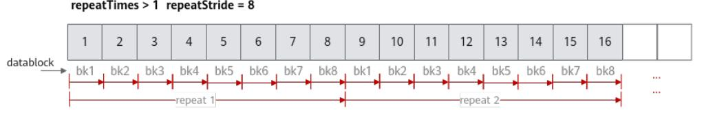

● 非连续计算场景:repeatStride取值大于8(如取10)时,则相邻迭代间矢量计算 单元读取的数据在地址上不连续,出现2个datablock的间隔。

<span id="page-340-0"></span>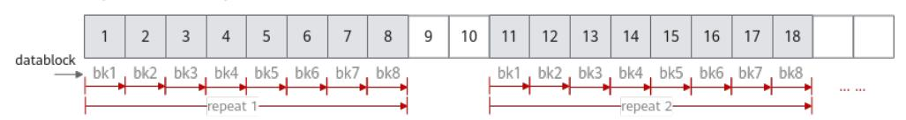

● 反复计算场景:repeatStride取值为0时,矢量计算单元会对首个连续的8个 datablock进行反复读取和计算。

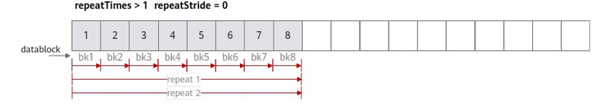

● 部分重复计算:repeatStride取值大于0且小于8时,相邻迭代间部分数据会被矢量 计算单元重复读取和计算,此种情形一般场景不涉及。

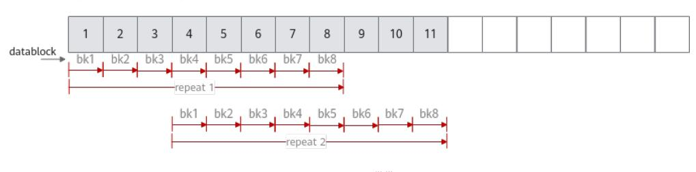

## **mask** 参数

mask用于控制每次迭代内参与计算的元素。可通过连续模式和逐bit模式两种方式进行 设置。

● 连续模式:表示前面连续的多少个元素参与计算。数据类型为uint64\_t。取值范围 和源操作数的数据类型有关,数据类型不同,每次迭代内能够处理的元素个数最 大值不同(当前数据类型单次迭代时能处理的元素个数最大值为:256 / sizeof(数 据类型))。当操作数的数据类型占bit位16位时(如half/uint16\_t),mask∈[1, 128];当操作数为32位时(如float/int32\_t),mask∈[1, 64]。

### 具体样例如下:

```
// int16_t数据类型单次迭代能处理的元素个数最大值为256/sizeof(int16_t) = 128,mask = 64,mask∈
[1, 128],所以是合法输入
// repeatTimes = 1, 共128个元素,单次迭代能处理128个元素,故repeatTimes = 1
// dstBlkStride, src0BlkStride, src1BlkStride = 1, 单次迭代内连续读取和写入数据
// dstRepStride, src0RepStride, src1RepStride = 8, 迭代间的数据连续读取和写入
uint64_t mask = 64;
AscendC::Add(dstLocal, src0Local, src1Local, mask, 1, { 1, 1, 1, 8, 8, 8 });
```

### 结果示例如下:

```
输入数据(src0Local): [1 2 3 ... 64 ...128]
输入数据(src1Local): [1 2 3 ... 64 ...128]
输出数据(dstLocal): [2 4 6 ... 128 undefined...undefined]
// int32_t数据类型单次迭代能处理的元素个数最大值为256/sizeof(int32_t) = 64,mask = 64,mask∈[1, 
64],所以是合法输入
// repeatTimes = 1, 共64个元素,单次迭代能处理64个元素,故repeatTimes = 1
// dstBlkStride, src0BlkStride, src1BlkStride = 1, 单次迭代内连续读取和写入数据
// dstRepStride, src0RepStride, src1RepStride = 8, 迭代间的数据连续读取和写入
uint64_t mask = 64;
AscendC::Add(dstLocal, src0Local, src1Local, mask, 1, { 1, 1, 1, 8, 8, 8 });
```

### 结果示例如下:

输入数据(src0Local): [1 2 3 ... 64] 输入数据(src1Local): [1 2 3 ... 64] 输出数据(dstLocal): [2 4 6 ... 128]

● 逐bit模式:可以按位控制哪些元素参与计算,bit位的值为1表示参与计算,0表示 不参与。

mask为数组形式,数组长度和数组元素的取值范围和操作数的数据类型有关。当 操作数为16位时,数组长度为2,mask[0]、mask[1]∈[0, 264-1]并且不同时为 0;当操作数为32位时,数组长度为1,mask[0]∈(0, 264-1];当操作数为64位 时,数组长度为1,mask[0]∈(0, 232-1]。

### 具体样例如下:

```
// 数据类型为int16_t
uint64_t mask[2] = {6148914691236517205, 6148914691236517205};
// repeatTimes = 1, 共128个元素,单次迭代能处理128个元素,故repeatTimes = 1。
// dstBlkStride, src0BlkStride, src1BlkStride = 1, 单次迭代内连续读取和写入数据。
// dstRepStride, src0RepStride, src1RepStride = 8, 迭代间的数据连续读取和写入。
AscendC::Add(dstLocal, src0Local, src1Local, mask, 1, { 1, 1, 1, 8, 8, 8 });
```

### 结果示例如下:

输入数据(src0Local): [1 2 3 ... 64 ...127 128] 输入数据(src1Local): [1 2 3 ... 64 ...127 128]

输出数据(dstLocal): [2 undefined 6 ... undefined ...254 undefined]

### mask过程如下:

mask={6148914691236517205, 6148914691236517205}(注: 6148914691236517205表示64位二进制数0b010101....01,mask按照低位到高位 的顺序排布)

| src0 | 1 | 2  | 3 | 4  | 5  | 6  | 7  | 8  | 9  | 10 | 11 | 12 | 13 | 14 | 15 | 16 | 17 | 18 | 19 | 20 | <br>64 | <br>127 | 128 |
|------|---|----|---|----|----|----|----|----|----|----|----|----|----|----|----|----|----|----|----|----|--------|---------|-----|
| src1 | 1 | 2  | 3 | 4  | 5  | 6  | 7  | 8  | 9  | 10 | 11 | 12 | 13 | 14 | 15 | 16 | 17 | 18 | 19 | 20 | <br>64 | <br>127 | 128 |
| mask | 1 | 0  | 1 | 0  | 1  | 0  | 1  | 0  | 1  | 0  | 1  | 0  | 1  | 0  | 1  | 0  | 1  | 0  | 1  | 0  | <br>0  | <br>1   | 0   |
| dst  | 2 | un | 6 | un | 10 | un | 14 | un | 18 | un | 22 | un | 26 | un | 30 | un | 34 | un | 38 | un | <br>un | <br>254 | un  |

```
// 数据类型为int32_t
uint64_t mask[2] = {6148914691236517205, 0};
// repeatTimes = 1, 共64个元素,单次迭代能处理64个元素,故repeatTimes = 1。
// dstBlkStride, src0BlkStride, src1BlkStride = 1, 单次迭代内连续读取和写入数据。
// dstRepStride, src0RepStride, src1RepStride = 8, 迭代间的数据连续读取和写入。
AscendC::Add(dstLocal, src0Local, src1Local, mask, 1, { 1, 1, 1, 8, 8, 8 });
```

### 结果示例如下:

输入数据(src0Local): [1 2 3 ... 63 64] 输入数据(src1Local): [1 2 3 ... 63 64]

输出数据(dstLocal): [2 undefined 6 ... 126 undefined]

### mask过程如下:

mask={6148914691236517205, 0}(注:6148914691236517205表示64位二进 制数0b010101....01)

| src0 | 1 | 2  | 3 | 4  | 5  | 6  | 7  | 8  | 9  | 10 | 11 | 12 | 13 | 14 | 15 | 16 | 17 | 18 | 19 | 20 | <br>63  | 64 |
|------|---|----|---|----|----|----|----|----|----|----|----|----|----|----|----|----|----|----|----|----|---------|----|
| src1 | 1 | 2  | 3 | 4  | 5  | 6  | 7  | 8  | 9  | 10 | 11 | 12 | 13 | 14 | 15 | 16 | 17 | 18 | 19 | 20 | <br>63  | 64 |
| mask | 1 | 0  | 1 | 0  | 1  | 0  | 1  | 0  | 1  | 0  | 1  | 0  | 1  | 0  | 1  | 0  | 1  | 0  | 1  | 0  | <br>1   | 0  |
| dst  | 2 | un | 6 | un | 10 | un | 14 | un | 18 | un | 22 | un | 26 | un | 30 | un | 34 | un | 38 | un | <br>126 | un |

## <span id="page-342-0"></span>**11.5** 如何使用归约指令

归约指令将数据集合简化为单一值或者更小的集合。按照归约操作的数据范围的不 同,归约指令分为以下几种,可参考[归约指令示意图](#page-343-0):

- ReduceMax/ReduceMin/ReduceSum:对所有的输入数据做归约操作,得到最大 值和最大值索引/最小值和最小值索引/数据总和。
- WholeReduceMax/WholeReduceMin/WholeReduceSum:对每个repeat内的输 入数据做归约操作,得到每个repeat内的最大值和最大值索引/最小值和最小值索 引/数据总和。返回索引时返回的是repeat内部索引。
- BlockReduceMax/BlockReduceMin/BlockReduceSum:对每个datablock内的输 入数据做归约操作,得到每个datablock内的最大值/最小值/数据总和。
- PairReduce:相邻两个(奇偶)元素求和,例如(a1, a2, a3, a4, a5, a6...),归 约后结果为(a1+a2, a3+a4, a5+a6, ......)。

### <span id="page-343-0"></span>图 **11-8** 归约指令示意图

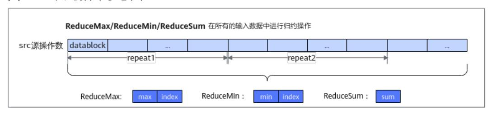

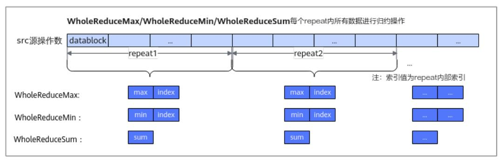

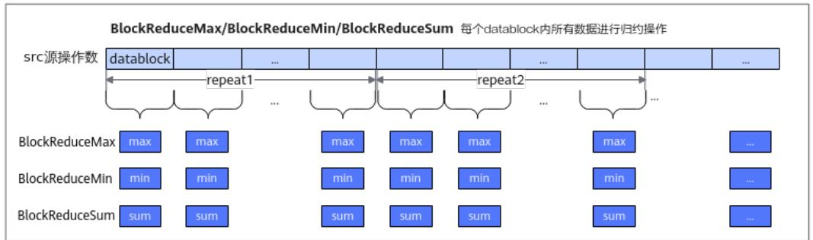

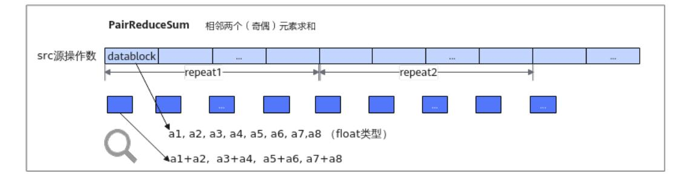

针对归约指令,和其他的基础API一样也提供了**tensor**高维切分计算接口,可充分发挥 硬件优势,支持开发者控制指令的迭代执行和操作数的地址间隔,功能更加灵活。但 具体参数的单位和约束[与基础](#page-336-0)**API**略有不同,下文将对这些差异点进行介绍。

- **repeatTimes**:迭代次数,开发者通过repeatTimes来配置迭代次数,从而控制指 令的多次迭代执行。
  - ReduceMax/ReduceMin/ReduceSum对于repeatTimes超过255的情况,在 API内部进行了处理,所以repeatTimes支持更大的取值范围,保证不超过 int32\_t最大值的范围即可。
  - WholeReduceMax/WholeReduceMin/WholeReduceSum/BlockReduceMax/ BlockReduceMin/BlockReduceSum/PairReduce和其他基础API一样, repeatTimes要求不超过255。
- **mask**:用于控制每次迭代内参与计算的元素,mask参数的使用方法和基础API通 用的使用方法一致。

- <span id="page-344-0"></span>● **repeatStride**:表示相邻迭代间的地址步长。
  - ReduceMax/ReduceMin/ReduceSum指令的目的操作数会归约成一个最大 值/最小值/总和,所以其目的操作数不支持配置repeatStride。仅源操作数支 持repeatStride,其含义、单位(datablock)和基础API通用说明一致。
  - WholeReduceMax/WholeReduceMin/WholeReduceSum/BlockReduceMax/ BlockReduceMin/BlockReduceSum/PairReduce源操作数和目的操作数都支 持配置repeatStride,源操作数repeatStride的含义、单位(datablock)和基 础API通用说明一致。目的操作数repeatStride的含义、单位和基础API通用说 明有差异,因为归约后,目的操作数的长度会变短,比如WholeReduceSum 归约后每个repeat会合并为一个值,所以迭代之间的间隔不能在使用一个 datablock为单位,而以一个repeat归约后的长度为单位。
- **dataBlockStride**:表示单次迭代内datablock的地址步长。
  - ReduceMax/ReduceMin/ReduceSum指令的目的操作数会归约成一个最大 值/最小值/总和,所以其目的操作数不支持配置dataBlockStride。源操作数 也不支持dataBlockStride。
  - WholeReduceMax/WholeReduceMin/WholeReduceSum/BlockReduceMax/ BlockReduceMin/BlockReduceSum/PairReduce源操作数支持配置 dataBlockStride,源操作数dataBlockStride的含义、单位(datablock)和基 础API通用说明一致。目的操作数不支持dataBlockStride,因为归约后,目的 操作数的长度会变短,比如WholeReduceSum归约后每个repeat会合并为一 个值,不再有迭代内datablock和地址间隔的概念。

## **11.6** 如何使用掩码操作 **API**

Mask用于控制矢量计算中参与计算的元素个数,支持以下工作模式及配置方式:

表 **11-1** Mask 工作模式

| 工作模式          | 说明                                                                          |
|---------------|-----------------------------------------------------------------------------|
| Normal<br>模式  | 默认模式,支持单次迭代内的Mask能力,需要开发者配置迭代次数,<br>额外进行尾块的计算。                              |
|               | Normal模式下,Mask用来控制单次迭代内参与计算的元素个数。                                           |
|               | 通过调用 SetMaskNorm设置Normal模式。                                                 |
| Counter<br>模式 | 简化模式,直接传入计算数据量,自动推断迭代次数,不需要开发者去<br>感知迭代次数、处理非对齐尾块的操作;但是不具备单次迭代内的<br>Mask能力。 |
|               | Counter模式下,Mask表示整个矢量计算参与计算的元素个数。<br>通过调用 SetMaskCount设置Counter模式。          |

### 表 **11-2** Mask 配置方式

| 配置方式         | 说明                                                                                                                                                                                                   |
|--------------|------------------------------------------------------------------------------------------------------------------------------------------------------------------------------------------------------|
| 接口传参<br>(默认) | 通过矢量计算API的入参直接传递Mask值。矢量计算API的模板参数<br>isSetMask(仅部分API支持)用于控制接口传参还是外部API配置,默<br>认值为true,表示接口传参。Mask对应于高维切分计算API中的mask/<br>mask[]参数或者tensor前n个数据计算API中的calCount参数。                                    |
| 外部API<br>配置  | 调用 SetVectorMask接口设置Mask值,矢量计算API的模板参数<br>isSetMask设置为false,接口入参中的Mask参数(对应于高维切分计算<br>API中的mask/mask[]参数或者tensor前n个数据计算API中的calCount<br>参数)不生效。适用于Mask参数相同,多次重复使用的场景,无需在矢<br>量计算API内部反复设置,会有一定的性能优势。 |

### Mask操作的使用方式如下:

## 表 **11-3** Mask 操作的使用方式

| 配置<br>方式        | 工作<br>模式          | 前n个数据计算API                                 | 高维切分计算API                                                                                                                                                                                             |
|-----------------|-------------------|--------------------------------------------|-------------------------------------------------------------------------------------------------------------------------------------------------------------------------------------------------------|
| 接口<br>传参        | Nor<br>mal<br>模式  | 不涉及。                                       | isSetMask模板参数设置为true,通过<br>接口入参传入Mask,根据使用场景配<br>置dataBlockStride、repeatStride、<br>repeatTimes参数。                                                                                                     |
|                 | Cou<br>nter<br>模式 | isSetMask模板参数设置为<br>true,通过接口入参传入<br>Mask。 | ●<br>isSetMask模板参数设置为true,通<br>过接口入参传入Mask。<br>●<br>根据使用场景配置<br>dataBlockStride、repeatStride参<br>数。repeatTimes传入固定值即<br>可,建议统一设置为1,该值不生<br>效。                                                         |
| 外部<br>API<br>配置 | Nor<br>mal<br>模式  | 不涉及。                                       | 调用 SetVectorMask设置Mask,之<br>后调用高维切分计算API。<br>●<br>isSetMask模板参数设置为false,<br>接口入参中的mask值设置为占位符<br>MASK_PLACEHOLDER,用于占<br>位,无实际含义。<br>●<br>根据使用场景配置repeatTimes、<br>dataBlockStride、repeatStride参<br>数。 |

| 配置<br>方式 | 工作<br>模式          | 前n个数据计算API                                                                                        | 高维切分计算API                                                                                                                                                                                                                        |
|----------|-------------------|---------------------------------------------------------------------------------------------------|----------------------------------------------------------------------------------------------------------------------------------------------------------------------------------------------------------------------------------|
|          | Cou<br>nter<br>模式 | 调用 SetVectorMask设置<br>Mask,之后调用前n个数据<br>计算API,isSetMask模板参<br>数设置为false;接口入参中<br>的calCount建议设置成1。 | 调用 SetVectorMask设置Mask,之<br>后调用高维切分计算API。<br>●<br>isSetMask模板参数设置为false;<br>接口入参中的mask值设置为<br>MASK_PLACEHOLDER,用于占<br>位,无实际含义。<br>●<br>根据使用场景配置<br>dataBlockStride、repeatStride参<br>数。repeatTimes传入固定值即<br>可,建议统一设置为1,该值不生<br>效。 |

### 典型场景的使用示例如下:

● 场景1:Normal模式 + 外部API配置 + 高维切分计算API

AscendC::LocalTensor<half> dstLocal;

AscendC::LocalTensor<half> src0Local;

AscendC::LocalTensor<half> src1Local;

// 1、设置Normal模式

AscendC::SetMaskNorm();

// 2、设置Mask

AscendC::SetVectorMask<half, AscendC::MaskMode::NORMAL>(0xffffffffffffffff, 0xffffffffffffffff); // 逐 bit模式

// SetVectorMask<half, MaskMode::NORMAL>(128); // 连续模式

// 3、多次调用矢量计算API, isSetMask模板参数设置为false,接口入参中的mask值设置为占位符 MASK\_PLACEHOLDER,用于占位,无实际含义

// 根据使用场景配置repeatTimes、dataBlockStride、repeatStride参数

// dstBlkStride, src0BlkStride, src1BlkStride = 1, 单次迭代内数据连续读取和写入

// dstRepStride, src0RepStride, src1RepStride = 8, 相邻迭代间数据连续读取和写入

AscendC::Add<half, false>(dstLocal, src0Local, src1Local, AscendC::MASK\_PLACEHOLDER, 1, { 2, 2, 2, 8, 8, 8 });

AscendC::Sub<half, false>(src0Local, dstLocal, src1Local, AscendC::MASK\_PLACEHOLDER, 1, { 2, 2, 2, 8, 8, 8 });

AscendC::Mul<half, false>(src1Local, dstLocal, src0Local, AscendC::MASK\_PLACEHOLDER, 1, { 2, 2, 2, 8, 8, 8 });

// 4、恢复Mask值为默认值

AscendC::ResetMask();

● 场景2:Counter模式 + 外部API配置 + 高维切分计算API

AscendC::LocalTensor<half> dstLocal;

AscendC::LocalTensor<half> src0Local;

AscendC::LocalTensor<half> src1Local;

int32\_t len = 128; // 参与计算的元素个数

// 1、设置Counter模式

AscendC::SetMaskCount();

// 2、设置Mask

AscendC::SetVectorMask<half, AscendC::MaskMode::COUNTER>(len);

// 3、多次调用矢量计算API, isSetMask模板参数设置为false;接口入参中的mask值设置为 MASK\_PLACEHOLDER,用于占位,无实际含义

// 根据使用场景正确配置dataBlockStride、repeatStride参数。repeatTimes传入固定值即可,建议统一设 置为1,该值不生效

AscendC::Add<half, false>(dstLocal, src0Local, src1Local, AscendC::MASK\_PLACEHOLDER, 1, { 1, 1, 1, 8, 8, 8 });

AscendC::Sub<half, false>(src0Local, dstLocal, src1Local, AscendC::MASK\_PLACEHOLDER, 1, { 1, 1, 1, 8, 8, 8 });

AscendC::Mul<half, false>(src1Local, dstLocal, src0Local, AscendC::MASK\_PLACEHOLDER, 1, { 1, 1, 1, 8,

```
// 4、恢复工作模式
    AscendC::SetMaskNorm();
    // 5、恢复Mask值为默认值
    AscendC::ResetMask();
● 场景3:Counter模式 + 外部API配置 + 前n个数据计算接口配合使用
    AscendC::LocalTensor<half> dstLocal;
    AscendC::LocalTensor<half> src0Local;
    half num = 2; 
    // 1、设置Mask
    AscendC::SetVectorMask<half, AscendC::MaskMode::COUNTER>(128); // 参与计算的元素个数为128
    // 2、调用前n个数据计算API,isSetMask模板参数设置为false;接口入参中的calCount建议设置成1。
    AscendC::Adds<half, false>(dstLocal, src0Local, num, 1);
    AscendC::Muls<half, false>(dstLocal, src0Local, num, 1);
    // 3、恢复工作模式
    AscendC::SetMaskNorm();
    // 4、恢复Mask值为默认值
```

### 说明

AscendC::ResetMask();

8, 8 });

- 前n个数据计算API接口内部会设置工作模式为Counter模式,所以如果前n个数据计算API配 合Counter模式使用时,无需手动调用 **[SetMaskCount](#page-860-0)**设置Counter模式。
- 所有手动使用Counter模式的场景,使用完毕后,需要调用 **[SetMaskNorm](#page-861-0)**恢复工作模式。
- 调用 **[SetVectorMask](#page-862-0)**设置Mask,使用完毕后,需要调用 **[ResetMask](#page-864-0)**恢复Mask值为默认 值。
- 使用高维切分计算API配套Counter模式使用时,比前n个数据计算API增加了可间隔的计算, 支持dataBlockStride、repeatStride参数。

## **11.7** 如何使用 **workspace**

workspace是设备侧Global Memory上的一块内存。workspace内存分为两部分:系统 workspace和用户workspace。

- 系统workspace:Ascend C API需要预留的workspace内存 API在计算过程需要一些workspace内存作为缓存,因此算子需要为API预留 workspace内存,预留内存大小通过 **[GetLibApiWorkSpaceSize](#page-2249-0)**接口获取。
- 用户workspace:算子实现使用到的workspace内存 算子内部需要通过额外的device内存进行数据交换或者缓存的时候才需要分配, 根据实际情况自行分配。使用场景如下:
  - 需要使用Unified Buffer和L1 Buffer上空间且空间不够用时,可以将数据暂存 至workspace上。
  - 调用 **[SyncAll](#page-1038-0)**等API接口时,需要workspace作为入参。
  - 其他需要使用Global Memory上内存空间的场景。

### 不同开发方式下,具体的使用方法如下:

● 工程化算子开发方式

在tiling函数中先通过**[14.2.2.23.23 GetWorkspaceSizes](#page-2576-0)**接口获取workspace大小 的存放位置,再设置workspace的大小,框架侧会为其申请对应大小的设备侧 Global Memory,在对应的算子kernel侧实现时可以使用这块workspace内存。在 使用**[14.1.5.2.1 Matmul](#page-1410-0)**等需要系统workspace的高阶API时,设置的workspace空 间大小为系统workspace和用户workspace之和。

```
// 用户自定义的tiling函数
static ge::graphStatus TilingFunc(gert::TilingContext* context)
```

```
 AddApiTiling tiling;
 ...
 size_t usrSize = 256; // 设置用户需要使用的workspace大小为256字节。
 // 如需要使用系统workspace需要调用GetLibApiWorkSpaceSize获取系统workspace的大小。
 auto ascendcPlatform = platform_ascendc::PlatformAscendC(context->GetPlatformInfo());
 uint32_t sysWorkspaceSize = ascendcPlatform.GetLibApiWorkSpaceSize();
 size_t *currentWorkspace = context->GetWorkspaceSizes(1); // 通过框架获取workspace的指针,
GetWorkspaceSizes入参为所需workspace的块数。当前限制使用一块。
 currentWorkspace[0] = usrSize + sysWorkspaceSize; // 设置总的workspace的数值大小,总的
workspace空间由框架来申请并管理。
 ...
}
在device侧kernel入口处的workspace为用户的workspace指针:
// 用户写的Kernel函数,核函数必须包括GM_ADDR workspace入参,位置需要放在tiling之前
extern "C" __global__ __aicore__ void add_custom(GM_ADDR x, GM_ADDR y, GM_ADDR z, GM_ADDR 
workspace, GM_ADDR tiling)
 ...
}
```

● Kernel直调算子开发场景

需要使用workspace空间时,建议开启编译选项**[-DHAVE\\_WORKSPACE](#page-204-0)**。host侧 开发者仍需要自行申请workspace的空间,并传入。在使用**[14.1.5.2.1 Matmul](#page-1410-0)**等 需要系统workspace的高阶API时,设置的workspace空间大小为系统workspace 和用户workspace之和。系统workspace大小可以通过**[14.1.6.3.2](#page-2252-0) [PlatformAscendCManager](#page-2252-0)**的GetLibApiWorkSpaceSize接口获取。开启**[-](#page-204-0)[DHAVE\\_WORKSPACE](#page-204-0)**后,开发者在kernel侧入参处获取的workspace为偏移了系 统workspace后的用户workspace。

## **11.8** 如何进行 **Tiling** 调测

[在工程化算子开发过](#page-213-0)程中,开发者需实现Tiling函数,该函数原型是固定的,接受 **[TilingContext](#page-2560-0)**作为输入。框架负责构造TilingContext并调用Tiling函数。若需单独进 行Tiling调测,开发者可通过**[OpTilingRegistry](#page-2231-0)**加载编译后的Tiling动态库,获取Tiling 函数的指针并进行调用,调用时Tiling函数的TilingContext入参使用**[ContextBuilder](#page-2218-0)**构 建。

以下是具体步骤:

### 步骤**1** 参考工程化算子开发的开发步骤,完成算子实现,并通过算子包编译或算子动态库编 译获取对应的Tiling动态库文件。

- 算子包编译:Tiling实现对应的动态库为算子包部署目录下的liboptiling.so。具体 路径可参考**6.7.6.2** [算子包部署。](#page-242-0)
- 动态库编译:Tiling实现集成在算子动态库libcust\_opapi.so中。具体路径可参考 **6.7.7** [算子动态库编译](#page-244-0)。

## 步骤**2** 编写测试代码。

- 使用ContextBuilder配置输入输出Tensor的形状、数据类型、格式及平台信息等, 构建TilingContext。
- 通过OpTilingRegistry的**[LoadTilingLibrary](#page-2233-0)**接口加载Tiling动态库;使用 **[GetTilingFunc](#page-2232-0)**接口获取Tiling函数指针。
- 执行Tiling函数,验证其正确性。

```
// test.cpp
#include <iostream>
#include "exe_graph/runtime/storage_shape.h"
#include "tiling/context/context_builder.h"
```

```
int main()
{
 gert::StorageShape x_shape = {{2, 32}, {2, 32}};
 gert::StorageShape y_shape = {{2, 32}, {2, 32}};
 gert::StorageShape z_shape = {{2, 32}, {2, 32}};
 auto param = gert::TilingData::CreateCap(4096);
 auto workspace_size_holer = gert::ContinuousVector::Create<size_t>(4096);
 auto ws_size = reinterpret_cast<gert::ContinuousVector *>(workspace_size_holer.get());
 auto holder = context_ascendc::ContextBuilder()
 .NodeIoNum(2, 1)
 .IrInstanceNum({1, 1})
 .AddInputTd(0, ge::DT_FLOAT, ge::FORMAT_ND, ge::FORMAT_ND, x_shape)
 .AddInputTd(1, ge::DT_FLOAT, ge::FORMAT_ND, ge::FORMAT_ND, y_shape)
 .AddOutputTd(0, ge::DT_FLOAT, ge::FORMAT_ND, ge::FORMAT_ND, z_shape)
 .TilingData(param.get())
 .Workspace(ws_size)
 .AddPlatformInfo("Ascendxxxyy")
 .BuildTilingContext();
 auto tilingContext = holder->GetContext<gert::TilingContext>();
 context_ascendc::OpTilingRegistry tmpIns;
 bool flag = tmpIns.LoadTilingLibrary("/your/path/to/so_path/liboptiling.so"); // 加载对应的Tiling动态库文
件
 if (flag == false) {
 std::cout << "Failed to load tiling so" << std::endl;
 return -1;
 }
 context_ascendc::TilingFunc tilingFunc = tmpIns.GetTilingFunc("AddCustom"); // 获取AddCustom算子对应
的Tiling函数, 此处入参为OpType
 if (tilingFunc != nullptr) {
 ge::graphStatus ret = tilingFunc(tilingContext); // 执行Tiling函数
 if (ret != ge::GRAPH_SUCCESS) {
 std::cout << "Exec tiling func failed." << std::endl;
 return -1;
 }
 } else {
 std::cout << "Get tiling func failed." << std::endl;
 return -1;
 }
 return 0;
}
```

### 步骤**3** 编译测试代码。

g++ test.cpp -I\${INSTALL\_DIR}/include -L\${INSTALL\_DIR}/lib64 -Wl,-rpath,\${INSTALL\_DIR}/lib64 -ltiling\_api lc\_sec -lgraph\_base -lregister -lascendalog -lplatform -o test

- \${INSTALL\_DIR}请替换为CANN软件安装后文件存储路径。若安装的Ascendcann-toolkit软件包,以root安装举例,则安装后文件存储路径为:/usr/local/ Ascend/ascend-toolkit/latest。
- 开发者根据需要链接依赖的动态库,必需链接的动态库有:
  - libtiling\_api.so:Tiling功能相关的动态库,包含ContextBuilder类、 OpTilingRegistry类等。
  - libc\_sec.so:安全函数库,libtiling\_api.so依赖该库。
  - libgraph\_base.so:基础数据结构与接口库,libtiling\_api.so依赖该库。
  - libregister.so:业务函数注册相关库(例如Tiling函数注册,算子原型注册 等)。
  - libascendalog.so:log库,libtiling\_api.so依赖该库。
  - libplatform.so:平台信息库,libtiling\_api.so依赖该库;Tiling函数中使用硬 件平台信息时,需要依赖该库。

### <span id="page-350-0"></span>步骤**4** 执行可执行文件。

./test

**----**结束

## **11.9** 如何使用 **SPM Buffer**

## 功能介绍

SPM Buffer功能支持对Unified Buffer的暂存操作,当Unified Buffer内存有溢出风险 时,可以将Unified Buffer的数据先拷贝到SPM(Spill Memory) Buffer暂存,具体使用 时再取回。

### 使用方法如下:

- 1. 调用 **[InitSpmBuffer](#page-1013-0)**接口完成初始化操作。
- 2. 调用 **[WriteSpmBuffer](#page-1014-0)**接口完成数据的拷贝暂存操作。
- 3. 需要使用暂存的数据时,调用 **[ReadSpmBuffer](#page-1016-0)**接口完成数据的取回操作。

针对Atlas A2 训练系列产品/Atlas 800I A2 推理产品/A200I A2 Box 异构组件,仅支持 暂存到workspace。

针对Atlas A3 训练系列产品/Atlas A3 推理系列产品,仅支持暂存到workspace。

针对Atlas 训练系列产品、Atlas 推理系列产品,可以暂存到workspace或者L1 Buffer。

## 使用样例

- 1. 初始化操作。
  - 暂存到workspace初始化

AscendC::TPipe pipe; int len = 1024; AscendC::GlobalTensor<half> workspace\_gm; auto usrWorkspace = AscendC::GetUserWorkspace(workspace); // 此处的usrWorkspace为用户自定义的workspace,类型为half,有len个元素 workspace\_gm.SetGlobalBuffer((\_\_gm\_\_ half \*)usrWorkspace, len); auto gm = workspace\_gm[AscendC::GetBlockIdx() \* len]; pipe.InitSpmBuffer(gm, len \* sizeof(half));

– 暂存到L1 Buffer初始化

TPipe pipe; int len = 1024; // 设置spm buffer为1024个类型为T的数据 pipe.InitSpmBuffer(len \* sizeof(T));

2. 暂存和取回操作。

TQue<TPosition::VECIN, 1> inQueueSrcVecIn; int dataSize = 32; // 假设T为half类型,从ub上申请一块内存32 \* sizeof(half)字节 int offset = 32; // 拷贝到spmBuffer时偏移32字节 pipe.InitBuffer(inQueueSrcVecIn, 1, dataSize); LocalTensor<half> writeLocal = inQueueSrcVecIn.AllocTensor<half>(); DataCopyParams copyParams{1, 2, 0, 0}; // 从ub上搬运一块长度为2个datablock的数据,一个 datablock32byte pipe.WriteSpmBuffer(writeLocal, copyParams, offset); pipe.ReadSpmBuffer(writeLocal, copyParams, offset);

## 使用约束

## <span id="page-351-0"></span>**11.10** 如何使用更底层编程方式提升算子性能

**[Ascend C](#page-81-0)**编程范式提供了基于Pipe进行算子开发的方式,Pipe(TPipe类)统一管理 Device端内存等资源,开发者无需感知内存管理、DoubleBuffer流水、同步等处理, 只需要按照计算流编写算子即可,但由此也带来了一些运行时开销(如TPipe创建、 InitBuffer等)。

Ascend C提供更底层的编程方式,开发者可以直接构造指定地址和存储位置的 LocalTensor,使用该Tensor传入计算、搬运等API进行编程,减少了Pipe编程方式中带 来的运行时开销,更有助于开发者实现极致性能。两种编程方式的对比如下:

### 图 **11-9** 两种编程方式的对比(伪码)

## 使用约束和限制

相比于Pipe编程方式,使用更底层编程时需要遵循以下约束和限制:

- 在更底层编程场景中,开发者不能使用TPipe/TQue/TQueBind/TBufPool等框架接 口,仅能使用LocalTensor对象以及部分API(和上述框架接口混用可能会出现未 定义行为)。LocalTensor的构造方式有两种,通过**[LocalTensor](#page-426-0)**构造函数或者 **[14.1.3.8 LocalMemAllocator](#page-486-0)**构造。
- 在更底层编程场景中只能使用部分API。具体支持的API列表见[支持的](#page-353-0)**API**范围。因 为不在列表范围内的API内部依赖TPipe分配事件ID,可能会和开发者定义的事件 ID产生冲突。
- 同步事件需要由开发者使用 **[SetFlag/WaitFlag\(ISASI\)](#page-1028-0)**和 **[PipeBarrier\(ISASI\)](#page-1031-0)**手 动插入,事件的类型/事件ID由开发者自行管理,但需要注意事件ID不能使用6/7 (可能与内部使用的事件ID出现冲突,进而出现未定义行为)。
- 由于需要使用SetFlag/WaitFlag/PipeBarrier底层同步接口(属于ISASI硬件体系结 构相关的接口),无法保证跨硬件版本兼容。
- Kernel入口处需要开发者手动调用**[InitSocState](#page-1069-0)**接口用来初始化全局状态寄存器 (在TPipe框架编程中,初始化过程由TPipe完成,无需开发者关注)。

## 使用示例

这段代码定义了一个用于执行矢量加法的核函数add\_custom和算子类KernelAdd。算 子类KernelAdd的核心实现是数据的搬入、加法计算和搬出。

- Kernel入口处手动调用InitSocState接口来初始化全局状态寄存器。
- 使用LocalTensor接口直接构造LocalTensor对象。
- 开发者手动进行同步控制,插入的同步事件如下:
  - 正向同步

在本次数据搬入和计算之间,插入MTE2\_V(矢量计算流水等待MT2搬运流 水)同步事件,确保数据搬入之后再进行计算;在本次数据计算和搬出之 间,插入V\_MTE3(MTE3搬运流水等待矢量计算流水)同步事件,确保数据 计算完成后再进行搬出。

– 反向同步

在上一次的数据计算和本次数据搬入之间,插入V\_MTE2(MT2搬运流水等待 矢量计算流水)同步事件,确保上一次的数据计算完成后,本次的数据再进 行搬入。防止本次的数据会覆盖掉上一次未计算完成的数据;在上一次的数 据搬出和本次数据计算之间,插入MTE3\_V(矢量计算流水等待MT3搬运流 水)同步事件,确保上一次的数据搬出后,再进行本次数据的计算。防止本 次的数据会覆盖掉上一次未搬出的数据。

上述的同步逻辑在使用Pipe编程框架时,框架会使用EnQue/DeQue/ AllocTensor/FreeTensor进行封装。您可以通过**10.4** [编程模型设计原理来](#page-324-0)了 解应该如何在使用更底层编程方式时手动进行同步控制。

```
class KernelAdd {
public:
 __aicore__ inline KernelAdd() {}
 __aicore__ inline void Init(GM_ADDR x, GM_ADDR y, GM_ADDR z)
 {
 // 设置不同核计算数据的起始地址
 xGm.SetGlobalBuffer((__gm__ half*)x + BLOCK_LENGTH * AscendC::GetBlockIdx(), BLOCK_LENGTH);
 yGm.SetGlobalBuffer((__gm__ half*)y + BLOCK_LENGTH * AscendC::GetBlockIdx(), BLOCK_LENGTH);
 zGm.SetGlobalBuffer((__gm__ half*)z + BLOCK_LENGTH * AscendC::GetBlockIdx(), BLOCK_LENGTH);
 }
 __aicore__ inline void Process()
 {
 int32_t loopCount = this->tileNum * BUFFER_NUM;
 uint32_t xAddr = 0;
 uint32_t yAddr = this->tileLength * sizeof(DTYPE_X);
 uint32_t zAddr = this->tileLength * (sizeof(DTYPE_X) + sizeof(DTYPE_Y));
 AscendC::LocalTensor<DTYPE_X> xLocal(AscendC::TPosition::VECIN, xAddr, this->tileLength);
 AscendC::LocalTensor<DTYPE_Y> yLocal(AscendC::TPosition::VECIN, yAddr, this->tileLength);
 AscendC::LocalTensor<DTYPE_Z> zLocal(AscendC::TPosition::VECOUT, zAddr, this->tileLength);
 for (int32_t i = 0; i < loopCount; i++) {
 if (i != 0) {
 // xLocal/yLocal的反向依赖,后一次搬入需要等上一次的计算结束
 AscendC::WaitFlag<AscendC::HardEvent::V_MTE2>(0);
 }
 AscendC::DataCopy(xLocal, xGm[i * this->tileLength], this->tileLength);
 AscendC::DataCopy(yLocal, yGm[i * this->tileLength], this->tileLength);
 AscendC::SetFlag<AscendC::HardEvent::MTE2_V>(0);
 AscendC::WaitFlag<AscendC::HardEvent::MTE2_V>(0);
 if (i != 0) {
 // zLocal的反向依赖,后一次计算需要等上一次的搬出结束
 AscendC::WaitFlag<AscendC::HardEvent::MTE3_V>(0);
 }
 AscendC::Add(zLocal, xLocal, yLocal, this->tileLength);
 if (i != loopCount -1) {
 // xLocal/yLocal的反向依赖,后一次的搬入需要等上一次的计算结束
 AscendC::SetFlag<AscendC::HardEvent::V_MTE2>(0);
 }
 AscendC::SetFlag<AscendC::HardEvent::V_MTE3>(0);
 AscendC::WaitFlag<AscendC::HardEvent::V_MTE3>(0);
 DataCopy(zGm[i * this->tileLength], zLocal, this->tileLength);
 if (i != loopCount -1) {
 // zLocal的反向依赖,后一次计算需要等上一次的搬出结束
 AscendC::SetFlag<AscendC::HardEvent::MTE3_V>(0);
```

```
 }
 }
 }
private:
 AscendC::GlobalTensor<half> xGm, yGm, zGm;
};
extern "C" __global__ __aicore__ void add_custom(GM_ADDR x, GM_ADDR y, GM_ADDR z)
{
 // 初始化全局状态寄存器(在TPipe框架编程中,初始化过程由TPipe完成,无需开发者关注;更底层编程方式
中需要开发者手动调用)
 AscendC::InitSocState();
 KernelAdd op;
 op.Init(x, y, z);
 op.Process(); 
}
```

## 支持的 **API** 范围

表 **11-4** 针对 Atlas 推理系列产品 AI Core,支持的 API 范围

| 接口分类                     | 接口名称                                                                                                                                                                     |  |
|--------------------------|--------------------------------------------------------------------------------------------------------------------------------------------------------------------------|--|
| 基础API > 标量计算             | ScalarGetCountOfValue、ScalarCountLeadingZero、<br>ScalarCast、CountBitsCntSameAsSignBit、<br>ScalarGetSFFValue                                                              |  |
| 基础API > 矢量计算 ><br>单目指令   | Exp、Ln、Abs、Reciprocal、Sqrt、Rsqrt、Not、Relu、<br>VectorPadding(ISASI)                                                                                                       |  |
| 基础API > 矢量计算 ><br>双目指令   | Add、Sub、Mul、Div、Max、Min、And、Or、<br>AddRelu、AddReluCast、AddDeqRelu、SubRelu、<br>SubReluCast、MulAddDst、MulCast、FusedMulAdd、<br>FusedMulAddRelu、BilinearInterpolation(ISASI) |  |
| 基础API > 矢量计算 ><br>标量双目指令 | Adds、Muls、Maxs、Mins、LeakyRelu                                                                                                                                            |  |
| 基础API > 矢量计算 ><br>标量三目指令 | Axpy                                                                                                                                                                     |  |
| 基础API > 矢量计算 ><br>比较指令   | Compare、Compare(结果存入寄存器)、<br>CompareScalar、GetCmpMask(ISASI)、<br>SetCmpMask(ISASI)                                                                                       |  |
| 基础API > 矢量计算 ><br>选择指令   | Select、GatherMask                                                                                                                                                        |  |
| 基础API > 矢量计算 ><br>精度转换指令 | Cast、CastDeq                                                                                                                                                             |  |
| 基础API > 矢量计算 ><br>归约指令   | WholeReduceMax、WholeReduceMin、<br>WholeReduceSum、BlockReduceMax、<br>BlockReduceMin、BlockReduceSum、PairReduceSum、<br>RepeatReduceSum、GetReduceMaxMinCount                 |  |
| 基础API > 矢量计算 ><br>数据转换   | Transpose、TransDataTo5HD                                                                                                                                                 |  |

| 接口分类                          | 接口名称                                                                                                                                                                       |  |
|-------------------------------|----------------------------------------------------------------------------------------------------------------------------------------------------------------------------|--|
| 基础API > 矢量计算 ><br>数据填充        | Duplicate                                                                                                                                                                  |  |
| 基础API > 矢量计算 ><br>排序组合(ISASI) | ProposalConcat、ProposalExtract、RpSort16、<br>MrgSort4、GetMrgSortResult                                                                                                      |  |
| 基础API > 矢量计算 ><br>数据分散/数据收集   | Gather、Scatter(ISASI)                                                                                                                                                      |  |
| 基础API > 矢量计算 ><br>掩码操作        | SetMaskCount、SetMaskNorm、SetVectorMask、<br>ResetMask                                                                                                                       |  |
| 基础API > 矢量计算 ><br>量化设置        | SetDeqScale                                                                                                                                                                |  |
| 基础API > 数据搬运 ><br>DataCopy    | 普通数据搬运                                                                                                                                                                     |  |
| 基础API > 内存管理与<br>同步控制 > 核内同步  | SetFlag/WaitFlag(ISASI)、PipeBarrier(ISASI)                                                                                                                                 |  |
| 基础API > 缓存处理                  | DataCachePreload、DataCacheCleanAndInvalid、<br>ICachePreLoad(ISASI)                                                                                                         |  |
| 基础API > 系统变量访<br>问            | GetBlockNum、GetBlockIdx、<br>GetDataBlockSizeInBytes、GetArchVersion、<br>GetTaskRation、InitSocState、<br>GetProgramCounter(ISASI)                                             |  |
| 基础API > 原子操作                  | SetAtomicAdd、SetAtomicNone                                                                                                                                                 |  |
| 基础API > 矩阵计算<br>(ISASI)       | InitConstValue、LoadData、SetAippFunctions、<br>LoadImageToLocal、LoadUnzipIndex、<br>LoadDataUnzip、SetLoadDataBoundary、<br>SetLoadDataPaddingValue、Mmad、<br>CheckLocalMemoryIA |  |

表 **11-5** 针对 Atlas A2 训练系列产品/Atlas 800I A2 推理产品/A200I A2 Box 异构组 件,支持的 API 范围

| 接口分类                   | 接口名称                                                                                                                                       | 备注 |
|------------------------|--------------------------------------------------------------------------------------------------------------------------------------------|----|
| 基础API > 标量计算           | ScalarGetCountOfValue、<br>ScalarCountLeadingZero、<br>ScalarCast、<br>CountBitsCntSameAsSignBit、<br>ScalarGetSFFValue、ToBfloat16、<br>ToFloat | -  |
| 基础API > 矢量计算 ><br>单目指令 | Exp、Ln、Abs、Reciprocal、<br>Sqrt、Rsqrt、Not、Relu                                                                                              | -  |

| 接口分类                          | 接口名称                                                                                                                                                                                              | 备注 |
|-------------------------------|---------------------------------------------------------------------------------------------------------------------------------------------------------------------------------------------------|----|
| 基础API > 矢量计算 ><br>双目指令        | Add、Sub、Mul、Div、Max、<br>Min、And、Or、AddRelu、<br>AddReluCast、AddDeqRelu、<br>SubRelu、SubReluCast、<br>MulAddDst、MulCast、<br>FusedMulAdd、<br>FusedMulAddRelu、<br>BilinearInterpolation<br>(ISASI)      | -  |
| 基础API > 矢量计算 ><br>标量双目指令      | Adds、Muls、Maxs、Mins、<br>ShiftLeft、ShiftRight、LeakyRelu                                                                                                                                            | -  |
| 基础API > 矢量计算 ><br>标量三目指令      | Axpy                                                                                                                                                                                              | -  |
| 基础API > 矢量计算 ><br>比较指令        | Compare、Compare(结果存入寄<br>存器)、CompareScalar、<br>GetCmpMask(ISASI)、<br>SetCmpMask(ISASI)                                                                                                            | -  |
| 基础API > 矢量计算 ><br>选择指令        | Select、GatherMask                                                                                                                                                                                 | -  |
| 基础API > 矢量计算 ><br>精度转换指令      | Cast、CastDeq                                                                                                                                                                                      | -  |
| 基础API > 矢量计算 ><br>归约指令        | WholeReduceMax、<br>WholeReduceMin、<br>WholeReduceSum、<br>BlockReduceMax、<br>BlockReduceMin、<br>BlockReduceSum、<br>PairReduceSum、<br>RepeatReduceSum、<br>GetAccVal(ISASI)、<br>GetReduceMaxMinCount | -  |
| 基础API > 矢量计算 ><br>数据转换        | Transpose、TransDataTo5HD                                                                                                                                                                          | -  |
| 基础API > 矢量计算 ><br>数据填充        | Duplicate、Brcb                                                                                                                                                                                    | -  |
| 基础API > 矢量计算 ><br>排序组合(ISASI) | Sort32、MrgSort、<br>GetMrgSortResult                                                                                                                                                               | -  |
| 基础API > 矢量计算 ><br>数据分散/数据收集   | Gather、Gatherb(ISASI)                                                                                                                                                                             | -  |
| 基础API > 矢量计算 ><br>掩码操作        | SetMaskCount、SetMaskNorm、<br>SetVectorMask、ResetMask                                                                                                                                              | -  |

| 接口分类                         | 接口名称                                                                                                                                                                                                             | 备注                                                 |
|------------------------------|------------------------------------------------------------------------------------------------------------------------------------------------------------------------------------------------------------------|----------------------------------------------------|
| 基础API > 矢量计算 ><br>量化设置       | SetDeqScale                                                                                                                                                                                                      | -                                                  |
| 基础API > 数据搬运 ><br>DataCopy   | 普通数据搬运                                                                                                                                                                                                           | 不支持VECIN/<br>VECCALC/VECOUT<br>-> TSCM通路的数<br>据搬运。 |
|                              | 增强数据搬运                                                                                                                                                                                                           | 不支持VECIN/<br>VECCALC/VECOUT<br>-> TSCM通路的数<br>据搬运。 |
|                              | 切片数据搬运                                                                                                                                                                                                           | -                                                  |
|                              | 随路格式转换                                                                                                                                                                                                           | 不支持VECIN/<br>VECCALC/VECOUT<br>-> TSCM通路的数<br>据搬运。 |
| 基础API > 数据搬运                 | Copy、DataCopyPad(ISASI)、<br>SetPadValue(ISASI)、<br>SetFixPipeConfig(ISASI)、<br>SetFixpipeNz2ndFlag(ISASI)、<br>SetFixpipePreQuantFlag(ISASI)                                                                      | -                                                  |
| 基础API > 内存管理与<br>同步控制 > 核内同步 | SetFlag/WaitFlag(ISASI)、<br>PipeBarrier(ISASI)、<br>DataSyncBarrier(ISASI)                                                                                                                                        | -                                                  |
| 基础API > 内存管理与<br>同步控制 > 核间同步 | CrossCoreSetFlag(ISASI)、<br>CrossCoreWaitFlag(ISASI)                                                                                                                                                             | -                                                  |
| 基础API > 缓存处理                 | DataCachePreload、<br>DataCacheCleanAndInvalid、<br>ICachePreLoad(ISASI)、<br>GetICachePreloadStatus(ISASI)                                                                                                         | -                                                  |
| 基础API > 系统变量访<br>问           | GetBlockNum、GetBlockIdx、<br>GetDataBlockSizeInBytes、<br>GetArchVersion、GetTaskRation、<br>InitSocState、<br>GetProgramCounter(ISASI)、<br>GetSubBlockNum(ISASI)、<br>GetSubBlockIdx(ISASI)、<br>GetSystemCycle(ISASI) | -                                                  |
| 基础API > 原子操作                 | SetAtomicAdd、SetAtomicType、<br>SetAtomicNone、<br>SetAtomicMax(ISASI)、<br>SetAtomicMin(ISASI)、<br>SetStoreAtomicConfig(ISASI)、<br>GetStoreAtomicConfig(ISASI)                                                     | -                                                  |

| 接口分类                           | 接口名称                                                                                                                                                                                                                                                                                                                             | 备注 |
|--------------------------------|----------------------------------------------------------------------------------------------------------------------------------------------------------------------------------------------------------------------------------------------------------------------------------------------------------------------------------|----|
| 基础API > 矩阵计算<br>(ISASI)        | InitConstValue、LoadData、<br>LoadDataWithTranspose、<br>SetAippFunctions、<br>LoadImageToLocal、<br>LoadDataWithSparse、<br>SetFmatrix、<br>SetLoadDataBoundary、<br>SetLoadDataRepeat、<br>SetLoadDataPaddingValue、<br>Mmad、MmadWithSparse、<br>Fixpipe、SetHF32Mode、<br>SetHF32TransMode、<br>SetMMLayoutTransform、<br>CheckLocalMemoryIA | -  |
| 高阶API > 模板库函数                  | max、min、index_sequence                                                                                                                                                                                                                                                                                                           | -  |
| 高阶API > 模板库函数<br>> 容器函数        | tuple、get、make_tuple                                                                                                                                                                                                                                                                                                             | -  |
| 高阶API > 模板库函数<br>> type_traits | is_convertible、is_base_of、<br>is_same、enable_if、conditional                                                                                                                                                                                                                                                                      | -  |

### 表 **11-6** 针对 Atlas A3 训练系列产品/Atlas A3 推理系列产品,支持的 API 范围

| 接口分类                     | 接口名称                                                                                                                                                                                         | 备注 |
|--------------------------|----------------------------------------------------------------------------------------------------------------------------------------------------------------------------------------------|----|
| 基础API > 标量计算             | ScalarGetCountOfValue、<br>ScalarCountLeadingZero、<br>ScalarCast、<br>CountBitsCntSameAsSignBit、<br>ScalarGetSFFValue、ToBfloat16、<br>ToFloat                                                   | -  |
| 基础API > 矢量计算 ><br>单目指令   | Exp、Ln、Abs、Reciprocal、<br>Sqrt、Rsqrt、Not、Relu                                                                                                                                                | -  |
| 基础API > 矢量计算 ><br>双目指令   | Add、Sub、Mul、Div、Max、<br>Min、And、Or、AddRelu、<br>AddReluCast、AddDeqRelu、<br>SubRelu、SubReluCast、<br>MulAddDst、MulCast、<br>FusedMulAdd、<br>FusedMulAddRelu、<br>BilinearInterpolation<br>(ISASI) | -  |
| 基础API > 矢量计算 ><br>标量双目指令 | Adds、Muls、Maxs、Mins、<br>ShiftLeft、ShiftRight、LeakyRelu                                                                                                                                       | -  |

| 接口分类                          | 接口名称                                                                                                                                                                                              | 备注                                                 |
|-------------------------------|---------------------------------------------------------------------------------------------------------------------------------------------------------------------------------------------------|----------------------------------------------------|
| 基础API > 矢量计算 ><br>标量三目指令      | Axpy                                                                                                                                                                                              | -                                                  |
| 基础API > 矢量计算 ><br>比较指令        | Compare、Compare(结果存入寄<br>存器)、CompareScalar、<br>GetCmpMask(ISASI)、<br>SetCmpMask(ISASI)                                                                                                            | -                                                  |
| 基础API > 矢量计算 ><br>选择指令        | Select、GatherMask                                                                                                                                                                                 | -                                                  |
| 基础API > 矢量计算 ><br>精度转换指令      | Cast、CastDeq                                                                                                                                                                                      | -                                                  |
| 基础API > 矢量计算 ><br>归约指令        | WholeReduceMax、<br>WholeReduceMin、<br>WholeReduceSum、<br>BlockReduceMax、<br>BlockReduceMin、<br>BlockReduceSum、<br>PairReduceSum、<br>RepeatReduceSum、<br>GetAccVal(ISASI)、<br>GetReduceMaxMinCount | -                                                  |
| 基础API > 矢量计算 ><br>数据转换        | Transpose、TransDataTo5HD                                                                                                                                                                          | -                                                  |
| 基础API > 矢量计算 ><br>数据填充        | Duplicate、Brcb                                                                                                                                                                                    | -                                                  |
| 基础API > 矢量计算 ><br>排序组合(ISASI) | Sort32、MrgSort、<br>GetMrgSortResult                                                                                                                                                               | -                                                  |
| 基础API > 矢量计算 ><br>数据分散/数据收集   | Gather、Gatherb(ISASI)                                                                                                                                                                             | -                                                  |
| 基础API > 矢量计算 ><br>掩码操作        | SetMaskCount、SetMaskNorm、<br>SetVectorMask、ResetMask                                                                                                                                              | -                                                  |
| 基础API > 矢量计算 ><br>量化设置        | SetDeqScale                                                                                                                                                                                       | -                                                  |
| 基础API > 数据搬运 ><br>DataCopy    | 普通数据搬运                                                                                                                                                                                            | 不支持VECIN/<br>VECCALC/VECOUT<br>-> TSCM通路的数<br>据搬运。 |
|                               | 增强数据搬运                                                                                                                                                                                            | 不支持VECIN/<br>VECCALC/VECOUT<br>-> TSCM通路的数<br>据搬运。 |
|                               | 切片数据搬运                                                                                                                                                                                            | -                                                  |

| 接口分类                         | 接口名称                                                                                                                                                                                                                                                                                                                             | 备注                                                 |
|------------------------------|----------------------------------------------------------------------------------------------------------------------------------------------------------------------------------------------------------------------------------------------------------------------------------------------------------------------------------|----------------------------------------------------|
|                              | 随路格式转换                                                                                                                                                                                                                                                                                                                           | 不支持VECIN/<br>VECCALC/VECOUT<br>-> TSCM通路的数<br>据搬运。 |
| 基础API > 数据搬运                 | Copy、DataCopyPad(ISASI)、<br>SetPadValue(ISASI)、<br>SetFixPipeConfig(ISASI)、<br>SetFixpipeNz2ndFlag(ISASI)、<br>SetFixpipePreQuantFlag(ISASI)                                                                                                                                                                                      | -                                                  |
| 基础API > 内存管理与<br>同步控制 > 核内同步 | SetFlag/WaitFlag(ISASI)、<br>PipeBarrier(ISASI)、<br>DataSyncBarrier(ISASI)                                                                                                                                                                                                                                                        | -                                                  |
| 基础API > 内存管理与<br>同步控制 > 核间同步 | CrossCoreSetFlag(ISASI)、<br>CrossCoreWaitFlag(ISASI)                                                                                                                                                                                                                                                                             | -                                                  |
| 基础API > 缓存处理                 | DataCachePreload、<br>DataCacheCleanAndInvalid、<br>ICachePreLoad(ISASI)、<br>GetICachePreloadStatus(ISASI)                                                                                                                                                                                                                         | -                                                  |
| 基础API > 系统变量访<br>问           | GetBlockNum、GetBlockIdx、<br>GetDataBlockSizeInBytes、<br>GetArchVersion、GetTaskRation、<br>InitSocState、<br>GetProgramCounter(ISASI)、<br>GetSubBlockNum(ISASI)、<br>GetSubBlockIdx(ISASI)、<br>GetSystemCycle(ISASI)                                                                                                                 | -                                                  |
| 基础API > 原子操作                 | SetAtomicAdd、SetAtomicType、<br>SetAtomicNone、<br>SetAtomicMax(ISASI)、<br>SetAtomicMin(ISASI)、<br>SetStoreAtomicConfig(ISASI)、<br>GetStoreAtomicConfig(ISASI)                                                                                                                                                                     | -                                                  |
| 基础API > 矩阵计算<br>(ISASI)      | InitConstValue、LoadData、<br>LoadDataWithTranspose、<br>SetAippFunctions、<br>LoadImageToLocal、<br>LoadDataWithSparse、<br>SetFmatrix、<br>SetLoadDataBoundary、<br>SetLoadDataRepeat、<br>SetLoadDataPaddingValue、<br>Mmad、MmadWithSparse、<br>Fixpipe、SetHF32Mode、<br>SetHF32TransMode、<br>SetMMLayoutTransform、<br>CheckLocalMemoryIA | -                                                  |

<span id="page-360-0"></span>

| 接口分类                           | 接口名称                                                        | 备注 |
|--------------------------------|-------------------------------------------------------------|----|
| 高阶API > 模板库函数                  | max、min、index_sequence                                      | -  |
| 高阶API > 模板库函数<br>> 容器函数        | tuple、get、make_tuple                                        | -  |
| 高阶API > 模板库函数<br>> type_traits | is_convertible、is_base_of、<br>is_same、enable_if、conditional | -  |

## **11.11** 如何使用 **Tensor** 原地操作提升算子性能

Tensor原地操作(inplace接口)是一种优化技术,全局申请、保留LocalTensor内存, 避免了频繁创建和销毁LocalTensor对象。AllocTensor、FreeTensor、EnQue、DeQue 接口不产生新的LocalTensor,而是在该全局LocalTensor上反复申请、释放、入队、出 队。其实现原理如下图所示:

<span id="page-361-0"></span>图 **11-10** Tensor 原地操作实现原理

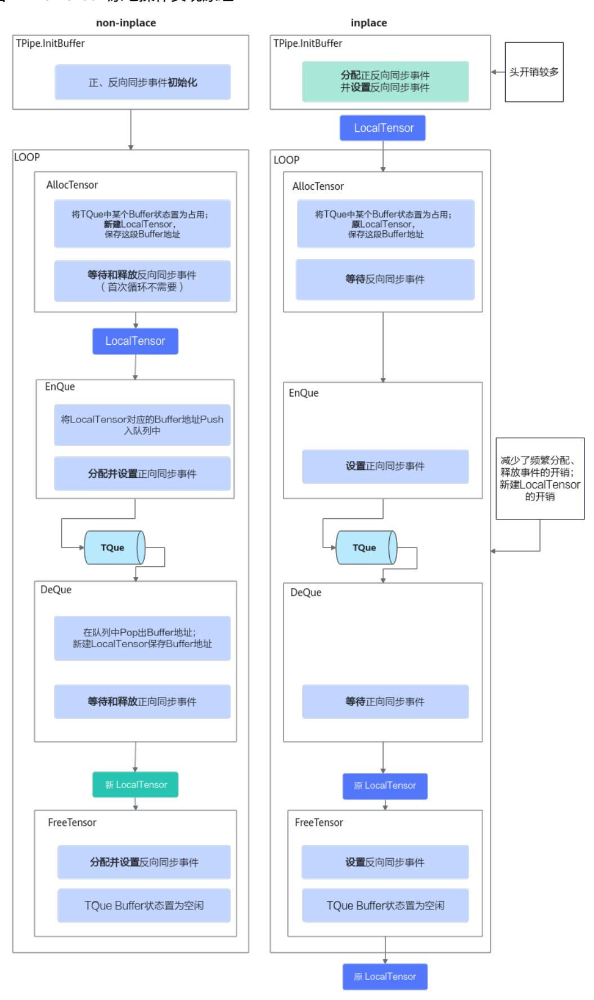

## **Tensor** 原地操作的优势

- 减少栈变换:相比构造新Tensor的方式,inplace接口减少了LocalTensor的栈变 换,允许Tensor被反复使用。
- 减少入队**/**出队操作:在调用EnQue、DeQue的过程中,TQue对象没有存储该 Tensor对应的Buffer地址,实际没有真正入队、出队,减少了反复入队、出队的 Scalar指令。

## 保留 **EnQue** 和 **DeQue** 的原因

既然Tensor原地操作没有执行真正的入队出队操作,为什么还需要保留EnQue和 DeQue接口呢?

- 编程兼容性:为了保持编程接口的一致性,inplace接口仍然需要调用EnQue和 DeQue,确保代码结构的统一性和可维护性。
- 内存同步功能:EnQue和DeQue操作中实现了内存读写同步功能,确保数据的一 致性和正确性,即使没有实际的队列操作,这些同步机制仍然需要保留。

## 适用场景

适合计算循环次数多的场景:如图**[11-10](#page-361-0)**所示,inplace接口虽然增加了TQue对象 InitBuffer的初始化开销,但显著减少了每次循环中AllocTensor、EnQue、DeQue和 FreeTensor内部对LocalTensor和事件的操作次数,特别适合需要多次循环来完成计算 的场景。

## 使用方法

- 配置**TQue**对象:在创建TQue对象时,设置深度(depth)为0,启用inplace操作 模式。
- 调用原地操作接口:使用inplace接口直接操作LocalTensor。
  - AllocTensor和DeQue区分non-inplace和inplace接口,详情请参考 **[AllocTensor](#page-980-0)**、 **[DeQue](#page-985-0)**。
  - FreeTensor和EnQue不区分non-inplace和inplace接口。

## 示例代码

```
// ...
namespace AscendC {
class MyKernel {
public:
 __aicore__ inline MyKernel() {}
 __aicore__ inline void Init(__gm__ uint8_t* src0Gm, __gm__ uint8_t* src1Gm, __gm__ uint8_t* dstGm)
 {
 src0Global.SetGlobalBuffer((__gm__ half*)src0Gm);
 src1Global.SetGlobalBuffer((__gm__ half*)src1Gm);
 dstGlobal.SetGlobalBuffer((__gm__ half*)dstGm);
 pipe.InitBuffer(srcQue0, 1, BLOCK_SIZE * sizeof(half));
 pipe.InitBuffer(srcQue1, 1, BLOCK_SIZE * sizeof(half));
 pipe.InitBuffer(dstQue0, 1, BLOCK_SIZE * sizeof(half));
 }
 __aicore__ inline void Process()
 {
 for (int i = 0; i < REPTIMES; i++) {
 CopyIn(i);
 Compute(i);
 CopyOut(i);
 }
```

```
 }
private:
 __aicore__ inline void CopyIn(int32_t i)
 {
 srcQue0.AllocTensor<half>(src0Local);
 srcQue1.AllocTensor<half>(src1Local);
 DataCopy(src0Local, src0Global[i*BLOCK_SIZE], BLOCK_SIZE);
 DataCopy(src1Local, src1Global[i*BLOCK_SIZE], BLOCK_SIZE);
 srcQue0.EnQue(src0Local);
 srcQue1.EnQue(src1Local);
 }
 __aicore__ inline void Compute(int32_t i)
 {
 srcQue0.DeQue<half>(src0Local);
 srcQue1.DeQue<half>(src1Local);
 dstQue0.AllocTensor<half>(dstLocal);
 Add(dstLocal, src0Local, src1Local, BLOCK_SIZE);
 dstQue0.EnQue<half>(dstLocal);
 srcQue0.FreeTensor(src0Local);
 srcQue1.FreeTensor(src1Local);
 }
 __aicore__ inline void CopyOut(int32_t i)
 {
 dstQue0.DeQue<half>(dstLocal);
 DataCopy(dstGlobal[i*BLOCK_SIZE], dstLocal, BLOCK_SIZE);
 dstQue0.FreeTensor(dstLocal);
 }
private:
 TPipe pipe;
 TQue<QuePosition::VECIN, 0> srcQue0, srcQue1;
 TQue<QuePosition::VECOUT, 0> dstQue0;
 GlobalTensor<half> src0Global, src1Global, dstGlobal;
 LocalTensor<half> src0Local;
 LocalTensor<half> src1Local;
 LocalTensor<half> dstLocal;
};
} // namespace AscendC
// ...
```

# **12** 附录

<span id="page-364-0"></span>简易自定义算子工程 [show\\_kernel\\_debug\\_data](#page-369-0)工具 [msobjdump](#page-371-0)工具

## **12.1** 简易自定义算子工程

本章节介绍的简易自定义算子工程,是上文中介绍的自定义算子工程的简化版,对算 子的编译、打包、部署过程进行简化,便于开发者将该工程集成到自己的算子工程。

基于简易自定义算子工程进行算子开发的完整样例请参[考简易自定义算子工程。](https://gitee.com/ascend/samples/tree/master/operator/ascendc/0_introduction/2_add_frameworklaunchlite)

### 说明

- 使用该工程,支持在如下平台进行自定义算子开发:
  - Atlas A2训练系列产品/Atlas 800I A2推理产品
  - Atlas 推理系列产品
- 使用本工程开发的算子,只支持通过单算子API执行(aclnn)方式进行调用。
- 本工程暂不支持算子的交叉编译功能。

### 基于简易自定义算子工程的算子开发流程图如下:


## 创建算子工程

和**6.7.2** [创建算子工程](#page-214-0)类似,简易自定义算子工程通过msOpGen生成,基于算子原型 定义输出算子工程,包括算子**host**侧代码实现文件、算子**kernel**侧实现文件以及工程 编译配置文件等。主要差异点在于:创建简易算子工程需要通过**-f**参数配置framework 框架为aclnn。

### 说明

使用msOpGen工具创建算子工程之前,需要参考**2** [环境准备](#page-52-0)章节安装驱动固件和CANN软件 包,完成开发环境和运行环境的准备。

使用msOpGen工具创建简易算子开发工程的步骤如下:

步骤**1** 编写算子的原型定义json文件,用于生成算子开发工程。

例如,AddCustom算子的json文件命名为add\_custom.json,文件内容如下:

```
 {
 "op": "AddCustom",
 "input_desc": [
 {
 "name": "x",
 "param_type": "required",
 "format": [
 "ND",
 "ND",
 "ND"
 ],
 "type": [
 "fp16",
 "float",
 "int32"
 ]
 },
 {
 "name": "y",
 "param_type": "required",
 "format": [
 "ND",
 "ND",
 "ND"
 ],
 "type": [
 "fp16",
 "float",
 "int32"
 ]
 }
 ],
 "output_desc": [
 {
 "name": "z",
 "param_type": "required",
 "format": [
 "ND",
 "ND",
 "ND"
 ],
 "type": [
 "fp16",
 "float",
 "int32"
 ]
 }
 ]
```

}

步骤**2** 使用msOpGen工具生成算子的开发工程。以生成AddCustom的算子工程为例,下文仅 针对关键参数进行解释,详细参数说明请参见[《算子开发工具用户指南](https://www.hiascend.com/document/detail/zh/CANNCommunityEdition/82RC1/devaids/optool/atlasopdev_16_0002.html)》。

**\${INSTALL\_DIR}**/python/site-packages/bin/msopgen gen -i \$HOME/sample/add\_custom.json -c ai\_core- **<soc\_version>** -lan cpp -out \$HOME/sample/AddCustom **-f aclnn**

- **\${INSTALL\_DIR}**为CANN软件安装后文件存储路径,请根据实际环境进行替换。
- -i:指定算子原型定义文件add\_custom.json所在路径,请根据实际情况修改。
- -c:ai\_core-<soc\_version>代表算子在AI Core上执行,<soc\_version>为昇腾AI处 理器的型号。

### 说明

AI处理器的型号<soc\_version>请通过如下方式获取:

- 非Atlas A3 训练系列产品/Atlas A3 推理系列产品:在安装昇腾AI处理器的服务器执行 **npu-smi info**命令进行查询,获取**Name**信息。实际配置值为AscendName,例如 **Name**取值为xxxyy,实际配置值为Ascendxxxyy。
- Atlas A3 训练系列产品/Atlas A3 推理系列产品:在安装昇腾AI处理器的服务器执行 **npu-smi info -t board -i** id **-c** chip\_id命令进行查询,获取**Chip Name**和**NPU Name** 信息,实际配置值为Chip Name\_NPU Name。例如**Chip Name**取值为Ascendxxx, **NPU Name**取值为1234,实际配置值为Ascendxxx\_1234。

其中:

- id:设备id,通过**npu-smi info -l**命令查出的NPU ID即为设备id。
- chip\_id:芯片id,通过**npu-smi info -m**命令查出的Chip ID即为芯片id。

基于同系列的AI处理器型号创建的算子工程,其基础功能(基于该工程进行算子开发、编 译和部署)通用。

- -lan:参数cpp代表算子基于Ascend C编程框架,使用C/C++编程语言开发。
- -out:生成文件所在路径,可配置为绝对路径或者相对路径,并且工具执行用户 对路径具有可读写权限。若不配置,则默认生成在执行命令的当前路径。
- -f:表示框架类型,aclnn表示生成简易工程。
- 步骤**3** 命令执行完后,会在-out指定目录或者默认路径下生成算子工程目录,工程中包含算 子实现的模板文件,编译脚本等,以AddCustom算子为例,目录结构如下所示:

```
AddCustom
├── build.sh // 编译入口脚本
├── cmake 
│ ├── config.cmake // 编译配置项
│ ├── func.cmake
│ ├── intf.cmake
│ └── util // 算子工程编译所需脚本及公共编译文件存放目录
├── CMakeLists.txt // 算子工程的CMakeLists.txt
├── op_host // host侧实现文件
│ ├── add_custom_tiling.h // 算子tiling定义文件
│ ├── add_custom.cpp // 算子原型注册、tiling实现等内容文件
│ ├── CMakeLists.txt
├── op_kernel // kernel侧实现文件
│ ├── CMakeLists.txt 
│ ├── add_custom.cpp // 算子代码实现文件
```

### 说明

上述目录结构中的粗体文件为后续算子开发过程中需要修改的文件,其他文件无需修改。

### **----**结束

## <span id="page-367-0"></span>算子实现

参考**[6.7.4 Kernel](#page-222-0)**侧算子实现、**[6.7.5 Host](#page-224-0)**侧**tiling**实现、**6.7.3** [算子原型定义](#page-217-0)完成算子 实现。

## 算子编译

算子kernel侧和host侧实现开发完成后,需要对算子进行编译,生成算子静态库;自动 生成aclnn调用实现代码和头文件,链接算子静态库生成aclnn动态库,以支持后续的 单算子API执行方式(aclnn)的算子调用。编译过程如下:

- 根据host侧算子实现文件自动生成aclnn接口aclnn\_\*.h和aclnn实现文件 aclnn\_.cpp。
- 编译Tiling实现和算子原型定义生成Tiling动态库liboptiling.so (libcust\_opmaster\_rt2.0)。
- 编译kernel侧算子实现文件,并加载Tiling动态库,生成kernel静态库 libkernels.a。
- 编译aclnn实现文件,并链接kernel静态库libkernels.a生成单算子API调用的动态 库libcust\_opapi.so。

上述编译过程示意图如下:

### 图 **12-1** 编译过程示意图

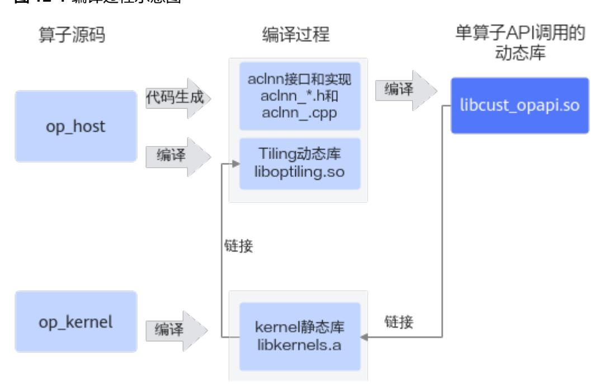

上文描述的过程都封装在编译脚本中,开发者进行编译时参考如下的步骤进行操作:

### 步骤**1** 完成工程编译相关配置。

● 修改cmake目录下config.cmake中的配置项,config.cmake文件内容如下: set(CMAKE\_CXX\_FLAGS\_DEBUG "") set(CMAKE\_CXX\_FLAGS\_RELEASE "")

if (NOT DEFINED CMAKE\_BUILD\_TYPE) set(**CMAKE\_BUILD\_TYPE** Release CACHE STRING "")

```
endif()
if (CMAKE_INSTALL_PREFIX_INITIALIZED_TO_DEFAULT) 
 set(CMAKE_INSTALL_PREFIX "${CMAKE_SOURCE_DIR}/build_out" CACHE PATH "" FORCE)
endif()
if (NOT DEFINED ASCEND_CANN_PACKAGE_PATH)
 set(ASCEND_CANN_PACKAGE_PATH /usr/local/Ascend/ascend-toolkit/latest CACHE PATH "") //请
替换为CANN软件包安装后的实际路径
endif()
if (NOT DEFINED ASCEND_PYTHON_EXECUTABLE)
 set(ASCEND_PYTHON_EXECUTABLE python3 CACHE STRING "")
endif()
if (NOT DEFINED ASCEND_COMPUTE_UNIT)
 set(ASCEND_COMPUTE_UNIT ascendxxx CACHE STRING "")
endif()
if (NOT DEFINED ENABLE_TEST)
 set(ENABLE_TEST FALSE CACHE BOOL "")
endif()
if (NOT DEFINED ENABLE_CROSS_COMPILE)
 set(ENABLE_CROSS_COMPILE FALSE CACHE BOOL "")
endif()
if (NOT DEFINED CMAKE_CROSS_PLATFORM_COMPILER)
 set(CMAKE_CROSS_PLATFORM_COMPILER "/your/cross/compiler/path" CACHE PATH "")
endif()
set(ASCEND_TENSOR_COMPILER_PATH ${ASCEND_CANN_PACKAGE_PATH}/compiler)
set(ASCEND_CCEC_COMPILER_PATH ${ASCEND_TENSOR_COMPILER_PATH}/ccec_compiler/bin)
set(ASCEND_AUTOGEN_PATH ${CMAKE_BINARY_DIR}/autogen)
file(MAKE_DIRECTORY ${ASCEND_AUTOGEN_PATH})
set(CUSTOM_COMPILE_OPTIONS "custom_compile_options.ini")
execute_process(COMMAND rm -rf ${ASCEND_AUTOGEN_PATH}/${CUSTOM_COMPILE_OPTIONS}
 COMMAND touch ${ASCEND_AUTOGEN_PATH}/${CUSTOM_COMPILE_OPTIONS})
```

### 表 **12-1** 需要开发者配置的常用参数列表

| 参数名称                         | 参数描述                                                                                                                     | 默认值                                                                |
|------------------------------|--------------------------------------------------------------------------------------------------------------------------|--------------------------------------------------------------------|
| ASCEND_CANN_PACK<br>AGE_PATH | CANN软件包安装路径,请根<br>据实际情况进行修改。                                                                                             | "/usr/local/Ascend/<br>ascend-toolkit/<br>latest"                  |
| CMAKE_BUILD_TYPE             | 编译模式选项,可配置为:<br>–<br>"Release",Release版<br>本,不包含调试信息,编<br>译最终发布的版本。<br>–<br>"Debug","Debug"<br>版本,包含调试信息,便<br>于开发者开发和调试。 | "Release"                                                          |
| CMAKE_INSTALL_PRE<br>FIX     | 编译产物存放的目录,不指<br>定则为默认值。                                                                                                  | \$<br>{CMAKE_SOURCE_DI<br>R}/build_out:<br>算子工程目录下的<br>build_out目录 |

### ● 配置编译相关环境变量(可选)

### <span id="page-369-0"></span>表 **12-2** 环境变量说明

| 环境变量                            | 配置说明                                                                                                                                                                                    |
|---------------------------------|-----------------------------------------------------------------------------------------------------------------------------------------------------------------------------------------|
| CMAKE_CXX_COMPI<br>LER_LAUNCHER | 用于配置C++语言编译器(如g++)、毕昇编译器的启<br>动器程序为ccache,配置后即可开启cache缓存编译,<br>加速重复编译并提高构建效率。用法如下,在对应的<br>CMakeLists.txt进行设置:<br>set(CMAKE_CXX_COMPILER_LAUNCHER <launcher_program>)</launcher_program> |
|                                 | 其中 <launcher_program>是ccache的安装路径,比如<br/>ccache的安装路径为/usr/bin/ccache,示例如下:<br/>set(CMAKE_CXX_COMPILER_LAUNCHER /usr/bin/ccache)</launcher_program>                                      |

步骤**2** (可选)如果需要编译多个算子,在op\_kernel目录下的CMakeLists.txt中增加要编译 的算子。

```
# set custom compile options
if ("${CMAKE_BUILD_TYPE}x" STREQUAL "Debugx")
 add_ops_compile_options(ALL OPTIONS -g -O0)
endif()
#多算子编译通过add_kernel_compile命令增加算子源码文件即可
add_kernel_compile(AddCustom ${CMAKE_CURRENT_SOURCE_DIR}/add_custom.cpp)
add_kernel_compile(SubCustom ${CMAKE_CURRENT_SOURCE_DIR}/sub_custom.cpp)
if(ENABLE_TEST AND EXISTS ${CMAKE_CURRENT_SOURCE_DIR}/testcases)
 add_subdirectory(testcases)
endif()
```

步骤**3** (可选)在算子工程中,如果开发者想对算子kernel侧代码增加一些自定义的编译选 项,可以参考[支持自定义编译选项](#page-239-0)进行编译选项的定制。

步骤**4** 在算子工程目录下执行如下命令,进行算子工程编译。

./build.sh

编译成功后,会在CMAKE\_INSTALL\_PREFIX/op\_api目录存放生成的aclnn头文件和lib 库,每一个算子都会对应一个单独的头文件。具体目录结构如下:

```
├── op_api
│ ├── include
│ ├── aclnn_optype1.h
│ └── aclnn_optype2.h
│ └── aclnn_optypexxx.h
│ ├── lib
│ ├── libcust_opapi.so
```

对于lib目录下生成的库文件可通过msobjdump工具进一步解析得到kernel信息,具体 操作参见**[12.3 msobjdump](#page-371-0)**工具。

### **----**结束

## 算子调用

完成[单算子](#page-246-0)**API**调用。

## **12.2 show\_kernel\_debug\_data** 工具

静态图场景下,整图算子全部下沉到NPU侧执行,kernel侧单算子调试信息(通过 **[14.1.7.2 printf](#page-2383-0)**接口)需要在模型执行结束后才能获取。本工具提供了离线解析能力, 帮助用户获取并解析调试信息(将bin文件解析成可读格式)。

### 说明

show\_kernel\_debug\_data支持多用户并发调用,但用户需要指定不同的落盘路径,否则可能出 现落盘内容被覆盖等问题。

## 产品支持情况

| 产品                                                       | 是否支持 |
|----------------------------------------------------------|------|
| Atlas A3 训练系列产品/Atlas A3 推理系列产品                          | √    |
| Atlas A2 训练系列产品/Atlas 800I A2 推理产<br>品/A200I A2 Box 异构组件 | √    |
| Atlas 200I/500 A2 推理产品                                   | √    |
| Atlas 推理系列产品                                             | √    |
| Atlas 训练系列产品                                             | x    |

## 工具安装

### 步骤**1** 安装工具。

工具跟随CANN软件包发布(参考**2** [环境准备](#page-52-0)完成CANN安装),其路径默认为"\$ {INSTALL\_DIR}/tools/show\_kernel\_debug\_data",其中\${INSTALL\_DIR}请替换为 CANN软件安装后文件存储路径。若安装的Ascend-cann-toolkit软件包,以root安装举 例,则安装后文件存储路径为:/usr/local/Ascend/ascend-toolkit/latest。

### 步骤**2** 设置环境变量。

- root用户安装Ascend-cann-toolkit包时 source /usr/local/Ascend/ascend-toolkit/set\_env.sh source /usr/local/Ascend/ascend-toolkit/latest/toolkit/bin/setenv.bash
- 非root用户安装Ascend-cann-toolkit包时 source \${HOME}/Ascend/ascend-toolkit/set\_env.sh source \${HOME}/Ascend/ascend-toolkit/latest/toolkit/bin/setenv.bash

### 步骤**3** 检查工具是否安装成功。

执行如下命令,若能正常显示--help或-h信息,则表示工具环境正常,功能可正常使 用。

show\_kernel\_debug\_data -h

### **----**结束

## 使用方法

### ● 命令行方式

show\_kernel\_debug\_data <bin\_file\_path> [<output\_path>]

| 参数                                       | 可选/必选 | 说明                                                       |
|------------------------------------------|-------|----------------------------------------------------------|
| <bin_file_pat<br>h&gt;</bin_file_pat<br> | 必选    | kernel侧调试信息落盘的bin文件路径,<br>例如"/input/dump_workspace.bin"。 |

<span id="page-371-0"></span>

| 参数                                   | 可选/必选 | 说明                                               |
|--------------------------------------|-------|--------------------------------------------------|
| <output_pat<br>h&gt;</output_pat<br> | 可选    | 解析结果的保存路径,例如"/<br>output_dir"。默认是当前命令行执行目<br>录下。 |

### ● **API**方式

### 表 **12-3** show\_kernel\_debug\_data 接口说明表

| 函数原<br>型        | def show_kernel_debug_data(bin_file_path: str, output_path: str =<br>'./') -> None                              |                                       |
|-----------------|-----------------------------------------------------------------------------------------------------------------|---------------------------------------|
| 函数功<br>能        |                                                                                                                 | 获取kernel侧调试信息并解析成可读文件。                |
| 参数<br>(IN)      | bin_file_path                                                                                                   | kernel侧调试信息落盘的bin文件路径,字符串类<br>型。      |
|                 | output_path                                                                                                     | 解析结果的保存路径,字符串类型,默认是当前接<br>口调用脚本所在目录下。 |
| 参数<br>(OUT<br>) | NA                                                                                                              | -                                     |
| 返回值             | NA<br>-                                                                                                         |                                       |
| 使用约<br>束        | 无                                                                                                               |                                       |
| 调用示<br>例        | from show_kernel_debug_data import show_kernel_debug_data<br>show_kernel_debug_data(./input/dump_workspace.bin) |                                       |

## 产物说明

### 工具解析结果文件目录结构如下:

```
├ ${output_path}
├── PARSER_${timestamp} // ${timestamp}表示时间戳。
│ ├── parser.log // 工具解析的日志,包含kernel侧日常流程和printf打印信息。
```

## **12.3 msobjdump** 工具

本工具主要针对**Kernel**[直调工程\(](#page-198-0)NPU模式)[、简易自定义算子工程编](#page-364-0)译生成的算子 ELF文件(Executable and Linkable Format)提供解析和解压功能,并将结果信息以 可读形式呈现,方便开发者直观获得kernel文件信息。

### 说明

- ELF文件是一种用于二进制文件、可执行文件、目标代码、共享库和核心转储的文件格式, 包括常见的\*.a、\*.so文件等。ELF文件常见构成如下:
  - ELF头部:描述了整个文件的组织结构,包括文件类型、机器类型、版本号等信息。
  - 程序头部表:描述了文件中各种段(segments)信息,包括程序如何加载到内存中执 行的信息。
  - 节区头部表:描述了文件中各个节(sections)信息,包括程序的代码、数据、符号表 等。
- 工具使用过程中,若出现如下场景,请根据日志提示信息,分析排查问题。
  - ELF文件未找到
  - ELF文件权限错误
  - ELF文件存在但不支持解析或解压

## 产品支持情况

| 产品                                                       | 是否支持 |
|----------------------------------------------------------|------|
| Atlas A3 训练系列产品/Atlas A3 推理系列产品                          | √    |
| Atlas A2 训练系列产品/Atlas 800I A2 推理产<br>品/A200I A2 Box 异构组件 | √    |
| Atlas 200I/500 A2 推理产品                                   | √    |
| Atlas 推理系列产品                                             | √    |
| Atlas 训练系列产品                                             | √    |

## 工具安装

### 步骤**1** 安装msobjdump工具。

工具跟随CANN软件包发布(参考**2** [环境准备](#page-52-0)完成CANN安装),其路径默认为"\$ {INSTALL\_DIR}/tools/msobjdump",其中\${INSTALL\_DIR}请替换为CANN软件安装 后文件存储路径。若安装的Ascend-cann-toolkit软件包,以root安装举例,则安装后 文件存储路径为:/usr/local/Ascend/ascend-toolkit/latest。

### 步骤**2** 设置环境变量。

- root用户安装Ascend-cann-toolkit包时 source /usr/local/Ascend/ascend-toolkit/set\_env.sh source /usr/local/Ascend/ascend-toolkit/latest/toolkit/bin/setenv.bash
- 非root用户安装Ascend-cann-toolkit包时 source \${HOME}/Ascend/ascend-toolkit/set\_env.sh source \${HOME}/Ascend/ascend-toolkit/latest/toolkit/bin/setenv.bash

### 步骤**3** 检查工具是否安装成功。

执行如下命令,若能正常显示--help或-h信息,则表示工具环境正常,功能可正常使 用。

msobjdump -h

### **----**结束

## 命令格式

### ● 解析**ELF**文件的命令

msobjdump --dump-elf <elf\_file> [--verbose]

### 表 **12-4** 参数说明

| 参数(区分大<br>小写)                        | 可选/<br>必选 | 说明                                                                        |
|--------------------------------------|-----------|---------------------------------------------------------------------------|
| dump-elf<br><elf_file>,-d</elf_file> | 必选        | 解析ELF文件中包含的device信息,如文件名、文件<br>类型、文件长度、符号表等,并终端打屏显示。                      |
|                                      |           | <elf_file>表示待解析ELF文件路径,如/home/<br/>op_api/lib_api.so。支持两种打印模式:</elf_file> |
|                                      |           | ●<br>简单打印:默认仅打印部分device信息。                                                |
|                                      |           | ●<br>全量打印:与verbose配套使用,开启全量<br>device信息打屏显示。                              |
|                                      |           | 不同工程打印字段信息不同,具体参见表12-7和表<br>12-8。                                         |
| verbose,-V                           | 可选        | 必须与dump-elf配套使用,用于开启ELF文件中全<br>量打印device信息功能。                             |

### ● 解压**ELF**文件的命令

msobjdump --extract-elf <elf\_file> [--out-dir <out\_path>]

### 表 **12-5** 参数说明

| 参数(区分大<br>小写)                            | 可选/<br>必选 | 说明                                                                                                                                                                                                |
|------------------------------------------|-----------|---------------------------------------------------------------------------------------------------------------------------------------------------------------------------------------------------|
| extract-elf<br><elf_file>,-e</elf_file>  | 必选        | 解压ELF文件中包含的device信息,并按原始文件夹<br>规则落盘到输出路径下。<br><elf_file>表示待解压ELF文件路径,如/home/<br/>op_api/lib_api.so。<br/>●<br/>默认路径:解压结果文件默认落盘到当前执行路<br/>径下。<br/>●<br/>自定义路径:可与out-dir配套使用,设置落盘路<br/>径。</elf_file> |
| out-dir<br><out_path>,-<br/>o</out_path> | 可选        | 必须与extract-elf配套使用,用于设置解压文件的<br>落盘路径。<br><out_path>为落盘文件目录,如/home/extract/。<br/>说明<br/>msobjdump支持多用户并发调用,但需要指定不同的out<br/>dir,否则可能出现落盘内容被覆盖的问题。</out_path>                                        |

### ● 获取**ELF**文件列表的命令

msobjdump --list-elf <elf\_file>

### <span id="page-374-0"></span>表 **12-6** 参数说明

| 参数(区分大<br>小写)                        | 可选/<br>必选 | 说明                                                                |
|--------------------------------------|-----------|-------------------------------------------------------------------|
| list-elf<br><elf_file>,-l</elf_file> | 可选        | 获取ELF文件中包含的device信息文件列表,并打印<br>显示。                                |
|                                      |           | <elf_file>表示待打印的ELF文件路径,如/home/<br/>op_api/lib_api.so。</elf_file> |

### 表 **12-7** ELF 解析字段说明(Kernel 直调工程)

| 字段名                | 含义                                                                                                                                                                         | 是否<br>必选 | 打印说明                          |
|--------------------|----------------------------------------------------------------------------------------------------------------------------------------------------------------------------|----------|-------------------------------|
| VERSION            | 表示版本号。                                                                                                                                                                     | 是        | 不设置                           |
| TYPE<br>COUNT      | 表示ELF文件中包含的kernel文件个数。                                                                                                                                                     |          | verbose,<br>默认打<br>印。         |
| ELF FILE<br>\${id} | 表示ELF文件中包含的kernel文件名,\${id}表示<br>kernel文件序号。                                                                                                                               |          |                               |
|                    | kernel文件名的命名规则如下:                                                                                                                                                          |          |                               |
|                    | 按\${sec_prefix}_\${file_index}_\${kernel_type}.o<br>拼接,其中\${sec_prefix}为section段名(工具根<br>据".ascend.kernel"关键字搜索获取),\$<br>{file_index}表示文件编号,\${kernel_type}表示<br>kernel类型。 |          |                               |
| KERNEL<br>LEN      | 表示kernel文件的长度。                                                                                                                                                             |          |                               |
| KERNEL<br>TYPE     | 表示kernel类型,映射关系为{0 : 'mix', 1: 'aiv', 2:<br>'aic'}。                                                                                                                        | 否        |                               |
| ASCEND<br>META     | 表示算子执行时核间同步、Cube/Vector核占比<br>(task_ration)等信息。<br>若没有获取到该信息,默认显示None。                                                                                                     |          |                               |
| elf heard<br>infos | 包括ELF Header、Section Headers、Key to<br>Flags、Program Headers、Symbol表等信息。                                                                                                   | 否        | 设置<br>verbose,<br>开启全量<br>打印。 |

## <span id="page-375-0"></span>表 12-8 ELF 解析字段说明(简易自定义算子工程)

| 字段名                      | 含义                                                                       | 是否<br>必选 | 打印说明                          |
|--------------------------|--------------------------------------------------------------------------|----------|-------------------------------|
| .ascend.m<br>eta. \${id} | 表示算子kernel函数名称,其中\${id}表示meta信息的索引值。                                     | 是        | 不设置<br>verbose,<br>默认打        |
| KERNEL_<br>TYPE          | 表示kernel函数运行时core类型,取值参见表 <mark>表</mark><br><b>12-9</b> 。                | 否        | 印。                            |
| CROSS_C<br>ORE_SYN<br>C  | 表示硬同步syncall类型。  • USE_SYNC: 使用硬同步。  • NO_USE_SYNC: 不使用硬同步。              |          |                               |
| MIX_TASK<br>_RATION      | 表示kernel函数运行时的Cube核/Vecor核占比分配类型。                                        |          |                               |
| elf heard<br>infos       | 包括ELF Header、Section Headers、Key to<br>Flags、Program Headers、Symbol表等信息。 | 否        | 设置<br>verbose,<br>开启全量<br>打印。 |

## 表 12-9 kernel type 信息

| KERNEL_TYPE  | 说明                                                                                                                                           |
|--------------|----------------------------------------------------------------------------------------------------------------------------------------------|
| AICORE       | <b>该参数为预留参数,当前版本暂不支持。</b><br>算子执行时仅会启动Al Core,比如用户在host侧设置<br>blockdim为5,则会启动5个Al Core。                                                      |
| AIC          | 算子执行时仅启动Al Core上的Cube核:比如用户在host侧设置blockdim为10,则会启动10个Cube核。                                                                                 |
| AIV          | 算子执行时仅启动Al Core上的Vecor核:比如用户在host侧设置blockdim为10,则会启动10个Vecor核。                                                                               |
| MIX_AIC_MAIN | AIC、AIV混合场景下,设置核函数的类型为MIX ,算子执行时会同时启动AI Core上的Cube核和Vector核,比如用户在host侧设置blockdim为10,且设置task_ration为1:2,则会启动10个Cube核和20个Vector核。              |
| MIX_AIV_MAIN | AIC、AIV混合场景下,使用了多核控制相关指令时,设置核函数的类型为MIX,算子执行时会同时启动AI Core上的Cube核和Vector核,比如用户在host侧设置blockdim为10,且设置task_ration为1: 2,则会启动10个Vector核和20个Cube核。 |
| AIC_ROLLBACK | 算子执行时会同时启动Al Core和Vector Core, 此时Al Core<br>会当成Cube Core使用。                                                                                  |
| AIV_ROLLBACK | 算子执行时会同时启动Al Core和Vector Core, 此时Al Core<br>会当成Vector Core使用。                                                                                |

## 使用样例(**Kernel** 直调算子工程)

以MatMulInvocationNeo算子为例(NPU模式),完整的工程可参考**[Matmul](https://gitee.com/ascend/samples/tree/v1.5-8.2.RC1/operator/ascendc/0_introduction/11_matmul_kernellaunch/MatmulInvocationNeo)**多核 **Kernel**[直调样例](https://gitee.com/ascend/samples/tree/v1.5-8.2.RC1/operator/ascendc/0_introduction/11_matmul_kernellaunch/MatmulInvocationNeo)。假设\${cmake\_install\_dir}为算子Cmake编译产物根目录,目录结构 如下(仅为示例,具体以实际算子工程为准),类似**CMake**[编译配置文件编写。](#page-202-0)

```
out
├── lib
│ ├── libascendc_kernels_npu.so
├── include
│ ├── ascendc_kernels_npu
│ ├── aclrtlaunch_matmul_custom.h
│ ├── aclrtlaunch_triple_chevrons_func.h
......
```

工具对编译生成的库文件(如\*.so、\*.a等)进行解析和解压,功能实现命令样例如下:

### ● 解析包含**device**信息的库文件

支持两种打印方式,请按需选取,解析字段含义参见表**[12-7](#page-374-0)**。

– 简单打印

msobjdump --dump-elf \${cmake\_install\_dir}/out/libascendc\_kernels\_npu.so

执行上述命令,终端打印基础device信息,示例如下:

```
===========================
[VERSION]: 1
[TYPE COUNT]: 1
===========================
[ELF FILE 0]: ascendxxxb1_ascendc_kernels_npu_0_mix.o
[KERNEL TYPE]: mix
[KERNEL LEN]: 511560
[ASCEND META]: None
```

– 全量打印

msobjdump --dump-elf \${cmake\_install\_dir}/out/libascendc\_kernels\_npu.so --verbose

执行上述命令,终端打印所有device信息,示例如下:

```
===========================
[VERSION]: 1
[TYPE COUNT]: 1
===========================
[ELF FILE 0]: ascendxxxb1_ascendc_kernels_npu_0_mix.o
[KERNEL TYPE]: mix
[KERNEL LEN]: 511560
[ASCEND META]: None
====== [elf heard infos] ======
ELF Header:
 Magic: 7f 45 4c 46 02 01 01 00 00 00 00 00 00 00 00 00
 Class: ELF64
 Data: 2's complement, little endian
 Version: 1 (current)
 OS/ABI: UNIX - System V
 ABI Version: 0
 Type: EXEC (Executable file)
 Machine: <unknown>: 0x1029
 Version: 0x1
 Entry point address: 0x0
 Start of program headers: 64 (bytes into file)
 Start of section headers: 510280 (bytes into file)
 Flags: 0x940000
 Size of this header: 64 (bytes)
 Size of program headers: 56 (bytes)
 Number of program headers: 2
 Size of section headers: 64 (bytes)
 Number of section headers: 20
 Section header string table index: 18
Section Headers:
```

```
 [Nr] Name Type Address Off Size ES Flg Lk Inf Al
 [ 0] NULL 0000000000000000 000000 000000 00 0 0 0
 [ 1] .text PROGBITS 0000000000000000 0000b0 010a08 00 AX 0 0 4
 .....................................................................................
 [19] .strtab STRTAB 0000000000000000 071278 00b6cb 00 0 0 1
Key to Flags:
 W (write), A (alloc), X (execute), M (merge), S (strings), I (info),
 L (link order), O (extra OS processing required), G (group), T (TLS),
 C (compressed), x (unknown), o (OS specific), E (exclude),
 D (mbind), p (processor specific)
There are no section groups in this file.
Program Headers:
 Type Offset VirtAddr PhysAddr FileSiz MemSiz Flg Align
 LOAD 0x0000b0 0x0000000000000000 0x0000000000000000 0x010aa8 0x010aa8 R E 
0x1000
 GNU_STACK 0x000000 0x0000000000000000 0x0000000000000000 0x000000 0x000000 
RW 0
......
```

### ● 解压包含**device**信息的库文件并落盘

msobjdump --extract-elf \${cmake\_install\_dir}/out/libascendc\_kernels\_npu.so

执行上述命令,默认在当前执行路径下落盘 ascendxxxb1\_ascendc\_kernels\_npu\_0\_mix.o文件。

### ● 获取包含**device**信息的库文件列表

msobjdump --list-elf \${cmake\_install\_dir}/out/libascendc\_kernels\_npu.so

执行上述命令,终端会打印所有文件,屏显信息形如:

ELF file 0: ascendxxxb1\_ascendc\_kernels\_npu\_0\_mix.o

## 使用样例(简易自定义算子工程)

以下面的算子工程为例(仅为示例,具体以实际算子工程为准),假设\$ {cmake\_install\_dir}为算子Cmake编译产物根目录,目录结构如下,类似[算子编译。](#page-367-0)

```
├── op_api
│ ├── include
│ ├── aclnn_acos_custom.h
│ ├── aclnn_matmul_leakyrelu_custom.h
│ ├── .........
│ ├── lib
│ ├── libcust_opapi.so
```

工具对编译生成的库文件(如\*.so、\*.a等)进行解析和解压,功能实现命令样例如下:

### ● 解析包含**device**信息的库文件

支持两种打印方式,请按需选取,解析字段含义参见表**[12-8](#page-375-0)**。

– 简单打印

msobjdump --dump-elf \${cmake\_install\_dir}/op\_api/lib/libcust\_opapi.so

执行上述命令,终端打印基础device信息,示例如下:

```
.ascend.meta. [0]: AcosCustom_dad9c8ca8fcbfd789010c8b1c0da8e26_1
KERNEL_TYPE: AIV
.ascend.meta. [0]: AcosCustom_dad9c8ca8fcbfd789010c8b1c0da8e26_2_mix_aiv
KERNEL_TYPE: MIX_AIV_MAIN
MIX_TASK_RATION: [0:1]
.ascend.meta. [0]: AcosCustom_dad9c8ca8fcbfd789010c8b1c0da8e26_3_mix_aiv
KERNEL_TYPE: MIX_AIV_MAIN
MIX_TASK_RATION: [0:1]
....................................
.ascend.meta. [0]: AcosCustom_da824ede53d7e754f85c14b9446ec2fc_1
KERNEL_TYPE: AIV
.ascend.meta. [0]: AcosCustom_da824ede53d7e754f85c14b9446ec2fc_2_mix_aiv
KERNEL_TYPE: MIX_AIV_MAIN
```

MIX\_TASK\_RATION: [0:1] .ascend.meta. [0]: AcosCustom\_da824ede53d7e754f85c14b9446ec2fc\_3\_mix\_aiv KERNEL\_TYPE: MIX\_AIV\_MAIN

### – 全量打印

msobjdump --dump-elf \${cmake\_install\_dir}/op\_api/lib/libcust\_opapi.so --verbose

### 执行上述命令,终端打印基础device信息,示例如下:

```
.ascend.meta. [0]: AcosCustom_dad9c8ca8fcbfd789010c8b1c0da8e26_1
KERNEL_TYPE: AIV
.ascend.meta. [0]: AcosCustom_dad9c8ca8fcbfd789010c8b1c0da8e26_2_mix_aiv
KERNEL_TYPE: MIX_AIV_MAIN
MIX_TASK_RATION: [0:1]
.ascend.meta. [0]: AcosCustom_dad9c8ca8fcbfd789010c8b1c0da8e26_3_mix_aiv
KERNEL_TYPE: MIX_AIV_MAIN
MIX_TASK_RATION: [0:1]
....................................
.ascend.meta. [0]: AcosCustom_da824ede53d7e754f85c14b9446ec2fc_1
KERNEL_TYPE: AIV
.ascend.meta. [0]: AcosCustom_da824ede53d7e754f85c14b9446ec2fc_2_mix_aiv
KERNEL_TYPE: MIX_AIV_MAIN
MIX_TASK_RATION: [0:1]
.ascend.meta. [0]: AcosCustom_da824ede53d7e754f85c14b9446ec2fc_3_mix_aiv
KERNEL_TYPE: MIX_AIV_MAIN
....................................
===== [elf heard infos] in 
ascendxxx_acos_custom_AcosCustom_da824ede53d7e754f85c14b9446ec2fc.o =====:
ELF Header:
 Magic: 7f 45 4c 46 02 01 01 00 00 00 00 00 00 00 00 00
 Class: ELF64
 Data: 2's complement, little endian
 Version: 1 (current)
 OS/ABI: UNIX - System V
 ................................................
 Size of program headers: 56 (bytes)
 Number of program headers: 3
 Size of section headers: 64 (bytes)
 Number of section headers: 9
 Section header string table index: 7
Section Headers:
 [Nr] Name Type Address Off Size ES Flg Lk Inf Al
 [ 0] NULL 0000000000000000 000000 000000 00 0 0 0 
 .....................................................................................
 [ 8] .strtab STRTAB 0000000000000000 00529b 000119 00 0 0 1
Key to Flags:
 W (write), A (alloc), X (execute), M (merge), S (strings), I (info),
 L (link order), O (extra OS processing required), G (group), T (TLS),
 C (compressed), x (unknown), o (OS specific), E (exclude),
 D (mbind), p (processor specific)
................................................
===== [elf heard infos] in 
ascendxxx_matmul_leakyrelu_custom_MatmulLeakyreluCustom_e052bee3255764ac919095f3bdf
83389.o =====:
ELF Header:
 Magic: 7f 45 4c 46 02 01 01 00 00 00 00 00 00 00 00 00
 Class: ELF64
 Data: 2's complement, little endian
 Version: 1 (current)
 ................................................
 Section header string table index: 6
Section Headers:
 [Nr] Name Type Address Off Size ES Flg Lk Inf Al
 [ 0] NULL 0000000000000000 000000 000000 00 0 0 0
 [ 1] .text PROGBITS 0000000000000000 0000e8 007ed8 00 AX 0 0 4
 [ 2] .data PROGBITS 0000000000008000 0080e8 000008 00 WA 0 0 256
 [ 3] .comment PROGBITS 0000000000000000 0080f0 000043 01 MS 0 0 1
 [ 4] .bl_uninit NOBITS 0000000000000000 008133 000020 00 0 0 1
 [ 5] .symtab SYMTAB 0000000000000000 008138 0000c0 18 7 1 8
 [ 6] .shstrtab STRTAB 0000000000000000 0081f8 00003b 00 0 0 1
```

 [ 7] .strtab STRTAB 0000000000000000 008233 0000ec 00 0 0 1 ................................................

### ● 解压包含**device**信息的库文件并落盘

msobjdump --extract-elf \${cmake\_install\_dir}/op\_api/lib/libcust\_opapi.so

执行上述命令,默认在当前执行路径下保存解压文件,产物目录如下:

```
|-- config // 算子原型配置文件目录
| ├── ${soc_version} 
| ├── acos_custom.json 
| ├── matmul_leakyrelu_custom.json 
| ├── ....... 
|-- ${soc_version} // 昇腾AI处理器名
| ├── acos_custom // 基础单算子编译文件*.o和对应的*.json文件
| ├── AcosCustom_da824ede53d7e754f85c14b9446ec2fc.json // 命名规则:${op_type}_$
{parm_info}.json或${op_type}_${parm_info}.o,${parm_info}是基于算子输入/输出dtype、shape等信息
生成的标识码
| ├── AcosCustom_da824ede53d7e754f85c14b9446ec2fc.o
| ├── AcosCustom_dad9c8ca8fcbfd789010c8b1c0da8e26.json
| ├── AcosCustom_dad9c8ca8fcbfd789010c8b1c0da8e26.o
| ├── matmul_leakyrelu_custom 
| ├── MatmulLeakyreluCustom_e052bee3255764ac919095f3bdf83389.json
| ├── MatmulLeakyreluCustom_e052bee3255764ac919095f3bdf83389.o
| ├── axpy_custom 
| ├── .....
```

### 以acos\_custom算子编译产物解压为例:

– 查看算子原型(acos\_custom.json)

```
{
 "binList": [
 {
 "implMode": "high_performance",
 "int64Mode": false,
 "simplifiedKeyMode": 0,
 "simplifiedKey": [......],
 "staticKey": "96b2b4bb2e3xxx,ee37ce8796ef139dexxxx",
 "inputs": [
 {
 "name": "x",
 "index": 0,
 "dtype": "float32",
 "format": "ND",
 "paramType": "required",
 "shape": [
 -2
 ],
 "format_match_mode": "FormatAgnostic"
 }
 ],
 "outputs": [
 {
 "name": "y",
 "index": 0,
 "dtype": "float32",
 "format": "ND",
 "paramType": "required",
 "shape": [
 -2
 ],
 "format_match_mode": "FormatAgnostic"
 }
 ],
 "attrs": [
 {
 "name": "tmp",
 "dtype": "int",
 "value": 0
 },
 .........
 ],
```

```
 "opMode": "dynamic",
 "optionalInputMode": "gen_placeholder",
 "deterministic": "ignore",
 "binInfo": {
 "jsonFilePath": "ascendxxx/acos_custom/
AcosCustom_da824ede53d7e754f85c14b9446ec2fc.json"
 }
 },
 {
 "implMode": "high_performance",
 "int64Mode": false,
 "simplifiedKeyMode": 0,
 "simplifiedKey": [
 ],
 "staticKey": "27d6f997f2f3551axxxx,1385590c47affa578eb429xxx",
 "inputs": [
 {
 "name": "x",
 "index": 0,
 "dtype": "float16",
 "format": "ND",
 "paramType": "required",
 "shape": [
 -2
 ],
 "format_match_mode": "FormatAgnostic"
 }
 ],
 "outputs": [
 {
 "name": "y",
 "index": 0,
 "dtype": "float16",
 "format": "ND",
 "paramType": "required",
 "shape": [
 -2
 ],
 "format_match_mode": "FormatAgnostic"
 }
 ],
 "attrs": [
 {
 "name": "tmp",
 "dtype": "int",
 "value": 0
 },
 .........
 ],
 "opMode": "dynamic",
 "optionalInputMode": "gen_placeholder",
 "deterministic": "ignore",
 "binInfo": {
 "jsonFilePath": "ascendxxx/acos_custom/
AcosCustom_dad9c8ca8fcbfd789010c8b1c0da8e26.json"
 }
 }
 ]
}
```

– 解析\${op\_type}\_\${parm\_info}.o文件获取.ascend.meta段信息。 msobjdump --dump-elf ./AcosCustom\_da824ede53d7e754f85c14b9446ec2fc.o

执行上述命令,终端屏显如下,字段与库文件解析类似,参见表**[12-8](#page-375-0)**。

```
.ascend.meta. [0]: AcosCustom_da824ede53d7e754f85c14b9446ec2fc_1
KERNEL_TYPE: AIV
.ascend.meta. [0]: AcosCustom_da824ede53d7e754f85c14b9446ec2fc_2_mix_aiv
KERNEL_TYPE: MIX_AIV_MAIN
MIX_TASK_RATION: [0:1]
```

```
.ascend.meta. [0]: AcosCustom_da824ede53d7e754f85c14b9446ec2fc_3_mix_aiv
KERNEL_TYPE: MIX_AIV_MAIN
MIX_TASK_RATION: [0:1]
```

– 查看\${op\_type}\_\${parm\_info}.json,直观获取device文件中算子信息。 { "binFileName": "AcosCustom\_da824ede53d7e754f85c14b9446ec2fc", "binFileSuffix": ".o", "blockDim": -1, "coreType": "MIX", "intercoreSync": 1, "kernelName": "AcosCustom\_da824ede53d7e754f85c14b9446ec2fc", "magic": "RT\_DEV\_BINARY\_MAGIC\_ELF", "memoryStamping": [], "opParaSize": 24, "parameters": [], "sha256": "94e32d04fcaf435411xxxxxxxx", "workspace": { "num": 1, "size": [ -1 ], "type": [ 0 ] }, "kernelList": [ { "tilingKey": 1, "kernelType": "MIX\_AIC", "taskRation": "0:1", "crossCoreSync": 0, "kernelName": "AcosCustom\_da824ede53d7e754f85c14b9446ec2fc\_1" }, ......... ], "taskRation": "tilingKey", "optionalInputMode": "gen\_placeholder", "debugOptions": "printf", "debugBufSize": 78643200, "compileInfo": {}, "supportInfo": { // 算子原型信息 "implMode": "high\_performance", "int64Mode": false, "simplifiedKeyMode": 0, "simplifiedKey": [......], "staticKey": "96b2b4bb2e35fa3dxxx,ee37ce8796ef139dedxxxxxxxx", "inputs": [ { "name": "x", "index": 0, "dtype": "float32", "format": "ND", "paramType": "required", "shape": [ -2 ], "format\_match\_mode": "FormatAgnostic" } ], "outputs": [ { "name": "y", "index": 0, "dtype": "float32", "format": "ND", "paramType": "required", "shape": [ -2

],

```
 "format_match_mode": "FormatAgnostic"
 }
 ],
 "attrs": [
 {
 "name": "tmp",
 "dtype": "int",
 "value": 0
 },
 .........
 ],
 "opMode": "dynamic",
 "optionalInputMode": "gen_placeholder",
 "deterministic": "ignore"
 },
 "filePath": "ascendxxx/acos_custom/AcosCustom_da824ede53d7e754f85c14b9446ec2fc.json"
}
```

### ● 获取包含**device**信息的库文件列表

msobjdump --list-elf \${cmake\_install\_dir}/op\_api/lib/libcust\_opapi.so

执行上述命令,终端会打印所有文件,屏显信息形如:

```
ELF file 0: ascendxxx_acos_custom_AcosCustom_dad9c8ca8fcbfd789010c8b1c0da8e26.json
ELF file 1: ascendxxx_acos_custom_AcosCustom_dad9c8ca8fcbfd789010c8b1c0da8e26.o
....................
ELF file 2: ascendxxx_acos_custom_AcosCustom_da824ede53d7e754f85c14b9446ec2fc.json
ELF file 3: ascendxxx_acos_custom_AcosCustom_da824ede53d7e754f85c14b9446ec2fc.o
```

# **13 FAQ**

<span id="page-383-0"></span>核函数运行验证时算子存在精度问题

运行验证时[AllocTensor/FreeTensor](#page-384-0)失败

kernel侧获取Tiling[信息不正确](#page-386-0)

Kernel编译时报错"[error: out of jump/jumpc imm range](#page-387-0)"

[使用跨版本的自定义算子包时,含有](#page-387-0)Matmul高阶API的算子存在编译或执行报错

含有Matmul高阶API[的算子精度问题](#page-388-0)

[算子工程编译时出现文件名过长报错](#page-398-0)

[调用算子时出现无法打开](#page-399-0)config.ini的报错

[算子包部署时出现权限不足报错](#page-400-0)

## **13.1** 核函数运行验证时算子存在精度问题

## 现象描述

在进行算子NPU域的运行验证时,实际数据和真值数据不一致,算子存在精度问题。

## 问题根因

算子出现精度问题,一般是由于算子的实现逻辑有误。

## 定位步骤

Ascend C提供孪生调试的功能,通过CPU域的功能验证、gdb单步调试、printf数值打 印来定位算子的实现逻辑问题。本样例仅展示了可能会出现的场景,便于演示定位步 骤。实际使用过程中,请根据代码情况进行调试。

步骤**1** 进行CPU域的功能验证,观察是否有日志报错。

参考**[6.6.2 Kernel](#page-198-0)**直调章节,编写CPU侧的运行验证代码,并进行运行验证,发现CPU 域的精度比对也存在不一致的问题。

<span id="page-384-0"></span>观察打屏日志中是否有报错信息,可搜索关键词"failed"。比如,下图的报错示例指 示,错误出现在代码中调用LeakyRelu接口的地方。

leakyrelu\_custom\_cpu: /usr/local/Ascend/CANN-7.0/x86\_64-linux/tikcpp/tikcfw/interface/ kernel\_operator\_vec\_binary\_scalar\_intf.h:447: void AscendC::LeakyRelu(const AscendC::LocalTensor<T>&, const AscendC::LocalTensor<T>&, const T&, const int32\_t&) [with T = float16::Fp16T; int32\_t = int]: Assertion `false && "check vlrelu instr failed"' failed

通过上述报错日志,一般只能定位到报错的代码行,无法明确具体错误,接下来需要 通过gdb调试的方式或者printf打印的方式进一步精确定位。

步骤**2** gdb调试。下面的样例展示了拉起leakyrelu算子CPU侧运行程序的样例,该样例程序会 直接抛出异常,直接gdb运行,查看调用栈信息分析定位即可。其他场景下您可以使用 gdb打断点等基本操作进行调试。使用gdb调试Ascend C程序的详细内容请参考**[7.2](#page-252-0) CPU**[域调试。](#page-252-0)

- 1. 使用gdb拉起待调试程序,进入gdb界面进行debug。 gdb leakyrelu\_custom\_cpu
- 2. 单独调试一个子进程。 (gdb) set follow-fork-mode child
- 3. 运行程序。 (gdb) r
- 4. 通过bt查看程序调用栈。 (gdb) bt
- 5. 查看具体层的堆栈信息,打印具体变量的值。本示例中,打印了tileLength为 1024,该程序中表示需要处理1024个half类型的数,大小为 1024\*sizeof(half)=2048字节;输入Tensor xLocal的值,其中dataLen表示 LocalTensor的size大小为1024字节,只能计算1024字节的数据。可以看出两者的 长度不匹配,由此可以定位问题。

(gdb) f 5

#5 0x000055555555d364 in KernelLeakyRelu::Compute (this=0x7fffffffd7d0, progress=0) at /root/ AscendC\_DemoCode-master/precision-error/vector/leakyrelu\_custom.cpp:59

59 **LeakyRelu(yLocal, xLocal, scalar, tileLength);**

(gdb) **p tileLength**

**\$1 = 1024**

(gdb) **p xLocal**

\$1 = {<AscendC::BaseTensor<float16::Fp16T>> = {<No data fields>}, address\_ = {logicPos = 9 '\t', bufferHandle = 0x7fffffffd930 "\003\005\377\377", **dataLen = 1024**,bufferAddr = 0,absAddr = ...}

### 步骤**3** printf打印。在合适的位置增加变量打印。样例代码如下:

printf("xLocal size: %d\n", xLocal.GetSize()); printf("tileLength: %d\n", tileLength);

可以看到有如下打屏日志输出,打印了tileLength为1024,该程序中表示需要处理 1024个half类型的数;输入Tensor xLocal的size大小,为512,表示只能计算512个 half类型的数。可以看出两者的长度不匹配,由此可以定位问题。

xLocal size: 512 tileLength: 1024

### **----**结束

## **13.2** 运行验证时 **AllocTensor/FreeTensor** 失败

## 现象描述

通过NPU进行核函数的运行验证时,出现挂死现象;通过CPU进行核函数的运行验证 时,出现AllocTensor/FreeTensor失败的报错,日志报错和调用栈打印如下:

```
[ERROR][Core_0][/usr/local/Ascend/latest/x86_64-linux/tikcpp/tikcfw/interface/kernel_tpipe.h:730]
[AllocEventID][321678] current size is 4, max buffer number in same queue position is 4
[ERROR][CORE_0][pid 321674] error happened! =========
SIGABRT Signal (Abort Signal from abort) catched, backtrace info:
[#0] 0x000000000001e7c0: handler(int) at /usr/local/Ascend/latest/tools/tikicpulib/lib/include/
kern_fwk.h:105
[#1] 0x0000000000017c4f: signed char AscendC::TPipe::AllocEventID<(AscendC::HardEvent)5>() at /usr/
local/Ascend/latest/x86_64-linux/tikcpp/tikcfw/interface/kernel_tpipe.h:733
[#2] 0x000000000001426d: AscendC::TQueBind<(AscendC::TPosition)0, (AscendC::TPosition)9, 4, 
0>::FreeBuffer(unsigned char*) at /usr/local/Ascend/latest/x86_64-linux/tikcpp/tikcfw/interface/
kernel_tpipe.h:1217
[#3] 0x0000000000011058: void AscendC::TQueBind<(AscendC::TPosition)0, (AscendC::TPosition)9, 4, 
0>::FreeTensor<float16::Fp16T>(AscendC::LocalTensor<float16::Fp16T>&) at /usr/local/Ascend/latest/x86_64-
linux/tikcpp/tikcfw/interface/kernel_tpipe.h:1237
[#4] 0x000000000000dfde: KernelAdd::Compute(int) at /home/xxxx/xxxx.cpp:59
[#5] 0x000000000000dd1c: KernelAdd::Process() at /home/xxxx/xxxx.cpp:37 (discriminator 2)
...
```

## 问题根因

根据日志信息"current size is 4, **max buffer number in same queue position** is 4"可以明确该问题是因为同一个TPosition上QUE Buffer的数量超出限制导致。

同一个TPosition上的所有Queue,连续调用AllocTensor接口申请的Tensor数量,根据 AI处理器型号的不同,有数量约束。申请Buffer时,需要满足该约束。

Atlas 训练系列产品不超过4个。

Atlas 推理系列产品AI Core不超过8个。

Atlas 推理系列产品Vector Core不超过8个。

Atlas A2 训练系列产品/Atlas 800I A2 推理产品/A200I A2 Box 异构组件不超过8个。

Atlas A3 训练系列产品/Atlas A3 推理系列产品不超过8个。

Atlas 200I/500 A2 推理产品不超过8个。

不满足该约束,在后续使用AllocTensor/FreeTensor可能会出现分配资源失败。比如:

```
AscendC::TQue<AscendC::TPosition::VECIN, 1> que0;
AscendC::TQue<AscendC::TPosition::VECIN, 1> que1;
AscendC::TQue<AscendC::TPosition::VECIN, 1> que2;
AscendC::TQue<AscendC::TPosition::VECIN, 1> que3;
AscendC::TQue<AscendC::TPosition::VECIN, 1> que4;
AscendC::TQue<AscendC::TPosition::VECIN, 1> que5;
// 比如,算子有6个输入,需要申请6块buffer
// 通过6个队列为其申请内存,分别为que0~que5,每个que分配1块,申请VECIN TPosition上的buffer总数为6
// 假设,同一个Position上连续Alloc的Buffer数量限制为4,超出该限制后,使用AllocTensor/FreeTensor会出现
分配资源失败
// 在NPU上可能体现为卡死等异常行为,在CPU Debug场景会出现报错提示
pipe.InitBuffer(que0, 1, len);
pipe.InitBuffer(que1, 1, len);
pipe.InitBuffer(que2, 1, len);
pipe.InitBuffer(que3, 1, len);
pipe.InitBuffer(que4, 1, len);
pipe.InitBuffer(que5, 1, len);
AscendC::LocalTensor<T> local1 = que0.AllocTensor<T>();
AscendC::LocalTensor<T> local2 = que1.AllocTensor<T>();
AscendC::LocalTensor<T> local3 = que2.AllocTensor<T>();
AscendC::LocalTensor<T> local4 = que3.AllocTensor<T>();
// 第5个AllocTensor会出现资源分配失败,同一个TPosition上同时Alloc出来的Tensor数量超出了4个的限制
AscendC::LocalTensor<T> local5 = que4.AllocTensor<T>();
```

## <span id="page-386-0"></span>处理步骤

如果确实有多块buffer使用,可以将多个buffer合并到一块buffer,通过偏移使用。样 例如下:

```
// 此时建议通过以下方法解决:
// 如果确实有多块buffer使用, 可以将多个buffer合并到一块buffer, 通过偏移使用
pipe.InitBuffer(que0, 1, len * 3);
pipe.InitBuffer(que1, 1, len * 3);
/*
 * 分配出3块内存大小的LocalTensor, local1的地址为que0中buffer的起始地址,
 * local2的地址为local1的地址偏移len后的地址,local3的地址为local1的地址偏移
 * len * 2的地址
 */
int32_t offset1 = len;
int32_t offset2 = len * 2;
AscendC::LocalTensor<T> local1 = que0.AllocTensor<T>();
AscendC::LocalTensor<T> local2 = local1[offset1];
AscendC::LocalTensor<T> local3 = local1[offset2];
```

## **13.3 kernel** 侧获取 **Tiling** 信息不正确

## 现象描述

通过算子在kernel侧实现代码中添加PRINTF打印发现kernel侧获取的Tiling信息不正 确。

比如下文样例,增加的打印代码如下:

PRINTF("tiling\_data.totalLength: %d tiling\_data.tileNum: %d.\n", tiling\_data.totalLength, tiling\_data.tileNum);

打印的Tiling数据如下,全为0:

tiling\_data.totalLength: 0 tiling\_data.tileNum: 0.

## 问题根因

kernel侧获取Tiling信息不正确的原因一般有以下两种:

- host侧计算Tiling的逻辑不正确
- kernel侧核函数的参数未按照正确顺序填写

## 处理步骤

步骤**1** 参考如下示例,打印TilingData的数据,确认host侧序列化保存的TilingData是否正 确。如果此时打印值有误,说明Tiling的计算逻辑可能不正确,需要进一步检查host侧 Tiling实现代码,排查计算逻辑是否有误。

std::cout<<\*reinterpret\_cast<uint32\_t \*>(context->GetRawTilingData()->GetData())<<std::endl; //按照实际数 据类型打印TilingData第一个参数值,如需确认其他值,取值指针向后偏移即可

步骤**2** 如果上一步骤中打印的TilingData正确,需要排查kernel侧核函数的参数是否按照正确 顺序填写。

使用msOpGen工具创建算子工程,并基于工程进行kernel侧算子开发时,核函数的定 义模板已通过msOpGen工具自动生成,样例如下所示。参数按照 "输入、输出、 workspace、tiling"的顺序排布。请检查是否调整过参数顺序导致和正确顺序不一 致。

```
#include "kernel_operator.h"
extern "C" __global__ __aicore__ void add_custom(GM_ADDR x, GM_ADDR y, GM_ADDR z, GM_ADDR 
workspace, GM_ADDR tiling) {
 GET_TILING_DATA(tiling_data, tiling);// 获取Tiling参数
 // TODO: user kernel impl
}
```

**----**结束

## **13.4 Kernel** 编译时报错"**error: out of jump/jumpc imm range**"

## 现象描述

使用工程化算子开发方式,基于自定义算子工程进行算子开发。编译算子时失败,报 如下错误:

[ERROR] [ascendxxxx] PowerCustom\_88a695f03edfbc0af76b9eaae9e4556c error: out of jump/jumpc imm range

## 问题根因

该编译错误的原因是算子kernel代码过大,导致在编译时跳转指令跳转的偏移值超过 了限定的大小(int16\_t的数据范围),可通过添加编译选项"-mllvm -cce-aicore-jumpexpand=true"通过间接跳转的方式来避免该问题,让编译器能够正常编译。

## 处理步骤

步骤**1** 在kernel侧的CMakeLists中通过add\_ops\_compile\_options针对报错算子添加编译选项 "-mllvm -cce-aicore-jump-expand=true",示例如下:

add\_ops\_compile\_options(PowerCustom OPTIONS -mllvm -cce-aicore-jump-expand=true)

add\_ops\_compile\_options的具体使用方法请参[考支持自定义编译选项。](#page-239-0)

步骤**2** 重新编译该算子。正常编译无报错。

**----**结束

## **13.5** 使用跨版本的自定义算子包时,含有 **Matmul** 高阶 **API** 的算子存在编译或执行报错

## 现象描述

1. 基于CANN-7.2及之前版本(<=7.2)的CANN开发套件包,编译含有Matmul高阶 API的自定义算子包,将编译后的自定义算子包安装至CANN-7.3及之后版本 (>=7.3)的CANN包环境,然后对该含有Matmul高阶API的算子,执行图模式在 线编译时,报如下错误:

res = struct.unpack\_from(fmt\_str, tiling\_data, offset + unpack\_size) struct.error: unpack\_from requires a buffer of at least 52 bytes for unpacking 4 bytes at offset 48

2. 基于CANN-7.2及之前版本(<=7.2)的CANN开发套件包,编译**[sample](https://gitee.com/ascend/samples/tree/master/operator)**样例仓中 含有Matmul高阶API的算子,例如**[MatmulLeakyReluCustomSample](https://gitee.com/ascend/samples/tree/v1.5-8.2.RC1/operator/ascendc/0_introduction/12_matmulleakyrelu_frameworklaunch)**,将编译 后的自定义算子包安装至CANN-7.3及之后版本(>=7.3)的CANN包环境,然后 对该含有Matmul高阶API的算子,执行单算子API的调用时,报如下错误:

ERROR:acl executable run failed! please check your project!

## <span id="page-388-0"></span>问题根因

该错误的原因是编译自定义算子包的软件版本过老,可通过更新自定义算子包编译环 境上的CANN开发套件包版本,然后重新编译和部署自定义算子包,来避免出现该问 题。

## 处理步骤

步骤**1** 查看自定义算子包编译时使用的CANN开发套件包版本号,示例如下:

cd \${CANN包安装路径} cat version.cfg

# version: 1.0 runtime\_running\_version=[7.2.T11.0.B218:8.0.RC2.alpha001] runtime\_upgrade\_version=[7.2.T11.0.B218:8.0.RC2.alpha001] runtime\_installed\_version=[7.2.T11.0.B218:8.0.RC2.alpha001]

步骤**2** 基于CANN-7.3及之后版本(>=7.3)的CANN开发套件包,重新编译该自定义算子 包。部署编译生成的自定义算子包后,正常编译或者执行算子,无报错。重新编译和 部署自定义算子包的具体方法可参考**6.7.6** [算子包编译](#page-236-0)。

**----**结束

## **13.6** 含有 **Matmul** 高阶 **API** 的算子精度问题

本节针对含有Matmul高阶API的算子,为排查算子精度问题是否为算子中Matmul高阶 API调用方式导致,提供初步的问题定界和定位指导。如未特殊说明,下面均以Atlas A2 训练系列产品/Atlas 800I A2 推理产品/A200I A2 Box 异构组件上的案例为例。

### 具体排查过程主要有如下六个步骤:

- 1. CPU域调试,观察报错信息;
- 2. Matmul Tiling是否有修改,修改是否合理;
- 3. 算子隐藏Vector计算,仅调用Matmul API,算子功能是否正确;
- 4. 单核执行,算子功能是否正确;
- 5. 排查Matmul API的使用是否正确;
- 6. 用于算子调测的golden脚本是否正确。

### 步骤**1 CPU**域调试,观察报错信息

在完成算子代码的开发后,优先通过**Kernel**[直调中的](#page-199-0)**CPU**调测工程,调试算子的功 能。在CPU域调试时,若编译或执行报错,日志中一般会有明显的报错信息。根据报 错信息的提示内容,通常可以快速定位到问题所对应的代码位置。这种方法尤其对 **[DataCopy](#page-868-0)**参数设置错误导致的地址越界、算子Tiling参数设置不正确、其他内存越界 访问等基础参数的使用问题,可以快速定位到具体原因。

### 1. 案例:

以下为matmul算子核函数的代码片段。该段代码实现了根据Global Memory上的 A、B矩阵和Tiling信息,计算每个核要使用数据的地址偏移、创建Matmul对象, 计算得到Matmul结果。

extern "C" \_\_global\_\_ \_\_aicore\_\_ void matmul\_custom(GM\_ADDR a, GM\_ADDR b, GM\_ADDR c, GM\_ADDR workspace, GM\_ADDR tilingGm)

```
 using A_T = half;
 using B_T = half;
 using C_T = float;
 AscendC::TPipe pipe;
 TCubeTiling tiling;
 CopyTiling(&tiling, tilingGm);
 AscendC::GlobalTensor<A_T> aGlobal;
 AscendC::GlobalTensor<B_T> bGlobal;
 AscendC::GlobalTensor<C_T> cGlobal;
 aGlobal.SetGlobalBuffer(reinterpret_cast<__gm__ A_T *>(a), tiling.M * tiling.Ka);
 bGlobal.SetGlobalBuffer(reinterpret_cast<__gm__ B_T *>(b), tiling.Ka * tiling.N);
 cGlobal.SetGlobalBuffer(reinterpret_cast<__gm__ C_T *>(c), tiling.M * tiling.N);
 int offsetA = 0;
 int offsetB = 0;
 int offsetC = 0;
 bool isTransA = false;
 bool isTransB = true;
 int tailM = 0;
 int tailN = 0;
 CalcGMOffset(GetBlockIdx(), tiling, offsetA, offsetB, offsetC, tailM, tailN, isTransA, isTransB);
 auto gmA = aGlobal[offsetA];
 auto gmB = bGlobal[offsetB];
 auto gmC = cGlobal[offsetC];
 AscendC::Matmul<AscendC::MatmulType<AscendC::TPosition::GM, CubeFormat::ND, A_T>,
 AscendC::MatmulType<AscendC::TPosition::GM, CubeFormat::ND, B_T>,
 AscendC::MatmulType<AscendC::TPosition::GM, CubeFormat::ND, C_T>> mm;
 REGIST_MATMUL_OBJ(&pipe, GetSysWorkSpacePtr(), mm, &tiling);
 mm.SetTensorA(gmA, isTransA);
 mm.SetTensorB(gmB, isTransB);
 mm.SetTail(tailM, tailN);
 mm.IterateAll(gmC);
 mm.End();
}
```

### 以下为上述代码在CPU域调试时输出的执行结果。

```
[ASSERT] $HOME/Ascend/CANN-7.5/x86_64-linux/ascendc/include/highlevel_api/lib/matmul/
matmul_client.h:268: Assertion `isTransposeB <= B_TYPE::isTrans && "It is not allowed to do B 
transpose when matmul B transpose is not defined."'
[ASSERT] $HOME/Ascend/CANN-7.5/x86_64-linux/ascendc/include/highlevel_api/lib/matmul/
matmul_client.h:268: Assertion `isTransposeB <= B_TYPE::isTrans && "It is not allowed to do B 
transpose when matmul B transpose is not defined."'
[ERROR][AIV_1][pid 1010818] error happened! =========
SIGABRT Signal (Abort Signal from abort) catched, backtrace info:
[#0] 0x0000000000009cd2: Handler(int) at $HOME/Ascend/latest/tools/tikicpulib/lib/include/
kern_fwk.h:106
[#1] 0x00000000000060b7: main at $HOME/samples/Precision_Check_Guide/samples-master/
operator/MatmulCustomSample/KernelLaunch/MatmulInvocationNeo-cpu_check/main.cpp:50 
(discriminator 126)
[#2] 0x00000000000086de: _start at ??:?
[ERROR][AIV_0][pid 1010817] error happened! =========
SIGABRT Signal (Abort Signal from abort) catched, backtrace info:
[#0] 0x0000000000009cd2: Handler(int) at $HOME/Ascend/latest/tools/tikicpulib/lib/include/
kern_fwk.h:106
[#1] 0x00000000000060b7: main at $HOME/samples/Precision_Check_Guide/samples-master/
operator/MatmulCustomSample/KernelLaunch/MatmulInvocationNeo-cpu_check/main.cpp:50 
(discriminator 126)
[#2] 0x00000000000086de: _start at ??:?
```

本案例中的算子有精度问题,于是使用CPU调测该算子功能,CPU运行后,根据 报错信息提示的矩阵B的transpose未定义,查看矩阵B的相关设置代码,发现 Matmul对象定义时未设置矩阵B的B\_TYPE::isTrans,而SetTensorB接口设置了

isTransB = true,导致执行报错。所以,此问题的根因为SetTensorB设置的 isTransB值与B\_TYPE不符。

### 步骤**2 Matmul Tiling**是否有修改,修改是否合理

一般含有Matmul的算子Tiling实现中,通过调用**[GetTiling](#page-1566-0)**接口获取Matmul Tiling, 其数据类型为**[TCubeTiling](#page-1544-0)**结构体,这时这组Tiling值是合法的。某些情况下,用户自 定义了一组TCubeTiling参数值,或者,基于GetTiling接口返回的TCubeTiling,自行修 改了其中的部分值,这样的修改需要满足参数间的制约条件。

为获取所有Tiling参数值,需要打印Tiling参数相关的日志。设置日志环境变量,获取 MatmulTiling参数值。设置环境变量的命令如下:

export ASCEND\_GLOBAL\_LOG\_LEVEL=1 export ASCEND\_SLOG\_PRINT\_TO\_STDOUT=1

在日志中搜索"MatmulTiling"关键字,参照**[TCubeTiling](#page-1547-0)**约束条件,检查Tiling取值 是否合法。若不满足某条约束条件,需要修改对应的相关参数,使该组TCubeTiling参 数值均合法。

cat test\_tiling.log |grep MatmulTiling // test\_tiling.log为示例日志文件名 [INFO] ASCENDCKERNEL(1202803,ascendc\_kernels\_bbit):2024-10-12-08:53:59.636.864 [matmul\_tiling\_base.cpp:697][PrintTilingDataInfo] MatmulTiling: M = 1024 [INFO] ASCENDCKERNEL(1202803,ascendc\_kernels\_bbit):2024-10-12-08:53:59.636.870 [matmul\_tiling\_base.cpp:698][PrintTilingDataInfo] MatmulTiling: N = 640 [INFO] ASCENDCKERNEL(1202803,ascendc\_kernels\_bbit):2024-10-12-08:53:59.636.873 [matmul\_tiling\_base.cpp:699][PrintTilingDataInfo] MatmulTiling: Ka = 256 [INFO] ASCENDCKERNEL(1202803,ascendc\_kernels\_bbit):2024-10-12-08:53:59.636.876 [matmul\_tiling\_base.cpp:700][PrintTilingDataInfo] MatmulTiling: Kb = 256 [INFO] ASCENDCKERNEL(1202803,ascendc\_kernels\_bbit):2024-10-12-08:53:59.636.879 [matmul\_tiling\_base.cpp:701][PrintTilingDataInfo] MatmulTiling: singleCoreM = 512 [INFO] ASCENDCKERNEL(1202803,ascendc\_kernels\_bbit):2024-10-12-08:53:59.636.882 [matmul\_tiling\_base.cpp:702][PrintTilingDataInfo] MatmulTiling: singleCoreN = 640 [INFO] ASCENDCKERNEL(1202803,ascendc\_kernels\_bbit):2024-10-12-08:53:59.636.884 [matmul\_tiling\_base.cpp:703][PrintTilingDataInfo] MatmulTiling: singleCoreK = 256 [INFO] ASCENDCKERNEL(1202803,ascendc\_kernels\_bbit):2024-10-12-08:53:59.636.887 [matmul\_tiling\_base.cpp:704][PrintTilingDataInfo] MatmulTiling: baseM = 256 [INFO] ASCENDCKERNEL(1202803,ascendc\_kernels\_bbit):2024-10-12-08:53:59.636.890 [matmul\_tiling\_base.cpp:705][PrintTilingDataInfo] MatmulTiling: baseN = 128 [INFO] ASCENDCKERNEL(1202803,ascendc\_kernels\_bbit):2024-10-12-08:53:59.636.893 [matmul\_tiling\_base.cpp:706][PrintTilingDataInfo] MatmulTiling: baseK = 64 [INFO] ASCENDCKERNEL(1202803,ascendc\_kernels\_bbit):2024-10-12-08:53:59.636.896 [matmul\_tiling\_base.cpp:707][PrintTilingDataInfo] MatmulTiling: depthA1 = 10 [INFO] ASCENDCKERNEL(1202803,ascendc\_kernels\_bbit):2024-10-12-08:53:59.636.899 [matmul\_tiling\_base.cpp:708][PrintTilingDataInfo] MatmulTiling: depthB1 = 2 [INFO] ASCENDCKERNEL(1202803,ascendc\_kernels\_bbit):2024-10-12-08:53:59.636.902 [matmul\_tiling\_base.cpp:709][PrintTilingDataInfo] MatmulTiling: depthAL1CacheUB = 0 [INFO] ASCENDCKERNEL(1202803,ascendc\_kernels\_bbit):2024-10-12-08:53:59.636.905 [matmul\_tiling\_base.cpp:710][PrintTilingDataInfo] MatmulTiling: depthBL1CacheUB = 0 [INFO] ASCENDCKERNEL(1202803,ascendc\_kernels\_bbit):2024-10-12-08:53:59.636.908 [matmul\_tiling\_base.cpp:711][PrintTilingDataInfo] MatmulTiling: stepM = 2 [INFO] ASCENDCKERNEL(1202803,ascendc\_kernels\_bbit):2024-10-12-08:53:59.636.912 [matmul\_tiling\_base.cpp:712][PrintTilingDataInfo] MatmulTiling: stepN = 1 [INFO] ASCENDCKERNEL(1202803,ascendc\_kernels\_bbit):2024-10-12-08:53:59.636.915 [matmul\_tiling\_base.cpp:713][PrintTilingDataInfo] MatmulTiling: isBias = 1 [INFO] ASCENDCKERNEL(1202803,ascendc\_kernels\_bbit):2024-10-12-08:53:59.636.917 [matmul\_tiling\_base.cpp:714][PrintTilingDataInfo] MatmulTiling: transLength = 0 [INFO] ASCENDCKERNEL(1202803,ascendc\_kernels\_bbit):2024-10-12-08:53:59.636.920 [matmul\_tiling\_base.cpp:715][PrintTilingDataInfo] MatmulTiling: iterateOrder = 0 [INFO] ASCENDCKERNEL(1202803,ascendc\_kernels\_bbit):2024-10-12-08:53:59.636.923 [matmul\_tiling\_base.cpp:716][PrintTilingDataInfo] MatmulTiling: shareMode = 0 [INFO] ASCENDCKERNEL(1202803,ascendc\_kernels\_bbit):2024-10-12-08:53:59.636.926 [matmul\_tiling\_base.cpp:717][PrintTilingDataInfo] MatmulTiling: usedL1Size = 295424 [INFO] ASCENDCKERNEL(1202803,ascendc\_kernels\_bbit):2024-10-12-08:53:59.636.929 [matmul\_tiling\_base.cpp:718][PrintTilingDataInfo] MatmulTiling: usedL0CSize = 131072 [INFO] ASCENDCKERNEL(1202803,ascendc\_kernels\_bbit):2024-10-12-08:53:59.636.932 [matmul\_tiling\_base.cpp:719][PrintTilingDataInfo] MatmulTiling: usedUBSize = 0

[INFO] ASCENDCKERNEL(1202803,ascendc\_kernels\_bbit):2024-10-12-08:53:59.636.935 [matmul\_tiling\_base.cpp:720][PrintTilingDataInfo] MatmulTiling: batchM = 1 [INFO] ASCENDCKERNEL(1202803,ascendc\_kernels\_bbit):2024-10-12-08:53:59.636.938 [matmul\_tiling\_base.cpp:721][PrintTilingDataInfo] MatmulTiling: batchN = 1 [INFO] ASCENDCKERNEL(1202803,ascendc\_kernels\_bbit):2024-10-12-08:53:59.636.941 [matmul\_tiling\_base.cpp:722][PrintTilingDataInfo] MatmulTiling: singleBatchM = 1 [INFO] ASCENDCKERNEL(1202803,ascendc\_kernels\_bbit):2024-10-12-08:53:59.636.943 [matmul\_tiling\_base.cpp:723][PrintTilingDataInfo] MatmulTiling: singleBatchN = 1 [INFO] ASCENDCKERNEL(1202803,ascendc\_kernels\_bbit):2024-10-12-08:53:59.636.946 [matmul\_tiling\_base.cpp:724][PrintTilingDataInfo] MatmulTiling: stepKa = 4 [INFO] ASCENDCKERNEL(1202803,ascendc\_kernels\_bbit):2024-10-12-08:53:59.636.949 [matmul\_tiling\_base.cpp:725][PrintTilingDataInfo] MatmulTiling: stepKb = 1

例如,根据如上打印出的TCubeTiling参数,对照**[TCubeTiling](#page-1547-0)**约束条件查看各个参数 的取值,depthA1的取值应该等于stepM\*stepKa或者stepM\*stepKa\*2,而depthA1的 取值为10,既不等于stepM\*stepKa=8,也不等于stepM\*stepKa\*2=16,不满足约束条 件,因此需要校正depthA1的值。

### 步骤**3** 算子隐藏**Vector**计算,仅调用**Matmul API**,算子功能是否正确

融合算子的代码既包含Matmul API,也包含Vector计算API。通过在算子代码中删除 Vector计算API,只保留Matmul API,快速定界是否为Matmul API的错误使用导致了 融合算子的精度问题。具体排查过程为:修改算子代码逻辑,删除Vector计算的代 码,同步完成golden脚本相应修改,完成适配修改后,**CPU**域或**NPU**[域上执行算子,](#page-198-0) 观察算子结果是否正确。若算子结果正确,说明代码中Matmul API的使用方式正确, 需要继续排查Vector计算是否正确;反之,若算子结果不正确,需要继续排查Matmul API的使用是否正确。

### ● 案例:

以融合算子matmul\_leakyrelu为例,执行算子后,出现如下图所示的精度问题。

```
data index: 000195, expected: -0.693000019, actual: -69.300003052, rdiff: -99.000000
data index: 000196, expected: -0.209000006, actual: -20.899999619, rdiff: -99.000000
data index: 000197, expected: -0.517000020, actual: -51.700000763, rdiff: -99.000000
data index: 000200, expected: -0.193000004, actual: -19.300001144, rdiff: -99.000000
data index: 000202, expected: -0.684000015, actual: -68.400001526, rdiff: -99.000000
data index: 000204, expected: -0.422000021, actual: -42.200000763, rdiff: -98.999992
data index: 000209, expected: -0.109000005, actual: -10.900000572, rdiff: -99.000000
error ratio: 0.4517, tolerance: 0.0001
[ERROR] result error
```

修改算子代码,注释屏蔽LeakyRelu API计算,同时,需要适配修改相应的内存分 配和涉及的同步等代码;然后,注释golden脚本中LeakyRelu计算,具体修改示例 如下。

### 以下代码为算子核函数的代码片段。

```
template <typename aType, typename bType, typename cType, typename biasType>
__aicore__ inline void MatmulLeakyKernel<aType, bType, cType, biasType>::Process(AscendC::TPipe 
*pipe)
 uint32_t computeRound = 0;
 matmulObj.SetTensorA(aGlobal);
 matmulObj.SetTensorB(bGlobal);
 matmulObj.SetBias(biasGlobal);
 while (matmulObj.template Iterate<true>()) {
 MatmulCompute();
 // LeakyReluCompute(); // 注释LeakyReluCompute Vector计算
 CopyOut(computeRound);
 computeRound++;
 }
 matmulObj.End();
}
template <typename aType, typename bType, typename cType, typename biasType>
__aicore__ inline void MatmulLeakyKernel<aType, bType, cType, biasType>::MatmulCompute()
```

```
{
 reluOutLocal = reluOutQueue_.AllocTensor<cType>();
 matmulObj.template GetTensorC<true>(reluOutLocal, false, true);
 reluOutQueue_.EnQue(reluOutLocal); // 将LeakyReluCompute()接口里的reluOutLocal结果输出提前
到这里
}
template <typename aType, typename bType, typename cType, typename biasType>
__aicore__ inline void MatmulLeakyKernel<aType, bType, cType, biasType>::LeakyReluCompute()
{
 LeakyRelu(reluOutLocal, reluOutLocal, (cType)0.1, tiling.baseM * tiling.baseN);
 reluOutQueue_.EnQue(reluOutLocal);
}
template <typename aType, typename bType, typename cType, typename biasType>
__aicore__ inline void MatmulLeakyKernel<aType, bType, cType, biasType>::CopyOut(uint32_t count)
 reluOutQueue_.DeQue<cType>();
 const uint32_t roundM = tiling.singleCoreM / tiling.baseM;
 const uint32_t roundN = tiling.singleCoreN / tiling.baseN;
 uint32_t startOffset = (count % roundM * tiling.baseM * tiling.N + count / roundM * tiling.baseN);
 AscendC::DataCopyParams copyParam = {(uint16_t)tiling.baseM, (uint16_t)(tiling.baseN * 
sizeof(cType) / AscendC::DEFAULT_C0_SIZE), 0,
 (uint16_t)((tiling.N - tiling.baseN) * sizeof(cType) / 
AscendC::DEFAULT_C0_SIZE)};
 DataCopy(cGlobal[startOffset], reluOutLocal, copyParam);
 reluOutQueue_.FreeTensor(reluOutLocal);
}
```

### 以下代码为golden生成脚本的代码片段。

```
def gen_golden_data():
 M = 1024
 N = 640
 K = 256
 input_a = np.random.randint(-10, 10, [M, K]).astype(np.float16)
 input_b = np.random.randint(-10, 10, [K, N]).astype(np.float16)
 input_bias = np.random.randint(-10, 10, [N]).astype(np.float32)
 alpha = 0.001
 golden = (np.matmul(input_a.astype(np.float32), input_b.astype(np.float32)) + 
input_bias).astype(np.float32)
 # golden = np.where(golden >= 0, golden, golden * alpha) # 与kernel保持一致,golden生成也需注
释相应的LeakyRelu计算
 os.system("mkdir -p input")
 os.system("mkdir -p output")
 input_a.tofile("./input/x1_gm.bin")
 input_b.tofile("./input/x2_gm.bin")
 input_bias.tofile("./input/bias.bin")
 golden.tofile("./output/golden.bin")
```

### 删除LeakyRelu计算后,执行用例,算子结果比对正确,如下所示。

```
-- Installing: $HOME/samples/Precision_Check_Guide/samples-master/operator/
MatmulLeakyReluCustomSample/KernelLaunch/MatmulLeakyReluInvocation_cube_vec/out/bin/
ascendc_kernels_bbit
8901941eee314bcd64d24ff5f8d21247 output/golden.bin
8901941eee314bcd64d24ff5f8d21247 output/output.bin
error ratio: 0.0000, tolerance: 0.0001
test pass
```

由此可确定,算子代码中已正确使用Matmul API,并得到了正确的Matmul API 计算结果,需要继续定位LeakyReluCompute函数内LeakyRelu接口使用中存在的 问题。

### 步骤**4** 单核执行,算子功能是否正确

验证单核场景下算子的功能是否正确,可以帮助快速定界是Matmul API的计算结果不 符合预期,还是算子代码中错误调用Matmul API导致。由于Matmul API内部实现的 是单核的计算逻辑,所以单核的计算结果正确,而多核的计算结果错误的情况,说明

单核上的Matmul API的使用及计算正确,这时需要排查与多核切分相关的代码逻辑是 否正确,比如每个核的输入和输出地址偏移是否正确,每个核上的尾块地址设置是否 正确。如果验证单核场景下,算子精度不正确,需要排查Matmul API的使用是否正 确,具体可参[考步骤](#page-397-0)**5**。

提示,包含Matmul的算子的Tiling实现中,Matmul的多核Tiling需要使用 **[MultiCoreMatmulTiling](#page-1542-0)**构造多核Tiling对象,通过SetDim接口设置Matmul计算所用 的核数。注意:这里设置的核数为Matmul计算所用的核数,仅在多核场景下设置,用 于计算tiling参数。如下两个案例为MIX模式的算子,SetDim的设置规则请参考**[MIX](#page-194-0)**场 [景核数设置规则](#page-194-0)。

● 案例1:多核切分场景,输出地址偏移不正确

以M=512,N=1024,K=512的Matmul为例,MIX模式的算子代码中设置AIC核数 为4,AIV核数为8,因为本案例以分离架构为例,所以SetDim设置为AIV核数的取 值8。多核场景下执行该算子,计算结果精度错误。

以下为算子Tiling计算的代码片段。

```
uint8_t *GenerateTiling(const char *socVersion)
{
 int M = 512;
 int N = 1024;
 int K = 512;
 TPosition leftPosition = TPosition::GM;
 CubeFormat leftFormat = CubeFormat::ND;
 DataType leftDtype = DataType::DT_FLOAT16;
 bool isTransA = false;
 TPosition rightPosition = TPosition::GM;
 CubeFormat rightFormat = CubeFormat::ND;
 DataType rightDtype = DataType::DT_FLOAT16;
 bool isTransB = false;
 TPosition resultPosition = TPosition::GM;
 CubeFormat resultFormat = CubeFormat::ND;
 DataType resultDtype = DataType::DT_FLOAT;
 bool isBias = false;
 int usedCoreNum = 8;
 int32_t baseM = 128;
 int32_t baseN = 256;
 optiling::TCubeTiling tilingData;
 auto ascendcPlatform = platform_ascendc::PlatformAscendCManager::GetInstance(socVersion);
 MultiCoreMatmulTiling tilingApi(*ascendcPlatform);
 tilingApi.SetDim(usedCoreNum); // 设置为AIV核数8
 tilingApi.SetAType(leftPosition, leftFormat, leftDtype, isTransA);
 tilingApi.SetBType(rightPosition, rightFormat, rightDtype, isTransB);
 tilingApi.SetCType(resultPosition, resultFormat, resultDtype);
 tilingApi.SetOrgShape(M, N, K);
 tilingApi.SetShape(M, N, K);
 tilingApi.SetFixSplit(baseM, baseN, -1);
 tilingApi.SetBias(isBias);
 tilingApi.SetBufferSpace(-1, -1, -1);
 int64_t res = tilingApi.GetTiling(tilingData);
 if (res == -1) {
 std::cout << "gen tiling failed" << std::endl;
 }
 return GetTilingBuf(&tilingData);
}
```

以下为算子核函数的代码片段。

```
__aicore__ inline void CalcGMOffset(int blockIdx, const TCubeTiling &tiling, int &offsetA, int &offsetB,
int &offsetC,
 int &tailM, int &tailN, bool isTransA, bool isTransB)
 uint32_t mSingleBlocks = CeilDiv(tiling.M, tiling.singleCoreM);
 uint32_t mCoreIndx = blockIdx % mSingleBlocks;
 uint32_t nCoreIndx = blockIdx / mSingleBlocks;
 offsetA = mCoreIndx * tiling.Ka * tiling.singleCoreM;
 if (isTransA) {
 offsetA = mCoreIndx * tiling.singleCoreM;
 }
 offsetB = nCoreIndx * tiling.singleCoreN;
 if (isTransB) {
 offsetB = nCoreIndx * tiling.Kb * tiling.singleCoreN;
 }
 offsetC = mCoreIndx * tiling.singleCoreN * tiling.singleCoreM + nCoreIndx * tiling.singleCoreN; //此处
的tiling.singleCoreN参数错误,应为tiling.N 
 tailM = tiling.M - mCoreIndx * tiling.singleCoreM;
 tailM = tailM < tiling.singleCoreM ? tailM : tiling.singleCoreM;
 tailN = tiling.N - nCoreIndx * tiling.singleCoreN;
 tailN = tailN < tiling.singleCoreN ? tailN : tiling.singleCoreN;
}
extern "C" __global__ __aicore__ void matmul_custom(GM_ADDR a, GM_ADDR b, GM_ADDR c, 
GM_ADDR workspace,
 GM_ADDR tilingGm)
 using A_T = half;
 using B_T = half;
 using C_T = float;
 AscendC::TPipe pipe;
 TCubeTiling tiling;
 CopyTiling(&tiling, tilingGm);
 AscendC::GlobalTensor<A_T> aGlobal;
 AscendC::GlobalTensor<B_T> bGlobal;
 AscendC::GlobalTensor<C_T> cGlobal;
 aGlobal.SetGlobalBuffer(reinterpret_cast<__gm__ A_T *>(a), tiling.M * tiling.Ka);
 bGlobal.SetGlobalBuffer(reinterpret_cast<__gm__ B_T *>(b), tiling.Ka * tiling.N);
 cGlobal.SetGlobalBuffer(reinterpret_cast<__gm__ C_T *>(c), tiling.M * tiling.N);
 int offsetA = 0;
 int offsetB = 0;
 int offsetC = 0;
 bool isTransA = false;
 bool isTransB = false;
 int tailM = 0;
 int tailN = 0;
 CalcGMOffset(GetBlockIdx(), tiling, offsetA, offsetB, offsetC, tailM, tailN, isTransA, isTransB);
 auto gmA = aGlobal[offsetA];
 auto gmB = bGlobal[offsetB];
 auto gmC = cGlobal[offsetC];
 AscendC::Matmul<AscendC::MatmulType<AscendC::TPosition::GM, CubeFormat::ND, A_T>,
 AscendC::MatmulType<AscendC::TPosition::GM, CubeFormat::ND, B_T>,
 AscendC::MatmulType<AscendC::TPosition::GM, CubeFormat::ND, C_T>> mm;
 REGIST_MATMUL_OBJ(&pipe, GetSysWorkSpacePtr(), mm, &tiling);
 mm.SetTensorA(gmA, isTransA);
 mm.SetTensorB(gmB, isTransB);
 mm.SetTail(tailM, tailN);
 mm.IterateAll(gmC);
```

```
 mm.End();
}
```

### 执行算子,精度校验失败:

```
data index: 000609, expected: 12979.000000000, actual: 0.000000000, rdiff: 1.000000
data index: 000610, expected: 12931.000000000, actual: 0.000000000, rdiff: 1.000000
data index: 000611, expected: 13120.000000000, actual: 0.000000000, rdiff: 1.000000
data index: 000612, expected: 12275.000000000, actual: 0.000000000, rdiff: 1.000000
error ratio: 0.8750, tolerance: 0.0001
[ERROR] result error
```

修改测试脚本和算子Tiling的代码,通过验证单核上的算子执行结果,快速定界。 具体如下:

修改算子调测代码,只启动单核,CPU调测代码中将ICPU\_RUN\_KF宏接口中的 blockDim设置为1(表示一组AIC和AIV);算子的Tiling实现中,设置单核场景, AIC核数为1,AIV核数为2,SetDim设置为AIV核数的取值2。如下代码所示。

以下为调测脚本的代码片段。

```
uint32_t blockDim = 1;
ICPU_RUN_KF(matmul_custom, blockDim, a, b, c, workspace, tiling);
```

### 以下为算子Tiling计算的代码片段。

```
int usedCoreNum = 2;
tilingApi.SetDim(usedCoreNum);
```

## 修改为单核场景后,执行算子:

```
-- Installing: $HOME/samples/Precision_Check_Guide/samples-master/operator/
MatmulCustomSample/KernelLaunch/MatmulInvocationNeo-muticore/out/bin/ascendc_kernels_bbit
efaf4dc1e484bc3778cac65f56244e59 output/golden.bin
efaf4dc1e484bc3778cac65f56244e59 output/output.bin
error ratio: 0.0000, tolerance: 0.0001
test pass
```

从上述比对结果可看出,单核验证结果正确,此时可以定界导致精度的问题与多 核逻辑相关。

首先排查多核切分后的输入和输出地址偏移。分析CalcGMOffset函数,定位到矩 阵C的偏移地址offsetC计算错误,正确的偏移应该是mCoreIndx \* tiling.N \* tiling.singleCoreM + nCoreIndx \* tiling.singleCoreN。将offsetC修改为正确的偏 移地址后,执行算子,结果比对正确。

提示,在上述单核场景的修改验证中,AIC核数为1,AIV核数为2;若想进一步验 证,不引入任何多核切分,AIC核数和AIV核数均修改为1,代码修改示例如下:

– 在核函数中REGIST\_MATMUL\_OBJ接口后,利用判断代码,BlockIdx不为0的 AIV核退出。

以下为算子核函数的代码片段。

```
extern "C" __global__ __aicore__ void matmul_custom(GM_ADDR a, GM_ADDR b, GM_ADDR c, 
GM_ADDR workspace,
 GM_ADDR tilingGm)
{
 using A_T = half;
 using B_T = half;
 using C_T = float;
 AscendC::TPipe pipe;
 TCubeTiling tiling;
 CopyTiling(&tiling, tilingGm);
 AscendC::GlobalTensor<A_T> aGlobal;
 AscendC::GlobalTensor<B_T> bGlobal;
 AscendC::GlobalTensor<C_T> cGlobal;
 aGlobal.SetGlobalBuffer(reinterpret_cast<__gm__ A_T *>(a), tiling.M * tiling.Ka);
 bGlobal.SetGlobalBuffer(reinterpret_cast<__gm__ B_T *>(b), tiling.Ka * tiling.N);
 cGlobal.SetGlobalBuffer(reinterpret_cast<__gm__ C_T *>(c), tiling.M * tiling.N);
```

```
 int offsetA = 0;
 int offsetB = 0;
 int offsetC = 0;
 bool isTransA = false;
 bool isTransB = false;
 int tailM = 0;
 int tailN = 0;
 CalcGMOffset(GetBlockIdx(), tiling, offsetA, offsetB, offsetC, tailM, tailN, isTransA, isTransB);
 auto gmA = aGlobal[offsetA];
 auto gmB = bGlobal[offsetB];
 auto gmC = cGlobal[offsetC];
 AscendC::Matmul<AscendC::MatmulType<AscendC::TPosition::GM, CubeFormat::ND, A_T>,
 AscendC::MatmulType<AscendC::TPosition::GM, CubeFormat::ND, B_T>,
 AscendC::MatmulType<AscendC::TPosition::GM, CubeFormat::ND, C_T>> mm;
 REGIST_MATMUL_OBJ(&pipe, GetSysWorkSpacePtr(), mm, &tiling);
 if (GetBlockIdx() == 1) {
 return;
 }
 mm.SetTensorA(gmA, isTransA);
 mm.SetTensorB(gmB, isTransB);
 mm.SetTail(tailM, tailN);
 mm.IterateAll(gmC);
 mm.End();
}
```

– 算子调测脚本的ICPU\_RUN\_KF中blockDim和算子Tiling中SetDim的 usedCoreNum均设置为1。

以下为算子调测代码片段。

```
uint32_t blockDim = 1;
ICPU_RUN_KF(matmul_custom, blockDim, a, b, c, workspace, tiling);
```

以下为算子Tiling计算的代码片段。

```
int usedCoreNum = 1;
tilingApi.SetDim(usedCoreNum);
```

● 案例2:尾块设置不正确

多核场景下,当最后一个核的singleCoreM/singleCoreN/singleCoreK值与前面的 核取值不同时,需要在最后一个核上,即尾核,调用SetTail接口,调整 singleCoreM/singleCoreN/singleCoreK为实际尾核上的对应取值;若尾核未设置 这些参数值,或者设置的参数值大小不正确,也会导致多核精度错误,单核精度 正确。

```
data index: 100254, expected: 13605.000000000, actual: 13137.000000000, rdiff: 0.034399
data index: 101277, expected: 13268.000000000, actual: 13419.000000000, rdiff: 0.011381
data index: 102300, expected: 13509.000000000, actual: 13114.000000000, rdiff: 0.029240
data index: 103323, expected: 13526.000000000, actual: 13400.000000000, rdiff: 0.009315
error ratio: 0.0010, tolerance: 0.0001
[ERROR] result error
```

### 以下为算子核函数的代码片段。

```
__aicore__ inline void CalcGMOffset(int blockIdx, const TCubeTiling &tiling, int &offsetA, int &offsetB,
int &offsetC,
 int &tailM, int &tailN, bool isTransA, bool isTransB)
{
 uint32_t mSingleBlocks = CeilDiv(tiling.M, tiling.singleCoreM);
 uint32_t mCoreIndx = blockIdx % mSingleBlocks;
 uint32_t nCoreIndx = blockIdx / mSingleBlocks;
 offsetA = mCoreIndx * tiling.Ka * tiling.singleCoreM;
 if (isTransA) {
 offsetA = mCoreIndx * tiling.singleCoreM;
 }
 offsetB = nCoreIndx * tiling.singleCoreN;
 if (isTransB) {
```

```
 offsetB = nCoreIndx * tiling.Kb * tiling.singleCoreN;
 }
 offsetC = mCoreIndx * tiling.N * tiling.singleCoreM + nCoreIndx * tiling.singleCoreN;
 // 尾核对应的M/N计算,此处为正确的计算方式
 tailM = tiling.M - mCoreIndx * tiling.singleCoreM;
 tailM = tailM < tiling.singleCoreM ? tailM : tiling.singleCoreM;
 tailN = tiling.N - nCoreIndx * tiling.singleCoreN;
 tailN = tailN < tiling.singleCoreN ? tailN : tiling.singleCoreN;
}
extern "C" __global__ __aicore__ void matmul_custom(GM_ADDR a, GM_ADDR b, GM_ADDR c, 
GM_ADDR workspace,
 GM_ADDR tilingGm)
{
 using A_T = half;
 using B_T = half;
 using C_T = float;
 AscendC::TPipe pipe;
 TCubeTiling tiling;
 CopyTiling(&tiling, tilingGm);
 AscendC::GlobalTensor<A_T> aGlobal;
 AscendC::GlobalTensor<B_T> bGlobal;
 AscendC::GlobalTensor<C_T> cGlobal;
 aGlobal.SetGlobalBuffer(reinterpret_cast<__gm__ A_T *>(a), tiling.M * tiling.Ka);
 bGlobal.SetGlobalBuffer(reinterpret_cast<__gm__ B_T *>(b), tiling.Ka * tiling.N);
 cGlobal.SetGlobalBuffer(reinterpret_cast<__gm__ C_T *>(c), tiling.M * tiling.N);
 int offsetA = 0;
 int offsetB = 0;
 int offsetC = 0;
 bool isTransA = false;
 bool isTransB = false;
 int tailM = 0;
 int tailN = 0;
 CalcGMOffset(GetBlockIdx(), tiling, offsetA, offsetB, offsetC, tailM, tailN, isTransA, isTransB);
 auto gmA = aGlobal[offsetA];
 auto gmB = bGlobal[offsetB];
 auto gmC = cGlobal[offsetC];
 AscendC::Matmul<AscendC::MatmulType<AscendC::TPosition::GM, CubeFormat::ND, A_T>,
 AscendC::MatmulType<AscendC::TPosition::GM, CubeFormat::ND, B_T>,
 AscendC::MatmulType<AscendC::TPosition::GM, CubeFormat::ND, C_T>> mm;
 REGIST_MATMUL_OBJ(&pipe, GetSysWorkSpacePtr(), mm, &tiling);
 mm.SetTensorA(gmA, isTransA);
 mm.SetTensorB(gmB, isTransB);
 // mm.SetTail(tailM, tailN); 尾核设置接口,若此处未更新尾块会导致单核精度正确,多核失败
 mm.IterateAll(gmC);
 mm.End();
}
```

### 步骤**5** 排查**Matmul API**的使用是否正确

经过上述步骤,可定界出是否为Matmul API使用问题。如果由于Matmul API使用错 误导致了算子的精度问题,需要根据Matmul各接口的使用说明、约束条件等,检查接 口的使用是否正确。

● 案例1:未遵循接口约束条件

在Matmul MDL模板下,调用**[IterateBatch](#page-1503-0)**接口,导致算子执行失败。这是由于 不满足该接口的约束条件,IterateBatch接口仅支持Norm模板。

此类问题,应仔细阅读Matmul各接口中的约束条件,并排查算子实现使用的相关 接口,是否满足对应接口的约束条件。

<span id="page-398-0"></span>● 案例2:未遵循模板约束条件

在使能**[doMTE2Preload](#page-1426-0)**预加载模板时,若K方向非全载,不满足模板约束条件, 则会导致精度比对失败。

除了满足函数接口约束条件外,也需要满足模板参数相应的约束条件,排查模板 参数的使用。

### 步骤**6** 用于算子调测的**golden**脚本是否正确

算子的golden生成脚本,根据自定义算子的功能逻辑自行实现,用于比对算子执行结 果是否正确。因此,该golden脚本的逻辑需要与算子的实现逻辑保持一致,如果 golden脚本实现错误,会导致算子计算结果的精度比对失败,这种情况是golden数据 不可信。

所以,在算子精度定界定位的过程中,用户需要自行根据自定义算子的逻辑,检查 golden脚本的正确性,尤其是对于复杂计算逻辑的算子,需重点排查该项。

**----**结束

## **13.7** 算子工程编译时出现文件名过长报错

## 现象描述

工程化算子开发场景,在进[行算子工程编译](#page-236-0)时,提示以下报错信息中的一种:

● file name is too long (cannot be split); not dumped

ERROR: failed to create temporary archive: /tmp/mkself336430.tar

CMake Error at /addcustom/cmake/makeself.cmake:12 (message):

CPack Command error: 1

Header is 672 lines long

tar:

./packages/vendors/customize/op\_proto/inc/

my\_very\_long\_and\_detailed\_c\_plus\_plus\_project\_source\_code\_file\_containing\_advanced\_features\_and\_i mplementations.h:

file name is too long (cannot be split); not dumped

tar: Exiting with failure status due to previous errors

● file name is too long (max 256); not dumped

ERROR: failed to create temporary archive: /tmp/mkself133003.tar

CMake Error at /root/r00882787/Customproj/addcustom/cmake/makeself.cmake:12 (message):

CPack Command error: 1

Header is 672 lines long

tar:

./packages/vendors/

ProjectX\_FeatureY\_Z\_20241118\_Monday\_Development\_BranchA1\_Commit56789\_AlphaVersion\_ABCDE FGHIJKLM/op\_impl/ai\_core/tbe/

ProjectX\_FeatureY\_Z\_20241118\_Monday\_Development\_BranchA1\_Commit56789\_AlphaVersion\_ABCDE FGHIJKLM\_impl/dynamic/add\_custom.cpp:

file name is too long (max 256); not dumped

## 问题根因

在构建过程中,由于文件名或路径长度超出系统限制,使用tar命令打包算子工程生成 的文件时发生了错误。

## <span id="page-399-0"></span>定位步骤

出现此类报错,需要根据提示的报错信息(通常包含超长的文件名或者路径),减少 对应的文件名长度或路径长度。

下面列出了常见错误的解决方案:

- 文件名过长报错
  - 位于算子工程op\_kernel目录下的kernel侧代码和位于op\_host目录下的host侧 代码等文件,文件名是根据创建算子工程时传入的算子OpType自动生成的。 如果因为此类文件名过长报错,应减少OpType的长度。
  - 使用 **[Comment](#page-2174-0)**接口设置算子分组名称后,会对应生成同名的供GE调用的原 型定义代码文件。如果因为此类文件导致文件名过长报错,应减少算子分组 名称的长度。
- 文件路径过长报错

[完成工程编译相关配置时](#page-237-0),如果在CMakePresets.json文件中配置vendor\_name, 编译时会在vendor目录下生成以vendor\_name为名称的路径。如果因为此类文件 路径过长报错,应减少配置的vendor\_name长度。

## **13.8** 调用算子时出现无法打开 **config.ini** 的报错

## 现象描述

自定义算子包安装部署后,在调用已部署的算子时,出现如下json文件获取失败的报 错信息:

[INFO] Start get path and read binary\_info\_config.json. [WARNING] Get jsonfile path for \*/binary\_info\_config.json failed, errmsg:No such file or directory. [ERROR] Get path and read binary\_info\_config.json failed, please check if the opp\_kernel package is installed!

通过查询前文的报错信息,上述json文件获取失败的原因是前置流程中无法打开 config.ini,提示信息如下:

[INFO] Start to get opp kernel base path, default custom opp kernel is in ASCEND\_OPP\_PATH. [INFO] The real path of config.ini is \*/opp/vendors/config.ini. [WARNING] Can not open file: \*/opp/vendors/config.ini.

## 问题根因

根因在于当前调用算子的用户缺少对算子包部署目录下的config.ini( \*/opp/vendors/ config.ini)文件的读权限。config.ini文件权限默认为640,仅允许部署用户和同属组 用户访问,当前执行用户与安装用户非同一属组,缺少读权限,导致算子调用失败。

比如下述场景即会导致调用算子时出现执行报错:root用户安装部署自定义算子包, HwHiAiUser属组用户调用已部署的自定义算子。

## 处理步骤

联系自定义算子包安装用户修改config.ini权限为644:

chmod 644 config.ini

## <span id="page-400-0"></span>**13.9** 算子包部署时出现权限不足报错

## 现象描述

部署自定义算子包时,出现如下报错信息:

[WARNING] The directory /usr/local/Ascend/latest/opp does not have sufficient permissions. Please check and modify the folder permissions (e.g., using chmod), or use the --install-path option to specify an installation path and change the environment variable ASCEND\_CUSTOM\_OPP\_PATH to the specified path.、

...

[ERROR] create /usr/local/Ascend/latest/opp/vendors/customize/framework failed

## 问题根因

当前操作用户缺少对部署路径下vendors目录的写权限。

自定义算子包默认安装路径\${INSTALL\_DIR}/opp/vendors的目录权限与CANN软件包 安装用户和安装配置有关:root用户安装CANN,\${INSTALL\_DIR}/opp/vendors权限 为755;非root用户携带--install for all参数安装CANN,该目录权限为755,非root用 户不带--install for all参数安装CANN时,该目录权限为750。

例如,root用户安装CANN软件包后,HwHiAiUser属组用户在对应目录部署自定义算 子包,因为其他用户没有写权限,会出现上述报错信息,提示权限不足导致自定义算 子包部署失败。

## 处理步骤

● 方法一:使用--install-path参数并配置环境变量ASCEND\_CUSTOM\_OPP\_PATH来 指定安装目录(参[考指定目录安装](#page-242-0))。运行用户需要对指定的安装路径有可读写 权限。

./custom\_opp\_<target os>\_<target architecture>.run --install-path=<path> source <path>/vendors/<vendor\_name>/bin/set\_env.bash

● 方法二:联系CANN软件包安装用户修改默认安装路径下的vendors目录权限,比 如修改为777:

chmod 777 /usr/local/Ascend/latest/opp/vendors/